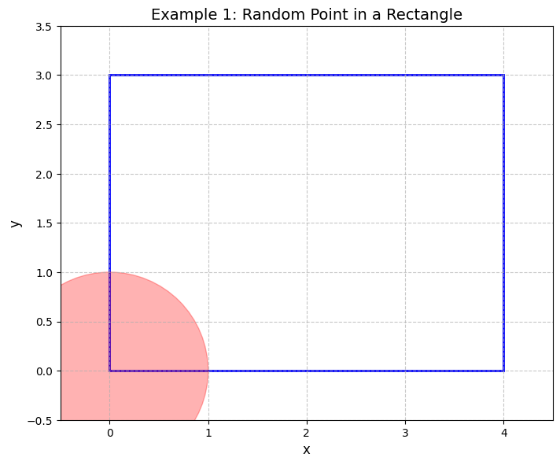
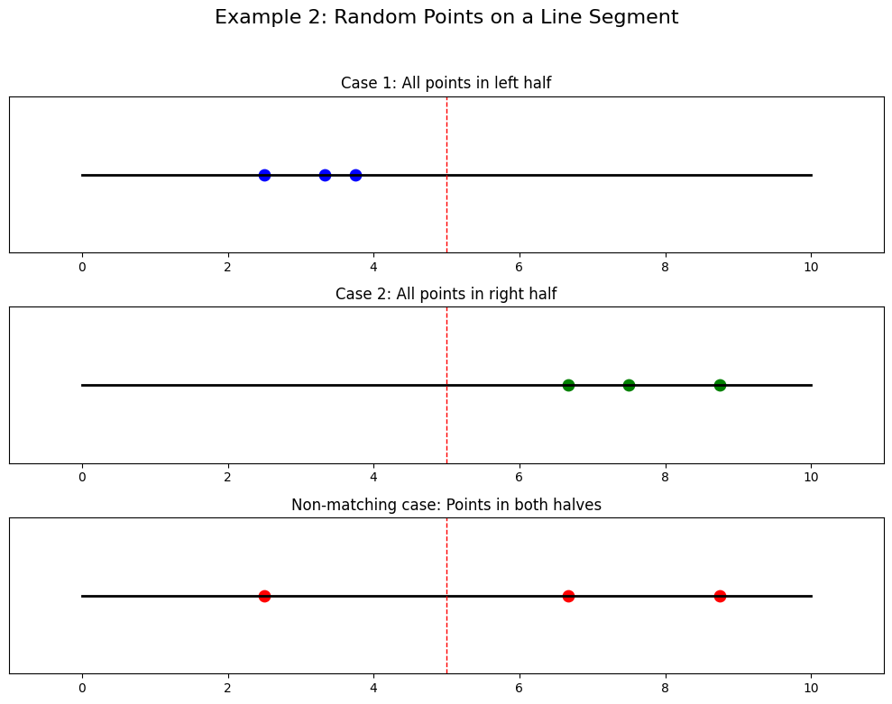
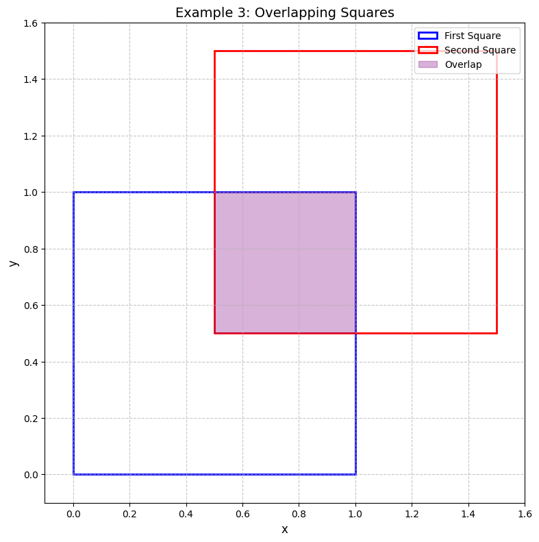
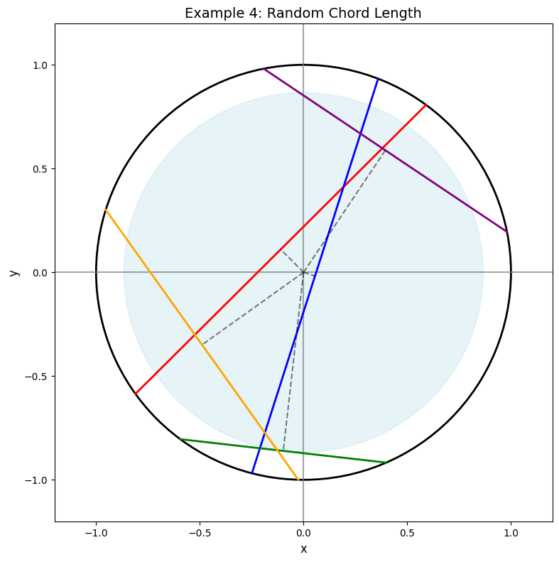
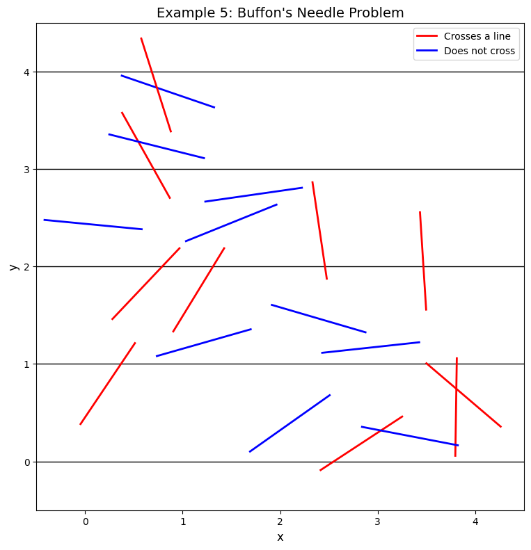

# Geometric Probability Examples in Machine Learning

This document provides examples of geometric probability concepts and their visualizations, illustrating the application of probability in spatial contexts.

## Key Concepts and Formulas

Geometric probability applies probability theory to geometric settings, where sample spaces have a geometric structure (areas, volumes, lengths, etc.).

### Important Concepts

- **Uniform Distribution**: Equal probability density throughout a geometric region
- **Area/Volume Ratio**: Probability often calculated as the ratio of favorable region to total region
- **Random Points/Lines/Shapes**: Geometric objects selected with uniform probability 
- **Intersections**: Probability of one geometric object intersecting or containing another

## Examples

The following examples demonstrate geometric probability concepts:

- **Random Point in a Rectangle**: Probability of a random point lying within a circle
- **Random Points on a Line Segment**: Probability of points being in the same half
- **Overlapping Squares**: Probability of a point being in the intersection of two squares
- **Random Chord Length**: Probability of a random chord being longer than a circle's radius
- **Buffon's Needle Problem**: Probability of a needle crossing parallel lines

### Example 1: Random Point in a Rectangle

#### Problem Statement
A point is selected uniformly at random within a rectangle with width 4 and height 3. What is the probability that the point lies within a circle of radius 1 centered at the origin?

#### Solution

##### Step 1: Calculate the areas
The area of the rectangle is:
$$A_{rectangle} = 4 \times 3 = 12 \text{ square units}$$

Since the circle is centered at the origin (corner of the rectangle), only a quarter of the circle is within the rectangle. The area of this quarter circle is:
$$A_{quarter\_circle} = \frac{\pi \times 1^2}{4} = \frac{\pi}{4} \approx 0.7854 \text{ square units}$$

##### Step 2: Calculate the probability
The probability is the ratio of the favorable area to the total area:
$$P = \frac{A_{quarter\_circle}}{A_{rectangle}} = \frac{0.7854}{12} \approx 0.06545$$

Therefore, the probability is approximately 6.545%.



### Example 2: Random Points on a Line Segment

#### Problem Statement
Three points are selected randomly and independently on a line segment of length L. What is the probability that all three points lie in the same half of the segment?

#### Solution

##### Step 1: Identify possible scenarios
For all three points to be in the same half, they must either all be in the left half or all be in the right half.

##### Step 2: Calculate the probabilities
The probability that a single point is in the left half is 0.5, and similarly for the right half.

For all three points to be in the left half:
$$P(\text{all in left half}) = 0.5^3 = 0.125$$

For all three points to be in the right half:
$$P(\text{all in right half}) = 0.5^3 = 0.125$$

##### Step 3: Find the total probability
$$P(\text{all in same half}) = P(\text{all in left half}) + P(\text{all in right half}) = 0.125 + 0.125 = 0.25$$

Therefore, the probability is 25%.



### Example 3: Overlapping Squares

#### Problem Statement
Two squares, each with side length 1, are positioned such that one corner of the second square is at the center of the first square. What is the probability that a point selected uniformly at random from the first square also lies within the second square?

#### Solution

##### Step 1: Calculate the areas
The area of the first square is:
$$A_{first} = 1 \times 1 = 1 \text{ square unit}$$

The overlapping region forms a smaller square with side length 0.5, so its area is:
$$A_{overlap} = 0.5 \times 0.5 = 0.25 \text{ square units}$$

##### Step 2: Calculate the probability
The probability is the ratio of the overlapping area to the area of the first square:
$$P = \frac{A_{overlap}}{A_{first}} = \frac{0.25}{1} = 0.25$$

Therefore, the probability is 25%.



### Example 4: Random Chord Length

#### Problem Statement
A chord is drawn randomly in a circle of radius R. What is the probability that the length of the chord is greater than the radius of the circle?

#### Solution

##### Step 1: Understand the geometric setup
The length of a chord depends on its distance from the center of the circle. If we pick a random point inside the circle and draw a chord perpendicular to the line connecting this point to the center, the chord's length is determined by the distance of this point from the center.

##### Step 2: Find the condition for a chord longer than the radius
A chord is longer than the radius R when its distance from the center is less than R/2. This can be proven using the Pythagorean theorem.

##### Step 3: Calculate the probability
The probability equals the ratio of the area where random points lead to chords longer than R to the total area of the circle:
$$P = \frac{\pi(R/\sqrt{2})^2}{\pi R^2} = \frac{1}{2} \times \frac{1}{1} = \frac{3}{4} = 0.75$$

Therefore, the probability is 75%.



### Example 5: Buffon's Needle Problem

#### Problem Statement
A needle of length L is dropped randomly onto a floor with parallel lines spaced a distance D apart (where D ≥ L). What is the probability that the needle will cross one of the lines?

#### Solution

##### Step 1: Analyze the geometric conditions
The probability of crossing depends on both the angle of the needle and its position relative to the nearest line. Let's analyze the case where L = D = 1.

##### Step 2: Derive the probability formula
The probability can be shown to be:
$$P = \frac{2L}{D\pi}$$

For our case with L = D = 1:
$$P = \frac{2 \times 1}{1 \times \pi} = \frac{2}{\pi} \approx 0.63662$$

##### Step 3: Verify with a Monte Carlo simulation
In a simulated experiment with 20 random needle drops, 10 needles crossed lines, giving an empirical probability of 0.5. This corresponds to an estimate of π ≈ 4, which differs from the true value due to the small sample size.

Therefore, the theoretical probability is approximately 63.662%.



## Key Insights

### Theoretical Insights
- Geometric probability often reduces to the ratio of favorable geometric measure (area, length, etc.) to total measure
- The uniform probability assumption is crucial in these problems
- Symmetry and geometric properties can be leveraged to simplify calculations

### Applications in Machine Learning
- Spatial sampling techniques for data augmentation
- Monte Carlo methods for approximating complex integrals
- Random projections for dimensionality reduction
- Uncertainty quantification in computer vision and robotics

### Interesting Connections
- Buffon's needle problem provides a method to estimate π experimentally
- Geometric probability forms the foundation for many sampling algorithms used in ML
- Spatial statistics and point process models build upon these concepts

## Running the Examples

You can run the code that generates these examples and visualizations using:

```bash
python3 ML_Obsidian_Vault/Lectures/2/Codes/1_geometric_probability_examples.py
```

## Related Topics

- [[L2_1_Examples|General Probability Examples]]: Broader probability concepts beyond geometric settings
- [[L2_1_Continuous_Probability_Examples|Continuous Probability Examples]]: Related continuous probability distributions
- [[L2_1_Combinatorial_Probability_Examples|Combinatorial Probability Examples]]: Counting-based probability problems
