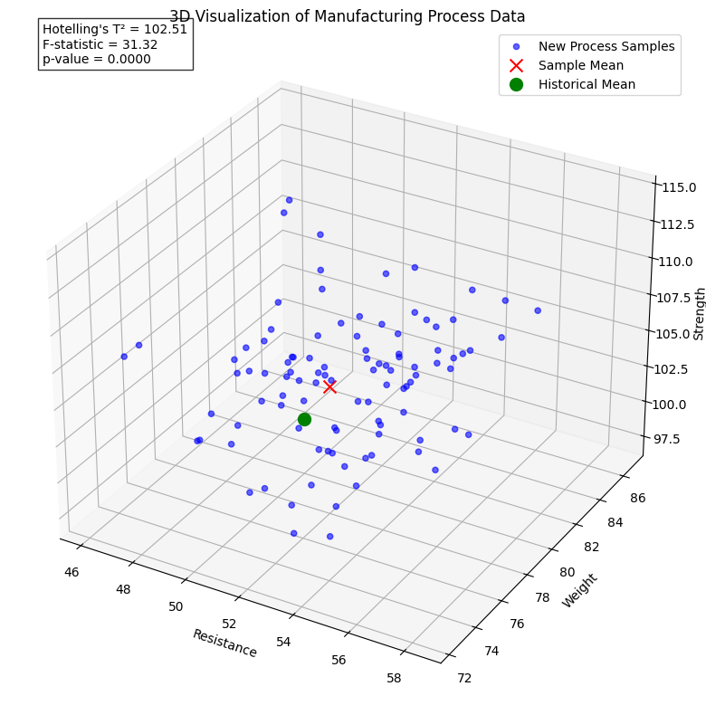
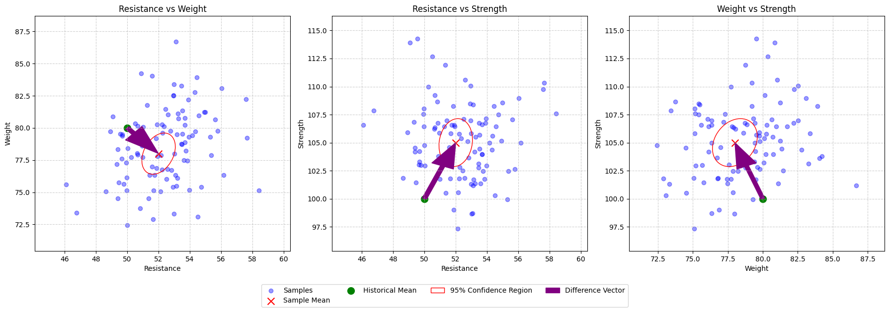
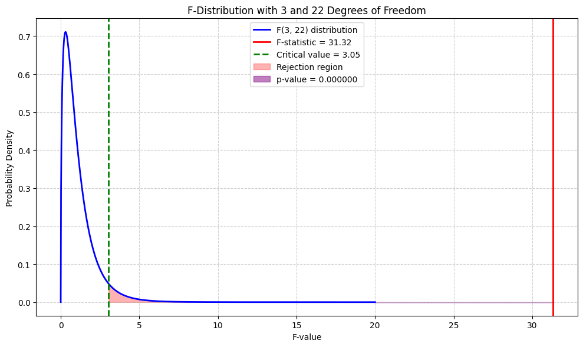
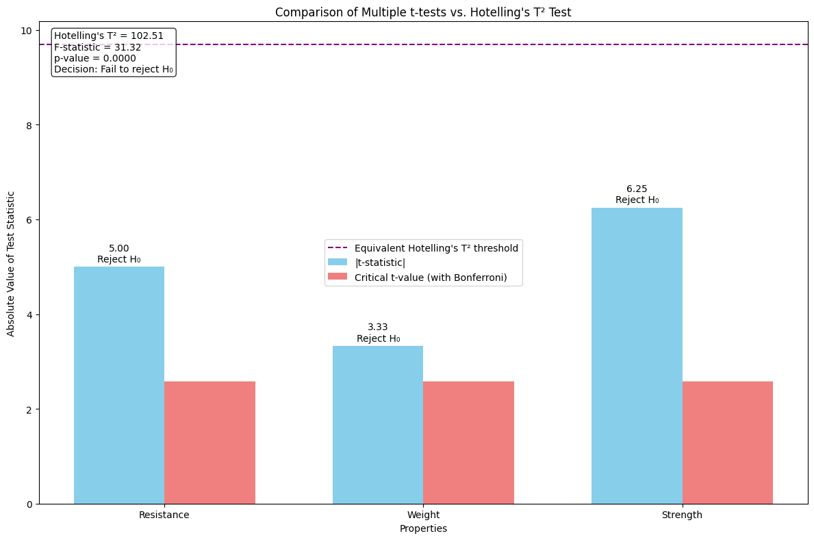

# Hotelling's T² Test Examples

This document provides practical examples of Hotelling's T² test, a multivariate generalization of the t-test that allows for simultaneous testing of multiple variables.

## Key Concepts and Formulas

Hotelling's T² test extends the univariate t-test to multivariate settings, allowing for hypothesis testing regarding mean vectors when multiple variables are involved.

### The Hotelling's T² Formula

For testing the hypothesis $H_0: \boldsymbol{\mu} = \boldsymbol{\mu}_0$ with a sample of size $n$, mean vector $\bar{\mathbf{x}}$, and sample covariance matrix $\mathbf{S}$, the Hotelling's T² statistic is:

$$T^2 = n \cdot (\bar{\mathbf{x}} - \boldsymbol{\mu}_0)^T \cdot \mathbf{S}^{-1} \cdot (\bar{\mathbf{x}} - \boldsymbol{\mu}_0)$$

Where:
- $\boldsymbol{\mu}_0$ = Hypothesized mean vector
- $\bar{\mathbf{x}}$ = Sample mean vector
- $\mathbf{S}$ = Sample covariance matrix
- $\mathbf{S}^{-1}$ = Inverse of the sample covariance matrix
- $n$ = Sample size

### Relation to F-Distribution

For statistical inference, the Hotelling's T² statistic is converted to an F-statistic:

$$F = \frac{n - p}{p(n - 1)} \cdot T^2$$

Where:
- $p$ = Number of variables
- $n$ = Sample size
- $T^2$ = Hotelling's T² statistic

This F-statistic follows an F-distribution with $p$ and $(n - p)$ degrees of freedom.

## Examples

The following examples demonstrate applications of Hotelling's T² test:

- **Manufacturing Process Comparison**: Testing for changes in product characteristics
- **Clinical Trials**: Comparing multiple health metrics between treatment groups
- **Market Research**: Analyzing changes in consumer preferences across multiple attributes

### Example 1: Manufacturing Process Evaluation

#### Problem Statement
A manufacturing company has implemented a new process for producing electronic components. They want to determine if the new process has changed the overall quality of the components. They measure three key properties (resistance, weight, and strength) for a sample of 25 components from the new process.

The sample mean vector is $\bar{\mathbf{x}} = \begin{bmatrix} 52 \\ 78 \\ 105 \end{bmatrix}$

The sample covariance matrix is:
$$\mathbf{S} = \begin{bmatrix} 
4 & 2 & 1 \\
2 & 9 & 3 \\
1 & 3 & 16
\end{bmatrix}$$

The historical (known) mean vector for the old process is $\boldsymbol{\mu}_0 = \begin{bmatrix} 50 \\ 80 \\ 100 \end{bmatrix}$

Test whether the new process has significantly changed the component properties at the 5% significance level.

In this example:
- We have measurements on 3 different properties (resistance, weight, strength)
- We want to test for changes in all properties simultaneously
- We need to account for correlations between the variables

#### Solution

Hotelling's T² test is the multivariate extension of the t-test, allowing for simultaneous testing of multiple variables.

##### Step 1: Define the Hypotheses
$H_0: \boldsymbol{\mu} = \boldsymbol{\mu}_0$ (No change in mean vector)
$H_1: \boldsymbol{\mu} \neq \boldsymbol{\mu}_0$ (Change in mean vector)

##### Step 2: Calculate Hotelling's T² Statistic
The Hotelling's T² statistic is defined as:
$$T^2 = n \cdot (\bar{\mathbf{x}} - \boldsymbol{\mu}_0)^T \cdot \mathbf{S}^{-1} \cdot (\bar{\mathbf{x}} - \boldsymbol{\mu}_0)$$

where $n = 25$ is the sample size.

First, calculate the difference vector:
$$\bar{\mathbf{x}} - \boldsymbol{\mu}_0 = \begin{bmatrix} 52 \\ 78 \\ 105 \end{bmatrix} - \begin{bmatrix} 50 \\ 80 \\ 100 \end{bmatrix} = \begin{bmatrix} 2 \\ -2 \\ 5 \end{bmatrix}$$

The inverse of the sample covariance matrix is:
$$\mathbf{S}^{-1} = \begin{bmatrix} 
0.282 & -0.061 & -0.006 \\
-0.061 & 0.132 & -0.021 \\
-0.006 & -0.021 & 0.067
\end{bmatrix}$$

Computing the T² statistic:
First, compute the vector-matrix product:
$$(\bar{\mathbf{x}} - \boldsymbol{\mu}_0)^T \cdot \mathbf{S}^{-1} = \begin{bmatrix} 2 & -2 & 5 \end{bmatrix} \cdot \mathbf{S}^{-1} = \begin{bmatrix} 0.653 & -0.489 & 0.363 \end{bmatrix}$$

Where:
- Component 1 = $2 \times 0.282 + (-2) \times (-0.061) + 5 \times (-0.006) = 0.653$
- Component 2 = $2 \times (-0.061) + (-2) \times 0.132 + 5 \times (-0.021) = -0.489$
- Component 3 = $2 \times (-0.006) + (-2) \times (-0.021) + 5 \times 0.067 = 0.363$

Now, compute the final product and multiply by $n = 25$:
$$T^2 = 25 \cdot (0.653 \times 2 + (-0.489) \times (-2) + 0.363 \times 5)$$
$$T^2 = 25 \cdot 4.100 = 102.505$$

##### Step 3: Convert to F-Statistic
For Hotelling's T² test with $p = 3$ variables and $n = 25$ observations, we convert to an F-statistic:

$$F = \frac{n - p}{p(n - 1)} \cdot T^2 = \frac{25 - 3}{3 \cdot (25 - 1)} \cdot 102.505 = \frac{22}{72} \cdot 102.505 = 31.32$$

##### Step 4: Determine the Critical Value
The critical value from the F-distribution with 3 and 22 degrees of freedom at $\alpha = 0.05$ is approximately 3.05.

##### Step 5: Make Decision
Since the calculated F-value (31.32) exceeds the critical value (3.05), we reject the null hypothesis.

The p-value for this test is essentially 0 (p < 0.000001), which is less than $\alpha = 0.05$.

##### Interpretation
There is significant evidence to conclude that the new manufacturing process has changed the overall properties of the electronic components. The simultaneous test of all three properties shows that the changes cannot be attributed to random variation.

The advantage of Hotelling's T² test over multiple univariate t-tests is that it accounts for the correlation structure among the measured properties and controls the overall Type I error rate. This means we have strong evidence that at least one property has changed, but we would need further analysis to determine exactly which properties are different and how.

### Example 2: Comparison with Multiple Individual T-Tests

#### Problem Statement
Using the same manufacturing data from Example 1, compare the results of Hotelling's T² test with those that would be obtained from conducting three separate univariate t-tests for each property. Explain the advantages of the multivariate approach.

#### Solution

##### Step 1: Calculate Individual T-Statistics
For each variable, we can compute a univariate t-statistic:

For resistance:
$$t_1 = \frac{\bar{x}_1 - \mu_{01}}{\sqrt{S_{11}/n}} = \frac{52 - 50}{\sqrt{4/25}} = \frac{2}{0.40} = 5.00$$

For weight:
$$t_2 = \frac{\bar{x}_2 - \mu_{02}}{\sqrt{S_{22}/n}} = \frac{78 - 80}{\sqrt{9/25}} = \frac{-2}{0.60} = -3.33$$

For strength:
$$t_3 = \frac{\bar{x}_3 - \mu_{03}}{\sqrt{S_{33}/n}} = \frac{105 - 100}{\sqrt{16/25}} = \frac{5}{0.80} = 6.25$$

##### Step 2: Apply the Bonferroni Correction
When conducting multiple tests, we need to adjust the significance level to control the family-wise error rate. Using the Bonferroni correction, the adjusted significance level for each test would be $\alpha' = 0.05/3 = 0.0167$.

The critical t-value with 24 degrees of freedom at $\alpha' = 0.0167$ is approximately 2.57.

##### Step 3: Compare Results

| Property | T-statistic | Critical Value | Decision |
|----------|-------------|----------------|----------|
| Resistance | 5.00 | 2.57 | Reject H₀ |
| Weight | -3.33 | 2.57 | Reject H₀ |
| Strength | 6.25 | 2.57 | Reject H₀ |

All individual t-tests lead to rejection of their respective null hypotheses, even after applying the Bonferroni correction.

##### Step 4: Compare with Hotelling's T² Results
Hotelling's T² test resulted in F = 31.32, which exceeds the critical value of 3.05, leading to rejection of the null hypothesis that all means are simultaneously equal to their target values.

##### Step 5: Analyze the Advantages of Hotelling's T² Test

1. **Control of Type I Error**: The Bonferroni correction is often too conservative, especially as the number of variables increases. Hotelling's T² maintains the correct significance level without being overly conservative.

2. **Accounts for Correlations**: The individual t-tests treat each property as independent, but we can see from the covariance matrix that they are correlated. Hotelling's T² accounts for these correlations.

3. **Power Advantage**: In general, Hotelling's T² has greater statistical power than multiple individual tests, particularly when the variables are correlated.

4. **Simplicity**: A single test provides a clear answer about whether the overall process has changed, rather than dealing with potentially conflicting results from multiple tests.

##### Interpretation
While both approaches lead to the same conclusion in this case, the Hotelling's T² test provides a more elegant and statistically sound framework for analyzing multivariate data. It properly accounts for the correlation structure and maintains appropriate control over the Type I error rate without sacrificing power.

In practice, one might first perform the Hotelling's T² test to determine if there is an overall change, and then follow up with individual t-tests (or other post-hoc tests) to identify which specific properties have changed and by how much. This two-stage approach provides a more comprehensive understanding of the data while maintaining statistical rigor.

## Key Insights

### Theoretical Insights
- Hotelling's T² is a direct multivariate extension of the univariate t-statistic
- The test accounts for correlations between variables, unlike multiple individual t-tests
- The F-transformation allows for determination of critical values and p-values
- As the number of variables increases, more samples are needed for reliable inference

### Practical Applications
- Quality control in manufacturing processes
- Clinical trials with multiple outcome measures
- Psychological research with multiple related dependent variables
- Market research analyzing multiple product attributes
- Environmental monitoring with multiple correlated measurements

### Common Pitfalls
- Requires more observations than variables for the covariance matrix to be invertible
- Assumes multivariate normality of the data
- Sensitive to outliers that can distort both means and covariance structures
- May be less interpretable than univariate tests when trying to communicate specific effects
- Post-hoc testing is often needed to determine which specific variables differ

## Related Topics
- [[L2_1_Mean_Covariance|Mean Vector and Covariance Matrix]]: Fundamental statistics used in Hotelling's T² test
- [[L2_1_Mahalanobis_Distance|Mahalanobis Distance]]: The squared Mahalanobis distance is closely related to the T² statistic
- [[L3_3_Multivariate_Regression|Multivariate Regression]]: Hotelling's T² can be used for testing coefficients in multivariate regression 