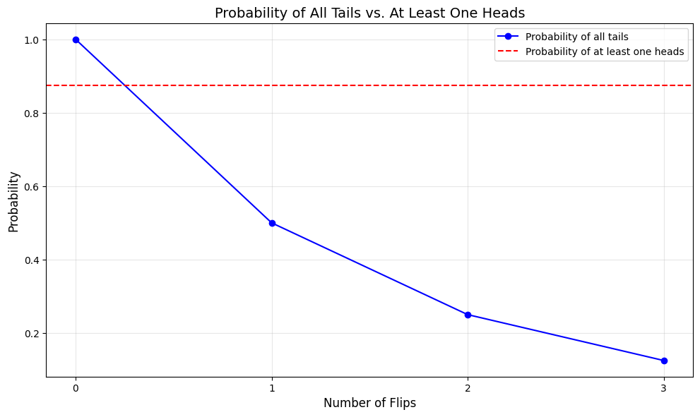
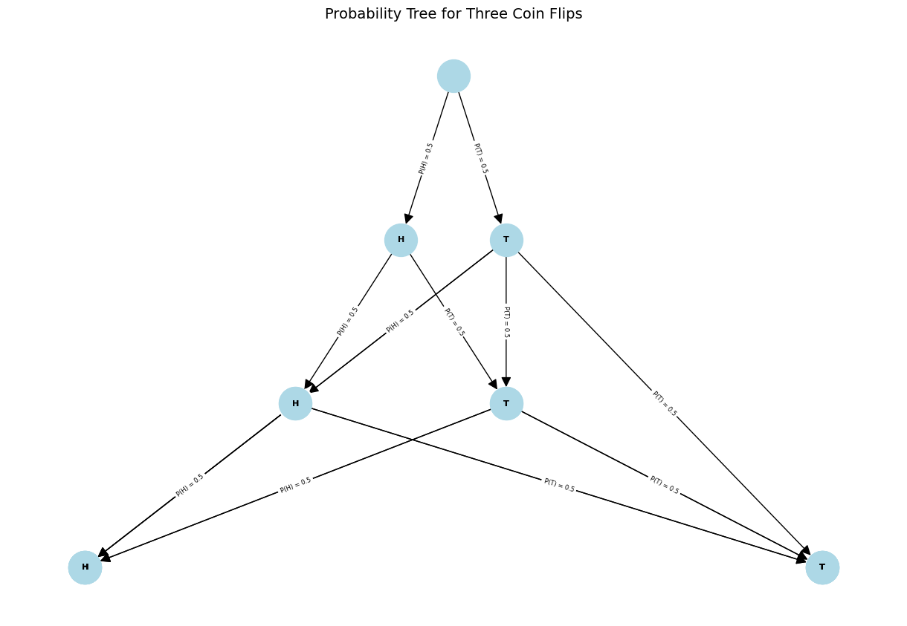
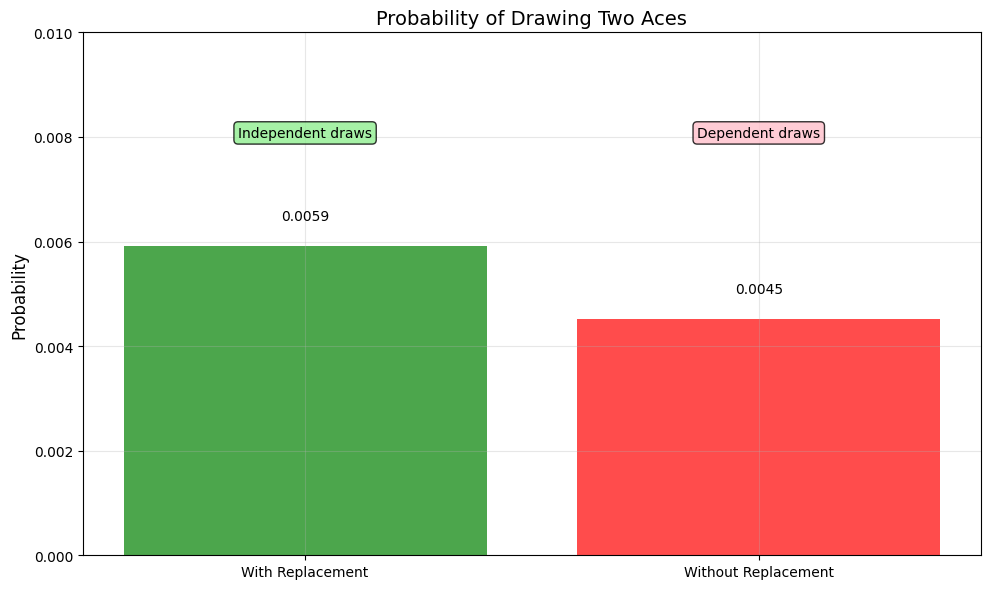
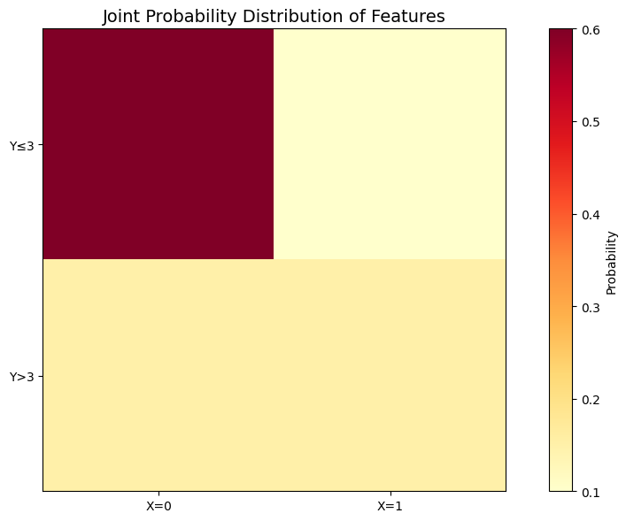

# Independence Examples

This document provides practical examples of independence in probability for various scenarios, illustrating the concept of independence between events and random variables and its significance in machine learning and data analysis contexts.

## Key Concepts and Formulas

Independence is a fundamental concept in probability theory that describes situations where the occurrence of one event does not affect the probability of another event. Two events $A$ and $B$ are independent if and only if their joint probability equals the product of their individual probabilities.

### Independence Formulas

For two events $A$ and $B$:
$$P(A \cap B) = P(A) \cdot P(B)$$

For three events $A$, $B$, and $C$ to be mutually independent:
$$P(A \cap B \cap C) = P(A) \cdot P(B) \cdot P(C)$$

For random variables $X$ and $Y$ to be independent:
$$P(X = x, Y = y) = P(X = x) \cdot P(Y = y)$$

Or equivalently for continuous random variables:
$$F_{X,Y}(x,y) = F_X(x) \cdot F_Y(y)$$

Where:
- $P(A \cap B)$ = Probability of both events $A$ and $B$ occurring
- $F_{X,Y}(x,y)$ = Joint cumulative distribution function 
- $F_X(x)$ and $F_Y(y)$ = Marginal cumulative distribution functions

## Examples

The following examples demonstrate independence in probability:

- **Coin Flips**: Independence between multiple flips
- **Card Drawing**: With and without replacement scenarios
- **Feature Independence**: Machine learning feature considerations

### Example 1: Independence in Coin Flips

#### Problem Statement
Consider flipping a fair coin three times in succession. Are the outcomes of these flips independent? What is the probability of getting at least one heads in the three flips?

In this example:
- We have a fair coin with $P(H) = P(T) = \frac{1}{2}$
- We flip the coin three times
- We need to determine if the flips are independent and calculate $P(\text{at least one heads})$

#### Solution

##### Step 1: Verify independence
For the flips to be independent, the outcome of one flip should not affect the others. Since each flip is a separate physical action, and the coin has no "memory" of previous flips, the flips are indeed independent.

We can verify mathematically:
- $P(\text{2nd flip is H} \mid \text{1st flip is H}) = \frac{1}{2} = P(\text{2nd flip is H})$
- $P(\text{3rd flip is H} \mid \text{1st and 2nd flips are H}) = \frac{1}{2} = P(\text{3rd flip is H})$

Since the conditional probabilities equal the unconditional probabilities, the flips are independent.

##### Step 2: Calculate the probability of at least one heads
We can calculate this using the complement rule:
$$P(\text{at least one heads}) = 1 - P(\text{no heads}) = 1 - P(\text{all tails})$$

Since the flips are independent:
$$P(\text{all tails}) = P(T) \cdot P(T) \cdot P(T) = \frac{1}{2} \cdot \frac{1}{2} \cdot \frac{1}{2} = \frac{1}{8} = 0.125$$

Therefore:
$$P(\text{at least one heads}) = 1 - \frac{1}{8} = \frac{7}{8} = 0.875$$

The probability of getting at least one heads in three coin flips is $\frac{7}{8}$ or 87.5%.



##### Probability Tree Representation
The following tree diagram shows all possible outcomes and their probabilities:



### Example 2: Independence in Card Drawing

#### Problem Statement
Two cards are drawn from a standard deck of 52 cards. Are the two draws independent if:
a) The first card is replaced before drawing the second card?
b) The first card is not replaced before drawing the second card?

What is the probability of drawing two aces in each scenario?

#### Solution

##### Step 1: Analyze drawing with replacement (case a)
When the first card is replaced before drawing the second, each draw is made from the same deck of 52 cards with the same probabilities. The outcome of the first draw does not affect the second draw.

- $P(\text{1st card is an ace}) = \frac{4}{52} = \frac{1}{13} \approx 0.0769$
- $P(\text{2nd card is an ace} \mid \text{1st card is an ace}) = \frac{4}{52} = \frac{1}{13} \approx 0.0769$

Since $P(\text{2nd card is an ace} \mid \text{1st card is an ace}) = P(\text{2nd card is an ace})$, the draws are independent.

The probability of drawing two aces is:
$$P(\text{two aces}) = P(\text{1st ace}) \cdot P(\text{2nd ace}) = \frac{4}{52} \cdot \frac{4}{52} = \frac{1}{169} \approx 0.00592$$

##### Step 2: Analyze drawing without replacement (case b)
When the first card is not replaced, the second draw is made from a deck of 51 cards. The probability of the second card depends on what was drawn first.

- $P(\text{1st card is an ace}) = \frac{4}{52} = \frac{1}{13} \approx 0.0769$
- $P(\text{2nd card is an ace} \mid \text{1st card is an ace}) = \frac{3}{51} = \frac{1}{17} \approx 0.0588$

Since $P(\text{2nd card is an ace} \mid \text{1st card is an ace}) \neq P(\text{2nd card is an ace})$, the draws are not independent.

The probability of drawing two aces is:
$$P(\text{two aces}) = P(\text{1st ace}) \cdot P(\text{2nd ace} \mid \text{1st ace}) = \frac{4}{52} \cdot \frac{3}{51} = \frac{12}{2652} = \frac{1}{221} \approx 0.00452$$

##### Step 3: Compare the two scenarios
In scenario (a) with replacement (independent draws), the probability is $\frac{1}{169} \approx 0.00592$.
In scenario (b) without replacement (dependent draws), the probability is $\frac{1}{221} \approx 0.00452$.

The probability is higher in the independent case (with replacement) because after drawing an ace in the first draw, there are still 4 aces in the deck for the second draw, rather than just 3 aces in the dependent case.



### Example 3: Independence in Machine Learning Features

#### Problem Statement
Consider a machine learning model for predicting whether an email is spam. Two features are:
$X$ = Presence of the word "free" (1 if present, 0 if absent)
$Y$ = Number of exclamation marks in the email

From historical data, we observe:
- $P(X=1) = 0.3$ (30% of emails contain "free")
- $P(Y>3) = 0.25$ (25% of emails have more than 3 exclamation marks)
- $P(X=1, Y>3) = 0.15$ (15% of emails have both "free" and more than 3 exclamation marks)

Are these features independent? How might this affect a Naive Bayes classifier?

#### Solution

##### Step 1: Check the independence condition
For independence, we need:
$$P(X=1, Y>3) = P(X=1) \cdot P(Y>3)$$

Let's calculate:
$$P(X=1) \cdot P(Y>3) = 0.3 \cdot 0.25 = 0.075$$

But we're given that $P(X=1, Y>3) = 0.15$

Since $0.15 \neq 0.075$, these features are not independent.

##### Step 2: Analyze the implication
Since $P(X=1, Y>3) > P(X=1) \cdot P(Y>3)$, these features are positively correlated. Emails with "free" are more likely to have multiple exclamation marks than would be expected if the features were independent.

##### Step 3: Consider the impact on Naive Bayes
The Naive Bayes classifier assumes feature independence given the class. When features are not independent (as in this case), the model's probability estimates may be inaccurate.

For example, if both "free" and multiple exclamation marks are observed in an email, a Naive Bayes classifier would multiply their individual contributions to the spam probability, potentially overestimating the combined evidence for spam.

#### Joint Probability Distribution
- $P(X=0, Y\leq3) = 0.60$
- $P(X=1, Y\leq3) = 0.10$
- $P(X=0, Y>3) = 0.15$
- $P(X=1, Y>3) = 0.15$

Expected if independent: 0.075



## Key Insights

### Theoretical Insights
- Independence means the joint probability equals the product of individual probabilities
- Independence between more than two events requires pairwise and joint independence
- Conditional independence means events are independent given some condition

### Practical Applications
- Independence assumptions simplify many probability calculations
- Naive Bayes classifiers rely on feature independence assumptions
- Many statistical tests assume independence of observations

### Common Pitfalls
- Confusing independence with mutual exclusivity
- Assuming independence without verification
- Overlooking conditional dependence in seemingly independent scenarios

## Running the Examples

You can run the code that generates the probability examples and visualizations using:

```bash
python3 ML_Obsidian_Vault/Lectures/2/Codes/1_independence_examples.py
```

## Related Topics

- [[L2_1_Basic_Probability|Basic Probability]]: Foundation concepts for probability theory
- [[L2_1_Conditional_Probability_Examples|Conditional Probability Examples]]: Contrasting examples of dependent events
- [[L2_1_Joint_Probability_Examples|Joint Probability Examples]]: Working with multiple events simultaneously 