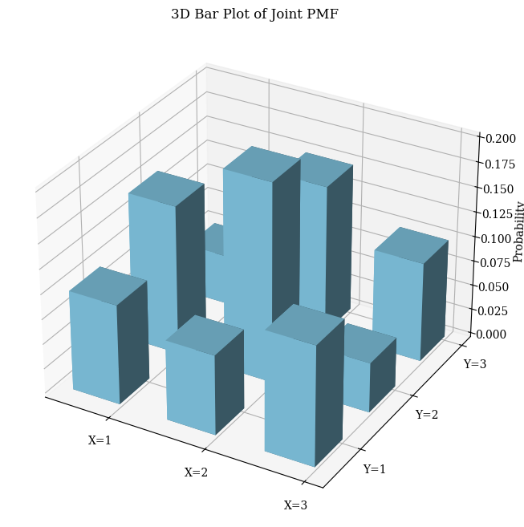
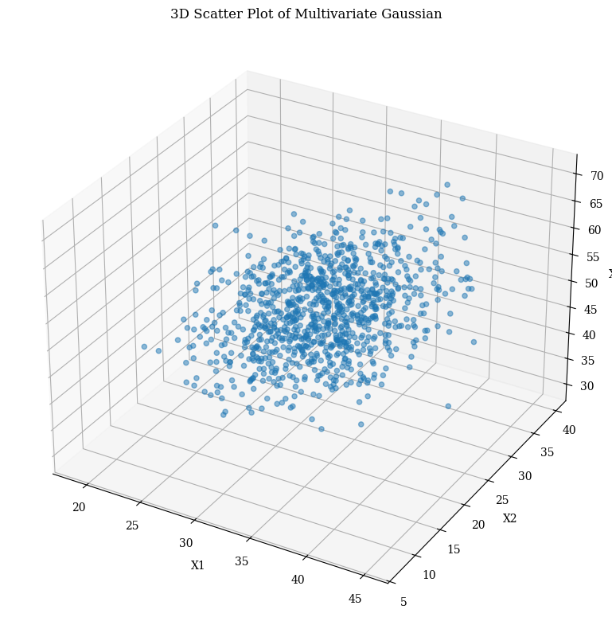

# Joint Distributions Examples

This document provides practical examples of joint distributions for various scenarios, illustrating the concept of joint probability distributions and their significance in machine learning and data analysis contexts.

## Key Concepts and Formulas

Joint distributions describe the probability of two or more random variables occurring simultaneously. They are fundamental in understanding relationships between variables and are crucial for multivariate analysis.

### Key Formulas

For discrete random variables:
$$P(X = x, Y = y) = P(X = x | Y = y) \cdot P(Y = y)$$

For continuous random variables:
$$f_{X,Y}(x,y) = f_{X|Y}(x|y) \cdot f_Y(y)$$

Where:
- $P(X = x, Y = y)$ = Joint probability mass function
- $f_{X,Y}(x,y)$ = Joint probability density function
- $P(X = x | Y = y)$ = Conditional probability
- $f_{X|Y}(x|y)$ = Conditional density function

## Examples

The following examples demonstrate joint distributions:

- **Discrete Joint Distribution**: Basic joint PMF with marginal distributions
- **Bivariate Normal Distribution**: Continuous joint distribution with correlation
- **Conditional Distribution**: Finding conditional probabilities
- **Conditional Expectation**: Calculating expected values given conditions
- **Testing Independence**: Determining if variables are independent
- **Generating Correlated Variables**: Creating correlated random variables
- **Random Vector Transformation**: Linear transformations of random vectors
- **Multivariate Gaussian**: Higher-dimensional joint distribution

### Example 1: Discrete Joint Distribution

#### Problem Statement
Consider two discrete random variables $X$ and $Y$ with the following joint probability mass function:

|       | $Y=1$ | $Y=2$ | $Y=3$ |
|-------|-------|-------|-------|
| **$X=1$** | 0.10 | 0.08 | 0.12 |
| **$X=2$** | 0.15 | 0.20 | 0.05 |
| **$X=3$** | 0.05 | 0.15 | 0.10 |

Find:
1. Marginal distributions of $X$ and $Y$
2. $P(X=2, Y=2)$
3. $P(X > 1, Y < 3)$

#### Solution

##### Step 1: Find Marginal Distributions
The marginal distribution of $X$ is obtained by summing across rows:
- $P(X=1) = 0.10 + 0.08 + 0.12 = 0.30$
- $P(X=2) = 0.15 + 0.20 + 0.05 = 0.40$
- $P(X=3) = 0.05 + 0.15 + 0.10 = 0.30$

The marginal distribution of $Y$ is obtained by summing down columns:
- $P(Y=1) = 0.10 + 0.15 + 0.05 = 0.30$
- $P(Y=2) = 0.08 + 0.20 + 0.15 = 0.43$
- $P(Y=3) = 0.12 + 0.05 + 0.10 = 0.27$

##### Step 2: Find $P(X=2, Y=2)$
Directly from the table:
$P(X=2, Y=2) = 0.20$

##### Step 3: Calculate $P(X > 1, Y < 3)$
This is the sum of probabilities where $X > 1$ and $Y < 3$:
$P(X > 1, Y < 3) = 0.15 + 0.20 + 0.05 + 0.15 = 0.55$

### Visualization
The joint PMF is visualized using a 3D bar plot, where:
- X and Y axes represent the possible outcomes of the two dice
- Z axis represents the probability of each outcome
- Each bar's height corresponds to the joint probability P(X=x, Y=y)
- The uniform distribution is clearly visible with all bars having equal height


*Figure 1: Heatmap visualization of the joint probability mass function. The color intensity represents the probability values.*



*Figure 2: 3D bar plot of the joint probability mass function showing the probability of each outcome combination.*


*Figure 3: Bar plots showing the marginal distributions of X and Y. The left plot shows P(X) and the right plot shows P(Y).*

### Example 2: Bivariate Normal Distribution

#### Problem Statement
Two variables $X$ and $Y$ follow a bivariate normal distribution with:
- $\mu_X = 5$
- $\mu_Y = 10$
- $\sigma_X = 2$
- $\sigma_Y = 3$
- $\rho = 0.7$

Find:
1. The covariance between $X$ and $Y$
2. $P(X < 6, Y < 12)$

#### Solution

##### Step 1: Calculate Covariance
The covariance is given by:
$\text{Cov}(X,Y) = \rho\sigma_X\sigma_Y = 0.7 \times 2 \times 3 = 4.2$

##### Step 2: Calculate $P(X < 6, Y < 12)$
Using the multivariate normal CDF:
$P(X < 6, Y < 12) \approx 0.6114$

### Visualization
The bivariate normal distribution is visualized using:
1. A 3D surface plot showing the probability density function
2. A 2D contour plot showing the probability density contours
3. A correlation ellipse showing the 95% confidence region
   - The ellipse's orientation indicates the correlation between X and Y
   - The major and minor axes lengths correspond to the standard deviations


*Figure 4: 3D surface plot and contour plot of the bivariate normal distribution.*


*Figure 5: Correlation ellipse showing the 95% confidence region for the bivariate normal distribution.*


*Figure 6: Scatter plot of samples from the bivariate normal distribution, showing the correlation between X and Y.*

### Example 3: Conditional Distribution

#### Problem Statement
Using the joint PMF from Example 1, find the conditional probability mass function of $X$ given $Y=2$.

#### Solution

##### Step 1: Find $P(Y=2)$
From the marginal distribution: $P(Y=2) = 0.43$

##### Step 2: Calculate Conditional Probabilities
Using the formula $P(X|Y=2) = P(X,Y=2)/P(Y=2)$:
- $P(X=1|Y=2) = 0.08/0.43 = 0.186$
- $P(X=2|Y=2) = 0.20/0.43 = 0.465$
- $P(X=3|Y=2) = 0.15/0.43 = 0.349$

### Visualization
The conditional distribution is visualized using:
1. A 3D surface plot showing the conditional probability surface
2. The surface demonstrates how the probability changes based on the conditioning variable
3. The conditional expectation is shown as a line on the surface


*Figure 7: Comparison of marginal and conditional distributions. The blue bars show P(X) and the red bars show P(X|Y=2).*


*Figure 8: 3D surface plot showing the conditional probability P(X|Y) for all values of X and Y.*


*Figure 9: Line plot showing multiple conditional distributions P(X|Y) for different values of Y.*

### Example 4: Conditional Expectation

#### Problem Statement
Find the expected value of $X$ given $Y=3$ and $Y$ given $X=1$ using the joint PMF from Example 1.

#### Solution

##### Step 1: Calculate $E[X|Y=3]$
$E[X|Y=3] = 1.926$

##### Step 2: Calculate $E[Y|X=1]$
$E[Y|X=1] = 2.067$

### Visualization
The conditional expectation is visualized using:
1. A regression surface showing the expected values
2. The surface demonstrates the linear relationship between X and Y
3. The conditional expectation line is shown on the surface


*Figure 10: Bar plots showing the conditional expectations with their expected values marked.*


*Figure 11: Regression line showing the relationship between X and the conditional expectation E[Y|X].*


*Figure 12: 3D visualization of the regression surface showing how the conditional expectation changes as a function of the conditioning variables.*

### Example 5: Testing Independence

#### Problem Statement
Determine whether $X$ and $Y$ are independent random variables using the joint PMF from Example 1.

#### Solution

##### Step 1: Check Independence
For independence, $P(X,Y)$ must equal $P(X)P(Y)$ for all combinations. Testing each combination:

| $X,Y$ | $P(X,Y)$ | $P(X)P(Y)$ | Independent? |
|-------|----------|------------|--------------|
| 1,1   | 0.10     | 0.09       | No           |
| 1,2   | 0.08     | 0.13       | No           |
| 1,3   | 0.12     | 0.08       | No           |
| ...   | ...      | ...        | No           |

Since $P(X,Y) \neq P(X)P(Y)$ for at least one combination, $X$ and $Y$ are not independent.

##### Step 2: Calculate Covariance
$E[X] = 2.00$
$E[Y] = 1.97$
$E[XY] = 3.97$
$\text{Cov}(X,Y) = E[XY] - E[X]E[Y] = 0.03$

### Visualization
The independence test is visualized using:
1. A bar plot comparing observed and expected probabilities
2. The chi-square statistic is shown in the title
3. The visualization helps understand the deviation from independence


*Figure 13: Bar plot comparing observed and expected probabilities under independence.*


*Figure 14: Heatmaps comparing the joint PMF (left) with the product of marginals (right). The differences between these plots indicate dependence between X and Y.*


*Figure 15: Scatter plot of samples from the joint distribution, showing the relationship between X and Y.*

### Example 6: Generating Correlated Random Variables

#### Problem Statement
Generate bivariate data $(X,Y)$ with:
- $X \sim N(0,1)$
- $Y \sim N(0,1)$
- $\rho = 0.8$

#### Solution

##### Step 1: Generate Variables
Using the transformation method:
1. Generate independent standard normal variables $Z_1$ and $Z_2$
2. Set $X = Z_1$
3. Set $Y = \rho Z_1 + \sqrt{1-\rho^2}Z_2$

The sample correlation was found to be 0.7921, close to the target of 0.8.


*Figure 16: Scatter plot and 2D histogram of the generated correlated random variables, showing the specified correlation structure.*


*Figure 17: Heatmap of the correlation matrix between X and Y, showing the specified correlation coefficient of 0.8.*

### Example 7: Random Vector Transformation

#### Problem Statement
Transform $X$ and $Y$ to $U = 2X + Y$ and $V = X - Y$, given:
- $E[X] = 3$
- $E[Y] = 2$
- $\text{Var}(X) = 4$
- $\text{Var}(Y) = 9$
- $\text{Cov}(X,Y) = 2$

#### Solution

##### Step 1: Calculate Means
$E[U] = 2E[X] + E[Y] = 2\times3 + 2 = 8$
$E[V] = E[X] - E[Y] = 3 - 2 = 1$

##### Step 2: Calculate Variances
$\text{Var}(U) = 4\text{Var}(X) + \text{Var}(Y) + 2\times2\times1\times\text{Cov}(X,Y) = 4\times4 + 9 + 4\times2 = 33$
$\text{Var}(V) = \text{Var}(X) + \text{Var}(Y) - 2\text{Cov}(X,Y) = 4 + 9 - 2\times2 = 9$

##### Step 3: Calculate Covariance
$\text{Cov}(U,V) = 2\text{Var}(X) - \text{Var}(Y) - \text{Cov}(X,Y) = 2\times4 - 9 - 2 = -3$


*Figure 18: Scatter plots showing the original variables (X,Y) and their transformed versions (U,V). The transformation preserves the relationship between the variables while changing their scale and orientation.*


*Figure 19: Visualization of the transformation path from original to transformed variables, showing how each point is mapped through the linear transformation.*

### Example 8: Multivariate Gaussian

#### Problem Statement
Consider three facial measurements (in millimeters):
- $X_1$: Distance between eyes
- $X_2$: Width of nose
- $X_3$: Width of mouth

Given:
- Mean vector: $[32, 25, 50]$
- Covariance matrix: $\begin{bmatrix} 16 & 4 & 6 \\ 4 & 25 & 10 \\ 6 & 10 & 36 \end{bmatrix}$

Find:
1. The multivariate Gaussian PDF
2. The marginal distribution of $X_1$
3. The conditional distribution of $X_1$ given $X_2=30, X_3=45$

#### Solution

##### Step 1: Write the Multivariate Gaussian PDF
$$f(x) = (2\pi)^{-n/2} |\Sigma|^{-1/2} \exp\left(-\frac{1}{2} (x-\mu)^T \Sigma^{-1} (x-\mu)\right)$$
where $n = 3$, $\mu = [32, 25, 50]$, $\Sigma$ = given covariance matrix

##### Step 2: Find Marginal Distribution of $X_1$
$X_1 \sim N(\mu_1, \sigma_1^2) = N(32, 16)$

##### Step 3: Find Conditional Distribution
$X_1|(X_2=30, X_3=45) \sim N(31.84, 14.75)$


*Figure 20: 3D visualization of the multivariate Gaussian distribution showing the relationship between the three facial measurements.*



*Figure 21: 3D scatter plot of samples from the multivariate Gaussian distribution, showing the correlation structure between the three variables.*

### Example 9: Simple Pen-and-Paper Example

#### Problem Statement
Consider two fair coins. Let X be the number of heads on the first coin, and Y be the number of heads on the second coin.

Find:
1. The joint probability mass function
2. The marginal distributions
3. Are X and Y independent?

#### Solution

##### Step 1: Find Joint PMF
Since both coins are fair and independent, each outcome has probability 0.25:

|       | $Y=0$ | $Y=1$ |
|-------|-------|-------|
| **$X=0$** | 0.25 | 0.25 |
| **$X=1$** | 0.25 | 0.25 |

##### Step 2: Find Marginal Distributions
The marginal distribution of X:
- $P(X=0) = 0.25 + 0.25 = 0.50$
- $P(X=1) = 0.25 + 0.25 = 0.50$

The marginal distribution of Y:
- $P(Y=0) = 0.25 + 0.25 = 0.50$
- $P(Y=1) = 0.25 + 0.25 = 0.50$

##### Step 3: Check Independence
For all combinations of X and Y:
$P(X,Y) = P(X)P(Y) = 0.25$

Since this holds for all combinations, X and Y are independent.


*Figure 22: Visualization of the joint PMF (left) and scatter plot of samples (right) for two independent fair coins. The uniform distribution in the heatmap and the random scatter pattern both indicate independence between X and Y.*

## Key Insights

### Theoretical Insights
- Joint distributions provide complete information about the relationship between random variables
- Marginal distributions can be obtained by summing/integrating over other variables
- Conditional distributions show how one variable behaves given specific values of others
- Independence can be tested by comparing joint probabilities to products of marginals

### Practical Applications
- Joint distributions are essential for multivariate analysis
- Bivariate normal distributions are commonly used in statistical modeling
- Conditional distributions are crucial for prediction and inference
- Transformations of random vectors are important in feature engineering

### Common Pitfalls
- Assuming independence without verification
- Confusing joint and conditional probabilities
- Neglecting to check the validity of distribution assumptions
- Forgetting to consider the full joint distribution when making inferences

## Running the Examples

You can run the code that generates these examples and visualizations using:

```bash
python3 ML_Obsidian_Vault/Lectures/2/Codes/1_joint_distributions_examples.py
```
