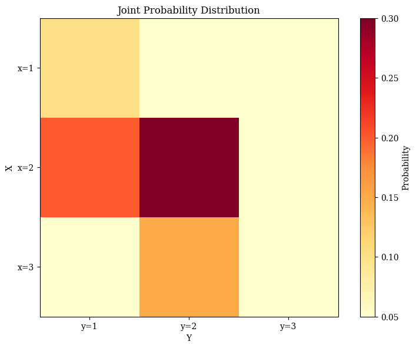

# Joint Probability Examples

This document provides practical examples of joint probability for various scenarios, illustrating the concept of probability for multiple events occurring together and its significance in machine learning and data analysis contexts.

## Key Concepts and Formulas

Joint probability measures the likelihood of two or more events occurring simultaneously. It's a fundamental concept in probability theory and forms the basis for many machine learning algorithms that deal with relationships between variables.

### Key Joint Probability Formulas

For two events $A$ and $B$:
$$P(A \cap B) = P(A,B)$$

For independent events:
$$P(A \cap B) = P(A) \cdot P(B)$$

For dependent events:
$$P(A \cap B) = P(A) \cdot P(B|A) = P(B) \cdot P(A|B)$$

For multiple events:
$$P(A_1 \cap A_2 \cap \cdots \cap A_n) = P(A_1) \cdot P(A_2|A_1) \cdot \cdots \cdot P(A_n|A_1, A_2, \ldots, A_{n-1})$$

Where:
- $P(A \cap B)$ or $P(A,B)$ = Joint probability of events $A$ and $B$ occurring
- $P(B|A)$ = Conditional probability of $B$ given $A$
- $P(A|B)$ = Conditional probability of $A$ given $B$

## Examples

The following examples demonstrate joint probability:

- **Basic Joint Probability**: Simple examples with events
- **Multiple Events**: Calculating probabilities for three or more events
- **Joint Probabilities for Random Variables**: Working with multiple random variables

### Example 1: Basic Joint Probability

#### Problem Statement
A company has collected data on their employees' education levels and positions. Of their 200 employees:
- 80 have a graduate degree
- 120 have a management position
- 60 have both a graduate degree and a management position

What is the joint probability that a randomly selected employee has both a graduate degree and a management position?

#### Solution

##### Step 1: Define the events
Let's define:
- $G$ = Employee has a graduate degree
- $M$ = Employee has a management position

##### Step 2: Calculate the individual probabilities
$$P(G) = \frac{80}{200} = 0.40$$
$$P(M) = \frac{120}{200} = 0.60$$

##### Step 3: Calculate the joint probability
$$P(G \cap M) = \frac{60}{200} = 0.30$$

Therefore, the joint probability that a randomly selected employee has both a graduate degree and a management position is 0.30 or 30%.


*Figure 1: Venn diagram showing the relationship between employees with graduate degrees (blue) and management positions (orange). The intersection represents employees with both qualifications.*

##### Step 4: Check for independence
If $G$ and $M$ were independent, we would have:
$$P(G \cap M) = P(G) \cdot P(M) = 0.40 \cdot 0.60 = 0.24$$

Since $0.30 \neq 0.24$, the events are not independent. In fact, $P(G \cap M) > P(G) \cdot P(M)$, indicating a positive correlation between having a graduate degree and holding a management position.


*Figure 2: Bar chart comparing the actual joint probability with the expected probability under independence.*

### Example 2: Multiple Event Joint Probability

#### Problem Statement
A researcher is studying the genetics of a particular plant species. For a specific gene, there are three variants (alleles): A, B, and C. In a population of plants:
- $P(A) = 0.40$ (40% have allele A)
- $P(B) = 0.35$ (35% have allele B)
- $P(C) = 0.25$ (25% have allele C)
- $P(A \cap B) = 0.15$ (15% have both A and B)
- $P(A \cap C) = 0.10$ (10% have both A and C)
- $P(B \cap C) = 0.05$ (5% have both B and C)
- $P(A \cap B \cap C) = 0.02$ (2% have all three alleles)

What is the probability that a randomly selected plant has at least one of these alleles?

#### Solution

##### Step 1: Define the events
- $A$ = Plant has allele A
- $B$ = Plant has allele B
- $C$ = Plant has allele C

We need to find $P(A \cup B \cup C)$, the probability of having at least one of the alleles.

##### Step 2: Use the inclusion-exclusion principle
The inclusion-exclusion principle for three events states:
$$P(A \cup B \cup C) = P(A) + P(B) + P(C) - P(A \cap B) - P(A \cap C) - P(B \cap C) + P(A \cap B \cap C)$$

##### Step 3: Substitute the values
$$\begin{align*}
P(A \cup B \cup C) &= 0.40 + 0.35 + 0.25 - 0.15 - 0.10 - 0.05 + 0.02 \\
&= 0.72
\end{align*}$$

Therefore, the probability that a randomly selected plant has at least one of the alleles is 0.72 or 72%.


*Figure 3: Venn diagram showing the relationship between plants with alleles A (blue), B (orange), and C (green). The intersections represent plants with multiple alleles.*

##### Summary of Probabilities for Plant Genetics:
- Individual probabilities:
  - $P(A) = 0.40$ (allele A)
  - $P(B) = 0.35$ (allele B)
  - $P(C) = 0.25$ (allele C)
- Pairwise intersections:
  - $P(A \cap B) = 0.15$ (A and B)
  - $P(A \cap C) = 0.10$ (A and C)
  - $P(B \cap C) = 0.05$ (B and C)
- Triple intersection:
  - $P(A \cap B \cap C) = 0.02$ (all three alleles)
- Final union:
  - $P(A \cup B \cup C) = 0.72$ (at least one allele)

### Example 3: Joint Distribution for Random Variables

#### Problem Statement
Consider two discrete random variables $X$ and $Y$ with the following joint probability mass function:

| $X\backslash Y$ | $y=1$ | $y=2$ | $y=3$ |
|-----------------|-------|-------|-------|
| $x=1$          | 0.10  | 0.05  | 0.05  |
| $x=2$          | 0.20  | 0.30  | 0.05  |
| $x=3$          | 0.05  | 0.15  | 0.05  |

Calculate:
a) $P(X=2, Y=2)$
b) The marginal distributions of $X$ and $Y$
c) Are $X$ and $Y$ independent?

#### Solution

##### Step 1: Find $P(X=2, Y=2)$
From the joint probability mass function table:
$$P(X=2, Y=2) = 0.30$$

##### Step 2: Calculate the marginal distributions
The marginal distribution of $X$ is obtained by summing across the rows:
$$\begin{align*}
P(X=1) &= 0.10 + 0.05 + 0.05 = 0.20 \\
P(X=2) &= 0.20 + 0.30 + 0.05 = 0.55 \\
P(X=3) &= 0.05 + 0.15 + 0.05 = 0.25
\end{align*}$$

The marginal distribution of $Y$ is obtained by summing down the columns:
$$\begin{align*}
P(Y=1) &= 0.10 + 0.20 + 0.05 = 0.35 \\
P(Y=2) &= 0.05 + 0.30 + 0.15 = 0.50 \\
P(Y=3) &= 0.05 + 0.05 + 0.05 = 0.15
\end{align*}$$



*Figure 5: Heatmap showing the joint probability distribution of X and Y. The color intensity represents the probability values, with darker colors indicating higher probabilities.*

##### Step 3: Check for independence
For $X$ and $Y$ to be independent, we need $P(X=x, Y=y) = P(X=x) \cdot P(Y=y)$ for all values of $x$ and $y$.

Let's check for $X=2$ and $Y=2$:
$$P(X=2) \cdot P(Y=2) = 0.55 \cdot 0.50 = 0.275$$

Since $P(X=2, Y=2) = 0.30 \neq 0.275$, $X$ and $Y$ are not independent.


*Figure 6: Bar chart comparing the marginal distributions of X and Y.*

## Key Insights

### Theoretical Insights
- Joint probability applies to two or more events occurring simultaneously
- The joint probability of independent events is the product of their individual probabilities
- For dependent events, conditional probability must be considered

### Practical Applications
- Feature selection in machine learning can utilize joint probabilities to assess relationships
- Bayesian networks represent complex joint probability distributions efficiently
- Mutual information, derived from joint probabilities, measures dependence between variables

### Common Pitfalls
- Assuming independence without verification
- Confusing joint probability $P(A,B)$ with conditional probability $P(A|B)$
- Incorrectly applying the inclusion-exclusion principle for multiple events

## Running the Examples

You can run the code that generates the probability examples and visualizations using:

```bash
python3 ML_Obsidian_Vault/Lectures/2/Codes/1_joint_probability_examples.py
```

## Related Topics

- [[L2_1_Basic_Probability|Basic Probability]]: Fundamental concepts of probability theory
- [[L2_1_Conditional_Probability_Examples|Conditional Probability Examples]]: Examples involving related events
- [[L2_1_Independence_Examples|Independence Examples]]: Special case where $P(A,B) = P(A) \cdot P(B)$ 