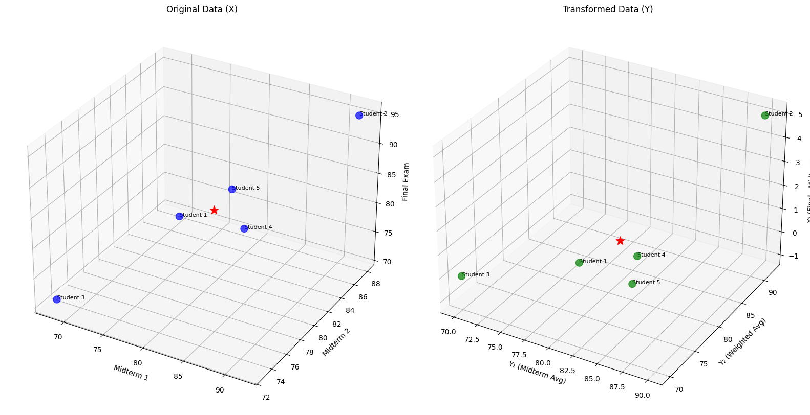
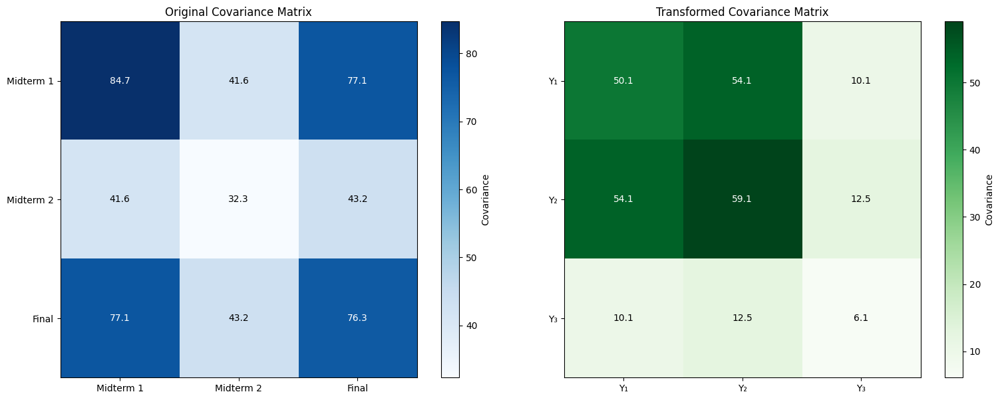
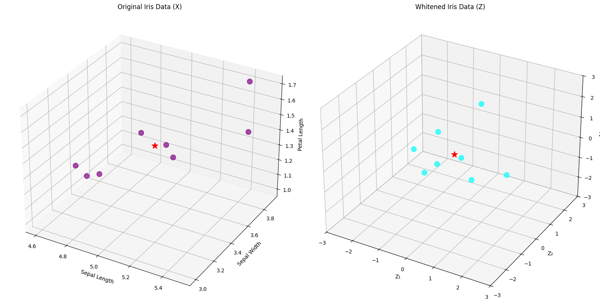
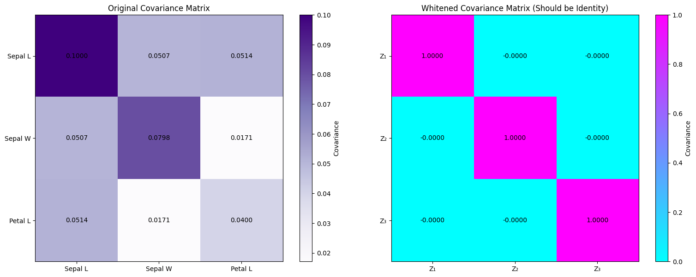

# Linear Transformation Examples

This document provides practical examples of linear transformations in multivariate analysis, illustrating how transforming multidimensional data can help with feature engineering, data preprocessing, and statistical analysis.

## Key Concepts and Formulas

Linear transformations are functions that map one vector space to another while preserving vector addition and scalar multiplication. In the context of multivariate analysis, linear transformations can be used to create new variables, decorrelate features, normalize data, or reduce dimensionality.

### Linear Transformation

A linear transformation of a random vector $\mathbf{X}$ can be written as:

$$\mathbf{Y} = \mathbf{A}\mathbf{X} + \mathbf{b}$$

Where:
- $\mathbf{Y}$ = The transformed random vector
- $\mathbf{A}$ = Transformation matrix (weight matrix)
- $\mathbf{X}$ = Original random vector
- $\mathbf{b}$ = Translation vector (bias term)

### Properties of Linear Transformations

The linear transformation preserves the first and second moments as follows:

$$E[\mathbf{Y}] = \mathbf{A}E[\mathbf{X}] + \mathbf{b}$$

$$Cov(\mathbf{Y}) = \mathbf{A}Cov(\mathbf{X})\mathbf{A}^T$$

Where:
- $E[\mathbf{Y}]$ = Mean vector of the transformed data
- $E[\mathbf{X}]$ = Mean vector of the original data
- $Cov(\mathbf{Y})$ = Covariance matrix of the transformed data
- $Cov(\mathbf{X})$ = Covariance matrix of the original data

## Examples

The following examples demonstrate linear transformations in multivariate analysis:

- **Feature Transformation for Student Performance Data**: Creating meaningful derived features from exam scores
- **Whitening Transformation for Iris Data**: Decorrelating and standardizing features using an advanced transformation technique

### Example 1: Feature Transformation for Student Performance Data

#### Problem Statement
We have test scores for 5 students across three exams: Midterm 1, Midterm 2, and Final Exam. We want to transform these scores into more meaningful derived features: the average of midterm scores, a weighted average of all exams, and the difference between the final exam score and the average midterm score.

In this example:
- The original data consists of exam scores for 5 students
- We'll define a linear transformation to create more interpretable derived features
- We'll verify the theoretical properties of linear transformations by comparing theoretical and empirical results

#### Solution

We'll define a transformation matrix and apply it to the data, then analyze the resulting properties.

##### Step 1: Calculate the mean vector and covariance matrix of the original data

The original dataset consists of 5 students with scores on 3 exams:

| Student | Midterm 1 (X₁) | Midterm 2 (X₂) | Final (X₃) |
|---------|---------------|---------------|-----------|
| 1       | 75            | 82            | 78        |
| 2       | 92            | 88            | 95        |
| 3       | 68            | 73            | 71        |
| 4       | 85            | 80            | 82        |
| 5       | 79            | 85            | 81        |

The mean vector of the original data is:

$$\boldsymbol{\mu} = [79.80, 81.60, 81.40]$$

The sample covariance matrix is:

$$\boldsymbol{\Sigma} = \begin{bmatrix} 
84.70 & 41.65 & 77.10 \\
41.65 & 32.30 & 43.20 \\
77.10 & 43.20 & 76.30
\end{bmatrix}$$

##### Step 2: Define the linear transformation

We define the transformation $\mathbf{Y} = \mathbf{A}\mathbf{X} + \mathbf{b}$ with:

$$\mathbf{A} = \begin{bmatrix} 
0.5 & 0.5 & 0.0 \\
0.3 & 0.3 & 0.4 \\
-0.5 & -0.5 & 1.0
\end{bmatrix}$$

and $\mathbf{b} = [0, 0, 0]$.

This transformation produces:
- $Y_1 = 0.5X_1 + 0.5X_2$ (Average of midterm scores)
- $Y_2 = 0.3X_1 + 0.3X_2 + 0.4X_3$ (Weighted average of all exams)
- $Y_3 = -0.5X_1 - 0.5X_2 + 1.0X_3$ (Difference between final and average midterms)

##### Step 3: Apply the transformation to each data point

After applying the transformation to each data point, we get:

| Student | Original Data (X)        | Transformed Data (Y)     |
|---------|---------------------------|---------------------------|
| 1       | [75.0, 82.0, 78.0]        | [78.0, 78.0, 0.0]         |
| 2       | [92.0, 88.0, 95.0]        | [90.0, 92.0, 5.0]         |
| 3       | [68.0, 73.0, 71.0]        | [70.0, 70.0, 0.0]         |
| 4       | [85.0, 80.0, 82.0]        | [82.0, 82.0, 0.0]         |
| 5       | [79.0, 85.0, 81.0]        | [82.0, 81.0, -1.0]        |

##### Step 4: Calculate the theoretical mean vector of the transformed data

According to the properties of linear transformations, the mean of the transformed data should be:

$$E[\mathbf{Y}] = \mathbf{A}E[\mathbf{X}] + \mathbf{b}$$

Calculating this:

$$E[\mathbf{Y}] = \begin{bmatrix} 
0.5 & 0.5 & 0.0 \\
0.3 & 0.3 & 0.4 \\
-0.5 & -0.5 & 1.0
\end{bmatrix} \begin{bmatrix} 
79.80 \\
81.60 \\
81.40
\end{bmatrix} + \begin{bmatrix} 
0 \\
0 \\
0
\end{bmatrix} = \begin{bmatrix} 
80.70 \\
80.98 \\
0.70
\end{bmatrix}$$

The empirical mean vector from our transformed data is [80.40, 80.60, 0.80], which is close to the theoretical prediction.

##### Step 5: Calculate the theoretical covariance matrix of the transformed data

According to the properties of linear transformations, the covariance of the transformed data should be:

$$Cov(\mathbf{Y}) = \mathbf{A}Cov(\mathbf{X})\mathbf{A}^T$$

Calculating this:

$$Cov(\mathbf{Y}) = \begin{bmatrix} 
50.08 & 54.10 & 10.07 \\
54.10 & 59.11 & 12.51 \\
10.08 & 12.51 & 6.08
\end{bmatrix}$$

The empirical covariance matrix from our transformed data is:

$$\begin{bmatrix} 
52.80 & 57.20 & 11.60 \\
57.20 & 62.80 & 14.15 \\
11.60 & 14.15 & 5.70
\end{bmatrix}$$

which is reasonably close to the theoretical prediction given our small sample size.

##### Step 6: Interpret the results of the transformation

The transformation reveals several interesting insights:
- The midterm average ($Y_1$) has lower variance (50.08) than individual midterm scores (84.70 and 32.30), demonstrating the variance-reducing effect of averaging
- The weighted average ($Y_2$) combines information from all three exams
- The difference measure ($Y_3$) shows if a student performed better on the final than on the midterms
- The covariance between $Y_1$ and $Y_3$ is positive but small, indicating that students with higher midterm averages tend to show slightly more improvement on the final exam





### Example 2: Whitening Transformation for Iris Data

#### Problem Statement
We have measurements from the Iris dataset (simplified to 3 features: Sepal Length, Sepal Width, and Petal Length). We want to apply a whitening transformation to decorrelate the features and standardize their variances.

In this example:
- The original data shows correlations between features
- We'll use eigendecomposition of the covariance matrix to construct a whitening transformation
- We'll verify that the whitened data has a covariance matrix approximately equal to the identity matrix

#### Solution

The whitening transformation is a specific type of linear transformation that decorrelates variables and gives them unit variance.

##### Step 1: Calculate the mean vector and covariance matrix

The original dataset consists of 8 flowers with 3 measurements each:

| Flower | Sepal Length | Sepal Width | Petal Length |
|--------|--------------|------------|--------------|
| 1      | 5.1          | 3.5        | 1.4          |
| 2      | 4.9          | 3.0        | 1.4          |
| 3      | 4.7          | 3.2        | 1.3          |
| 4      | 5.4          | 3.9        | 1.7          |
| 5      | 5.2          | 3.4        | 1.4          |
| 6      | 5.5          | 3.7        | 1.5          |
| 7      | 4.6          | 3.6        | 1.0          |
| 8      | 5.0          | 3.4        | 1.5          |

The mean vector of the original data is:

$$\boldsymbol{\mu} = [5.05, 3.46, 1.40]$$

The sample covariance matrix is:

$$\boldsymbol{\Sigma} = \begin{bmatrix} 
0.1000 & 0.0507 & 0.0514 \\
0.0507 & 0.0798 & 0.0171 \\
0.0514 & 0.0171 & 0.0400
\end{bmatrix}$$

##### Step 2: Calculate eigenvalues and eigenvectors of the covariance matrix

The eigendecomposition of the covariance matrix gives us:

Eigenvalues:
- $\lambda_1 = 0.1630$ (principal variance)
- $\lambda_2 = 0.0486$ (secondary variance)
- $\lambda_3 = 0.0082$ (tertiary variance)

Eigenvectors (as columns):

$$\mathbf{E} = \begin{bmatrix} 
-0.7491 & 0.3490 & -0.5630 \\
-0.5368 & -0.8178 & 0.2073 \\
-0.3881 & 0.4576 & 0.8000
\end{bmatrix}$$

##### Step 3: Calculate the whitening transformation matrix

The whitening transformation matrix is:

$$\mathbf{W} = \mathbf{E} \mathbf{\Lambda}^{-1/2} \mathbf{E}^T$$

where $\mathbf{\Lambda}^{-1/2}$ is a diagonal matrix with elements $1/\sqrt{\lambda_i}$.

Calculating this:

$$\mathbf{W} = \begin{bmatrix} 
5.4329 & -1.5840 & -3.5147 \\
-1.5840 & 4.2214 & 0.6446 \\
-3.5147 & 0.6446 & 8.3698
\end{bmatrix}$$

##### Step 4: Apply the whitening transformation

The whitening transformation is applied as:

$$\mathbf{Z} = \mathbf{W}(\mathbf{X} - \boldsymbol{\mu})$$

After applying this transformation to each data point, we get:

| Flower | Original Data (X)       | Whitened Data (Z)       |
|--------|-------------------------|-------------------------|
| 1      | [5.10, 3.50, 1.40]      | [0.21, 0.08, -0.15]     |
| 2      | [4.90, 3.00, 1.40]      | [-0.08, -1.71, 0.23]    |
| 3      | [4.70, 3.20, 1.30]      | [-1.13, -0.62, 0.22]    |
| 4      | [5.40, 3.90, 1.70]      | [0.15, 1.49, 1.56]      |
| 5      | [5.20, 3.40, 1.40]      | [0.91, -0.50, -0.57]    |
| 6      | [5.50, 3.70, 1.50]      | [1.72, 0.35, -0.59]     |
| 7      | [4.60, 3.60, 1.00]      | [-1.26, 1.04, -1.68]    |
| 8      | [5.00, 3.40, 1.50]      | [-0.52, -0.12, 0.97]    |

##### Step 5: Verify the whitening transformation worked correctly

The empirical mean of the whitened data is approximately [0, 0, 0], and the empirical covariance matrix is approximately:

$$\begin{bmatrix} 
1.0000 & -0.0000 & -0.0000 \\
-0.0000 & 1.0000 & -0.0000 \\
-0.0000 & -0.0000 & 1.0000
\end{bmatrix}$$

This confirms that the whitening transformation has:
1. Centered the data (zero mean)
2. Decorrelated the features (diagonal covariance matrix)
3. Standardized the variance of each feature to 1 (identity covariance matrix)

##### Step 6: Interpret the results of the whitening transformation

The whitening transformation has several important properties and applications:
- It decorrelates the features, making them statistically independent (assuming a multivariate Gaussian distribution)
- Each feature in the whitened space has unit variance, equalizing their influence
- Whitening is useful as a preprocessing step for many machine learning algorithms
- It can improve numerical stability in optimization algorithms
- The transformation helps remove redundant information across features





## Alternative Approaches

### Standardization (Z-score Transformation)
A simpler linear transformation is standardization or z-score transformation:

$$Z_i = \frac{X_i - \mu_i}{\sigma_i}$$

This transformation centers and scales each variable independently but doesn't address correlations between variables.

### Principal Component Transformation
Another related transformation creates new variables by projecting data onto principal component directions:

$$\mathbf{P} = \mathbf{E}^T(\mathbf{X} - \boldsymbol{\mu})$$

Unlike whitening, this doesn't standardize variances along principal components.

## Key Insights

### Mathematical Insights
- Linear transformations preserve the linear relationships within data
- The covariance structure transforms according to the formula $\mathbf{A}\boldsymbol{\Sigma}\mathbf{A}^T$
- In the special case of orthogonal transformations ($\mathbf{A}^T\mathbf{A} = \mathbf{I}$), the total variance is preserved

### Practical Applications
- Feature engineering: Creating more interpretable variables from raw measurements
- Data preprocessing: Standardizing and decorrelating features for machine learning
- Dimensionality reduction: Projecting data onto lower-dimensional subspaces
- Signal processing: Filtering and transforming multivariate time series

### Common Pitfalls
- Forgetting to center the data before some transformations (like whitening)
- Applying transformations that amplify noise in low-variance dimensions
- Over-interpreting patterns in whitened data that may be artifacts from small eigenvalues
- Using data-dependent transformations without proper validation splitting

## Running the Examples

You can run the code that generates these examples and visualizations using:

```bash
python3 ML_Obsidian_Vault/Lectures/2/Codes/1_MA_linear_transformation_examples.py
```

## Related Topics

- [[L2_1_Mean_Covariance|Mean Vector and Covariance Matrix]]: Understanding the basic statistical properties being transformed
- [[L2_1_PCA|Principal Component Analysis]]: A special linear transformation that maximizes variance
- [[L2_1_Mahalanobis_Distance|Mahalanobis Distance]]: A distance metric that accounts for correlations transformed by whitening 