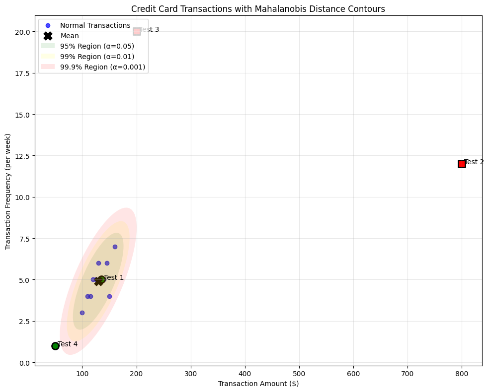
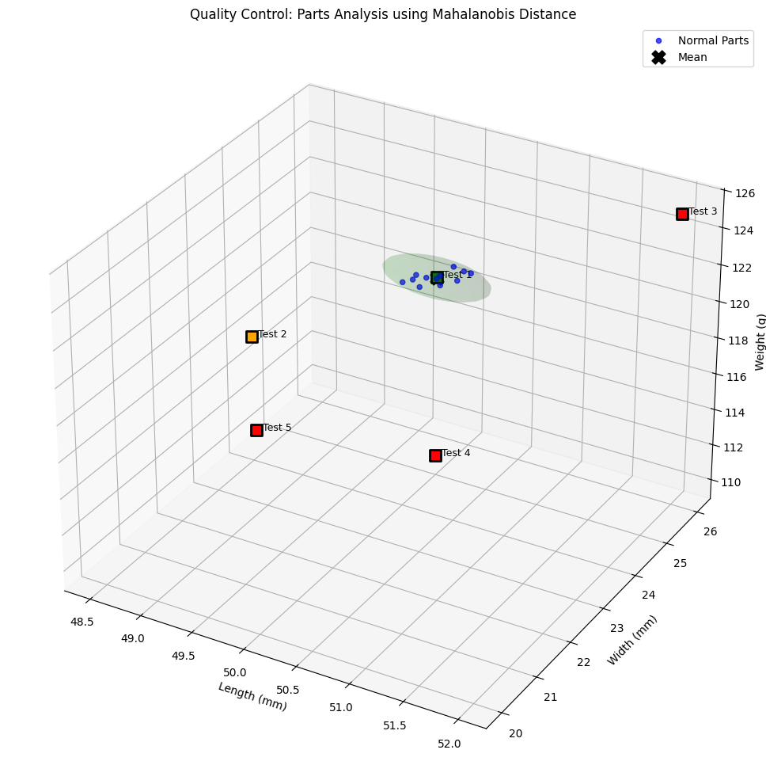
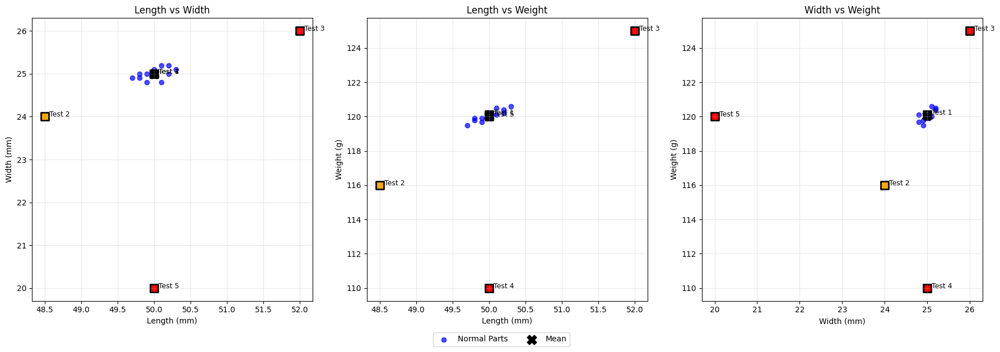

# Mahalanobis Distance Examples

This document provides practical examples of Mahalanobis distance for various scenarios, illustrating the concept of multivariate distance measurement and its significance in outlier detection for machine learning and data analysis contexts.

## Key Concepts and Formulas

The Mahalanobis distance measures the distance between a point and a distribution, taking into account the correlations between variables. Unlike Euclidean distance, it accounts for how variables co-vary with each other, making it particularly useful for detecting outliers in multivariate data.

### The Mahalanobis Distance Formula

$$d_M(\mathbf{x}, \boldsymbol{\mu}) = \sqrt{(\mathbf{x} - \boldsymbol{\mu})^T \boldsymbol{\Sigma}^{-1} (\mathbf{x} - \boldsymbol{\mu})}$$

Where:
- $\mathbf{x}$ = Point or observation vector
- $\boldsymbol{\mu}$ = Mean vector of the distribution
- $\boldsymbol{\Sigma}^{-1}$ = Inverse of the covariance matrix
- $d_M$ = Mahalanobis distance

For multivariate normally distributed data, the squared Mahalanobis distance follows a chi-squared distribution with degrees of freedom equal to the dimension of the data. This property allows us to determine statistical significance of outliers:

$$d_M^2(\mathbf{x}, \boldsymbol{\mu}) \sim \chi^2_p$$

Where $p$ is the number of dimensions (variables).

## Examples

The following examples demonstrate Mahalanobis distance for outlier detection:

- **Credit Card Fraud Detection**: Using transaction amount and frequency to identify suspicious activities
- **Manufacturing Quality Control**: Detecting defective parts based on multiple measurements

### Example 1: Credit Card Fraud Detection

#### Problem Statement
A credit card company wants to detect potentially fraudulent transactions by analyzing transaction amount and frequency. Given historical normal transaction data, we need to determine if new transactions are likely to be fraudulent.

In this example:
- We have a dataset of 10 normal credit card transactions with 2 variables: amount (X₁) and frequency per week (X₂)
- We need to analyze 4 new test transactions to determine if they are outliers
- We'll use the Mahalanobis distance to quantify how unusual each transaction is

#### Solution

We'll calculate the Mahalanobis distance for each test transaction and compare it to critical values from the chi-squared distribution to identify outliers.

##### Step 1: Calculate the Mean Vector and Covariance Matrix

For our normal transactions dataset:

| Transaction | Amount (X₁) | Frequency (X₂) |
|-------------|--------------|---------------|
| 1           | $120         | 5             |
| 2           | $150         | 4             |
| 3           | $100         | 3             |
| 4           | $130         | 6             |
| 5           | $140         | 5             |
| 6           | $110         | 4             |
| 7           | $160         | 7             |
| 8           | $125         | 5             |
| 9           | $115         | 4             |
| 10          | $145         | 6             |

The mean vector μ is:

$$\boldsymbol{\mu} = [129.50, 4.90]$$

The covariance matrix Σ is:

$$\boldsymbol{\Sigma} = \begin{bmatrix} 
363.61 & 16.61 \\
16.61 & 1.43
\end{bmatrix}$$

##### Step 2: Calculate the Inverse of the Covariance Matrix

The inverse of the covariance matrix Σ⁻¹ is:

$$\boldsymbol{\Sigma}^{-1} = \begin{bmatrix} 
0.00584 & -0.06773 \\
-0.06773 & 1.48263
\end{bmatrix}$$

##### Step 3: Calculate Mahalanobis Distance for Test Transactions

For test transaction 1 ($135, 5 times per week):

1. Calculate deviation from mean:
   $$\mathbf{x} - \boldsymbol{\mu} = [135, 5] - [129.50, 4.90] = [5.5, 0.1]$$

2. Calculate $(\mathbf{x} - \boldsymbol{\mu})^T \boldsymbol{\Sigma}^{-1} (\mathbf{x} - \boldsymbol{\mu})$:
   First, compute $\boldsymbol{\Sigma}^{-1}(\mathbf{x} - \boldsymbol{\mu})$:
   $$\boldsymbol{\Sigma}^{-1}(\mathbf{x} - \boldsymbol{\mu}) = [0.02537, -0.22426]$$
   
   Then, compute the dot product:
   $$(\mathbf{x} - \boldsymbol{\mu})^T \boldsymbol{\Sigma}^{-1}(\mathbf{x} - \boldsymbol{\mu}) = 0.11712$$

3. Calculate square root:
   $$d_M = \sqrt{0.11712} = 0.342$$

Similarly, for the other test transactions:
- Test transaction 2 ($800, 12 times per week): $d_M = 45.358$
- Test transaction 3 ($200, 20 times per week): $d_M = 14.930$
- Test transaction 4 ($50, 1 time per week): $d_M = 4.182$

##### Step 4: Determine Outliers Using Chi-squared Distribution

For a 2-dimensional dataset, we compare the squared Mahalanobis distances with the critical values from the chi-squared distribution with 2 degrees of freedom:

| Significance Level (α) | Critical Value |
|------------------------|----------------|
| 0.05                   | 5.991          |
| 0.01                   | 9.210          |
| 0.001                  | 13.816         |

Outlier detection results:

| Transaction | Mahalanobis Distance | Outlier at α=0.05? | Outlier at α=0.01? | Outlier at α=0.001? |
|-------------|---------------------|-----------------|-----------------|------------------|
| Test 1      | 0.342               | No              | No              | No               |
| Test 2      | 45.358              | Yes             | Yes             | Yes              |
| Test 3      | 14.930              | Yes             | Yes             | Yes              |
| Test 4      | 4.182               | No              | No              | No               |

Therefore:
- Transaction 1 ($135, 5 times) is a normal transaction
- Transaction 2 ($800, 12 times) is highly unusual, strongly indicating fraud
- Transaction 3 ($200, 20 times) has unusually high frequency, possibly indicating account sharing
- Transaction 4 ($50, 1 time) is somewhat unusual but not statistically significant as an outlier



### Example 2: Manufacturing Quality Control

#### Problem Statement
A manufacturing company produces precision parts that must meet strict dimensional requirements. Quality control needs to identify defective parts based on their measurements.

In this example:
- We have measurements of 12 normal parts with 3 variables: length (mm), width (mm), and weight (g)
- We need to analyze 5 test parts to determine if they fall within acceptable limits
- We'll use the Mahalanobis distance to identify out-of-spec parts

#### Solution

We'll calculate the Mahalanobis distance for each test part and determine if they're within specification limits.

##### Step 1: Calculate the Mean Vector and Covariance Matrix

For our normal parts dataset:

| Part | Length (mm) | Width (mm) | Weight (g) |
|------|-------------|------------|------------|
| 1    | 50.1        | 25.2       | 120.5      |
| 2    | 49.8        | 24.9       | 119.8      |
| 3    | 50.2        | 25.0       | 120.2      |
| 4    | 50.0        | 25.1       | 120.0      |
| 5    | 49.9        | 25.0       | 119.9      |
| 6    | 50.1        | 24.8       | 120.1      |
| 7    | 49.7        | 24.9       | 119.5      |
| 8    | 50.3        | 25.1       | 120.6      |
| 9    | 50.0        | 25.0       | 120.0      |
| 10   | 49.9        | 24.8       | 119.7      |
| 11   | 50.2        | 25.2       | 120.4      |
| 12   | 49.8        | 25.0       | 119.9      |

The mean vector μ is:

$$\boldsymbol{\mu} = [50.00, 25.00, 120.05]$$

The covariance matrix Σ is:

$$\boldsymbol{\Sigma} = \begin{bmatrix} 
0.03455 & 0.01273 & 0.05545 \\
0.01273 & 0.01818 & 0.03182 \\
0.05545 & 0.03182 & 0.10818
\end{bmatrix}$$

##### Step 2: Calculate the Inverse of the Covariance Matrix

The inverse of the covariance matrix Σ⁻¹ is:

$$\boldsymbol{\Sigma}^{-1} = \begin{bmatrix} 
214.39 & 87.06 & -135.50 \\
87.06 & 148.68 & -88.36 \\
-135.50 & -88.36 & 104.69
\end{bmatrix}$$

##### Step 3: Calculate Mahalanobis Distance for Test Parts

For test part 1 (50.0mm × 25.0mm × 120.1g):

1. Calculate deviation from mean:
   $$\mathbf{x} - \boldsymbol{\mu} = [50.0, 25.0, 120.1] - [50.00, 25.00, 120.05] = [0.0, 0.0, 0.05]$$

2. Calculate $(\mathbf{x} - \boldsymbol{\mu})^T \boldsymbol{\Sigma}^{-1} (\mathbf{x} - \boldsymbol{\mu})$:
   First, compute $\boldsymbol{\Sigma}^{-1}(\mathbf{x} - \boldsymbol{\mu})$:
   $$\boldsymbol{\Sigma}^{-1}(\mathbf{x} - \boldsymbol{\mu}) = [-6.78, -4.42, 5.23]$$
   
   Then, compute the dot product:
   $$(\mathbf{x} - \boldsymbol{\mu})^T \boldsymbol{\Sigma}^{-1}(\mathbf{x} - \boldsymbol{\mu}) = 0.262$$

3. Calculate square root:
   $$d_M = \sqrt{0.262} = 0.512$$

Similarly, for the other test parts:
- Test part 2 (48.5mm × 24.0mm × 116.0g): $d_M = 15.728$
- Test part 3 (52.0mm × 26.0mm × 125.0g): $d_M = 19.025$
- Test part 4 (50.0mm × 25.0mm × 110.0g): $d_M = 102.830$
- Test part 5 (50.0mm × 20.0mm × 120.0g): $d_M = 60.607$

##### Step 4: Determine Outliers Using Chi-squared Distribution

For a 3-dimensional dataset, we compare the squared Mahalanobis distances with the critical values from the chi-squared distribution with 3 degrees of freedom:

| Significance Level (α) | Critical Value |
|------------------------|----------------|
| 0.05                   | 7.815          |
| 0.01                   | 11.345         |
| 0.001                  | 16.266         |

Outlier detection results:

| Part    | Mahalanobis Distance | Outlier at α=0.05? | Outlier at α=0.01? | Outlier at α=0.001? |
|---------|---------------------|-----------------|-----------------|------------------|
| Test 1  | 0.512               | No              | No              | No               |
| Test 2  | 15.728              | Yes             | Yes             | No               |
| Test 3  | 19.025              | Yes             | Yes             | Yes              |
| Test 4  | 102.830             | Yes             | Yes             | Yes              |
| Test 5  | 60.607              | Yes             | Yes             | Yes              |

Therefore:
- Part 1 (50.0mm × 25.0mm × 120.1g) is within specification and passes quality control
- Part 2 (48.5mm × 24.0mm × 116.0g) is undersized and should be rejected
- Part 3 (52.0mm × 26.0mm × 125.0g) is oversized and should be rejected
- Part 4 (50.0mm × 25.0mm × 110.0g) has correct dimensions but is too light, suggesting material issues
- Part 5 (50.0mm × 20.0mm × 120.0g) has an abnormal width, indicating a manufacturing defect



For better visualization, we can also view the 2D projections:



## Key Insights

### Theoretical Insights
- Mahalanobis distance accounts for the correlation structure between variables, making it more appropriate than Euclidean distance for correlated multivariate data
- The squared Mahalanobis distance follows a chi-squared distribution, providing a statistical basis for outlier detection
- The number of degrees of freedom for the chi-squared distribution equals the number of variables in the dataset

### Practical Applications
- Fraud detection in financial transactions by identifying unusual patterns
- Quality control in manufacturing to detect defective parts
- Anomaly detection in sensor networks or IoT devices
- Multivariate outlier detection in medical diagnostics
- Cluster analysis and classification in machine learning

### Common Pitfalls
- The covariance matrix must be invertible, which requires more observations than variables
- Assumes underlying data follows a multivariate normal distribution
- May be sensitive to extreme outliers that influence the mean vector and covariance matrix estimation
- Computationally intensive for very high-dimensional data

## Running the Examples

You can run the code that generates these examples and visualizations using:

```bash
python3 ML_Obsidian_Vault/Lectures/2/Codes/1_MA_mahalanobis_distance_examples.py
```

## Related Topics

- [[L2_1_Mean_Covariance|Mean Vector and Covariance Matrix]]: Required for calculating Mahalanobis distance
- [[L2_1_Multivariate_Normal_Distribution|Multivariate Normal Distribution]]: Theoretical basis for Mahalanobis distance
- [[L2_1_PCA|Principal Component Analysis]]: Another approach for identifying patterns in high-dimensional data
- [[L2_1_Hotellings_T2|Hotelling's T² Test]]: Statistical test based on Mahalanobis distance 