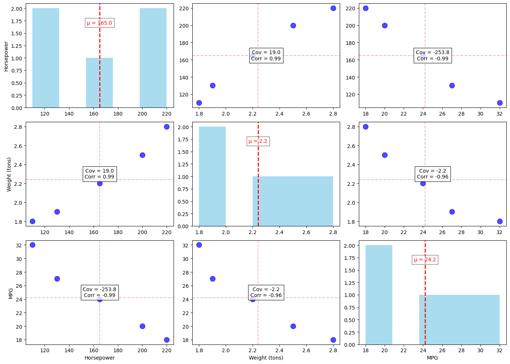
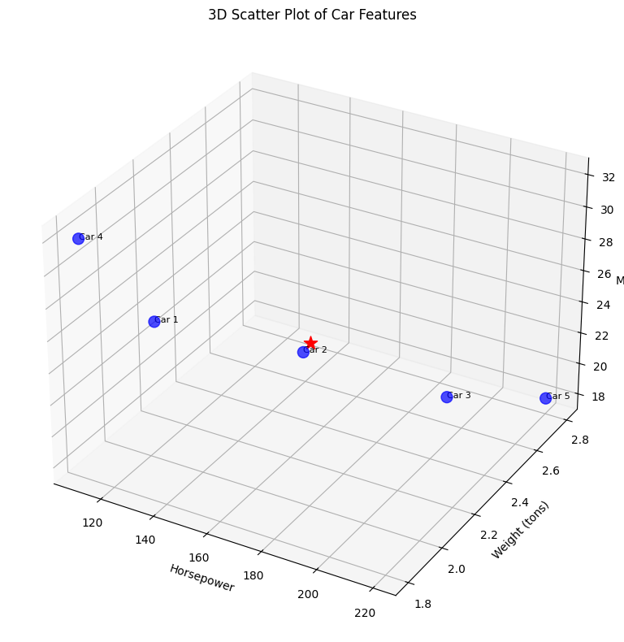
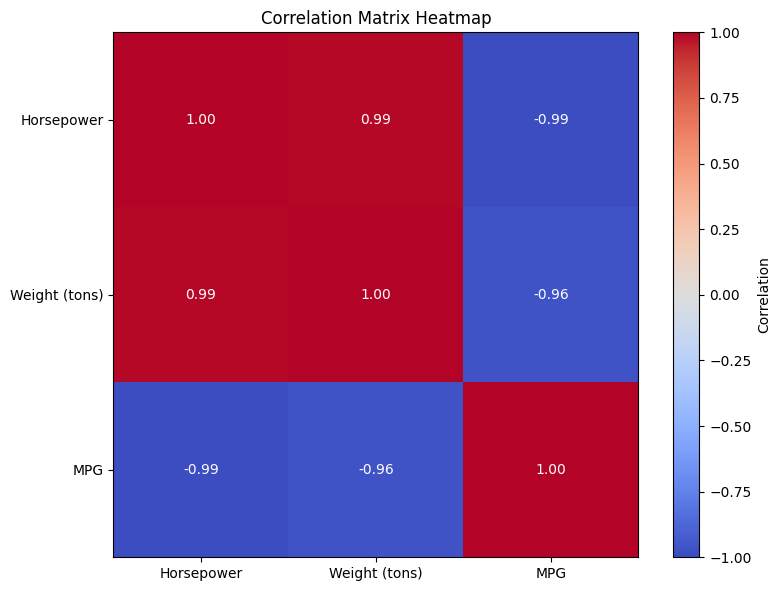
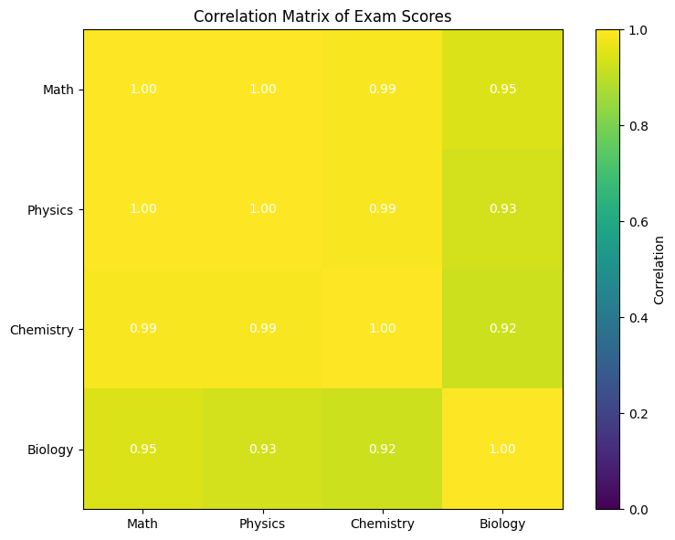
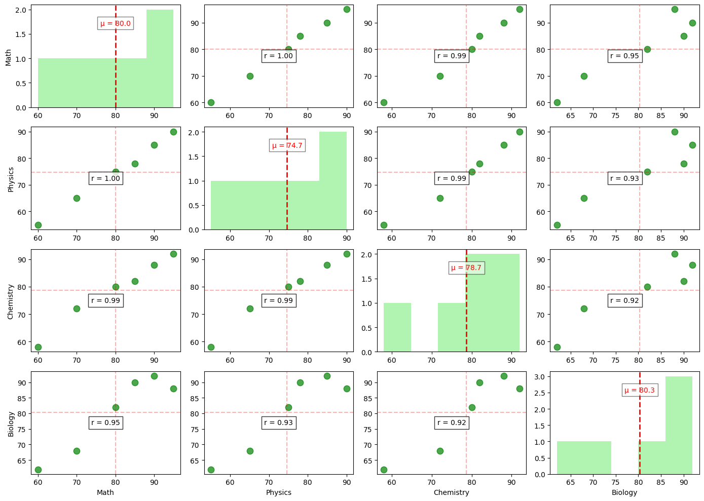

# Mean Vector and Covariance Matrix Examples

This document provides practical examples of computing and interpreting mean vectors and covariance matrices, which are fundamental statistical tools for analyzing multivariate data in machine learning applications.

## Key Concepts and Formulas

### Mean Vector Formula

For a dataset with $n$ observations and $p$ variables, the mean vector $\boldsymbol{\mu}$ is:

$$\boldsymbol{\mu} = \begin{bmatrix} \mu_1 \\ \mu_2 \\ \vdots \\ \mu_p \end{bmatrix} = \begin{bmatrix} \frac{1}{n}\sum_{i=1}^{n}x_{i1} \\ \frac{1}{n}\sum_{i=1}^{n}x_{i2} \\ \vdots \\ \frac{1}{n}\sum_{i=1}^{n}x_{ip} \end{bmatrix}$$

Where:
- $\mu_i$ = Mean of variable $i$
- $x_{ij}$ = Value of variable $i$ for observation $j$
- $n$ = Number of observations

### Covariance Matrix Formula

The sample covariance matrix $\boldsymbol{S}$ for a $p$-dimensional dataset is:

$$\boldsymbol{S} = \begin{bmatrix} 
s_{11} & s_{12} & \cdots & s_{1p} \\
s_{21} & s_{22} & \cdots & s_{2p} \\
\vdots & \vdots & \ddots & \vdots \\
s_{p1} & s_{p2} & \cdots & s_{pp}
\end{bmatrix}$$

For a sample, we calculate each element using:

$$s_{ij} = \frac{1}{n-1}\sum_{k=1}^{n}(x_{ki} - \mu_i)(x_{kj} - \mu_j)$$

Where:
- $s_{ij}$ = Sample covariance between variables $i$ and $j$
- $s_{ii}$ = Sample variance of variable $i$
- $\mu_i$ = Sample mean of variable $i$
- $x_{ki}$ = Value of variable $i$ for observation $k$
- $n$ = Number of observations

The division by $(n-1)$ rather than $n$ provides an unbiased estimator of the population covariance.

### Correlation Matrix Formula

The correlation matrix $\boldsymbol{R}$ is derived from the covariance matrix by standardizing:

$$r_{ij} = \frac{s_{ij}}{\sqrt{s_{ii} \cdot s_{jj}}}$$

Where:
- $r_{ij}$ = Correlation coefficient between variables $i$ and $j$
- $s_{ij}$ = Covariance between variables $i$ and $j$
- $s_{ii}$ = Variance of variable $i$
- $s_{jj}$ = Variance of variable $j$

## Examples

The following examples demonstrate computing and interpreting mean vectors and covariance matrices:

- **Car Features Analysis**: Analyzing relationships between car specifications
- **Student Exam Scores Analysis**: Examining performance correlations across different subjects

### Example 1: Car Features Analysis

#### Problem Statement
An automotive researcher is analyzing a dataset of 5 cars with three numerical features: horsepower ($X_1$), weight in tons ($X_2$), and fuel efficiency in miles per gallon ($X_3$). Calculate and interpret the mean vector and covariance matrix for this dataset.

| Car | Horsepower ($X_1$) | Weight in tons ($X_2$) | MPG ($X_3$) |
|-----|----------------|------------|---------|
| 1   | 130           | 1.9        | 27      |
| 2   | 165           | 2.2        | 24      |
| 3   | 200           | 2.5        | 20      |
| 4   | 110           | 1.8        | 32      |
| 5   | 220           | 2.8        | 18      |

#### Solution

##### Step 1: Calculate the Mean Vector
We compute the mean of each variable by averaging its values:

$$\mu_{X_1} = \frac{130 + 165 + 200 + 110 + 220}{5} = \frac{825}{5} = 165$$

$$\mu_{X_2} = \frac{1.9 + 2.2 + 2.5 + 1.8 + 2.8}{5} = \frac{11.2}{5} = 2.24$$

$$\mu_{X_3} = \frac{27 + 24 + 20 + 32 + 18}{5} = \frac{121}{5} = 24.2$$

Therefore, the mean vector is:

$$\boldsymbol{\mu} = \begin{bmatrix} 165 \\ 2.24 \\ 24.2 \end{bmatrix}$$

##### Step 2: Calculate Deviations from the Mean
We compute the deviation of each observation from the corresponding mean:

| Car | $X_1 - \mu_{X_1}$ | $X_2 - \mu_{X_2}$ | $X_3 - \mu_{X_3}$ |
|-----|---------|---------|---------|
| 1   | -35.0   | -0.34   | 2.8     |
| 2   | 0.0     | -0.04   | -0.2    |
| 3   | 35.0    | 0.26    | -4.2    |
| 4   | -55.0   | -0.44   | 7.8     |
| 5   | 55.0    | 0.56    | -6.2    |

##### Step 3: Compute the Covariance Matrix Elements
For the variances (diagonal elements):

$$s_{11} = \text{Var}(X_1) = \frac{(-35)^2 + (0)^2 + (35)^2 + (-55)^2 + (55)^2}{4} = \frac{8500}{4} = 2125$$

$$s_{22} = \text{Var}(X_2) = \frac{(-0.34)^2 + (-0.04)^2 + (0.26)^2 + (-0.44)^2 + (0.56)^2}{4} = \frac{0.69}{4} = 0.173$$

$$s_{33} = \text{Var}(X_3) = \frac{(2.8)^2 + (-0.2)^2 + (-4.2)^2 + (7.8)^2 + (-6.2)^2}{4} = \frac{124.8}{4} = 31.2$$

For the covariances (off-diagonal elements):

$$s_{12} = \text{Cov}(X_1, X_2) = \frac{(-35)(-0.34) + (0)(-0.04) + (35)(0.26) + (-55)(-0.44) + (55)(0.56)}{4} = \frac{76}{4} = 19$$

$$s_{13} = \text{Cov}(X_1, X_3) = \frac{(-35)(2.8) + (0)(-0.2) + (35)(-4.2) + (-55)(7.8) + (55)(-6.2)}{4} = \frac{-1015}{4} = -253.75$$

$$s_{23} = \text{Cov}(X_2, X_3) = \frac{(-0.34)(2.8) + (-0.04)(-0.2) + (0.26)(-4.2) + (-0.44)(7.8) + (0.56)(-6.2)}{4} = \frac{-8.94}{4} = -2.235$$

Since the covariance matrix is symmetric, $s_{21} = s_{12}$, $s_{31} = s_{13}$, and $s_{32} = s_{23}$.

##### Step 4: Assemble the Covariance Matrix
The complete covariance matrix is:

$$\boldsymbol{S} = \begin{bmatrix} 
2125.0 & 19.0 & -253.75 \\
19.0 & 0.173 & -2.235 \\
-253.75 & -2.235 & 31.2
\end{bmatrix}$$



##### Interpretation
The covariance matrix reveals important relationships between variables:

1. **Variances (diagonal elements):**
   - Horsepower has the highest variance (2125.0), indicating wide variation across different car models
   - Weight has very small variance (0.173) compared to other variables due to its smaller scale
   - MPG has moderate variance (31.2)

2. **Covariances (off-diagonal elements):**
   - The positive covariance (19.0) between horsepower and weight indicates that as horsepower increases, weight tends to increase
   - The negative covariance (-253.75) between horsepower and MPG indicates that as horsepower increases, fuel efficiency tends to decrease
   - The negative covariance (-2.235) between weight and MPG indicates that as weight increases, fuel efficiency tends to decrease

These findings align with mechanical engineering principles: more powerful engines tend to be heavier and consume more fuel.

The 3D visualization shows the relationship between all three variables:



For clearer interpretation of the linear relationships, we can examine the correlation matrix:

$$\boldsymbol{R} = \begin{bmatrix} 
1.00 & 0.99 & -0.99 \\
0.99 & 1.00 & -0.96 \\
-0.99 & -0.96 & 1.00
\end{bmatrix}$$



The correlation coefficients reveal very strong relationships between all variables, with almost perfect positive correlation between horsepower and weight (0.99) and nearly perfect negative correlations between MPG and the other variables.

### Example 2: Student Exam Scores Analysis

#### Problem Statement
An education researcher wants to analyze the performance of 6 students across 4 subjects: Math, Physics, Chemistry, and Biology. Calculate and interpret the mean vector and covariance matrix for this dataset.

| Student | Math | Physics | Chemistry | Biology |
|---------|------|---------|-----------|---------|
| 1       | 85   | 78      | 82        | 90      |
| 2       | 90   | 85      | 88        | 92      |
| 3       | 70   | 65      | 72        | 68      |
| 4       | 80   | 75      | 80        | 82      |
| 5       | 95   | 90      | 92        | 88      |
| 6       | 60   | 55      | 58        | 62      |

#### Solution

##### Step 1: Calculate the Mean Vector
We compute the mean of each subject by averaging its scores:

$$\mu_{\text{Math}} = \frac{85 + 90 + 70 + 80 + 95 + 60}{6} = \frac{480}{6} = 80.0$$

$$\mu_{\text{Physics}} = \frac{78 + 85 + 65 + 75 + 90 + 55}{6} = \frac{448}{6} = 74.67$$

$$\mu_{\text{Chemistry}} = \frac{82 + 88 + 72 + 80 + 92 + 58}{6} = \frac{472}{6} = 78.67$$

$$\mu_{\text{Biology}} = \frac{90 + 92 + 68 + 82 + 88 + 62}{6} = \frac{482}{6} = 80.33$$

Therefore, the mean vector is:

$$\boldsymbol{\mu} = \begin{bmatrix} 80.0 \\ 74.67 \\ 78.67 \\ 80.33 \end{bmatrix}$$

##### Step 2: Calculate the Sample Covariance Matrix
After computing the deviations from the mean and applying the covariance formula, we get:

$$\boldsymbol{S} = \begin{bmatrix} 
170.00 & 168.00 & 158.00 & 154.00 \\
168.00 & 166.67 & 156.67 & 150.13 \\
158.00 & 156.67 & 149.87 & 141.33 \\
154.00 & 150.13 & 141.33 & 155.87
\end{bmatrix}$$

##### Step 3: Calculate the Correlation Matrix
The correlation matrix derived from the covariance matrix is:

$$\boldsymbol{R} = \begin{bmatrix} 
1.0000 & 0.9981 & 0.9899 & 0.9461 \\
0.9981 & 1.0000 & 0.9913 & 0.9315 \\
0.9899 & 0.9913 & 1.0000 & 0.9247 \\
0.9461 & 0.9315 & 0.9247 & 1.0000
\end{bmatrix}$$



##### Interpretation

The correlation matrix reveals extremely high positive correlations (all above 0.92) between all pairs of subjects, indicating:

1. Students who perform well in one subject generally perform well in all subjects
2. The highest correlation (0.9981) is between Math and Physics, which often require similar analytical skills
3. The lowest correlation (0.9247) is between Chemistry and Biology, though this is still extremely high
4. These high correlations suggest that a student's academic ability could be a strong common factor affecting performance across all subjects

The scatter plot matrix visualizes these relationships:



## Key Insights

### Theoretical Insights
- The mean vector provides a central reference point in multidimensional space
- The covariance matrix captures both the spread of individual variables and their interactions
- The diagonal elements of the covariance matrix represent variances of individual variables
- The off-diagonal elements represent the degree to which variables are linearly related
- Correlation coefficients standardize covariances to facilitate interpretation

### Practical Applications
- Data summarization and visualization of multivariate relationships
- Input for various statistical methods like principal component analysis and discriminant analysis
- Foundation for multivariate normal distribution modeling and Mahalanobis distance calculation
- Feature selection based on correlation patterns
- Risk assessment in financial portfolio management

### Common Pitfalls
- Sensitivity to outliers, as extreme values can dramatically affect covariance estimates
- Scale dependency, where variables with larger scales dominate the covariance structure
- Difficulty in interpretation when dealing with many variables
- Only capturing linear relationships between variables

## Running the Examples

You can run the code that generates these examples and visualizations using:

```bash
python3 ML_Obsidian_Vault/Lectures/2/Codes/1_MA_mean_covariance_examples.py
```

## Related Topics
- [[L2_1_Linear_Transformation|Linear Transformation]]: How transformations affect mean vectors and covariance matrices
- [[L2_1_Mahalanobis_Distance|Mahalanobis Distance]]: Using covariance matrices for distance calculations
- [[L2_1_PCA|Principal Component Analysis]]: Utilizing covariance structure for dimensionality reduction
- [[L2_1_Multivariate_Analysis|Multivariate Analysis]]: Broader framework for analyzing multiple variables 