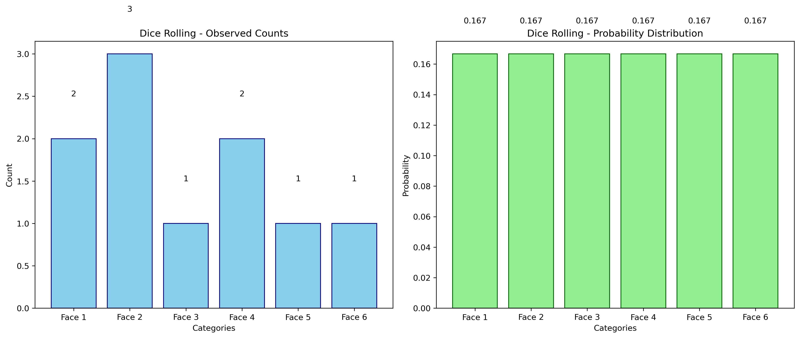
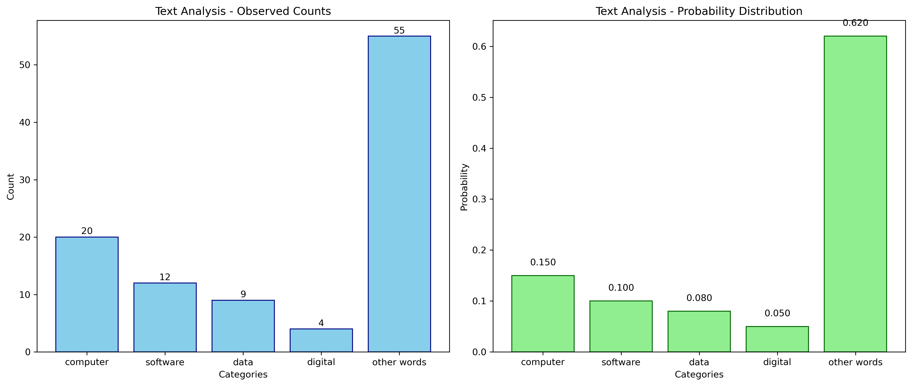
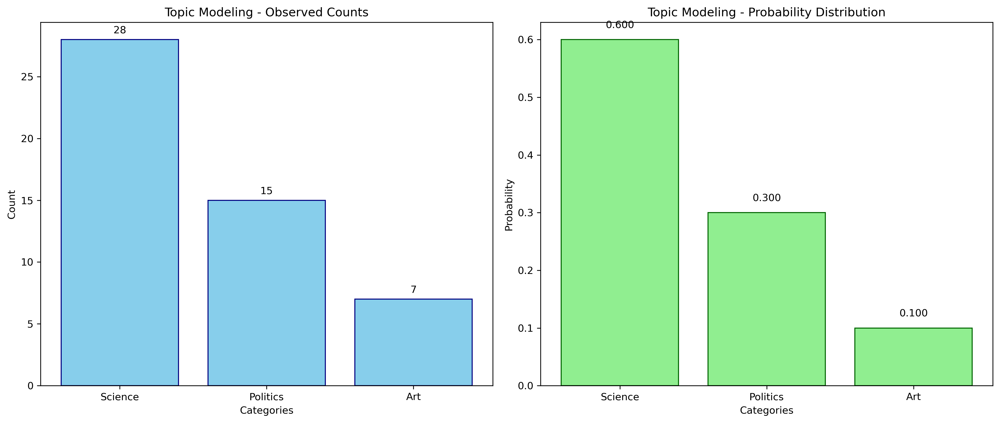

# Multinomial Distribution Examples

This document provides practical examples of the multinomial distribution, illustrating its application in various machine learning and data analysis contexts.

## Key Concepts and Formulas

The multinomial distribution is a generalization of the binomial distribution to multiple categories. It models the probability of counts for each category in a fixed number of independent trials.

### The Multinomial Distribution Formula

$$P(X_1 = x_1, X_2 = x_2, \ldots, X_k = x_k) = \frac{n!}{x_1! \times x_2! \times \ldots \times x_k!} \times p_1^{x_1} \times p_2^{x_2} \times \ldots \times p_k^{x_k}$$

Where:
- $n$ = total number of trials
- $x_i$ = number of times category $i$ occurs
- $p_i$ = probability of category $i$
- $k$ = number of categories

### Properties
- **Constraint**: $\sum_{i=1}^k x_i = n$
- **Expected Value**: $E[X_i] = n \times p_i$
- **Variance**: $\text{Var}(X_i) = n \times p_i \times (1 - p_i)$
- **Covariance**: $\text{Cov}(X_i, X_j) = -n \times p_i \times p_j$ (for $i \neq j$)

## Examples

The following examples demonstrate the multinomial distribution:

- **Dice Rolling**: Modeling outcomes of multiple dice rolls
- **Text Analysis**: Analyzing word frequencies in documents
- **Topic Modeling**: Distribution of topics in text data

### Example 1: Dice Rolling

#### Problem Statement
What is the probability of observing exactly 2 ones, 3 twos, 1 three, 2 fours, 1 five, and 1 six when rolling a fair six-sided die 10 times?

Given:
- A fair six-sided die is rolled 10 times
- Each face has equal probability (1/6)
- We observe:
  - 2 ones
  - 3 twos
  - 1 three
  - 2 fours
  - 1 five
  - 1 six

We need to:
1. Calculate the probability of this specific outcome
2. Verify if this outcome is consistent with expected values
3. Visualize the distribution of outcomes

#### Solution

##### Step 1: Verify Parameters
- Total trials (n): 10
- Observed counts: [2, 3, 1, 2, 1, 1]
- Probabilities: [1/6, 1/6, 1/6, 1/6, 1/6, 1/6]
- Sum of counts: 10 (equals n)
- Sum of probabilities: 1.00 (equals 1)

##### Step 2: Calculate Probability
- Multinomial coefficient: $\frac{10!}{2! \times 3! \times 1! \times 2! \times 1! \times 1!} = 151200$
- Probability component: $(1/6)^2 \times (1/6)^3 \times (1/6)^1 \times (1/6)^2 \times (1/6)^1 \times (1/6)^1 = 1.654 \times 10^{-8}$
- Total probability: $151200 \times 1.654 \times 10^{-8} = 0.002501$

##### Step 3: Expected Values
Expected counts for each category:
- Face 1: $10 \times \frac{1}{6} = 1.67$
- Face 2: $10 \times \frac{1}{6} = 1.67$
- Face 3: $10 \times \frac{1}{6} = 1.67$
- Face 4: $10 \times \frac{1}{6} = 1.67$
- Face 5: $10 \times \frac{1}{6} = 1.67$
- Face 6: $10 \times \frac{1}{6} = 1.67$



### Example 2: Text Analysis

#### Problem Statement
What is the probability of observing a specific word distribution in a 100-word technology document, given the expected probabilities of different word categories?

Given:
- A 100-word document about technology
- Word category probabilities:
  - computer: 0.15
  - software: 0.10
  - data: 0.08
  - digital: 0.05
  - other words: 0.62
- Observed counts:
  - computer: 20 times
  - software: 12 times
  - data: 9 times
  - digital: 4 times
  - other words: 55 times

We need to:
1. Calculate the probability of this specific word distribution
2. Compare observed counts with expected counts
3. Analyze if this distribution is typical for technology documents

#### Solution

##### Step 1: Verify Parameters
- Total trials (n): 100
- Observed counts: [20, 12, 9, 4, 55]
- Probabilities: [0.15, 0.10, 0.08, 0.05, 0.62]
- Sum of counts: 100 (equals n)
- Sum of probabilities: 1.00 (equals 1)

##### Step 2: Calculate Probability
- Multinomial coefficient: $\frac{100!}{20! \times 12! \times 9! \times 4! \times 55!} = 7.242 \times 10^{50}$
- Probability component: $0.15^{20} \times 0.10^{12} \times 0.08^9 \times 0.05^4 \times 0.62^{55} = 1.064 \times 10^{-55}$
- Total probability: $7.242 \times 10^{50} \times 1.064 \times 10^{-55} = 0.000077$

##### Step 3: Expected Values
Expected counts for each category:
- computer: $100 \times 0.15 = 15.00$
- software: $100 \times 0.10 = 10.00$
- data: $100 \times 0.08 = 8.00$
- digital: $100 \times 0.05 = 5.00$
- other words: $100 \times 0.62 = 62.00$



### Example 3: Topic Modeling

#### Problem Statement
What is the probability of observing a specific distribution of topics in a 50-word document, given the expected topic probabilities?

Given:
- A 50-word document
- Topic probabilities:
  - Science: 0.6
  - Politics: 0.3
  - Art: 0.1
- Observed counts:
  - Science: 28 words
  - Politics: 15 words
  - Art: 7 words

We need to:
1. Calculate the probability of this specific topic distribution
2. Compare observed topic counts with expected counts
3. Determine if this distribution is consistent with the given topic probabilities

#### Solution

##### Step 1: Verify Parameters
- Total trials (n): 50
- Observed counts: [28, 15, 7]
- Probabilities: [0.6, 0.3, 0.1]
- Sum of counts: 50 (equals n)
- Sum of probabilities: 1.00 (equals 1)

##### Step 2: Calculate Probability
- Multinomial coefficient: $\frac{50!}{28! \times 15! \times 7!} = 1.514 \times 10^{19}$
- Probability component: $0.6^{28} \times 0.3^{15} \times 0.1^7 = 8.812 \times 10^{-22}$
- Total probability: $1.514 \times 10^{19} \times 8.812 \times 10^{-22} = 0.013337$

##### Step 3: Expected Values
Expected counts for each category:
- Science: $50 \times 0.6 = 30.00$
- Politics: $50 \times 0.3 = 15.00$
- Art: $50 \times 0.1 = 5.00$



## Key Insights

### Theoretical Insights
- The multinomial distribution is a natural choice for modeling categorical data with multiple outcomes
- The multinomial coefficient captures the number of ways to arrange the observed counts
- The probability component reflects the likelihood of each specific outcome

### Practical Applications
- Text analysis and natural language processing
- Topic modeling and document classification
- Categorical data analysis in machine learning
- Multi-class classification problems

### Common Pitfalls
- Ensuring probabilities sum to 1
- Verifying that counts sum to the total number of trials
- Handling very large or very small numbers in calculations
- Interpreting covariance between categories

## Running the Examples

You can run the code that generates these examples and visualizations using:

```bash
python3 ML_Obsidian_Vault/Lectures/2/Codes/1_multinomial_examples.py
```

## Related Topics

- [[L2_1_Bernoulli_Binomial|Bernoulli and Binomial Distributions]]: Special cases of the multinomial distribution
- [[L2_1_Probability_Distributions|Probability Distributions]]: Understanding different types of distributions
- [[L2_1_Independence|Independence]]: Key concept in multinomial trials 