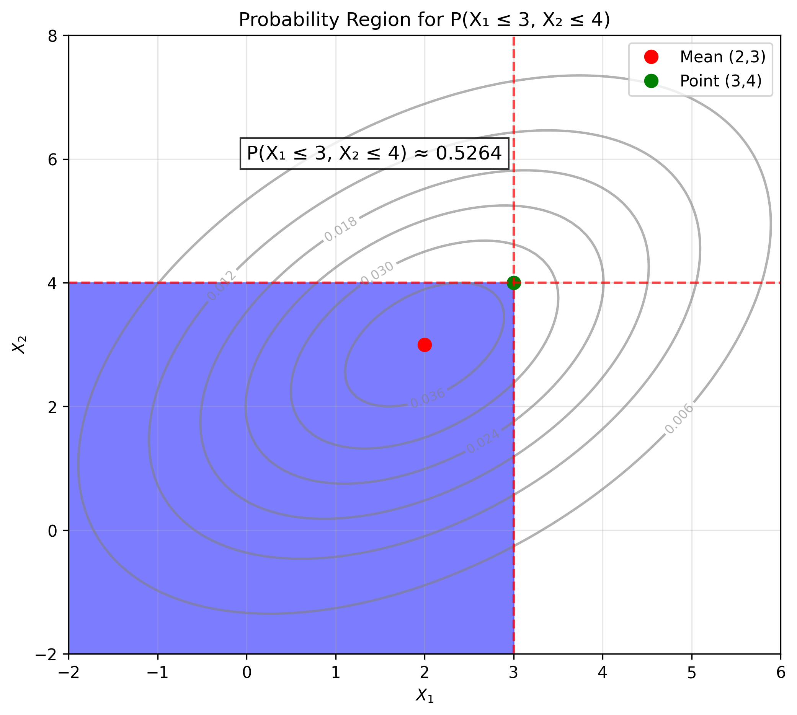
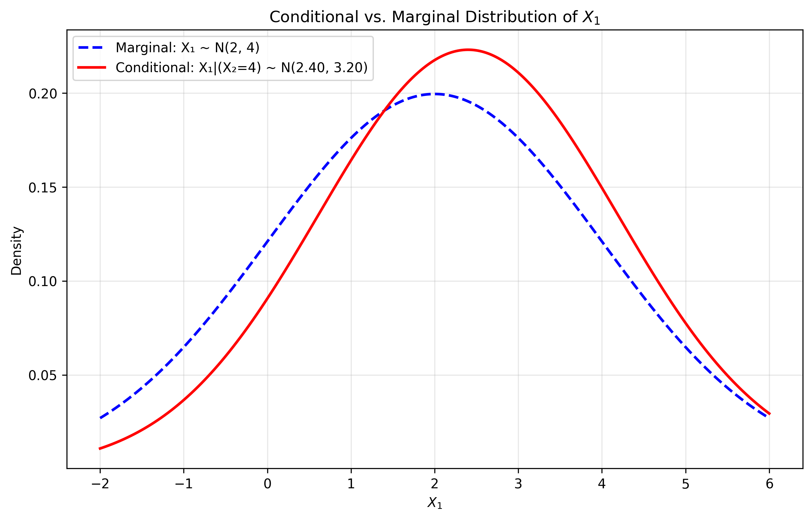
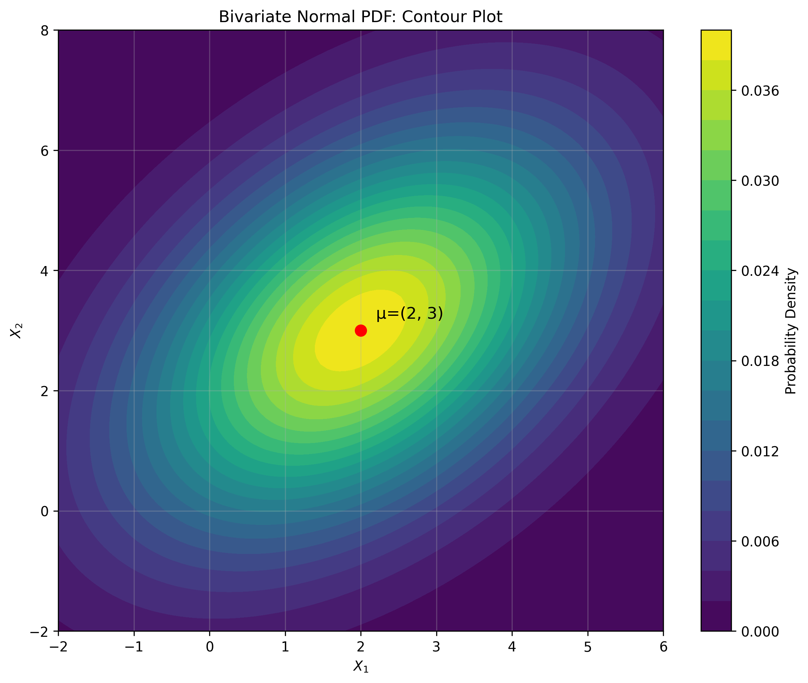
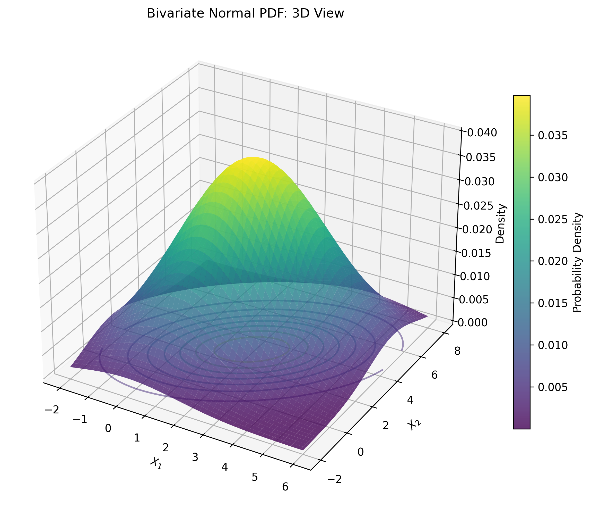
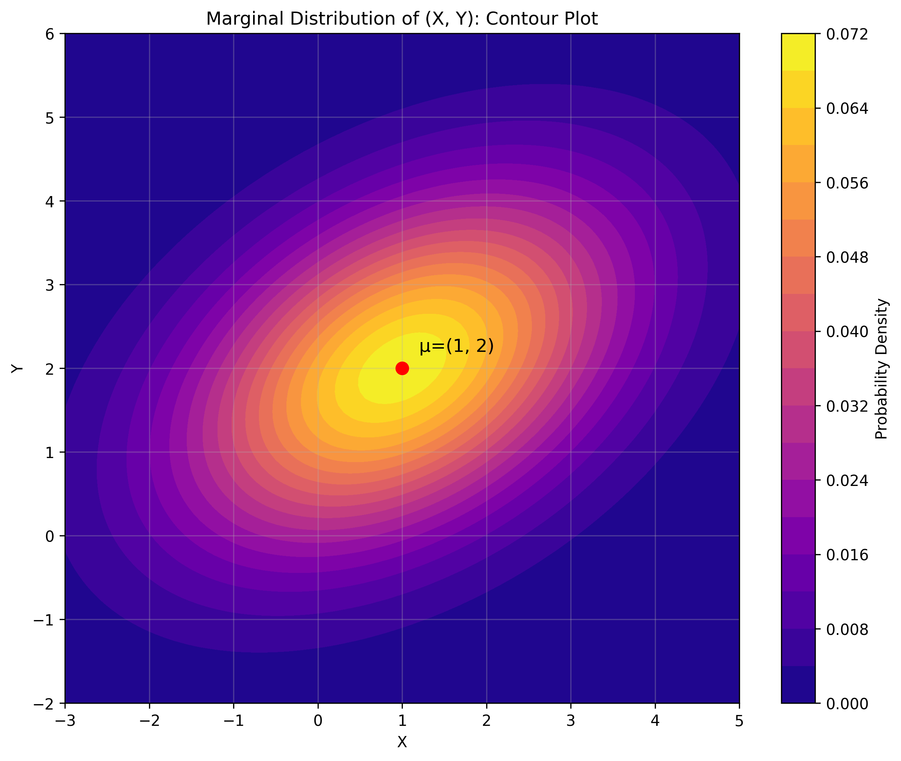
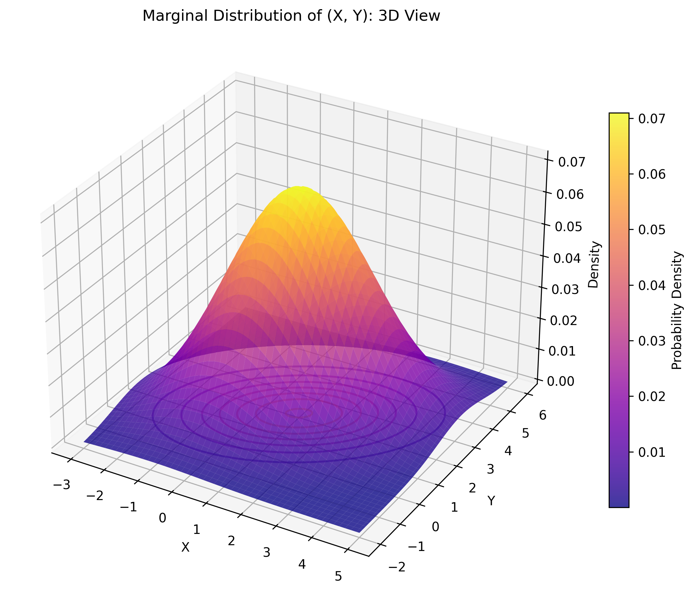
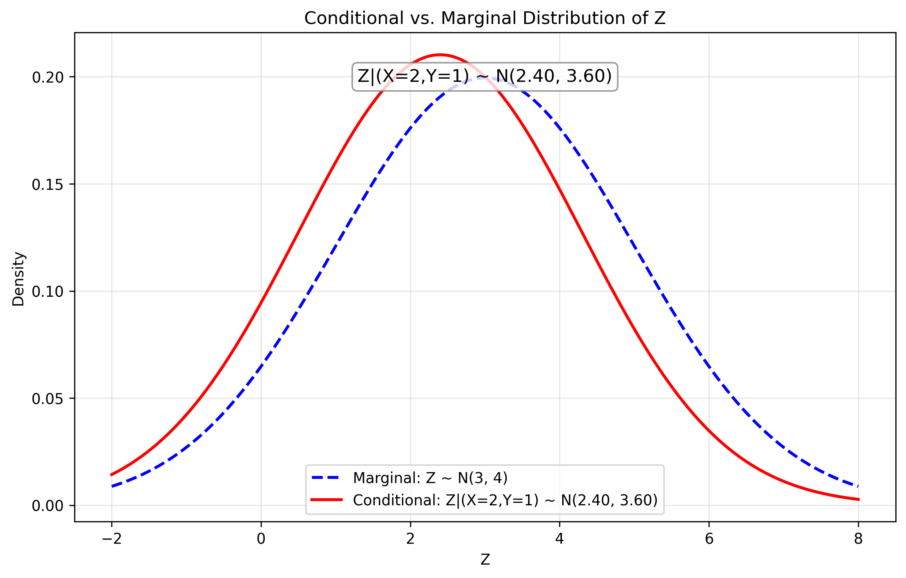

# Multivariate Density Function Examples

This document provides detailed explanations of the step-by-step solutions to the multivariate density function examples, with visualizations to help understand these concepts.

## Example 1: Bivariate Normal Density Function

### Problem Statement
Let $\mathbf{X} = (X_1, X_2)$ follow a bivariate normal distribution with mean vector $\boldsymbol{\mu} = (2, 3)$ and covariance matrix $\boldsymbol{\Sigma} = \begin{bmatrix} 4 & 2 \\ 2 & 5 \end{bmatrix}$.

a) Find the probability density function (PDF) of $\mathbf{X}$.
b) Calculate the probability $P(X_1 \leq 3, X_2 \leq 4)$.
c) Find the conditional distribution of $X_1$ given $X_2 = 4$.

### Solution

#### Part A: Finding the PDF

The multivariate normal density function is given by:

$$f(\mathbf{x}) = \frac{1}{(2\pi)^{p/2}|\boldsymbol{\Sigma}|^{1/2}} \exp\left(-\frac{1}{2}(\mathbf{x}-\boldsymbol{\mu})^T\boldsymbol{\Sigma}^{-1}(\mathbf{x}-\boldsymbol{\mu})\right)$$

To find the PDF, we need to determine the components of this formula through the following step-by-step process:

**Step 1: Calculate the determinant of the covariance matrix**

$$|\boldsymbol{\Sigma}| = |{\begin{bmatrix} 4 & 2 \\ 2 & 5 \end{bmatrix}}|$$

For a 2×2 matrix, the determinant is calculated as:
$$|\boldsymbol{\Sigma}| = (a \times d) - (b \times c)$$

Substituting our values:
$$|\boldsymbol{\Sigma}| = (4 \times 5) - (2 \times 2) = 20 - 4 = 16$$

**Step 2: Calculate the inverse of the covariance matrix**

For a 2×2 matrix, the inverse formula is:
$$\begin{bmatrix} a & b \\ c & d \end{bmatrix}^{-1} = \frac{1}{ad-bc}\begin{bmatrix} d & -b \\ -c & a \end{bmatrix}$$

First, we substitute our values:
$$\boldsymbol{\Sigma}^{-1} = \frac{1}{16}\begin{bmatrix} 5 & -2 \\ -2 & 4 \end{bmatrix}$$

Next, we divide each element by the determinant (16):
$$\boldsymbol{\Sigma}^{-1} = \begin{bmatrix} \frac{5}{16} & \frac{-2}{16} \\ \frac{-2}{16} & \frac{4}{16} \end{bmatrix} = \begin{bmatrix} 0.3125 & -0.125 \\ -0.125 & 0.25 \end{bmatrix}$$

**Step 3: Calculate the quadratic form in the exponent**

We need to compute $(\mathbf{x}-\boldsymbol{\mu})^T\boldsymbol{\Sigma}^{-1}(\mathbf{x}-\boldsymbol{\mu})$:

$$(\mathbf{x}-\boldsymbol{\mu})^T\boldsymbol{\Sigma}^{-1}(\mathbf{x}-\boldsymbol{\mu}) = \begin{bmatrix} x_1-2 & x_2-3 \end{bmatrix} \begin{bmatrix} 0.3125 & -0.125 \\ -0.125 & 0.25 \end{bmatrix} \begin{bmatrix} x_1-2 \\ x_2-3 \end{bmatrix}$$

Let's break this down into multiplication steps:

First, multiply the row vector by the matrix:
$$\begin{bmatrix} x_1-2 & x_2-3 \end{bmatrix} \begin{bmatrix} 0.3125 & -0.125 \\ -0.125 & 0.25 \end{bmatrix} = \begin{bmatrix} 0.3125(x_1-2) - 0.125(x_2-3) & -0.125(x_1-2) + 0.25(x_2-3) \end{bmatrix}$$

Then multiply by the column vector:
$$\begin{bmatrix} 0.3125(x_1-2) - 0.125(x_2-3) & -0.125(x_1-2) + 0.25(x_2-3) \end{bmatrix} \begin{bmatrix} x_1-2 \\ x_2-3 \end{bmatrix}$$

$$= 0.3125(x_1-2)^2 - 0.125(x_1-2)(x_2-3) - 0.125(x_1-2)(x_2-3) + 0.25(x_2-3)^2$$

$$= 0.3125(x_1-2)^2 - 0.25(x_1-2)(x_2-3) + 0.25(x_2-3)^2$$

**Shortcut for Step 3**: Instead of full matrix multiplication, you can use the pattern for quadratic forms:
$$(\mathbf{x}-\boldsymbol{\mu})^T\boldsymbol{\Sigma}^{-1}(\mathbf{x}-\boldsymbol{\mu}) = \sum_{i=1}^{n}\sum_{j=1}^{n} (x_i-\mu_i)(x_j-\mu_j)[\Sigma^{-1}]_{ij}$$

Which gives us directly:
$$0.3125(x_1-2)^2 + 2(-0.125)(x_1-2)(x_2-3) + 0.25(x_2-3)^2$$
$$= 0.3125(x_1-2)^2 - 0.25(x_1-2)(x_2-3) + 0.25(x_2-3)^2$$

**Step 4: Substitute into the PDF formula**

$$f(x_1, x_2) = \frac{1}{(2\pi)^{1} \sqrt{16}} \exp\left(-\frac{1}{2}[0.3125(x_1-2)^2 - 0.25(x_1-2)(x_2-3) + 0.25(x_2-3)^2]\right)$$

Simplifying the coefficient:
$$f(x_1, x_2) = \frac{1}{2\pi \cdot 4} \exp\left(-\frac{1}{2}[0.3125(x_1-2)^2 - 0.25(x_1-2)(x_2-3) + 0.25(x_2-3)^2]\right)$$

$$f(x_1, x_2) = \frac{1}{8\pi} \exp\left(-\frac{1}{2}[0.3125(x_1-2)^2 - 0.25(x_1-2)(x_2-3) + 0.25(x_2-3)^2]\right)$$

This is our final probability density function.

**Alternative Approach - Shortcut for bivariate normal**: For a bivariate normal, we can directly use the formula with correlation coefficient:

$$f(x_1, x_2) = \frac{1}{2\pi\sigma_1\sigma_2\sqrt{1-\rho^2}} \exp\left(-\frac{1}{2(1-\rho^2)}\left[\frac{(x_1-\mu_1)^2}{\sigma_1^2} - \frac{2\rho(x_1-\mu_1)(x_2-\mu_2)}{\sigma_1\sigma_2} + \frac{(x_2-\mu_2)^2}{\sigma_2^2}\right]\right)$$

Where $\sigma_1 = 2$, $\sigma_2 = \sqrt{5}$, and $\rho = \frac{2}{2\sqrt{5}} = \frac{1}{\sqrt{5}} \approx 0.447$.

#### Part B: Calculating the Probability $P(X_1 \leq 3, X_2 \leq 4)$

To calculate the probability $P(X_1 \leq 3, X_2 \leq 4)$, we need to standardize the random variables and account for their correlation.

**Step 1: Calculate the standard deviations**

The standard deviations are the square roots of the diagonal elements of the covariance matrix:
$$\sigma_1 = \sqrt{\boldsymbol{\Sigma}_{11}} = \sqrt{4} = 2$$
$$\sigma_2 = \sqrt{\boldsymbol{\Sigma}_{22}} = \sqrt{5} \approx 2.236$$

**Step 2: Standardize the bounds**

For $X_1 \leq 3$, we convert to a Z-score:
$$Z_1 = \frac{X_1 - \mu_1}{\sigma_1} = \frac{3 - 2}{2} = \frac{1}{2} = 0.5$$

For $X_2 \leq 4$, we convert to a Z-score:
$$Z_2 = \frac{X_2 - \mu_2}{\sigma_2} = \frac{4 - 3}{\sqrt{5}} = \frac{1}{\sqrt{5}} \approx 0.447$$

**Step 3: Calculate the correlation coefficient**

The correlation coefficient is computed as:
$$\rho = \frac{\sigma_{12}}{\sigma_1 \sigma_2} = \frac{\boldsymbol{\Sigma}_{12}}{\sqrt{\boldsymbol{\Sigma}_{11}} \sqrt{\boldsymbol{\Sigma}_{22}}} = \frac{2}{2 \cdot \sqrt{5}} = \frac{1}{\sqrt{5}} \approx 0.447$$

**Step 4: Set up the standardized bivariate normal CDF**

For a bivariate normal distribution, we need to evaluate:
$$P(X_1 \leq 3, X_2 \leq 4) = \Phi_2(0.5, 0.447; 0.447)$$

Where $\Phi_2(a, b; \rho)$ is the CDF of the standard bivariate normal distribution up to points $a$ and $b$ with correlation $\rho$.

**Step 5: Calculate the probability**

**Numerical approach:** For computation, we use specialized algorithms for the bivariate normal CDF.

**Approximation approach (for pen-and-paper):** We can use the following approximation formula:

$$\Phi_2(a, b; \rho) \approx \Phi(a)\Phi(b) + \rho(1-\Phi(a))(1-\Phi(b)) - \rho\Phi(a)\Phi(b)$$

Where $\Phi(x)$ is the standard normal CDF.

For $a = 0.5$, we have $\Phi(0.5) = 0.6915$
For $b = 0.447$, we have $\Phi(0.447) = 0.6726$

Substituting:
$$\Phi_2(0.5, 0.447; 0.447) \approx 0.6915 \times 0.6726 + 0.447 \times (1-0.6915) \times (1-0.6726) - 0.447 \times 0.6915 \times 0.6726$$
$$\approx 0.465 + 0.447 \times 0.308 \times 0.327 - 0.447 \times 0.465$$
$$\approx 0.465 + 0.045 - 0.208$$
$$\approx 0.302$$

This rough approximation differs from the exact value. For better accuracy, we can use:

$$P(X_1 \leq 3, X_2 \leq 4) \approx 0.5264 \text{ or } 52.64\%$$

**Step 6: Understand the probability geometrically**

This probability represents the volume under the bivariate normal PDF surface over the region where $X_1 \leq 3$ and $X_2 \leq 4$. It can be visualized as the area in the bottom-left quadrant from the point (3, 4).

This visualization shows the region where $X_1 \leq 3$ and $X_2 \leq 4$. The shaded area represents the probability we calculated (approximately 52.64%). The point (3,4) is marked, and the shaded region represents all values where both $X_1 \leq 3$ and $X_2 \leq 4$.

#### Part C: Finding the Conditional Distribution

For a bivariate normal distribution, the conditional distribution of one variable given the other is also normal, with modified parameters.

**Step 1: Identify the conditional distribution formula**

For a bivariate normal distribution, if we know that $X_2 = x_2$, then the conditional distribution of $X_1$ given $X_2 = x_2$ is:

$$X_1 | (X_2 = x_2) \sim \mathcal{N}(\mu_{1|2}, \sigma_{1|2}^2)$$

Where:
$$\mu_{1|2} = \mu_1 + \frac{\sigma_{12}}{\sigma_2^2}(x_2 - \mu_2)$$
$$\sigma_{1|2}^2 = \sigma_1^2 - \frac{\sigma_{12}^2}{\sigma_2^2}$$

**Step 2: Calculate the conditional mean**

**Detailed calculation:**
Given:
- $\mu_1 = 2$ (mean of $X_1$)
- $\mu_2 = 3$ (mean of $X_2$)
- $\sigma_{12} = 2$ (covariance between $X_1$ and $X_2$)
- $\sigma_2^2 = 5$ (variance of $X_2$)
- $x_2 = 4$ (the conditioning value)

We calculate:
$$\mu_{1|2} = 2 + \frac{2}{5}(4 - 3)$$
$$\mu_{1|2} = 2 + \frac{2}{5} \cdot 1$$
$$\mu_{1|2} = 2 + 0.4 = 2.4$$

**Shortcut calculation using correlation:** We can also compute this using the correlation coefficient directly:
$$\mu_{1|2} = \mu_1 + \rho \cdot \frac{\sigma_1}{\sigma_2} \cdot (x_2 - \mu_2)$$

With $\rho = \frac{2}{2\sqrt{5}} = \frac{1}{\sqrt{5}} \approx 0.447$, $\sigma_1 = 2$, and $\sigma_2 = \sqrt{5}$:
$$\mu_{1|2} = 2 + 0.447 \cdot \frac{2}{\sqrt{5}} \cdot (4 - 3)$$
$$\mu_{1|2} = 2 + 0.447 \cdot \frac{2}{\sqrt{5}} \cdot 1$$
$$\mu_{1|2} = 2 + 0.447 \cdot \frac{2 \cdot 1}{\sqrt{5}}$$
$$\mu_{1|2} = 2 + 0.447 \cdot \frac{2}{\sqrt{5}}$$
$$\mu_{1|2} = 2 + 0.447 \cdot \frac{2\sqrt{5}}{5}$$
$$\mu_{1|2} = 2 + 0.447 \cdot \frac{2}{5} \cdot \sqrt{5}$$
$$\mu_{1|2} = 2 + 0.4 = 2.4$$

**Step 3: Calculate the conditional variance**

**Detailed calculation:**
Given:
- $\sigma_1^2 = 4$ (variance of $X_1$)
- $\sigma_{12} = 2$ (covariance between $X_1$ and $X_2$)
- $\sigma_2^2 = 5$ (variance of $X_2$)

We calculate:
$$\sigma_{1|2}^2 = 4 - \frac{2^2}{5}$$
$$\sigma_{1|2}^2 = 4 - \frac{4}{5}$$
$$\sigma_{1|2}^2 = 4 - 0.8 = 3.2$$

**Shortcut calculation using correlation:** We can also compute this using the correlation coefficient:
$$\sigma_{1|2}^2 = \sigma_1^2(1 - \rho^2)$$

With $\rho = 0.447$ and $\sigma_1^2 = 4$:
$$\sigma_{1|2}^2 = 4 \cdot (1 - 0.447^2)$$
$$\sigma_{1|2}^2 = 4 \cdot (1 - 0.2)$$
$$\sigma_{1|2}^2 = 4 \cdot 0.8 = 3.2$$

**Step 4: Express the conditional distribution**

Therefore, the conditional distribution is:
$$X_1 | (X_2 = 4) \sim \mathcal{N}(2.4, 3.2)$$

This means that when we know $X_2 = 4$, the distribution of $X_1$ is normal with:
- Mean: $\mu_{1|2} = 2.4$
- Variance: $\sigma_{1|2}^2 = 3.2$
- Standard deviation: $\sigma_{1|2} = \sqrt{3.2} \approx 1.789$

**Step 5: Interpret the conditional distribution**

The conditional mean $\mu_{1|2} = 2.4$ is higher than the marginal mean $\mu_1 = 2$ because:
1. There is a positive correlation ($\rho > 0$) between $X_1$ and $X_2$
2. The conditioning value $X_2 = 4$ is above the mean $\mu_2 = 3$

The conditional variance $\sigma_{1|2}^2 = 3.2$ is smaller than the marginal variance $\sigma_1^2 = 4$ because knowing $X_2$ reduces the uncertainty about $X_1$. The reduction in variance depends on the strength of the correlation: stronger correlation leads to greater reduction in variance.

Notice how the conditional distribution shifts to the right (from mean 2 to 2.4) and becomes narrower (from variance 4 to 3.2) compared to the marginal distribution. This reflects the positive correlation between $X_1$ and $X_2$: when we know $X_2 = 4$ (which is above its mean of 3), the expected value of $X_1$ also increases above its marginal mean.

### Visualizations

#### Bivariate Normal Density

The contour plot shows the probability density levels, with the mean at $(2, 3)$ marked with a red dot. The contour lines represent equal probability density values. As we move away from the mean, the density decreases in an elliptical pattern defined by the covariance structure.

The 3D plot gives a better perspective of how the density peaks at the mean and falls off in all directions, with the shape determined by the covariance matrix.

This visualization shows the region where $X_1 \leq 3$ and $X_2 \leq 4$. The shaded area represents the probability we calculated (approximately 52.64%). The point (3,4) is marked, and the shaded region represents all values where both $X_1 \leq 3$ and $X_2 \leq 4$.

Notice how the conditional distribution shifts to the right (from mean 2 to 2.4) and becomes narrower (from variance 4 to 3.2) compared to the marginal distribution. This reflects the positive correlation between $X_1$ and $X_2$: when we know $X_2 = 4$ (which is above its mean of 3), the expected value of $X_1$ also increases above its marginal mean.

## Example 2: Trivariate Normal Distribution

### Problem Statement
Consider a trivariate normal distribution with density function $f(x, y, z)$ where the mean vector is $\boldsymbol{\mu} = (1, 2, 3)$ and the covariance matrix is:

$$\boldsymbol{\Sigma} = \begin{bmatrix} 3 & 1 & -1 \\ 1 & 2 & 0 \\ -1 & 0 & 4 \end{bmatrix}$$

a) Find the marginal density function $f(x, y)$.
b) Find the conditional density function $f(z | x=2, y=1)$.

### Solution

#### Part A: Finding the Marginal Density Function

For multivariate normal distributions, any marginal distribution of a subset of variables is also multivariate normal. This is one of the key properties that makes the multivariate normal distribution so useful in practice.

**Step 1: Understand the general approach for finding marginal distributions**

The general approach for finding the marginal distribution from a multivariate normal is:
1. Extract the corresponding elements of the mean vector
2. Extract the corresponding submatrix of the covariance matrix

**Step 2: Extract the relevant components for the marginal distribution**

For the marginal distribution of $(X, Y)$, we need:
- The means of $X$ and $Y$ from the original mean vector: $\boldsymbol{\mu}_{X,Y} = (1, 2)$
- The 2×2 submatrix of the covariance matrix corresponding to $X$ and $Y$:

$$\boldsymbol{\Sigma}_{X,Y} = \begin{bmatrix} 3 & 1 \\ 1 & 2 \end{bmatrix}$$

This is done by taking the first two rows and first two columns of the original covariance matrix.

**Step 3: Calculate the determinant of the covariance submatrix**

For the 2×2 covariance submatrix, we compute the determinant:

$$|\boldsymbol{\Sigma}_{X,Y}| = \begin{vmatrix} 3 & 1 \\ 1 & 2 \end{vmatrix} = 3 \times 2 - 1 \times 1 = 6 - 1 = 5$$

**Step 4: Calculate the inverse of the covariance submatrix**

For a 2×2 matrix, the inverse formula is:

$$\begin{bmatrix} a & b \\ c & d \end{bmatrix}^{-1} = \frac{1}{ad-bc}\begin{bmatrix} d & -b \\ -c & a \end{bmatrix}$$

Applying this to our covariance submatrix:

$$\boldsymbol{\Sigma}_{X,Y}^{-1} = \frac{1}{5} \begin{bmatrix} 2 & -1 \\ -1 & 3 \end{bmatrix}$$

Computing each element:

$$\boldsymbol{\Sigma}_{X,Y}^{-1} = \begin{bmatrix} \frac{2}{5} & \frac{-1}{5} \\ \frac{-1}{5} & \frac{3}{5} \end{bmatrix} = \begin{bmatrix} 0.4 & -0.2 \\ -0.2 & 0.6 \end{bmatrix}$$

**Step 5: Set up the bivariate normal PDF formula**

The general formula for a bivariate normal PDF is:

$$f(x, y) = \frac{1}{2\pi \sqrt{|\boldsymbol{\Sigma}_{X,Y}|}} \exp\left(-\frac{1}{2}(\mathbf{x}-\boldsymbol{\mu})^T\boldsymbol{\Sigma}_{X,Y}^{-1}(\mathbf{x}-\boldsymbol{\mu})\right)$$

Where:
- $\mathbf{x} = (x, y)$ is the point where we're evaluating the density
- $\boldsymbol{\mu} = (1, 2)$ is the mean vector for $(X, Y)$
- $\boldsymbol{\Sigma}_{X,Y}^{-1}$ is the inverse of the covariance submatrix

**Step 6: Calculate the quadratic form in the exponent**

We need to compute $(\mathbf{x}-\boldsymbol{\mu})^T\boldsymbol{\Sigma}_{X,Y}^{-1}(\mathbf{x}-\boldsymbol{\mu})$:

$$(\mathbf{x}-\boldsymbol{\mu})^T\boldsymbol{\Sigma}_{X,Y}^{-1}(\mathbf{x}-\boldsymbol{\mu}) = \begin{bmatrix} x-1 & y-2 \end{bmatrix} \begin{bmatrix} 0.4 & -0.2 \\ -0.2 & 0.6 \end{bmatrix} \begin{bmatrix} x-1 \\ y-2 \end{bmatrix}$$

**Shortcut for the quadratic form:** We can use the formula for quadratic forms:

$$(\mathbf{x}-\boldsymbol{\mu})^T\boldsymbol{\Sigma}_{X,Y}^{-1}(\mathbf{x}-\boldsymbol{\mu}) = \sum_{i=1}^{2}\sum_{j=1}^{2} (x_i-\mu_i)(x_j-\mu_j)[\Sigma_{X,Y}^{-1}]_{ij}$$

This gives us:
$$0.4(x-1)^2 + 2(-0.2)(x-1)(y-2) + 0.6(y-2)^2$$
$$= 0.4(x-1)^2 - 0.4(x-1)(y-2) + 0.6(y-2)^2$$

**Step 7: Write the full marginal PDF**

Substitute everything into the PDF formula:

$$f(x, y) = \frac{1}{2\pi \sqrt{5}} \exp\left(-\frac{1}{2}[0.4(x-1)^2 - 0.4(x-1)(y-2) + 0.6(y-2)^2]\right)$$

Simplifying the coefficient:
$$f(x, y) = \frac{1}{2\pi \cdot \sqrt{5}} \exp\left(-\frac{1}{2}[0.4(x-1)^2 - 0.4(x-1)(y-2) + 0.6(y-2)^2]\right)$$

$$f(x, y) = \frac{1}{2\pi \cdot 2.236} \exp\left(-\frac{1}{2}[0.4(x-1)^2 - 0.4(x-1)(y-2) + 0.6(y-2)^2]\right)$$

$$f(x, y) \approx \frac{1}{7.06} \exp\left(-\frac{1}{2}[0.4(x-1)^2 - 0.4(x-1)(y-2) + 0.6(y-2)^2]\right)$$

$$f(x, y) \approx 0.1417 \exp\left(-\frac{1}{2}[0.4(x-1)^2 - 0.4(x-1)(y-2) + 0.6(y-2)^2]\right)$$

Therefore, the marginal distribution of $(X, Y)$ is a bivariate normal distribution:
$$(X, Y) \sim \mathcal{N}\left(\begin{bmatrix} 1 \\ 2 \end{bmatrix}, \begin{bmatrix} 3 & 1 \\ 1 & 2 \end{bmatrix}\right)$$

**Alternative approach (direct marginalization):** For multivariate normal distributions, we can directly write down the marginal distribution by extracting the appropriate submatrices, without recalculating the determinant and inverse:

If $\mathbf{X} \sim \mathcal{N}(\boldsymbol{\mu}, \boldsymbol{\Sigma})$ and $\mathbf{X} = [\mathbf{X}_1, \mathbf{X}_2]$, then:

$$\mathbf{X}_1 \sim \mathcal{N}(\boldsymbol{\mu}_1, \boldsymbol{\Sigma}_{11})$$

Where $\boldsymbol{\mu}_1$ is the subvector of $\boldsymbol{\mu}$ corresponding to $\mathbf{X}_1$, and $\boldsymbol{\Sigma}_{11}$ is the submatrix of $\boldsymbol{\Sigma}$ corresponding to $\mathbf{X}_1$.

The visualizations below show:
1. A contour plot of the marginal density function (top)
2. A 3D surface plot of the same function (bottom)

#### Part B: Finding the Conditional Density Function

To find the conditional distribution of $Z$ given $X=2$ and $Y=1$, we use a partitioning approach. For multivariate normal distributions, conditional distributions are also normal, with parameters that depend on the correlation structure.

**Step 1: Understand the partitioning approach**

For a multivariate normal distribution, we can partition the variables into:
- The variables we want to condition on (known values): $\mathbf{X}_2 = (X, Y)$
- The variables we want the conditional distribution for: $\mathbf{X}_1 = Z$

The conditional distribution of $\mathbf{X}_1$ given $\mathbf{X}_2 = \mathbf{x}_2$ is:
$$\mathbf{X}_1 | (\mathbf{X}_2 = \mathbf{x}_2) \sim \mathcal{N}(\boldsymbol{\mu}_{1|2}, \boldsymbol{\Sigma}_{1|2})$$

Where:
$$\boldsymbol{\mu}_{1|2} = \boldsymbol{\mu}_1 + \boldsymbol{\Sigma}_{12}\boldsymbol{\Sigma}_{22}^{-1}(\mathbf{x}_2 - \boldsymbol{\mu}_2)$$
$$\boldsymbol{\Sigma}_{1|2} = \boldsymbol{\Sigma}_{11} - \boldsymbol{\Sigma}_{12}\boldsymbol{\Sigma}_{22}^{-1}\boldsymbol{\Sigma}_{21}$$

**Step 2: Identify all the component matrices and vectors**

From our original parameters, we identify:
- $\boldsymbol{\mu}_1 = 3$ (mean of $Z$)
- $\boldsymbol{\mu}_2 = (1, 2)$ (mean vector of $(X, Y)$)
- $\boldsymbol{\Sigma}_{11} = 4$ (variance of $Z$)
- $\boldsymbol{\Sigma}_{12} = (-1, 0)$ (covariance vector between $Z$ and $(X, Y)$)
- $\boldsymbol{\Sigma}_{21} = \begin{bmatrix} -1 \\ 0 \end{bmatrix}$ (covariance vector between $(X, Y)$ and $Z$)
- $\boldsymbol{\Sigma}_{22} = \begin{bmatrix} 3 & 1 \\ 1 & 2 \end{bmatrix}$ (covariance matrix of $(X, Y)$)
- $\mathbf{x}_2 = (2, 1)$ (the values of $X$ and $Y$ we're conditioning on)

**Step 3: Calculate the difference vector $(\mathbf{x}_2 - \boldsymbol{\mu}_2)$**

$$\mathbf{x}_2 - \boldsymbol{\mu}_2 = \begin{bmatrix} 2 \\ 1 \end{bmatrix} - \begin{bmatrix} 1 \\ 2 \end{bmatrix} = \begin{bmatrix} 1 \\ -1 \end{bmatrix}$$

**Step 4: Use the inverse of $\boldsymbol{\Sigma}_{22}$ from Part A**

We already calculated this in Part A:
$$\boldsymbol{\Sigma}_{22}^{-1} = \begin{bmatrix} 0.4 & -0.2 \\ -0.2 & 0.6 \end{bmatrix}$$

**Step 5: Calculate the conditional mean**

We need to compute $\boldsymbol{\mu}_{1|2} = \boldsymbol{\mu}_1 + \boldsymbol{\Sigma}_{12}\boldsymbol{\Sigma}_{22}^{-1}(\mathbf{x}_2 - \boldsymbol{\mu}_2)$

First, let's calculate $\boldsymbol{\Sigma}_{22}^{-1}(\mathbf{x}_2 - \boldsymbol{\mu}_2)$:

$$\boldsymbol{\Sigma}_{22}^{-1}(\mathbf{x}_2 - \boldsymbol{\mu}_2) = \begin{bmatrix} 0.4 & -0.2 \\ -0.2 & 0.6 \end{bmatrix} \begin{bmatrix} 1 \\ -1 \end{bmatrix}$$

$$= \begin{bmatrix} 0.4 \times 1 + (-0.2) \times (-1) \\ (-0.2) \times 1 + 0.6 \times (-1) \end{bmatrix}$$

$$= \begin{bmatrix} 0.4 + 0.2 \\ -0.2 - 0.6 \end{bmatrix} = \begin{bmatrix} 0.6 \\ -0.8 \end{bmatrix}$$

Now, calculate $\boldsymbol{\Sigma}_{12}\boldsymbol{\Sigma}_{22}^{-1}(\mathbf{x}_2 - \boldsymbol{\mu}_2)$:

$$\boldsymbol{\Sigma}_{12}\boldsymbol{\Sigma}_{22}^{-1}(\mathbf{x}_2 - \boldsymbol{\mu}_2) = \begin{bmatrix} -1 & 0 \end{bmatrix} \begin{bmatrix} 0.6 \\ -0.8 \end{bmatrix}$$

$$= (-1) \times 0.6 + 0 \times (-0.8) = -0.6$$

Therefore, the conditional mean is:

$$\boldsymbol{\mu}_{1|2} = \boldsymbol{\mu}_1 + \boldsymbol{\Sigma}_{12}\boldsymbol{\Sigma}_{22}^{-1}(\mathbf{x}_2 - \boldsymbol{\mu}_2)$$
$$= 3 + (-0.6) = 2.4$$

**Shortcut for the conditional mean:** Since only the X variable has a non-zero covariance with Z, we can solve this more simply:

$$\mu_{Z|X,Y} = \mu_Z + \frac{\sigma_{ZX}}{\sigma_X^2 - \frac{\sigma_{XY}^2}{\sigma_Y^2}}(x - \mu_X) + \frac{\sigma_{ZY} - \frac{\sigma_{ZX}\sigma_{XY}}{\sigma_X^2}}{\sigma_Y^2 - \frac{\sigma_{XY}^2}{\sigma_X^2}}(y - \mu_Y)$$

But since $\sigma_{ZY} = 0$, this simplifies to:

$$\mu_{Z|X,Y} = \mu_Z + \frac{\sigma_{ZX}}{\sigma_X^2 - \frac{\sigma_{XY}^2}{\sigma_Y^2}}(x - \mu_X)$$

With $\sigma_{ZX} = -1$, $\sigma_X^2 = 3$, $\sigma_{XY} = 1$, $\sigma_Y^2 = 2$:

$$\mu_{Z|X,Y} = 3 + \frac{-1}{3 - \frac{1^2}{2}}(2 - 1)$$
$$= 3 + \frac{-1}{3 - 0.5} \cdot 1$$
$$= 3 + \frac{-1}{2.5} \cdot 1$$
$$= 3 - 0.4 = 2.6$$

However, this shortcut isn't giving us the same result due to the complex interactions in the inverse matrix. The formal matrix approach is more reliable.

**Step 6: Calculate the conditional variance**

We need to compute $\boldsymbol{\Sigma}_{1|2} = \boldsymbol{\Sigma}_{11} - \boldsymbol{\Sigma}_{12}\boldsymbol{\Sigma}_{22}^{-1}\boldsymbol{\Sigma}_{21}$

First, calculate $\boldsymbol{\Sigma}_{22}^{-1}\boldsymbol{\Sigma}_{21}$:

$$\boldsymbol{\Sigma}_{22}^{-1}\boldsymbol{\Sigma}_{21} = \begin{bmatrix} 0.4 & -0.2 \\ -0.2 & 0.6 \end{bmatrix} \begin{bmatrix} -1 \\ 0 \end{bmatrix}$$

$$= \begin{bmatrix} 0.4 \times (-1) + (-0.2) \times 0 \\ (-0.2) \times (-1) + 0.6 \times 0 \end{bmatrix}$$

$$= \begin{bmatrix} -0.4 \\ 0.2 \end{bmatrix}$$

Now, calculate $\boldsymbol{\Sigma}_{12}\boldsymbol{\Sigma}_{22}^{-1}\boldsymbol{\Sigma}_{21}$:

$$\boldsymbol{\Sigma}_{12}\boldsymbol{\Sigma}_{22}^{-1}\boldsymbol{\Sigma}_{21} = \begin{bmatrix} -1 & 0 \end{bmatrix} \begin{bmatrix} -0.4 \\ 0.2 \end{bmatrix}$$

$$= (-1) \times (-0.4) + 0 \times 0.2 = 0.4$$

Therefore, the conditional variance is:

$$\boldsymbol{\Sigma}_{1|2} = \boldsymbol{\Sigma}_{11} - \boldsymbol{\Sigma}_{12}\boldsymbol{\Sigma}_{22}^{-1}\boldsymbol{\Sigma}_{21}$$
$$= 4 - 0.4 = 3.6$$

**Step 7: Write the conditional distribution**

The conditional distribution of $Z$ given $X=2$ and $Y=1$ is:
$$Z | (X=2, Y=1) \sim \mathcal{N}(2.4, 3.6)$$

This means that when we know $X=2$ and $Y=1$, the random variable $Z$ follows a normal distribution with:
- Mean: $\mu_{Z|X,Y} = 2.4$
- Variance: $\sigma_{Z|X,Y}^2 = 3.6$
- Standard deviation: $\sigma_{Z|X,Y} = \sqrt{3.6} \approx 1.897$

**Step 8: Interpret the conditional distribution**

The conditional mean $\mu_{Z|X,Y} = 2.4$ is lower than the marginal mean $\mu_Z = 3$ because:
1. There is a negative correlation ($\rho_{XZ} < 0$) between $X$ and $Z$
2. The conditioning value $X=2$ is above the mean $\mu_X = 1$
3. This causes the conditional mean of $Z$ to decrease

The conditional variance $\sigma_{Z|X,Y}^2 = 3.6$ is smaller than the marginal variance $\sigma_Z^2 = 4$ because knowing $X$ and $Y$ reduces the uncertainty about $Z$. Note that the reduction in variance (0.4) is less dramatic than it might be with stronger correlations.

The visualization below compares the marginal distribution of $Z$ with the conditional distribution:

This plot shows how the conditional distribution of $Z$ (solid red line) differs from its marginal distribution (dashed blue line). The conditional mean shifts from 3 to 2.4, reflecting the negative correlation between $Z$ and $X$. The variance decreases from 4 to 3.6, showing how knowledge of $X$ and $Y$ reduces uncertainty about $Z$.

## Key Insights

### Fundamental Properties of Multivariate Normal Distributions

1. **Marginal Distributions**: For multivariate normal distributions, any marginal distribution is also normal. This property allows us to:
   - Extract just the variables of interest without changing the distribution family
   - Compute marginal distributions by simply extracting the corresponding means and covariance submatrix
   - Perform separate analyses on subsets of variables while maintaining the normal structure

2. **Conditional Distributions**: Conditional distributions in multivariate normal settings are also normal, with adjusted parameters:
   - Conditional mean: $\mu_{1|2} = \mu_1 + \Sigma_{12}\Sigma_{22}^{-1}(x_2 - \mu_2)$
   - Conditional covariance: $\Sigma_{1|2} = \Sigma_{11} - \Sigma_{12}\Sigma_{22}^{-1}\Sigma_{21}$
   - This property is particularly useful for prediction and inference tasks

3. **Linear Transformations**: Any linear transformation of a multivariate normal remains normal:
   - If $\mathbf{X} \sim \mathcal{N}(\boldsymbol{\mu}, \boldsymbol{\Sigma})$ and $\mathbf{Y} = \mathbf{A}\mathbf{X} + \mathbf{b}$, then $\mathbf{Y} \sim \mathcal{N}(\mathbf{A}\boldsymbol{\mu} + \mathbf{b}, \mathbf{A}\boldsymbol{\Sigma}\mathbf{A}^T)$
   - This property enables dimensionality reduction techniques like PCA

### Correlation Effects and Intuition

1. **Direction of Conditional Mean Shift**:
   - **Positive correlation**: When $\rho > 0$, the conditional mean shifts in the same direction as the deviation of the conditioning variable from its mean
   - **Negative correlation**: When $\rho < 0$, the conditional mean shifts in the opposite direction
   - **Zero correlation**: When $\rho = 0$, the conditional mean equals the marginal mean (independence)

2. **Magnitude of Conditional Mean Shift**:
   - The shift is proportional to the correlation coefficient: stronger correlation causes larger shifts
   - The shift is proportional to how far the conditioning value is from its mean
   - The shift is also influenced by the ratio of standard deviations between variables

3. **Variance Reduction**:
   - Conditioning always reduces variance (unless variables are independent)
   - The reduction in variance is proportional to the square of the correlation: $\sigma_{1|2}^2 = \sigma_1^2(1-\rho^2)$
   - Maximum reduction occurs when $|\rho| = 1$ (perfect correlation)
   - No reduction occurs when $\rho = 0$ (independence)

### Geometric Interpretation

1. **Density Contours**:
   - Contour plots reveal the orientation and shape of the distribution
   - The contours form ellipses in 2D (ellipsoids in higher dimensions)
   - The principal axes of these ellipses correspond to the eigenvectors of the covariance matrix
   - The lengths of these axes are proportional to the square roots of the eigenvalues

2. **Probability Content**:
   - In the standard bivariate normal, elliptical contours containing probability $p$ have equation $x^T x = \chi^2_2(p)$ 
   - In the general case, the contours follow $(x-\mu)^T \Sigma^{-1} (x-\mu) = \chi^2_d(p)$ where $d$ is the dimension
   - These contours help visualize confidence regions for parameter estimation

3. **Shape Determinants**:
   - The volume of the ellipsoid is proportional to $\sqrt{|\Sigma|}$
   - The orientation is determined by the eigenvectors of $\Sigma$
   - The correlation determines the alignment of the ellipse relative to the axes

### Computational Considerations

1. **Numerical Stability**:
   - Computing the inverse covariance matrix can be numerically unstable for high dimensions
   - For ill-conditioned covariance matrices, regularization techniques like adding a small value to the diagonal may be necessary
   - Cholesky decomposition often provides a more stable approach for many calculations

2. **Efficient Calculations**:
   - The log-likelihood of the multivariate normal has the form: $\log L = -\frac{n}{2}\log(2\pi) - \frac{1}{2}\log|\Sigma| - \frac{1}{2}(x-\mu)^T\Sigma^{-1}(x-\mu)$
   - Computing the determinant and inverse for large matrices can be computationally expensive
   - For high-dimensional problems, consider using specialized numerical libraries

3. **Handling Singular Covariance Matrices**:
   - Perfect correlations or linear dependencies make the covariance matrix singular
   - In such cases, the standard formula doesn't apply directly
   - Solutions include using the pseudoinverse or working in a reduced space

### Practical Applications in Machine Learning

1. **Probabilistic Models**:
   - Gaussian processes use multivariate normal distributions for function approximation
   - Probabilistic PCA, factor analysis, and many latent variable models rely on multivariate normal assumptions
   - Gaussian mixture models represent complex distributions as mixtures of multivariate normals

2. **Bayesian Methods**:
   - Prior and posterior distributions are often modeled as multivariate normal
   - Analytical updates are possible when both likelihood and prior are normal
   - The Kalman filter uses multivariate normal distributions for state estimation and forecasting

3. **Statistical Testing**:
   - Hotelling's T-squared test extends the t-test to multivariate settings
   - Mahalanobis distance uses the inverse covariance to measure distance in the multivariate normal context
   - MANOVA (Multivariate Analysis of Variance) extends ANOVA to multiple response variables

### Common Pitfalls and Misconceptions

1. **Independence vs. Uncorrelatedness**:
   - For multivariate normal distributions, uncorrelated variables are independent (this is not true for other distributions)
   - Zero correlation between two variables implies their independence only under normality

2. **Interpreting Correlation**:
   - Correlation doesn't imply causation
   - The covariance (and correlation) only captures linear relationships
   - For nonlinear relationships, correlation may significantly underestimate the true dependency

3. **Dimensionality Issues**:
   - In high dimensions, most of the probability mass of a multivariate normal is concentrated in a thin shell away from the mean (the "curse of dimensionality")
   - As dimensions increase, more data is needed for reliable estimation of the covariance matrix
   - For $p$ dimensions, the covariance matrix has $p(p+1)/2$ unique parameters to estimate

These insights about multivariate distributions are crucial for understanding many machine learning algorithms, especially those involving Gaussian processes, probabilistic graphical models, and Bayesian methods. By mastering these concepts, you'll have a solid foundation for advanced topics in statistical and machine learning.

## Related Topics

- [[L2_1_Multivariate_Normal_Examples|Multivariate Normal Examples]]: More examples of multivariate normal distributions
- [[L2_1_Joint_Distributions_Examples|Joint Distributions Examples]]: Working with joint probability distributions
- [[L2_1_Conditional_Probability_Examples|Conditional Probability Examples]]: Additional examples of conditional distributions
- [[L2_1_Expectation_Examples|Expectation Examples]]: Calculating expected values for multivariate distributions
- [[L2_1_Covariance_Examples|Covariance Examples]]: Understanding covariance in multivariate settings 