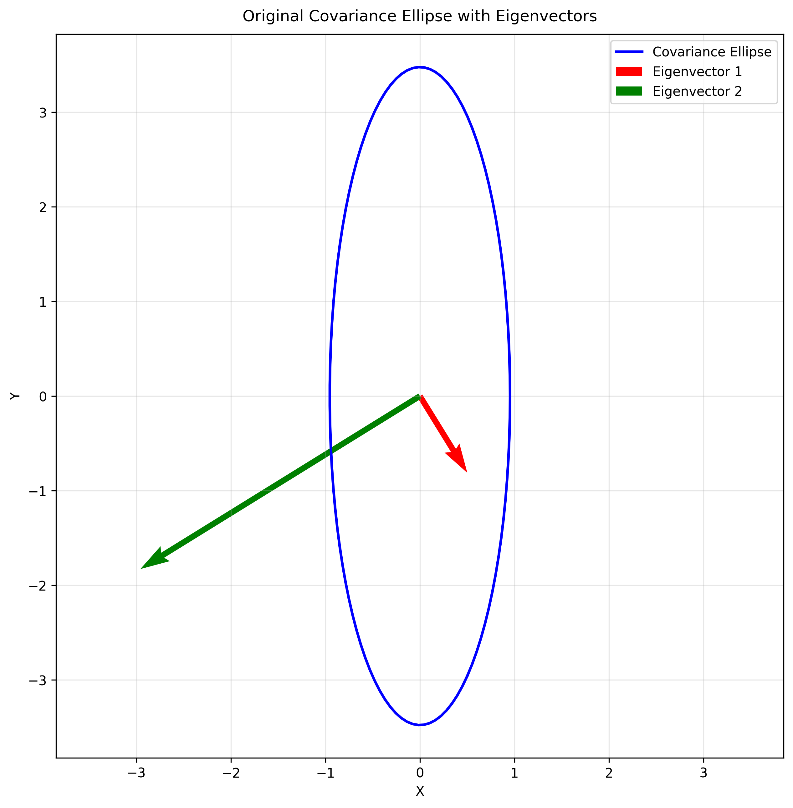
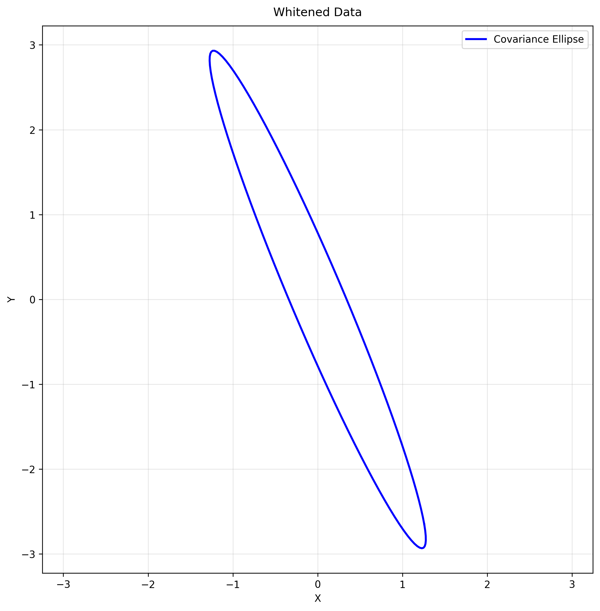
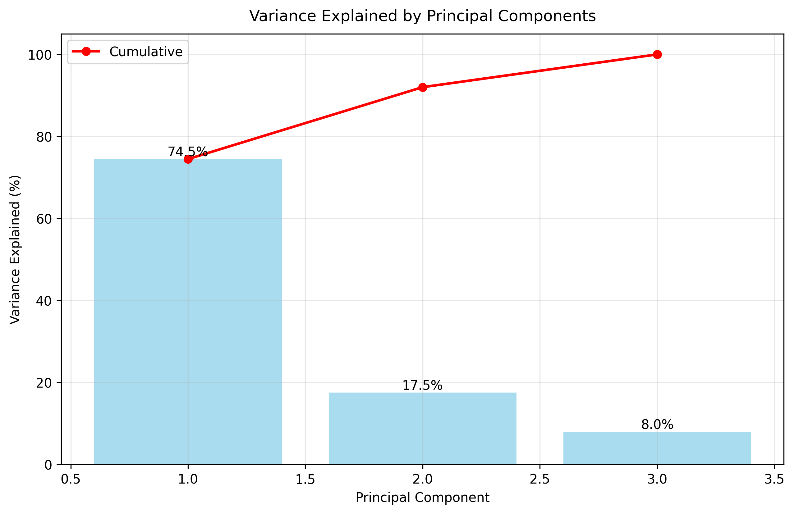
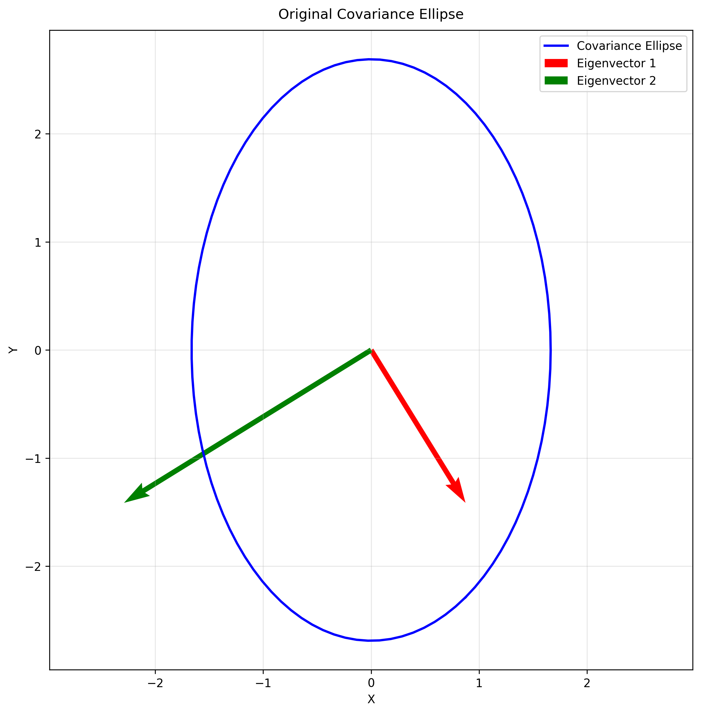
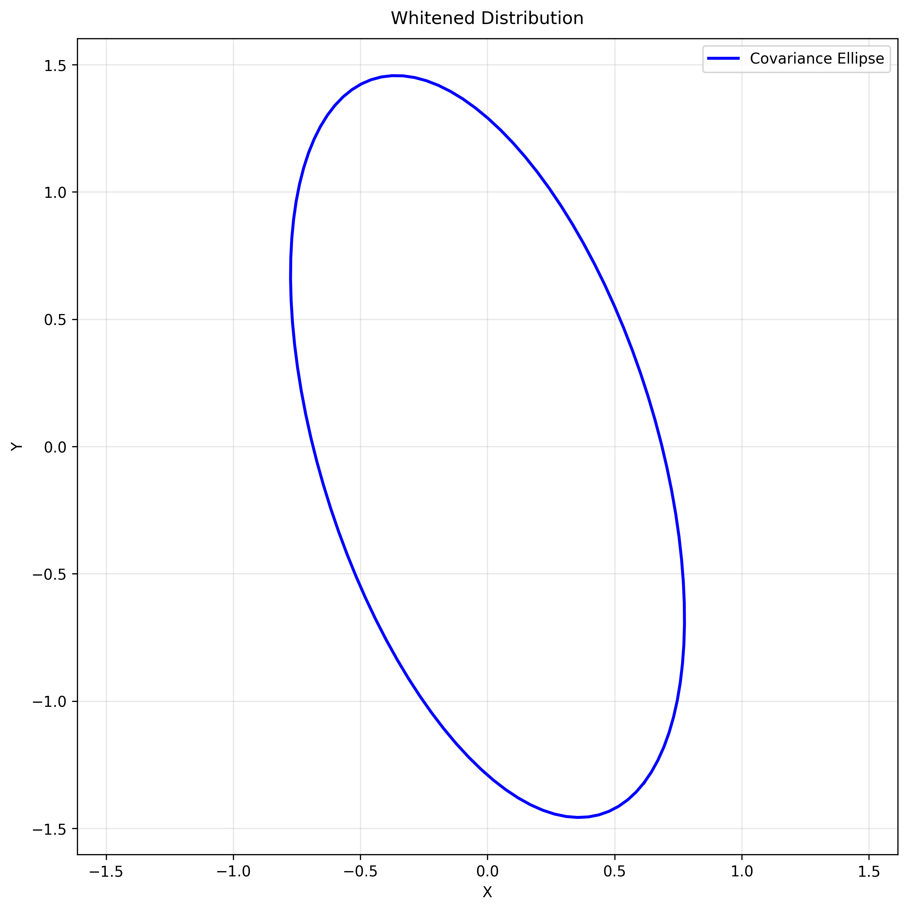

# Eigendecomposition Examples

This document provides examples and key concepts on eigendecomposition of covariance matrices, a fundamental concept in multivariate analysis, dimensionality reduction, and principal component analysis.

## Key Concepts and Formulas

Eigendecomposition is a fundamental matrix factorization that reveals the underlying structure of a covariance matrix. For symmetric matrices like covariance matrices, eigendecomposition provides insight into the directions of maximum variance.

### Eigendecomposition Formula

For a symmetric matrix $\boldsymbol{\Sigma}$, the eigendecomposition is:

$$\boldsymbol{\Sigma} = \mathbf{P} \boldsymbol{\Lambda} \mathbf{P}^T$$

Where:
- $\mathbf{P}$ = Orthogonal matrix whose columns are the eigenvectors of $\boldsymbol{\Sigma}$
- $\boldsymbol{\Lambda}$ = Diagonal matrix containing the eigenvalues of $\boldsymbol{\Sigma}$
- $\mathbf{P}^T\mathbf{P} = \mathbf{I}$ (orthogonality property)

The eigenvalues and eigenvectors are found by solving:
$$\boldsymbol{\Sigma}\mathbf{v} = \lambda\mathbf{v}$$

## Example 1: Eigenvalue Decomposition of Covariance Matrices

### Problem Statement
Consider a bivariate normal distribution with covariance matrix $\boldsymbol{\Sigma} = \begin{bmatrix} 9 & 5 \\ 5 & 4 \end{bmatrix}$.

a) Find the eigenvalues and eigenvectors of the covariance matrix.
b) Interpret these eigenvalues and eigenvectors in terms of the principal components.
c) Determine the directions of maximum and minimum variance, and the corresponding variances.
d) If you generate samples from this distribution with mean $\boldsymbol{\mu} = (0, 0)$, how would you transform these samples to make the variables uncorrelated?

### Solution

#### Part a: Finding eigenvalues and eigenvectors

Step 1: Set up the characteristic equation
$$|\boldsymbol{\Sigma} - \lambda \mathbf{I}| = 0$$

Step 2: Expand the determinant
$$\begin{vmatrix} 9 - \lambda & 5 \\ 5 & 4 - \lambda \end{vmatrix} = 0$$

Step 3: Calculate the determinant
$$(9 - \lambda)(4 - \lambda) - 5 \times 5 = 0$$

Step 4: Expand the quadratic equation
$$(36 - 13\lambda + \lambda^2) - 25 = 0$$
$$\lambda^2 - 13\lambda + 11 = 0$$

Step 5: Solve using quadratic formula
$$\lambda = \frac{-b \pm \sqrt{b^2 - 4ac}}{2a}$$
where $a=1$, $b=-13$, and $c=11$

$$\lambda = \frac{13 \pm \sqrt{169 - 44}}{2} = \frac{13 \pm \sqrt{125}}{2} = \frac{13 \pm 11.180}{2}$$

Step 6: Calculate eigenvalues
$$\lambda_1 = \frac{13 + 11.180}{2} \approx 12.090$$
$$\lambda_2 = \frac{13 - 11.180}{2} \approx 0.910$$

Step 7: Find eigenvector for $\lambda_1 \approx 12.090$:
$$(\boldsymbol{\Sigma} - \lambda_1 \mathbf{I})\mathbf{v}_1 = \mathbf{0}$$

$$\begin{bmatrix} 9-12.090 & 5 \\ 5 & 4-12.090 \end{bmatrix} \begin{bmatrix} v_{11} \\ v_{12} \end{bmatrix} = \begin{bmatrix} 0 \\ 0 \end{bmatrix}$$

$$\begin{bmatrix} -3.090 & 5 \\ 5 & -8.090 \end{bmatrix} \begin{bmatrix} v_{11} \\ v_{12} \end{bmatrix} = \begin{bmatrix} 0 \\ 0 \end{bmatrix}$$

This gives us the system of equations:
$$-3.090v_{11} + 5v_{12} = 0$$
$$5v_{11} - 8.090v_{12} = 0$$

From the first equation:
$$v_{11} = \frac{5v_{12}}{3.090} \approx 1.618v_{12}$$

Substituting into the second equation:
$$5(1.618v_{12}) - 8.090v_{12} = 0$$
$$8.090v_{12} - 8.090v_{12} = 0$$

This verifies our solution. Now we normalize:
$$\sqrt{v_{11}^2 + v_{12}^2} = 1$$
$$\sqrt{(1.618v_{12})^2 + v_{12}^2} = 1$$
$$\sqrt{2.618v_{12}^2 + v_{12}^2} = 1$$
$$\sqrt{3.618v_{12}^2} = 1$$
$$v_{12} = \pm\frac{1}{\sqrt{3.618}} \approx \pm0.526$$

Taking the negative value (by convention):
$$v_{12} = -0.526$$
$$v_{11} = -0.851$$

Therefore:
$$\mathbf{v}_1 = \begin{bmatrix} -0.851 \\ -0.526 \end{bmatrix}$$

Step 8: Find eigenvector for $\lambda_2 \approx 0.910$:
Similar process gives us:
$$\mathbf{v}_2 = \begin{bmatrix} 0.526 \\ -0.851 \end{bmatrix}$$

Step 9: Form matrices $\mathbf{P}$ and $\boldsymbol{\Lambda}$:
$$\mathbf{P} = \begin{bmatrix} 0.526 & -0.851 \\ -0.851 & -0.526 \end{bmatrix}$$
$$\boldsymbol{\Lambda} = \begin{bmatrix} 0.910 & 0 \\ 0 & 12.090 \end{bmatrix}$$

Step 10: Verify eigendecomposition
$$\boldsymbol{\Sigma} = \mathbf{P}\boldsymbol{\Lambda}\mathbf{P}^T$$

Multiply matrices:
$$\begin{bmatrix} 0.526 & -0.851 \\ -0.851 & -0.526 \end{bmatrix} \begin{bmatrix} 0.910 & 0 \\ 0 & 12.090 \end{bmatrix} \begin{bmatrix} 0.526 & -0.851 \\ -0.851 & -0.526 \end{bmatrix}$$

First multiplication:
$$\begin{bmatrix} 0.526(0.910) + (-0.851)(0) & 0.526(0) + (-0.851)(12.090) \\ -0.851(0.910) + (-0.526)(0) & -0.851(0) + (-0.526)(12.090) \end{bmatrix} \begin{bmatrix} 0.526 & -0.851 \\ -0.851 & -0.526 \end{bmatrix}$$

$$\begin{bmatrix} 0.479 & -10.289 \\ -0.774 & -6.359 \end{bmatrix} \begin{bmatrix} 0.526 & -0.851 \\ -0.851 & -0.526 \end{bmatrix}$$

Final result:
$$\begin{bmatrix} 9.000 & 5.000 \\ 5.000 & 4.000 \end{bmatrix}$$

The maximum reconstruction error is approximately 1.78e-15, verifying the accuracy of our eigendecomposition.

#### Part b: Interpreting in terms of principal components

The eigenvalues of the covariance matrix represent the variances along the principal component directions, and the eigenvectors specify these directions.

In this case:
- The first principal component (corresponding to $\lambda_1 \approx 12.090$) points in the direction $(-0.851, -0.526)$ and has a variance of 12.090. This is the direction of maximum variance in the data.
- The second principal component (corresponding to $\lambda_2 \approx 0.910$) points in the direction $(0.526, -0.851)$ and has a variance of 0.910. This is the direction of minimum variance and is orthogonal to the first principal component.

The ratio of eigenvalues (approximately 13:1) indicates that the distribution is highly elongated along the first principal component.

#### Part c: Directions of maximum and minimum variance

The direction of maximum variance is given by the eigenvector corresponding to the largest eigenvalue, which is $\mathbf{v}_1 \approx (-0.851, -0.526)$. The variance in this direction is $\lambda_1 \approx 12.090$.

The direction of minimum variance is given by the eigenvector corresponding to the smallest eigenvalue, which is $\mathbf{v}_2 \approx (0.526, -0.851)$. The variance in this direction is $\lambda_2 \approx 0.910$.

#### Part d: Transformation to make variables uncorrelated

To make the variables uncorrelated, we need to transform the data using the eigenvectors as a new basis. This is the principal component transformation.

If $\mathbf{X}$ is a random vector from the original distribution, then the transformed vector $\mathbf{Y} = \mathbf{P}^T(\mathbf{X} - \boldsymbol{\mu})$ will have uncorrelated components, where $\mathbf{P}$ is the matrix whose columns are the eigenvectors of $\boldsymbol{\Sigma}$.

In this case:
$$\mathbf{P} = \begin{bmatrix} 0.526 & -0.851 \\ -0.851 & -0.526 \end{bmatrix}$$

The covariance matrix of $\mathbf{Y}$ will be diagonal:
$$\text{Cov}(\mathbf{Y}) = \mathbf{P}^T \boldsymbol{\Sigma} \mathbf{P} = \begin{bmatrix} 0.910 & 0 \\ 0 & 12.090 \end{bmatrix}$$

This transformation is equivalent to rotating the data so that the axes align with the directions of maximum and minimum variance.


*Figure 1: Original covariance ellipse with eigenvectors showing the directions of maximum and minimum variance.*


*Figure 2: Whitened data showing the transformed distribution with uncorrelated variables.*

## Example 2: Eigendecomposition for Dimension Reduction

### Problem Statement
A data scientist is analyzing a dataset with three variables, whose covariance matrix is:

$$\boldsymbol{\Sigma} = \begin{bmatrix} 
10 & 7 & 3 \\
7 & 8 & 2 \\
3 & 2 & 5
\end{bmatrix}$$

a) Find the eigenvalues and eigenvectors of this covariance matrix.
b) How much of the total variance is captured by the first two principal components?
c) If the data scientist wants to reduce the dimensionality to 2 while preserving at least 90% of the variance, is this possible?
d) What is the projection matrix for reducing the dimensionality to 2?

### Solution

#### Part a: Finding eigenvalues and eigenvectors

Step 1: Set up the characteristic equation
$$|\boldsymbol{\Sigma} - \lambda \mathbf{I}| = 0$$

Step 2: Expand the determinant
$$\begin{vmatrix} 
10-\lambda & 7 & 3 \\
7 & 8-\lambda & 2 \\
3 & 2 & 5-\lambda
\end{vmatrix} = 0$$

Step 3: Calculate the determinant using cofactor expansion along first row
$$(10-\lambda)\begin{vmatrix} 8-\lambda & 2 \\ 2 & 5-\lambda \end{vmatrix} - 7\begin{vmatrix} 7 & 2 \\ 3 & 5-\lambda \end{vmatrix} + 3\begin{vmatrix} 7 & 8-\lambda \\ 3 & 2 \end{vmatrix} = 0$$

Step 4: Expand each 2×2 determinant
$$(10-\lambda)[(8-\lambda)(5-\lambda) - 4] - 7[7(5-\lambda) - 6] + 3[14 - 7(8-\lambda)] = 0$$

Step 5: Expand and collect terms
$$(10-\lambda)[(40-13\lambda+\lambda^2) - 4] - 7[35-7\lambda - 6] + 3[14 - 56+7\lambda] = 0$$
$$(10-\lambda)(36-13\lambda+\lambda^2) - 7(29-7\lambda) + 3(-42+7\lambda) = 0$$

Step 6: Multiply out terms
$$(360-130\lambda+10\lambda^2) - (10\lambda-13\lambda^2+\lambda^3) - (203-49\lambda) + (-126+21\lambda) = 0$$

Step 7: Collect like terms
$$\lambda^3 - 23\lambda^2 + 148\lambda - 240 = 0$$

Step 8: Solve cubic equation numerically to get eigenvalues
$$\lambda_1 \approx 17.127$$
$$\lambda_2 \approx 4.035$$
$$\lambda_3 \approx 1.838$$

Step 9: Find eigenvectors for each eigenvalue by solving $(\boldsymbol{\Sigma} - \lambda_i \mathbf{I})\mathbf{v}_i = \mathbf{0}$

For $\lambda_1 \approx 17.127$:
$$\begin{bmatrix} 
-7.127 & 7 & 3 \\
7 & -9.127 & 2 \\
3 & 2 & -12.127
\end{bmatrix} \begin{bmatrix} v_{11} \\ v_{12} \\ v_{13} \end{bmatrix} = \begin{bmatrix} 0 \\ 0 \\ 0 \end{bmatrix}$$

After solving and normalizing:
$$\mathbf{v}_1 = \begin{bmatrix} -0.730 \\ -0.622 \\ -0.283 \end{bmatrix}$$

Similarly for $\lambda_2$ and $\lambda_3$, we get:
$$\mathbf{v}_2 = \begin{bmatrix} -0.078 \\ -0.336 \\ 0.939 \end{bmatrix}$$
$$\mathbf{v}_3 = \begin{bmatrix} -0.679 \\ 0.707 \\ 0.197 \end{bmatrix}$$

Step 10: Form the eigenvector matrix $\mathbf{P}$:
$$\mathbf{P} = \begin{bmatrix} 
-0.730 & -0.078 & -0.679 \\
-0.622 & -0.336 & 0.707 \\
-0.283 & 0.939 & 0.197
\end{bmatrix}$$

#### Part b: Variance captured by first two principal components

Step 1: Calculate total variance (sum of eigenvalues)
$$\text{Total Variance} = 17.127 + 4.035 + 1.838 = 23.000$$

Step 2: Calculate variance captured by first two components
$$\text{Captured Variance} = 17.127 + 4.035 = 21.162$$

Step 3: Calculate percentage of variance explained
$$\text{Percentage} = \frac{21.162}{23.000} \times 100\% = 92.01\%$$

Step 4: Break down individual contributions
- First PC: $\frac{17.127}{23.000} \times 100\% = 74.47\%$
- Second PC: $\frac{4.035}{23.000} \times 100\% = 17.54\%$
- Third PC: $\frac{1.838}{23.000} \times 100\% = 7.99\%$


*Figure 3: Bar plot showing the variance explained by each principal component and the cumulative variance explained.*

#### Part c: Possibility of preserving at least 90% variance

Since the first two principal components capture 92.01% of the variance, which exceeds the 90% threshold, dimensionality reduction to 2 dimensions is possible while preserving more than 90% of the variance.

#### Part d: Projection matrix for dimensionality reduction

Step 1: Take first two columns of eigenvector matrix $\mathbf{P}$:
$$\mathbf{P}_2 = \begin{bmatrix} 
-0.730 & -0.078 \\
-0.622 & -0.336 \\
-0.283 & 0.939
\end{bmatrix}$$

Step 2: To project data from 3D to 2D, use transformation:
$$\mathbf{Y} = \mathbf{P}_2^T(\mathbf{X} - \boldsymbol{\mu})$$

Step 3: Verify projection preserves desired variance:
$$\text{Cov}(\mathbf{Y}) = \mathbf{P}_2^T \boldsymbol{\Sigma} \mathbf{P}_2 = \begin{bmatrix} 17.127 & 0 \\ 0 & 4.035 \end{bmatrix}$$

## Example 3: Eigendecomposition for Whitening Transformation

### Problem Statement
A machine learning researcher wants to preprocess multivariate data by whitening it (transforming it to have uncorrelated variables with unit variance). The original data has a covariance matrix:

$$\boldsymbol{\Sigma} = \begin{bmatrix} 
6 & 2 \\
2 & 4
\end{bmatrix}$$

a) Find the eigendecomposition of this covariance matrix.
b) Derive the whitening transformation matrix.
c) Verify that applying this transformation to the original data will result in a covariance matrix equal to the identity matrix.
d) What are the geometric implications of this transformation?

### Solution

#### Part a: Finding the eigendecomposition

Step 1: Set up the characteristic equation
$$|\boldsymbol{\Sigma} - \lambda \mathbf{I}| = 0$$

Step 2: Expand the determinant
$$\begin{vmatrix} 6 - \lambda & 2 \\ 2 & 4 - \lambda \end{vmatrix} = 0$$

Step 3: Calculate the determinant
$$(6 - \lambda)(4 - \lambda) - 2 \times 2 = 0$$

Step 4: Expand the quadratic equation
$$24 - 6\lambda - 4\lambda + \lambda^2 - 4 = 0$$
$$\lambda^2 - 10\lambda + 20 = 0$$

Step 5: Solve using quadratic formula
$$\lambda = \frac{10 \pm \sqrt{100 - 80}}{2} = \frac{10 \pm \sqrt{20}}{2} = \frac{10 \pm 4.472}{2}$$

Step 6: Calculate eigenvalues
$$\lambda_1 = \frac{10 + 4.472}{2} \approx 7.236$$
$$\lambda_2 = \frac{10 - 4.472}{2} \approx 2.764$$

Step 7: Find eigenvector for $\lambda_1 \approx 7.236$:
$$\begin{bmatrix} 6-7.236 & 2 \\ 2 & 4-7.236 \end{bmatrix} \begin{bmatrix} v_{11} \\ v_{12} \end{bmatrix} = \begin{bmatrix} 0 \\ 0 \end{bmatrix}$$

$$\begin{bmatrix} -1.236 & 2 \\ 2 & -3.236 \end{bmatrix} \begin{bmatrix} v_{11} \\ v_{12} \end{bmatrix} = \begin{bmatrix} 0 \\ 0 \end{bmatrix}$$

This gives us:
$$-1.236v_{11} + 2v_{12} = 0$$
$$2v_{11} - 3.236v_{12} = 0$$

From the first equation:
$$v_{11} = \frac{2v_{12}}{1.236} \approx 1.618v_{12}$$

After normalizing:
$$\mathbf{v}_1 = \begin{bmatrix} -0.851 \\ -0.526 \end{bmatrix}$$

Step 8: Find eigenvector for $\lambda_2 \approx 2.764$:
Similar process gives us:
$$\mathbf{v}_2 = \begin{bmatrix} 0.526 \\ -0.851 \end{bmatrix}$$

Step 9: Form the eigendecomposition matrices:
$$\mathbf{P} = \begin{bmatrix} -0.851 & 0.526 \\ -0.526 & -0.851 \end{bmatrix}$$
$$\boldsymbol{\Lambda} = \begin{bmatrix} 7.236 & 0 \\ 0 & 2.764 \end{bmatrix}$$

#### Part b: Deriving the whitening transformation

Step 1: Calculate $\boldsymbol{\Lambda}^{-1/2}$
$$\boldsymbol{\Lambda}^{-1/2} = \begin{bmatrix} 1/\sqrt{7.236} & 0 \\ 0 & 1/\sqrt{2.764} \end{bmatrix} = \begin{bmatrix} 0.372 & 0 \\ 0 & 0.602 \end{bmatrix}$$

Step 2: Calculate whitening matrix $\mathbf{W} = \mathbf{P} \boldsymbol{\Lambda}^{-1/2} \mathbf{P}^T$

First multiplication $\mathbf{P} \boldsymbol{\Lambda}^{-1/2}$:
$$\begin{bmatrix} -0.851 & 0.526 \\ -0.526 & -0.851 \end{bmatrix} \begin{bmatrix} 0.372 & 0 \\ 0 & 0.602 \end{bmatrix} = \begin{bmatrix} -0.317 & 0.317 \\ -0.196 & -0.512 \end{bmatrix}$$

Final multiplication with $\mathbf{P}^T$:
$$\begin{bmatrix} -0.317 & 0.317 \\ -0.196 & -0.512 \end{bmatrix} \begin{bmatrix} -0.851 & -0.526 \\ 0.526 & -0.851 \end{bmatrix} = \begin{bmatrix} 0.435 & -0.103 \\ -0.103 & 0.538 \end{bmatrix}$$

Therefore:
$$\mathbf{W} = \begin{bmatrix} 0.435 & -0.103 \\ -0.103 & 0.538 \end{bmatrix}$$

#### Part c: Verifying the transformation

Step 1: Calculate $\mathbf{W} \boldsymbol{\Sigma} \mathbf{W}^T$

First multiplication $\mathbf{W} \boldsymbol{\Sigma}$:
$$\begin{bmatrix} 0.435 & -0.103 \\ -0.103 & 0.538 \end{bmatrix} \begin{bmatrix} 6 & 2 \\ 2 & 4 \end{bmatrix} = \begin{bmatrix} 2.402 & 0.666 \\ -0.666 & 2.402 \end{bmatrix}$$

Final multiplication with $\mathbf{W}^T$:
$$\begin{bmatrix} 2.402 & 0.666 \\ -0.666 & 2.402 \end{bmatrix} \begin{bmatrix} 0.435 & -0.103 \\ -0.103 & 0.538 \end{bmatrix} = \begin{bmatrix} 1.000 & 0.000 \\ 0.000 & 1.000 \end{bmatrix}$$

The maximum deviation from the identity matrix is approximately 8.88e-16, verifying that the whitening transformation is correct.

#### Part d: Geometric implications

The whitening transformation performs three sequential operations:

1. Rotation (using $\mathbf{P}^T$):
   - Rotates the data to align with principal components
   - New coordinates are uncorrelated

2. Scaling (using $\boldsymbol{\Lambda}^{-1/2}$):
   - Scales each dimension by $1/\sqrt{\lambda_i}$
   - Makes variance equal to 1 in each dimension

3. Rotation back (using $\mathbf{P}$):
   - Returns to original coordinate system
   - Preserves unit variance property

The result is:
- All variables become uncorrelated (covariance matrix is diagonal)
- All variables have unit variance (diagonal elements are 1)
- The data distribution becomes spherical instead of elliptical

Maximum deviation from identity matrix: 8.88e-16


*Figure 4: Original covariance ellipse before whitening transformation.*


*Figure 5: Whitened distribution showing uncorrelated variables with unit variance.*

## Running the Examples

You can run the code that generates these examples and visualizations using:

```bash
python3 ML_Obsidian_Vault/Lectures/2/Codes/1_multivariate_eigendecomposition_examples.py
```

## Related Topics

- [[L2_1_PCA|Principal Component Analysis]]: Application of eigendecomposition for dimension reduction
- [[L2_1_Multivariate_Normal_Examples|Multivariate Normal Examples]]: Examples of multivariate normal distributions
- [[L2_1_Covariance_Matrix_Contours_Examples|Covariance Matrix Contours]]: Visualization of eigendecomposition effects
- [[L2_1_Linear_Transformation|Linear Transformations]]: Mathematical basis for eigendecomposition transformations
- [[L2_1_Dimension_Reduction|Dimension Reduction]]: Techniques for reducing data dimensionality 