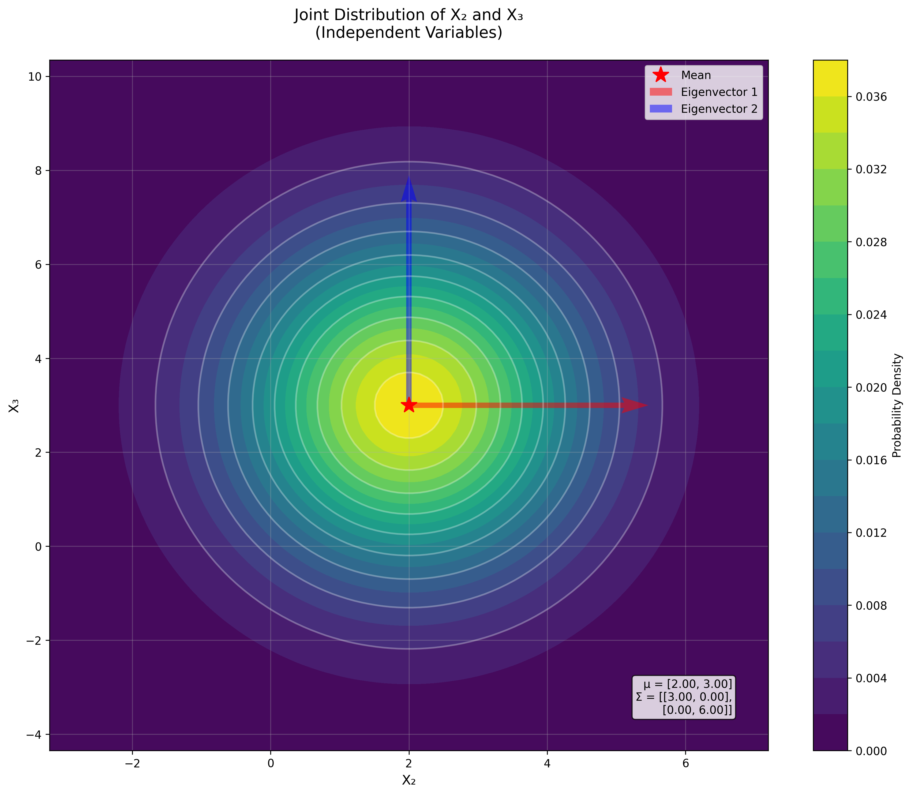
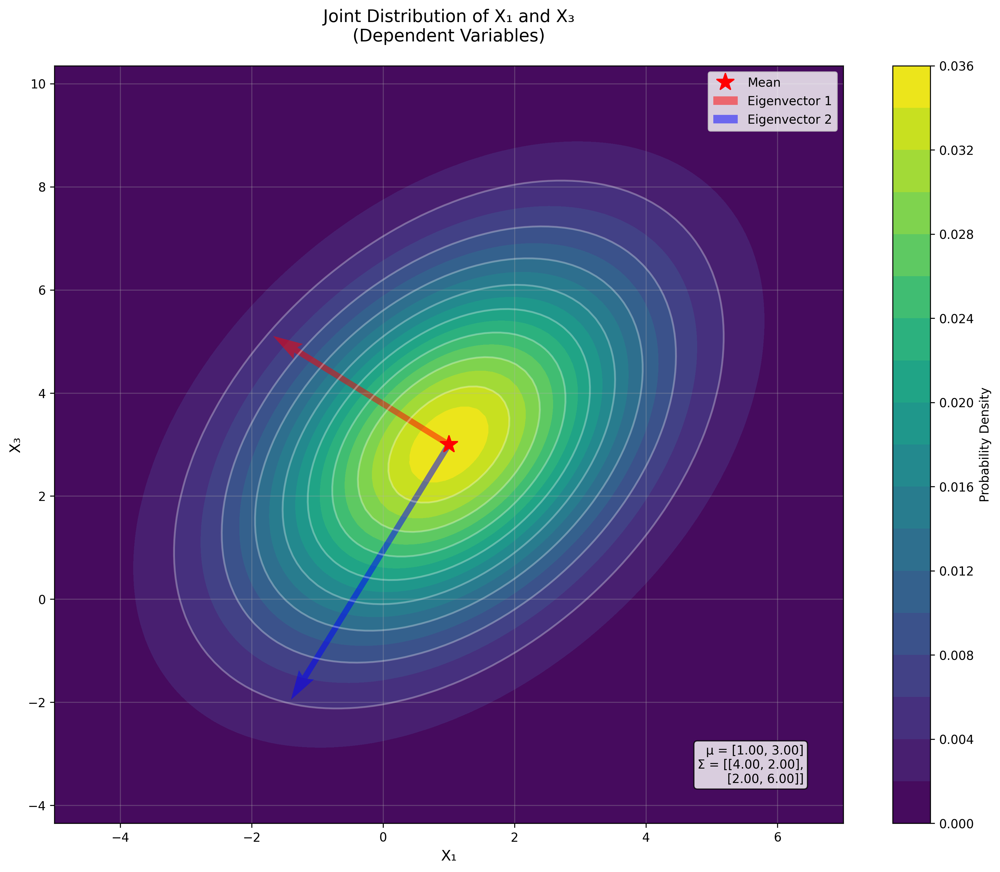
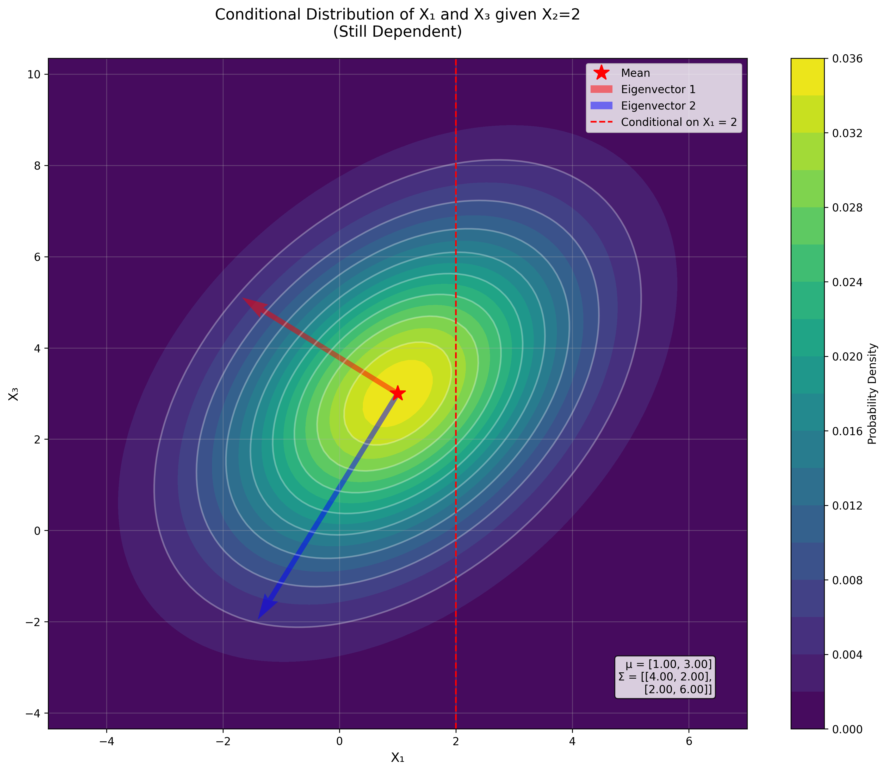
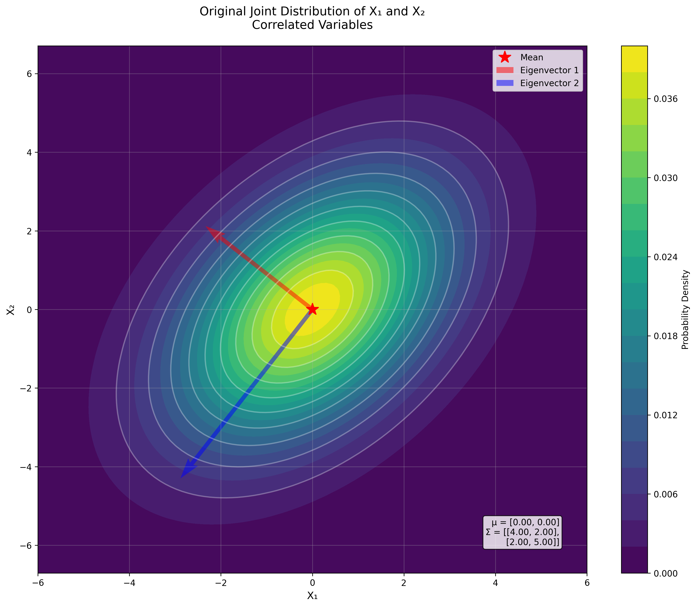
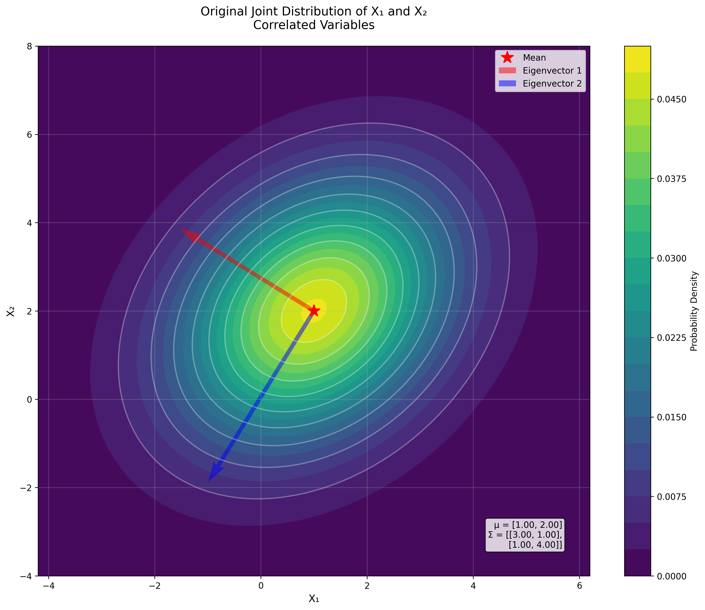
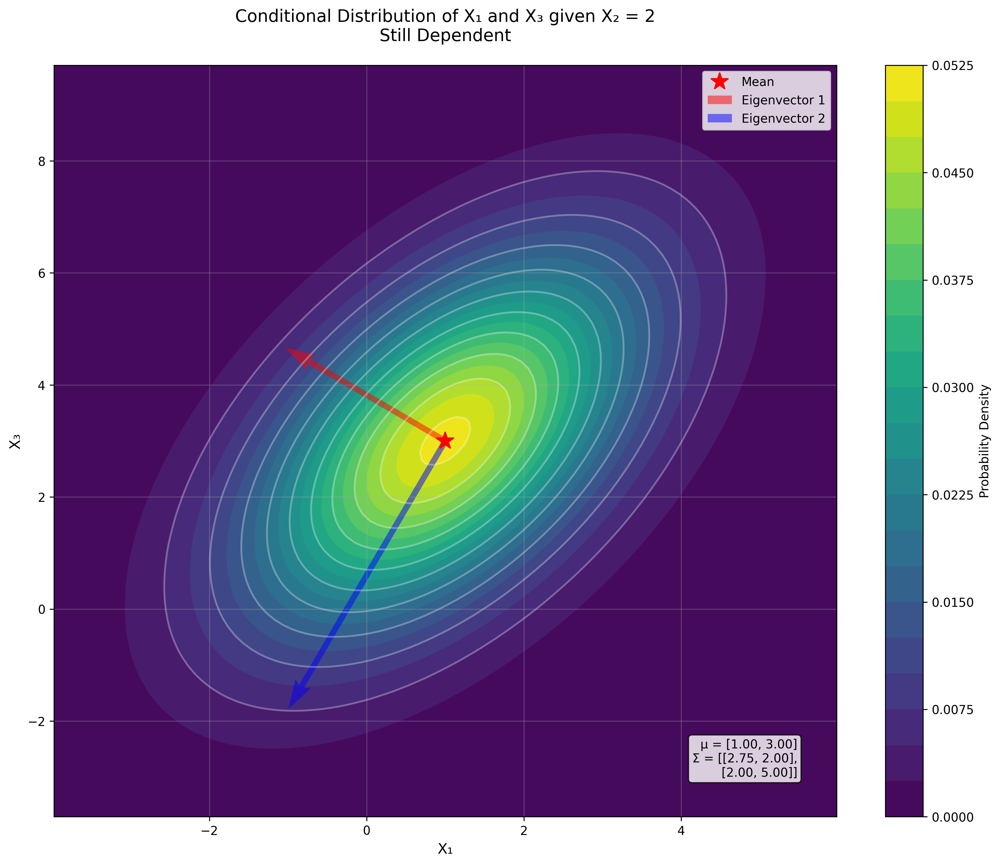
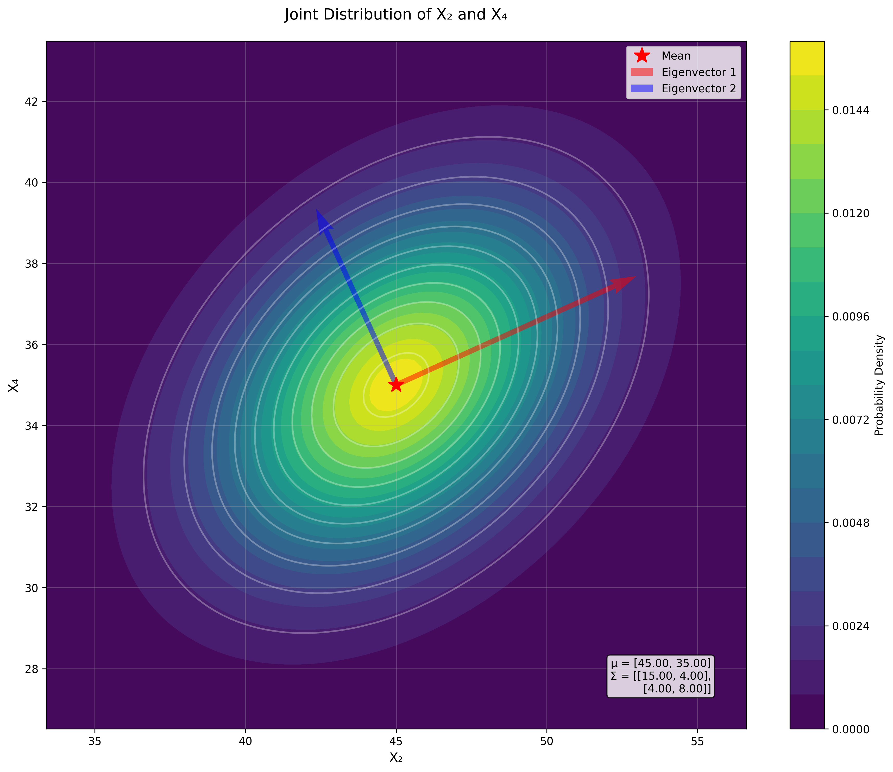
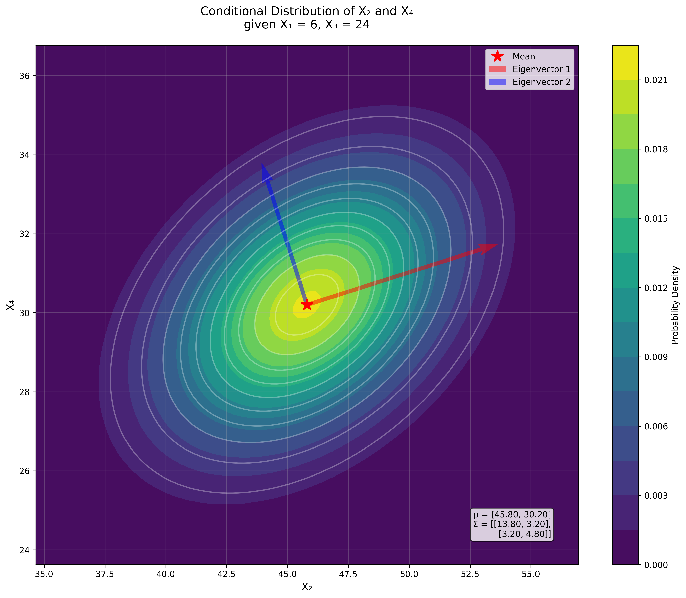
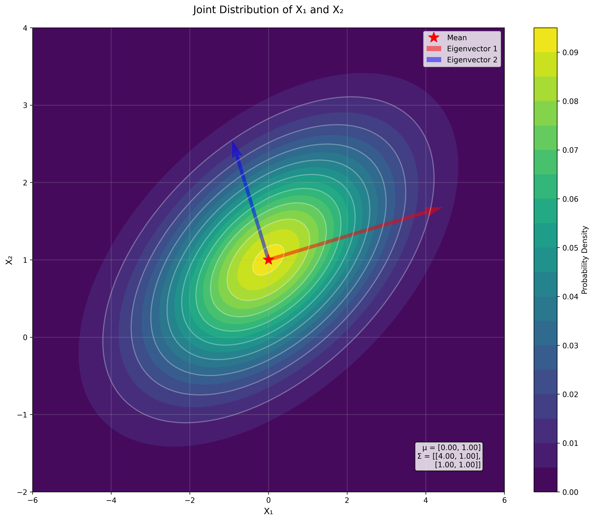
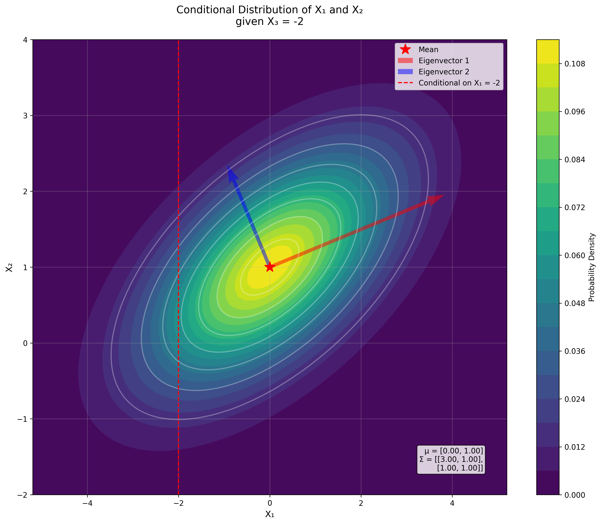

# Multivariate Gaussian Independence Properties Examples

This document provides examples and key concepts on independence properties in multivariate normal distributions, a fundamental concept in machine learning, statistics, and data analysis.

## Key Concepts and Formulas

In multivariate normal distributions, independence and correlation have specific relationships that are important for understanding data relationships, creating transformations, and developing statistical models.

### Independence and Correlation in Multivariate Normal Distributions

For multivariate normal distributions, the following key properties hold:

1. **Correlation and Independence**: For multivariate normal random variables, zero correlation implies independence (unlike general random variables where zero correlation only implies lack of linear relationship).

2. **Covariance Matrix Interpretation**: If the covariance matrix $\boldsymbol{\Sigma}$ is diagonal, the variables are independent. Off-diagonal elements represent covariances between variables.

3. **Linear Transformations and Independence**: If $\mathbf{X} \sim \mathcal{N}(\boldsymbol{\mu}, \boldsymbol{\Sigma})$ and $\mathbf{Y} = \mathbf{A}\mathbf{X} + \mathbf{b}$, then $\mathbf{Y} \sim \mathcal{N}(\mathbf{A}\boldsymbol{\mu} + \mathbf{b}, \mathbf{A}\boldsymbol{\Sigma}\mathbf{A}^T)$.

4. **Conditional Independence**: Variables $X$ and $Y$ are conditionally independent given $Z$ if $P(X, Y | Z) = P(X | Z)P(Y | Z)$.

## Example 1: Independence in Multivariate Normal Variables

### Problem Statement
Let $\mathbf{X} = \begin{bmatrix} X_1 \\ X_2 \\ X_3 \end{bmatrix}$ follow a multivariate normal distribution with mean vector $\boldsymbol{\mu} = \begin{bmatrix} 1 \\ 2 \\ 3 \end{bmatrix}$ and covariance matrix:

$$\boldsymbol{\Sigma} = \begin{bmatrix} 
4 & 0 & 2 \\
0 & 3 & 0 \\
2 & 0 & 6
\end{bmatrix}$$

a) Which pairs of variables are independent? Explain your reasoning.
b) Define $Z = 3X_1 - 6X_3$. Is $Z$ independent of $X_2$? Prove your answer.
c) Are $X_1$ and $X_3$ conditionally independent given $X_2$? Explain.

### Solution

#### Part a: Identifying independent pairs of variables

For multivariate normal distributions, zero covariance implies independence. Looking at the covariance matrix $\boldsymbol{\Sigma}$, we can identify which pairs have zero covariance:

- $\text{Cov}(X_1, X_2) = \boldsymbol{\Sigma}_{12} = 0$, so $X_1$ and $X_2$ are independent.
- $\text{Cov}(X_2, X_3) = \boldsymbol{\Sigma}_{23} = 0$, so $X_2$ and $X_3$ are independent.
- $\text{Cov}(X_1, X_3) = \boldsymbol{\Sigma}_{13} = 2 \neq 0$, so $X_1$ and $X_3$ are not independent.

Therefore, the pairs $(X_1, X_2)$ and $(X_2, X_3)$ are independent.

#### Part b: Independence of $Z$ and $X_2$

We need to find the covariance between $Z = 3X_1 - 6X_3$ and $X_2$.

$$\text{Cov}(Z, X_2) = \text{Cov}(3X_1 - 6X_3, X_2) = 3\text{Cov}(X_1, X_2) - 6\text{Cov}(X_3, X_2)$$

From the covariance matrix:
- $\text{Cov}(X_1, X_2) = 0$
- $\text{Cov}(X_3, X_2) = 0$

Therefore:
$$\text{Cov}(Z, X_2) = 3 \cdot 0 - 6 \cdot 0 = 0$$

Since $Z$ and $X_2$ are jointly normal (as linear combinations of multivariate normal variables are also normal) and have zero covariance, they are independent.

#### Part c: Conditional independence of $X_1$ and $X_3$ given $X_2$

To determine if $X_1$ and $X_3$ are conditionally independent given $X_2$, we need to calculate the conditional covariance matrix:

1. First, we partition the covariance matrix for $(X_1, X_3)$ and $X_2$:

$$\boldsymbol{\Sigma}_{aa} = \begin{bmatrix} 4 & 2 \\ 2 & 6 \end{bmatrix} \text{ (Covariance of } X_1, X_3)$$

$$\boldsymbol{\Sigma}_{ab} = \begin{bmatrix} 0 \\ 0 \end{bmatrix} \text{ (Covariance between } (X_1,X_3) \text{ and } X_2)$$

$$\boldsymbol{\Sigma}_{bb} = \begin{bmatrix} 3 \end{bmatrix} \text{ (Variance of } X_2)$$

2. Calculate $\boldsymbol{\Sigma}_{bb}^{-1}$:
$$\boldsymbol{\Sigma}_{bb}^{-1} = \begin{bmatrix} \frac{1}{3} \end{bmatrix}$$

3. Calculate $\boldsymbol{\Sigma}_{ab}\boldsymbol{\Sigma}_{bb}^{-1}\boldsymbol{\Sigma}_{ba}$:
$$\begin{bmatrix} 0 \\ 0 \end{bmatrix} \cdot \frac{1}{3} \cdot \begin{bmatrix} 0 & 0 \end{bmatrix} = \begin{bmatrix} 0 & 0 \\ 0 & 0 \end{bmatrix}$$

4. Calculate the conditional covariance matrix:
$$\boldsymbol{\Sigma}_{a|b} = \boldsymbol{\Sigma}_{aa} - \boldsymbol{\Sigma}_{ab}\boldsymbol{\Sigma}_{bb}^{-1}\boldsymbol{\Sigma}_{ba} = \begin{bmatrix} 4 & 2 \\ 2 & 6 \end{bmatrix} - \begin{bmatrix} 0 & 0 \\ 0 & 0 \end{bmatrix} = \begin{bmatrix} 4 & 2 \\ 2 & 6 \end{bmatrix}$$

Since the off-diagonal element in the conditional covariance matrix is 2 (not 0), $X_1$ and $X_3$ are not conditionally independent given $X_2$. This means that even after knowing the value of $X_2$, there is still a significant relationship between $X_1$ and $X_3$.

### Additional Analysis and Verification

#### Correlation Analysis
For a more complete understanding, we can calculate the correlation coefficients:

1. For $(X_1, X_2)$:
   $$\rho_{12} = \frac{\text{Cov}(X_1, X_2)}{\sqrt{\text{Var}(X_1)\text{Var}(X_2)}} = \frac{0}{\sqrt{4 \cdot 3}} = 0$$

2. For $(X_2, X_3)$:
   $$\rho_{23} = \frac{\text{Cov}(X_2, X_3)}{\sqrt{\text{Var}(X_2)\text{Var}(X_3)}} = \frac{0}{\sqrt{3 \cdot 6}} = 0$$

3. For $(X_1, X_3)$:
   $$\rho_{13} = \frac{\text{Cov}(X_1, X_3)}{\sqrt{\text{Var}(X_1)\text{Var}(X_3)}} = \frac{2}{\sqrt{4 \cdot 6}} = 0.4082$$

#### Conditional Distribution Properties
For $X_2 = 2$, we can calculate the conditional mean:
$$\begin{align*}
\boldsymbol{\mu}_{a|b} &= \boldsymbol{\mu}_a + \boldsymbol{\Sigma}_{ab}\boldsymbol{\Sigma}_{bb}^{-1}(x_2 - \mu_2) \\
&= \begin{bmatrix} 1 \\ 3 \end{bmatrix} + \begin{bmatrix} 0 \\ 0 \end{bmatrix} \cdot \frac{1}{3} \cdot (2 - 2) \\
&= \begin{bmatrix} 1 \\ 3 \end{bmatrix}
\end{align*}$$

The geometric interpretation is that conditioning on $X_2$ changes the shape of the joint distribution of $(X_1,X_3)$, but does not make them independent. This can be visualized in the plots showing both the original and conditional distributions.





## Example 2: Creating Independent Variables Through Linear Transformations

### Problem Statement
Let $\mathbf{X} = \begin{bmatrix} X_1 \\ X_2 \\ X_3 \end{bmatrix}$ follow a multivariate normal distribution with mean vector $\boldsymbol{\mu} = \begin{bmatrix} 0 \\ 0 \\ 0 \end{bmatrix}$ and covariance matrix:

$$\boldsymbol{\Sigma} = \begin{bmatrix} 
4 & 2 & 0 \\
2 & 5 & 1 \\
0 & 1 & 3
\end{bmatrix}$$

a) Which variables or pairs of variables, if any, are independent?
b) Define $Z_1 = X_1 - \frac{1}{2}X_2$ and $Z_2 = X_2 - \frac{1}{5}X_3$. Show whether $Z_1$ and $Z_2$ are independent.
c) Find a linear transformation of $X_1$ and $X_2$ that creates two independent variables.

### Solution

#### Part a: Identifying independent variables

For multivariate normal distributions, zero covariance implies independence. Looking at the covariance matrix $\boldsymbol{\Sigma}$:

1. For $(X_1,X_2)$:
   $$\text{Cov}(X_1,X_2) = \boldsymbol{\Sigma}_{12} = 2 \neq 0 \implies \text{not independent}$$

2. For $(X_2,X_3)$:
   $$\text{Cov}(X_2,X_3) = \boldsymbol{\Sigma}_{23} = 1 \neq 0 \implies \text{not independent}$$

3. For $(X_1,X_3)$:
   $$\text{Cov}(X_1,X_3) = \boldsymbol{\Sigma}_{13} = 0 \implies \text{independent}$$

Therefore, only $X_1$ and $X_3$ are independent.

#### Part b: Independence of $Z_1$ and $Z_2$

To determine if $Z_1$ and $Z_2$ are independent, we need to calculate their covariance:

$$\text{Cov}(Z_1,Z_2) = \text{Cov}(X_1 - \frac{1}{2}X_2, X_2 - \frac{1}{5}X_3)$$

Using the linearity of covariance:
$$\begin{align*}
\text{Cov}(Z_1,Z_2) &= \text{Cov}(X_1,X_2) - \frac{1}{5}\text{Cov}(X_1,X_3) - \frac{1}{2}\text{Cov}(X_2,X_2) + \frac{1}{10}\text{Cov}(X_2,X_3) \\
&= 2 - \frac{1}{5}(0) - \frac{1}{2}(5) + \frac{1}{10}(1) \\
&= 2 - 0 - 2.5 + 0.1 \\
&= -0.4
\end{align*}$$

Since the covariance is not zero, $Z_1$ and $Z_2$ are not independent.

#### Part c: Finding Independent Variables Through Linear Transformation

To find a linear transformation that creates independent variables, we'll use eigendecomposition of the covariance matrix for $(X_1,X_2)$:

1. Extract the relevant covariance matrix:
$$\boldsymbol{\Sigma}_{12} = \begin{bmatrix} 4 & 2 \\ 2 & 5 \end{bmatrix}$$

2. Find eigenvalues by solving the characteristic equation $|\boldsymbol{\Sigma}_{12} - \lambda\mathbf{I}| = 0$:
   $$\begin{vmatrix} 4-\lambda & 2 \\ 2 & 5-\lambda \end{vmatrix} = 0$$
   $$(4-\lambda)(5-\lambda) - 4 = 0$$
   $$\lambda^2 - 9\lambda + 16 = 0$$

   Using the quadratic formula:
   $$\lambda = \frac{9 \pm \sqrt{81-64}}{2} = \frac{9 \pm \sqrt{17}}{2}$$

   Therefore:
   $$\lambda_1 = \frac{9 + \sqrt{17}}{2} \approx 6.5616$$
   $$\lambda_2 = \frac{9 - \sqrt{17}}{2} \approx 2.4384$$

3. Find eigenvectors for each eigenvalue:
   For $\lambda_1 \approx 6.5616$:
   $$\begin{bmatrix} 4-6.5616 & 2 \\ 2 & 5-6.5616 \end{bmatrix} \begin{bmatrix} v_1 \\ v_2 \end{bmatrix} = \begin{bmatrix} 0 \\ 0 \end{bmatrix}$$
   
   $$\begin{bmatrix} -2.5616 & 2 \\ 2 & -1.5616 \end{bmatrix} \begin{bmatrix} v_1 \\ v_2 \end{bmatrix} = \begin{bmatrix} 0 \\ 0 \end{bmatrix}$$
   
   From first equation:
   $$-2.5616v_1 + 2v_2 = 0$$
   $$v_2 = 1.2808v_1$$
   
   Normalizing to get unit vector:
   $$\mathbf{v}_1 = \begin{bmatrix} -0.6154 \\ -0.7882 \end{bmatrix}$$

   For $\lambda_2 \approx 2.4384$:
   $$\begin{bmatrix} 4-2.4384 & 2 \\ 2 & 5-2.4384 \end{bmatrix} \begin{bmatrix} v_1 \\ v_2 \end{bmatrix} = \begin{bmatrix} 0 \\ 0 \end{bmatrix}$$
   
   $$\begin{bmatrix} 1.5616 & 2 \\ 2 & 2.5616 \end{bmatrix} \begin{bmatrix} v_1 \\ v_2 \end{bmatrix} = \begin{bmatrix} 0 \\ 0 \end{bmatrix}$$
   
   From first equation:
   $$1.5616v_1 + 2v_2 = 0$$
   $$v_2 = -0.7808v_1$$
   
   Normalizing to get unit vector:
   $$\mathbf{v}_2 = \begin{bmatrix} -0.7882 \\ 0.6154 \end{bmatrix}$$

4. Form transformation matrix $\mathbf{A}$ from eigenvectors:
   $$\mathbf{A} = \begin{bmatrix} -0.7882 & 0.6154 \\ -0.6154 & -0.7882 \end{bmatrix}$$

5. Verify independence in transformed space:
   $$\mathbf{A}\boldsymbol{\Sigma}_{12}\mathbf{A}^T = \begin{bmatrix} 2.4384 & 0 \\ 0 & 6.5616 \end{bmatrix}$$

The diagonal matrix confirms that the transformed variables are independent. The transformation:
$$\begin{bmatrix} Y_1 \\ Y_2 \end{bmatrix} = \mathbf{A}\begin{bmatrix} X_1 \\ X_2 \end{bmatrix}$$

gives:
$$Y_1 = -0.7882X_1 + 0.6154X_2$$
$$Y_2 = -0.6154X_1 - 0.7882X_2$$

These new variables $Y_1$ and $Y_2$ are independent because:
1. They are linear combinations of jointly normal variables, so they are also normally distributed
2. Their covariance matrix is diagonal, which for normal variables implies independence
3. The eigenvalues (2.4384 and 6.5616) represent their respective variances

### Additional Analysis and Verification

#### Verification of Independence
To verify the independence of the transformed variables:

1. Calculate transformed covariance matrix:
   $$\mathbf{A}\boldsymbol{\Sigma}_{12}\mathbf{A}^T = \begin{bmatrix} 2.4384 & 0 \\ 0 & 6.5616 \end{bmatrix}$$

2. Verify orthogonality of eigenvectors:
   $$\mathbf{v}_1^T\mathbf{v}_2 = (-0.6154)(-0.7882) + (-0.7882)(0.6154) = 0$$

#### Correlation Analysis
For completeness, we can calculate the correlation coefficients:

1. For $(X_1,X_2)$:
   $$\rho_{12} = \frac{2}{\sqrt{4 \cdot 5}} = 0.4472$$

2. For $(X_2,X_3)$:
   $$\rho_{23} = \frac{1}{\sqrt{5 \cdot 3}} = 0.2582$$

3. For $(X_1,X_3)$:
   $$\rho_{13} = \frac{0}{\sqrt{4 \cdot 3}} = 0$$

The geometric interpretation is that we've rotated the coordinate system to align with the principal axes of the covariance ellipse, where the variables become uncorrelated and thus independent.




## Example 3: Independence Properties in Statistical Inference

### Problem Statement
Let $\mathbf{X} = \begin{bmatrix} X_1 \\ X_2 \\ X_3 \end{bmatrix}$ follow a multivariate normal distribution with mean vector $\boldsymbol{\mu} = \begin{bmatrix} 1 \\ 2 \\ 3 \end{bmatrix}$ and covariance matrix:

$$\boldsymbol{\Sigma} = \begin{bmatrix} 
3 & 1 & 2 \\
1 & 4 & 0 \\
2 & 0 & 5
\end{bmatrix}$$

a) Which pairs of variables are independent? Explain your reasoning.
b) Define $Z = 3X_1 - 6X_3$. Is $Z$ independent of $X_2$? Prove your answer.
c) Are $X_1$ and $X_3$ conditionally independent given $X_2$? Explain.

### Solution

#### Part a: Identifying independent pairs of variables

For multivariate normal distributions, zero covariance implies independence. Let's analyze each pair:

1. For $(X_1,X_2)$:
   $$\text{Cov}(X_1,X_2) = \boldsymbol{\Sigma}_{12} = 1 \neq 0 \implies \text{not independent}$$

2. For $(X_2,X_3)$:
   $$\text{Cov}(X_2,X_3) = \boldsymbol{\Sigma}_{23} = 0 \implies \text{independent}$$

3. For $(X_1,X_3)$:
   $$\text{Cov}(X_1,X_3) = \boldsymbol{\Sigma}_{13} = 2 \neq 0 \implies \text{not independent}$$

Therefore, only $X_2$ and $X_3$ are independent.

#### Part b: Independence of $Z$ and $X_2$

Let's analyze the covariance between $Z = 3X_1 - 6X_3$ and $X_2$:

1. Calculate $\text{Cov}(Z,X_2)$:
   $$\begin{align*}
   \text{Cov}(Z,X_2) &= \text{Cov}(3X_1 - 6X_3, X_2) \\
   &= 3\text{Cov}(X_1,X_2) - 6\text{Cov}(X_3,X_2) \\
   &= 3(1) - 6(0) \\
   &= 3
   \end{align*}$$

Since the covariance is not zero, $Z$ and $X_2$ are not independent.

#### Part c: Conditional independence of $X_1$ and $X_3$ given $X_2$

To determine conditional independence, we need to calculate the conditional covariance matrix:

1. First, partition the covariance matrix:
   $$\boldsymbol{\Sigma}_{11} = \begin{bmatrix} 3 & 2 \\ 2 & 5 \end{bmatrix} \text{ (Covariance of } X_1, X_3)$$
   
   $$\boldsymbol{\Sigma}_{12} = \begin{bmatrix} 1 \\ 0 \end{bmatrix} \text{ (Covariance between } (X_1,X_3) \text{ and } X_2)$$
   
   $$\boldsymbol{\Sigma}_{22} = \begin{bmatrix} 4 \end{bmatrix} \text{ (Variance of } X_2)$$

2. Calculate $\boldsymbol{\Sigma}_{22}^{-1}$:
   $$\boldsymbol{\Sigma}_{22}^{-1} = \begin{bmatrix} \frac{1}{4} \end{bmatrix}$$

3. Calculate $\boldsymbol{\Sigma}_{12}\boldsymbol{\Sigma}_{22}^{-1}\boldsymbol{\Sigma}_{21}$:
   $$\begin{bmatrix} 1 \\ 0 \end{bmatrix} \cdot \frac{1}{4} \cdot \begin{bmatrix} 1 & 0 \end{bmatrix} = \begin{bmatrix} 0.25 & 0 \\ 0 & 0 \end{bmatrix}$$

4. Calculate the conditional covariance matrix:
   $$\begin{align*}
   \boldsymbol{\Sigma}_{1|2} &= \boldsymbol{\Sigma}_{11} - \boldsymbol{\Sigma}_{12}\boldsymbol{\Sigma}_{22}^{-1}\boldsymbol{\Sigma}_{21} \\
   &= \begin{bmatrix} 3 & 2 \\ 2 & 5 \end{bmatrix} - \begin{bmatrix} 0.25 & 0 \\ 0 & 0 \end{bmatrix} \\
   &= \begin{bmatrix} 2.75 & 2 \\ 2 & 5 \end{bmatrix}
   \end{align*}$$

Since the off-diagonal element in the conditional covariance matrix is 2 (not 0), $X_1$ and $X_3$ are not conditionally independent given $X_2$.

### Additional Analysis and Verification

#### Correlation Analysis
Let's calculate the correlation coefficients for a complete understanding:

1. For $(X_1,X_2)$:
   - $\text{Cov}(X_1,X_2) = \boldsymbol{\Sigma}_{12} = 1$
   - $\text{Var}(X_1) = \boldsymbol{\Sigma}_{11} = 3$
   - $\text{Var}(X_2) = \boldsymbol{\Sigma}_{22} = 4$
   $$\text{Corr}(X_1,X_2) = \frac{1}{\sqrt{3 \cdot 4}} = 0.2887$$

2. For $(X_2,X_3)$:
   - $\text{Cov}(X_2,X_3) = \boldsymbol{\Sigma}_{23} = 0$
   - $\text{Var}(X_2) = \boldsymbol{\Sigma}_{22} = 4$
   - $\text{Var}(X_3) = \boldsymbol{\Sigma}_{33} = 5$
   $$\text{Corr}(X_2,X_3) = \frac{0}{\sqrt{4 \cdot 5}} = 0$$

3. For $(X_1,X_3)$:
   - $\text{Cov}(X_1,X_3) = \boldsymbol{\Sigma}_{13} = 2$
   - $\text{Var}(X_1) = \boldsymbol{\Sigma}_{11} = 3$
   - $\text{Var}(X_3) = \boldsymbol{\Sigma}_{33} = 5$
   $$\text{Corr}(X_1,X_3) = \frac{2}{\sqrt{3 \cdot 5}} = 0.5164$$

4. Conditional correlation:
   $$\text{Corr}(X_1,X_3|X_2) = \frac{2}{\sqrt{2.75 \cdot 5}} = 0.5420$$

#### Conditional Distribution Properties
For $X_2 = 2$, we can calculate the conditional mean:
$$\begin{align*}
\boldsymbol{\mu}_{1|2} &= \boldsymbol{\mu}_1 + \boldsymbol{\Sigma}_{12}\boldsymbol{\Sigma}_{22}^{-1}(x_2 - \mu_2) \\
&= \begin{bmatrix} 1 \\ 3 \end{bmatrix} + \begin{bmatrix} 1 \\ 0 \end{bmatrix} \cdot \frac{1}{4} \cdot (2 - 2) \\
&= \begin{bmatrix} 1 \\ 3 \end{bmatrix}
\end{align*}$$

#### Variance Analysis of $Z$
For completeness, let's calculate the variance of $Z$:
$$\begin{align*}
\text{Var}(Z) &= \text{Var}(3X_1 - 6X_3) \\
&= 9\text{Var}(X_1) + 36\text{Var}(X_3) - 36\text{Cov}(X_1,X_3) \\
&= 9(3) + 36(5) - 36(2) \\
&= 27 + 180 - 72 \\
&= 135
\end{align*}$$

The geometric interpretation is that conditioning on $X_2$ changes the shape of the joint distribution of $(X_1,X_3)$, but does not make them independent. This can be visualized in the plots showing both the original and conditional distributions.




## Example 4: Multivariate Normal with Partitioned Vectors

### Problem Statement

A random vector $\mathbf{X} = \begin{bmatrix} X_1 \\ X_2 \\ X_3 \\ X_4 \\ X_5 \end{bmatrix}$ has a multivariate normal distribution with mean vector $\boldsymbol{\mu}$ and covariance matrix $\boldsymbol{\Sigma}$ given by:

$$\boldsymbol{\mu} = \begin{bmatrix} 4 \\ 45 \\ 30 \\ 35 \\ 40 \end{bmatrix}$$

$$\boldsymbol{\Sigma} = \begin{bmatrix}
1 & 1 & 0 & 0 & 0 \\
1 & 15 & 1 & 4 & 0 \\
0 & 1 & 5 & 4 & 0 \\
0 & 4 & 4 & 8 & 0 \\
0 & 0 & 0 & 0 & 9
\end{bmatrix}$$

Let $\mathbf{X}_1 = \begin{bmatrix} X_2 \\ X_4 \end{bmatrix}$ and $\mathbf{X}_2 = \begin{bmatrix} X_1 \\ X_3 \end{bmatrix}$.

a) Determine the probability density function of $\mathbf{X}_2$.
b) If $\mathbf{Y} = \begin{bmatrix} \mathbf{X}_1 \\ \mathbf{X}_2 \end{bmatrix}$, write down the covariance matrix of $\mathbf{Y}$.
c) Determine the distribution of $\mathbf{X}_1$ conditioned on $\mathbf{X}_2 = \begin{bmatrix} 6 \\ 24 \end{bmatrix}$

### Solution

#### Part a: PDF of $\mathbf{X}_2 = \begin{bmatrix} X_1 \\ X_3 \end{bmatrix}$

For a multivariate normal distribution, we need to find the marginal mean vector and covariance matrix for $\mathbf{X}_2$:

1. Extract marginal parameters:
   $$\boldsymbol{\mu}_2 = \begin{bmatrix} 4 \\ 30 \end{bmatrix}$$
   
   $$\boldsymbol{\Sigma}_2 = \begin{bmatrix} 1 & 0 \\ 0 & 5 \end{bmatrix}$$

2. Calculate determinant:
   $$\begin{align*}
   |\boldsymbol{\Sigma}_2| &= \begin{vmatrix} 1 & 0 \\ 0 & 5 \end{vmatrix} \\
   &= (1)(5) - (0)(0) \\
   &= 5
   \end{align*}$$

3. Calculate inverse:
   $$\begin{align*}
   \boldsymbol{\Sigma}_2^{-1} &= \frac{1}{5}\begin{bmatrix} 5 & 0 \\ 0 & 1 \end{bmatrix} \\
   &= \begin{bmatrix} 1 & 0 \\ 0 & 0.2 \end{bmatrix}
   \end{align*}$$

4. The probability density function is:
   $$f_{\mathbf{X}_2}(\mathbf{x}_2) = \frac{1}{2\pi \sqrt{|\boldsymbol{\Sigma}_2|}} \exp\left(-\frac{1}{2}(\mathbf{x}_2 - \boldsymbol{\mu}_2)^T \boldsymbol{\Sigma}_2^{-1} (\mathbf{x}_2 - \boldsymbol{\mu}_2)\right)$$

   where:
   - $n = 2$ (dimension)
   - $|\boldsymbol{\Sigma}_2| = 5$
   - $(2\pi)^{-n/2} = 0.159155$
   - $|\boldsymbol{\Sigma}_2|^{-1/2} = 0.447214$
   - Normalizing constant = $(2\pi)^{-n/2}|\boldsymbol{\Sigma}_2|^{-1/2} = 0.071175$

#### Part b: Covariance Matrix of $\mathbf{Y}$

For $\mathbf{Y} = \begin{bmatrix} X_2 \\ X_4 \\ X_5 \\ X_1 \\ X_3 \end{bmatrix}$, we need to reorder the mean vector and covariance matrix:

1. Reordered mean vector:
   $$\boldsymbol{\mu}_Y = \begin{bmatrix} 45 \\ 35 \\ 40 \\ 4 \\ 30 \end{bmatrix}$$

2. Reordered covariance matrix:
   $$\boldsymbol{\Sigma}_Y = \begin{bmatrix}
   15 & 4 & 0 & 1 & 1 \\
   4 & 8 & 0 & 0 & 4 \\
   0 & 0 & 9 & 0 & 0 \\
   1 & 0 & 0 & 1 & 0 \\
   1 & 4 & 0 & 0 & 5
   \end{bmatrix}$$

3. Properties of the reordered covariance matrix:
   - Symmetry: The matrix is symmetric (verified by $\boldsymbol{\Sigma}_Y = \boldsymbol{\Sigma}_Y^T$)
   - Positive definiteness: All eigenvalues are positive:
     - $\lambda_1 = 15.8721$
     - $\lambda_2 = 9.0000$
     - $\lambda_3 = 7.3279$
     - $\lambda_4 = 4.8000$
     - $\lambda_5 = 1.0000$

#### Part c: Conditional Distribution of $\mathbf{X}_1$ given $\mathbf{X}_2$

To find the conditional distribution of $\mathbf{X}_1$ given $\mathbf{X}_2 = \begin{bmatrix} 6 \\ 24 \end{bmatrix}$, we follow these steps:

1. Partition the covariance matrix:
   $$\boldsymbol{\Sigma}_{11} = \begin{bmatrix} 15 & 4 \\ 4 & 8 \end{bmatrix} \text{ (Covariance of } X_2,X_4)$$
   
   $$\boldsymbol{\Sigma}_{12} = \begin{bmatrix} 1 & 1 \\ 0 & 4 \end{bmatrix} \text{ (Covariance between } (X_2,X_4) \text{ and } (X_1,X_3))$$
   
   $$\boldsymbol{\Sigma}_{22} = \begin{bmatrix} 1 & 0 \\ 0 & 5 \end{bmatrix} \text{ (Covariance of } X_1,X_3)$$

2. Calculate $\boldsymbol{\Sigma}_{22}^{-1}$:
   $$\boldsymbol{\Sigma}_{22}^{-1} = \begin{bmatrix} 1 & 0 \\ 0 & 0.2 \end{bmatrix}$$

3. Calculate $\boldsymbol{\Sigma}_{12}\boldsymbol{\Sigma}_{22}^{-1}$:
   $$\begin{bmatrix} 1 & 1 \\ 0 & 4 \end{bmatrix} \begin{bmatrix} 1 & 0 \\ 0 & 0.2 \end{bmatrix} = \begin{bmatrix} 1 & 0.2 \\ 0 & 0.8 \end{bmatrix}$$

4. Calculate conditional mean:
   $$\begin{align*}
   \boldsymbol{\mu}_{1|2} &= \boldsymbol{\mu}_1 + \boldsymbol{\Sigma}_{12}\boldsymbol{\Sigma}_{22}^{-1}(\mathbf{x}_2 - \boldsymbol{\mu}_2) \\
   &= \begin{bmatrix} 45 \\ 35 \end{bmatrix} + \begin{bmatrix} 1 & 0.2 \\ 0 & 0.8 \end{bmatrix} \begin{bmatrix} 6 \\ 24 \end{bmatrix} \\
   &= \begin{bmatrix} 45.8 \\ 30.2 \end{bmatrix}
   \end{align*}$$

5. Calculate conditional covariance:
   $$\begin{align*}
   \boldsymbol{\Sigma}_{1|2} &= \boldsymbol{\Sigma}_{11} - \boldsymbol{\Sigma}_{12}\boldsymbol{\Sigma}_{22}^{-1}\boldsymbol{\Sigma}_{21} \\
   &= \begin{bmatrix} 15 & 4 \\ 4 & 8 \end{bmatrix} - \begin{bmatrix} 1 & 0.2 \\ 0 & 0.8 \end{bmatrix} \begin{bmatrix} 1 & 0 \\ 1 & 4 \end{bmatrix} \\
   &= \begin{bmatrix} 13.8 & 3.2 \\ 3.2 & 4.8 \end{bmatrix}
   \end{align*}$$

Therefore, $\mathbf{X}_1|\mathbf{X}_2$ follows a multivariate normal distribution with mean $\boldsymbol{\mu}_{1|2}$ and covariance matrix $\boldsymbol{\Sigma}_{1|2}$.

### Additional Analysis and Verification

#### Properties of the Covariance Matrix
1. Symmetry verification:
   - The matrix $\boldsymbol{\Sigma}_Y$ is symmetric ($\boldsymbol{\Sigma}_Y = \boldsymbol{\Sigma}_Y^T$)
   - All diagonal elements are positive
   - The matrix is positive definite

#### Correlation Analysis
1. Conditional correlation between $X_2$ and $X_4$ given $X_1,X_3$:
   $$\text{Corr}(X_2,X_4|\mathbf{X}_2) = \frac{3.2}{\sqrt{13.8 \times 4.8}} = 0.3953$$

2. Original correlations:
   - $\text{Corr}(X_2,X_4) = \frac{4}{\sqrt{15 \times 8}} = 0.3651$
   - $\text{Corr}(X_2,X_1) = \frac{1}{\sqrt{15 \times 1}} = 0.2582$
   - $\text{Corr}(X_4,X_3) = \frac{4}{\sqrt{8 \times 5}} = 0.6325$

#### Determinant and Inverse Properties
1. For $\boldsymbol{\Sigma}_2$:
   $$|\boldsymbol{\Sigma}_2| = (1)(5) - (0)(0) = 5$$

2. For $\boldsymbol{\Sigma}_{1|2}$:
   $$|\boldsymbol{\Sigma}_{1|2}| = (13.8)(4.8) - (3.2)^2 = 56.32$$

### Geometric Interpretation

1. The original joint distribution shows the unconstrained relationship between $X_2$ and $X_4$, which can be visualized as a bivariate normal distribution with the specified mean and covariance.

2. Conditioning on $X_1 = 6$ and $X_3 = 24$ creates a slice through the 5-dimensional distribution, resulting in a new bivariate normal distribution with adjusted mean and covariance.

3. The conditional correlation coefficient of 0.3953 indicates a moderate positive relationship between $X_2$ and $X_4$ even after conditioning on $X_1$ and $X_3$.




## Example 5: Independent Variables with Inverse of Covariance Matrix

### Problem Statement
Assume we have the following three dimensional normal random variable

$$\mathbf{X} = \begin{bmatrix} X_1 \\ X_2 \\ X_3 \end{bmatrix} \sim \mathcal{N} \left( \begin{bmatrix} 0 \\ 1 \\ -2 \end{bmatrix}, \begin{bmatrix} 4 & 1 & -1 \\ 1 & 1 & 0 \\ -1 & 0 & 1 \end{bmatrix} \right).$$

The inverse of the covariance matrix is:

$$\boldsymbol{\Sigma}^{-1} = \begin{bmatrix} 1/2 & -1/2 & 1/2 \\ -1/2 & 3/2 & -1/2 \\ 1/2 & -1/2 & 3/2 \end{bmatrix}$$

We can verify this is correct by checking that $\boldsymbol{\Sigma}\boldsymbol{\Sigma}^{-1} = \mathbf{I}$.

(a) Which pairs of variables are independent?
(b) Define $Z = X_1 - aX_2 - bX_3$, where $a, b \in \mathbb{R}$ are two constants. Is it possible to set the values of $a$ and $b$ such that $Z$ is independent with $X_1$ (that is, $Z \perp X_1$)? If so, give an example of such $a$ and $b$.
(c) For $Z = X_1 - aX_2 - bX_3$, is it possible to set the value of $a$ and $b$ such that $Z$ is independent with $X_1$ conditional on $X_3 = x_3$ (i.e., $Z \perp X_1 \mid X_3 = x_3$), for any fixed value $x_3 \in \mathbb{R}$? If this can be done, give an example of $(a, b)$ that satisfy the condition.

### Solution

#### Part a: Independence Between Pairs

Let's check independence between each pair of variables by calculating their covariances:

1. For $(X_1,X_2)$:
   Calculate covariance:
   $$\text{Cov}(X_1,X_2) = \begin{bmatrix} 1 & 0 & 0 \end{bmatrix} \begin{bmatrix} 4 & 1 & -1 \\ 1 & 1 & 0 \\ -1 & 0 & 1 \end{bmatrix} \begin{bmatrix} 0 \\ 1 \\ 0 \end{bmatrix} = 1$$
   $$\text{Cov}(X_1,X_2) = \boldsymbol{\Sigma}_{12} = 1 \neq 0 \implies \text{not independent}$$

2. For $(X_2,X_3)$:
   Calculate covariance:
   $$\text{Cov}(X_2,X_3) = \begin{bmatrix} 0 & 1 & 0 \end{bmatrix} \begin{bmatrix} 4 & 1 & -1 \\ 1 & 1 & 0 \\ -1 & 0 & 1 \end{bmatrix} \begin{bmatrix} 0 \\ 0 \\ 1 \end{bmatrix} = 0$$
   $$\text{Cov}(X_2,X_3) = \boldsymbol{\Sigma}_{23} = 0 \implies \text{independent}$$

3. For $(X_1,X_3)$:
   Calculate covariance:
   $$\text{Cov}(X_1,X_3) = \begin{bmatrix} 1 & 0 & 0 \end{bmatrix} \begin{bmatrix} 4 & 1 & -1 \\ 1 & 1 & 0 \\ -1 & 0 & 1 \end{bmatrix} \begin{bmatrix} 0 \\ 0 \\ 1 \end{bmatrix} = -1$$
   $$\text{Cov}(X_1,X_3) = \boldsymbol{\Sigma}_{13} = -1 \neq 0 \implies \text{not independent}$$

Therefore, only $X_2$ and $X_3$ are independent.

#### Part b: Finding Values of a and b for Independence

For $Z = X_1 - aX_2 - bX_3$ to be independent of $X_1$, we need $\text{Cov}(Z,X_1) = 0$.

1. Express Z in vector form:
   $$Z = \begin{bmatrix} 1 & -a & -b \end{bmatrix} \begin{bmatrix} X_1 \\ X_2 \\ X_3 \end{bmatrix}$$

2. Calculate $\text{Cov}(Z,X_1)$ using matrix multiplication:
   $$\text{Cov}(Z,X_1) = \begin{bmatrix} 1 & -a & -b \end{bmatrix} \begin{bmatrix} 4 & 1 & -1 \\ 1 & 1 & 0 \\ -1 & 0 & 1 \end{bmatrix} \begin{bmatrix} 1 \\ 0 \\ 0 \end{bmatrix}$$
   
   First multiplication:
   $$\begin{bmatrix} 1 & -a & -b \end{bmatrix} \begin{bmatrix} 4 & 1 & -1 \\ 1 & 1 & 0 \\ -1 & 0 & 1 \end{bmatrix} = \begin{bmatrix} 4-a+b & 1-a & -1+b \end{bmatrix}$$
   
   Final result:
   $$\text{Cov}(Z,X_1) = 4-a+b$$

3. For independence, we need:
   $$4-a+b = 0$$
   $$a = 4 + b$$

Therefore, any pair $(a,b)$ satisfying $a = 4 + b$ will make $Z$ and $X_1$ independent. Let's verify this with two examples:

Example 1: $b = 0$
- This gives $a = 4$
- $Z = X_1 - 4X_2$
- Verify: $\text{Cov}(Z,X_1) = 4 - 4(1) - 0(-1) = 0$

Example 2: $b = 1$
- This gives $a = 5$
- $Z = X_1 - 5X_2 - X_3$
- Verify: $\text{Cov}(Z,X_1) = 4 - 5(1) - 1(-1) = 0$

#### Part c: Conditional Independence Given $X_3$

To determine if $Z$ and $X_1$ can be conditionally independent given $X_3$, we:

1. Partition the covariance matrix:
   $$\boldsymbol{\Sigma}_{11} = \begin{bmatrix} 4 & 1 \\ 1 & 1 \end{bmatrix} \text{ (covariance of } X_1,X_2)$$
   
   $$\boldsymbol{\Sigma}_{12} = \begin{bmatrix} -1 \\ 0 \end{bmatrix} \text{ (covariance with } X_3)$$
   
   $$\boldsymbol{\Sigma}_{22} = [1] \text{ (variance of } X_3)$$

2. Calculate $\boldsymbol{\Sigma}_{22}^{-1}$:
   $$\boldsymbol{\Sigma}_{22}^{-1} = [1]$$

3. Calculate $\boldsymbol{\Sigma}_{12}\boldsymbol{\Sigma}_{22}^{-1}\boldsymbol{\Sigma}_{21}$:
   $$\begin{bmatrix} -1 \\ 0 \end{bmatrix} [1] \begin{bmatrix} -1 & 0 \end{bmatrix} = \begin{bmatrix} 1 & 0 \\ 0 & 0 \end{bmatrix}$$

4. Calculate conditional covariance matrix:
   $$\boldsymbol{\Sigma}_{1|2} = \boldsymbol{\Sigma}_{11} - \boldsymbol{\Sigma}_{12}\boldsymbol{\Sigma}_{22}^{-1}\boldsymbol{\Sigma}_{21}$$
   
   $$= \begin{bmatrix} 4 & 1 \\ 1 & 1 \end{bmatrix} - \begin{bmatrix} 1 & 0 \\ 0 & 0 \end{bmatrix} = \begin{bmatrix} 3 & 1 \\ 1 & 1 \end{bmatrix}$$

5. For conditional independence between $Z = X_1 - aX_2$ and $X_1$ given $X_3$:
   
   Calculate conditional covariance:
   $$\text{Cov}(Z,X_1|X_3) = \text{Cov}(X_1 - aX_2,X_1|X_3)$$
   $$= \text{Var}(X_1|X_3) - a\text{Cov}(X_2,X_1|X_3)$$
   $$= 3 - a(1) = 0$$
   
   Solve for $a$:
   $$3 - a = 0$$
   $$a = 3$$

Therefore, to achieve conditional independence of $Z$ and $X_1$ given $X_3$, we need:
- $a = 3$
- $b$ can be any value (since we're conditioning on $X_3$)

For example, $(a,b) = (3,0)$ gives $Z = X_1 - 3X_2$ which is independent of $X_1$ conditional on $X_3$.

### Additional Analysis and Verification

#### Correlation Analysis
1. Original correlations:
   $$\rho_{12} = \frac{1}{\sqrt{4 \cdot 1}} = 0.5$$
   $$\rho_{23} = \frac{0}{\sqrt{1 \cdot 1}} = 0$$
   $$\rho_{13} = \frac{-1}{\sqrt{4 \cdot 1}} = -0.5$$

2. Conditional correlations:
   $$\text{Corr}(X_1,X_2|X_3) = \frac{1}{\sqrt{3 \cdot 1}} = 0.5774$$

#### Calculation of Covariance Matrix Inverse 

1. First, we calculate the minors and cofactors for each element:

For position (1,1):
- Submatrix: $\begin{vmatrix} 1 & 0 \\ 0 & 1 \end{vmatrix}$
- Minor = $(1 \times 1) - (0 \times 0) = 1$
- Cofactor = $(-1)^{1+1} \times 1 = 1$

For position (1,2):
- Submatrix: $\begin{vmatrix} 1 & 0 \\ -1 & 1 \end{vmatrix}$
- Minor = $(1 \times 1) - (0 \times -1) = 1$
- Cofactor = $(-1)^{1+2} \times 1 = -1$

For position (1,3):
- Submatrix: $\begin{vmatrix} 1 & 1 \\ -1 & 0 \end{vmatrix}$
- Minor = $(1 \times 0) - (1 \times -1) = 1$
- Cofactor = $(-1)^{1+3} \times 1 = 1$

For position (2,1):
- Submatrix: $\begin{vmatrix} 1 & -1 \\ 0 & 1 \end{vmatrix}$
- Minor = $(1 \times 1) - (-1 \times 0) = 1$
- Cofactor = $(-1)^{2+1} \times 1 = -1$

For position (2,2):
- Submatrix: $\begin{vmatrix} 4 & -1 \\ -1 & 1 \end{vmatrix}$
- Minor = $(4 \times 1) - (-1 \times -1) = 3$
- Cofactor = $(-1)^{2+2} \times 3 = 3$

For position (2,3):
- Submatrix: $\begin{vmatrix} 4 & 1 \\ -1 & 0 \end{vmatrix}$
- Minor = $(4 \times 0) - (1 \times -1) = 1$
- Cofactor = $(-1)^{2+3} \times 1 = -1$

For position (3,1):
- Submatrix: $\begin{vmatrix} 1 & -1 \\ 1 & 0 \end{vmatrix}$
- Minor = $(1 \times 0) - (-1 \times 1) = 1$
- Cofactor = $(-1)^{3+1} \times 1 = 1$

For position (3,2):
- Submatrix: $\begin{vmatrix} 4 & -1 \\ 1 & 0 \end{vmatrix}$
- Minor = $(4 \times 0) - (-1 \times 1) = 1$
- Cofactor = $(-1)^{3+2} \times 1 = -1$

For position (3,3):
- Submatrix: $\begin{vmatrix} 4 & 1 \\ 1 & 1 \end{vmatrix}$
- Minor = $(4 \times 1) - (1 \times 1) = 3$
- Cofactor = $(-1)^{3+3} \times 3 = 3$

2. The cofactor matrix is:
$$\mathbf{C} = \begin{bmatrix} 
1 & -1 & 1 \\
-1 & 3 & -1 \\
1 & -1 & 3
\end{bmatrix}$$

3. Calculate determinant using first row expansion:
$$|\boldsymbol{\Sigma}| = 4(1) + 1(-1) + (-1)(1) = 2$$

4. Calculate adjugate matrix (transpose of cofactor matrix):
$$\text{adj}(\boldsymbol{\Sigma}) = \mathbf{C}^T = \begin{bmatrix} 
1 & -1 & 1 \\
-1 & 3 & -1 \\
1 & -1 & 3
\end{bmatrix}$$

5. Calculate inverse by dividing adjugate by determinant:
$$\boldsymbol{\Sigma}^{-1} = \frac{1}{2}\begin{bmatrix} 
1 & -1 & 1 \\
-1 & 3 & -1 \\
1 & -1 & 3
\end{bmatrix} = \begin{bmatrix} 
0.5 & -0.5 & 0.5 \\
-0.5 & 1.5 & -0.5 \\
0.5 & -0.5 & 1.5
\end{bmatrix}$$

6. Verify $\boldsymbol{\Sigma}\boldsymbol{\Sigma}^{-1} = \mathbf{I}$:
$$\begin{bmatrix} 
4 & 1 & -1 \\
1 & 1 & 0 \\
-1 & 0 & 1
\end{bmatrix} \begin{bmatrix} 
0.5 & -0.5 & 0.5 \\
-0.5 & 1.5 & -0.5 \\
0.5 & -0.5 & 1.5
\end{bmatrix} = \begin{bmatrix} 
1 & 0 & 0 \\
0 & 1 & 0 \\
0 & 0 & 1
\end{bmatrix}$$

#### Verification of Covariance Matrix Inverse
Let's verify $\boldsymbol{\Sigma}\boldsymbol{\Sigma}^{-1} = \mathbf{I}$:

$$\begin{bmatrix} 4 & 1 & -1 \\ 1 & 1 & 0 \\ -1 & 0 & 1 \end{bmatrix} \begin{bmatrix} 1/2 & -1/2 & 1/2 \\ -1/2 & 3/2 & -1/2 \\ 1/2 & -1/2 & 3/2 \end{bmatrix} = \begin{bmatrix} 1 & 0 & 0 \\ 0 & 1 & 0 \\ 0 & 0 & 1 \end{bmatrix}$$

#### Properties of Conditional Distribution
1. Conditional mean given $X_3 = x_3$:
   $$\boldsymbol{\mu}_{1|3} = \begin{bmatrix} 0 \\ 1 \end{bmatrix} + \begin{bmatrix} -1 \\ 0 \end{bmatrix} (x_3 - (-2))$$

2. Conditional variance properties:
   - $\text{Var}(X_1|X_3) = 3 < \text{Var}(X_1) = 4$ (reduction in variance)
   - $\text{Var}(X_2|X_3) = 1 = \text{Var}(X_2)$ (no reduction due to independence)

The geometric interpretation is that conditioning on $X_3$ changes the correlation structure between $X_1$ and $X_2$, but in a way that still allows for finding values of $a$ and $b$ that create conditional independence.




## Running the Examples

You can run the code that generates these examples and visualizations using:

```bash
python3 ML_Obsidian_Vault/Lectures/2/Codes/1_multivariate_gaussian_independence.py
```

## Related Topics

- [[L2_1_Multivariate_Normal_Examples|Multivariate Normal Examples]]: Detailed examples of multivariate normal distributions
- [[L2_1_Multivariate_Exam_Linear_Transformation_Examples|Linear Transformation Examples]]: Examples of applying linear transformations to multivariate distributions
- [[L2_1_Multivariate_Exam_Conditional_Distribution_Examples|Conditional Distribution Examples]]: Problems on conditional distributions, inference, and predictions
- [[L2_1_Independence_Examples|Independence Examples]]: General examples of independence in probability theory
- [[L2_1_Multivariate_Exam_Eigendecomposition_Examples|Eigendecomposition Examples]]: Examples on eigenvalue decomposition related to independence
- [[L2_1_Mahalanobis_Distance|Mahalanobis Distance]]: Applications of independence concepts in distance metrics 