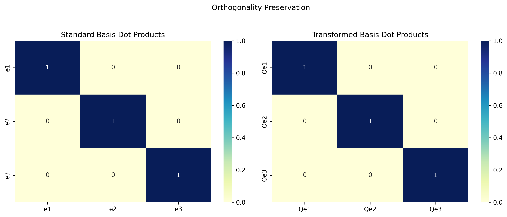

# Linear Transformation Examples

This document provides examples and key concepts on linear transformations of multivariate distributions, a fundamental concept in machine learning, statistics, and multivariate analysis.

## Key Concepts and Formulas

Linear transformations are fundamental operations in multivariate analysis that preserve the Gaussian nature of multivariate normal distributions. They are essential in dimension reduction, feature extraction, and data preprocessing.

### Linear Transformation Formula

If $\mathbf{X} \sim \mathcal{N}(\boldsymbol{\mu}, \boldsymbol{\Sigma})$ is a multivariate normal random vector and $\mathbf{Y} = \mathbf{A}\mathbf{X} + \mathbf{b}$ is a linear transformation of $\mathbf{X}$, then:

$$\mathbf{Y} \sim \mathcal{N}(\mathbf{A}\boldsymbol{\mu} + \mathbf{b}, \mathbf{A}\boldsymbol{\Sigma}\mathbf{A}^T)$$

Where:
- $\mathbf{A}$ = Transformation matrix
- $\mathbf{b}$ = Shift vector
- $\mathbf{A}\boldsymbol{\mu} + \mathbf{b}$ = Mean vector of the transformed distribution
- $\mathbf{A}\boldsymbol{\Sigma}\mathbf{A}^T$ = Covariance matrix of the transformed distribution

## Example 1: Linear Transformations of Multivariate Normal Distributions

### Problem Statement
Let $\mathbf{X} = \begin{bmatrix} X_1 \\ X_2 \\ X_3 \end{bmatrix}$ follow a multivariate normal distribution with mean vector $\boldsymbol{\mu} = \begin{bmatrix} 1 \\ 2 \\ 3 \end{bmatrix}$ and covariance matrix $\boldsymbol{\Sigma} = \begin{bmatrix} 4 & 1 & 0 \\ 1 & 9 & 2 \\ 0 & 2 & 16 \end{bmatrix}$.

Define $\mathbf{Y} = \mathbf{A}\mathbf{X} + \mathbf{b}$ where $\mathbf{A} = \begin{bmatrix} 2 & 1 & 0 \\ 0 & 3 & 1 \end{bmatrix}$ and $\mathbf{b} = \begin{bmatrix} 5 \\ -2 \end{bmatrix}$.

a) Find the distribution of $\mathbf{Y}$.
b) Calculate $\text{Cov}(Y_1, Y_2)$.
c) Are $Y_1$ and $Y_2$ independent? Why or why not?

### Solution

#### Part a: Finding the distribution of $\mathbf{Y}$

When a random vector $\mathbf{X}$ follows a multivariate normal distribution, any linear transformation $\mathbf{Y} = \mathbf{A}\mathbf{X} + \mathbf{b}$ also follows a multivariate normal distribution with:

$$\mathbf{Y} \sim \mathcal{N}(\mathbf{A}\boldsymbol{\mu} + \mathbf{b}, \mathbf{A}\boldsymbol{\Sigma}\mathbf{A}^T)$$

Let's compute the mean vector first:

$$\boldsymbol{\mu}_Y = \mathbf{A}\boldsymbol{\mu} + \mathbf{b} = \begin{bmatrix} 2 & 1 & 0 \\ 0 & 3 & 1 \end{bmatrix} \begin{bmatrix} 1 \\ 2 \\ 3 \end{bmatrix} + \begin{bmatrix} 5 \\ -2 \end{bmatrix}$$

$$\boldsymbol{\mu}_Y = \begin{bmatrix} 2(1) + 1(2) + 0(3) \\ 0(1) + 3(2) + 1(3) \end{bmatrix} + \begin{bmatrix} 5 \\ -2 \end{bmatrix} = \begin{bmatrix} 4 \\ 9 \end{bmatrix} + \begin{bmatrix} 5 \\ -2 \end{bmatrix} = \begin{bmatrix} 9 \\ 7 \end{bmatrix}$$

Now, let's calculate the covariance matrix:

$$\boldsymbol{\Sigma}_Y = \mathbf{A}\boldsymbol{\Sigma}\mathbf{A}^T = \begin{bmatrix} 2 & 1 & 0 \\ 0 & 3 & 1 \end{bmatrix} \begin{bmatrix} 4 & 1 & 0 \\ 1 & 9 & 2 \\ 0 & 2 & 16 \end{bmatrix} \begin{bmatrix} 2 & 0 \\ 1 & 3 \\ 0 & 1 \end{bmatrix}$$

First, computing $\mathbf{A}\boldsymbol{\Sigma}$:

$$\mathbf{A}\boldsymbol{\Sigma} = \begin{bmatrix} 2(4) + 1(1) + 0(0) & 2(1) + 1(9) + 0(2) & 2(0) + 1(2) + 0(16) \\ 0(4) + 3(1) + 1(0) & 0(1) + 3(9) + 1(2) & 0(0) + 3(2) + 1(16) \end{bmatrix}$$

$$\mathbf{A}\boldsymbol{\Sigma} = \begin{bmatrix} 9 & 11 & 2 \\ 3 & 29 & 22 \end{bmatrix}$$

Then, computing $\mathbf{A}\boldsymbol{\Sigma}\mathbf{A}^T$:

$$\boldsymbol{\Sigma}_Y = \begin{bmatrix} 9 & 11 & 2 \\ 3 & 29 & 22 \end{bmatrix} \begin{bmatrix} 2 & 0 \\ 1 & 3 \\ 0 & 1 \end{bmatrix}$$

$$\boldsymbol{\Sigma}_Y = \begin{bmatrix} 9(2) + 11(1) + 2(0) & 9(0) + 11(3) + 2(1) \\ 3(2) + 29(1) + 22(0) & 3(0) + 29(3) + 22(1) \end{bmatrix}$$

$$\boldsymbol{\Sigma}_Y = \begin{bmatrix} 29 & 35 \\ 35 & 109 \end{bmatrix}$$

Therefore, $\mathbf{Y} \sim \mathcal{N}\left(\begin{bmatrix} 9 \\ 7 \end{bmatrix}, \begin{bmatrix} 29 & 35 \\ 35 & 109 \end{bmatrix}\right)$

#### Part b: Calculating $\text{Cov}(Y_1, Y_2)$

From the covariance matrix, we can directly read that:
$$\text{Cov}(Y_1, Y_2) = \boldsymbol{\Sigma}_Y(1,2) = 35$$

#### Part c: Determining independence

For multivariate normal distributions, zero covariance means independence. Since $\text{Cov}(Y_1, Y_2) = 35 \neq 0$, $Y_1$ and $Y_2$ are not independent.

The non-zero covariance indicates that knowledge of one variable provides information about the other. This is also evident from the structure of the linear transformation, where both $Y_1$ and $Y_2$ depend on overlapping components of the original vector $\mathbf{X}$.

The correlation coefficient between $Y_1$ and $Y_2$ is:
$$\rho = \frac{\text{Cov}(Y_1, Y_2)}{\sqrt{\text{Var}(Y_1) \cdot \text{Var}(Y_2)}} = \frac{35}{\sqrt{29 \cdot 109}} \approx 0.623$$

### Visualizations

#### PDF Contour Plot
The contour plot shows the probability density function of the bivariate normal distribution $\mathbf{Y}$. The concentric curves represent areas of equal probability density, and the red dot marks the mean vector $\boldsymbol{\mu}_Y = [9, 7]^T$.

#### Covariance Ellipses
This plot illustrates the shape of the distribution using covariance ellipses. Each ellipse represents a confidence region containing a certain percentage of the probability mass. The orientation of the ellipses reflects the positive covariance between $Y_1$ and $Y_2$.

#### 3D Surface Plot
The 3D surface represents the probability density function in three dimensions, with height corresponding to probability density. The peak occurs at the mean vector $\boldsymbol{\mu}_Y = [9, 7]^T$.

#### Joint Distribution
This scatter plot with marginal distributions demonstrates the correlation between $Y_1$ and $Y_2$. The red regression line indicates the linear relationship between the variables, with a correlation coefficient of approximately 0.623.

## Example 2: Orthogonal Transformations and Preservation of Distances

### Problem Statement
Consider a random vector $\mathbf{X} \sim \mathcal{N}(\mathbf{0}, \mathbf{I}_3)$, i.e., a standard multivariate normal in 3 dimensions. Let $\mathbf{Q}$ be an orthogonal matrix:

$$\mathbf{Q} = \begin{bmatrix} 
\frac{1}{\sqrt{3}} & \frac{1}{\sqrt{2}} & \frac{1}{\sqrt{6}} \\
\frac{1}{\sqrt{3}} & -\frac{1}{\sqrt{2}} & \frac{1}{\sqrt{6}} \\
\frac{1}{\sqrt{3}} & 0 & -\frac{2}{\sqrt{6}}
\end{bmatrix}$$

Define $\mathbf{Y} = \mathbf{Q}\mathbf{X}$.

a) Find the distribution of $\mathbf{Y}$.
b) Show that this transformation preserves Euclidean distances between points.
c) Explain the geometric interpretation of this transformation.

### Solution

#### Part a: Finding the distribution of $\mathbf{Y}$

Using the formula for linear transformations of multivariate normals:

$$\mathbf{Y} = \mathbf{Q}\mathbf{X} \sim \mathcal{N}(\mathbf{Q}\boldsymbol{\mu}, \mathbf{Q}\boldsymbol{\Sigma}\mathbf{Q}^T)$$

Since $\mathbf{X} \sim \mathcal{N}(\mathbf{0}, \mathbf{I}_3)$, we have $\boldsymbol{\mu} = \mathbf{0}$ and $\boldsymbol{\Sigma} = \mathbf{I}_3$.

Therefore:
$$\mathbf{Y} \sim \mathcal{N}(\mathbf{Q}\mathbf{0}, \mathbf{Q}\mathbf{I}_3\mathbf{Q}^T) = \mathcal{N}(\mathbf{0}, \mathbf{Q}\mathbf{Q}^T)$$

Since $\mathbf{Q}$ is orthogonal, $\mathbf{Q}\mathbf{Q}^T = \mathbf{I}_3$, which we can verify:

$$\mathbf{Q}\mathbf{Q}^T = \begin{bmatrix} 1 & 0 & 0 \\ 0 & 1 & 0 \\ 0 & 0 & 1 \end{bmatrix}$$

Thus:
$$\mathbf{Y} \sim \mathcal{N}(\mathbf{0}, \mathbf{I}_3)$$

This shows that $\mathbf{Y}$ follows the same distribution as $\mathbf{X}$, namely a standard multivariate normal distribution. The key insight is that an orthogonal transformation of a standard multivariate normal distribution remains a standard multivariate normal distribution.

#### Part b: Preservation of Euclidean distances

For any two points $\mathbf{x}_1$ and $\mathbf{x}_2$ in the original space, their Euclidean distance is:
$$d(\mathbf{x}_1, \mathbf{x}_2) = \|\mathbf{x}_1 - \mathbf{x}_2\| = \sqrt{(\mathbf{x}_1 - \mathbf{x}_2)^T(\mathbf{x}_1 - \mathbf{x}_2)}$$

After transformation, these points become $\mathbf{y}_1 = \mathbf{Q}\mathbf{x}_1$ and $\mathbf{y}_2 = \mathbf{Q}\mathbf{x}_2$. Their distance is:
$$d(\mathbf{y}_1, \mathbf{y}_2) = \|\mathbf{y}_1 - \mathbf{y}_2\| = \|\mathbf{Q}\mathbf{x}_1 - \mathbf{Q}\mathbf{x}_2\| = \|\mathbf{Q}(\mathbf{x}_1 - \mathbf{x}_2)\|$$

Using the property of orthogonal matrices:
$$\|\mathbf{Q}(\mathbf{x}_1 - \mathbf{x}_2)\|^2 = (\mathbf{Q}(\mathbf{x}_1 - \mathbf{x}_2))^T(\mathbf{Q}(\mathbf{x}_1 - \mathbf{x}_2)) = (\mathbf{x}_1 - \mathbf{x}_2)^T\mathbf{Q}^T\mathbf{Q}(\mathbf{x}_1 - \mathbf{x}_2)$$

Since $\mathbf{Q}^T\mathbf{Q} = \mathbf{I}$:
$$(\mathbf{x}_1 - \mathbf{x}_2)^T\mathbf{Q}^T\mathbf{Q}(\mathbf{x}_1 - \mathbf{x}_2) = (\mathbf{x}_1 - \mathbf{x}_2)^T(\mathbf{x}_1 - \mathbf{x}_2) = \|\mathbf{x}_1 - \mathbf{x}_2\|^2$$

Therefore, $d(\mathbf{y}_1, \mathbf{y}_2) = d(\mathbf{x}_1, \mathbf{x}_2)$, showing that the orthogonal transformation preserves distances.

This is verified empirically with two random points:
- For points $\mathbf{x}_1 = [0.4967, -0.1383, 0.6477]$ and $\mathbf{x}_2 = [1.523, -0.2342, -0.2341]$:
  - Distance in X space: $\|\mathbf{x}_1 - \mathbf{x}_2\| = 1.356516$
- After transformation:
  - $\mathbf{y}_1 = \mathbf{Q}\mathbf{x}_1 = [0.4534, 0.649, -0.2421]$
  - $\mathbf{y}_2 = \mathbf{Q}\mathbf{x}_2 = [0.6182, 0.9493, 1.0705]$
  - Distance in Y space: $\|\mathbf{y}_1 - \mathbf{y}_2\| = 1.356516$

The distances are identical, confirming the theoretical result.

#### Part c: Geometric interpretation

The orthogonal transformation $\mathbf{Q}$ represents a rotation or reflection (or a combination of both) in the 3-dimensional space. Since it preserves distances and angles, it is considered a rigid transformation.

In this case, $\mathbf{Q}$ transforms the standard basis vectors to a new orthonormal basis:
- $\mathbf{e}_1 = [1, 0, 0]$ maps to $\mathbf{Q}\mathbf{e}_1 = [0.5774, 0.5774, 0.5774]$
- $\mathbf{e}_2 = [0, 1, 0]$ maps to $\mathbf{Q}\mathbf{e}_2 = [0.7071, -0.7071, 0]$
- $\mathbf{e}_3 = [0, 0, 1]$ maps to $\mathbf{Q}\mathbf{e}_3 = [0.4082, 0.4082, -0.8165]$

The geometric interpretation is that we are viewing the same multivariate normal distribution but from a different coordinate system.

Since the covariance matrix of the original distribution is the identity matrix (meaning the variables are uncorrelated and have unit variance), and the transformation preserves this property, the distribution looks the same from any orthogonal perspective. This is why a standard multivariate normal distribution is spherically symmetric.

### Visualizations

#### Original Distribution
The original distribution is a standard multivariate normal distribution in 3 dimensions, shown here with the standard basis vectors (e1, e2, e3) in red, green, and black respectively.

#### Transformed Distribution
The transformed distribution after applying the orthogonal transformation Q. Note that while the basis vectors have changed (Qe1, Qe2, Qe3), the shape of the distribution remains the same - still a standard normal distribution.

#### Distance Preservation
This visualization demonstrates how distances between points are preserved under orthogonal transformations. The blue line shows the distance between two points in the original space, while the black dashed line shows the distance between their transformed counterparts. Both distances are equal.

#### Orthogonality Preservation
This heatmap visualization shows how orthogonality is preserved. In both the standard basis and the transformed basis, the dot product between any two different basis vectors is 0 (indicating orthogonality), while the dot product of any vector with itself is 1 (indicating unit length).

## Example 3: Calculating Probabilities of Linear Transformations

### Problem Statement
Given a multivariate normal random vector $\mathbf{X} = \begin{bmatrix} X_1 \\ X_2 \\ X_3 \\ X_4 \end{bmatrix} \sim \mathcal{N}_4(\boldsymbol{\mu}, \boldsymbol{\Sigma})$ with:

$$\boldsymbol{\mu} = \begin{bmatrix} 15 \\ 30 \\ 7 \\ 10 \end{bmatrix} \text{ and } \boldsymbol{\Sigma} = \begin{bmatrix} 3 & -4 & 0 & 2 \\ -4 & 1 & 2 & 1 \\ 0 & 2 & 9 & 9 \\ 2 & 1 & 9 & 1 \end{bmatrix}$$

Find the following probabilities:

a) $P(X_1 - 5X_4 < 16)$
b) $P(3X_2 - 4X_3 > 35)$
c) $P(7X_1 + 3X_2 + 2X_3 < 56)$

### Solution

To find these probabilities, we need to apply the properties of linear transformations of multivariate normal variables. When we have a linear transformation of the form $Y = \mathbf{a}^T\mathbf{X}$ (where $\mathbf{a}$ is a vector of coefficients), the resulting variable $Y$ follows a univariate normal distribution with:

- Mean: $\mu_Y = \mathbf{a}^T\boldsymbol{\mu}$
- Variance: $\sigma_Y^2 = \mathbf{a}^T\boldsymbol{\Sigma}\mathbf{a}$

#### Part a: Finding $P(X_1 - 5X_4 < 16)$

Let $Y_1 = X_1 - 5X_4$, which corresponds to $\mathbf{a}_1 = [1, 0, 0, -5]^T$

The mean of $Y_1$ is:
$$\mu_{Y_1} = \mathbf{a}_1^T\boldsymbol{\mu} = 1 \cdot 15 + 0 \cdot 30 + 0 \cdot 7 + (-5) \cdot 10 = 15 - 50 = -35$$

The variance of $Y_1$ is:
$$\sigma_{Y_1}^2 = \mathbf{a}_1^T\boldsymbol{\Sigma}\mathbf{a}_1 = [1, 0, 0, -5] \begin{bmatrix} 3 & -4 & 0 & 2 \\ -4 & 1 & 2 & 1 \\ 0 & 2 & 9 & 9 \\ 2 & 1 & 9 & 1 \end{bmatrix} \begin{bmatrix} 1 \\ 0 \\ 0 \\ -5 \end{bmatrix}$$

First computing $\boldsymbol{\Sigma}\mathbf{a}_1$:
$$\boldsymbol{\Sigma}\mathbf{a}_1 = \begin{bmatrix} 3 & -4 & 0 & 2 \\ -4 & 1 & 2 & 1 \\ 0 & 2 & 9 & 9 \\ 2 & 1 & 9 & 1 \end{bmatrix} \begin{bmatrix} 1 \\ 0 \\ 0 \\ -5 \end{bmatrix} = \begin{bmatrix} -7 \\ -9 \\ -45 \\ -3 \end{bmatrix}$$

Then computing $\mathbf{a}_1^T\boldsymbol{\Sigma}\mathbf{a}_1$:
$$\sigma_{Y_1}^2 = [1, 0, 0, -5] \begin{bmatrix} -7 \\ -9 \\ -45 \\ -3 \end{bmatrix} = 1 \cdot (-7) + 0 \cdot (-9) + 0 \cdot (-45) + (-5) \cdot (-3) = -7 + 15 = 8$$

Therefore, $Y_1 \sim \mathcal{N}(-35, 8)$ with standard deviation $\sigma_{Y_1} = \sqrt{8} \approx 2.83$

Using the standard normal CDF, we compute:
$$P(Y_1 < 16) = P\left(\frac{Y_1 - (-35)}{\sqrt{8}} < \frac{16 - (-35)}{\sqrt{8}}\right) = P\left(Z < \frac{51}{\sqrt{8}}\right) = P(Z < 18.03)$$

Since 18.03 is far beyond several standard deviations, and the standard normal CDF approaches 1 as the argument increases:
$$P(Y_1 < 16) \approx 1.0$$

#### Part b: Finding $P(3X_2 - 4X_3 > 35)$

Let $Y_2 = 3X_2 - 4X_3$, which corresponds to $\mathbf{a}_2 = [0, 3, -4, 0]^T$

The mean of $Y_2$ is:
$$\mu_{Y_2} = \mathbf{a}_2^T\boldsymbol{\mu} = 0 \cdot 15 + 3 \cdot 30 + (-4) \cdot 7 + 0 \cdot 10 = 0 + 90 - 28 + 0 = 62$$

The variance of $Y_2$ is:
$$\sigma_{Y_2}^2 = \mathbf{a}_2^T\boldsymbol{\Sigma}\mathbf{a}_2$$

First computing $\boldsymbol{\Sigma}\mathbf{a}_2$:
$$\boldsymbol{\Sigma}\mathbf{a}_2 = \begin{bmatrix} -12 \\ -5 \\ -30 \\ -33 \end{bmatrix}$$

Then computing $\mathbf{a}_2^T\boldsymbol{\Sigma}\mathbf{a}_2$:
$$\sigma_{Y_2}^2 = [0, 3, -4, 0] \begin{bmatrix} -12 \\ -5 \\ -30 \\ -33 \end{bmatrix} = 0 \cdot (-12) + 3 \cdot (-5) + (-4) \cdot (-30) + 0 \cdot (-33) = 0 - 15 + 120 + 0 = 105$$

Therefore, $Y_2 \sim \mathcal{N}(62, 105)$ with standard deviation $\sigma_{Y_2} = \sqrt{105} \approx 10.25$

Using the standard normal CDF, we compute:
$$P(Y_2 > 35) = P\left(\frac{Y_2 - 62}{\sqrt{105}} > \frac{35 - 62}{\sqrt{105}}\right) = P\left(Z > \frac{-27}{\sqrt{105}}\right) = P(Z > -2.63)$$
$$P(Y_2 > 35) = 1 - P(Z \leq -2.63) \approx 1 - 0.0042 \approx 0.9958$$

#### Part c: Finding $P(7X_1 + 3X_2 + 2X_3 < 56)$

Let $Y_3 = 7X_1 + 3X_2 + 2X_3$, which corresponds to $\mathbf{a}_3 = [7, 3, 2, 0]^T$

The mean of $Y_3$ is:
$$\mu_{Y_3} = \mathbf{a}_3^T\boldsymbol{\mu} = 7 \cdot 15 + 3 \cdot 30 + 2 \cdot 7 + 0 \cdot 10 = 105 + 90 + 14 + 0 = 209$$

The variance of $Y_3$ is:
$$\sigma_{Y_3}^2 = \mathbf{a}_3^T\boldsymbol{\Sigma}\mathbf{a}_3$$

First computing $\boldsymbol{\Sigma}\mathbf{a}_3$:
$$\boldsymbol{\Sigma}\mathbf{a}_3 = \begin{bmatrix} 9 \\ -21 \\ 24 \\ 35 \end{bmatrix}$$

Then computing $\mathbf{a}_3^T\boldsymbol{\Sigma}\mathbf{a}_3$:
$$\sigma_{Y_3}^2 = [7, 3, 2, 0] \begin{bmatrix} 9 \\ -21 \\ 24 \\ 35 \end{bmatrix} = 7 \cdot 9 + 3 \cdot (-21) + 2 \cdot 24 + 0 \cdot 35 = 63 - 63 + 48 + 0 = 48$$

Therefore, $Y_3 \sim \mathcal{N}(209, 48)$ with standard deviation $\sigma_{Y_3} = \sqrt{48} \approx 6.93$

Using the standard normal CDF, we compute:
$$P(Y_3 < 56) = P\left(\frac{Y_3 - 209}{\sqrt{48}} < \frac{56 - 209}{\sqrt{48}}\right) = P\left(Z < \frac{-153}{\sqrt{48}}\right) = P(Z < -22.08)$$

Since -22.08 is far beyond several standard deviations in the negative direction, and the standard normal CDF approaches 0 as the argument decreases:
$$P(Y_3 < 56) \approx 0.0000$$

The exact computed probability is approximately $2.27 \times 10^{-108}$, which is effectively zero.

### Summary of Probabilities
- $P(X_1 - 5X_4 < 16) = 1.0000$
- $P(3X_2 - 4X_3 > 35) = 0.9958$
- $P(7X_1 + 3X_2 + 2X_3 < 56) = 0.0000$

### Visualizations

#### Probability Distribution for Y₁ = X₁ - 5X₄
This visualization shows the normal distribution for $Y_1 \sim \mathcal{N}(-35, 8)$ with the shaded area representing the probability $P(Y_1 < 16) \approx 1$.

#### Probability Distribution for Y₂ = 3X₂ - 4X₃
This visualization shows the normal distribution for $Y_2 \sim \mathcal{N}(62, 105)$ with the shaded area representing the probability $P(Y_2 > 35) \approx 0.9958$.

#### Probability Distribution for Y₃ = 7X₁ + 3X₂ + 2X₃
This visualization shows the normal distribution for $Y_3 \sim \mathcal{N}(209, 48)$ with the (virtually invisible) shaded area representing the probability $P(Y_3 < 56) \approx 0$.

#### Combined Distributions
This visualization shows all three probability distributions together for comparison.

## Example 4: Component Extraction and Linear Combinations

### Problem Statement
Let $\mathbf{X} = [X_1 \ X_2 \ X_3 \ X_4]^T$ be a four-variate Gaussian random vector with
$$\boldsymbol{\mu}_X = \begin{bmatrix} 2 \\ 1 \\ 1 \\ 0 \end{bmatrix}, \quad \text{and} \quad \mathbf{C}_X = \begin{bmatrix} 6 & 3 & 2 & 1 \\ 3 & 4 & 3 & 2 \\ 2 & 3 & 4 & 3 \\ 1 & 2 & 3 & 3 \end{bmatrix}.$$

Let $\mathbf{X}_1$, $\mathbf{X}_2$, and $\mathbf{Y}$ be defined as
$$\mathbf{X}_1 = \begin{bmatrix} X_1 \\ X_2 \end{bmatrix}, \quad \mathbf{X}_2 = \begin{bmatrix} X_3 \\ X_4 \end{bmatrix}, \quad \mathbf{Y} = \begin{bmatrix} 2X_1 \\ X_1 + 2X_2 \\ X_3 + X_4 \end{bmatrix}.$$

a) Find the distribution of $\mathbf{X}_1$, its mean vector and covariance matrix.
b) Find the distribution of $\mathbf{Y}$, its mean vector and covariance matrix.

### Solution

#### Part a: Finding the distribution of $\mathbf{X}_1$

We can express $\mathbf{X}_1$ as a linear transformation of $\mathbf{X}$ using a matrix $\mathbf{A}_1$:

$$\mathbf{X}_1 = \mathbf{A}_1 \mathbf{X}$$

where $\mathbf{A}_1 = \begin{bmatrix} 1 & 0 & 0 & 0 \\ 0 & 1 & 0 & 0 \end{bmatrix}$.

For linear transformations of multivariate normal distributions, we know that if $\mathbf{X} \sim \mathcal{N}(\boldsymbol{\mu}, \boldsymbol{\Sigma})$ and $\mathbf{Y} = \mathbf{A}\mathbf{X} + \mathbf{b}$, then $\mathbf{Y} \sim \mathcal{N}(\mathbf{A}\boldsymbol{\mu} + \mathbf{b}, \mathbf{A}\boldsymbol{\Sigma}\mathbf{A}^T)$.

In this case, since $\mathbf{X}_1 = \mathbf{A}_1 \mathbf{X}$ (with no shift vector), we have:

$$\boldsymbol{\mu}_{\mathbf{X}_1} = \mathbf{A}_1 \boldsymbol{\mu}_X = \begin{bmatrix} 1 & 0 & 0 & 0 \\ 0 & 1 & 0 & 0 \end{bmatrix} \begin{bmatrix} 2 \\ 1 \\ 1 \\ 0 \end{bmatrix} = \begin{bmatrix} 2 \\ 1 \end{bmatrix}$$

The covariance matrix of $\mathbf{X}_1$ is:

$$\boldsymbol{\Sigma}_{\mathbf{X}_1} = \mathbf{A}_1 \mathbf{C}_X \mathbf{A}_1^T = \begin{bmatrix} 1 & 0 & 0 & 0 \\ 0 & 1 & 0 & 0 \end{bmatrix} \begin{bmatrix} 6 & 3 & 2 & 1 \\ 3 & 4 & 3 & 2 \\ 2 & 3 & 4 & 3 \\ 1 & 2 & 3 & 3 \end{bmatrix} \begin{bmatrix} 1 & 0 \\ 0 & 1 \\ 0 & 0 \\ 0 & 0 \end{bmatrix}$$

Computing $\mathbf{A}_1 \mathbf{C}_X$ first:

$$\mathbf{A}_1 \mathbf{C}_X = \begin{bmatrix} 6 & 3 & 2 & 1 \\ 3 & 4 & 3 & 2 \end{bmatrix}$$

Then multiplying by $\mathbf{A}_1^T$:

$$\boldsymbol{\Sigma}_{\mathbf{X}_1} = \begin{bmatrix} 6 & 3 & 2 & 1 \\ 3 & 4 & 3 & 2 \end{bmatrix} \begin{bmatrix} 1 & 0 \\ 0 & 1 \\ 0 & 0 \\ 0 & 0 \end{bmatrix} = \begin{bmatrix} 6 & 3 \\ 3 & 4 \end{bmatrix}$$

Therefore, $\mathbf{X}_1 \sim \mathcal{N}\left(\begin{bmatrix} 2 \\ 1 \end{bmatrix}, \begin{bmatrix} 6 & 3 \\ 3 & 4 \end{bmatrix}\right)$.

An important observation is that the covariance matrix of $\mathbf{X}_1$ is exactly the upper-left 2×2 submatrix of the original covariance matrix $\mathbf{C}_X$. This is a general property of component extraction from multivariate normal distributions.

#### Part b: Finding the distribution of $\mathbf{Y}$

Similarly, we can express $\mathbf{Y}$ as a linear transformation of $\mathbf{X}$ using a matrix $\mathbf{A}_2$:

$$\mathbf{Y} = \mathbf{A}_2 \mathbf{X}$$

where $\mathbf{A}_2 = \begin{bmatrix} 2 & 0 & 0 & 0 \\ 1 & 2 & 0 & 0 \\ 0 & 0 & 1 & 1 \end{bmatrix}$.

The mean vector of $\mathbf{Y}$ is:

$$\boldsymbol{\mu}_{\mathbf{Y}} = \mathbf{A}_2 \boldsymbol{\mu}_X = \begin{bmatrix} 2 & 0 & 0 & 0 \\ 1 & 2 & 0 & 0 \\ 0 & 0 & 1 & 1 \end{bmatrix} \begin{bmatrix} 2 \\ 1 \\ 1 \\ 0 \end{bmatrix} = \begin{bmatrix} 4 \\ 4 \\ 1 \end{bmatrix}$$

The covariance matrix of $\mathbf{Y}$ is:

$$\boldsymbol{\Sigma}_{\mathbf{Y}} = \mathbf{A}_2 \mathbf{C}_X \mathbf{A}_2^T$$

Computing $\mathbf{A}_2 \mathbf{C}_X$ first:

$$\mathbf{A}_2 \mathbf{C}_X = \begin{bmatrix} 2 & 0 & 0 & 0 \\ 1 & 2 & 0 & 0 \\ 0 & 0 & 1 & 1 \end{bmatrix} \begin{bmatrix} 6 & 3 & 2 & 1 \\ 3 & 4 & 3 & 2 \\ 2 & 3 & 4 & 3 \\ 1 & 2 & 3 & 3 \end{bmatrix} = \begin{bmatrix} 12 & 6 & 4 & 2 \\ 12 & 11 & 8 & 5 \\ 3 & 5 & 7 & 6 \end{bmatrix}$$

Then multiplying by $\mathbf{A}_2^T$:

$$\boldsymbol{\Sigma}_{\mathbf{Y}} = \begin{bmatrix} 12 & 6 & 4 & 2 \\ 12 & 11 & 8 & 5 \\ 3 & 5 & 7 & 6 \end{bmatrix} \begin{bmatrix} 2 & 1 & 0 \\ 0 & 2 & 0 \\ 0 & 0 & 1 \\ 0 & 0 & 1 \end{bmatrix} = \begin{bmatrix} 24 & 24 & 6 \\ 24 & 34 & 13 \\ 6 & 13 & 13 \end{bmatrix}$$

Therefore, $\mathbf{Y} \sim \mathcal{N}\left(\begin{bmatrix} 4 \\ 4 \\ 1 \end{bmatrix}, \begin{bmatrix} 24 & 24 & 6 \\ 24 & 34 & 13 \\ 6 & 13 & 13 \end{bmatrix}\right)$.

### Visualizations

#### Original Distribution Projection
This visualization shows the original four-dimensional distribution projected onto the X1-X2 plane. The contour lines represent regions of equal probability density, and the red X marks the mean vector position (2,1).

#### Extracted Components Distribution
This visualization shows the bivariate normal distribution of the extracted components X1 = [X1, X2]ᵀ. The contour lines and color gradient represent the probability density function.

#### Linear Transformation Distribution
This visualization shows the transformed distribution of Y projected onto the Y1-Y2 plane. The contour lines represent regions of equal probability density for the new variables Y1 = 2X1 and Y2 = X1 + 2X2.

#### Original vs. Transformed Distribution Comparison
This side-by-side comparison shows how the original distribution (left) is transformed into the new distribution (right). Note the change in spread and orientation due to the linear transformation.

#### Correlation Matrices
This visualization shows the correlation matrices for the original random vector X, the extracted components X1, and the transformed vector Y. The correlation matrices provide insight into the relationships between variables in each distribution.

### Key Insights

This example illustrates several important concepts:

1. **Component Extraction**: When we extract components of a multivariate normal vector (as in $\mathbf{X}_1$), the resulting subvector is also multivariate normal with mean and covariance given by the corresponding subvector and submatrix of the original distribution.

2. **Linear Combinations**: When we form linear combinations of components (as in $\mathbf{Y}$), the resulting vector maintains the multivariate normal distribution with transformed mean and covariance.

3. **Transformation Formula**: The mean vector and covariance matrix of the transformed variables can be directly computed using the formulas $\boldsymbol{\mu}_{\mathbf{Y}} = \mathbf{A}\boldsymbol{\mu}_X$ and $\boldsymbol{\Sigma}_{\mathbf{Y}} = \mathbf{A}\mathbf{C}_X\mathbf{A}^T$.

4. **Block Extraction**: When extracting specific components (like $\mathbf{X}_1$), the resulting covariance matrix is simply the corresponding submatrix of the original covariance matrix.

5. **Distribution Shape**: The shape, orientation, and spread of the probability density function changes according to the linear transformation, as shown in the comparison visualization.

## Related Topics

- [[L2_1_Multivariate_Normal_Examples|Multivariate Normal Examples]]: More examples of multivariate normal distributions
- [[L2_1_Linear_Transformation|Linear Transformations]]: Detailed theory of linear transformations
- [[L2_1_Probability_Application_Examples|Probability Applications]]: Further examples of probability calculations in multivariate settings 