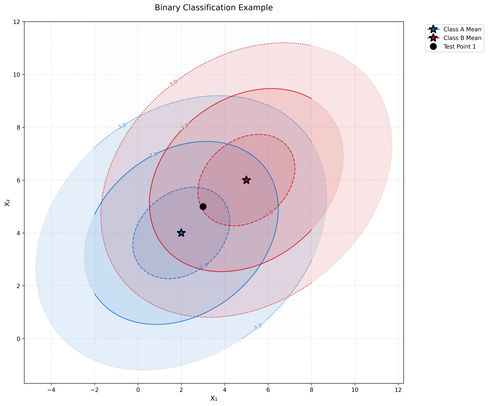
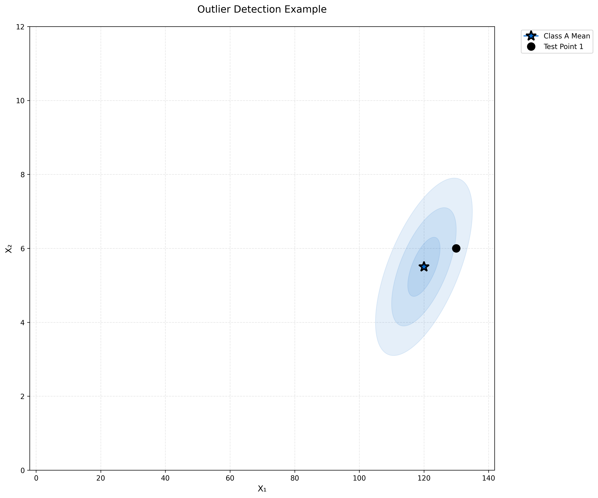
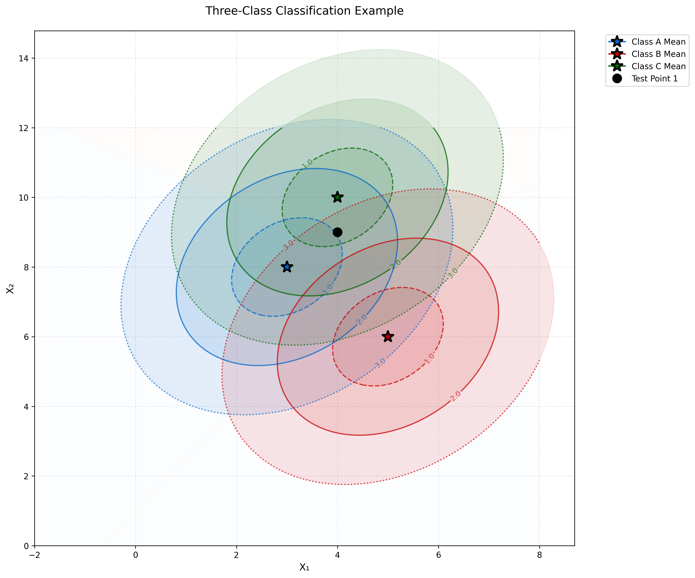

# Mahalanobis Distance and Classification Examples

This document provides examples and key concepts on Mahalanobis distance and its applications in classification, which are essential tools in machine learning, multivariate statistics, and pattern recognition.

## Key Concepts and Formulas

The Mahalanobis distance is a measure of the distance between a point and a distribution. Unlike Euclidean distance, it accounts for the correlations between variables and is scale-invariant.

### Mahalanobis Distance Formula

The squared Mahalanobis distance from a point $\mathbf{x}$ to a distribution with mean $\boldsymbol{\mu}$ and covariance matrix $\boldsymbol{\Sigma}$ is:

$$d_M^2(\mathbf{x}, \boldsymbol{\mu}) = (\mathbf{x} - \boldsymbol{\mu})^T \boldsymbol{\Sigma}^{-1} (\mathbf{x} - \boldsymbol{\mu})$$

Where:
- $\mathbf{x}$ = Point vector
- $\boldsymbol{\mu}$ = Mean vector of the distribution
- $\boldsymbol{\Sigma}$ = Covariance matrix of the distribution
- $\boldsymbol{\Sigma}^{-1}$ = Inverse of the covariance matrix

## Example 1: Mahalanobis Distance and Classification

### Problem Statement
You are building a binary classifier for a machine learning problem. The two classes follow multivariate normal distributions with the same covariance matrix but different means:

Class 1: $$\mathbf{X} \sim \mathcal{N}\left(\begin{bmatrix} 2 \\ 4 \end{bmatrix}, \begin{bmatrix} 5 & 1 \\ 1 & 3 \end{bmatrix}\right)$$

Class 2: $$\mathbf{X} \sim \mathcal{N}\left(\begin{bmatrix} 5 \\ 6 \end{bmatrix}, \begin{bmatrix} 5 & 1 \\ 1 & 3 \end{bmatrix}\right)$$

a) Calculate the Mahalanobis distance between the two class means.
b) For a new observation $\mathbf{x} = (3, 5)$, determine the class it belongs to using the minimum Mahalanobis distance classifier.
c) Show that the decision boundary based on the Mahalanobis distance is a straight line, and find its equation.

### Solution

#### Part a: Calculating the Mahalanobis distance between class means

Let's solve this step by step:

1. First, we calculate the inverse of the covariance matrix $\boldsymbol{\Sigma}^{-1}$:

$$\boldsymbol{\Sigma}^{-1} = \begin{bmatrix} 
0.2143 & -0.0714 \\
-0.0714 & 0.3571
\end{bmatrix}$$

2. The difference between the class means is:
$$\boldsymbol{\mu}_1 - \boldsymbol{\mu}_2 = \begin{bmatrix} 2 \\ 4 \end{bmatrix} - \begin{bmatrix} 5 \\ 6 \end{bmatrix} = \begin{bmatrix} -3 \\ -2 \end{bmatrix}$$

3. Now we calculate the squared Mahalanobis distance:

$$\begin{align*}
d_M^2(\boldsymbol{\mu}_1, \boldsymbol{\mu}_2) &= \begin{bmatrix} -3 & -2 \end{bmatrix} \begin{bmatrix} 0.2143 & -0.0714 \\ -0.0714 & 0.3571 \end{bmatrix} \begin{bmatrix} -3 \\ -2 \end{bmatrix} \\
&= \begin{bmatrix} -3 & -2 \end{bmatrix} \begin{bmatrix} -0.5000 \\ -0.7143 \end{bmatrix} \\
&= 2.5000
\end{align*}$$

Therefore, the Mahalanobis distance is:
$$d_M(\boldsymbol{\mu}_1, \boldsymbol{\mu}_2) = \sqrt{2.5000} \approx 1.5811$$

#### Part b: Classifying a new observation

For the new observation $\mathbf{x} = (3, 5)$, let's calculate its Mahalanobis distance to each class mean:

1. Distance to Class 1:
$$\mathbf{x} - \boldsymbol{\mu}_1 = \begin{bmatrix} 3 \\ 5 \end{bmatrix} - \begin{bmatrix} 2 \\ 4 \end{bmatrix} = \begin{bmatrix} 1 \\ 1 \end{bmatrix}$$

$$\begin{align*}
d_M^2(\mathbf{x}, \boldsymbol{\mu}_1) &= \begin{bmatrix} 1 & 1 \end{bmatrix} \begin{bmatrix} 0.2143 & -0.0714 \\ -0.0714 & 0.3571 \end{bmatrix} \begin{bmatrix} 1 \\ 1 \end{bmatrix} \\
&= 0.4286 \\
d_M(\mathbf{x}, \boldsymbol{\mu}_1) &= \sqrt{0.4286} = 0.6547
\end{align*}$$

2. Distance to Class 2:
$$\mathbf{x} - \boldsymbol{\mu}_2 = \begin{bmatrix} 3 \\ 5 \end{bmatrix} - \begin{bmatrix} 5 \\ 6 \end{bmatrix} = \begin{bmatrix} -2 \\ -1 \end{bmatrix}$$

$$\begin{align*}
d_M^2(\mathbf{x}, \boldsymbol{\mu}_2) &= \begin{bmatrix} -2 & -1 \end{bmatrix} \begin{bmatrix} 0.2143 & -0.0714 \\ -0.0714 & 0.3571 \end{bmatrix} \begin{bmatrix} -2 \\ -1 \end{bmatrix} \\
&= 0.9286 \\
d_M(\mathbf{x}, \boldsymbol{\mu}_2) &= \sqrt{0.9286} = 0.9636
\end{align*}$$

Since $d_M(\mathbf{x}, \boldsymbol{\mu}_1) < d_M(\mathbf{x}, \boldsymbol{\mu}_2)$ ($0.6547 < 0.9636$), we classify $\mathbf{x}$ as belonging to Class 1.

#### Part c: Decision Boundary Analysis

The decision boundary between the two classes is a straight line that satisfies:
$$d_M^2(\mathbf{x}, \boldsymbol{\mu}_1) = d_M^2(\mathbf{x}, \boldsymbol{\mu}_2)$$

This expands to:
$$(\mathbf{x} - \boldsymbol{\mu}_1)^T \boldsymbol{\Sigma}^{-1} (\mathbf{x} - \boldsymbol{\mu}_1) = (\mathbf{x} - \boldsymbol{\mu}_2)^T \boldsymbol{\Sigma}^{-1} (\mathbf{x} - \boldsymbol{\mu}_2)$$

After simplification, this becomes:
$$2(\boldsymbol{\mu}_1 - \boldsymbol{\mu}_2)^T \boldsymbol{\Sigma}^{-1} \mathbf{x} = (\boldsymbol{\mu}_1 - \boldsymbol{\mu}_2)^T \boldsymbol{\Sigma}^{-1} (\boldsymbol{\mu}_1 + \boldsymbol{\mu}_2)$$

Substituting our values:
$$2\begin{bmatrix} -0.5000 & -0.7143 \end{bmatrix}\begin{bmatrix} x_1 \\ x_2 \end{bmatrix} = -2.5000$$

Therefore, the decision boundary equation is:
$$x_1 + 1.4286x_2 = 2.5000$$

This is indeed a straight line, confirming our theoretical expectation. Points on one side of this line will be classified as Class 1, and points on the other side will be classified as Class 2.



## Example 2: Outlier Detection with Mahalanobis Distance

### Problem Statement
A quality control engineer is monitoring a manufacturing process where two key parameters are measured: tensile strength ($X_1$) and thickness ($X_2$). Historical data shows that these parameters follow a bivariate normal distribution with:

$$\boldsymbol{\mu} = \begin{bmatrix} 120 \\ 5.5 \end{bmatrix}, \boldsymbol{\Sigma} = \begin{bmatrix} 25 & 2.5 \\ 2.5 & 0.64 \end{bmatrix}$$

a) Calculate the Mahalanobis distance for a product with measurements $\mathbf{x} = (130, 6.0)$.
b) If the engineer wants to flag products with Mahalanobis distances that would occur with less than 5% probability in the normal distribution, what threshold should be used?
c) Is the product in part (a) considered an outlier based on this threshold?

### Solution

#### Part a: Calculating the Mahalanobis distance

Let's solve this step by step:

1. First, we calculate the difference vector:
$$\mathbf{x} - \boldsymbol{\mu} = \begin{bmatrix} 130.0000 \\ 6.0000 \end{bmatrix} - \begin{bmatrix} 120.0000 \\ 5.5000 \end{bmatrix} = \begin{bmatrix} 10.0000 \\ 0.5000 \end{bmatrix}$$

2. Calculate the inverse of the covariance matrix:
$$\boldsymbol{\Sigma}^{-1} = \begin{bmatrix} 
0.0656 & -0.2564 \\
-0.2564 & 2.5641
\end{bmatrix}$$

3. Calculate the squared Mahalanobis distance:
$$\begin{align*}
d_M^2(\mathbf{x}, \boldsymbol{\mu}) &= \begin{bmatrix} 10.0000 & 0.5000 \end{bmatrix} \begin{bmatrix} 0.0656 & -0.2564 \\ -0.2564 & 2.5641 \end{bmatrix} \begin{bmatrix} 10.0000 \\ 0.5000 \end{bmatrix} \\
&= \begin{bmatrix} 10.0000 & 0.5000 \end{bmatrix} \begin{bmatrix} 0.5282 \\ -1.2821 \end{bmatrix} \\
&= 4.6410
\end{align*}$$

Therefore, the Mahalanobis distance is:
$$d_M(\mathbf{x}, \boldsymbol{\mu}) = \sqrt{4.6410} \approx 2.1543$$

#### Part b: Determining the threshold for outlier detection

For a bivariate normal distribution, the squared Mahalanobis distance follows a chi-square distribution with 2 degrees of freedom ($p = 2$).

To find the threshold at 5% significance level:
1. Significance level ($\alpha$) = 0.05
2. Degrees of freedom ($p$) = 2
3. Critical value from chi-square distribution: $\chi^2_{0.95,2} = 5.9915$
4. Threshold for Mahalanobis distance = $\sqrt{5.9915} = 2.4477$

#### Part c: Making the decision

Comparing our calculated values:
- Mahalanobis distance of the test point: $2.1543$
- Critical threshold: $2.4477$

Since $2.1543 < 2.4477$, the test point is not considered an outlier at the 5% significance level.



## Example 3: Discriminant Analysis with Three Classes

### Problem Statement
A botanist is studying three species of plants and has measured two characteristics: leaf width ($X_1$) and length ($X_2$). The measurements for each species follow multivariate normal distributions with the following parameters:

Species A: $\boldsymbol{\mu}_A = \begin{bmatrix} 3 \\ 8 \end{bmatrix}$, $\boldsymbol{\Sigma} = \begin{bmatrix} 1.2 & 0.4 \\ 0.4 & 2.0 \end{bmatrix}$

Species B: $\boldsymbol{\mu}_B = \begin{bmatrix} 5 \\ 6 \end{bmatrix}$, $\boldsymbol{\Sigma} = \begin{bmatrix} 1.2 & 0.4 \\ 0.4 & 2.0 \end{bmatrix}$

Species C: $\boldsymbol{\mu}_C = \begin{bmatrix} 4 \\ 10 \end{bmatrix}$, $\boldsymbol{\Sigma} = \begin{bmatrix} 1.2 & 0.4 \\ 0.4 & 2.0 \end{bmatrix}$

a) A leaf is found with measurements $\mathbf{x} = (4, 9)$. Classify it using the minimum Mahalanobis distance criterion.
b) Describe the decision boundaries between the three species.
c) If the prior probabilities of species A, B, and C are 0.5, 0.3, and 0.2 respectively, how would this affect the classification decision?

### Solution

#### Part a: Classification using Minimum Mahalanobis Distance

First, we need to calculate the inverse of the shared covariance matrix:
$$\boldsymbol{\Sigma}^{-1} = \begin{bmatrix} 0.8929 & -0.1786 \\ -0.1786 & 0.5357 \end{bmatrix}$$

Now let's calculate the Mahalanobis distance to each class:

1. Distance to Class A:
$$\mathbf{x} - \boldsymbol{\mu}_A = \begin{bmatrix} 4 \\ 9 \end{bmatrix} - \begin{bmatrix} 3 \\ 8 \end{bmatrix} = \begin{bmatrix} 1 \\ 1 \end{bmatrix}$$

$$d_M^2(\mathbf{x}, \boldsymbol{\mu}_A) = \begin{bmatrix} 1 & 1 \end{bmatrix} \begin{bmatrix} 0.8929 & -0.1786 \\ -0.1786 & 0.5357 \end{bmatrix} \begin{bmatrix} 1 \\ 1 \end{bmatrix} = 1.0714$$

$$d_M(\mathbf{x}, \boldsymbol{\mu}_A) = \sqrt{1.0714} = 1.0351$$

2. Distance to Class B:
$$\mathbf{x} - \boldsymbol{\mu}_B = \begin{bmatrix} 4 \\ 9 \end{bmatrix} - \begin{bmatrix} 5 \\ 6 \end{bmatrix} = \begin{bmatrix} -1 \\ 3 \end{bmatrix}$$

$$d_M^2(\mathbf{x}, \boldsymbol{\mu}_B) = \begin{bmatrix} -1 & 3 \end{bmatrix} \begin{bmatrix} 0.8929 & -0.1786 \\ -0.1786 & 0.5357 \end{bmatrix} \begin{bmatrix} -1 \\ 3 \end{bmatrix} = 6.7857$$

$$d_M(\mathbf{x}, \boldsymbol{\mu}_B) = \sqrt{6.7857} = 2.6049$$

3. Distance to Class C:
$$\mathbf{x} - \boldsymbol{\mu}_C = \begin{bmatrix} 4 \\ 9 \end{bmatrix} - \begin{bmatrix} 4 \\ 10 \end{bmatrix} = \begin{bmatrix} 0 \\ -1 \end{bmatrix}$$

$$d_M^2(\mathbf{x}, \boldsymbol{\mu}_C) = \begin{bmatrix} 0 & -1 \end{bmatrix} \begin{bmatrix} 0.8929 & -0.1786 \\ -0.1786 & 0.5357 \end{bmatrix} \begin{bmatrix} 0 \\ -1 \end{bmatrix} = 0.5357$$

$$d_M(\mathbf{x}, \boldsymbol{\mu}_C) = \sqrt{0.5357} = 0.7319$$

Based on minimum Mahalanobis distance:
- Distance to Class A: $1.0351$
- Distance to Class B: $2.6049$
- Distance to Class C: $0.7319$

Since the distance to Class C is smallest, we would classify the point as belonging to Class C when not considering prior probabilities.

#### Part b: Decision Boundaries

The decision boundaries between any two classes are hyperplanes that satisfy:
$$d_M^2(\mathbf{x}, \boldsymbol{\mu}_i) = d_M^2(\mathbf{x}, \boldsymbol{\mu}_j)$$

This creates three decision boundaries:
1. Between Class A and B
2. Between Class B and C
3. Between Class A and C

These three lines partition the feature space into three regions, each corresponding to one of the classes. The visualization shows these decision boundaries and the resulting classification regions.

#### Part c: Classification with Prior Probabilities

When considering prior probabilities, we use the discriminant function:
$$g_i(\mathbf{x}) = \ln(P(C_i)) - \frac{1}{2}d_M^2(\mathbf{x}, \boldsymbol{\mu}_i)$$

Let's calculate this for each class:

1. Class A (prior = 0.50):
$$\begin{align*}
g_A(\mathbf{x}) &= \ln(0.50) - \frac{1}{2}(1.0351)^2 \\
&= -0.6931 - 0.5357 \\
&= -1.2289
\end{align*}$$

2. Class B (prior = 0.30):
$$\begin{align*}
g_B(\mathbf{x}) &= \ln(0.30) - \frac{1}{2}(2.6049)^2 \\
&= -1.2040 - 3.3929 \\
&= -4.5968
\end{align*}$$

3. Class C (prior = 0.20):
$$\begin{align*}
g_C(\mathbf{x}) &= \ln(0.20) - \frac{1}{2}(0.7319)^2 \\
&= -1.6094 - 0.2679 \\
&= -1.8773
\end{align*}$$

Comparing the discriminant scores:
- Class A: $-1.2289$ (highest)
- Class B: $-4.5968$
- Class C: $-1.8773$

When considering prior probabilities, we would classify the point as belonging to Class A, since it has the highest discriminant score. This is different from our previous classification (Class C) because the high prior probability of Class A ($0.50$) outweighs its slightly larger Mahalanobis distance.



## Running the Examples

You can run the code that generates these examples and visualizations using:

```bash
python3 ML_Obsidian_Vault/Lectures/2/Codes/1_multivariate_mahalanobis_examples.py
```

## Related Topics

- [[L2_1_Mahalanobis_Distance|Mahalanobis Distance]]: In-depth coverage of Mahalanobis distance
- [[L2_1_Multivariate_Normal_Examples|Multivariate Normal Examples]]: Examples of multivariate normal distributions
- [[L2_1_Covariance_Examples|Covariance Examples]]: Understanding covariance structures
- [[L2_1_Linear_Discriminant_Analysis|Linear Discriminant Analysis]]: Classification techniques using Mahalanobis distance
- [[L2_1_Outlier_Detection|Outlier Detection]]: Statistical methods for identifying anomalies 