# Multivariate Normal Distribution Examples

This document provides practical examples of the multivariate normal (Gaussian) distribution, illustrating its importance in machine learning and data analysis.

## Key Concepts and Formulas

The multivariate normal distribution is a generalization of the one-dimensional normal distribution to higher dimensions. It is fully characterized by its mean vector and covariance matrix.

### Definition

A random vector $\mathbf{X} = [X_1, X_2, \ldots, X_p]^T$ follows a $p$-dimensional multivariate normal distribution, denoted as $\mathbf{X} \sim \mathcal{N}(\boldsymbol{\mu}, \boldsymbol{\Sigma})$, if its probability density function (PDF) is:

$$f(\mathbf{x}) = \frac{1}{(2\pi)^{p/2}|\boldsymbol{\Sigma}|^{1/2}} \exp\left(-\frac{1}{2}(\mathbf{x}-\boldsymbol{\mu})^T\boldsymbol{\Sigma}^{-1}(\mathbf{x}-\boldsymbol{\mu})\right)$$

Where:
- $\boldsymbol{\mu}$ = Mean vector (dimension $p \times 1$)
- $\boldsymbol{\Sigma}$ = Covariance matrix (dimension $p \times p$, symmetric and positive-definite)
- $|\boldsymbol{\Sigma}|$ = Determinant of the covariance matrix
- $\boldsymbol{\Sigma}^{-1}$ = Inverse of the covariance matrix

### Key Properties

1. **Marginal Distributions**: If $\mathbf{X} \sim \mathcal{N}(\boldsymbol{\mu}, \boldsymbol{\Sigma})$, then any subset of variables also follows a multivariate normal distribution.

2. **Conditional Distributions**: If $\mathbf{X} \sim \mathcal{N}(\boldsymbol{\mu}, \boldsymbol{\Sigma})$ and we partition $\mathbf{X}$ into $\mathbf{X} = [\mathbf{X}_1, \mathbf{X}_2]^T$, then:
   $\mathbf{X}_1 | \mathbf{X}_2 = \mathbf{x}_2 \sim \mathcal{N}(\boldsymbol{\mu}_{1|2}, \boldsymbol{\Sigma}_{1|2})$
   
   Where:
   - $\boldsymbol{\mu}_{1|2} = \boldsymbol{\mu}_1 + \boldsymbol{\Sigma}_{12}\boldsymbol{\Sigma}_{22}^{-1}(\mathbf{x}_2 - \boldsymbol{\mu}_2)$
   - $\boldsymbol{\Sigma}_{1|2} = \boldsymbol{\Sigma}_{11} - \boldsymbol{\Sigma}_{12}\boldsymbol{\Sigma}_{22}^{-1}\boldsymbol{\Sigma}_{21}$

3. **Linear Transformations**: If $\mathbf{X} \sim \mathcal{N}(\boldsymbol{\mu}, \boldsymbol{\Sigma})$ and $\mathbf{Y} = \mathbf{A}\mathbf{X} + \mathbf{b}$, then:
   $\mathbf{Y} \sim \mathcal{N}(\mathbf{A}\boldsymbol{\mu} + \mathbf{b}, \mathbf{A}\boldsymbol{\Sigma}\mathbf{A}^T)$

4. **Sum of Independent Normal Vectors**: If $\mathbf{X} \sim \mathcal{N}(\boldsymbol{\mu}_X, \boldsymbol{\Sigma}_X)$ and $\mathbf{Y} \sim \mathcal{N}(\boldsymbol{\mu}_Y, \boldsymbol{\Sigma}_Y)$ are independent, then:
   $\mathbf{X} + \mathbf{Y} \sim \mathcal{N}(\boldsymbol{\mu}_X + \boldsymbol{\mu}_Y, \boldsymbol{\Sigma}_X + \boldsymbol{\Sigma}_Y)$

5. **Mahalanobis Distance**: The squared Mahalanobis distance from $\mathbf{x}$ to $\boldsymbol{\mu}$ is:
   $d^2(\mathbf{x}, \boldsymbol{\mu}) = (\mathbf{x} - \boldsymbol{\mu})^T \boldsymbol{\Sigma}^{-1} (\mathbf{x} - \boldsymbol{\mu})$
   
   For $\mathbf{X} \sim \mathcal{N}(\boldsymbol{\mu}, \boldsymbol{\Sigma})$, this distance follows a chi-squared distribution with $p$ degrees of freedom.

## Examples

The following examples demonstrate multivariate normal distributions in different contexts:

### Example 1: Bivariate Normal Distribution Visualization

#### Problem Statement
Visualize a bivariate normal distribution with:
- Mean vector $\boldsymbol{\mu} = [0, 0]^T$
- Covariance matrix $\boldsymbol{\Sigma} = \begin{bmatrix} 1 & 0.7 \\ 0.7 & 1 \end{bmatrix}$

Compare this with a bivariate normal distribution with the same mean but no correlation.

#### Solution

##### Step 1: Define the distributions
We define two bivariate normal distributions:
1. A correlated distribution with $\boldsymbol{\Sigma} = \begin{bmatrix} 1 & 0.7 \\ 0.7 & 1 \end{bmatrix}$
2. An uncorrelated distribution with $\boldsymbol{\Sigma} = \begin{bmatrix} 1 & 0 \\ 0 & 1 \end{bmatrix}$

##### Step 2: Generate data points from these distributions
We generate 1000 sample points from each distribution. Here are the first few samples from the correlated distribution:
- Sample 1: $[-0.404, -0.511]$
- Sample 2: $[-1.187, -0.007]$
- Sample 3: $[0.307, 0.125]$
- Sample 4: $[-1.753, -1.159]$
- Sample 5: $[0.223, 0.643]$

##### Step 3: Visualize the probability density functions
For the correlated case ($\rho = 0.7$):
- Determinant $|\boldsymbol{\Sigma}| = 0.51$
- Inverse $\boldsymbol{\Sigma}^{-1} = \begin{bmatrix} 1.961 & -1.373 \\ -1.373 & 1.961 \end{bmatrix}$

For the uncorrelated case ($\rho = 0$):
- Determinant $|\boldsymbol{\Sigma}| = 1.0$
- Inverse $\boldsymbol{\Sigma}^{-1} = \begin{bmatrix} 1 & 0 \\ 0 & 1 \end{bmatrix}$

The shape of the distribution varies significantly based on the correlation:
1. The correlated distribution has elliptical contours tilted at an angle
2. The uncorrelated distribution has circular contours, reflecting independent variables
3. In the correlated case, high values of $X_1$ tend to occur with high values of $X_2$

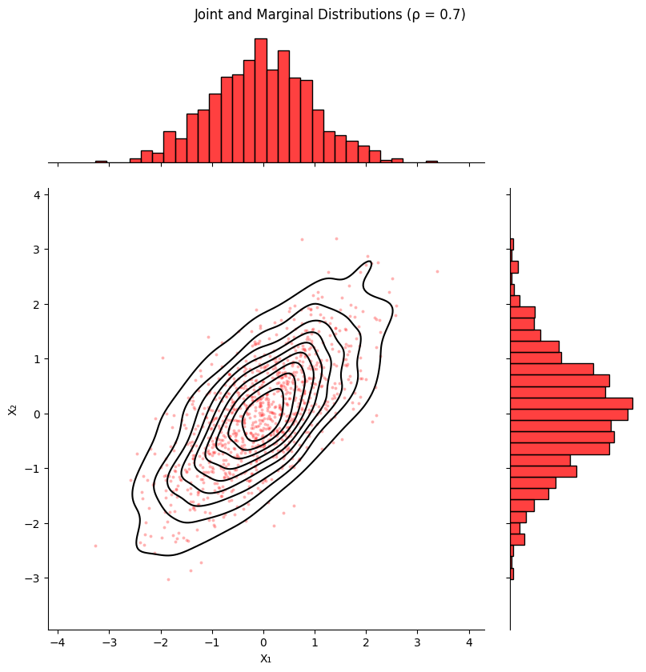
*This joint plot displays both the scatter plot of data points from a correlated bivariate normal distribution (ρ = 0.7) and the marginal distributions of each variable. The central plot shows the relationship between variables X₁ and X₂, with contour lines representing density. The top and right plots show the marginal distributions of X₁ and X₂ respectively, which are normal distributions.*

#### Individual Visualizations

The bivariate normal distribution can be visualized in different ways, each highlighting specific aspects of the distribution:

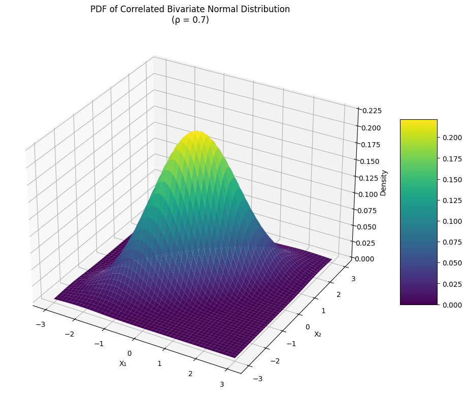
*This 3D surface plot shows the probability density function (PDF) of a bivariate normal distribution with correlation coefficient ρ = 0.7. The bell-shaped surface is elongated along the y=x direction, reflecting the positive correlation between variables. The height of the surface at any point represents the probability density at that combination of X₁ and X₂ values, with the peak centered at the mean (0,0).*

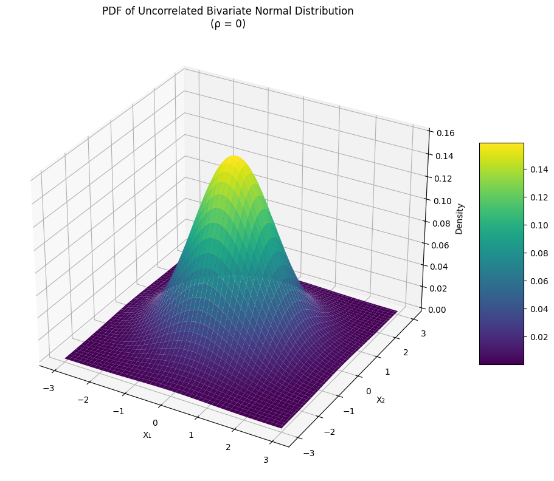
*This 3D surface plot shows the PDF of a bivariate normal distribution with uncorrelated variables (ρ = 0). The bell-shaped surface is symmetric around the center, with circular contours when viewed from above. This reflects the independence between variables X₁ and X₂, where knowing the value of one variable provides no information about the other. Like the correlated case, the peak is centered at the mean (0,0).*

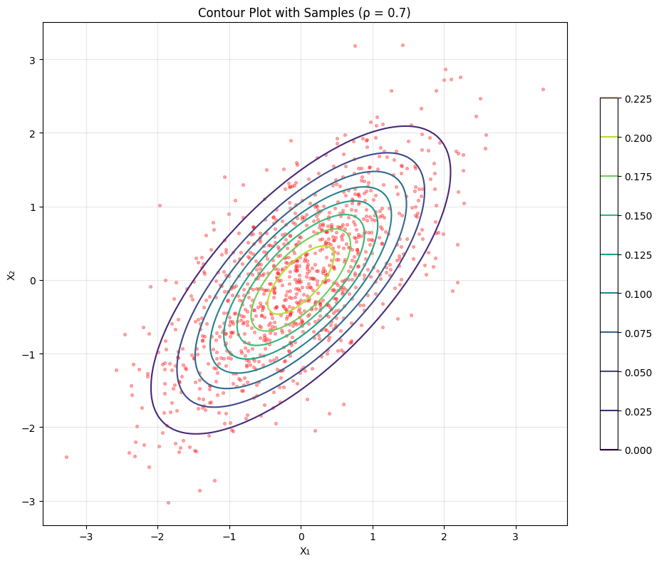
*This contour plot shows the probability density function of a correlated bivariate normal distribution (ρ = 0.7) from a top-down view. The red dots represent random samples drawn from this distribution. The elliptical contour lines represent equal probability density levels, with the ellipses tilted along the y=x direction indicating positive correlation. The samples cluster within the higher probability density regions, demonstrating the pattern predicted by the distribution.*

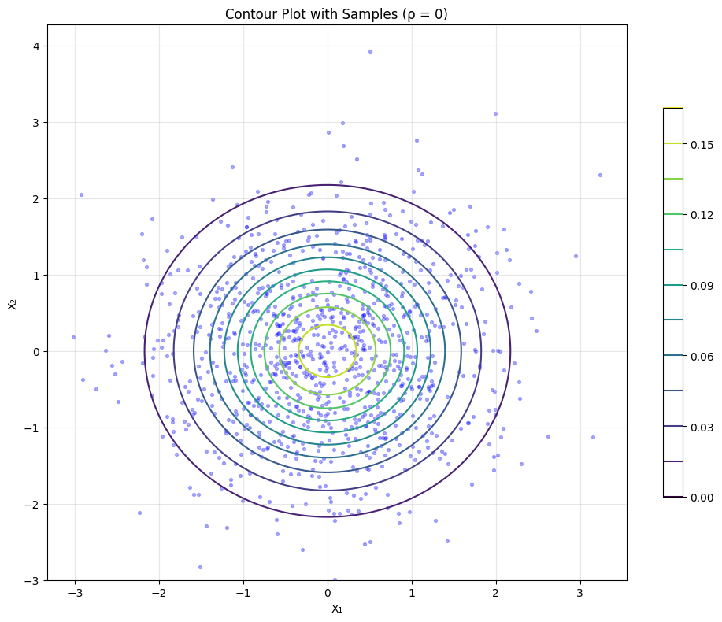
*This contour plot shows the probability density function of an uncorrelated bivariate normal distribution (ρ = 0) from a top-down view. The blue dots represent random samples drawn from this distribution. The circular contour lines indicate that the probability density depends only on the distance from the mean (0,0), not on the direction. This circular symmetry is a visual representation of the independence between the two variables.*

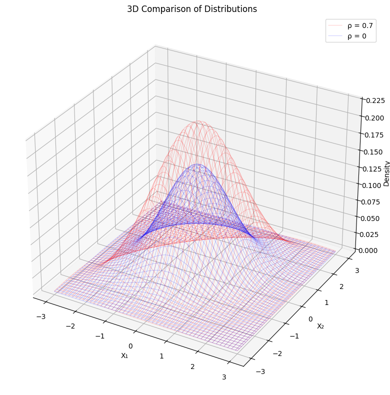
*This 3D wireframe plot directly compares the correlated (red, ρ = 0.7) and uncorrelated (blue, ρ = 0) bivariate normal distributions. Both distributions have identical marginal variances and means, but differ in their correlation structure. The correlated distribution is elongated along the y=x direction, while the uncorrelated distribution is perfectly symmetrical around its center.*

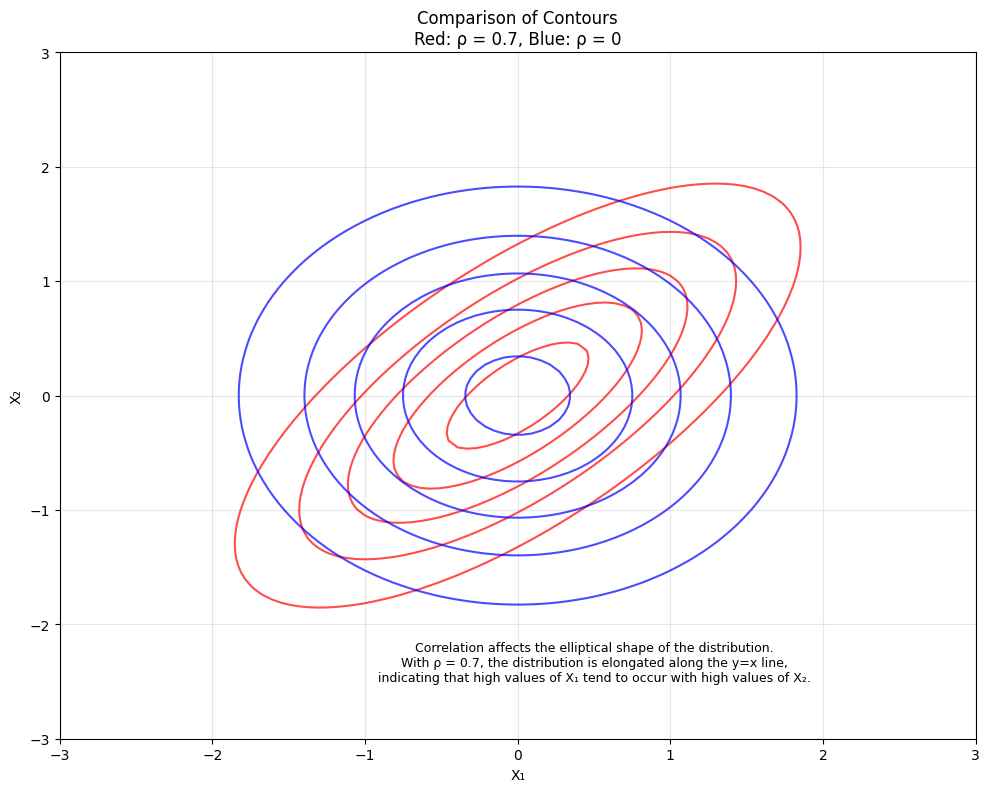
*This contour plot directly compares the elliptical contours of the correlated bivariate normal distribution (red, ρ = 0.7) with the circular contours of the uncorrelated distribution (blue, ρ = 0). The tilt in the red ellipses shows that when X₁ increases, X₂ is likely to increase as well, indicating positive correlation. In contrast, the blue circles show that all directions are equally likely for the uncorrelated case.*

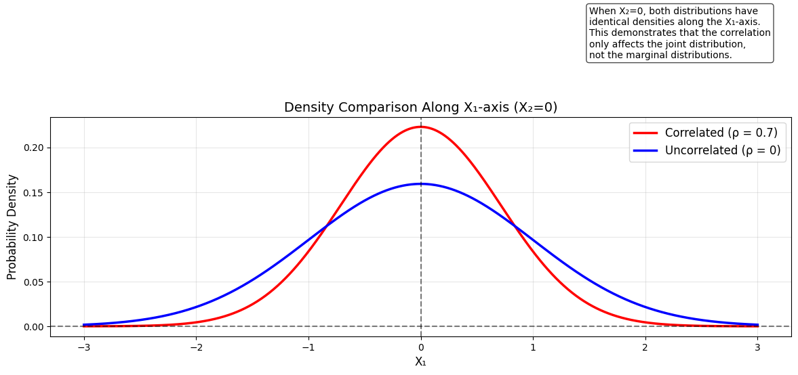
*This plot shows a cross-section of the probability density functions along the X₁-axis where X₂=0. Despite having different correlation structures, both distributions (correlated in red, uncorrelated in blue) produce identical density curves along this slice. This demonstrates an important property of multivariate normal distributions: correlation affects the joint distribution but not the marginal distributions. Both distributions have the same mean and standard deviation for X₁, resulting in identical density profiles when we fix X₂=0.*

### Example 2: Stock Returns Modeling

#### Problem Statement
Model the joint distribution of daily returns for three stocks (Apple, Microsoft, and Google) using a multivariate normal distribution.

#### Solution

##### Step 1: Analyze the data
We simulate 500 days of returns with realistic parameters:
- Mean vector $\boldsymbol{\mu} = [0.0005, 0.0007, 0.0006]^T$
- Standard deviations $[0.015, 0.014, 0.016]^T$
- Correlation matrix $\boldsymbol{\rho} = \begin{bmatrix} 1.00 & 0.72 & 0.63 \\ 0.72 & 1.00 & 0.58 \\ 0.63 & 0.58 & 1.00 \end{bmatrix}$

The resulting covariance matrix is:
$$\boldsymbol{\Sigma} = \begin{bmatrix} 0.000225 & 0.0001512 & 0.0001512 \\ 0.0001512 & 0.000196 & 0.00012992 \\ 0.0001512 & 0.00012992 & 0.000256 \end{bmatrix}$$

##### Step 2: Fit a multivariate normal distribution
The sample statistics from the generated data are:
- Sample mean vector: $[0.00069, 0.00177, 0.00128]^T$
- Sample covariance matrix:
$$\boldsymbol{\Sigma}_{sample} = \begin{bmatrix} 0.000215 & 0.000147 & 0.000147 \\ 0.000147 & 0.000196 & 0.000130 \\ 0.000147 & 0.000130 & 0.000247 \end{bmatrix}$$

##### Step 3: Assess the fit
We use Q-Q plots to check the normality of each stock's returns and pairwise scatter plots to examine the joint distributions.

##### Step 4: Calculate portfolio risk
For an equally weighted portfolio ($w = [1/3, 1/3, 1/3]^T$):
- Expected daily return: 0.001247 (0.3143 annualized)
- Portfolio variance: 0.00016723
- Portfolio volatility (standard deviation): 0.0129 (0.2053 annualized)

The portfolio variance is calculated using $\sigma^2_p = \mathbf{w}^T \boldsymbol{\Sigma} \mathbf{w}$, which accounts for both individual variances and covariances between stocks.

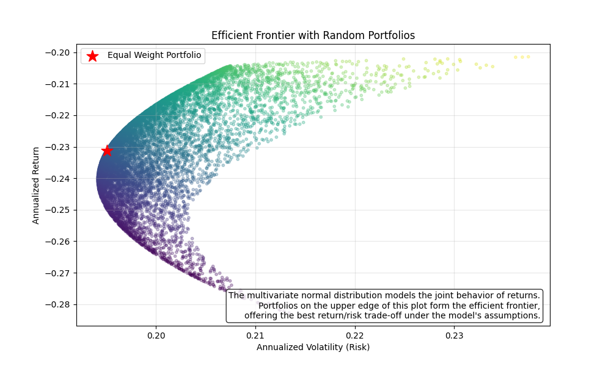
*This visualization shows the efficient frontier for portfolio optimization based on multivariate normal modeling of stock returns. Each point represents a possible portfolio with different weights for Apple, Microsoft, and Google stocks. The color represents the ratio of return to risk, with brighter colors showing better risk/reward ratios. The red star shows an equally-weighted portfolio. The upper edge of the point cloud forms the efficient frontier, representing portfolios with optimal risk-return tradeoffs.*

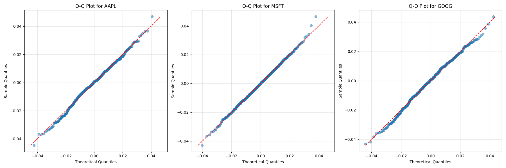
*These Quantile-Quantile plots assess how well the stock returns data fits a normal distribution. Each plot compares the quantiles of observed returns (y-axis) against theoretical quantiles from a normal distribution (x-axis). Points following the red diagonal line indicate good agreement with normality. The three plots show Q-Q analyses for Apple, Microsoft, and Google stocks respectively. Deviations from the line, especially in the tails, would suggest the data doesn't perfectly follow a normal distribution.*

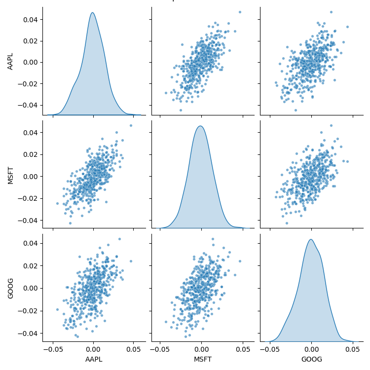
*This pairplot matrix shows the relationships between returns of the three stocks. The diagonal displays the distribution of each stock's returns (Apple, Microsoft, and Google), while the off-diagonal plots show scatter plots of returns for each pair of stocks. The positive correlations between stocks are visible in the scatter plots, showing that these tech stocks tend to move together. The density plots on the diagonal confirm that individual returns approximately follow normal distributions.*

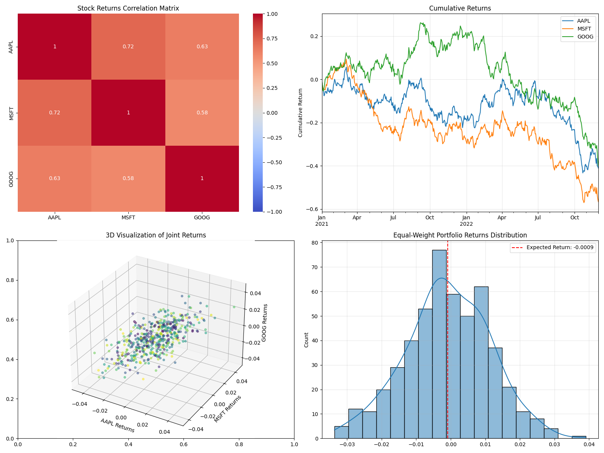
*This four-panel summary visualization shows: (1) The correlation matrix between the three stocks, with the intensity of color indicating correlation strength; (2) The cumulative returns over time; (3) A 3D scatter plot showing the joint distribution of returns for all three stocks; and (4) The distribution of returns for an equally-weighted portfolio, with the red line indicating the expected return. Together, these plots provide a comprehensive view of the multivariate normal model applied to stock returns.*

### Example 3: Conditional Distributions

#### Problem Statement
Given a trivariate normal distribution for variables $X_1$, $X_2$, and $X_3$ with:
- Mean vector $\boldsymbol{\mu} = [10, 20, 30]^T$
- Covariance matrix 
$$\boldsymbol{\Sigma} = \begin{bmatrix} 
    16 & 8 & 4 \\
    8 & 25 & 5 \\
    4 & 5 & 9
\end{bmatrix}$$

Find the conditional distribution of $X_1$ given $X_2 = 18$ and $X_3 = 32$.

#### Solution

##### Step 1: Partition the mean vector and covariance matrix
We partition the parameters as follows:
- $\mu_1 = 10$ (mean of $X_1$)
- $\boldsymbol{\mu}_{2,3} = [20, 30]^T$ (mean of $[X_2, X_3]$)
- $\Sigma_{11} = 16$ (variance of $X_1$)
- $\boldsymbol{\Sigma}_{12} = [8, 4]$ (covariance between $X_1$ and $[X_2, X_3]$)
- $\boldsymbol{\Sigma}_{21} = [8, 4]^T$ (covariance between $[X_2, X_3]$ and $X_1$)
- $\boldsymbol{\Sigma}_{22} = \begin{bmatrix} 25 & 5 \\ 5 & 9 \end{bmatrix}$ (covariance matrix of $[X_2, X_3]$)

##### Step 2: Calculate the conditional mean
The inverse of $\boldsymbol{\Sigma}_{22}$ is:
$$\boldsymbol{\Sigma}_{22}^{-1} = \begin{bmatrix} 0.045 & -0.025 \\ -0.025 & 0.125 \end{bmatrix}$$

The deviation of the observed values from their means is:
$$(\mathbf{x}_{2,3} - \boldsymbol{\mu}_{2,3}) = [18, 32] - [20, 30] = [-2, 2]^T$$

The adjustment term is:
$$\boldsymbol{\Sigma}_{12}\boldsymbol{\Sigma}_{22}^{-1} = [8, 4] \begin{bmatrix} 0.045 & -0.025 \\ -0.025 & 0.125 \end{bmatrix} = [0.26, 0.3]$$

Therefore, the conditional mean is:
$$\mu_{1|2,3} = \mu_1 + \boldsymbol{\Sigma}_{12}\boldsymbol{\Sigma}_{22}^{-1}(\mathbf{x}_{2,3} - \boldsymbol{\mu}_{2,3})$$
$$\mu_{1|2,3} = 10 + [0.26, 0.3] \cdot [-2, 2]^T$$
$$\mu_{1|2,3} = 10 + 0.08 = 10.08$$

##### Step 3: Calculate the conditional variance
The conditional variance is:
$$\Sigma_{1|2,3} = \Sigma_{11} - \boldsymbol{\Sigma}_{12}\boldsymbol{\Sigma}_{22}^{-1}\boldsymbol{\Sigma}_{21}$$
$$\Sigma_{1|2,3} = 16 - [0.26, 0.3] \cdot [8, 4]^T$$
$$\Sigma_{1|2,3} = 16 - 3.28 = 12.72$$

##### Step 4: Interpret the result
The conditional distribution is:
$$X_1 | (X_2 = 18, X_3 = 32) \sim \mathcal{N}(10.08, 12.72)$$

The 95% confidence interval for $X_1$ given the observed values of $X_2$ and $X_3$ is:
$$[3.09, 17.07]$$

Observing $X_2$ and $X_3$ provides information about $X_1$, reducing its variance from $16$ to $12.72$, which represents an information gain from the known variables.

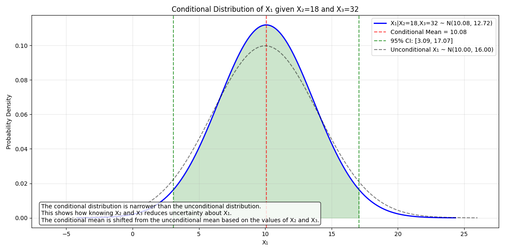
*This plot shows the conditional distribution of $X_1$ given $X_2=18$ and $X_3=32$ in a trivariate normal distribution. The blue solid line shows the conditional probability density function, which is also normal but with a different mean and reduced variance compared to the unconditional distribution (black dashed line). The red vertical line marks the conditional mean, while the green vertical lines and shaded area indicate the 95% confidence interval. This visualization demonstrates how knowledge of $X_2$ and $X_3$ values updates our belief about $X_1$.*

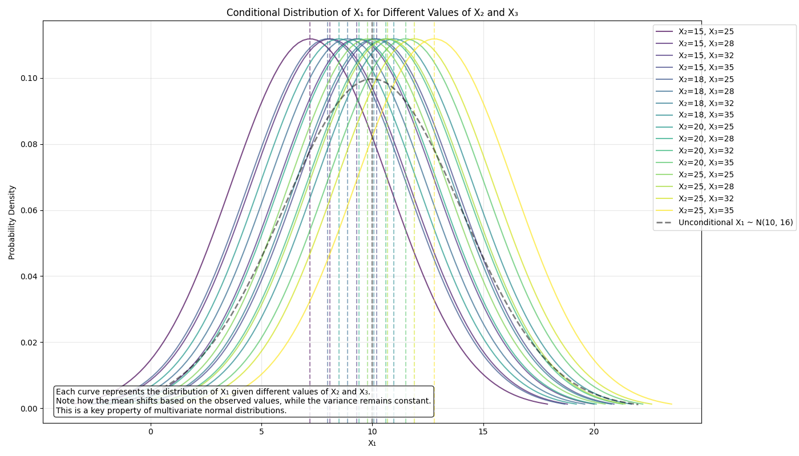
*This plot compares multiple conditional distributions of $X_1$ given different values of $X_2$ and $X_3$. Each colored curve represents the probability density function of $X_1$ conditioned on specific values of $X_2$ and $X_3$. The black dashed line shows the unconditional distribution of $X_1$. Note how the conditional mean shifts based on the observed values of $X_2$ and $X_3$, while the conditional variance remains the same across all conditional distributions—a key property of multivariate normal distributions.*

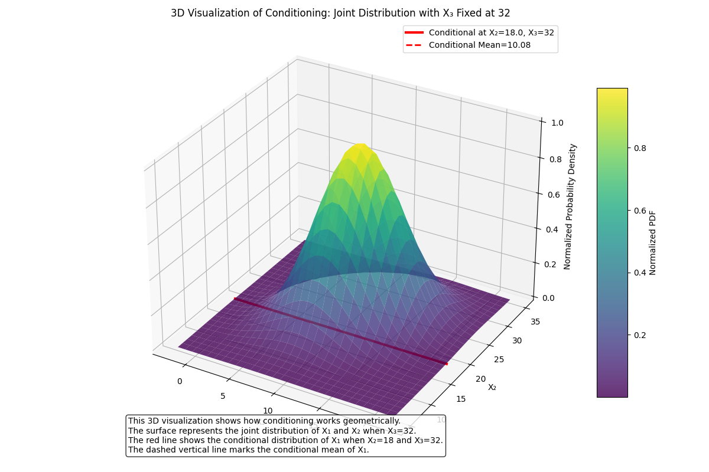
*This 3D visualization illustrates the geometric interpretation of conditioning in multivariate normal distributions. The surface represents the joint distribution of $X_1$ and $X_2$ when $X_3=32$ is fixed. The red line shows the "slice" of the distribution corresponding to the conditional distribution of $X_1$ when both $X_2=18$ and $X_3=32$ are fixed. The dashed vertical line marks the conditional mean of $X_1$ given these observed values. This visualization helps understand conditioning as taking a slice through the multivariate normal distribution at specific values of the conditioning variables.*

### Example 4: Maximum Likelihood Estimation

#### Problem Statement
Estimate the parameters (mean vector and covariance matrix) of a multivariate normal distribution from a dataset of observations using maximum likelihood estimation (MLE).

#### Solution

##### Step 1: Generate synthetic data from a known multivariate normal distribution
We generate synthetic data using the following parameters:
- True mean vector: $\boldsymbol{\mu} = [5, 10, 15]^T$
- True covariance matrix:
$$\boldsymbol{\Sigma} = \begin{bmatrix} 4.0 & 1.0 & 0.5 \\ 1.0 & 9.0 & 2.0 \\ 0.5 & 2.0 & 16.0 \end{bmatrix}$$

We generate 200 samples and use them to estimate the parameters.

##### Step 2: Derive the maximum likelihood estimators
The log-likelihood function for a multivariate normal distribution is:
$$\ln L(\boldsymbol{\mu}, \boldsymbol{\Sigma} | \mathbf{X}) = -\frac{n}{2} \ln(2\pi) - \frac{n}{2} \ln|\boldsymbol{\Sigma}| - \frac{1}{2} \sum_{i=1}^{n}(\mathbf{x}_i - \boldsymbol{\mu})^T\boldsymbol{\Sigma}^{-1}(\mathbf{x}_i - \boldsymbol{\mu})$$

Maximizing this function with respect to $\boldsymbol{\mu}$ and $\boldsymbol{\Sigma}$ gives the MLEs:
$$\hat{\boldsymbol{\mu}} = \frac{1}{n} \sum_{i=1}^{n} \mathbf{x}_i$$
$$\hat{\boldsymbol{\Sigma}} = \frac{1}{n} \sum_{i=1}^{n}(\mathbf{x}_i - \hat{\boldsymbol{\mu}})(\mathbf{x}_i - \hat{\boldsymbol{\mu}})^T$$

##### Step 3: Compute the estimates from the data
The MLE for the mean vector (sample mean) is:
$$\hat{\boldsymbol{\mu}} = [4.82, 10.01, 14.73]^T$$

The MLE for the covariance matrix (using $1/n$) is:
$$\hat{\boldsymbol{\Sigma}} = \begin{bmatrix} 4.13 & 1.16 & 1.52 \\ 1.16 & 8.99 & 1.83 \\ 1.52 & 1.83 & 15.34 \end{bmatrix}$$

##### Step 4: Interpret the results
Comparing our estimates with the true parameters:

**Error in mean estimate:**
- Absolute error: $[-0.18, 0.01, -0.27]^T$
- Percentage error: $[3.50\%, 0.05\%, 1.79\%]^T$

**Error in covariance estimate:**
- Frobenius norm of error: 1.63
- Relative Frobenius error: 8.53%

As sample size increases, the MLE estimates converge to the true parameters:
- n = 10: Mean error = 1.50, Covariance error = 38.72%
- n = 50: Mean error = 0.89, Covariance error = 15.90%
- n = 100: Mean error = 0.34, Covariance error = 13.35% 
- n = 500: Mean error = 0.30, Covariance error = 8.21%
- n = 1000: Mean error = 0.11, Covariance error = 8.32%
- n = 5000: Mean error = 0.06, Covariance error = 1.95%

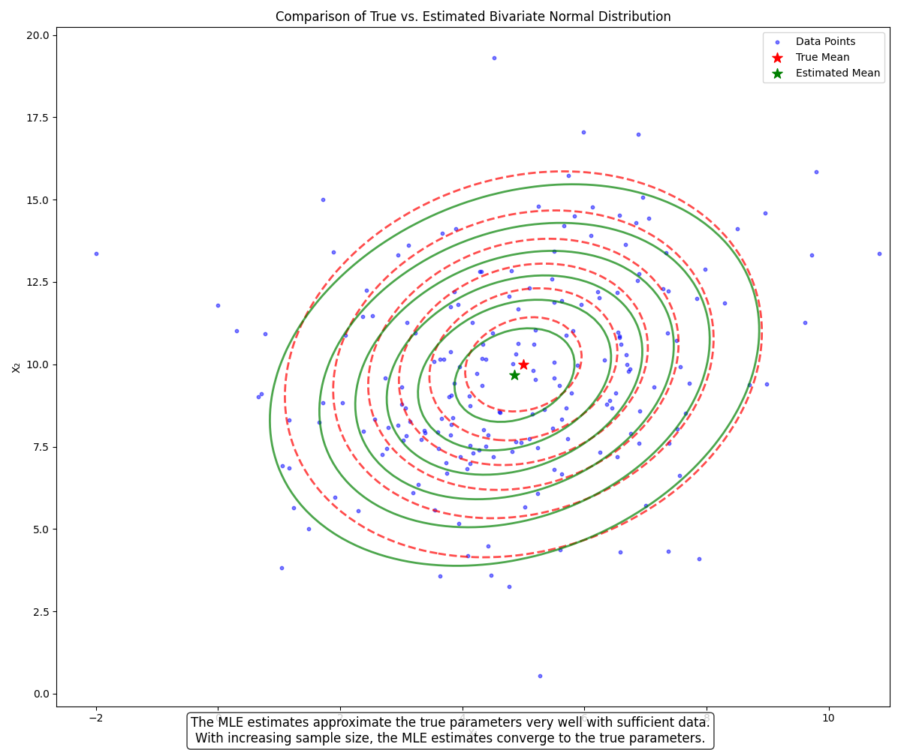
*This plot compares the true and estimated bivariate normal distributions using Maximum Likelihood Estimation (MLE). The blue dots are the sampled data points. The red dashed contours show the true distribution from which the data was generated, while the green solid contours show the distribution estimated from the data using MLE. The stars indicate the true mean (red) and the estimated mean (green). The close match between the contours demonstrates how MLE accurately recovers the underlying distribution parameters when given sufficient data.*

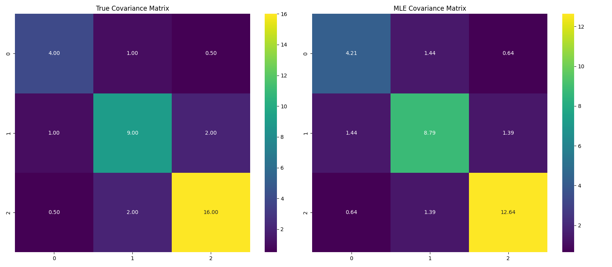
*This side-by-side comparison shows heatmaps of the true covariance matrix (left) and the MLE-estimated covariance matrix (right) for a trivariate normal distribution. The color intensity represents the magnitude of each element, with the diagonal showing variances and off-diagonal elements showing covariances. The similarity between the two matrices demonstrates the accuracy of MLE in estimating the covariance structure from sample data.*

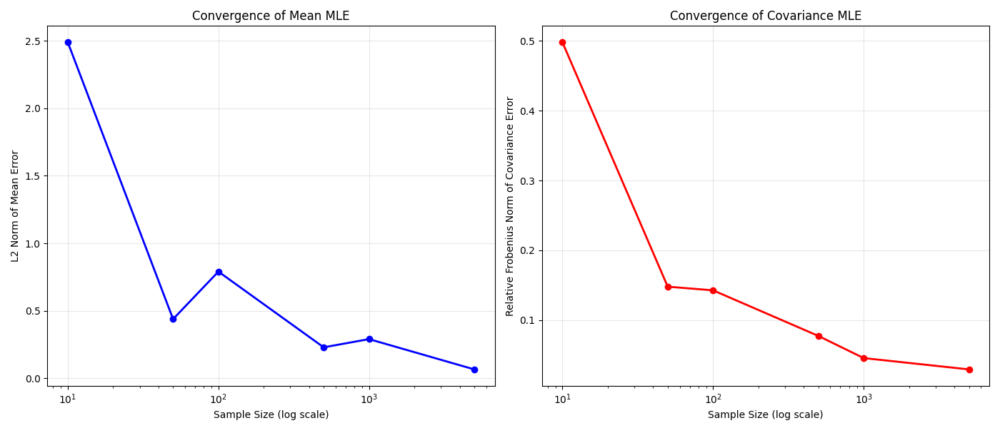
*These plots demonstrate how the MLE estimates converge to the true parameters as sample size increases. The left plot shows the error in estimating the mean vector (measured by L2 norm), while the right plot shows the relative error in estimating the covariance matrix (measured by Frobenius norm). Both plots use a logarithmic scale for sample size. The decreasing error with increasing sample size illustrates the consistency property of maximum likelihood estimators—they converge to the true parameters as more data becomes available.*

## Applications in Machine Learning

The multivariate normal distribution plays a crucial role in many machine learning methods:

1. **Portfolio Optimization**: Uses multivariate normal distributions to model asset returns and optimize the risk-return tradeoff in financial portfolios.

2. **Linear Discriminant Analysis (LDA)**: Uses multivariate normal distributions to model class-conditional densities.

3. **Gaussian Mixture Models (GMMs)**: Use combinations of multivariate normal distributions to model complex data.

4. **Gaussian Processes**: Use infinite-dimensional generalizations of multivariate normal distributions for regression and classification.

5. **Probabilistic PCA and Factor Analysis**: Model data as being generated from a lower-dimensional multivariate normal distribution plus noise.

6. **Kalman Filters**: Use multivariate normal distributions to model state and observation uncertainties in time series.

## Running the Examples

You can run the code that generates the probability examples and visualizations using:

```bash
python3 ML_Obsidian_Vault/Lectures/2/Codes/1_multivariate_normal_bivariate_visualization.py
python3 ML_Obsidian_Vault/Lectures/2/Codes/1_multivariate_normal_stock_returns.py
python3 ML_Obsidian_Vault/Lectures/2/Codes/1_multivariate_normal_conditional_distributions.py
python3 ML_Obsidian_Vault/Lectures/2/Codes/1_multivariate_normal_mle.py
```

## Related Topics

- [[L2_1_Multivariate_Analysis|Multivariate Analysis]]: Broader statistical techniques for multiple variables
- [[L2_1_Normal_Distribution_Examples|Normal Distribution Examples]]: Examples of the univariate case
- [[L2_1_Covariance_Examples|Covariance Examples]]: Understanding covariance matrices
- [[L2_1_Mahalanobis_Distance|Mahalanobis Distance]]: A distance measure derived from multivariate normal distributions
- [[L2_1_Linear_Transformation|Linear Transformation]]: Understanding transformations of random vectors 