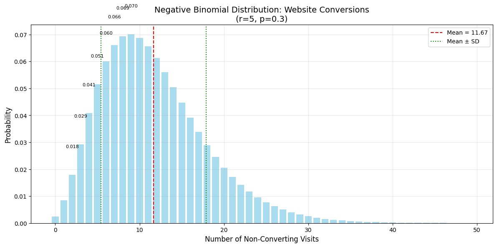
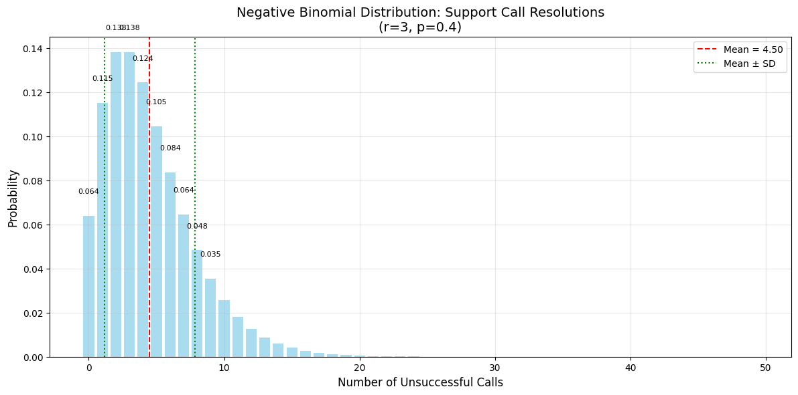
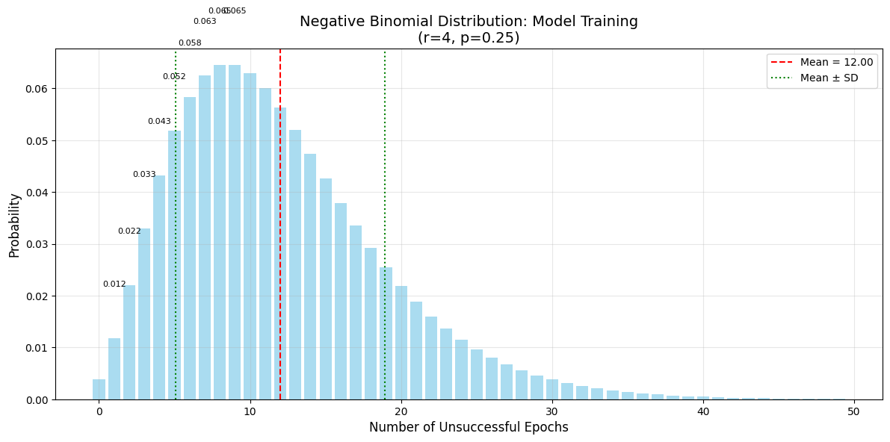
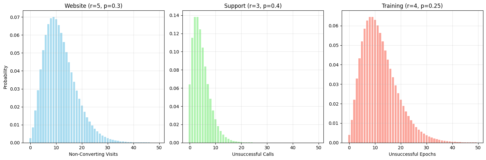

# Negative Binomial Distribution Examples

This document provides practical examples of the Negative Binomial distribution, which is particularly useful for modeling overdispersed count data in machine learning and data analysis.

## Key Concepts and Formulas

The Negative Binomial distribution models the number of failures before the r-th success in a sequence of independent Bernoulli trials. It's particularly useful when the variance exceeds the mean (overdispersion).

### Negative Binomial Distribution

$$P(X = k) = \binom{k + r - 1}{k} p^r (1-p)^k$$

Where:
- $k$ = number of failures
- $r$ = number of successes
- $p$ = probability of success
- $\binom{k + r - 1}{k}$ = number of combinations

### Key Properties

- **Mean**: $E[X] = \frac{r(1-p)}{p}$
- **Variance**: $Var(X) = \frac{r(1-p)}{p^2}$
- **Overdispersion**: The variance is always greater than the mean

## Examples

### Example 1: Website Visits

#### Problem Statement
A website has a 30% chance of converting a visitor into a customer. We want to know the probability distribution of the number of non-converting visits before getting 5 conversions.

In this example:
- Success = visitor converts (p = 0.3)
- r = 5 conversions needed
- We want to find the distribution of non-converting visits

#### Solution

The probability mass function for the number of non-converting visits (k) before getting 5 conversions is:

$$P(X = k) = \binom{k + 4}{k} (0.3)^5 (0.7)^k$$

The expected number of non-converting visits is:
$$E[X] = \frac{5(1-0.3)}{0.3} = 11.67$$

The variance is:
$$Var(X) = \frac{5(1-0.3)}{0.3^2} = 38.89$$

The standard deviation is:
$$\sqrt{Var(X)} = 6.24$$



### Example 2: Customer Support Calls

#### Problem Statement
A customer support team has a 40% chance of resolving a customer's issue on the first call. We want to model the number of unsuccessful calls before resolving 3 issues.

In this example:
- Success = issue resolved (p = 0.4)
- r = 3 resolutions needed
- We want to find the distribution of unsuccessful calls

#### Solution

The probability mass function for the number of unsuccessful calls (k) before getting 3 resolutions is:

$$P(X = k) = \binom{k + 2}{k} (0.4)^3 (0.6)^k$$

The expected number of unsuccessful calls is:
$$E[X] = \frac{3(1-0.4)}{0.4} = 4.50$$

The variance is:
$$Var(X) = \frac{3(1-0.4)}{0.4^2} = 11.25$$

The standard deviation is:
$$\sqrt{Var(X)} = 3.35$$



### Example 3: Machine Learning Model Training

#### Problem Statement
A machine learning model has a 25% chance of achieving the target accuracy in each training epoch. We want to model the number of unsuccessful epochs before achieving the target accuracy 4 times.

In this example:
- Success = target accuracy achieved (p = 0.25)
- r = 4 successful epochs needed
- We want to find the distribution of unsuccessful epochs

#### Solution

The probability mass function for the number of unsuccessful epochs (k) before getting 4 successful ones is:

$$P(X = k) = \binom{k + 3}{k} (0.25)^4 (0.75)^k$$

The expected number of unsuccessful epochs is:
$$E[X] = \frac{4(1-0.25)}{0.25} = 12.00$$

The variance is:
$$Var(X) = \frac{4(1-0.25)}{0.25^2} = 48.00$$

The standard deviation is:
$$\sqrt{Var(X)} = 6.93$$



## Comparison of Examples

The following plot shows a comparison of all three examples, highlighting how different parameters affect the shape of the distribution:



Key observations:
1. As the success probability (p) decreases, the distribution becomes more spread out
2. Higher values of r (required successes) lead to more symmetric distributions
3. The variance increases as p decreases, demonstrating the overdispersion property

## Key Insights

### Theoretical Insights
- The Negative Binomial distribution is a generalization of the Geometric distribution
- It's particularly useful when modeling count data with overdispersion
- The distribution becomes more symmetric as r increases
- The variance-to-mean ratio increases as p decreases

### Practical Applications
- Modeling website visitor behavior
- Customer support call analysis
- Machine learning training dynamics
- Biological count data (e.g., RNA sequencing)
- Insurance claim frequency

### Common Pitfalls
- Confusing the number of trials with the number of failures
- Using it when the data isn't actually overdispersed
- Not properly estimating the parameters r and p
- Ignoring the standard deviation when interpreting the results

## Running the Examples

You can run the code that generates the probability examples and visualizations using:

```bash
python3 ML_Obsidian_Vault/Lectures/2/Codes/1_negative_binomial_examples.py
```

## Related Topics

- [[L2_1_Geometric_Examples|Geometric Examples]]: Special case of Negative Binomial with r=1
- [[L2_1_Binomial_Examples|Binomial Examples]]: Related distribution for fixed number of trials
- [[L2_1_Poisson_Examples|Poisson Examples]]: Alternative for count data without overdispersion 