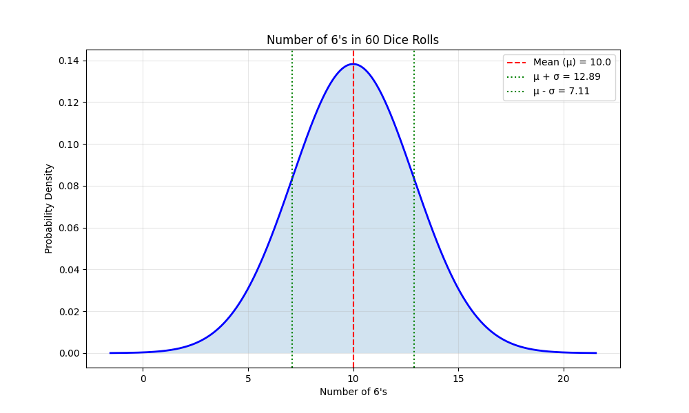
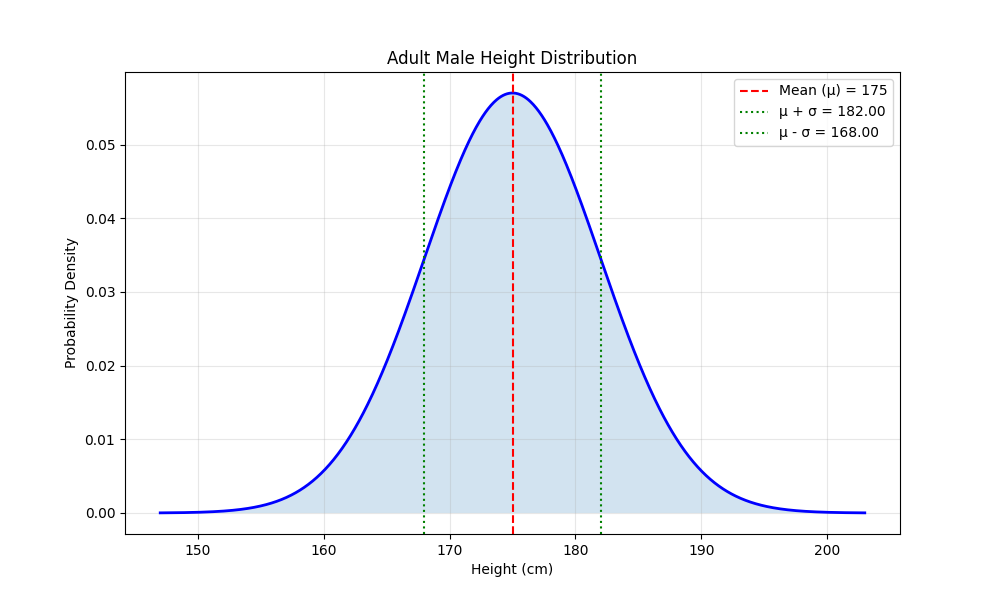
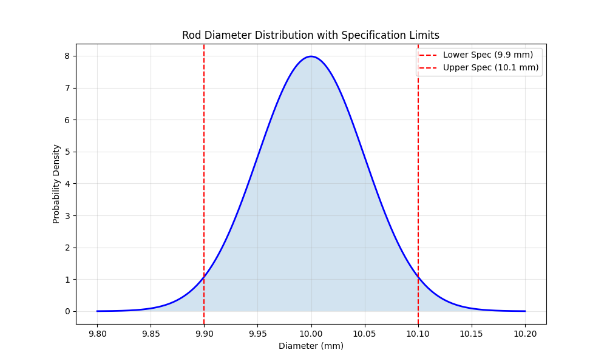
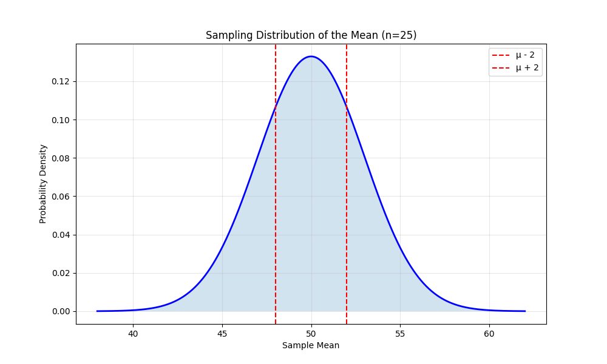

# Normal Distribution Examples

This document provides practical examples of the normal (Gaussian) distribution for various scenarios, illustrating this fundamental continuous probability distribution and its significance in machine learning and data analysis contexts.

## Key Concepts and Formulas

The normal distribution is a continuous probability distribution that is symmetric about its mean and is characterized by its bell-shaped density curve. It is arguably the most important probability distribution in statistics and machine learning due to its prevalence in natural phenomena and its mathematical properties.

### Normal Distribution Formula

The probability density function (PDF) of a normal distribution with mean $\mu$ and standard deviation $\sigma$ is:

$$f(x) = \frac{1}{\sigma\sqrt{2\pi}} e^{-\frac{1}{2}\left(\frac{x-\mu}{\sigma}\right)^2}$$

Where:
- $\mu$ = Mean (location parameter)
- $\sigma$ = Standard deviation (scale parameter)
- $\sigma^2$ = Variance

**Standard Normal Distribution**: When $\mu = 0$ and $\sigma = 1$, we get the standard normal distribution, often denoted as $Z \sim N(0,1)$:

$$\phi(z) = \frac{1}{\sqrt{2\pi}} e^{-\frac{z^2}{2}}$$

**Standardization**: Any normal random variable X can be standardized to Z using the transformation:

$$Z = \frac{X - \mu}{\sigma}$$

**Cumulative Distribution Function (CDF)**: The probability that X is less than or equal to a value x is:

$$\Phi(x) = P(X \leq x) = \int_{-\infty}^{x} \frac{1}{\sigma\sqrt{2\pi}} e^{-\frac{1}{2}\left(\frac{t-\mu}{\sigma}\right)^2} dt$$

## Examples

The following examples demonstrate the normal distribution:

- **Coin Toss**: Simple example of binomial distribution approximated by normal
- **Dice Rolls**: Another simple example of discrete distribution approximated by normal
- **Height and Weight Distributions**: Biological measurements that follow normal distributions
- **Error Analysis**: Measurement errors and residuals in regression
- **Financial Data**: Stock returns and risk modeling
- **Machine Learning Applications**: Classification, clustering, and hypothesis testing

### Example 1: Coin Toss Analysis

#### Problem Statement
A fair coin is tossed 100 times. We want to understand the distribution of the number of heads.

In this example:
- n = 100 (number of tosses)
- p = 0.5 (probability of heads)
- X = Number of heads

#### Solution

##### Step 1: Calculate the mean and standard deviation
For a binomial distribution, the mean and standard deviation are:
$$\mu = n \times p = 100 \times 0.5 = 50$$
$$\sigma = \sqrt{n \times p \times (1-p)} = \sqrt{100 \times 0.5 \times 0.5} = 5$$

##### Step 2: Approximate with normal distribution
For large n, the binomial distribution can be approximated by a normal distribution:
$$X \sim N(50, 5^2)$$

This means:
- The expected number of heads is 50
- The standard deviation is 5
- About 68% of the time, we'll get between 45 and 55 heads
- About 95% of the time, we'll get between 40 and 60 heads

### Example 2: Dice Roll Analysis

#### Problem Statement
A fair six-sided die is rolled 60 times. We want to understand the distribution of the number of times a 6 appears.

In this example:
- n = 60 (number of rolls)
- p = 1/6 (probability of rolling a 6)
- X = Number of 6's

#### Solution

##### Step 1: Calculate the mean and standard deviation
For a binomial distribution, the mean and standard deviation are:
$$\mu = n \times p = 60 \times \frac{1}{6} = 10$$
$$\sigma = \sqrt{n \times p \times (1-p)} = \sqrt{60 \times \frac{1}{6} \times \frac{5}{6}} \approx 2.89$$

##### Step 2: Approximate with normal distribution
For large n, the binomial distribution can be approximated by a normal distribution:
$$X \sim N(10, 2.89^2)$$

This means:
- The expected number of 6's is 10
- The standard deviation is approximately 2.89
- About 68% of the time, we'll get between 7 and 13 sixes
- About 95% of the time, we'll get between 4 and 16 sixes

### Example 3: Height Distribution Analysis

#### Problem Statement
Adult male heights in a certain population are normally distributed with a mean of 175 cm and a standard deviation of 7 cm. 

a) What percentage of adult males are taller than 185 cm?
b) What is the probability that a randomly selected adult male is between 170 cm and 180 cm?
c) What height marks the 90th percentile of the population?

In this example:
- X = Height of an adult male (in cm)
- X ~ N(175, 7²)

#### Solution

##### Step 1: Calculate the probability of being taller than 185 cm
First, standardize the value:
$$Z = \frac{X - \mu}{\sigma} = \frac{185 - 175}{7} = \frac{10}{7} \approx 1.43$$

Using the standard normal table or statistical software:
$$P(X > 185) = P(Z > 1.43) = 1 - \Phi(1.43) \approx 1 - 0.9234 = 0.0766$$

Therefore, approximately 7.66% of adult males are taller than 185 cm.

##### Step 2: Calculate the probability of being between 170 cm and 180 cm
Standardize both values:
$$Z_{lower} = \frac{170 - 175}{7} = -\frac{5}{7} \approx -0.71$$
$$Z_{upper} = \frac{180 - 175}{7} = \frac{5}{7} \approx 0.71$$

Using the standard normal table:
$$P(170 < X < 180) = P(-0.71 < Z < 0.71) = \Phi(0.71) - \Phi(-0.71)$$
$$= \Phi(0.71) - (1 - \Phi(0.71))$$ (due to symmetry of the standard normal distribution)
$$= 2\Phi(0.71) - 1$$
$$= 2 \times 0.7625 - 1 \approx 0.5249$$

Therefore, approximately 52.49% of adult males are between 170 cm and 180 cm tall.

##### Step 3: Find the 90th percentile
For the 90th percentile, we need to find the value x such that P(X ≤ x) = 0.90.

Using the inverse of the standardization formula:
$$Z_{90} = \Phi^{-1}(0.90) \approx 1.28$$
$$X_{90} = \mu + Z_{90} \times \sigma = 175 + 1.28 \times 7 \approx 183.97$$

Therefore, approximately 90% of adult males are shorter than 184 cm (rounding to the nearest cm).

### Example 4: Quality Control in Manufacturing

#### Problem Statement
A manufacturing process produces cylindrical rods whose diameters are normally distributed with a mean of 10 mm and a standard deviation of 0.05 mm. The specifications require the diameter to be between 9.9 mm and 10.1 mm.

a) What percentage of rods meet the specifications?
b) If a random sample of 100 rods is taken, what is the expected number of rods that will be outside the specifications?
c) If the manufacturing process is adjusted so that the mean diameter is exactly 10 mm, what is the maximum allowable standard deviation to ensure that 99% of rods meet the specifications?

#### Solution

##### Step 1: Calculate the percentage of rods that meet specifications
We need to find P(9.9 ≤ X ≤ 10.1).

Standardizing the bounds:
$$Z_{lower} = \frac{9.9 - 10}{0.05} = -\frac{0.1}{0.05} = -2.00$$
$$Z_{upper} = \frac{10.1 - 10}{0.05} = \frac{0.1}{0.05} = 2.00$$

Using the standard normal table:
$$P(9.9 \leq X \leq 10.1) = P(-2.00 \leq Z \leq 2.00) = \Phi(2.00) - \Phi(-2.00)$$
$$= \Phi(2.00) - (1 - \Phi(2.00))$$ (due to symmetry)
$$= 2\Phi(2.00) - 1$$
$$= 2 \times 0.9772 - 1 \approx 0.9545$$

Therefore, approximately 95.45% of rods meet the specifications.

##### Step 2: Calculate the expected number of non-conforming rods in a sample of 100
The percentage of rods outside specifications is 1 - 0.9545 = 0.0455 or about 4.55%.

In a sample of 100 rods, the expected number of non-conforming rods is:
100 × 0.0455 = 4.55 rods

##### Step 3: Find the maximum allowable standard deviation
We need to find the standard deviation σ such that P(9.9 ≤ X ≤ 10.1) = 0.99 when μ = 10.

Since the normal distribution is symmetric around the mean, and the specification limits are symmetric around 10 mm, we have:
P(9.9 ≤ X ≤ 10.1) = 0.99 means P(X < 9.9) = P(X > 10.1) = 0.005

For P(X < 9.9) = 0.005, the corresponding Z-score is:
Z₀.₀₀₅ = -2.58

Using the standardization formula:
$$-2.58 = \frac{9.9 - 10}{\sigma} = \frac{-0.1}{\sigma}$$

Solving for σ:
$$\sigma = \frac{0.1}{2.58} \approx 0.0388$$

Therefore, the maximum allowable standard deviation is approximately 0.0388 mm.

### Example 5: Central Limit Theorem in Machine Learning

#### Problem Statement
A machine learning model is trained on a dataset where feature X has a non-normal distribution with mean μ = 50 and standard deviation σ = 15. The engineer wants to understand how the sample mean of feature X behaves when averaging across multiple instances.

a) If the model processes batches of n = 25 instances at a time, what is the distribution of the sample mean of feature X?
b) What is the probability that the sample mean of a batch is between 45 and 55?
c) What batch size n is required to ensure that the sample mean is within ±2 units of the true mean with 95% probability?

#### Solution

##### Step 1: Apply the Central Limit Theorem
According to the Central Limit Theorem, regardless of the original distribution of feature X, the sampling distribution of the sample mean $\bar{X}$ approaches a normal distribution as the sample size increases, with:
- Mean: $\mu_{\bar{X}} = \mu = 50$
- Standard deviation: $\sigma_{\bar{X}} = \frac{\sigma}{\sqrt{n}} = \frac{15}{\sqrt{25}} = \frac{15}{5} = 3.00$

Therefore, for batches of size n = 25, the sample mean $\bar{X}$ follows approximately a normal distribution $\bar{X} \sim N(50, 3.00^2)$.

##### Step 2: Calculate the probability of the sample mean being between 45 and 55
Standardizing the bounds:
$$Z_{lower} = \frac{45 - 50}{3.00} = -\frac{5}{3.00} \approx -1.67$$
$$Z_{upper} = \frac{55 - 50}{3.00} = \frac{5}{3.00} \approx 1.67$$

Using the standard normal table:
$$P(45 \leq \bar{X} \leq 55) = P(-1.67 \leq Z \leq 1.67) = \Phi(1.67) - \Phi(-1.67)$$
$$= 2\Phi(1.67) - 1$$ (due to symmetry)
$$= 2 \times 0.9522 - 1 \approx 0.9044$$

Therefore, there is approximately a 90.44% probability that the sample mean of a batch of 25 instances will be between 45 and 55.

##### Step 3: Determine the required batch size for a specific precision
We want to find n such that:
$$P(|\bar{X} - \mu| < 2) = 0.95$$

This means:
$$P(-2 < \bar{X} - 50 < 2) = 0.95$$
$$P\left(-\frac{2}{\sigma_{\bar{X}}} < Z < \frac{2}{\sigma_{\bar{X}}}\right) = 0.95$$

For a 95% confidence interval, the corresponding Z-score is 1.96.
Therefore:
$$\frac{2}{\sigma_{\bar{X}}} = 1.96$$
$$\sigma_{\bar{X}} = \frac{2}{1.96} \approx 1.02$$

Since $\sigma_{\bar{X}} = \frac{\sigma}{\sqrt{n}}$, we have:
$$\frac{15}{\sqrt{n}} = 1.02$$
$$\sqrt{n} = \frac{15}{1.02} \approx 14.71$$
$$n \approx 216.08$$

Rounding up, the required batch size is n = 217 instances.

## Key Insights

### Theoretical Insights
- The normal distribution is symmetric around its mean, with approximately 68%, 95%, and 99.7% of data falling within 1, 2, and 3 standard deviations from the mean (the 68-95-99.7 rule)
- The sum or average of independent random variables tends toward a normal distribution (Central Limit Theorem)
- Maximum likelihood estimators often have asymptotically normal distributions

### Practical Applications
- Hypothesis testing and confidence intervals rely heavily on normal distribution properties
- Feature scaling and normalization in machine learning often assume normal distributions
- Neural network weight initialization often uses normal distributions
- Many machine learning algorithms assume that errors follow a normal distribution

### Common Pitfalls
- Assuming normality without checking the data distribution
- Not distinguishing between the distribution of a variable and the distribution of its mean
- Forgetting that standardizing a non-normal distribution doesn't make it normal
- Using normal approximations with small sample sizes

## Related Topics

- [[L2_1_Continuous_Probability_Examples|Continuous Probability Examples]]: Examples with other continuous distributions
- [[L2_1_Probability_Distributions|Probability Distributions]]: Overview of various probability distributions 