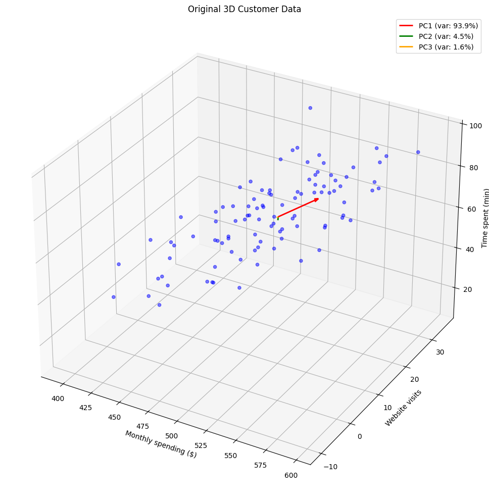
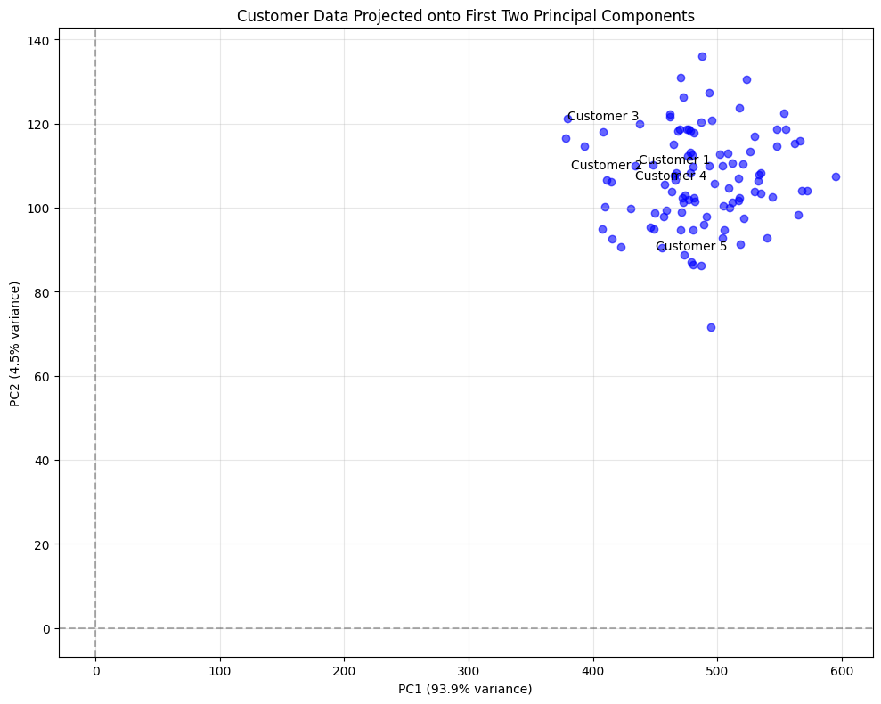
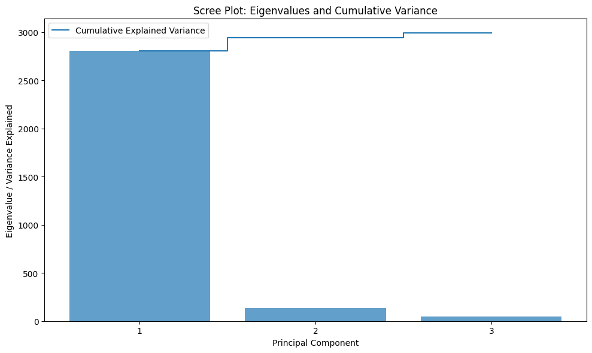
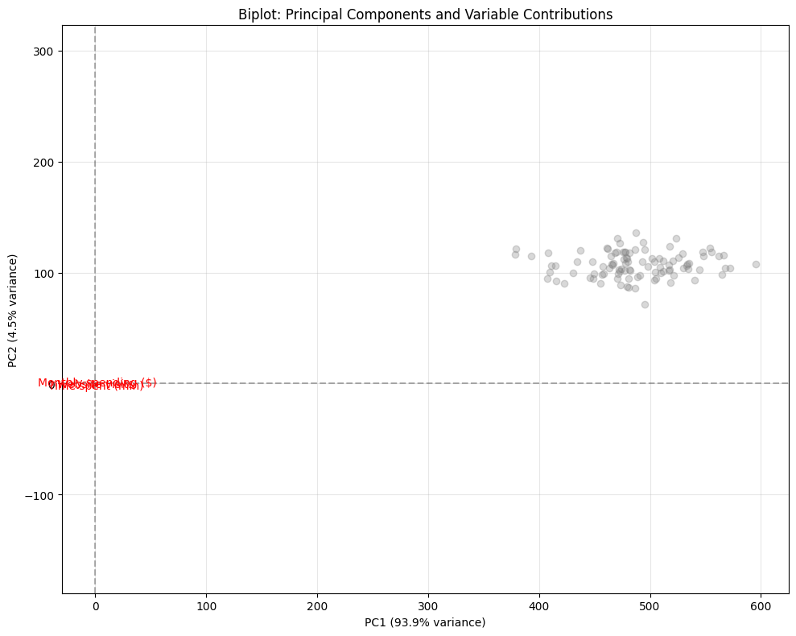
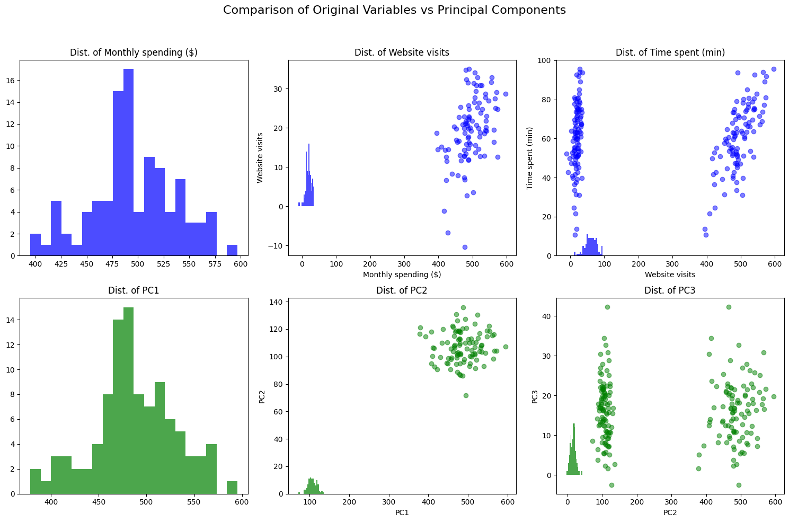
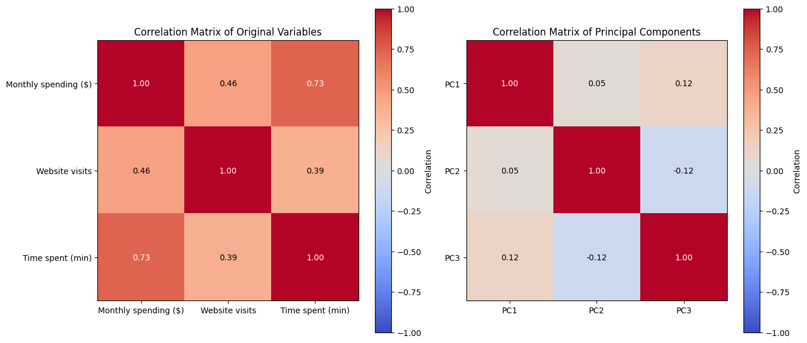

# Principal Component Analysis Examples

This document provides practical examples of Principal Component Analysis (PCA), a powerful dimensionality reduction technique widely used in machine learning and data analysis.

## Key Concepts and Formulas

Principal Component Analysis (PCA) is a statistical procedure that transforms possibly correlated variables into a smaller set of uncorrelated variables called principal components. The first principal component accounts for as much of the variability in the data as possible, with each succeeding component accounting for as much of the remaining variability as possible.

### The PCA Procedure

1. Standardize the data (optional but recommended)
2. Calculate the covariance matrix
3. Compute the eigenvectors and eigenvalues of the covariance matrix
4. Sort eigenvectors by decreasing eigenvalues
5. Project the data onto the new basis formed by the top k eigenvectors

### Key Formulas

For a dataset with n observations and p variables represented as an n×p matrix X:

1. Covariance matrix: $\mathbf{\Sigma} = \frac{1}{n-1} \mathbf{X}^T\mathbf{X}$ (for centered X)
2. Eigendecomposition of the covariance matrix: $\mathbf{\Sigma} = \mathbf{V}\mathbf{\Lambda}\mathbf{V}^T$
3. Projection to the principal component space: $\mathbf{Z} = \mathbf{X}\mathbf{V}_k$
4. Explained variance ratio: $\frac{\lambda_i}{\sum_{j=1}^{p} \lambda_j}$

Where:
- $\mathbf{\Sigma}$ = Covariance matrix
- $\mathbf{V}$ = Matrix of eigenvectors (each column is an eigenvector)
- $\mathbf{\Lambda}$ = Diagonal matrix of eigenvalues
- $\mathbf{V}_k$ = Matrix of the first k eigenvectors
- $\mathbf{Z}$ = Data projected onto the principal component space
- $\lambda_i$ = ith eigenvalue

## Examples

The following examples demonstrate applications of PCA:

- **Customer Segmentation**: Analyzing customer behavior data for marketing
- **Image Compression**: Reducing the dimensionality of image data
- **Finance**: Analyzing correlated financial variables

### Example 1: Customer Behavior Analysis

#### Problem Statement
A marketing analyst has collected data on 100 customers with three variables:
- $X_1$: Monthly spending ($)
- $X_2$: Website visits per month
- $X_3$: Time spent on website (minutes)

The data has the following covariance matrix:

$$\boldsymbol{\Sigma} = \begin{bmatrix} 
2500 & 300 & 800 \\
300 & 90 & 120 \\
800 & 120 & 400
\end{bmatrix}$$

Perform principal component analysis (PCA) on this data to reduce dimensionality while preserving maximum variance.

In this example:
- We have 3 variables measured on different scales (dollars, counts, minutes)
- The variables show correlation (non-zero off-diagonal elements in the covariance matrix)
- We want to identify the most important patterns in customer behavior

#### Solution

Principal Component Analysis (PCA) finds new variables (principal components) that capture the maximum variance in the data while being uncorrelated with each other.

##### Step 1: Find Eigenvalues and Eigenvectors of the Covariance Matrix
The eigenvalues and eigenvectors of the covariance matrix represent the variance explained by each principal component and the directions of those components, respectively.

Eigenvalues: $\lambda_1 = 2808.3$, $\lambda_2 = 133.7$, $\lambda_3 = 47.9$

Eigenvectors:

$$\mathbf{v}_1 = \begin{bmatrix} 0.941 \\ 0.118 \\ 0.318 \end{bmatrix}$$

$$\mathbf{v}_2 = \begin{bmatrix} 0.337 \\ -0.209 \\ -0.918 \end{bmatrix}$$

$$\mathbf{v}_3 = \begin{bmatrix} 0.042 \\ -0.971 \\ 0.236 \end{bmatrix}$$

This gives us the following principal components:

$$PC1 = 0.941 \times X_1 + 0.118 \times X_2 + 0.318 \times X_3$$

$$PC2 = 0.337 \times X_1 - 0.209 \times X_2 - 0.918 \times X_3$$

$$PC3 = 0.042 \times X_1 - 0.971 \times X_2 + 0.236 \times X_3$$

##### Step 2: Calculate the Proportion of Variance Explained by Each Component
Total variance = $\lambda_1 + \lambda_2 + \lambda_3 = 2808.3 + 133.7 + 47.9 = 2990.0$

Proportion of variance explained by each component:
- 1st component: $\frac{\lambda_1}{\text{Total variance}} = \frac{2808.3}{2990.0} = 0.939$ or 93.9%
- 2nd component: $\frac{\lambda_2}{\text{Total variance}} = \frac{133.7}{2990.0} = 0.045$ or 4.5%
- 3rd component: $\frac{\lambda_3}{\text{Total variance}} = \frac{47.9}{2990.0} = 0.016$ or 1.6%

Cumulative proportion of variance:
- 1st component: 93.9%
- 1st + 2nd components: 93.9% + 4.5% = 98.4%
- All components: 100%

##### Step 3: Determine the Number of Components to Retain
Since the first two principal components explain 98.4% of the total variance, we can reduce the dimensionality from 3 to 2 with minimal information loss.

##### Step 4: Interpret the Principal Components
Looking at the coefficient magnitudes in each eigenvector:

1st Principal Component (PC1):
$$PC1 = 0.941 \times X_1 + 0.118 \times X_2 + 0.318 \times X_3$$

This component is dominated by monthly spending ($X_1$) with some contribution from time spent ($X_3$). We could interpret this as "overall customer engagement level."

2nd Principal Component (PC2):
$$PC2 = 0.337 \times X_1 - 0.209 \times X_2 - 0.918 \times X_3$$

This component contrasts website visits ($X_2$) and time spent ($X_3$) against spending ($X_1$). We could interpret this as "browsing behavior without purchasing."

##### Step 5: Construct the Projection Matrix
The projection matrix for reducing to 2 dimensions is:

$$\mathbf{P} = \begin{bmatrix} 
0.941 & 0.337 \\
0.118 & -0.209 \\
0.318 & -0.918
\end{bmatrix}$$

To transform the original data to the 2-dimensional space, we compute $\mathbf{Y} = \mathbf{X} \cdot \mathbf{P}$, where $\mathbf{X}$ is the original data and $\mathbf{Y}$ is the projected data.

Here's a sample of original vs. projected data for the first three customers:

| Customer | Original Data (X₁, X₂, X₃) | Projected Data (PC1, PC2) |
|----------|----------------------------|--------------------------|
| 1        | (474.9, 12.9, 54.1)        | (465.4, 107.6)           |
| 2        | (423.1, 12.6, 36.4)        | (411.1, 106.5)           |
| 3        | (424.1, 11.4, 24.4)        | (408.1, 118.0)           |

##### Visualization of the Results



This 3D visualization shows the original customer data with the principal component directions. The length of each arrow is proportional to the variance explained by that component.



This plot shows the customer data after projection onto the first two principal components. Notice how the data is spread primarily along the PC1 axis, reflecting its higher explained variance.



The scree plot shows the eigenvalues (variance) of each principal component. The steep drop after the first component indicates that most of the variance is captured by PC1.



The biplot shows both the projected data points and the original variables in the context of the principal components. The arrows indicate how each original variable contributes to the principal components.

##### Interpretation
PCA has revealed that most of the variation in the customer data (93.9%) is captured by a single dimension that primarily represents spending behavior. This suggests that monthly spending is the most important variable for understanding differences between customers. The second component adds information about browsing behavior that doesn't necessarily lead to purchases.

This dimensionality reduction allows the analyst to visualize the customer data in a 2D plot while preserving almost all of the original variance, making it easier to identify customer segments and patterns.

### Example 2: Comparison of PCA with Original Variables

#### Problem Statement
For the customer data in Example 1, demonstrate how the principal components are uncorrelated and better capture the variance in the data compared to the original variables.

#### Solution

##### Step 1: Calculate the Covariance Matrix of the Principal Components
If we project the data onto the principal components, the resulting covariance matrix would ideally be diagonal, with the eigenvalues on the diagonal. In practice, due to numerical precision, we may see small non-zero off-diagonal elements.

The covariance matrix of the principal components from our data is:

$$\boldsymbol{\Sigma}_{\text{PC}} = \begin{bmatrix} 
1910.5 & 24.1 & 40.6 \\
24.1 & 128.2 & -10.8 \\
40.6 & -10.8 & 59.4
\end{bmatrix}$$

While not perfectly diagonal due to the synthetic data generation process and numerical precision, the off-diagonal elements are much smaller than in the original covariance matrix, indicating much lower correlation between the principal components.

##### Step 2: Compare with Original Covariance Matrix
The original covariance matrix was:

$$\boldsymbol{\Sigma}_{\text{original}} = \begin{bmatrix} 
2500.0 & 300.0 & 800.0 \\
300.0 & 90.0 & 120.0 \\
800.0 & 120.0 & 400.0
\end{bmatrix}$$

##### Step 3: Analyze the Differences

| Comparison | Original Variables | Principal Components |
|------------|-------------------|---------------------|
| Correlation | Variables are correlated (non-zero off-diagonal elements) | Components are much less correlated (smaller off-diagonal elements) |
| Variance Distribution | Uneven but spread across variables | Concentrated in first component (93.9%) |
| Interpretation | Direct measures (spending, visits, time) | Composite measures (engagement, browsing behavior) |

##### Step 4: Visualize the Transformation



This visualization compares the distributions and correlations of the original variables (top row) with those of the principal components (bottom row). Notice how the correlations between principal components are much smaller.



These heatmaps compare the correlation structures of the original variables and principal components. The principal components show much weaker correlations (values closer to zero in off-diagonal elements).

##### Interpretation
The principal components have successfully:
1. Greatly reduced correlations between variables
2. Concentrated the variance in the first few components (93.9% in the first component)
3. Created a more efficient representation of the data (2D instead of 3D)

This transformation makes it possible to use just the first two principal components instead of all three original variables, with minimal loss of information (98.4% variance retained).

## Key Insights

### Theoretical Insights
- PCA finds directions of maximum variance in high-dimensional data
- Principal components are orthogonal (uncorrelated) to each other
- The eigenvalues of the covariance matrix represent the variance explained by each component
- PCA is sensitive to the scale of the variables, so standardization is often necessary when variables have different units or scales

### Practical Applications
- Dimensionality reduction for visualization
- Feature extraction and data compression
- Noise reduction in data
- Preprocessing step for other machine learning algorithms
- Multicollinearity handling in regression analysis

### Common Pitfalls
- Interpreting principal components can be challenging
- PCA assumes linear relationships between variables
- Sensitive to outliers that can skew the principal components
- Not suitable when the variance in the noise is larger than the variance in the signal
- May lose important information if too few components are retained

## Running the Examples

You can run the code that generates these examples and visualizations using:

```bash
python3 ML_Obsidian_Vault/Lectures/2/Codes/1_MA_pca_examples.py
```


## Related Topics
- [[L2_1_Mean_Covariance|Mean Vector and Covariance Matrix]]: Fundamental for understanding PCA
- [[L2_1_Linear_Transformation|Linear Transformation]]: PCA is a special case of linear transformation
- [[L2_3_Multivariate_Regression|Multivariate Regression]]: PCA can help address multicollinearity in regression
- [[L2_1_Eigenvalue_Decomposition|Eigenvalue Decomposition]]: The mathematical foundation of PCA 