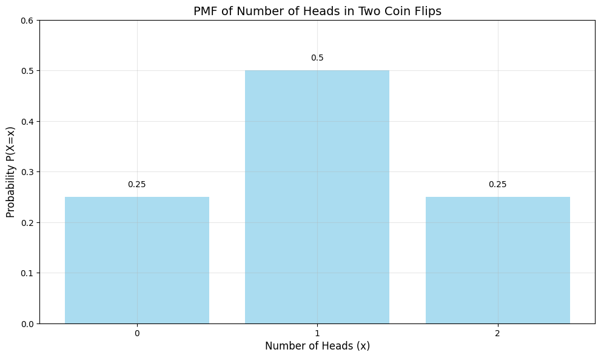

# PMF, PDF, and CDF Examples

This document provides practical examples of probability mass functions (PMF), probability density functions (PDF), and cumulative distribution functions (CDF), illustrating these fundamental concepts in probability theory and their significance in data analysis.

## Key Concepts and Formulas

### Probability Mass Function (PMF)
For a discrete random variable $X$, the PMF $p_X(x)$ gives the probability that $X$ takes the value $x$:
$$p_X(x) = P(X = x)$$

Properties:
- $0 \leq p_X(x) \leq 1$ for all $x$
- $\sum_x p_X(x) = 1$

### Probability Density Function (PDF)
For a continuous random variable $X$, the PDF $f_X(x)$ describes the relative likelihood of $X$ taking a particular value:
$$P(a \leq X \leq b) = \int_a^b f_X(x) dx$$

Properties:
- $f_X(x) \geq 0$ for all $x$
- $\int_{-\infty}^{\infty} f_X(x) dx = 1$

### Cumulative Distribution Function (CDF)
For any random variable $X$, the CDF $F_X(x)$ gives the probability that $X$ takes a value less than or equal to $x$:
$$F_X(x) = P(X \leq x)$$

For discrete variables:
$$F_X(x) = \sum_{k \leq x} p_X(k)$$

For continuous variables:
$$F_X(x) = \int_{-\infty}^x f_X(t) dt$$

Properties:
- $0 \leq F_X(x) \leq 1$ for all $x$
- $F_X(x)$ is non-decreasing
- $\lim_{x \to -\infty} F_X(x) = 0$
- $\lim_{x \to \infty} F_X(x) = 1$

## Examples

### Example 1: Discrete PMF and CDF (Number of Heads in Two Coin Flips)

#### Problem Statement
Consider flipping a fair coin twice. Let $X$ be the number of heads obtained.

In this example:
- $X$ is a discrete random variable
- Possible values: $\{0, 1, 2\}$
- We want to find the PMF and CDF of $X$

#### Solution

##### Step 1: Find the PMF
First, list all possible outcomes and their probabilities:
- TT (0 heads): probability = 0.25
- HT or TH (1 head): probability = 0.5
- HH (2 heads): probability = 0.25

Therefore, the PMF is:
$$p_X(x) = \begin{cases}
0.25 & \text{if } x = 0 \\
0.5 & \text{if } x = 1 \\
0.25 & \text{if } x = 2 \\
0 & \text{otherwise}
\end{cases}$$

##### Step 2: Find the CDF
The CDF is the cumulative sum of the PMF:
$$F_X(x) = \begin{cases}
0 & \text{if } x < 0 \\
0.25 & \text{if } 0 \leq x < 1 \\
0.75 & \text{if } 1 \leq x < 2 \\
1 & \text{if } x \geq 2
\end{cases}$$




### Example 2: Continuous PDF and CDF (Uniform Distribution)

#### Problem Statement
Consider a random variable $X$ that is uniformly distributed between 0 and 1.

In this example:
- $X$ is a continuous random variable
- Range: $[0, 1]$
- We want to find the PDF and CDF of $X$

#### Solution

##### Step 1: Find the PDF
For a uniform distribution on $[0, 1]$, the PDF is constant:
$$f_X(x) = \begin{cases}
1 & \text{if } 0 \leq x \leq 1 \\
0 & \text{otherwise}
\end{cases}$$

##### Step 2: Find the CDF
The CDF is the integral of the PDF:
$$F_X(x) = \begin{cases}
0 & \text{if } x < 0 \\
x & \text{if } 0 \leq x \leq 1 \\
1 & \text{if } x > 1
\end{cases}$$


### Example 3: Mixed Distribution (Combining Discrete and Continuous)

#### Problem Statement
Consider a random variable $X$ that is:
- 0 with probability 0.5
- Uniformly distributed between 0 and 1 with probability 0.5

In this example:
- $X$ has both discrete and continuous components
- We want to find the PDF, PMF, and CDF of $X$

#### Solution

##### Step 1: Find the PMF
The discrete part of $X$ has a point mass at 0:
$$p_X(0) = 0.5$$

##### Step 2: Find the PDF
The continuous part of $X$ has a uniform density:
$$f_X(x) = \begin{cases}
0.5 & \text{if } 0 < x \leq 1 \\
0 & \text{otherwise}
\end{cases}$$

##### Step 3: Find the CDF
The CDF combines both components:
$$F_X(x) = \begin{cases}
0 & \text{if } x < 0 \\
0.5 + 0.5x & \text{if } 0 \leq x \leq 1 \\
1 & \text{if } x > 1
\end{cases}$$


## Key Insights

### Theoretical Insights
- PMFs are used for discrete random variables, while PDFs are used for continuous random variables
- The CDF is a universal concept that works for both discrete and continuous random variables
- The CDF is always right-continuous
- The PDF is the derivative of the CDF for continuous random variables
- The PMF can be obtained from the CDF by taking differences at jump points

### Practical Applications
- PMFs are useful for modeling discrete outcomes (e.g., counts, categories)
- PDFs are essential for continuous measurements (e.g., time, distance)
- CDFs are particularly useful for calculating probabilities of intervals
- The CDF is fundamental in statistical hypothesis testing
- PDFs and PMFs are crucial for likelihood calculations in statistical inference

### Common Pitfalls
- Confusing PMF with PDF (discrete vs continuous)
- Forgetting that PDF values are not probabilities
- Not properly handling mixed distributions
- Ignoring the right-continuity of CDFs
- Misapplying the relationship between PDF and CDF for discrete variables

## Running the Examples

You can run the code that generates these examples and visualizations using:

```bash
python3 ML_Obsidian_Vault/Lectures/2/Codes/1_pmf_pdf_cdf_examples.py
```

## Related Topics

- [[L2_1_Basic_Probability|Basic Probability]]: Understanding the fundamental concepts of probability
- [[L2_1_Expectation|Expectation]]: Calculating expected values using PMFs and PDFs
- [[L2_1_Variance|Variance]]: Computing variance using probability distributions
- [[L2_1_Probability_Distributions|Probability Distributions]]: Common probability distributions and their properties 