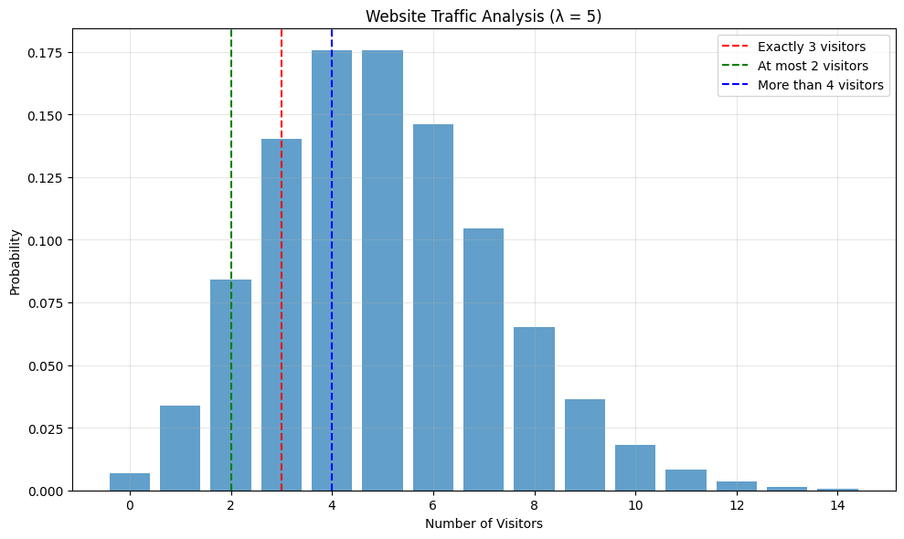
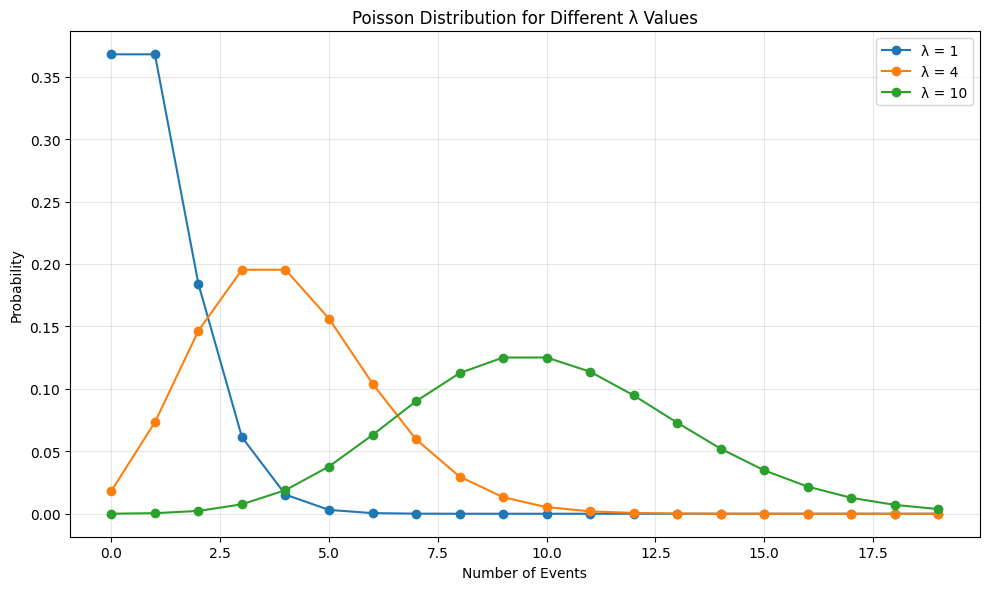

# Poisson Distribution Examples

This document provides practical examples of the Poisson distribution, which is commonly used to model count data in machine learning and statistics. The Poisson distribution is particularly useful for modeling rare events that occur independently at a constant average rate.

## Key Concepts and Formulas

The Poisson distribution is a discrete probability distribution that models the number of events occurring in a fixed interval of time or space, given a constant average rate of occurrence.

### The Poisson Distribution Formula

$$P(X = k) = \frac{\lambda^k e^{-\lambda}}{k!}$$

Where:
- $k$ = number of occurrences (k = 0, 1, 2, ...)
- $\lambda$ = average rate of occurrence
- $e$ = Euler's number (approximately 2.71828)

### Properties
- **Mean**: $E[X] = \lambda$
- **Variance**: $\text{Var}(X) = \lambda$
- **Skewness**: $\frac{1}{\sqrt{\lambda}}$
- **Kurtosis**: $\frac{1}{\lambda}$

### Important Formulas
- **Probability Mass Function (PMF)**: $P(X = k) = \frac{\lambda^k e^{-\lambda}}{k!}$
- **Cumulative Distribution Function (CDF)**: $P(X \leq k) = \sum_{i=0}^k \frac{\lambda^i e^{-\lambda}}{i!}$
- **Complementary CDF**: $P(X > k) = 1 - P(X \leq k)$
- **Range Probability**: $P(a \leq X \leq b) = P(X \leq b) - P(X \leq a-1)$

## Examples

The following examples demonstrate the Poisson distribution:

- **Website Traffic**: Modeling visitor arrivals
- **Call Center**: Analyzing call volumes
- **Quality Control**: Monitoring defect rates

### Example 1: Website Traffic Analysis

#### Problem Statement
A website receives an average of 5 visitors per minute. What is the probability of:
1. Exactly 3 visitors in a minute?
2. At most 2 visitors in a minute?
3. More than 4 visitors in a minute?

#### Solution

##### Step 1: Identify Parameters
- $\lambda = 5$ (average visitors per minute)
- $k$ varies based on the question

##### Step 2: Calculate Individual Probabilities
Using the Poisson PMF formula:

1. $P(X = 3) = \frac{5^3 e^{-5}}{3!} = 0.1404$
   - This means there's a 14.04% chance of exactly 3 visitors in a minute

2. $P(X \leq 2) = P(X=0) + P(X=1) + P(X=2) = 0.1247$
   - This means there's a 12.47% chance of 2 or fewer visitors in a minute

3. $P(X > 4) = 1 - P(X \leq 4) = 0.5595$
   - This means there's a 55.95% chance of more than 4 visitors in a minute

##### Step 3: Interpretation
The results show that:
- The most likely scenario is having more than 4 visitors per minute
- The probability of having exactly 3 visitors is moderate
- The probability of having 2 or fewer visitors is relatively low



### Example 2: Customer Service Calls

#### Problem Statement
A call center receives an average of 10 calls per hour. What is the probability of:
1. Receiving exactly 8 calls in an hour?
2. Receiving between 7 and 12 calls (inclusive) in an hour?
3. Receiving at least 15 calls in an hour?

#### Solution

##### Step 1: Identify Parameters
- $\lambda = 10$ (average calls per hour)
- $k$ varies based on the question

##### Step 2: Calculate Probabilities
1. $P(X = 8) = \frac{10^8 e^{-10}}{8!} = 0.1126$
   - There's an 11.26% chance of exactly 8 calls in an hour

2. $P(7 \leq X \leq 12) = \sum_{k=7}^{12} P(X=k) = 0.6614$
   - There's a 66.14% chance of receiving between 7 and 12 calls

3. $P(X \geq 15) = 1 - P(X \leq 14) = 0.0835$
   - There's an 8.35% chance of receiving 15 or more calls

##### Step 3: Interpretation
The results indicate that:
- The most likely scenario is receiving between 7 and 12 calls
- The probability of exactly 8 calls is moderate
- The probability of receiving 15 or more calls is relatively low


### Example 3: Defective Products

#### Problem Statement
A manufacturing process produces an average of 2 defective items per 1000 units. In a batch of 5000 units:
1. What is the probability of finding exactly 8 defective items?
2. What is the probability of finding at most 5 defective items?
3. What is the probability of finding more than 12 defective items?

#### Solution

##### Step 1: Identify Parameters
- $\lambda = 2 \times 5 = 10$ (average defects per 5000 units)
- $k$ varies based on the question

##### Step 2: Calculate Probabilities
1. $P(X = 8) = \frac{10^8 e^{-10}}{8!} = 0.1126$
   - There's an 11.26% chance of finding exactly 8 defects

2. $P(X \leq 5) = \sum_{k=0}^{5} P(X=k) = 0.0671$
   - There's a 6.71% chance of finding 5 or fewer defects

3. $P(X > 12) = 1 - P(X \leq 12) = 0.2084$
   - There's a 20.84% chance of finding more than 12 defects

##### Step 3: Interpretation
The results show that:
- The probability of finding exactly 8 defects is moderate
- The probability of finding 5 or fewer defects is quite low
- There's a significant chance (20.84%) of finding more than 12 defects


## Comparison of Poisson Distributions

To better understand how different λ values affect the distribution, let's compare the distributions and probabilities across all examples:

### Distribution Comparison
The following visualization shows how the shape of the Poisson distribution changes with different λ values:



### Probability Comparison
The following visualization compares the probabilities of different events across all examples:


## Key Insights

### Theoretical Insights
1. The Poisson distribution is particularly useful for modeling rare events
2. As $\lambda$ increases, the distribution becomes more symmetric and approaches a normal distribution
3. The mean and variance are equal in a Poisson distribution
4. The distribution is memoryless, meaning the probability of an event occurring in the next interval is independent of when the last event occurred

### Practical Applications
1. The Poisson distribution is widely used in:
   - Queueing theory (customer arrivals)
   - Reliability engineering (failure rates)
   - Biology (mutation rates)
   - Finance (default rates)
   - Telecommunications (call arrivals)

### Common Pitfalls
1. Assuming independence when events are actually dependent
2. Using Poisson when the rate is not constant
3. Applying Poisson to non-count data
4. Ignoring the rare event assumption

## Running the Examples

You can run the code that generates these examples and visualizations using:
```bash
python3 ML_Obsidian_Vault/Lectures/2/Codes/1_poisson_examples.py
```

## Related Topics

- [[L2_1_Discrete_Distributions|Discrete Distributions]]: Understanding other discrete probability distributions
- [[L2_1_Expectation|Expectation]]: Calculating expected values for Poisson random variables
- [[L2_1_Variance|Variance]]: Understanding variance in Poisson distributions
- [[L2_1_Probability_vs_Likelihood|Probability vs Likelihood]]: Understanding the difference in the context of Poisson models
- [[L2_1_Statistical_Estimation|Statistical Estimation]]: Estimating Poisson parameters from data 