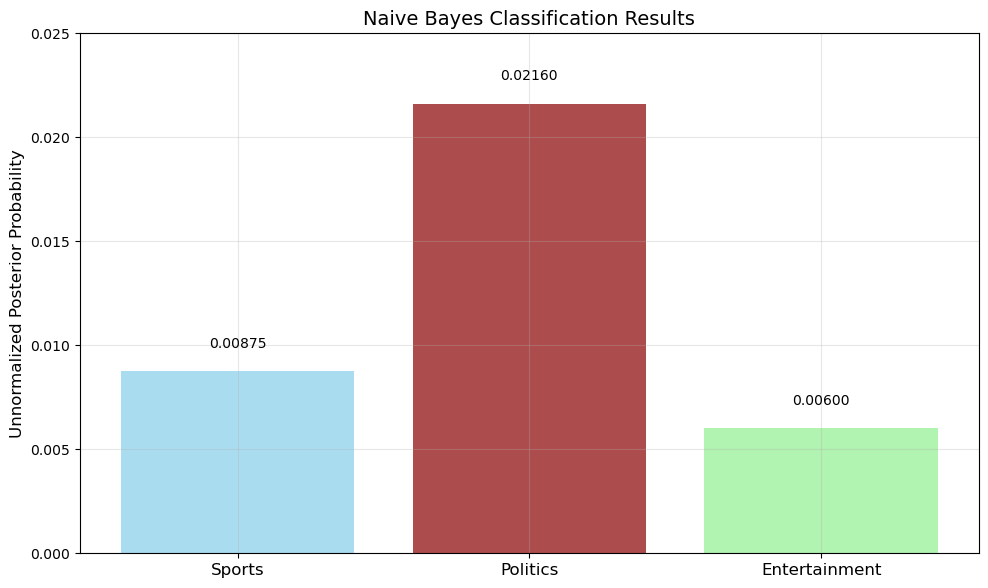
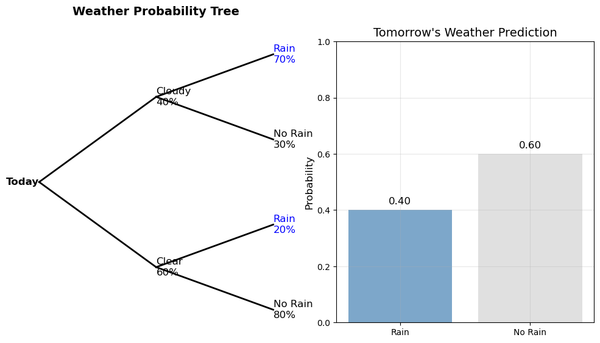
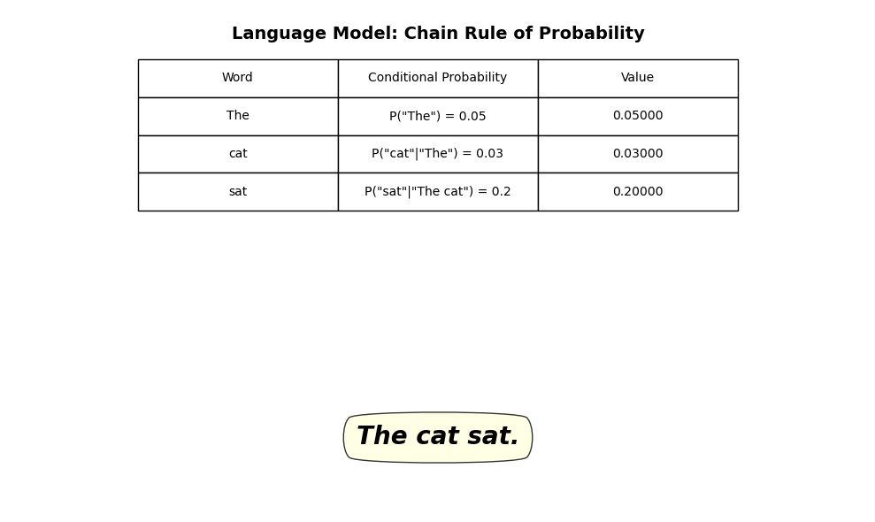
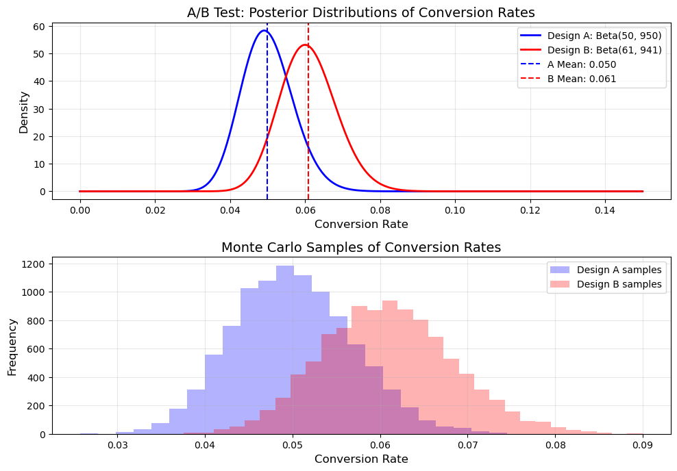

# Probability Application Examples

This document provides real-world application examples of probability in machine learning contexts, showcasing how probability theory is used to solve practical problems.

## Key Concepts and Formulas

Probability theory forms the foundation of many machine learning algorithms and techniques. These examples demonstrate different applications of probability concepts.

### Key Applications

- **Classification**: Using probability for categorizing data
- **Decision Making**: Probabilistic approaches to decision problems
- **Inference**: Drawing conclusions from data using probability

## Example 1: Naive Bayes Text Classification

### Problem Statement
A simple text classifier uses the Naive Bayes approach to categorize news articles as either sports (S), politics (P), or entertainment (E). The training data shows:
- 25% of articles are about sports, 45% about politics, and 30% about entertainment
- The word "election" appears in 5% of sports articles, 60% of politics articles, and 10% of entertainment articles
- The word "game" appears in 70% of sports articles, 8% of politics articles, and 20% of entertainment articles

If a new article contains both "election" and "game", how would you classify it?

### Solution

#### Step 1: Define the problem using Bayes' theorem
For each category C, we need to compute the posterior probability P(C|words) given the words "election" and "game". Using Bayes' theorem:

$$P(C|words) = \frac{P(words|C) \times P(C)}{P(words)}$$

Since we only care about which category has the highest probability (not the exact value), we can compute proportional values:

$$P(C|words) \propto P(words|C) \times P(C)$$

#### Step 2: Apply the naive independence assumption
The naive assumption in Naive Bayes is that features (words) are conditionally independent given the class. This means:

$$P(words|C) = P(election|C) \times P(game|C)$$

#### Step 3: Compute posterior probabilities for each class

For sports (S):
$$P(S|election, game) \propto P(election|S) \times P(game|S) \times P(S)$$
$$P(S|election, game) \propto 0.05 \times 0.70 \times 0.25 = 0.00875$$

For politics (P):
$$P(P|election, game) \propto P(election|P) \times P(game|P) \times P(P)$$
$$P(P|election, game) \propto 0.60 \times 0.08 \times 0.45 = 0.0216$$

For entertainment (E):
$$P(E|election, game) \propto P(election|E) \times P(game|E) \times P(E)$$
$$P(E|election, game) \propto 0.10 \times 0.20 \times 0.30 = 0.006$$

After normalization (optional):
$$P(S|election, game) = 0.24072$$
$$P(P|election, game) = 0.59422$$
$$P(E|election, game) = 0.16506$$

#### Step 4: Choose the class with highest probability
Since politics has the highest posterior probability (0.0216 or 59.42% after normalization), the article would be classified as politics.



The chart above shows the unnormalized posterior probabilities for each category. Politics (shown in dark red) has the highest value at 0.0216, followed by Sports at 0.00875 and Entertainment at 0.006. The formula used is: P(C|words) ∝ P(words|C) × P(C) = P(election|C) × P(game|C) × P(C).

## Example 2: Weather Prediction with Total Probability

### Problem Statement
Weather forecasting uses conditional probabilities to predict future conditions. Given:
- The probability of rain tomorrow given cloudy conditions today is 0.70
- The probability of rain tomorrow given clear conditions today is 0.20
- The probability of cloudy conditions today is 0.40

What is the probability of rain tomorrow?

### Solution

#### Step 1: Define events and given probabilities
Let's define our events:
- R: Rain tomorrow
- C: Cloudy today
- C': Clear today

Given information:
- P(R|C) = 0.70 (probability of rain given clouds)
- P(R|C') = 0.20 (probability of rain given clear skies)
- P(C) = 0.40 (probability of cloudy conditions)
- P(C') = 0.60 (probability of clear conditions)

#### Step 2: Apply the law of total probability
We want to find P(R) using the law of total probability:

$$P(R) = P(R|C) \times P(C) + P(R|C') \times P(C')$$

#### Step 3: Calculate the result
Substituting the values:

$$P(R) = 0.70 \times 0.40 + 0.20 \times 0.60 = 0.28 + 0.12 = 0.40$$

Therefore, the probability of rain tomorrow is 40%, regardless of our knowledge of today's conditions.



The left diagram shows a probability tree for weather prediction. Starting with today's conditions (40% chance of cloudy, 60% chance of clear), it branches to show tomorrow's weather. If today is cloudy, there's a 70% chance of rain tomorrow (0.4 × 0.7 = 0.28). If today is clear, there's a 20% chance of rain (0.6 × 0.2 = 0.12). The right chart shows the overall probability of rain tomorrow (0.28 + 0.12 = 0.40 or 40%).

## Example 3: Natural Language Processing with Chain Rule

### Problem Statement
A language model estimates the probability of a sentence by applying the chain rule of probability. For the sentence "The cat sat", the model calculates:
- P("The") = 0.05
- P("cat"|"The") = 0.03
- P("sat"|"The cat") = 0.2

What is the joint probability P("The cat sat")?

### Solution

#### Step 1: Apply the chain rule of probability
The chain rule allows us to decompose a joint probability into a product of conditional probabilities:

$$P(A, B, C) = P(A) \times P(B|A) \times P(C|A,B)$$

#### Step 2: Calculate the joint probability
For our sentence:

$$P(\text{"The cat sat"}) = P(\text{"The"}) \times P(\text{"cat"}|\text{"The"}) \times P(\text{"sat"}|\text{"The cat"})$$
$$P(\text{"The cat sat"}) = 0.05 \times 0.03 \times 0.2 = 0.0003 = 3 \times 10^{-4}$$

Therefore, the joint probability of the sentence "The cat sat" is 0.0003. This demonstrates how language models break down complex joint probabilities into conditional probabilities that are easier to estimate.



The table shows the probability calculation for each word in the sentence "The cat sat". P("The") = 0.05, P("cat"|"The") = 0.03, and P("sat"|"The cat") = 0.2. Multiplying these values gives the joint probability: P("The cat sat") = 0.05 × 0.03 × 0.2 = 0.0003 or 3.0 × 10^-4.

## Example 4: A/B Testing with Bayesian Statistics

### Problem Statement
A technology company is running an A/B test for a new website design. The current design (A) has a conversion rate of around 5%. The new design (B) has been shown to 1000 users, with 60 conversions. Does the new design perform better than the old one?

### Solution

#### Step 1: Define a probabilistic model
We'll use a Bayesian approach to determine if design B is better than design A.

Let's define:
- $p_A$ = conversion rate for design A
- $p_B$ = conversion rate for design B
- We want to estimate P($p_B > p_A$ | data)

#### Step 2: Specify the prior distributions
For design A, we'll use a Beta distribution based on prior knowledge:
- Prior for $p_A$ ~ Beta(50, 950), representing a prior belief centered at 5% based on historical data

For design B, with no prior knowledge:
- Prior for $p_B$ ~ Beta(1, 1), representing a uniform prior

#### Step 3: Update with observed data
For design B, we observed 60 conversions out of 1000 users.
- Posterior for $p_B$ ~ Beta(1+60, 1+940) = Beta(61, 941)
- Posterior mean is 61/(61+941) = 0.06088 or about 6.09%

#### Step 4: Compute the probability that B is better than A
To compute P($p_B > p_A$ | data), we need to sample from both posterior distributions and count the proportion of samples where $p_B > p_A$.

Using Monte Carlo simulation with 10,000 samples:
- Sample $p_A$ from Beta(50, 950)
- Sample $p_B$ from Beta(61, 941)
- Count proportion where $p_B > p_A$

The result is approximately 0.859 or 85.9%, suggesting a 85.9% probability that the new design is better than the old one.



The top graph shows the posterior distributions of conversion rates for both designs. Design A (blue curve) has a posterior distribution of Beta(50, 950) with a mean of 0.050. Design B (red curve) has a posterior distribution of Beta(61, 941) with a mean of 0.061. The bottom histogram shows Monte Carlo samples from both distributions. Based on these samples, there's an 85.9% probability that Design B has a higher conversion rate than Design A.

## Key Insights

### Theoretical Insights
- Probability theory provides a framework for reasoning under uncertainty
- Bayesian methods allow for updating beliefs with new evidence
- Probability models capture the inherent randomness in real-world systems

### Practical Applications
- Naive Bayes classifiers are simple yet effective for text categorization
- The law of total probability helps combine information from different sources
- Chain rule enables calculating complex joint probabilities in sequence models
- Bayesian statistics offers a principled approach to A/B testing

### Common Pitfalls
- Naive Bayes assumes conditional independence, which may not always hold
- Ignoring class imbalance can lead to biased classification
- Using point estimates instead of full distributions can hide uncertainty
- Not accounting for prior knowledge in statistical analyses

## Running the Examples

You can run the code that generates these examples and visualizations using:

```bash
python ML_Obsidian_Vault/Lectures/2/Codes/1_probability_application_examples.py
```

## Related Topics

- [[L2_1_Basic_Probability|Basic Probability]]: Theoretical foundations of probability theory
- [[L2_1_Discrete_Probability_Examples|Discrete Probability Examples]]: Examples with discrete random variables
- [[L2_1_Continuous_Probability_Examples|Continuous Probability Examples]]: Examples with continuous random variables
- [[L2_1_Conditional_Probability_Examples|Conditional Probability Examples]]: Examples with conditional probabilities
- [[L2_5_Bayesian_Inference|Bayesian_Inference]]: Using probability for updating beliefs 