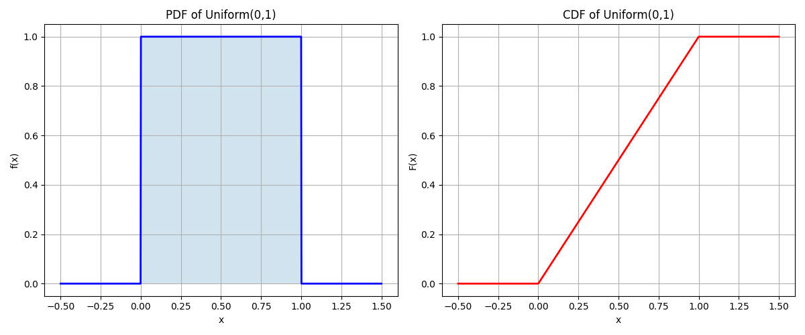
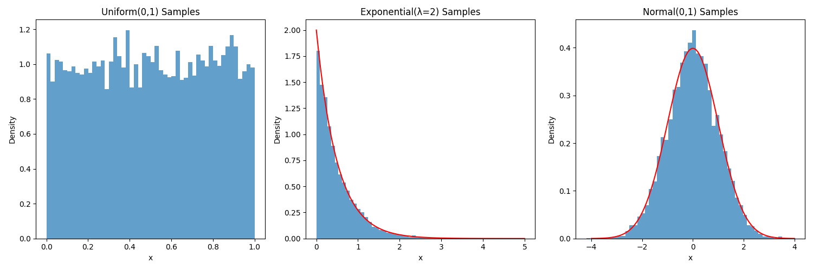

# Uniform Distribution Examples

This document provides practical examples of the Uniform distribution, illustrating its properties and applications in machine learning and data analysis.

## Key Concepts and Formulas

The Uniform distribution is a continuous probability distribution where all outcomes in a given interval are equally likely. It's characterized by its constant probability density function over a specified range.

### The Uniform Distribution Formula

For a uniform distribution over interval [a,b]:

**Probability Density Function (PDF)**:
$$f(x; a, b) = \begin{cases}
\frac{1}{b-a} & \text{for } x \in [a,b] \\
0 & \text{otherwise}
\end{cases}$$

**Cumulative Distribution Function (CDF)**:
$$F(x) = \begin{cases}
0 & \text{for } x < a \\
\frac{x-a}{b-a} & \text{for } x \in [a,b] \\
1 & \text{for } x > b
\end{cases}$$

Where:
- $a$ = lower bound of the interval
- $b$ = upper bound of the interval
- $b > a$

### Key Properties

- **Mean**: $\mu = \frac{a+b}{2}$
- **Variance**: $\sigma^2 = \frac{(b-a)^2}{12}$
- **Standard Deviation**: $\sigma = \frac{b-a}{\sqrt{12}}$
- **Support**: $[a,b]$
- **Mode**: Any value in $[a,b]$ (all values equally likely)
- **Median**: $\frac{a+b}{2}$ (same as mean)

## Examples

### Example 1: Basic Properties and Visualization

#### Problem Statement
Analyze and visualize a uniform distribution over the interval [0, 1], demonstrating its basic properties.

#### Solution

##### Step 1: Define Parameters
- Lower bound (a) = 0
- Upper bound (b) = 1

##### Step 2: Calculate the PDF
For x ∈ [0,1]:
$$f(x) = \frac{1}{1-0} = 1$$

This means the probability density is constant at 1 over the interval [0,1].

##### Step 3: Calculate the CDF
For x ∈ [0,1]:
$$F(x) = \frac{x-0}{1-0} = x$$

The CDF increases linearly from 0 to 1 over the interval.

##### Step 4: Verify Properties
- Area under the PDF curve = 1.00 (verified numerically)
- PDF is constant at 1.0 over [0,1]
- CDF increases linearly from 0 to 1



### Example 2: Probability Calculations

#### Problem Statement
For a uniform distribution over [2, 5], calculate various probabilities.

#### Solution

##### Step 1: Define Parameters
- Lower bound (a) = 2
- Upper bound (b) = 5
- PDF height = 1/(5-2) = 1/3

##### Step 2: Calculate P(X ≤ 3)
Using the CDF:
$$P(X \leq 3) = F(3) = \frac{3-2}{5-2} = \frac{1}{3} = 0.3333$$

##### Step 3: Calculate P(2.5 ≤ X ≤ 4)
Using the difference of CDFs:
$$\begin{align*}
P(2.5 \leq X \leq 4) &= F(4) - F(2.5) \\
&= \frac{4-2}{5-2} - \frac{2.5-2}{5-2} \\
&= \frac{2}{3} - \frac{0.5}{3} \\
&= \frac{1.5}{3} = 0.5000
\end{align*}$$

##### Step 4: Calculate P(X > 4.5)
Using the complement of CDF:
$$\begin{align*}
P(X > 4.5) &= 1 - F(4.5) \\
&= 1 - \frac{4.5-2}{5-2} \\
&= 1 - \frac{2.5}{3} \\
&= \frac{0.5}{3} = 0.1667
\end{align*}$$


### Example 3: Mean and Variance

#### Problem Statement
Calculate the mean, variance, and standard deviation of a uniform distribution over [3, 7].

#### Solution

##### Step 1: Calculate the Mean
Using the formula $\mu = \frac{a+b}{2}$:
$$\mu = \frac{3+7}{2} = 5.0$$

##### Step 2: Calculate the Variance
Using the formula $\sigma^2 = \frac{(b-a)^2}{12}$:
$$\sigma^2 = \frac{(7-3)^2}{12} = \frac{16}{12} = 1.3333$$

##### Step 3: Calculate Standard Deviation
Taking the square root of the variance:
$$\sigma = \sqrt{1.3333} = 1.1547$$


### Example 4: Simple Range Probability

#### Problem Statement
Given X ~ Uniform(0,10), find P(2 ≤ X ≤ 7).

#### Solution

##### Step 1: Define Parameters
- Lower bound (a) = 0
- Upper bound (b) = 10
- Target range: [2, 7]

##### Step 2: Calculate the Probability
The probability is the ratio of the desired range length to the total range length:
$$P(2 \leq X \leq 7) = \frac{7-2}{10-0} = \frac{5}{10} = 0.50$$


### Example 5: Expected Value of a Function

#### Problem Statement
Given X ~ Uniform(0,4), calculate E[X²].

#### Solution

##### Step 1: Set up the Integral
For a function g(x) = x², the expected value is:
$$E[X^2] = \int_{0}^{4} x^2f(x)dx = \int_{0}^{4} x^2\left(\frac{1}{4}\right)dx$$

##### Step 2: Solve the Integral
$$\begin{align*}
E[X^2] &= \frac{1}{4} \int_{0}^{4} x^2dx \\
&= \frac{1}{4} \left[\frac{x^3}{3}\right]_{0}^{4}
\end{align*}$$

##### Step 3: Evaluate
$$\begin{align*}
E[X^2] &= \frac{1}{4} \left(\frac{4^3}{3} - \frac{0^3}{3}\right) \\
&= \frac{1}{4} \left(\frac{64}{3}\right) \\
&= \frac{16}{3} \approx 5.33
\end{align*}$$


### Example 6: Transformation to Other Distributions

#### Problem Statement
Demonstrate how to transform uniform random variables to generate samples from other distributions.

#### Solution

##### Step 1: Generate Uniform Samples
Generate 10,000 samples from Uniform(0,1)

##### Step 2: Transform to Exponential Distribution
To generate X ~ Exp(λ=2):
$$X = -\frac{\ln(1-U)}{2}$$
where U ~ Uniform(0,1)

##### Step 3: Transform to Normal Distribution
Using the Box-Muller transform with U₁, U₂ ~ Uniform(0,1):
$$Z_1 = \sqrt{-2\ln(U_1)}\cos(2\pi U_2)$$
$$Z_2 = \sqrt{-2\ln(U_1)}\sin(2\pi U_2)$$

This generates two independent standard normal random variables.



## Key Insights

### Theoretical Insights
- The uniform distribution has constant probability density over its support interval
- It maximizes entropy for a given bounded interval
- It's the basis for generating random numbers from other distributions
- The CDF is linear over the support interval

### Practical Applications
- Random number generation
- Monte Carlo methods and simulation
- Non-informative priors in Bayesian analysis
- Modeling scenarios with equal probability over a range
- Generating samples from other distributions via transformation

### Common Pitfalls
- Forgetting to check if x is within the interval [a,b]
- Confusing the PDF with the CDF
- Not normalizing the probability density correctly
- Assuming uniformity outside the support interval

## Running the Examples

You can run the code that generates these examples and visualizations using:

```bash
python3 ML_Obsidian_Vault/Lectures/2/Codes/1_uniform_distribution_examples.py
```

## Related Topics

- [[L2_1_Uniform_Distribution|Uniform Distribution]]: Core concepts and properties
- [[L2_1_Continuous_Distributions|Continuous Distributions]]: Overview of continuous probability distributions
- [[L2_6_Monte_Carlo_Methods|Monte Carlo Methods]]: Using uniform distribution for sampling
- [[L2_1_Transformations|Transformations]]: Transforming uniform random variables
- [[L2_1_Random_Number_Generation|Random Number Generation]]: Generating random numbers
- [[L2_1_Bayesian_Analysis|Bayesian Analysis]]: Using uniform priors 