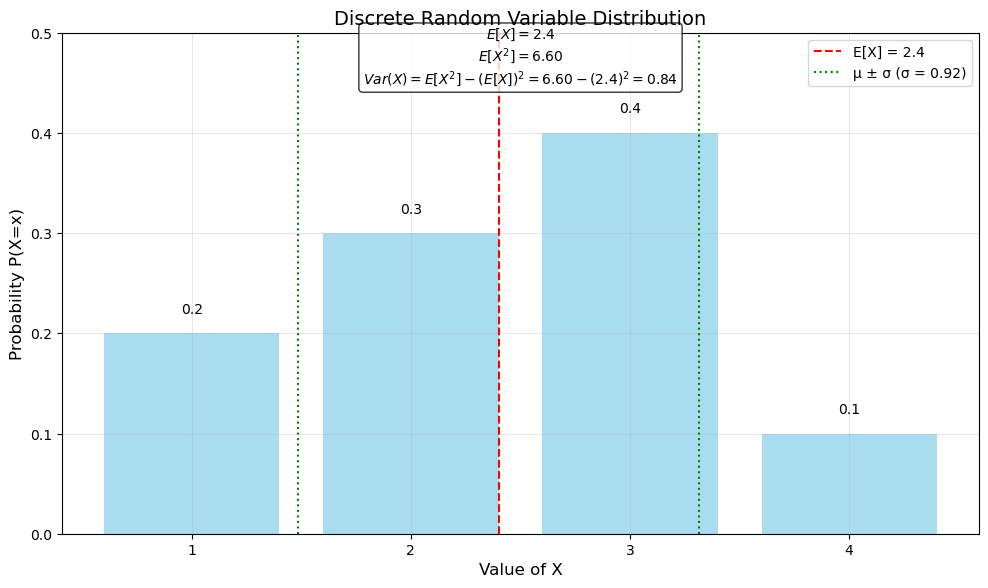
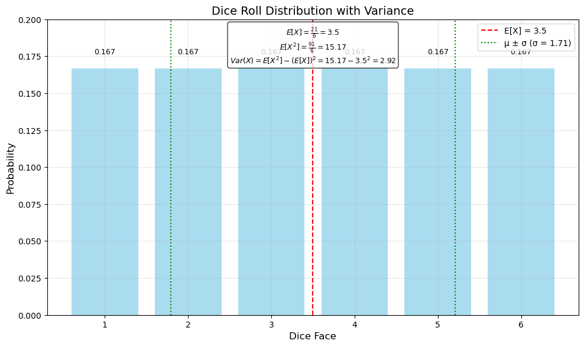
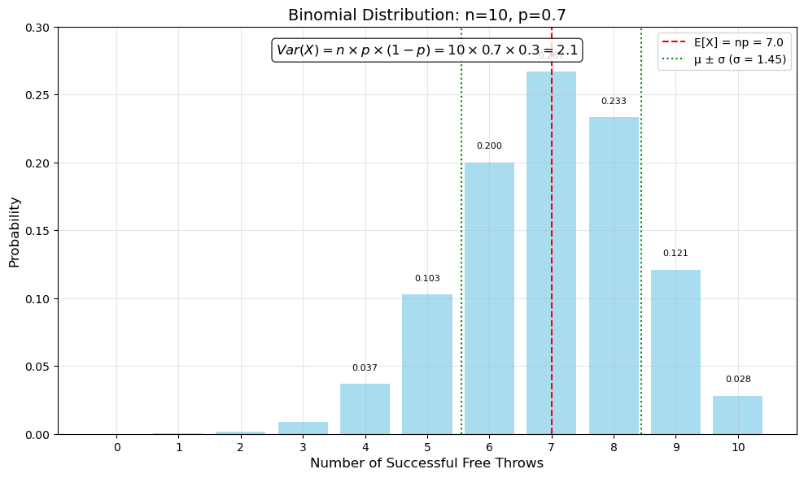
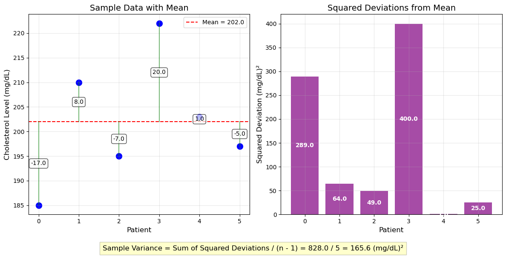
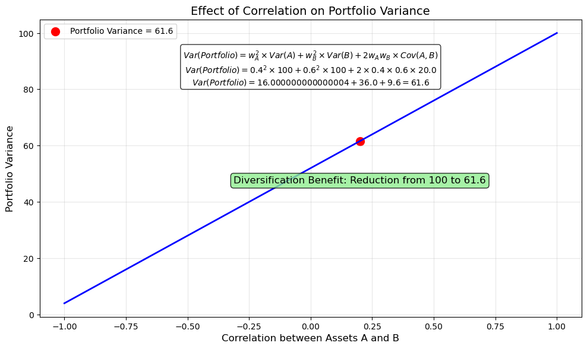
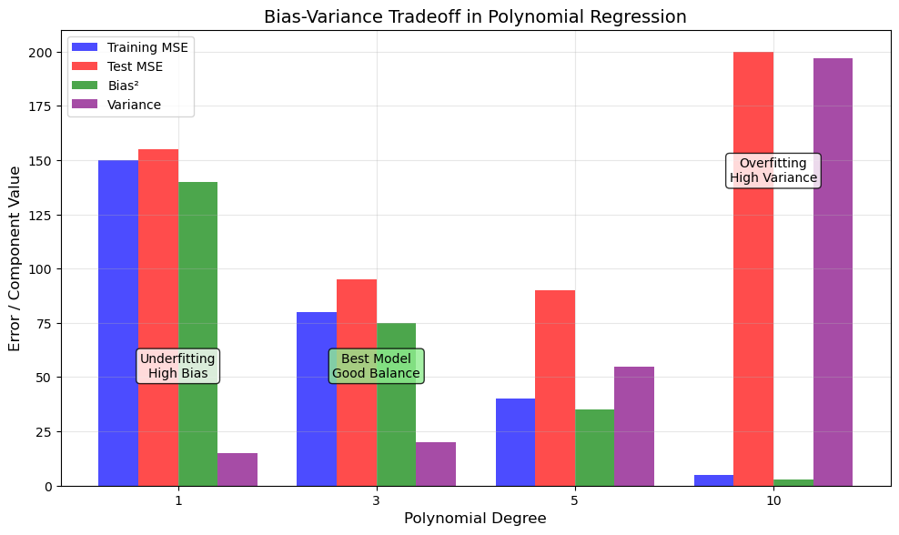

# Variance Examples

This document provides practical examples of variance calculations, demonstrating how to compute and interpret variance for various probability distributions and datasets.

## Discrete Distribution Examples

### Example 1: Variance of a Discrete Random Variable

#### Problem Statement
A discrete random variable $X$ has the following probability mass function:

| $x$ | $P(X=x)$ |
|-----|----------|
| 1   | 0.2      |
| 2   | 0.3      |
| 3   | 0.4      |
| 4   | 0.1      |

Calculate the variance of $X$.

#### Solution
First, we need to find the expected value of $X$:

$$E[X] = 1 \times 0.2 + 2 \times 0.3 + 3 \times 0.4 + 4 \times 0.1 = 0.2 + 0.6 + 1.2 + 0.4 = 2.4$$

Now we can calculate the variance using the formula:

$$\text{Var}(X) = E[(X - E[X])^2] = \sum_x (x - E[X])^2 \cdot P(X=x)$$

Substituting the values:

$$\text{Var}(X) = (1 - 2.4)^2 \times 0.2 + (2 - 2.4)^2 \times 0.3 + (3 - 2.4)^2 \times 0.4 + (4 - 2.4)^2 \times 0.1$$
$$\text{Var}(X) = (-1.4)^2 \times 0.2 + (-0.4)^2 \times 0.3 + (0.6)^2 \times 0.4 + (1.6)^2 \times 0.1$$
$$\text{Var}(X) = 1.96 \times 0.2 + 0.16 \times 0.3 + 0.36 \times 0.4 + 2.56 \times 0.1$$
$$\text{Var}(X) = 0.392 + 0.048 + 0.144 + 0.256 = 0.84$$

Therefore, the variance of $X$ is 0.84.

Alternatively, using the formula $\text{Var}(X) = E[X^2] - (E[X])^2$:

$$E[X^2] = 1^2 \times 0.2 + 2^2 \times 0.3 + 3^2 \times 0.4 + 4^2 \times 0.1 = 0.2 + 1.2 + 3.6 + 1.6 = 6.6$$
$$\text{Var}(X) = E[X^2] - (E[X])^2 = 6.6 - (2.4)^2 = 6.6 - 5.76 = 0.84$$



The visualization shows the probability distribution with the expected value (red dashed line) and the standard deviation range (green dotted lines). The variance of 0.84 corresponds to a standard deviation of approximately 0.92, which represents the spread of the distribution around the mean.

### Example 2: Variance of Dice Rolls

#### Problem Statement
Consider rolling a fair six-sided die. Calculate the variance of the outcomes.

#### Solution
For a fair die, each face has probability $\frac{1}{6} \approx 0.167$.

First, find the expected value:

$$E[X] = 1 \times \frac{1}{6} + 2 \times \frac{1}{6} + 3 \times \frac{1}{6} + 4 \times \frac{1}{6} + 5 \times \frac{1}{6} + 6 \times \frac{1}{6} = \frac{21}{6} = 3.5$$

Now calculate $E[X^2]$:

$$E[X^2] = 1^2 \times \frac{1}{6} + 2^2 \times \frac{1}{6} + 3^2 \times \frac{1}{6} + 4^2 \times \frac{1}{6} + 5^2 \times \frac{1}{6} + 6^2 \times \frac{1}{6}$$
$$E[X^2] = \frac{1 + 4 + 9 + 16 + 25 + 36}{6} = \frac{91}{6} \approx 15.167$$

Using the formula $\text{Var}(X) = E[X^2] - (E[X])^2$:

$$\text{Var}(X) = 15.167 - (3.5)^2 = 15.167 - 12.25 = 2.917$$

Therefore, the variance of a fair die roll is approximately 2.917, and the standard deviation is $\sqrt{2.917} \approx 1.708$.



The figure shows the uniform distribution of dice outcomes, with an expected value of 3.5 and a variance of 2.917. The green dotted lines indicate one standard deviation (≈1.71) from the mean, which covers approximately the range from 1.8 to 5.2.

### Example 3: Variance of a Binomial Distribution

#### Problem Statement
A basketball player has a 70% free throw success rate. If she attempts 10 free throws, what is the variance of the number of successful shots?

#### Solution
This follows a Binomial distribution with $n = 10$ and $p = 0.7$.

For a binomial distribution, the variance is:

$$\text{Var}(X) = n \cdot p \cdot (1-p) = 10 \times 0.7 \times 0.3 = 2.1$$

Therefore, the variance of the number of successful free throws is 2.1, and the standard deviation is $\sqrt{2.1} \approx 1.45$.

The probability mass function values show that getting exactly 7 successful shots has the highest probability (about 0.2668 or 26.68%).



The graph illustrates the binomial distribution with its expected value (7) and the range of one standard deviation (approximately 1.45) on either side. This variance of 2.1 reflects the uncertainty in the actual number of successful shots, which will typically fall within this range most of the time.

## Continuous Distribution Examples

### Example 1: Variance of a Continuous Uniform Distribution

#### Problem Statement
Suppose $X$ follows a continuous uniform distribution over the interval $[3, 9]$. Calculate the variance of $X$.

#### Solution
For a continuous uniform distribution over $[a, b]$, the variance is:

$$\text{Var}(X) = \frac{(b-a)^2}{12}$$

Substituting $a = 3$ and $b = 9$:

$$\text{Var}(X) = \frac{(9-3)^2}{12} = \frac{36}{12} = 3$$

Therefore, the variance of $X$ is 3.

### Example 2: Variance of an Exponential Distribution

#### Problem Statement
The time between customer arrivals at a store follows an exponential distribution with rate parameter $\lambda = 0.5$ customers per minute. What is the variance of the time between customer arrivals?

#### Solution
For an exponential distribution with rate parameter $\lambda$, the variance is:

$$\text{Var}(X) = \frac{1}{\lambda^2}$$

Substituting $\lambda = 0.5$:

$$\text{Var}(X) = \frac{1}{(0.5)^2} = \frac{1}{0.25} = 4$$

Therefore, the variance of the time between customer arrivals is 4 minutes² (the standard deviation is 2 minutes).

### Example 3: Variance of a Normal Distribution

#### Problem Statement
Adult male heights in a certain population follow a normal distribution with mean $\mu = 175$ cm and standard deviation $\sigma = 7$ cm. What is the variance of the heights?

#### Solution
For a normal distribution, the variance is simply $\sigma^2$:

$$\text{Var}(X) = \sigma^2 = 7^2 = 49 \text{ cm}^2$$

Therefore, the variance of the adult male heights is 49 cm².

## Application Examples

### Example 1: Sample Variance Calculation

#### Problem Statement
A researcher measures the cholesterol levels (in mg/dL) of 6 patients and obtains the following values:
185, 210, 195, 222, 203, 197

Calculate the sample variance.

#### Solution
**Step 1: Calculate the sample mean**
$$\bar{x} = \frac{185 + 210 + 195 + 222 + 203 + 197}{6} = \frac{1212}{6} = 202$$

**Step 2: Calculate the sum of squared deviations from the mean**
$$(185 - 202)^2 = (-17)^2 = 289$$
$$(210 - 202)^2 = (8)^2 = 64$$
$$(195 - 202)^2 = (-7)^2 = 49$$
$$(222 - 202)^2 = (20)^2 = 400$$
$$(203 - 202)^2 = (1)^2 = 1$$
$$(197 - 202)^2 = (-5)^2 = 25$$

Sum of squared deviations = 289 + 64 + 49 + 400 + 1 + 25 = 828

**Step 3: Calculate the sample variance**
$$s^2 = \frac{1}{n-1} \sum_{i=1}^{n} (x_i - \bar{x})^2 = \frac{828}{6-1} = \frac{828}{5} = 165.6$$

Therefore, the sample variance is 165.6 (mg/dL)². Note that we used $n-1$ in the denominator to get an unbiased estimate of the population variance. The sample standard deviation is $\sqrt{165.6} \approx 12.9$ mg/dL.



The figure illustrates the calculation of sample variance. The left panel shows the data points and their deviations from the mean (202 mg/dL). The right panel shows the squared deviations, which are summed and divided by (n-1) to obtain the sample variance of 165.6 (mg/dL)².

### Example 2: Variance in Portfolio Analysis

#### Problem Statement
An investor has a portfolio with returns that follow a normal distribution with mean 8% and standard deviation 12%. What is the variance of the returns?

#### Solution
Since the standard deviation is 12%, the variance is:

$$\text{Var}(X) = \sigma^2 = (0.12)^2 = 0.0144 = 1.44\%$$

Therefore, the variance of the returns is 1.44%.

### Example 3: Variance Reduction Through Diversification

#### Problem Statement
Consider two investments $A$ and $B$, each with a variance of 100. If the correlation between $A$ and $B$ is 0.2, what is the variance of a portfolio that invests 40% in $A$ and 60% in $B$?

#### Solution
The variance of a two-asset portfolio is:

$$\text{Var}(w_A A + w_B B) = w_A^2 \text{Var}(A) + w_B^2 \text{Var}(B) + 2 w_A w_B \text{Cov}(A,B)$$

Where $w_A$ and $w_B$ are the weights, and $\text{Cov}(A,B) = \rho_{AB} \sigma_A \sigma_B$.

Given:
- $\text{Var}(A) = \text{Var}(B) = 100$
- $\sigma_A = \sigma_B = 10$ (standard deviations)
- $w_A = 0.4$, $w_B = 0.6$
- $\rho_{AB} = 0.2$ (correlation)

First, calculate the covariance:
$$\text{Cov}(A,B) = \rho_{AB} \sigma_A \sigma_B = 0.2 \times 10 \times 10 = 20$$

Then, calculate the portfolio variance:
$$\text{Var}(Portfolio) = (0.4)^2 \times 100 + (0.6)^2 \times 100 + 2 \times 0.4 \times 0.6 \times 20$$
$$\text{Var}(Portfolio) = 16 + 36 + 9.6 = 61.6$$

Therefore, the variance of the portfolio is 61.6, which is less than the individual variances of 100, demonstrating the benefit of diversification.



The figure shows how correlation between assets affects portfolio variance. At the correlation of 0.2, the portfolio variance is 61.6, significantly lower than the 100 variance of each individual asset. This reduction demonstrates the power of diversification in risk management. The curve also shows that as correlation decreases, the diversification benefit increases.

## Bias-Variance Tradeoff Examples

### Example: Polynomial Regression

#### Problem Statement
A data scientist is building regression models with different polynomial degrees to predict house prices. The training error and test error for each model are as follows:

| Polynomial Degree | Training MSE | Test MSE | Bias² | Variance |
|-------------------|--------------|----------|-------|----------|
| 1 (linear)        | 150          | 155      | 140   | 15       |
| 3                 | 80           | 95       | 75    | 20       |
| 5                 | 40           | 90       | 35    | 55       |
| 10                | 5            | 200      | 3     | 197      |

Explain what's happening in terms of the bias-variance tradeoff.

#### Solution
The total test error can be decomposed as:
$$\text{Test Error} \approx \text{Bias}^2 + \text{Variance} + \text{Irreducible Error}$$

Looking at the data:
- **Linear model (degree 1)**: High bias (140) and low variance (15) - the model is underfitting
- **Cubic model (degree 3)**: Reduced bias (75) with slightly increased variance (20) - better balance
- **Degree 5 model**: Further reduced bias (35) but increased variance (55) - starting to overfit
- **Degree 10 model**: Very low bias (3) but extremely high variance (197) - severe overfitting

As the model complexity increases:
1. The training error consistently decreases
2. The bias component decreases
3. The variance component increases dramatically
4. Test error initially decreases (as bias reduction outweighs variance increase) and then increases (as variance increase outweighs bias reduction)

The degree 3 model provides the best balance, with a test MSE of 95. Beyond that point, the increase in variance outweighs the reduction in bias, leading to worse performance on unseen data.



The visualization clearly illustrates the bias-variance tradeoff. As model complexity increases from left to right, training error steadily decreases, while test error follows a U-shaped curve. The third model (degree 3) provides the optimal balance between bias and variance, resulting in the best generalization performance. The high-degree polynomial (degree 10) fits the training data almost perfectly but performs poorly on test data due to high variance.

## Quiz Example

### Problem Statement
A machine learning model's predictions have the following characteristics:
- Mean prediction: 25
- True mean value of target: 22
- Mean squared difference between predictions and their mean: 18

Calculate the bias, variance, and total mean squared error of this model.

#### Solution

**Step 1: Calculate bias**
Bias = Mean prediction - True mean = 25 - 22 = 3
Squared bias = 3² = 9

**Step 2: Variance**
The variance is the mean squared difference between predictions and their mean: 18

**Step 3: Calculate total MSE**
Based on the bias-variance decomposition:
Total MSE = Bias² + Variance = 9 + 18 = 27

Therefore, the squared bias is 9, the variance is 18, and the total mean squared error is 27. The variance contributes more to the error than the bias in this case.

## Running the Examples

You can run the code that generates the probability examples and visualizations using:

```bash
python3 ML_Obsidian_Vault/Lectures/2/Codes/1_variance_examples.py
```

## Related Topics

- [[L2_1_Variance|Variance]]: Theoretical foundations of variance
- [[L2_1_Expectation_Examples|Expectation_Examples]]: Examples of calculating expected values
- [[L2_1_Examples|Probability_Examples]]: Examples of probability calculations 