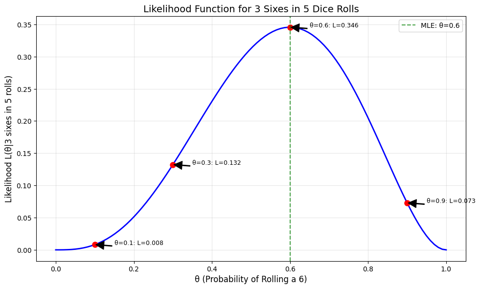

# Likelihood Examples

This document provides practical examples of likelihood calculations for various scenarios, illustrating the concept of likelihood as a function of parameters given fixed observations.

## Bernoulli/Binomial Likelihood Examples

### Example 1: Coin Flip Likelihood

#### Problem Statement
Suppose we observe 7 heads in 10 coin flips. What is the likelihood of different values of θ (the probability of heads) given this observation?

#### Solution
For a binomial likelihood function with x = 7 successes in n = 10 trials:

$$L(\theta|x=7, n=10) = \binom{10}{7} \times \theta^7 \times (1-\theta)^3$$

Let's evaluate this for different values of θ:

| θ Value | Likelihood L(θ‖7 heads in 10 flips) |
|---------|--------------------------------------|
| 0.3     | 0.009                               |
| 0.5     | 0.117                               |
| 0.7     | **0.267**                           |
| 0.9     | 0.057                               |

The likelihood is maximized at θ = 0.7, which suggests that if we observe 7 heads in 10 flips, the most plausible value for the probability of heads is 0.7.


### Example 2: Dice Roll Likelihood

#### Problem Statement
Suppose we roll a die 5 times and get the number 6 on three of those rolls. What is the likelihood of different values of θ (the probability of rolling a 6) given this observation?

#### Solution
For a binomial likelihood function with x = 3 successes in n = 5 trials:

$$L(\theta|x=3, n=5) = \binom{5}{3} \times \theta^3 \times (1-\theta)^2$$

Let's evaluate this for different values of θ:

| θ Value | Likelihood L(θ‖3 sixes in 5 rolls) |
|---------|-------------------------------------|
| 0.1     | 0.008                              |
| 0.3     | 0.132                              |
| 0.6     | **0.346**                          |
| 0.9     | 0.073                              |

The likelihood is maximized at θ = 0.6, which is the maximum likelihood estimate (MLE). This suggests that if we observe 3 sixes in 5 rolls, the most plausible value for the probability of rolling a 6 is 0.6.




### Example 3: Basketball Free Throw Likelihood

#### Problem Statement
A basketball player takes 7 free throws and makes 5 of them. What is the likelihood of different values of θ (the probability of making a free throw) given this observation?

#### Solution
For a binomial likelihood function with x = 5 successes in n = 7 trials:

$$L(\theta|x=5, n=7) = \binom{7}{5} \times \theta^5 \times (1-\theta)^2$$

Let's evaluate this for different values of θ:

| θ Value | Likelihood L(θ‖5 makes in 7 attempts) |
|---------|---------------------------------------|
| 0.4     | 0.088                                |
| 0.6     | 0.185                                |
| 0.7     | **0.200**                            |
| 0.8     | 0.180                                |

The likelihood is maximized at θ = 0.7 (the point where L'(θ) = 0). This is also the MLE: $\hat{\theta} = x/n = 5/7 \approx 0.714$.


## Normal Distribution Likelihood Examples

### Example 1: Height Measurements

#### Problem Statement
Suppose we measure the heights (in cm) of 5 adult women and obtain: 158, 162, 171, 175, and 164. What is the likelihood of different values of the parameters μ (mean) and σ (standard deviation) for a normal distribution given these observations?

#### Solution
For a normal distribution, the likelihood function for n independent observations is:

$$L(\mu,\sigma|x_1,...,x_n) = \prod_{i=1}^n \frac{1}{\sigma\sqrt{2\pi}} \times \exp\left(-\frac{(x_i-\mu)^2}{2\sigma^2}\right)$$

Let's evaluate this for different parameter combinations:

| Parameters (μ, σ) | Likelihood value (scaled) |
|-------------------|--------------------------|
| (160, 5)          | 0.03 × 10^-6            |
| (165, 7)          | 0.54 × 10^-6            |
| (170, 10)         | 0.13 × 10^-6            |

The likelihood is highest for the parameter set (165, 7), indicating that these values best explain the observed heights.


### Example 2: Test Scores

#### Problem Statement
A teacher records the following test scores for 8 students: 85, 92, 78, 88, 95, 82, 90, and 84. What are the maximum likelihood estimates for the mean and standard deviation of the test scores?

#### Solution
For normally distributed data, the maximum likelihood estimates are:

$$\hat{\mu} = \frac{1}{n} \sum_{i=1}^n x_i = \frac{85 + 92 + 78 + 88 + 95 + 82 + 90 + 84}{8} = 86.75$$

$$\hat{\sigma}^2 = \frac{1}{n} \sum_{i=1}^n (x_i - \hat{\mu})^2 = \frac{(85-86.75)^2 + \cdots + (84-86.75)^2}{8} = 29.94$$

$$\hat{\sigma} = \sqrt{29.94} = 5.47$$

Therefore, the maximum likelihood estimates are $\hat{\mu} = 86.75$ and $\hat{\sigma} = 5.47$.

## Likelihood Ratio Examples

### Example 1: Model Comparison

#### Problem Statement
Consider two models for a dataset of coin flips:
- Model 1: Fair coin (θ = 0.5)
- Model 2: Biased coin (θ = 0.7)

If we observe 7 heads in 10 flips, which model is more likely?

#### Solution
Let's calculate the likelihood ratio:

$$\text{Likelihood Ratio} = \frac{L(\theta=0.5|\text{data})}{L(\theta=0.7|\text{data})} = \frac{\binom{10}{7} \times 0.5^7 \times 0.5^3}{\binom{10}{7} \times 0.7^7 \times 0.3^3} = \frac{0.5^7 \times 0.5^3}{0.7^7 \times 0.3^3} = \frac{0.0078}{0.0267} = 0.292$$

Since the likelihood ratio is less than 1, Model 2 (θ = 0.7) is more likely than Model 1 (θ = 0.5).


### Example 2: Feature Selection

#### Problem Statement
We want to determine if a feature X improves a prediction model. We compare:
- Model A: Without feature X (2 parameters)
- Model B: With feature X (3 parameters)

The log-likelihoods are:
- Log-likelihood of Model A: -45.2
- Log-likelihood of Model B: -41.5

Is the feature worth including?

#### Solution
The likelihood ratio test statistic is:

$$D = -2 \times (\text{log-likelihood of Model A} - \text{log-likelihood of Model B}) = -2 \times (-45.2 - (-41.5)) = -2 \times (-3.7) = 7.4$$

Under the null hypothesis that the simpler model is adequate, this test statistic follows a chi-squared distribution with degrees of freedom equal to the difference in the number of parameters (3-2 = 1).

For a chi-squared distribution with 1 degree of freedom, the critical value at the 0.05 significance level is 3.84. Since 7.4 > 3.84, we reject the null hypothesis and conclude that including feature X significantly improves the model.

## Log-Likelihood Examples

### Example 1: Maximizing Log-Likelihood

#### Problem Statement
For computational convenience, we often work with the log-likelihood instead of the likelihood. If we observe 8 heads in a 10-coin trial, what value of θ maximizes the log-likelihood?

#### Solution
The log-likelihood function is:

$$\log(L(\theta|x=8, n=10)) = \log\left(\binom{10}{8}\right) + 8\log(\theta) + 2\log(1-\theta)$$

The constant term $\log\left(\binom{10}{8}\right)$ doesn't affect the maximization, so we focus on:

$$f(\theta) = 8\log(\theta) + 2\log(1-\theta)$$

Taking the derivative and setting it to zero:

$$f'(\theta) = \frac{8}{\theta} - \frac{2}{1-\theta} = 0$$

$$8(1-\theta) = 2\theta$$

$$8 - 8\theta = 2\theta$$

$$8 = 10\theta$$

$$\theta = \frac{8}{10} = 0.8$$

The second derivative $f''(\theta) = -\frac{8}{\theta^2} - \frac{2}{(1-\theta)^2}$ is always negative, confirming that this is a maximum.

Therefore, θ = 0.8 maximizes the log-likelihood, which is the same as the MLE (x/n = 8/10 = 0.8).


## Comparing Likelihood Functions

### Different Datasets, Same Model

#### Problem Statement
Compare the likelihood functions for two different datasets:
- Dataset 1: 3 heads and 2 tails
- Dataset 2: 2 heads and 3 tails

#### Solution
For Dataset 1, the likelihood function is:

$$L_1(\theta) = \binom{5}{3} \times \theta^3 \times (1-\theta)^2$$

For Dataset 2, the likelihood function is:

$$L_2(\theta) = \binom{5}{2} \times \theta^2 \times (1-\theta)^3$$

These likelihood functions reach their maximum at θ = 3/5 = 0.6 and θ = 2/5 = 0.4, respectively.


### Same Dataset, Different Models

#### Problem Statement
Suppose we have a dataset of heights with mean 165 cm. Compare the likelihood functions for two different models:
- Model A: Normal(μ=165, σ=5)
- Model B: Normal(μ=165, σ=10)

#### Solution
For a narrower distribution (Model A), extreme values would have a lower likelihood, while values closer to the mean would have a higher likelihood compared to a wider distribution (Model B).

This comparison illustrates that even when models can center on the same mean, their different standard deviations lead to different likelihoods for the same observations.

## Quiz Example

### Problem Statement
You flip a potentially biased coin 8 times and observe 5 heads and 3 tails. You're interested in evaluating two specific hypotheses about the coin's bias:
1. H₁: The coin is fair (θ = 0.5)
2. H₂: The coin is biased toward heads (θ = 0.7)

Calculate the likelihood of each hypothesis and determine which one is more supported by the data.

### Solution

**Step 1: Define the likelihood function**
For a binomial experiment with k successes in n trials, the likelihood function for parameter θ is:

$$L(\theta) = \binom{n}{k} \times \theta^k \times (1-\theta)^{n-k}$$

In our example:
- n = 8 (total flips)
- k = 5 (number of heads)
- $\binom{8}{5} = 56$

**Step 2: Calculate likelihood for H₁ (θ = 0.5)**

$$L(0.5) = 56 \times (0.5)^5 \times (0.5)^3$$

$$L(0.5) = 56 \times (0.5)^8$$

$$L(0.5) = 56 \times 0.00390625$$

$$L(0.5) = 0.219 \text{ (rounded)}$$

**Step 3: Calculate likelihood for H₂ (θ = 0.7)**

$$L(0.7) = 56 \times (0.7)^5 \times (0.3)^3$$

$$L(0.7) = 56 \times 0.16807 \times 0.027$$

$$L(0.7) = 56 \times 0.004538$$

$$L(0.7) = 0.254 \text{ (rounded)}$$

**Step 4: Compare the likelihoods**
- Likelihood ratio: $L(0.7)/L(0.5) = 0.254/0.219 = 1.16$
- Since L(0.7) > L(0.5), the data more strongly supports H₂

Therefore, the hypothesis that the coin is biased toward heads (θ = 0.7) is more supported by the observed data, although the likelihood ratio of 1.16 indicates that the evidence is not overwhelmingly in favor of this hypothesis.

## Running the Examples

You can run the code that generates these likelihood examples and visualizations using:

```bash
python3 ML_Obsidian_Vault/Code/likelihood_examples.py
```

## Related Topics

- [[L2_3_Likelihood|Likelihood]]: Detailed exploration of likelihood functions
- [[L2_1_Basic_Probability|Basic Probability]]: The complementary perspective on data and models
- [[L2_3_Probability_vs_Likelihood|Probability_vs_Likelihood]]: Conceptual comparison
- [[L2_1_Examples|Probability_Examples]]: Focused on probability calculations across various distributions
- [[L2_4_MLE_Examples|MLE_Examples]]: Maximum likelihood parameter estimation
- [[L2_5_Bayesian_Inference|Bayesian_Inference]]: Using likelihood to update prior beliefs 