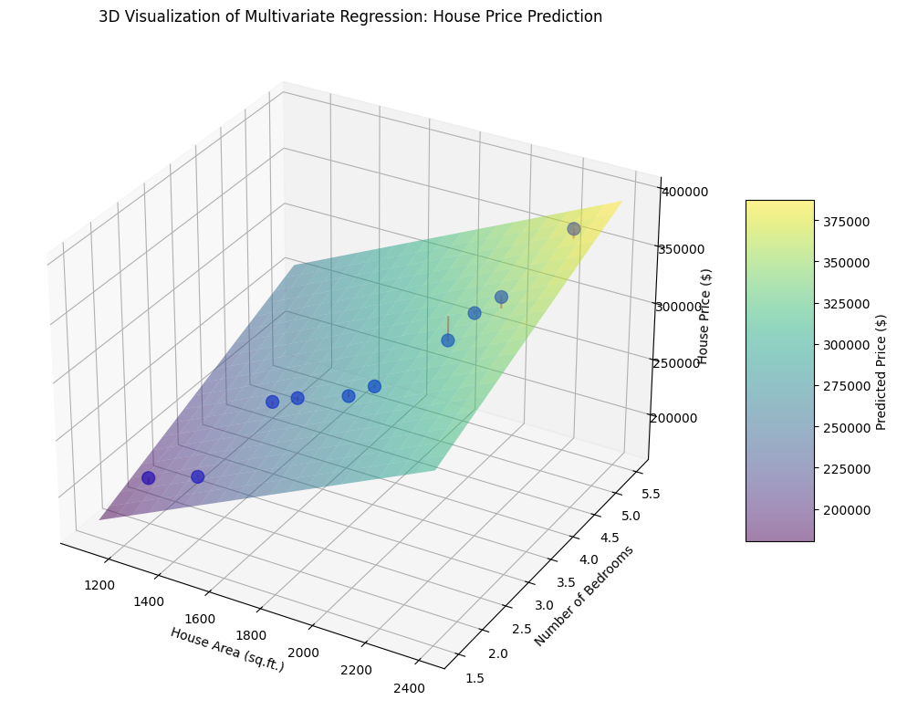
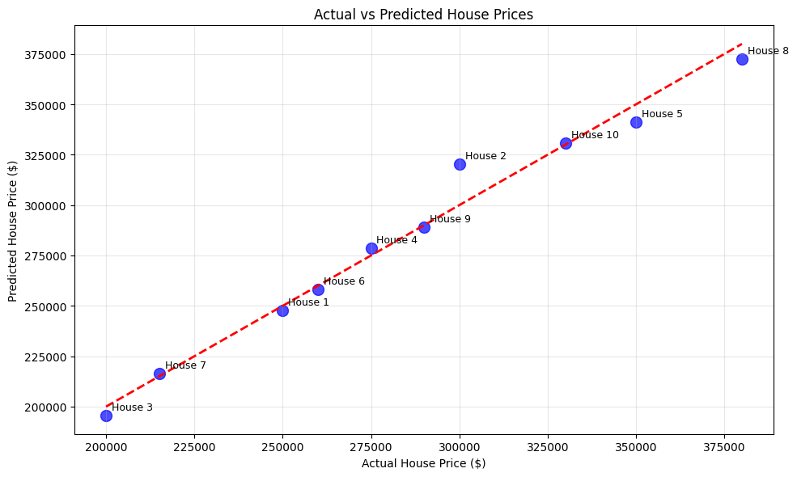
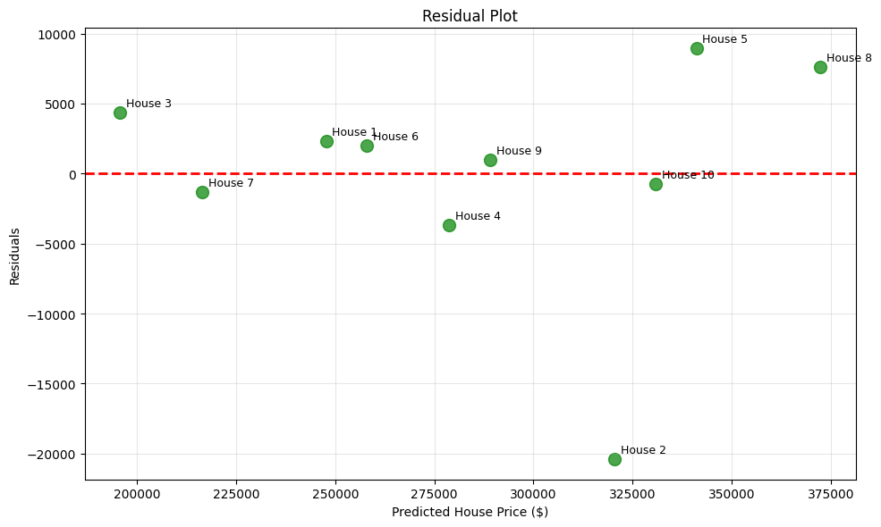
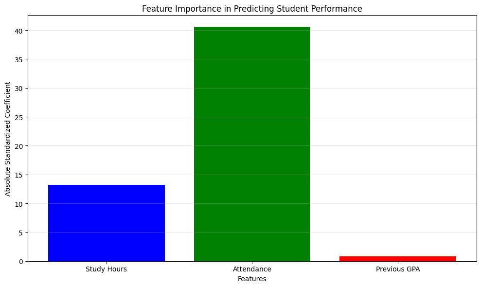
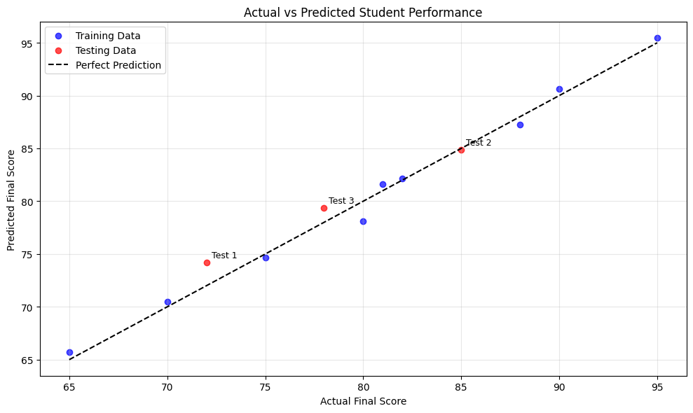
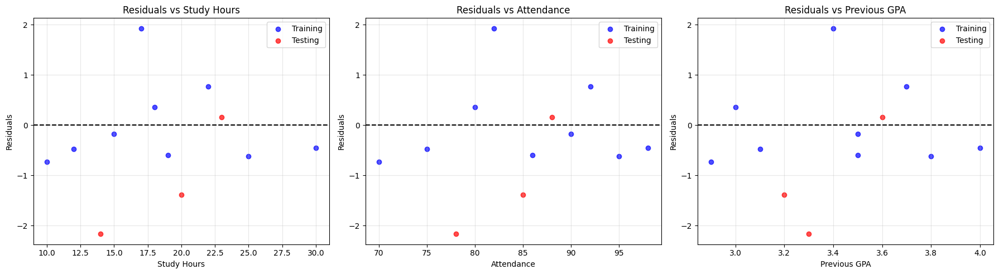
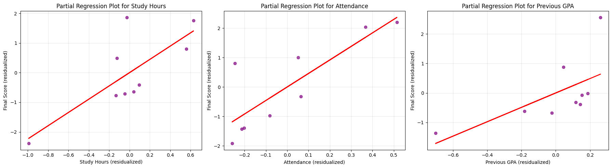

# Multivariate Regression Examples

This document provides practical examples of multivariate regression for various scenarios, illustrating how multiple predictor variables can be used to model a response variable.

## Key Concepts and Formulas

Multivariate regression extends simple linear regression by incorporating multiple predictors. The general form of a multivariate linear regression model is:

$$Y = \beta_0 + \beta_1 X_1 + \beta_2 X_2 + \ldots + \beta_p X_p + \varepsilon$$

Where:
- $Y$ = Response variable (dependent variable)
- $X_1, X_2, \ldots, X_p$ = Predictor variables (independent variables)
- $\beta_0$ = Intercept (constant term)
- $\beta_1, \beta_2, \ldots, \beta_p$ = Regression coefficients
- $\varepsilon$ = Error term (random noise)

### Matrix Representation

The model can be written in matrix form as:

$$\mathbf{Y} = \mathbf{X}\boldsymbol{\beta} + \boldsymbol{\varepsilon}$$

Where:
- $\mathbf{Y}$ is an $n \times 1$ vector of responses
- $\mathbf{X}$ is an $n \times (p+1)$ design matrix (including a column of ones for the intercept)
- $\boldsymbol{\beta}$ is a $(p+1) \times 1$ vector of regression coefficients
- $\boldsymbol{\varepsilon}$ is an $n \times 1$ vector of errors

### Normal Equations

The least squares solution for the regression coefficients is given by:

$$\hat{\boldsymbol{\beta}} = (\mathbf{X}^T\mathbf{X})^{-1}\mathbf{X}^T\mathbf{Y}$$

### Model Evaluation Metrics

- **Total Sum of Squares (TSS)**: $\sum_{i=1}^{n} (y_i - \bar{y})^2$
- **Regression Sum of Squares (RSS)**: $\sum_{i=1}^{n} (\hat{y}_i - \bar{y})^2$
- **Error Sum of Squares (ESS)**: $\sum_{i=1}^{n} (y_i - \hat{y}_i)^2$
- **Coefficient of Determination (R²)**: $R^2 = \frac{RSS}{TSS} = 1 - \frac{ESS}{TSS}$
- **Adjusted R²**: $R^2_{adj} = 1 - (1 - R^2) \cdot \frac{n-1}{n-p-1}$
- **Standard Error of the Estimate**: $SEE = \sqrt{\frac{ESS}{n-p-1}}$

### Standardized Coefficients

Standardized coefficients allow for direct comparison of the relative importance of predictors:

$$\beta_j^* = \beta_j \cdot \frac{\sigma_{X_j}}{\sigma_Y}$$

Where:
- $\beta_j^*$ is the standardized coefficient for predictor $j$
- $\sigma_{X_j}$ is the standard deviation of predictor $j$
- $\sigma_Y$ is the standard deviation of the response variable

## Examples

### Example 1: House Price Prediction

#### Problem Statement
We want to develop a model to predict house prices based on the house area (in square feet) and the number of bedrooms.

**Dataset:**

| House | Area (X₁) | Bedrooms (X₂) | Price (Y) |
|-------|-----------|--------------|-----------|
| 1     | 1500      | 3            | 250000    |
| 2     | 2000      | 4            | 300000    |
| 3     | 1200      | 2            | 200000    |
| 4     | 1800      | 3            | 275000    |
| 5     | 2200      | 4            | 350000    |
| 6     | 1600      | 3            | 260000    |
| 7     | 1400      | 2            | 215000    |
| 8     | 2300      | 5            | 380000    |
| 9     | 1900      | 3            | 290000    |
| 10    | 2100      | 4            | 330000    |

#### Solution

##### Step 1: Set up the regression model
We define our model as: 
$$\text{Price} = \beta_0 + \beta_1 \cdot \text{Area} + \beta_2 \cdot \text{Bedrooms} + \varepsilon$$

##### Step 2: Calculate the regression coefficients using the normal equation
The normal equation is: $\hat{\boldsymbol{\beta}} = (\mathbf{X}^T\mathbf{X})^{-1}\mathbf{X}^T\mathbf{Y}$

First, we create the design matrix $\mathbf{X}$ by adding a column of ones to our predictor variables:

$$\mathbf{X} = \begin{bmatrix} 
1 & 1500 & 3 \\
1 & 2000 & 4 \\
\vdots & \vdots & \vdots \\
1 & 2100 & 4
\end{bmatrix}$$

Next, we calculate $\mathbf{X}^T\mathbf{X}$:

$$\mathbf{X}^T\mathbf{X} = \begin{bmatrix} 
10.00 & 18000.00 & 33.00 \\
18000.00 & 33600000.00 & 62300.00 \\
33.00 & 62300.00 & 117.00
\end{bmatrix}$$

Then, we calculate $(\mathbf{X}^T\mathbf{X})^{-1}$:

$$(\mathbf{X}^T\mathbf{X})^{-1} = \begin{bmatrix} 
3.809924 & -0.003824 & 0.961832 \\
-0.003824 & 0.000006 & -0.002214 \\
0.961832 & -0.002214 & 0.916031
\end{bmatrix}$$

Next, we calculate $\mathbf{X}^T\mathbf{Y}$:

$$\mathbf{X}^T\mathbf{Y} = \begin{bmatrix} 
2850000.00 \\
5315000000.00 \\
9875000.00
\end{bmatrix}$$

Finally, we calculate $\hat{\boldsymbol{\beta}} = (\mathbf{X}^T\mathbf{X})^{-1}\mathbf{X}^T\mathbf{Y}$:

$$\hat{\boldsymbol{\beta}} = \begin{bmatrix} 
29541.98 \\
103.44 \\
20992.37
\end{bmatrix}$$

Therefore, our regression equation is:
$$\text{Price} = 29541.98 + 103.44 \cdot \text{Area} + 20992.37 \cdot \text{Bedrooms}$$

##### Step 3: Calculate fitted values and residuals

| House | Actual (Y) | Predicted (Ŷ) | Residual (Y - Ŷ) |
|-------|------------|---------------|-----------------|
| 1     | 250000     | 247671.76     | 2328.24         |
| 2     | 300000     | 320381.68     | -20381.68       |
| 3     | 200000     | 195648.85     | 4351.15         |
| 4     | 275000     | 278702.29     | -3702.29        |
| 5     | 350000     | 341068.70     | 8931.30         |
| 6     | 260000     | 258015.27     | 1984.73         |
| 7     | 215000     | 216335.88     | -1335.88        |
| 8     | 380000     | 372404.58     | 7595.42         |
| 9     | 290000     | 289045.80     | 954.20          |
| 10    | 330000     | 330725.19     | -725.19         |

##### Step 4: Evaluate the model

- Total Sum of Squares (TSS) = 29,600,000,000.00
- Regression Sum of Squares (RSS) = 29,001,908,396.95
- Error Sum of Squares (ESS) = 598,091,603.05
- Coefficient of determination (R²) = 0.9798
- Adjusted R² = 0.9740
- Standard Error of the Estimate = 9,243.47

##### Step 5: Interpret the model

- $\beta_0 = 29541.98$: The expected price of a house with zero area and zero bedrooms (not meaningful in this context)
- $\beta_1 = 103.44$: For each additional square foot of area, the house price increases by $103.44 on average, holding the number of bedrooms constant
- $\beta_2 = 20992.37$: For each additional bedroom, the house price increases by $20,992.37 on average, holding the area constant
- R² = 0.9798: Approximately 98.0% of the variation in house prices can be explained by the area and number of bedrooms







### Example 2: Student Performance Prediction

#### Problem Statement
We want to predict a student's final exam score based on weekly study hours, attendance percentage, and previous GPA.

**Dataset:**

| Student | Study Hours (X₁) | Attendance % (X₂) | Prev GPA (X₃) | Final Score (Y) |
|---------|-----------------|------------------|--------------|----------------|
| 1       | 20              | 85               | 3.2          | 78             |
| 2       | 15              | 90               | 3.5          | 82             |
| 3       | 25              | 95               | 3.8          | 90             |
| 4       | 10              | 70               | 2.9          | 65             |
| 5       | 18              | 80               | 3.0          | 75             |
| 6       | 22              | 92               | 3.7          | 88             |
| 7       | 12              | 75               | 3.1          | 70             |
| 8       | 30              | 98               | 4.0          | 95             |
| 9       | 17              | 82               | 3.4          | 80             |
| 10      | 23              | 88               | 3.6          | 85             |
| 11      | 14              | 78               | 3.3          | 72             |
| 12      | 19              | 86               | 3.5          | 81             |

#### Solution

##### Step 1: Split the data into training and testing sets
We split the data with 75% for training (9 students) and 25% for testing (3 students).

##### Step 2: Standardize the features
Feature means (Training set):
- Study Hours mean: 18.67
- Attendance mean: 85.33%
- Previous GPA mean: 3.43

Feature standard deviations (Training set):
- Study Hours std: 5.93
- Attendance std: 8.83%
- Previous GPA std: 0.35

##### Step 3: Fit the multiple linear regression model

**Regression coefficients:**
- $\beta_0$ (Intercept): 80.6667
- $\beta_1$ (Study Hours): 2.2359
- $\beta_2$ (Attendance): 4.5935
- $\beta_3$ (Previous GPA): 2.4396

**Standardized coefficients:**
- $\beta_1^*$ (Study Hours): 13.2486
- $\beta_2^*$ (Attendance): 40.5683
- $\beta_3^*$ (Previous GPA): 0.8606

##### Step 4: Evaluate the model

**Training set performance:**
- Mean Squared Error (MSE): 0.6842
- Root Mean Squared Error (RMSE): 0.8271
- R²: 0.9917

**Testing set performance:**
- Mean Squared Error (MSE): 2.2148
- Root Mean Squared Error (RMSE): 1.4882
- R²: 0.9215

##### Step 5: Interpret the model

The equation for predicting a student's final score (on the original scale) is:

$$\text{Final Score} = 5.4973 + 0.3773 \times \text{Study Hours} + 0.5201 \times \text{Attendance} + 6.9156 \times \text{Previous GPA}$$

**Feature importance ranking:**
1. Attendance (40.5683)
2. Study Hours (13.2486)
3. Previous GPA (0.8606)

The most important predictor is Attendance. When Attendance percentage increases by one standard deviation (8.83%), the final score is expected to increase by approximately 40.57 points, holding other variables constant.









## Practical Insights

### When to Use Multivariate Regression
- When you have multiple predictor variables that may influence your response variable
- When you want to control for confounding variables
- When you need to determine which factors have the greatest influence on the outcome

### Advantages of Multivariate Regression
- Can model complex relationships involving multiple predictors
- Helps understand the relative importance of different predictors
- Provides more accurate predictions than univariate models when multiple factors affect the outcome

### Limitations and Considerations
- Assumes linear relationships between predictors and response
- Sensitive to multicollinearity (high correlation between predictors)
- Requires more data as the number of predictors increases
- May overfit with too many predictors relative to sample size

### Checking Model Assumptions
- Linearity: Check partial regression plots for linear relationships
- Independence: Ensure observations are independent
- Homoscedasticity: Check residual plots for constant variance
- Normality: Check distribution of residuals
- No multicollinearity: Check correlation matrix of predictors

## Running the Examples

You can run the code that generates these examples and visualizations using:

```bash
python3 ML_Obsidian_Vault/Lectures/2/Codes/1_MA_multivariate_regression_examples.py
```

## Related Topics
- [[L2_1_Simple_Linear_Regression|Simple Linear Regression]]: Foundation for multivariate regression
- [[L2_1_Mean_Covariance|Mean Vector and Covariance Matrix]]: Understanding relationships between variables
- [[L2_1_Principal_Component_Analysis|Principal Component Analysis]]: Handling multicollinearity and dimensionality reduction
- [[L2_1_Ridge_Regression|Ridge Regression]]: Regularized regression for multicollinearity
- [[L2_1_Lasso_Regression|Lasso Regression]]: Variable selection in regression 