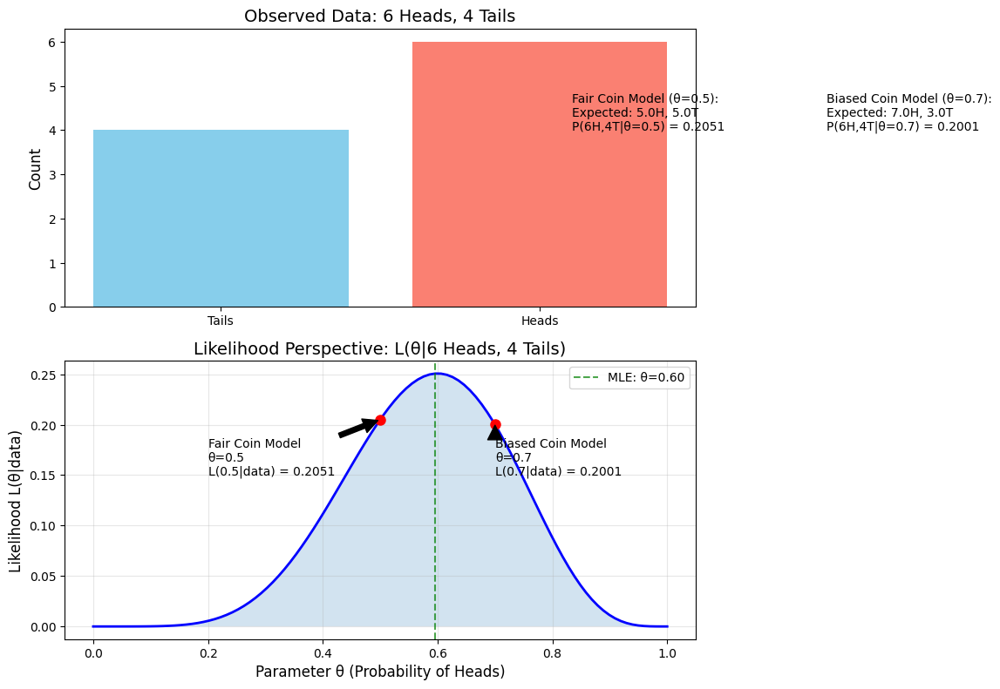
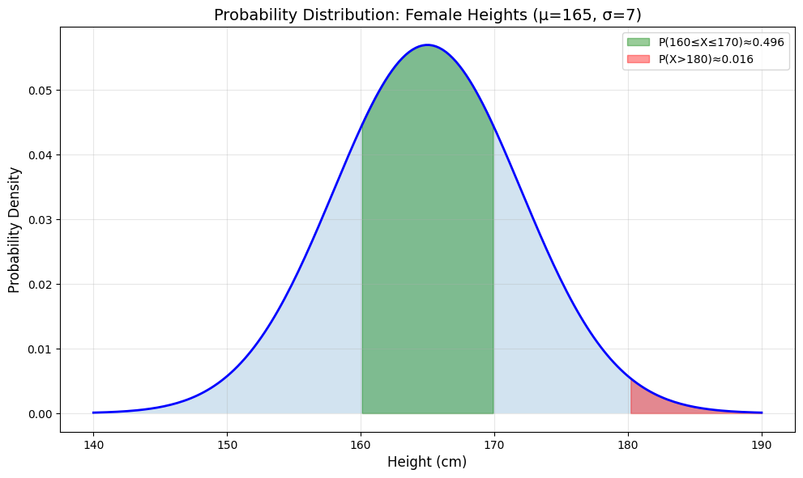
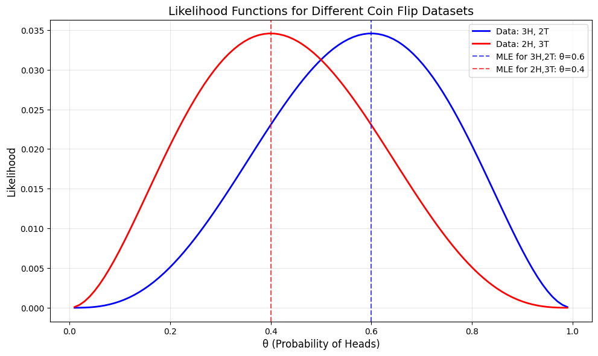
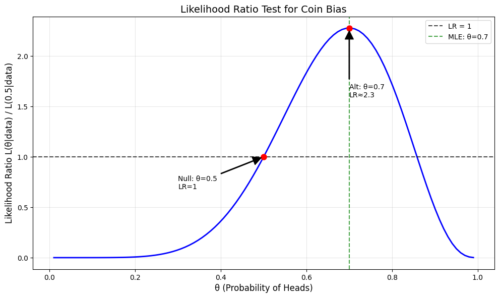

# Probability vs Likelihood Examples

This document provides practical examples to illustrate the difference between probability and likelihood, building on the concepts introduced in [[L2_3_Probability_vs_Likelihood|Probability_vs_Likelihood]].

## Practical Interpretation of Coin Flips

For an intuitive understanding, consider this visualization comparing probability vs likelihood:



- The **top panel** shows observed data (6 heads, 4 tails)
- The **bottom panel** shows the likelihood function across all possible parameter values
- Red points mark two specific models (fair coin θ=0.5 and biased coin θ=0.7)
- The green line shows the maximum likelihood estimate (MLE)

This example illustrates how:
- Probability takes a model (like θ=0.5) and tells us how likely certain data is
- Likelihood takes data (like 6 heads, 4 tails) and tells us how plausible different models are

## Dice Roll Example

### Problem Statement
Consider a six-sided die that might be biased. We want to explore both the probability and likelihood perspectives for this scenario.

In this example:
- The parameter θ represents the probability of rolling a 6
- For a fair die, θ = 1/6 ≈ 0.167
- For a biased die, θ could be any value between 0 and 1

#### Probability Perspective: Fixed Parameter, Variable Outcome
If we assume the die has θ = 0.3 (30% chance of rolling a 6):

- Probability of rolling a 6: $P(X=6|\theta=0.3) = 0.3$
- Probability of rolling a non-6: $P(X\neq6|\theta=0.3) = 0.7$
- Probability of rolling three 6's in five rolls:

$$P(3 \text{ sixes in } 5 \text{ rolls}|\theta=0.3) = \binom{5}{3} \cdot 0.3^3 \cdot 0.7^2 = 10 \cdot 0.027 \cdot 0.49 = 0.1323$$

Note that these probabilities sum to 1 across all possible outcomes.

For more examples focusing specifically on probability calculations, see [[L2_1_Examples|Probability_Examples]].

#### Likelihood Perspective: Fixed Outcome, Variable Parameter
If we observe rolling three 6's in five throws:

- Likelihood of θ=0.1:

$$L(\theta=0.1|3 \text{ sixes in } 5 \text{ rolls}) = \binom{5}{3} \cdot 0.1^3 \cdot 0.9^2 = 10 \cdot 0.001 \cdot 0.81 = 0.0081$$

- Likelihood of θ=0.3:

$$L(\theta=0.3|3 \text{ sixes in } 5 \text{ rolls}) = \binom{5}{3} \cdot 0.3^3 \cdot 0.7^2 = 10 \cdot 0.027 \cdot 0.49 = 0.1323$$

- Likelihood of θ=0.6:

$$L(\theta=0.6|3 \text{ sixes in } 5 \text{ rolls}) = \binom{5}{3} \cdot 0.6^3 \cdot 0.4^2 = 10 \cdot 0.216 \cdot 0.16 = 0.3456$$

- Likelihood of θ=0.9:

$$L(\theta=0.9|3 \text{ sixes in } 5 \text{ rolls}) = \binom{5}{3} \cdot 0.9^3 \cdot 0.1^2 = 10 \cdot 0.729 \cdot 0.01 = 0.0729$$

The likelihood is highest at θ=0.6, suggesting this is the most plausible value of θ given our observation.

For more examples focusing specifically on likelihood calculations, see [[L2_3_Likelihood_Examples|Likelihood_Examples]].


## Detailed Coin Flip Example

### Problem Statement
Let's consider a potentially biased coin and examine both probability and likelihood perspectives.

In this example:
- The parameter θ represents the probability of getting heads
- For a fair coin, θ = 0.5
- For a biased coin, θ could be any value between 0 and 1

#### Probability Perspective: Fixed Parameter, Variable Outcome
If we assume the coin has θ = 0.7 (70% chance of heads):

- Probability of getting 7 heads in 10 flips:

$$P(7H \text{ in } 10 \text{ flips}|\theta=0.7) = \binom{10}{7} \cdot 0.7^7 \cdot 0.3^3 = 120 \cdot 0.082 \cdot 0.027 = 0.267$$

- Probability of getting 3 heads in 10 flips:

$$P(3H \text{ in } 10 \text{ flips}|\theta=0.7) = \binom{10}{3} \cdot 0.7^3 \cdot 0.3^7 = 120 \cdot 0.343 \cdot 0.0022 = 0.090$$

A complete probability distribution would show the probabilities for all possible outcomes (0 through 10 heads), which would sum to exactly 1.

#### Likelihood Perspective: Fixed Outcome, Variable Parameter
If we observe 7 heads in 10 coin flips:

- Likelihood of θ=0.3:

$$L(\theta=0.3|7H \text{ in } 10 \text{ flips}) = \binom{10}{7} \cdot 0.3^7 \cdot 0.7^3 = 120 \cdot 0.0022 \cdot 0.343 = 0.090$$

- Likelihood of θ=0.5:

$$L(\theta=0.5|7H \text{ in } 10 \text{ flips}) = \binom{10}{7} \cdot 0.5^7 \cdot 0.5^3 = 120 \cdot 0.0078 \cdot 0.125 = 0.117$$

- Likelihood of θ=0.7:

$$L(\theta=0.7|7H \text{ in } 10 \text{ flips}) = \binom{10}{7} \cdot 0.7^7 \cdot 0.3^3 = 120 \cdot 0.082 \cdot 0.027 = 0.267$$

- Likelihood of θ=0.9:

$$L(\theta=0.9|7H \text{ in } 10 \text{ flips}) = \binom{10}{7} \cdot 0.9^7 \cdot 0.1^3 = 120 \cdot 0.478 \cdot 0.001 = 0.057$$

The likelihood is highest at θ=0.7, suggesting this is the most plausible value given our observation.


## Normal Distribution Example

### Problem Statement
Let's consider height measurements of adult females, which typically follow a normal distribution.

In this example:
- The parameters are μ (mean) and σ (standard deviation)
- The standard height for adult females might be around μ = 165 cm with σ = 7 cm

#### Probability Perspective: Fixed Parameters, Variable Outcome
If we assume μ = 165 cm and σ = 7 cm:

- Probability of a woman being between 160-170 cm:

$$P(160 \leq X \leq 170|\mu=165, \sigma=7) \approx 0.522$$

- Probability of a woman being taller than 180 cm:

$$P(X > 180|\mu=165, \sigma=7) \approx 0.016$$



#### Likelihood Perspective: Fixed Outcomes, Variable Parameters
If we observe heights of 5 women: 158, 162, 171, 175, and 164 cm:

- Likelihood for μ=160, σ=5:

$$L(\mu=160, \sigma=5|\text{data}) = \prod_{i=1}^5 f(x_i|\mu=160, \sigma=5)$$

- Likelihood for μ=165, σ=7:

$$L(\mu=165, \sigma=7|\text{data}) = \prod_{i=1}^5 f(x_i|\mu=165, \sigma=7)$$

- Likelihood for μ=170, σ=10:

$$L(\mu=170, \sigma=10|\text{data}) = \prod_{i=1}^5 f(x_i|\mu=170, \sigma=10)$$

where $f(x|\mu, \sigma)$ is the normal probability density function:

$$f(x|\mu, \sigma) = \frac{1}{\sigma\sqrt{2\pi}} e^{-\frac{(x-\mu)^2}{2\sigma^2}}$$

The likelihood function is maximized at values of μ and σ that best explain the observed heights.


## Comparing Different Datasets

When we have different observed datasets, they lead to different likelihood functions:



In this example:
- The blue line shows the likelihood function for a dataset with 3 heads and 2 tails
- The red line shows the likelihood function for a dataset with 2 heads and 3 tails
- The maximum likelihood estimates are at θ=0.6 and θ=0.4 respectively

## The Role of Log-Likelihood

In practice, we often work with the log-likelihood instead of the likelihood directly:

- Log-likelihood:

$$\log L(\theta|X) = \log P(X|\theta)$$

- For independent observations:

$$\log L(\theta|X) = \sum_{i=1}^n \log P(x_i|\theta)$$

Benefits of log-likelihood:
1. Converts products to sums (computationally easier)
2. Prevents numerical underflow with very small likelihoods
3. Preserves the location of maxima/minima (monotonic transformation)
4. Often results in simpler derivatives for optimization

## Connection to Maximum Likelihood Estimation (MLE)

Maximum Likelihood Estimation finds the parameter values that maximize the likelihood:

$$\hat{\theta}_{MLE} = \arg\max_{\theta} L(\theta|X)$$

The procedure:
1. Write the likelihood function for the observed data
2. Take log of the likelihood (optional but common)
3. Find parameter values that maximize this function
4. These values are the MLE estimates

For detailed examples of MLE in practice, see [[L2_4_MLE_Examples|MLE_Examples]].

## Decision Making with Likelihood Ratios

Likelihood ratios provide a way to compare competing models and make decisions based on observations:



This plot shows two normal distributions with different parameters. The decision boundary is where the likelihood ratio equals 1.

## Real-World Applications

### Medical Testing

A medical test for a disease that affects 1% of the population. The test is 95% sensitive (true positive rate) and 90% specific (true negative rate).

1. **Probability Perspective**
   - Given that a person has the disease, probability of a positive test result = 0.95
   - Given that a person doesn't have the disease, probability of a negative test result = 0.90

2. **Likelihood Perspective**
   - Given a positive test result, likelihood ratio for having the disease = 0.95/0.10 = 9.5
   - This increases the odds of having the disease by a factor of 9.5

3. **Bayesian Perspective**
   - Prior probability of disease = 0.01
   - Posterior probability of disease given positive test = 0.088

### Email Classification

An email classifier trained to distinguish between spam and non-spam messages:

1. **Probability Perspective**
   - Given a spam email, probability of classifier labeling it as spam = 0.92
   - Given a non-spam email, probability of classifier labeling it as non-spam = 0.98

2. **Likelihood Perspective**
   - Given an email with specific features (word frequencies, sender info, etc.):
   - Likelihood of these features if the email is spam
   - Likelihood of these features if the email is non-spam
   - Classifier decides based on which likelihood is higher (or their ratio)

## Extended Examples in Other Notes

For more detailed examples, see:
- [[L2_1_Examples|Probability_Examples]]: Focused on probability calculations across various distributions
- [[L2_3_Likelihood_Examples|Likelihood_Examples]]: Detailed likelihood function examples and applications
- [[L2_4_MLE_Examples|MLE_Examples]]: Examples of finding parameters that maximize likelihood
- [[L2_7_MAP_Examples|MAP Examples]]: Examples incorporating prior beliefs with likelihood
- [[L2_7_Full_Bayesian_Inference|Full_Bayesian_Inference]]: Examples using the full posterior distribution

## Key Takeaways

1. **Decision Making**
   - Probability: Used for predicting outcomes when parameters are known
   - Likelihood: Used for inferring parameters when outcomes are known

2. **Statistical Inference**
   - Maximum Likelihood Estimation (MLE): Finds parameters that maximize likelihood
   - Bayesian Inference: Combines likelihood with prior probabilities

3. **Machine Learning Applications**
   - Classification models: Assign class with highest likelihood given features
   - Training algorithms: Optimize parameters to maximize likelihood of training data

## Quiz Example

### Problem Statement
Consider flipping a coin with unknown bias θ (probability of heads). After 6 flips, you observe the sequence: H, T, H, H, T, H (4 heads and 2 tails).

1. If we assume the coin has bias θ = 0.6, what is the probability of observing exactly this sequence?
2. Based on the observed data, which is more likely: that the coin has bias θ = 0.6 or θ = 0.7?

### Solution

**Part 1: Probability Calculation**
The probability of a specific sequence of 6 flips with 4 heads and 2 tails given θ = 0.6:

$$P(H,T,H,H,T,H | \theta = 0.6) = (0.6)^4 \times (0.4)^2 = 0.1296 \times 0.16 = 0.02074 \approx 2.07\%$$

This is a probability calculation because we're computing how likely a specific outcome is, given a fixed parameter value.

**Part 2: Likelihood Comparison**
To compare which parameter value is more likely given the observed data, we compute the likelihood function:

For θ = 0.6:

$$L(\theta = 0.6 | \text{data}) = (0.6)^4 \times (0.4)^2 = 0.02074$$

For θ = 0.7:

$$L(\theta = 0.7 | \text{data}) = (0.7)^4 \times (0.3)^2 = 0.2401 \times 0.09 = 0.02161$$

Likelihood ratio: 

$$\frac{L(\theta = 0.7 | \text{data})}{L(\theta = 0.6 | \text{data})} = \frac{0.02161}{0.02074} = 1.042$$

Since the likelihood for θ = 0.7 is slightly higher, the data supports θ = 0.7 slightly more than θ = 0.6. This is a likelihood calculation because we're assessing different parameter values given fixed data.

**Key Distinction**
- In Part 1, we calculated probability: $P(\text{data} | \text{parameter})$ - fixed parameter, variable data
- In Part 2, we calculated likelihood: $L(\text{parameter} | \text{data})$ - fixed data, variable parameter

While they used the same mathematical formula, the conceptual difference is important: probability predicts data given parameters, while likelihood infers parameters given data.

## Running the Examples

You can run the examples using the Python files:

```bash
python3 ML_Obsidian_Vault/Lectures/2/Codes/probability_vs_likelihood_examples.py
python3 ML_Obsidian_Vault/Lectures/2/Codes/probability_examples.py
python3 ML_Obsidian_Vault/Lectures/2/Codes/likelihood_examples.py
```

## Related Topics
- [[L2_1_Probability|Probability]]: Detailed exploration of probability theory
- [[L2_3_Likelihood|Likelihood]]: Comprehensive coverage of likelihood principles
- [[L2_3_Probability_vs_Likelihood|Probability_vs_Likelihood]]: Theoretical comparison between these concepts
- [[L2_3_Parameter_Estimation|Parameter_Estimation]]: Overview of different estimation methods
- [[L2_4_Maximum_Likelihood|Maximum_Likelihood]]: Theoretical foundation of MLE
- [[L2_5_Bayesian_Inference|Bayesian_Inference]]: Theoretical foundation of Bayesian methods