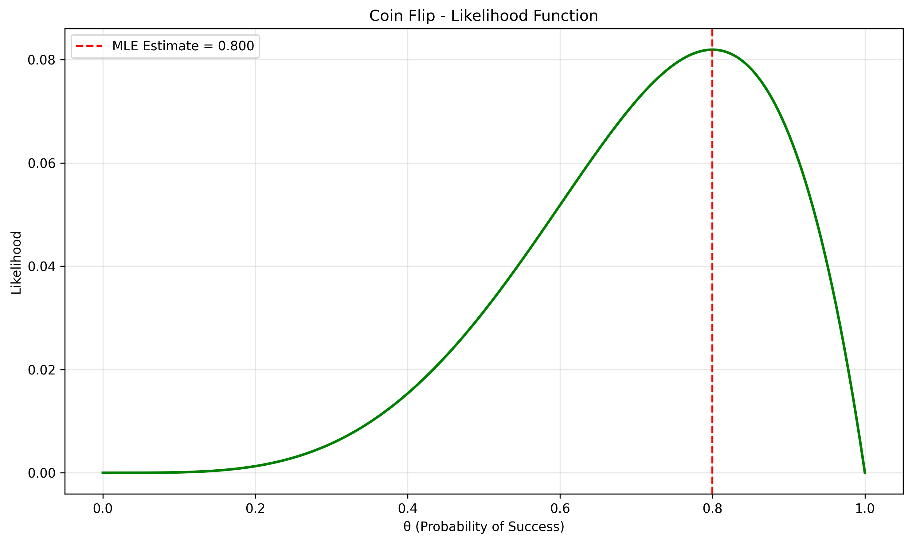
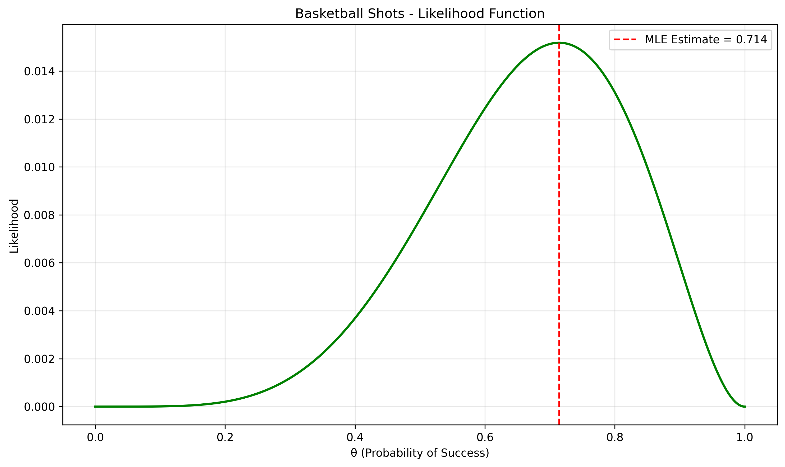
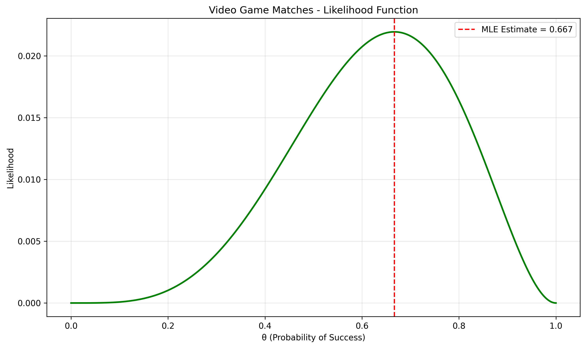
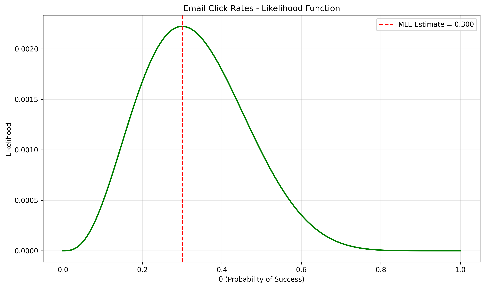

# Bernoulli Distribution MLE Examples

This document provides practical examples of Maximum Likelihood Estimation (MLE) for Bernoulli distributions, illustrating the concept of estimating parameters from binary outcome data and its significance in statistical inference.

## Key Concepts and Formulas

The Bernoulli distribution is a discrete probability distribution that models binary outcomes (success/failure, yes/no, 1/0). MLE provides a method to estimate the probability parameter θ based on observed data.

### The Bernoulli MLE Formula

$$L(\theta | \text{data}) = \prod_{i=1}^n \theta^{x_i} \cdot (1-\theta)^{1-x_i}$$

This can be simplified to:

$$L(\theta | \text{data}) = \theta^s \cdot (1-\theta)^{n-s}$$

The maximum likelihood estimator is:

$$\hat{\theta}_{MLE} = \frac{s}{n}$$

Where:
- $\theta$ = probability parameter we're trying to estimate
- $x_i$ = observed data points (0 or 1)
- $s$ = number of successes (1's)
- $n$ = total number of trials

## Binary Outcome Examples

The following examples demonstrate MLE for binary variables (Bernoulli distribution):

- **Coin Flips**: Estimating the bias of a coin
- **Basketball Free Throws**: Calculating a player's success rate
- **Video Game Wins**: Determining a player's win probability
- **Email Click Rates**: Analyzing marketing campaign effectiveness

### Example 1: Coin Flips

#### Problem Statement
You've found an old coin and want to determine if it's fair (50% chance of heads) or biased. You flip the coin 5 times and get 4 heads and 1 tail (80% heads). How can you estimate the true probability of getting heads? MLE provides a straightforward approach based solely on the observed data.

In this example:
- The data consists of 5 coin flips with 4 heads (successes)
- We assume each flip follows a Bernoulli distribution
- MLE estimates the probability parameter (θ)
- The analysis relies solely on the observed flips without prior assumptions

#### Solution

##### Step 1: Gather the data
- Number of successes (heads) = 4
- Number of trials = 5
- Number of failures (tails) = 1

##### Step 2: Define the likelihood function
For Bernoulli data, the likelihood function is:

$$L(\theta | \text{data}) = \prod_{i=1}^n \theta^{x_i} \cdot (1-\theta)^{1-x_i}$$

This can be simplified to:

$$L(\theta | \text{data}) = \theta^s \cdot (1-\theta)^{n-s}$$

##### Step 3: Calculate MLE
For a Bernoulli distribution, the MLE for the probability parameter is simply the proportion of successes:

$$\hat{\theta}_{MLE} = \frac{s}{n}$$

$$\hat{\theta}_{MLE} = \frac{4}{5}$$

$$\hat{\theta}_{MLE} = 0.8 \text{ or } 80\%$$

##### Step 4: Confidence interval (optional)
For Bernoulli data, we can calculate an approximate 95% confidence interval using:

$$\text{CI} = \hat{\theta}_{MLE} \pm 1.96 \cdot \sqrt{\frac{\hat{\theta}_{MLE} \cdot (1-\hat{\theta}_{MLE})}{n}}$$

$$\text{CI} = 0.8 \pm 1.96 \cdot \sqrt{\frac{0.8 \cdot 0.2}{5}}$$

$$\text{CI} = 0.8 \pm 1.96 \cdot \sqrt{\frac{0.16}{5}}$$

$$\text{CI} = 0.8 \pm 1.96 \cdot \sqrt{0.032}$$

$$\text{CI} = 0.8 \pm 1.96 \cdot 0.179$$

$$\text{CI} = 0.8 \pm 0.35$$

$$\text{CI} = [0.45, 1] \text{ (capped at 1)}$$

However, this sample size is too small for a reliable confidence interval using normal approximation.

##### Step 5: Interpret the results
Based on the MLE analysis, the estimated probability of the coin landing heads is 80%. This suggests the coin might be biased toward heads, but with only 5 flips, there's considerable uncertainty in this estimate.



### Example 2: Basketball Free Throws

#### Problem Statement
A basketball player wants to estimate their free throw success rate. They attempt 7 free throws and make 5 of them (71.4% success rate). Using MLE, they can estimate their true success rate based solely on this observed data.

In this example:
- The data consists of 7 free throw attempts with 5 successes
- We assume each attempt follows a Bernoulli distribution
- MLE estimates the probability of success
- The analysis relies solely on the observed attempts without prior assumptions

#### Solution

##### Step 1: Gather the data
- Number of successes (made shots) = 5
- Number of trials = 7
- Number of failures (missed shots) = 2

##### Step 2: Apply the MLE formula
For Bernoulli data, the MLE is the proportion of successes:

$$\hat{\theta}_{MLE} = \frac{s}{n} = \frac{5}{7} = 0.714 \text{ or } 71.4\%$$

The MLE analysis estimates a success rate of 71.4%, which represents the player's best estimate of their true ability based only on these 7 attempts.



### Example 3: Video Game Wins

#### Problem Statement
A player wants to track their win rate in a video game. They play 6 matches and win 4 of them (66.7% win rate). Using MLE, they can estimate their true win probability based solely on these matches.

In this example:
- The data consists of 6 game matches with 4 wins
- We assume each match follows a Bernoulli distribution
- MLE estimates the probability of winning
- The analysis relies solely on the observed matches without prior assumptions

#### Solution

##### Step 1: Gather the data
- Number of successes (wins) = 4
- Number of trials (matches) = 6
- Number of failures (losses) = 2

##### Step 2: Apply the MLE formula
For Bernoulli data, the MLE is the proportion of successes:

$$\hat{\theta}_{MLE} = \frac{s}{n} = \frac{4}{6} = 0.667 \text{ or } 66.7\%$$

The MLE analysis estimates a win rate of 66.7%, which represents the player's best estimate of their true skill level based only on these 6 matches.



### Example 4: Email Click Rates

#### Problem Statement
A marketer is analyzing the performance of an email campaign. They sent 10 emails and 3 recipients clicked on the embedded link (30% click rate). Using MLE, they can estimate the true click-through rate based solely on this observed data.

In this example:
- The data consists of 10 emails with 3 clicks
- We assume each email interaction follows a Bernoulli distribution
- MLE estimates the probability of a recipient clicking the link
- The analysis relies solely on the observed interactions without prior assumptions

#### Solution

##### Step 1: Gather the data
- Number of successes (clicks) = 3
- Number of trials (emails) = 10
- Number of failures (no clicks) = 7

##### Step 2: Apply the MLE formula
For Bernoulli data, the MLE is the proportion of successes:

$$\hat{\theta}_{MLE} = \frac{s}{n} = \frac{3}{10} = 0.3 \text{ or } 30\%$$

The MLE analysis estimates a click-through rate of 30%, which represents the best estimate of the campaign's effectiveness based only on these 10 emails.



## Key Insights and Takeaways

### Theoretical Insights
- The MLE for a Bernoulli distribution is simply the proportion of successes in the sample
- This estimate represents the value of θ that makes the observed data most likely
- As sample size increases, the MLE approaches the true parameter value

### Practical Applications
- A/B testing in marketing and product development
- Quality control in manufacturing (pass/fail testing)
- Medical screening tests (positive/negative results)
- Sports analytics (hit/miss, win/loss statistics)

### Common Pitfalls
- Small sample sizes can lead to unreliable estimates
- Confidence intervals become unreliable with small samples
- The MLE provides a point estimate without uncertainty information unless confidence intervals are calculated
- Assumes independence between trials, which may not hold in all applications

## Running the Examples

You can run the code that generates these examples and visualizations using:

```bash
python3 ML_Obsidian_Vault/Lectures/2/Code/bernoulli_mle_examples.py
```

## Related Topics

- [[L2_3_Likelihood_Examples|Likelihood Examples]]: General concepts of likelihood
- [[L2_4_MLE_Examples|MLE Examples]]: Other distributions' MLE calculations
