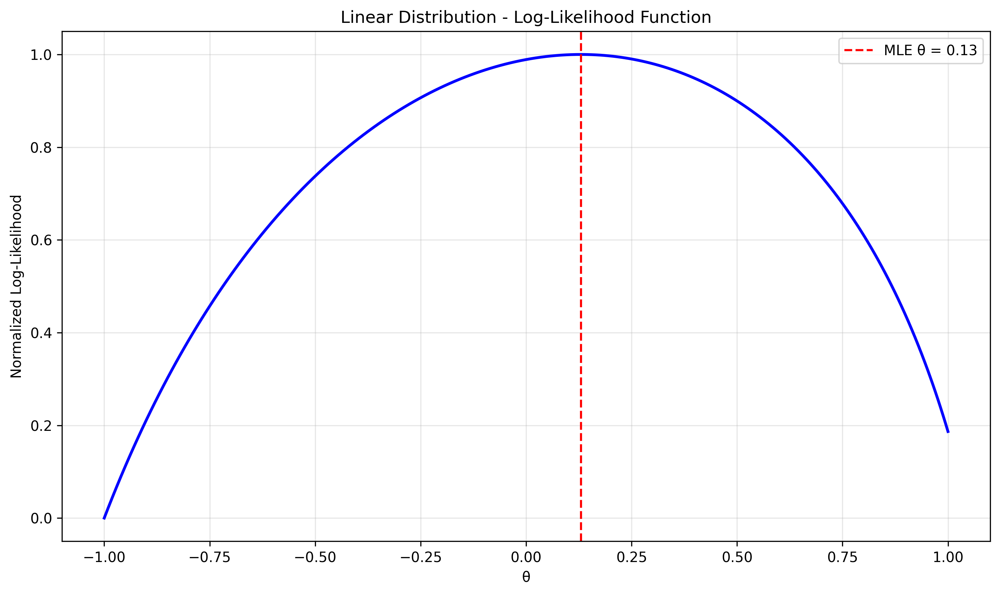
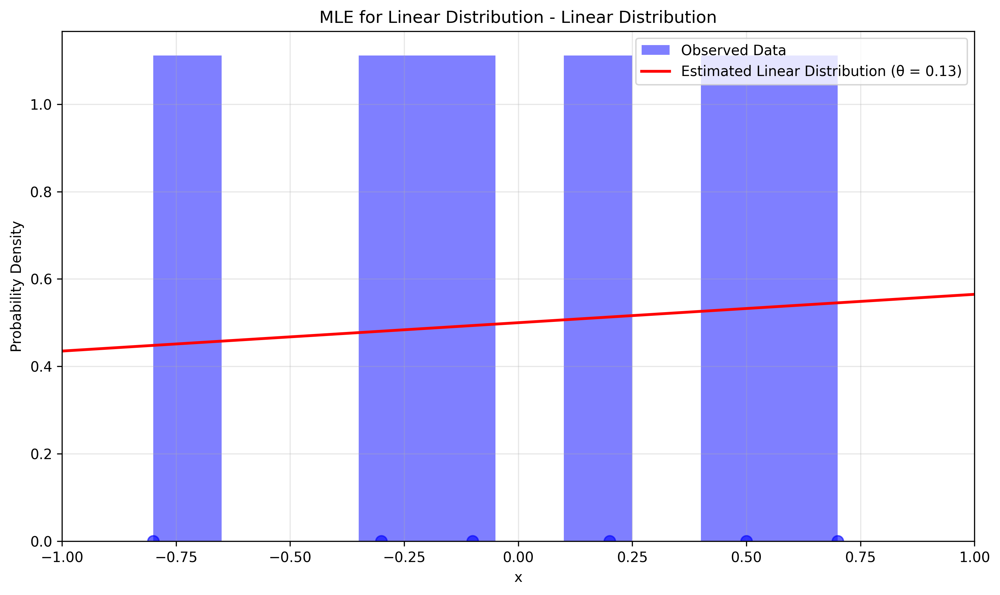

# Linear Distribution MLE Examples

This document contains examples of Maximum Likelihood Estimation (MLE) for Linear distributions.

## Problem Statement
A researcher is studying a linear distribution with the probability density function:

$$f(x|\theta) = \frac{1}{2}(1 + \theta x), \quad -1 \leq x \leq 1$$

where θ is the parameter to be estimated. Using MLE, we can estimate the true value of θ based on the observed data.

In this example:
- The data consists of 6 observations: -0.8, 0.2, 0.5, -0.3, 0.7, -0.1
- We assume the measurements follow the given linear distribution
- MLE estimates the parameter θ
- The analysis relies solely on the observed data without prior assumptions

## Detailed Calculation

**Step 1: Gather the data**
- Observed values: -0.8, 0.2, 0.5, -0.3, 0.7, -0.1
- Number of observations (n) = 6

**Step 2: Define the likelihood function**
For the given linear distribution, the likelihood function is:

$$L(\theta | \text{data}) = \prod_{i=1}^{n} f(x_i | \theta) = \prod_{i=1}^{n} \frac{1}{2}(1 + \theta x_i)$$

**Step 3: Calculate the log-likelihood**
Taking the natural logarithm of the likelihood function:

$$\ln L(\theta | \text{data}) = \sum_{i=1}^{n} \ln\left(\frac{1}{2}(1 + \theta x_i)\right)$$
$$\ln L(\theta | \text{data}) = n\ln\left(\frac{1}{2}\right) + \sum_{i=1}^{n} \ln(1 + \theta x_i)$$

**Step 4: Find the MLE by maximizing the log-likelihood**
To find the maximum, we take the derivative with respect to θ and set it to zero:

$$\frac{d}{d\theta} [\ln L(\theta | \text{data})] = \sum_{i=1}^{n} \frac{x_i}{1 + \theta x_i} = 0$$

This equation needs to be solved numerically since there's no closed-form solution.

**Step 5: Calculate the MLE numerically**
Using numerical optimization, we find:
$\theta_{MLE} \approx 0.13$

## Simplified Method for Exams

For this distribution, there's no simple closed-form solution like in the power law case. The MLE must be found numerically by solving:

$$\sum_{i=1}^{n} \frac{x_i}{1 + \theta x_i} = 0$$

This can be done using numerical methods like Newton-Raphson or by using optimization algorithms.

**Step 6: Interpret the results**
Based on the MLE analysis, the estimated parameter θ is approximately 0.13. This value characterizes the linear distribution of the observed data. A positive θ indicates that the probability density increases with x, while a negative θ would indicate the opposite. In this case, the small positive value suggests a slight positive trend in the data.

The following visualizations help understand the MLE process and the fitted distribution:

1. **Log-Likelihood Function**: Shows how the likelihood varies with different values of θ, with the MLE at the peak.



2. **Distribution Comparison**: Shows the observed data (histogram), the fitted linear distribution (red line).



The visualizations demonstrate that:
- The log-likelihood function has a clear maximum at θ ≈ 0.13
- The fitted linear distribution (red line) matches the observed data well


## Running the Examples

You can run the examples using the Python files:

```bash
python3 ML_Obsidian_Vault/Lectures/2/Codes/linear_mle_examples.py
```