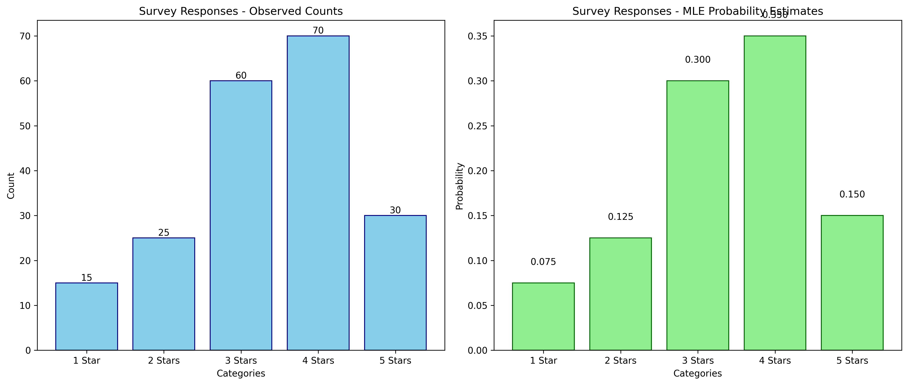
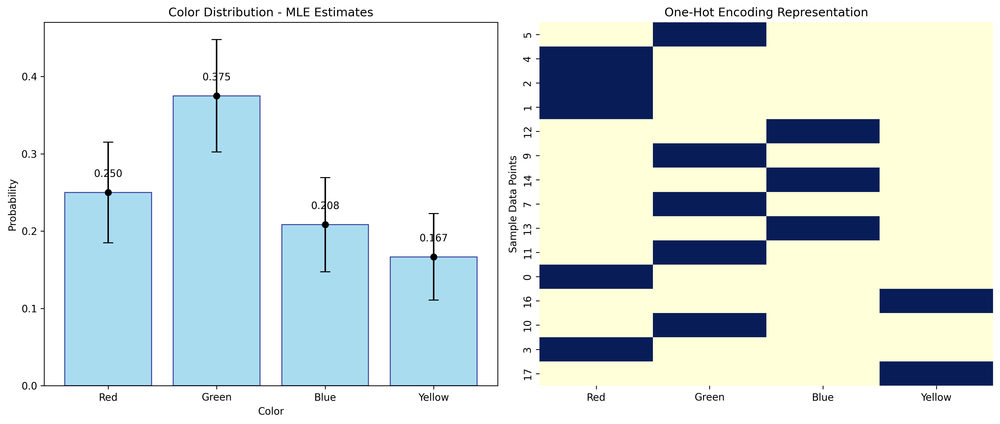
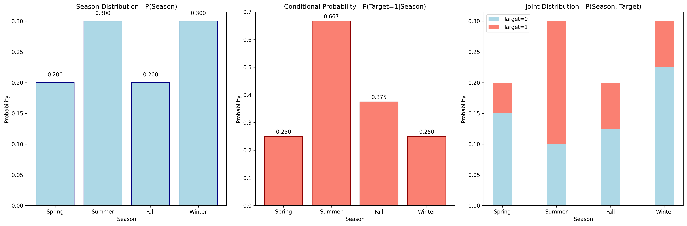

# Multinomial Distribution MLE Examples

This document provides practical examples of Maximum Likelihood Estimation (MLE) for Multinomial distributions, illustrating the concept of estimating categorical probability parameters and its significance in analyzing data with multiple discrete outcomes.

## Key Concepts and Formulas

The Multinomial distribution is an extension of the binomial distribution to multiple categories. It models the probability of counts for each category in a fixed number of independent trials, where each trial results in exactly one of k possible outcomes.

### The Multinomial MLE Formula

For a multinomial distribution with $k$ categories, the likelihood function is:

$$L(\theta) = \prod_{i=1}^{k} \theta_i^{x_i}$$

The log-likelihood function:

$$\ell(\theta) = \sum_{i=1}^{k} x_i \ln(\theta_i)$$

Subject to the constraint:

$$\sum_{i=1}^{k} \theta_i = 1$$

Using Lagrange multipliers and solving the optimization problem, the maximum likelihood estimator for each probability parameter is:

$$\hat{\theta}_i = \frac{x_i}{\sum_{j=1}^{k} x_j}$$

Where:
- $\theta_i$ = probability of category $i$
- $x_i$ = observed count for category $i$
- $\sum_{j=1}^{k} x_j$ = total number of observations

## Categorical Data Examples

The following examples demonstrate MLE for categorical variables (Multinomial distribution):

- **Six-Sided Die**: Testing fairness of a die
- **Survey Responses**: Analyzing customer ratings
- **One-Hot Encoding**: Relating categorical encoding to multinomial distribution
- **Information Gain**: Using categorical features for classification

### Example 1: Six-Sided Die

#### Problem Statement
You want to test if a six-sided die is fair by analyzing the frequency of each face. After rolling the die 50 times, you observe the following counts: Face 1: 7 times, Face 2: 5 times, Face 3: 9 times, Face 4: 12 times, Face 5: 8 times, and Face 6: 9 times. Assuming the rolls follow a multinomial distribution, MLE can help estimate the probability parameter for each face.

In this example:
- The data consists of 50 die rolls with counts for each of the six faces
- We assume the rolls follow a multinomial distribution
- MLE estimates the probability parameters for each face
- The analysis relies solely on the observed data without prior assumptions

#### Solution

##### Step 1: Gather the data
- Observed counts:
  - Face 1: 7 times
  - Face 2: 5 times
  - Face 3: 9 times
  - Face 4: 12 times
  - Face 5: 8 times
  - Face 6: 9 times
- Total number of rolls (N) = 50

##### Step 2: Define the likelihood function
For multinomially distributed data, the likelihood function is:

$$L(p_1, p_2, \dots, p_6 | \text{data}) = \frac{N!}{x_1! \times x_2! \times \dots \times x_6!} \times p_1^{x_1} \times p_2^{x_2} \times \dots \times p_6^{x_6}$$

Where:
- $p_1, p_2, \dots, p_6$ are the probability parameters we're trying to estimate
- $x_1, x_2, \dots, x_6$ are the observed counts for each category
- $N$ is the total number of observations ($\sum x_i$)

##### Step 3: Calculate MLE
For a multinomial distribution, the MLE for each probability parameter is simply the proportion of occurrences in the category:

$$p_i^{\text{MLE}} = \frac{x_i}{N}$$

Therefore:
- $p_1^{\text{MLE}} = \frac{7}{50} = 0.14$ (14%)
- $p_2^{\text{MLE}} = \frac{5}{50} = 0.10$ (10%)
- $p_3^{\text{MLE}} = \frac{9}{50} = 0.18$ (18%)
- $p_4^{\text{MLE}} = \frac{12}{50} = 0.24$ (24%)
- $p_5^{\text{MLE}} = \frac{8}{50} = 0.16$ (16%)
- $p_6^{\text{MLE}} = \frac{9}{50} = 0.18$ (18%)

##### Step 4: Confidence intervals
We can calculate approximate 95% confidence intervals for each parameter using:

$$\text{CI} = p_i^{\text{MLE}} \pm 1.96 \times \sqrt{\frac{p_i^{\text{MLE}} \times (1-p_i^{\text{MLE}})}{N}}$$

For example, for Face 1:

$$\text{CI} = 0.14 \pm 1.96 \times \sqrt{\frac{0.14 \times 0.86}{50}}$$

$$\text{CI} = 0.14 \pm 1.96 \times \sqrt{0.0024}$$

$$\text{CI} = 0.14 \pm 1.96 \times 0.049$$

$$\text{CI} = 0.14 \pm 0.096$$

$$\text{CI} = [0.044, 0.236]$$

##### Step 5: Interpret the results
Based on the MLE analysis, the estimated probabilities differ from what we'd expect from a fair die ($\frac{1}{6} \approx 0.167$ for each face). Face 4 appears to have the highest probability (0.24), while Face 2 has the lowest (0.10). However, the confidence intervals for all faces include the theoretical probability of 0.167, so we don't have strong evidence that the die is unfair based on this sample.


### Example 2: Survey Responses

#### Problem Statement
A marketing team conducted a survey asking customers to rate their product on a scale from 1 to 5 stars. Out of 200 responses, they received: 1 star: 15 responses, 2 stars: 25 responses, 3 stars: 60 responses, 4 stars: 70 responses, and 5 stars: 30 responses. The team wants to estimate the true probability distribution of customer ratings.

In this example:
- The data consists of 200 survey responses across 5 rating categories
- We assume the ratings follow a multinomial distribution
- MLE estimates the probability parameters for each rating category
- The analysis relies solely on the observed data without prior assumptions

#### Solution

##### Step 1: Gather the data
- Observed counts:
  - 1 star: 15 responses
  - 2 stars: 25 responses
  - 3 stars: 60 responses
  - 4 stars: 70 responses
  - 5 stars: 30 responses
- Total number of responses (N) = 200

##### Step 2: Apply the MLE formula
For a multinomial distribution, the MLE for each probability parameter is:

$$p_i^{\text{MLE}} = \frac{x_i}{N}$$

Therefore:
- $p_1^{\text{MLE}} = \frac{15}{200} = 0.075$ (7.5%)
- $p_2^{\text{MLE}} = \frac{25}{200} = 0.125$ (12.5%)
- $p_3^{\text{MLE}} = \frac{60}{200} = 0.30$ (30%)
- $p_4^{\text{MLE}} = \frac{70}{200} = 0.35$ (35%)
- $p_5^{\text{MLE}} = \frac{30}{200} = 0.15$ (15%)

##### Step 3: Interpret the results
Based on the MLE analysis, the estimated distribution shows that 4-star ratings are most common (35%), followed by 3-star ratings (30%). The majority of ratings (80%) are in the 3-5 star range, indicating generally positive customer sentiment. The marketing team can use these estimates to understand the true distribution of customer opinions about their product.



### Example 3: One-Hot Encoding and Multinomial Distribution

#### Problem Statement
A machine learning engineer is analyzing a dataset with a categorical feature "Color" that has 4 possible values: Red, Green, Blue, and Yellow. The engineer one-hot encodes this feature, creating 4 binary columns. In a sample of 120 observations, the counts for each color are:
- Red: 30 observations
- Green: 45 observations 
- Blue: 25 observations
- Yellow: 20 observations

#### Task
1. Explain how one-hot encoding relates to the multinomial distribution
2. Calculate the maximum likelihood estimate for the probability of each color
3. Using the MLE estimates, what is the probability that a randomly selected observation from the same population will be either Red or Blue?
4. Calculate the 90% confidence interval for the probability of Green

#### Solution

##### Step 1: One-Hot Encoding and Multinomial Distribution
One-hot encoding transforms categorical variables into a binary vector representation where:
- Each category gets its own binary column (0 or 1)
- Exactly one column is 1 ('hot'), all others are 0 for each observation
- For example: Red → [1,0,0,0], Green → [0,1,0,0], etc.

The connection to multinomial distribution:
- The counts of each category follow a multinomial distribution
- The true probabilities of each category are the parameters we estimate using MLE
- One-hot encoding is essentially creating indicator variables for each category

##### Step 2: Calculate MLE for each color probability
For a multinomial distribution, the MLE for each probability parameter is:

$$p_i^{\text{MLE}} = \frac{x_i}{N}$$

- $p_{\text{Red}}^{\text{MLE}} = \frac{30}{120} = 0.250$ (25.0%)
- $p_{\text{Green}}^{\text{MLE}} = \frac{45}{120} = 0.375$ (37.5%)
- $p_{\text{Blue}}^{\text{MLE}} = \frac{25}{120} = 0.208$ (20.8%)
- $p_{\text{Yellow}}^{\text{MLE}} = \frac{20}{120} = 0.167$ (16.7%)

##### Step 3: Probability of Red or Blue
The probability that a randomly selected observation will be either Red or Blue is the sum of their individual probabilities:

$$P(\text{Red or Blue}) = P(\text{Red}) + P(\text{Blue}) = 0.250 + 0.208 = 0.458 \text{ or } 45.8\%$$

##### Step 4: 90% Confidence Interval for Green
For a 90% confidence interval, we use the z-score of 1.645 (for a 90% confidence level):

$$\text{CI} = p_{\text{Green}}^{\text{MLE}} \pm 1.645 \times \sqrt{\frac{p_{\text{Green}}^{\text{MLE}} \times (1-p_{\text{Green}}^{\text{MLE}})}{N}}$$

$$\text{CI} = 0.375 \pm 1.645 \times \sqrt{\frac{0.375 \times 0.625}{120}}$$

$$\text{CI} = 0.375 \pm 1.645 \times \sqrt{0.00195}$$

$$\text{CI} = 0.375 \pm 1.645 \times 0.044$$

$$\text{CI} = 0.375 \pm 0.073$$

$$\text{CI} = [0.302, 0.448]$$

This means we are 90% confident that the true probability of Green is between 30.2% and 44.8%.



### Example 4: Information Gain with One-Hot Encoded Features

#### Problem Statement
In a classification task, a data scientist has a categorical feature "Season" with four values: Spring, Summer, Fall, and Winter. After one-hot encoding, they have binary features for each season. In their dataset of 200 samples with a binary target variable (0 or 1), they observe the following:

| Season  | Target=0 | Target=1 | Total |
|---------|----------|----------|-------|
| Spring  | 30       | 10       | 40    |
| Summer  | 20       | 40       | 60    |
| Fall    | 25       | 15       | 40    |
| Winter  | 45       | 15       | 60    |
| Total   | 120      | 80       | 200   |

#### Task
1. Calculate the maximum likelihood estimate for the probability of each season in the dataset
2. Calculate the maximum likelihood estimate for the probability of Target=1 given each season
3. Calculate the entropy of the target variable before knowing the season
4. Calculate the conditional entropy of the target variable given the season
5. Calculate the information gain provided by the Season feature

#### Solution

##### Step 1: MLE for Season Probabilities
The maximum likelihood estimate for the probability of each season is:

- $P(\text{Spring}) = \frac{40}{200} = 0.200$ (20.0%)
- $P(\text{Summer}) = \frac{60}{200} = 0.300$ (30.0%)
- $P(\text{Fall}) = \frac{40}{200} = 0.200$ (20.0%)
- $P(\text{Winter}) = \frac{60}{200} = 0.300$ (30.0%)

##### Step 2: MLE for Conditional Probabilities P(Target=1|Season)
The conditional probability of Target=1 given each season is:

- $P(\text{Target=1}|\text{Spring}) = \frac{10}{40} = 0.250$ (25.0%)
- $P(\text{Target=1}|\text{Summer}) = \frac{40}{60} = 0.667$ (66.7%)
- $P(\text{Target=1}|\text{Fall}) = \frac{15}{40} = 0.375$ (37.5%)
- $P(\text{Target=1}|\text{Winter}) = \frac{15}{60} = 0.250$ (25.0%)

##### Step 3: Entropy of Target Variable
The probability distribution of the target variable is:
- $P(\text{Target=0}) = \frac{120}{200} = 0.600$ (60.0%)
- $P(\text{Target=1}) = \frac{80}{200} = 0.400$ (40.0%)

The entropy of the target variable is:

$$H(\text{Target}) = -[P(\text{Target=0}) \times \log_2(P(\text{Target=0})) + P(\text{Target=1}) \times \log_2(P(\text{Target=1}))]$$

$$H(\text{Target}) = -[0.600 \times \log_2(0.600) + 0.400 \times \log_2(0.400)]$$

$$H(\text{Target}) = -[0.600 \times (-0.737) + 0.400 \times (-1.322)]$$

$$H(\text{Target}) = -[-0.442 - 0.529]$$

$$H(\text{Target}) = 0.971 \text{ bits}$$

##### Step 4: Conditional Entropy of Target Given Season
For each season, we calculate the entropy of the target variable:

$$H(\text{Target}|\text{Spring}) = -[0.750 \times \log_2(0.750) + 0.250 \times \log_2(0.250)] = 0.811 \text{ bits}$$

$$H(\text{Target}|\text{Summer}) = -[0.333 \times \log_2(0.333) + 0.667 \times \log_2(0.667)] = 0.918 \text{ bits}$$

$$H(\text{Target}|\text{Fall}) = -[0.625 \times \log_2(0.625) + 0.375 \times \log_2(0.375)] = 0.954 \text{ bits}$$

$$H(\text{Target}|\text{Winter}) = -[0.750 \times \log_2(0.750) + 0.250 \times \log_2(0.250)] = 0.811 \text{ bits}$$

The conditional entropy is the weighted average of these entropies:

$$H(\text{Target}|\text{Season}) = \sum_{s} P(\text{Season=s}) \times H(\text{Target}|\text{Season=s})$$

$$H(\text{Target}|\text{Season}) = 0.200 \times 0.811 + 0.300 \times 0.918 + 0.200 \times 0.954 + 0.300 \times 0.811$$

$$H(\text{Target}|\text{Season}) = 0.162 + 0.275 + 0.191 + 0.243 = 0.872 \text{ bits}$$

##### Step 5: Information Gain
The information gain provided by the Season feature is:

$$\text{Information Gain} = H(\text{Target}) - H(\text{Target}|\text{Season})$$

$$\text{Information Gain} = 0.971 - 0.872 = 0.099 \text{ bits}$$

This means that knowing the Season reduces the uncertainty about the Target variable by 0.099 bits, or approximately 10.2% of the original entropy.



## Key Insights and Takeaways

### Theoretical Insights
- The MLE for a multinomial distribution parameter is simply the proportion of observations in that category
- This estimate represents the value of θᵢ that makes the observed data most likely
- The constraint that all probabilities must sum to 1 is handled implicitly by using proportions
- As sample size increases, the MLE approaches the true parameter values

### Practical Applications
- Testing the fairness of dice, cards, or other gaming equipment
- Analyzing survey data with multiple response categories
- Market share analysis across multiple competitors
- Political polling and vote distribution estimation
- DNA sequence analysis and nucleotide frequency estimation
- Feature engineering and evaluation in machine learning
- Information gain calculation for decision trees and other classifiers

### Common Pitfalls
- Small sample sizes can lead to unreliable estimates
- Zero counts in categories require special handling in some contexts
- The assumption of independence between trials may not hold in all applications
- Confidence intervals become less reliable with small expected counts in any category

## Running the Examples

You can run the code that generates these examples and visualizations using:

```bash
python3 ML_Obsidian_Vault/Lectures/2/Codes/multinomial_mle_examples.py
```

## Related Topics

- [[L2_3_Likelihood_Examples|Likelihood Examples]]: General concepts of likelihood
- [[L2_4_MLE_Examples|MLE Examples]]: Other distributions' MLE calculations
