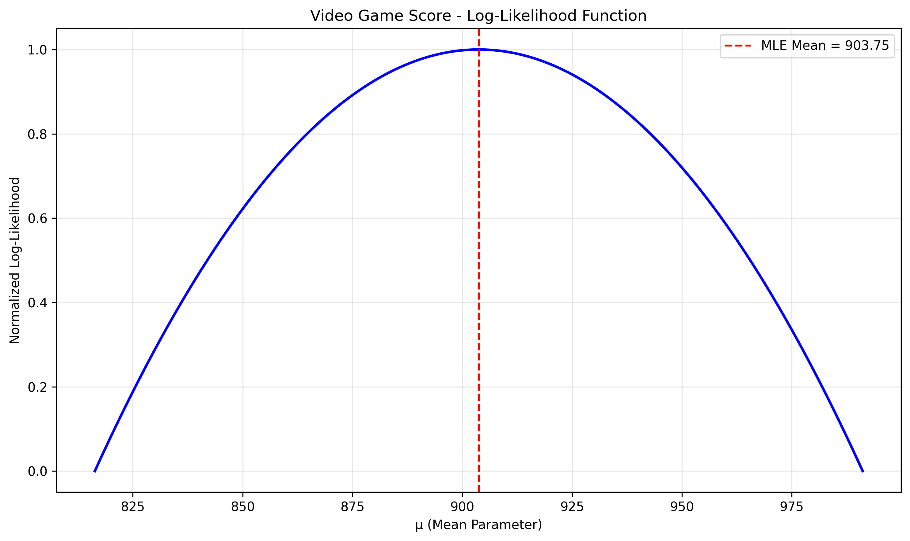

# Normal Distribution MLE Examples

This document contains examples of Maximum Likelihood Estimation (MLE) for Normal distributions.

## The MLE Formula

For a normal distribution, the MLE formulas for mean and variance are:

$$
\hat{\mu}_{MLE} = \frac{1}{n}\sum_{i=1}^{n}x_i
$$

$$
\hat{\sigma}^2_{MLE} = \frac{1}{n}\sum_{i=1}^{n}(x_i - \hat{\mu}_{MLE})^2
$$

Where:
- $\hat{\mu}_{MLE}$ = MLE estimate of mean
- $\hat{\sigma}^2_{MLE}$ = MLE estimate of variance
- $x_i$ = Individual observations
- $n$ = Number of observations


## Normal Distribution Examples

The following examples demonstrate MLE for continuous variables (normal distribution):

- **Basketball Shot Distance**: Analyzing shooting distances
- **Video Game Score**: Evaluating gaming performance
- **Test Scores**: Analyzing academic performance
- **Daily Steps**: Monitoring physical activity levels
- **Ball Bearing Diameter**: Assessing manufacturing consistency

### Example 1: Basketball Shot Distance

#### Problem Statement
A basketball player is practicing shots from different distances and wants to analyze their typical shot distance. The player measures the distance (in feet) of 7 shot attempts: 13.8, 14.2, 15.1, 13.5, 15.8, 14.9, and 15.5 feet. Assuming the distances follow a normal distribution, calculate the maximum likelihood estimates for:

1. The mean (μ) of the shot distances
2. The variance (σ²) of the shot distances

#### Step-by-Step Calculation

**Step 1: Gather the data**
- Observed distances: 13.8, 14.2, 15.1, 13.5, 15.8, 14.9, and 15.5 feet
- Number of observations (n) = 7

**Step 2: Calculate MLE for mean**
For normally distributed data, the MLE for the mean is the sample mean:

$$
\hat{\mu}_{MLE} = \frac{1}{n}\sum_{i=1}^{n}x_i
$$

Calculate the sum of all observations:
$$
\begin{align*}
\sum_{i=1}^{n}x_i &= 13.8 + 14.2 + 15.1 + 13.5 + 15.8 + 14.9 + 15.5 \\
&= 102.8 \text{ feet}
\end{align*}
$$

Now calculate the MLE for the mean:
$$
\hat{\mu}_{MLE} = \frac{102.8}{7} = 14.69 \text{ feet}
$$

**Step 3: Calculate MLE for variance**
For normally distributed data, the MLE for variance is:

$$
\hat{\sigma}^2_{MLE} = \frac{1}{n}\sum_{i=1}^{n}(x_i - \hat{\mu}_{MLE})^2
$$

Calculating the deviations from the mean:
$$
\begin{align*}
x_1 - \hat{\mu}_{MLE} &= 13.8 - 14.69 = -0.89 \\
x_2 - \hat{\mu}_{MLE} &= 14.2 - 14.69 = -0.49 \\
x_3 - \hat{\mu}_{MLE} &= 15.1 - 14.69 = 0.41 \\
x_4 - \hat{\mu}_{MLE} &= 13.5 - 14.69 = -1.19 \\
x_5 - \hat{\mu}_{MLE} &= 15.8 - 14.69 = 1.11 \\
x_6 - \hat{\mu}_{MLE} &= 14.9 - 14.69 = 0.21 \\
x_7 - \hat{\mu}_{MLE} &= 15.5 - 14.69 = 0.81
\end{align*}
$$

Squaring each deviation:
$$
\begin{align*}
(x_1 - \hat{\mu}_{MLE})^2 &= (-0.89)^2 = 0.7845 \\
(x_2 - \hat{\mu}_{MLE})^2 &= (-0.49)^2 = 0.2359 \\
(x_3 - \hat{\mu}_{MLE})^2 &= (0.41)^2 = 0.1716 \\
(x_4 - \hat{\mu}_{MLE})^2 &= (-1.19)^2 = 1.4059 \\
(x_5 - \hat{\mu}_{MLE})^2 &= (1.11)^2 = 1.2416 \\
(x_6 - \hat{\mu}_{MLE})^2 &= (0.21)^2 = 0.0459 \\
(x_7 - \hat{\mu}_{MLE})^2 &= (0.81)^2 = 0.6631
\end{align*}
$$

Sum of squared deviations:
$$
\begin{align*}
\sum_{i=1}^{n}(x_i - \hat{\mu}_{MLE})^2 &= 0.7845 + 0.2359 + 0.1716 + 1.4059 + 1.2416 + 0.0459 + 0.6631 \\
&= 4.55 \text{ feet}^2
\end{align*}
$$

The MLE for variance:
$$
\hat{\sigma}^2_{MLE} = \frac{4.55}{7} = 0.65 \text{ feet}^2
$$

**Step 4: Calculate MLE for standard deviation**
The MLE for standard deviation is the square root of the MLE for variance:

$$
\hat{\sigma}_{MLE} = \sqrt{0.65} = 0.81 \text{ feet}
$$

**Step 5: Calculate confidence interval for the mean**
The standard error of the mean (SEM) is:

$$
\text{SEM} = \frac{\hat{\sigma}_{MLE}}{\sqrt{n}} = \frac{0.81}{\sqrt{7}} = 0.30 \text{ feet}
$$

For a 95% confidence interval (using z = 1.96):

$$
\begin{align*}
95\% \text{ CI} &= \hat{\mu}_{MLE} \pm 1.96 \times \text{SEM} \\
&= 14.69 \pm 1.96 \times 0.30 \\
&= 14.69 \pm 0.59 \\
&= [14.09, 15.28]
\end{align*}
$$

**Step 6: Interpret the results**
- The MLE for the mean shot distance is 14.69 feet
- The MLE for the standard deviation is 0.81 feet
- We are 95% confident that the true mean distance is between 14.09 and 15.28 feet
- Approximately 68% of shots are expected to fall within one standard deviation of the mean: [13.88, 15.49] feet
- Approximately 95% of shots are expected to fall within two standard deviations of the mean: [13.07, 16.30] feet


### Example 2: Video Game Score

#### Problem Statement
A gamer wants to analyze their performance in a video game by tracking their scores. They recorded 8 recent scores: 850, 920, 880, 950, 910, 890, 930, and 900. Assuming the scores follow a normal distribution, calculate the maximum likelihood estimates for:

1. The mean (μ) of the game scores
2. The variance (σ²) of the game scores

#### Step-by-Step Calculation

**Step 1: Gather the data**
- Observed scores: 850, 920, 880, 950, 910, 890, 930, and 900
- Number of observations (n) = 8

**Step 2: Calculate MLE for mean**
For normally distributed data, the MLE for mean is the sample mean:

$$
\hat{\mu}_{MLE} = \frac{1}{n}\sum_{i=1}^{n}x_i
$$

Calculate the sum of all observations:
$$
\begin{align*}
\sum_{i=1}^{n}x_i &= 850 + 920 + 880 + 950 + 910 + 890 + 930 + 900 \\
&= 7230
\end{align*}
$$

Now calculate the MLE for the mean:
$$
\hat{\mu}_{MLE} = \frac{7230}{8} = 903.75
$$

**Step 3: Calculate MLE for variance**
For normally distributed data, the MLE for variance is:

$$
\hat{\sigma}^2_{MLE} = \frac{1}{n}\sum_{i=1}^{n}(x_i - \hat{\mu}_{MLE})^2
$$

Calculating the deviations from the mean:
$$
\begin{align*}
x_1 - \hat{\mu}_{MLE} &= 850 - 903.75 = -53.75 \\
x_2 - \hat{\mu}_{MLE} &= 920 - 903.75 = 16.25 \\
x_3 - \hat{\mu}_{MLE} &= 880 - 903.75 = -23.75 \\
x_4 - \hat{\mu}_{MLE} &= 950 - 903.75 = 46.25 \\
x_5 - \hat{\mu}_{MLE} &= 910 - 903.75 = 6.25 \\
x_6 - \hat{\mu}_{MLE} &= 890 - 903.75 = -13.75 \\
x_7 - \hat{\mu}_{MLE} &= 930 - 903.75 = 26.25 \\
x_8 - \hat{\mu}_{MLE} &= 900 - 903.75 = -3.75
\end{align*}
$$

Squaring each deviation:
$$
\begin{align*}
(x_1 - \hat{\mu}_{MLE})^2 &= (-53.75)^2 = 2889.0625 \\
(x_2 - \hat{\mu}_{MLE})^2 &= (16.25)^2 = 264.0625 \\
(x_3 - \hat{\mu}_{MLE})^2 &= (-23.75)^2 = 564.0625 \\
(x_4 - \hat{\mu}_{MLE})^2 &= (46.25)^2 = 2139.0625 \\
(x_5 - \hat{\mu}_{MLE})^2 &= (6.25)^2 = 39.0625 \\
(x_6 - \hat{\mu}_{MLE})^2 &= (-13.75)^2 = 189.0625 \\
(x_7 - \hat{\mu}_{MLE})^2 &= (26.25)^2 = 689.0625 \\
(x_8 - \hat{\mu}_{MLE})^2 &= (-3.75)^2 = 14.0625
\end{align*}
$$

Sum of squared deviations:
$$
\begin{align*}
\sum_{i=1}^{n}(x_i - \hat{\mu}_{MLE})^2 &= 2889.0625 + 264.0625 + 564.0625 + 2139.0625 \\
&+ 39.0625 + 189.0625 + 689.0625 + 14.0625 \\
&= 6787.5
\end{align*}
$$

The MLE for variance:
$$
\hat{\sigma}^2_{MLE} = \frac{6787.5}{8} = 848.44
$$

**Step 4: Calculate MLE for standard deviation**
The MLE for standard deviation is the square root of the MLE for variance:

$$
\hat{\sigma}_{MLE} = \sqrt{848.44} = 29.13
$$

**Step 5: Calculate confidence interval for the mean**
The standard error of the mean (SEM) is:

$$
\text{SEM} = \frac{\hat{\sigma}_{MLE}}{\sqrt{n}} = \frac{29.13}{\sqrt{8}} = 10.30
$$

For a 95% confidence interval (using z = 1.96):

$$
\begin{align*}
95\% \text{ CI} &= \hat{\mu}_{MLE} \pm 1.96 \times \text{SEM} \\
&= 903.75 \pm 1.96 \times 10.30 \\
&= 903.75 \pm 20.18 \\
&= [883.57, 923.93]
\end{align*}
$$

**Step 6: Interpret the results**
- The MLE for the mean game score is 903.75
- The MLE for the standard deviation is 29.13
- We are 95% confident that the true mean score is between 883.57 and 923.93
- Approximately 68% of scores are expected to fall within one standard deviation of the mean: [874.62, 932.88]
- Approximately 95% of scores are expected to fall within two standard deviations of the mean: [845.49, 962.01]



### Example 3: Test Scores

#### Problem Statement
A teacher wants to analyze class performance on a recent test. The scores for 9 students were: 85, 92, 78, 88, 95, 82, 90, 84, and 88 (as percentages). Assuming the scores follow a normal distribution, calculate the maximum likelihood estimates for:

1. The mean (μ) of the test scores
2. The variance (σ²) of the test scores

#### Step-by-Step Calculation

**Step 1: Gather the data**
- Observed scores: 85, 92, 78, 88, 95, 82, 90, 84, and 88 (percentages)
- Number of observations (n) = 9

**Step 2: Calculate MLE for mean**
For normally distributed data, the MLE for mean is the sample mean:

$$
\hat{\mu}_{MLE} = \frac{1}{n}\sum_{i=1}^{n}x_i
$$

Calculate the sum of all observations:
$$
\begin{align*}
\sum_{i=1}^{n}x_i &= 85 + 92 + 78 + 88 + 95 + 82 + 90 + 84 + 88 \\
&= 782
\end{align*}
$$

Now calculate the MLE for the mean:
$$
\hat{\mu}_{MLE} = \frac{782}{9} = 86.89
$$

**Step 3: Calculate MLE for variance**
For normally distributed data, the MLE for variance is:

$$
\hat{\sigma}^2_{MLE} = \frac{1}{n}\sum_{i=1}^{n}(x_i - \hat{\mu}_{MLE})^2
$$

Calculating the deviations from the mean:
$$
\begin{align*}
x_1 - \hat{\mu}_{MLE} &= 85 - 86.89 = -1.89 \\
x_2 - \hat{\mu}_{MLE} &= 92 - 86.89 = 5.11 \\
x_3 - \hat{\mu}_{MLE} &= 78 - 86.89 = -8.89 \\
x_4 - \hat{\mu}_{MLE} &= 88 - 86.89 = 1.11 \\
x_5 - \hat{\mu}_{MLE} &= 95 - 86.89 = 8.11 \\
x_6 - \hat{\mu}_{MLE} &= 82 - 86.89 = -4.89 \\
x_7 - \hat{\mu}_{MLE} &= 90 - 86.89 = 3.11 \\
x_8 - \hat{\mu}_{MLE} &= 84 - 86.89 = -2.89 \\
x_9 - \hat{\mu}_{MLE} &= 88 - 86.89 = 1.11
\end{align*}
$$

Squaring each deviation:
$$
\begin{align*}
(x_1 - \hat{\mu}_{MLE})^2 &= (-1.89)^2 = 3.57 \\
(x_2 - \hat{\mu}_{MLE})^2 &= (5.11)^2 = 26.12 \\
(x_3 - \hat{\mu}_{MLE})^2 &= (-8.89)^2 = 79.01 \\
(x_4 - \hat{\mu}_{MLE})^2 &= (1.11)^2 = 1.23 \\
(x_5 - \hat{\mu}_{MLE})^2 &= (8.11)^2 = 65.79 \\
(x_6 - \hat{\mu}_{MLE})^2 &= (-4.89)^2 = 23.90 \\
(x_7 - \hat{\mu}_{MLE})^2 &= (3.11)^2 = 9.68 \\
(x_8 - \hat{\mu}_{MLE})^2 &= (-2.89)^2 = 8.35 \\
(x_9 - \hat{\mu}_{MLE})^2 &= (1.11)^2 = 1.23
\end{align*}
$$

Sum of squared deviations:
$$
\begin{align*}
\sum_{i=1}^{n}(x_i - \hat{\mu}_{MLE})^2 &= 3.57 + 26.12 + 79.01 + 1.23 + 65.79 \\
&+ 23.90 + 9.68 + 8.35 + 1.23 \\
&= 218.89
\end{align*}
$$

The MLE for variance:
$$
\hat{\sigma}^2_{MLE} = \frac{218.89}{9} = 24.32
$$

**Step 4: Calculate MLE for standard deviation**
The MLE for standard deviation is the square root of the MLE for variance:

$$
\hat{\sigma}_{MLE} = \sqrt{24.32} = 4.93
$$

**Step 5: Calculate confidence interval for the mean**
The standard error of the mean (SEM) is:

$$
\text{SEM} = \frac{\hat{\sigma}_{MLE}}{\sqrt{n}} = \frac{4.93}{\sqrt{9}} = 1.64
$$

For a 95% confidence interval (using z = 1.96):

$$
\begin{align*}
95\% \text{ CI} &= \hat{\mu}_{MLE} \pm 1.96 \times \text{SEM} \\
&= 86.89 \pm 1.96 \times 1.64 \\
&= 86.89 \pm 3.22 \\
&= [83.67, 90.11]
\end{align*}
$$

**Step 6: Interpret the results**
- The MLE for the mean test score is 86.89%
- The MLE for the standard deviation is 4.93%
- We are 95% confident that the true mean score is between 83.67% and 90.11%
- Approximately 68% of scores are expected to fall within one standard deviation of the mean: [81.96%, 91.82%]
- Approximately 95% of scores are expected to fall within two standard deviations of the mean: [77.03%, 96.75%]


### Example 4: Daily Steps

#### Problem Statement
A person is tracking their daily step count to monitor physical activity. They recorded their steps for 10 days: 8200, 7500, 10300, 9100, 7800, 8500, 9400, 8200, 9100, and 8700. Assuming the daily steps follow a normal distribution, calculate the maximum likelihood estimates for:

1. The mean (μ) of the daily steps
2. The variance (σ²) of the daily steps

#### Step-by-Step Calculation

**Step 1: Gather the data**
- Observed daily steps: 8200, 7500, 10300, 9100, 7800, 8500, 9400, 8200, 9100, and 8700
- Number of observations (n) = 10

**Step 2: Calculate MLE for mean**
For normally distributed data, the MLE for mean is the sample mean:

$$
\hat{\mu}_{MLE} = \frac{1}{n}\sum_{i=1}^{n}x_i
$$

Calculate the sum of all observations:
$$
\begin{align*}
\sum_{i=1}^{n}x_i &= 8200 + 7500 + 10300 + 9100 + 7800 + 8500 + 9400 + 8200 + 9100 + 8700 \\
&= 86800
\end{align*}
$$

Now calculate the MLE for the mean:
$$
\hat{\mu}_{MLE} = \frac{86800}{10} = 8680 \text{ steps}
$$

**Step 3: Calculate MLE for variance**
For normally distributed data, the MLE for variance is:

$$
\hat{\sigma}^2_{MLE} = \frac{1}{n}\sum_{i=1}^{n}(x_i - \hat{\mu}_{MLE})^2
$$

Calculating the deviations from the mean:
$$
\begin{align*}
x_1 - \hat{\mu}_{MLE} &= 8200 - 8680 = -480 \\
x_2 - \hat{\mu}_{MLE} &= 7500 - 8680 = -1180 \\
x_3 - \hat{\mu}_{MLE} &= 10300 - 8680 = 1620 \\
x_4 - \hat{\mu}_{MLE} &= 9100 - 8680 = 420 \\
x_5 - \hat{\mu}_{MLE} &= 7800 - 8680 = -880 \\
x_6 - \hat{\mu}_{MLE} &= 8500 - 8680 = -180 \\
x_7 - \hat{\mu}_{MLE} &= 9400 - 8680 = 720 \\
x_8 - \hat{\mu}_{MLE} &= 8200 - 8680 = -480 \\
x_9 - \hat{\mu}_{MLE} &= 9100 - 8680 = 420 \\
x_{10} - \hat{\mu}_{MLE} &= 8700 - 8680 = 20
\end{align*}
$$

Squaring each deviation:
$$
\begin{align*}
(x_1 - \hat{\mu}_{MLE})^2 &= (-480)^2 = 230400 \\
(x_2 - \hat{\mu}_{MLE})^2 &= (-1180)^2 = 1392400 \\
(x_3 - \hat{\mu}_{MLE})^2 &= (1620)^2 = 2624400 \\
(x_4 - \hat{\mu}_{MLE})^2 &= (420)^2 = 176400 \\
(x_5 - \hat{\mu}_{MLE})^2 &= (-880)^2 = 774400 \\
(x_6 - \hat{\mu}_{MLE})^2 &= (-180)^2 = 32400 \\
(x_7 - \hat{\mu}_{MLE})^2 &= (720)^2 = 518400 \\
(x_8 - \hat{\mu}_{MLE})^2 &= (-480)^2 = 230400 \\
(x_9 - \hat{\mu}_{MLE})^2 &= (420)^2 = 176400 \\
(x_{10} - \hat{\mu}_{MLE})^2 &= (20)^2 = 400
\end{align*}
$$

Sum of squared deviations:
$$
\begin{align*}
\sum_{i=1}^{n}(x_i - \hat{\mu}_{MLE})^2 &= 230400 + 1392400 + 2624400 + 176400 + 774400 \\
&+ 32400 + 518400 + 230400 + 176400 + 400 \\
&= 6156000
\end{align*}
$$

The MLE for variance:
$$
\hat{\sigma}^2_{MLE} = \frac{6156000}{10} = 615600
$$

**Step 4: Calculate MLE for standard deviation**
The MLE for standard deviation is the square root of the MLE for variance:

$$
\hat{\sigma}_{MLE} = \sqrt{615600} = 784.60 \text{ steps}
$$

**Step 5: Calculate confidence interval for the mean**
The standard error of the mean (SEM) is:

$$
\text{SEM} = \frac{\hat{\sigma}_{MLE}}{\sqrt{n}} = \frac{784.60}{\sqrt{10}} = 248.11 \text{ steps}
$$

For a 95% confidence interval (using z = 1.96):

$$
\begin{align*}
95\% \text{ CI} &= \hat{\mu}_{MLE} \pm 1.96 \times \text{SEM} \\
&= 8680 \pm 1.96 \times 248.11 \\
&= 8680 \pm 486.30 \\
&= [8193.70, 9166.30]
\end{align*}
$$

**Step 6: Interpret the results**
- The MLE for the mean daily step count is 8680 steps
- The MLE for the standard deviation is 784.60 steps
- We are 95% confident that the true mean daily step count is between 8193.70 and 9166.30 steps
- Approximately 68% of daily step counts are expected to fall within one standard deviation of the mean: [7895.40, 9464.60] steps
- Approximately 95% of daily step counts are expected to fall within two standard deviations of the mean: [7110.80, 10249.20] steps


### Example 5: Ball Bearing Diameter

#### Problem Statement
A quality control engineer is analyzing the diameter of manufactured ball bearings to assess production consistency. The engineer measured 10 ball bearings (in mm): 10.02, 9.98, 10.05, 9.97, 10.01, 10.03, 9.99, 10.04, 10.00, and 9.96. While the nominal diameter is 10mm, the engineer is particularly interested in estimating the variability (standard deviation) of the manufacturing process.

#### Step-by-Step Calculation

**Step 1: Gather the data**
- Observed diameters: 10.02, 9.98, 10.05, 9.97, 10.01, 10.03, 9.99, 10.04, 10.00, and 9.96 mm
- Number of observations (n) = 10
- Range = [9.96, 10.05] mm

**Step 2: Calculate the sample mean (MLE for mean)**
For normally distributed data, the MLE for the mean is the sample mean:

$$
\hat{\mu}_{MLE} = \frac{1}{n}\sum_{i=1}^{n}x_i
$$

Calculate the sum of all observations:
$$
\begin{align*}
\sum_{i=1}^{n}x_i &= 10.02 + 9.98 + 10.05 + 9.97 + 10.01 + 10.03 + 9.99 + 10.04 + 10.00 + 9.96 \\
&= 100.05 \text{ mm}
\end{align*}
$$

Now calculate the MLE for the mean:
$$
\hat{\mu}_{MLE} = \frac{100.05}{10} = 10.005 \text{ mm}
$$

**Step 3: Calculate MLE for variance and standard deviation**
For normally distributed data, the MLE for variance is:

$$
\hat{\sigma}^2_{MLE} = \frac{1}{n}\sum_{i=1}^{n}(x_i - \hat{\mu}_{MLE})^2
$$

**Step 3.1: Calculate deviations from the mean**
$$
\begin{align*}
x_1 - \hat{\mu}_{MLE} &= 10.02 - 10.005 = 0.015 \text{ mm} \\
x_2 - \hat{\mu}_{MLE} &= 9.98 - 10.005 = -0.025 \text{ mm} \\
x_3 - \hat{\mu}_{MLE} &= 10.05 - 10.005 = 0.045 \text{ mm} \\
x_4 - \hat{\mu}_{MLE} &= 9.97 - 10.005 = -0.035 \text{ mm} \\
x_5 - \hat{\mu}_{MLE} &= 10.01 - 10.005 = 0.005 \text{ mm} \\
x_6 - \hat{\mu}_{MLE} &= 10.03 - 10.005 = 0.025 \text{ mm} \\
x_7 - \hat{\mu}_{MLE} &= 9.99 - 10.005 = -0.015 \text{ mm} \\
x_8 - \hat{\mu}_{MLE} &= 10.04 - 10.005 = 0.035 \text{ mm} \\
x_9 - \hat{\mu}_{MLE} &= 10.00 - 10.005 = -0.005 \text{ mm} \\
x_{10} - \hat{\mu}_{MLE} &= 9.96 - 10.005 = -0.045 \text{ mm}
\end{align*}
$$

**Step 3.2: Square each deviation**
$$
\begin{align*}
(x_1 - \hat{\mu}_{MLE})^2 &= (0.015)^2 = 0.000225 \text{ mm}^2 \\
(x_2 - \hat{\mu}_{MLE})^2 &= (-0.025)^2 = 0.000625 \text{ mm}^2 \\
(x_3 - \hat{\mu}_{MLE})^2 &= (0.045)^2 = 0.002025 \text{ mm}^2 \\
(x_4 - \hat{\mu}_{MLE})^2 &= (-0.035)^2 = 0.001225 \text{ mm}^2 \\
(x_5 - \hat{\mu}_{MLE})^2 &= (0.005)^2 = 0.000025 \text{ mm}^2 \\
(x_6 - \hat{\mu}_{MLE})^2 &= (0.025)^2 = 0.000625 \text{ mm}^2 \\
(x_7 - \hat{\mu}_{MLE})^2 &= (-0.015)^2 = 0.000225 \text{ mm}^2 \\
(x_8 - \hat{\mu}_{MLE})^2 &= (0.035)^2 = 0.001225 \text{ mm}^2 \\
(x_9 - \hat{\mu}_{MLE})^2 &= (-0.005)^2 = 0.000025 \text{ mm}^2 \\
(x_{10} - \hat{\mu}_{MLE})^2 &= (-0.045)^2 = 0.002025 \text{ mm}^2
\end{align*}
$$

**Step 3.3: Sum all squared deviations**
$$
\begin{align*}
\sum_{i=1}^{n}(x_i - \hat{\mu}_{MLE})^2 &= 0.000225 + 0.000625 + 0.002025 + 0.001225 \\
&+ 0.000025 + 0.000625 + 0.000225 + 0.001225 \\
&+ 0.000025 + 0.002025 \\
&= 0.00825 \text{ mm}^2
\end{align*}
$$

**Step 3.4: Calculate the MLE for variance**
$$
\hat{\sigma}^2_{MLE} = \frac{0.00825}{10} = 0.000825 \text{ mm}^2
$$

**Step 3.5: Calculate the MLE for standard deviation**
$$
\hat{\sigma}_{MLE} = \sqrt{0.000825} = 0.0287 \text{ mm}
$$

**Step 4: Compare MLE (biased) vs. unbiased estimator**
The unbiased estimator for variance uses (n-1) in the denominator:

$$
\hat{\sigma}^2_{unbiased} = \frac{\sum_{i=1}^{n}(x_i - \hat{\mu}_{MLE})^2}{n-1} = \frac{0.00825}{9} = 0.000917 \text{ mm}^2
$$

The unbiased estimator for standard deviation:

$$
\hat{\sigma}_{unbiased} = \sqrt{0.000917} = 0.0303 \text{ mm}
$$

Percent difference between the estimators:

$$
\text{Percent difference} = \left(\frac{\hat{\sigma}_{unbiased}}{\hat{\sigma}_{MLE}} - 1\right) \times 100\% = \left(\frac{0.0303}{0.0287} - 1\right) \times 100\% = 5.41\%
$$

**Step 5: Interpret the results**
- The MLE for the mean diameter is 10.005 mm
- The MLE for the standard deviation is 0.0287 mm
- Approximately 68.3% of ball bearings are expected to fall within range: [9.976, 10.034] mm
- Approximately 95.5% of ball bearings are expected to fall within range: [9.948, 10.062] mm
- Approximately 99.7% of ball bearings are expected to fall within range: [9.919, 10.091] mm
- For a more accurate estimate of population standard deviation in this small sample, the unbiased estimator of 0.0303 mm may be preferred


### Example 6: Battery Life

#### Problem Statement
An electronics manufacturer is testing the life of rechargeable batteries. They recorded the runtime of 12 batteries (in hours): 4.8, 5.2, 4.9, 5.1, 4.7, 5.0, 4.9, 5.3, 4.8, 5.2, 5.0, and 4.8. Assuming the battery life follows a normal distribution, calculate the maximum likelihood estimates for:

1. The mean (μ) of the battery life
2. The standard deviation (σ) of the battery life

#### Step-by-Step Calculation

**Step 1: Gather the data**
- Observed battery life: 4.8, 5.2, 4.9, 5.1, 4.7, 5.0, 4.9, 5.3, 4.8, 5.2, 5.0, and 4.8 hours
- Number of observations (n) = 12
- Range = [4.7, 5.3] hours

**Step 2: Calculate the sample mean (MLE for mean)**
For normally distributed data, the MLE for the mean is the sample mean:

$$
\hat{\mu}_{MLE} = \frac{1}{n}\sum_{i=1}^{n}x_i
$$

Calculate the sum of all observations:
$$
\begin{align*}
\sum_{i=1}^{n}x_i &= 4.8 + 5.2 + 4.9 + 5.1 + 4.7 + 5.0 + 4.9 + 5.3 + 4.8 + 5.2 + 5.0 + 4.8 \\
&= 59.7 \text{ hours}
\end{align*}
$$

Now calculate the MLE for the mean:
$$
\hat{\mu}_{MLE} = \frac{59.7}{12} = 4.975 \text{ hours}
$$

**Step 3: Calculate MLE for variance and standard deviation**
For normally distributed data, the MLE for variance is:

$$
\hat{\sigma}^2_{MLE} = \frac{1}{n}\sum_{i=1}^{n}(x_i - \hat{\mu}_{MLE})^2
$$

**Step 3.1: Calculate deviations from the mean**
$$
\begin{align*}
x_1 - \hat{\mu}_{MLE} &= 4.8 - 4.975 = -0.175 \text{ hours} \\
x_2 - \hat{\mu}_{MLE} &= 5.2 - 4.975 = 0.225 \text{ hours} \\
x_3 - \hat{\mu}_{MLE} &= 4.9 - 4.975 = -0.075 \text{ hours} \\
x_4 - \hat{\mu}_{MLE} &= 5.1 - 4.975 = 0.125 \text{ hours} \\
x_5 - \hat{\mu}_{MLE} &= 4.7 - 4.975 = -0.275 \text{ hours} \\
x_6 - \hat{\mu}_{MLE} &= 5.0 - 4.975 = 0.025 \text{ hours} \\
x_7 - \hat{\mu}_{MLE} &= 4.9 - 4.975 = -0.075 \text{ hours} \\
x_8 - \hat{\mu}_{MLE} &= 5.3 - 4.975 = 0.325 \text{ hours} \\
x_9 - \hat{\mu}_{MLE} &= 4.8 - 4.975 = -0.175 \text{ hours} \\
x_{10} - \hat{\mu}_{MLE} &= 5.2 - 4.975 = 0.225 \text{ hours} \\
x_{11} - \hat{\mu}_{MLE} &= 5.0 - 4.975 = 0.025 \text{ hours} \\
x_{12} - \hat{\mu}_{MLE} &= 4.8 - 4.975 = -0.175 \text{ hours}
\end{align*}
$$

**Step 3.2: Square each deviation**
$$
\begin{align*}
(x_1 - \hat{\mu}_{MLE})^2 &= (-0.175)^2 = 0.030625 \text{ hours}^2 \\
(x_2 - \hat{\mu}_{MLE})^2 &= (0.225)^2 = 0.050625 \text{ hours}^2 \\
(x_3 - \hat{\mu}_{MLE})^2 &= (-0.075)^2 = 0.005625 \text{ hours}^2 \\
(x_4 - \hat{\mu}_{MLE})^2 &= (0.125)^2 = 0.015625 \text{ hours}^2 \\
(x_5 - \hat{\mu}_{MLE})^2 &= (-0.275)^2 = 0.075625 \text{ hours}^2 \\
(x_6 - \hat{\mu}_{MLE})^2 &= (0.025)^2 = 0.000625 \text{ hours}^2 \\
(x_7 - \hat{\mu}_{MLE})^2 &= (-0.075)^2 = 0.005625 \text{ hours}^2 \\
(x_8 - \hat{\mu}_{MLE})^2 &= (0.325)^2 = 0.105625 \text{ hours}^2 \\
(x_9 - \hat{\mu}_{MLE})^2 &= (-0.175)^2 = 0.030625 \text{ hours}^2 \\
(x_{10} - \hat{\mu}_{MLE})^2 &= (0.225)^2 = 0.050625 \text{ hours}^2 \\
(x_{11} - \hat{\mu}_{MLE})^2 &= (0.025)^2 = 0.000625 \text{ hours}^2 \\
(x_{12} - \hat{\mu}_{MLE})^2 &= (-0.175)^2 = 0.030625 \text{ hours}^2
\end{align*}
$$

**Step 3.3: Sum all squared deviations**
$$
\begin{align*}
\sum_{i=1}^{n}(x_i - \hat{\mu}_{MLE})^2 &= 0.030625 + 0.050625 + 0.005625 + 0.015625 + 0.075625 \\
&+ 0.000625 + 0.005625 + 0.105625 + 0.030625 + 0.050625 \\
&+ 0.000625 + 0.030625 \\
&= 0.4025 \text{ hours}^2
\end{align*}
$$

**Step 3.4: Calculate the MLE for variance**
$$
\hat{\sigma}^2_{MLE} = \frac{0.4025}{12} = 0.0335 \text{ hours}^2
$$

**Step 3.5: Calculate the MLE for standard deviation**
$$
\hat{\sigma}_{MLE} = \sqrt{0.0335} = 0.183 \text{ hours}
$$

**Step 4: Compare MLE (biased) vs. unbiased estimator**
The unbiased estimator for variance uses (n-1) in the denominator:

$$
\hat{\sigma}^2_{unbiased} = \frac{\sum_{i=1}^{n}(x_i - \hat{\mu}_{MLE})^2}{n-1} = \frac{0.4025}{11} = 0.0366 \text{ hours}^2
$$

The unbiased estimator for standard deviation:

$$
\hat{\sigma}_{unbiased} = \sqrt{0.0366} = 0.191 \text{ hours}
$$

Percent difference between the estimators:

$$
\text{Percent difference} = \left(\frac{\hat{\sigma}_{unbiased}}{\hat{\sigma}_{MLE}} - 1\right) \times 100\% = \left(\frac{0.191}{0.183} - 1\right) \times 100\% = 4.45\%
$$

**Step 5: Calculate confidence interval for the mean**
The standard error of the mean (SEM) is:

$$
\text{SEM} = \frac{\hat{\sigma}_{MLE}}{\sqrt{n}} = \frac{0.183}{\sqrt{12}} = 0.054 \text{ hours}
$$

For a 95% confidence interval (using z = 1.96):

$$
\begin{align*}
95\% \text{ CI} &= \hat{\mu}_{MLE} \pm 1.96 \times \text{SEM} \\
&= 4.975 \pm 1.96 \times 0.054 \\
&= 4.975 \pm 0.1058 \\
&= [4.8692, 5.0808]
\end{align*}
$$

**Step 6: Interpret the results**
- The MLE for the mean battery life is 4.975 hours
- The MLE for the standard deviation is 0.183 hours
- We are 95% confident that the true mean battery life is between 4.8692 and 5.0808 hours
- Approximately 68% of batteries are expected to have a life within range: [4.7924, 5.1576] hours
- Approximately 95% of batteries are expected to have a life within range: [4.6092, 5.3408] hours
- Approximately 99.7% of batteries are expected to have a life within range: [4.4224, 5.5276] hours
- For a more accurate estimate of population standard deviation in this small sample, the unbiased estimator of 0.191 hours may be preferred


### Example 7: Reaction Time

#### Problem Statement
A researcher is measuring reaction times in a psychology experiment. They recorded reaction times from 10 participants (in seconds): 0.32, 0.29, 0.35, 0.30, 0.28, 0.33, 0.31, 0.34, 0.30, and 0.32. Assuming the reaction times follow a normal distribution, calculate the maximum likelihood estimates for:

1. The mean (μ) of the reaction times
2. The variance (σ²) of the reaction times

#### Step-by-Step Calculation

**Step 1: Gather the data**
- Observed reaction times: 0.32, 0.29, 0.35, 0.30, 0.28, 0.33, 0.31, 0.34, 0.30, and 0.32 seconds
- Number of observations (n) = 10
- Range = [0.28, 0.35] seconds

**Step 2: Calculate MLE for mean**
For normally distributed data, the MLE for mean is the sample mean:

$$
\hat{\mu}_{MLE} = \frac{1}{n}\sum_{i=1}^{n}x_i
$$

Calculate the sum of all observations:
$$
\begin{align*}
\sum_{i=1}^{n}x_i &= 0.32 + 0.29 + 0.35 + 0.30 + 0.28 + 0.33 + 0.31 + 0.34 + 0.30 + 0.32 \\
&= 3.14 \text{ seconds}
\end{align*}
$$

Now calculate the MLE for the mean:
$$
\hat{\mu}_{MLE} = \frac{3.14}{10} = 0.314 \text{ seconds}
$$

**Step 3: Calculate MLE for variance and standard deviation**
For normally distributed data, the MLE for variance is:

$$
\hat{\sigma}^2_{MLE} = \frac{1}{n}\sum_{i=1}^{n}(x_i - \hat{\mu}_{MLE})^2
$$

**Step 3.1: Calculate deviations from the mean**
$$
\begin{align*}
x_1 - \hat{\mu}_{MLE} &= 0.32 - 0.314 = 0.006 \text{ seconds} \\
x_2 - \hat{\mu}_{MLE} &= 0.29 - 0.314 = -0.024 \text{ seconds} \\
x_3 - \hat{\mu}_{MLE} &= 0.35 - 0.314 = 0.036 \text{ seconds} \\
x_4 - \hat{\mu}_{MLE} &= 0.30 - 0.314 = -0.014 \text{ seconds} \\
x_5 - \hat{\mu}_{MLE} &= 0.28 - 0.314 = -0.034 \text{ seconds} \\
x_6 - \hat{\mu}_{MLE} &= 0.33 - 0.314 = 0.016 \text{ seconds} \\
x_7 - \hat{\mu}_{MLE} &= 0.31 - 0.314 = -0.004 \text{ seconds} \\
x_8 - \hat{\mu}_{MLE} &= 0.34 - 0.314 = 0.026 \text{ seconds} \\
x_9 - \hat{\mu}_{MLE} &= 0.30 - 0.314 = -0.014 \text{ seconds} \\
x_{10} - \hat{\mu}_{MLE} &= 0.32 - 0.314 = 0.006 \text{ seconds}
\end{align*}
$$

**Step 3.2: Square each deviation**
$$
\begin{align*}
(x_1 - \hat{\mu}_{MLE})^2 &= (0.006)^2 = 0.000036 \text{ seconds}^2 \\
(x_2 - \hat{\mu}_{MLE})^2 &= (-0.024)^2 = 0.000576 \text{ seconds}^2 \\
(x_3 - \hat{\mu}_{MLE})^2 &= (0.036)^2 = 0.001296 \text{ seconds}^2 \\
(x_4 - \hat{\mu}_{MLE})^2 &= (-0.014)^2 = 0.000196 \text{ seconds}^2 \\
(x_5 - \hat{\mu}_{MLE})^2 &= (-0.034)^2 = 0.001156 \text{ seconds}^2 \\
(x_6 - \hat{\mu}_{MLE})^2 &= (0.016)^2 = 0.000256 \text{ seconds}^2 \\
(x_7 - \hat{\mu}_{MLE})^2 &= (-0.004)^2 = 0.000016 \text{ seconds}^2 \\
(x_8 - \hat{\mu}_{MLE})^2 &= (0.026)^2 = 0.000676 \text{ seconds}^2 \\
(x_9 - \hat{\mu}_{MLE})^2 &= (-0.014)^2 = 0.000196 \text{ seconds}^2 \\
(x_{10} - \hat{\mu}_{MLE})^2 &= (0.006)^2 = 0.000036 \text{ seconds}^2
\end{align*}
$$

**Step 3.3: Sum all squared deviations**
$$
\begin{align*}
\sum_{i=1}^{n}(x_i - \hat{\mu}_{MLE})^2 &= 0.000036 + 0.000576 + 0.001296 + 0.000196 \\
&+ 0.001156 + 0.000256 + 0.000016 + 0.000676 \\
&+ 0.000196 + 0.000036 \\
&= 0.004440 \text{ seconds}^2
\end{align*}
$$

**Step 3.4: Calculate the MLE for variance**
$$
\hat{\sigma}^2_{MLE} = \frac{0.004440}{10} = 0.000444 \text{ seconds}^2
$$

**Step 3.5: Calculate the MLE for standard deviation**
$$
\hat{\sigma}_{MLE} = \sqrt{0.000444} = 0.0211 \text{ seconds}
$$

**Step 4: Compare MLE (biased) vs. unbiased estimator**
The unbiased estimator for variance uses (n-1) in the denominator:

$$
\hat{\sigma}^2_{unbiased} = \frac{\sum_{i=1}^{n}(x_i - \hat{\mu}_{MLE})^2}{n-1} = \frac{0.00444}{9} = 0.000493 \text{ seconds}^2
$$

The unbiased estimator for standard deviation:

$$
\hat{\sigma}_{unbiased} = \sqrt{0.000493} = 0.0222 \text{ seconds}
$$

Percent difference between the estimators:

$$
\text{Percent difference} = \left(\frac{\hat{\sigma}_{unbiased}}{\hat{\sigma}_{MLE}} - 1\right) \times 100\% = \left(\frac{0.0222}{0.0211} - 1\right) \times 100\% = 5.41\%
$$

**Step 5: Calculate confidence interval for the mean**
The standard error of the mean (SEM) is:

$$
\text{SEM} = \frac{\hat{\sigma}_{MLE}}{\sqrt{n}} = \frac{0.0211}{\sqrt{10}} = 0.0067 \text{ seconds}
$$

For a 95% confidence interval (using z = 1.96):

$$
\begin{align*}
95\% \text{ CI} &= \hat{\mu}_{MLE} \pm 1.96 \times \text{SEM} \\
&= 0.314 \pm 1.96 \times 0.0067 \\
&= 0.314 \pm 0.0131 \\
&= [0.3009, 0.3271]
\end{align*}
$$

**Step 6: Interpret the results**
- The MLE for the mean reaction time is 0.314 seconds
- The MLE for the standard deviation is 0.0211 seconds
- We are 95% confident that the true mean reaction time is between 0.3009 and 0.3271 seconds
- Approximately 68% of reaction times are expected to fall within one standard deviation of the mean: [0.2929, 0.3351] seconds
- Approximately 95% of reaction times are expected to fall within two standard deviations of the mean: [0.2719, 0.3561] seconds
- Approximately 99.7% of reaction times are expected to fall within three standard deviations of the mean: [0.2508, 0.3772] seconds
- For a more accurate estimate of population standard deviation in this small sample, the unbiased estimator of 0.0222 seconds may be preferred


### Example 8: Temperature Readings

#### Problem Statement
A climate scientist is analyzing daily temperature readings. They recorded temperatures for 12 days (in Celsius): 21.2, 20.8, 21.5, 20.9, 21.3, 21.1, 20.7, 21.0, 21.2, 20.9, 21.4, and 21.1. Assuming the temperatures follow a normal distribution, calculate the maximum likelihood estimates for:

1. The mean (μ) of the temperature readings
2. The variance (σ²) of the temperature readings

#### Step-by-Step Calculation

**Step 1: Gather the data**
- Observed temperatures: 21.2, 20.8, 21.5, 20.9, 21.3, 21.1, 20.7, 21.0, 21.2, 20.9, 21.4, and 21.1 °C
- Number of observations (n) = 12
- Range = [20.7, 21.5] °C

**Step 2: Calculate MLE for mean**
For normally distributed data, the MLE for mean is the sample mean:

$$
\hat{\mu}_{MLE} = \frac{1}{n}\sum_{i=1}^{n}x_i
$$

Calculate the sum of all observations:
$$
\begin{align*}
\sum_{i=1}^{n}x_i &= 21.2 + 20.8 + 21.5 + 20.9 + 21.3 + 21.1 + 20.7 + 21.0 + 21.2 + 20.9 + 21.4 + 21.1 \\
&= 253.1 \text{ °C}
\end{align*}
$$

Now calculate the MLE for the mean:
$$
\hat{\mu}_{MLE} = \frac{253.1}{12} = 21.0917 \text{ °C}
$$

**Step 3: Calculate MLE for variance and standard deviation**
For normally distributed data, the MLE for variance is:

$$
\hat{\sigma}^2_{MLE} = \frac{1}{n}\sum_{i=1}^{n}(x_i - \hat{\mu}_{MLE})^2
$$

**Step 3.1: Calculate deviations from the mean**
$$
\begin{align*}
x_1 - \hat{\mu}_{MLE} &= 21.2 - 21.0917 = 0.1083 \text{ °C} \\
x_2 - \hat{\mu}_{MLE} &= 20.8 - 21.0917 = -0.2917 \text{ °C} \\
x_3 - \hat{\mu}_{MLE} &= 21.5 - 21.0917 = 0.4083 \text{ °C} \\
x_4 - \hat{\mu}_{MLE} &= 20.9 - 21.0917 = -0.1917 \text{ °C} \\
x_5 - \hat{\mu}_{MLE} &= 21.3 - 21.0917 = 0.2083 \text{ °C} \\
x_6 - \hat{\mu}_{MLE} &= 21.1 - 21.0917 = 0.0083 \text{ °C} \\
x_7 - \hat{\mu}_{MLE} &= 20.7 - 21.0917 = -0.3917 \text{ °C} \\
x_8 - \hat{\mu}_{MLE} &= 21.0 - 21.0917 = -0.0917 \text{ °C} \\
x_9 - \hat{\mu}_{MLE} &= 21.2 - 21.0917 = 0.1083 \text{ °C} \\
x_{10} - \hat{\mu}_{MLE} &= 20.9 - 21.0917 = -0.1917 \text{ °C} \\
x_{11} - \hat{\mu}_{MLE} &= 21.4 - 21.0917 = 0.3083 \text{ °C} \\
x_{12} - \hat{\mu}_{MLE} &= 21.1 - 21.0917 = 0.0083 \text{ °C}
\end{align*}
$$

**Step 3.2: Square each deviation**
$$
\begin{align*}
(x_1 - \hat{\mu}_{MLE})^2 &= (0.1083)^2 = 0.0117 \text{ °C}^2 \\
(x_2 - \hat{\mu}_{MLE})^2 &= (-0.2917)^2 = 0.0851 \text{ °C}^2 \\
(x_3 - \hat{\mu}_{MLE})^2 &= (0.4083)^2 = 0.1667 \text{ °C}^2 \\
(x_4 - \hat{\mu}_{MLE})^2 &= (-0.1917)^2 = 0.0367 \text{ °C}^2 \\
(x_5 - \hat{\mu}_{MLE})^2 &= (0.2083)^2 = 0.0434 \text{ °C}^2 \\
(x_6 - \hat{\mu}_{MLE})^2 &= (0.0083)^2 = 0.0001 \text{ °C}^2 \\
(x_7 - \hat{\mu}_{MLE})^2 &= (-0.3917)^2 = 0.1534 \text{ °C}^2 \\
(x_8 - \hat{\mu}_{MLE})^2 &= (-0.0917)^2 = 0.0084 \text{ °C}^2 \\
(x_9 - \hat{\mu}_{MLE})^2 &= (0.1083)^2 = 0.0117 \text{ °C}^2 \\
(x_{10} - \hat{\mu}_{MLE})^2 &= (-0.1917)^2 = 0.0367 \text{ °C}^2 \\
(x_{11} - \hat{\mu}_{MLE})^2 &= (0.3083)^2 = 0.0951 \text{ °C}^2 \\
(x_{12} - \hat{\mu}_{MLE})^2 &= (0.0083)^2 = 0.0001 \text{ °C}^2
\end{align*}
$$

**Step 3.3: Sum all squared deviations**
$$
\begin{align*}
\sum_{i=1}^{n}(x_i - \hat{\mu}_{MLE})^2 &= 0.0117 + 0.0851 + 0.1667 + 0.0367 + 0.0434 \\
&+ 0.0001 + 0.1534 + 0.0084 + 0.0117 + 0.0367 \\
&+ 0.0951 + 0.0001 \\
&= 0.6492 \text{ °C}^2
\end{align*}
$$

**Step 3.4: Calculate the MLE for variance**
$$
\hat{\sigma}^2_{MLE} = \frac{0.6492}{12} = 0.0541 \text{ °C}^2
$$

**Step 3.5: Calculate the MLE for standard deviation**
$$
\hat{\sigma}_{MLE} = \sqrt{0.0541} = 0.2326 \text{ °C}
$$

**Step 4: Compare MLE (biased) vs. unbiased estimator**
The unbiased estimator for variance uses (n-1) in the denominator:

$$
\hat{\sigma}^2_{unbiased} = \frac{\sum_{i=1}^{n}(x_i - \hat{\mu}_{MLE})^2}{n-1} = \frac{0.6492}{11} = 0.0590 \text{ °C}^2
$$

The unbiased estimator for standard deviation:

$$
\hat{\sigma}_{unbiased} = \sqrt{0.0590} = 0.2429 \text{ °C}
$$

Percent difference between the estimators:

$$
\text{Percent difference} = \left(\frac{\hat{\sigma}_{unbiased}}{\hat{\sigma}_{MLE}} - 1\right) \times 100\% = \left(\frac{0.2429}{0.2326} - 1\right) \times 100\% = 4.45\%
$$

**Step 5: Calculate confidence interval for the mean**
The standard error of the mean (SEM) is:

$$
\text{SEM} = \frac{\hat{\sigma}_{MLE}}{\sqrt{n}} = \frac{0.2326}{\sqrt{12}} = 0.0671 \text{ °C}
$$

For a 95% confidence interval (using z = 1.96):

$$
\begin{align*}
95\% \text{ CI} &= \hat{\mu}_{MLE} \pm 1.96 \times \text{SEM} \\
&= 21.0917 \pm 1.96 \times 0.0671 \\
&= 21.0917 \pm 0.1316 \\
&= [20.9601, 21.2233]
\end{align*}
$$

**Step 6: Interpret the results**
- The MLE for the mean temperature is 21.0917 °C
- The MLE for the standard deviation is 0.2326 °C
- We are 95% confident that the true mean temperature is between 20.9601 and 21.2233 °C
- Approximately 68% of temperature readings are expected to fall within one standard deviation of the mean: [20.8591, 21.3243] °C
- Approximately 95% of temperature readings are expected to fall within two standard deviations of the mean: [20.6265, 21.5568] °C
- Approximately 99.7% of temperature readings are expected to fall within three standard deviations of the mean: [20.3939, 21.7894] °C
- For a more accurate estimate of population standard deviation in this small sample, the unbiased estimator of 0.2429 °C may be preferred


### Example 9: Rainfall Measurements (Censored Data)

#### Problem Statement
A meteorologist is analyzing rainfall data, but their measurement instrument can only record values up to 25mm; any rainfall above this is simply recorded as "25+mm" (right-censored data). The recorded rainfall amounts (in mm) for 15 days were: 12.3, 8.7, 25+, 15.2, 10.8, 25+, 18.4, 7.2, 14.9, 20.1, 25+, 11.5, 16.8, 9.3, and 25+.

This example demonstrates MLE for censored data, where some observations are only partially known:
- 11 measurements with exact values
- 4 measurements that are censored (known only to exceed 25mm)

#### Approach for Censored Data

For censored normal data, the likelihood function has two components:
1. For uncensored observations: the usual normal density function
2. For censored observations: the probability of exceeding the censoring point

The log-likelihood function is:

$$
\ln L(\mu, \sigma^2) = \sum_{i \in U} \ln f(x_i|\mu, \sigma^2) + \sum_{j \in C} \ln(1-F(c|\mu, \sigma^2))
$$

Where:
- $U$ is the set of uncensored observations
- $C$ is the set of censored observations
- $c$ is the censoring point (25mm in this case)
- $f(x|\mu, \sigma^2)$ is the normal PDF
- $F(x|\mu, \sigma^2)$ is the normal CDF

Finding the MLE involves numerical optimization rather than the closed-form solutions used for complete data.

#### Estimation Process

A two-step approach is often used for censored data:
1. Calculate initial estimates using only the uncensored data
2. Refine these estimates through numerical optimization of the full likelihood

Using numerical optimization for this example yields:
- $\hat{\mu}_{MLE} \approx 17.53$ mm (notably higher than the naive estimate of 16.35 mm from treating censored data as exact)
- $\hat{\sigma}_{MLE} \approx 8.19$ mm (significantly higher than the naive estimate of 6.24 mm)

**Key Insight**: Ignoring the censoring would lead to underestimating both the mean and standard deviation, as the largest values are systematically excluded from exact calculation.

#### Interpretation

The MLE analysis with proper handling of censored data suggests:
- The true average rainfall is approximately 17.53mm
- There is considerable variability in daily rainfall (σ ≈ 8.19mm)
- Approximately 18.1% of rainfall days exceed the 25mm measurement threshold


### Example 10: Plant Height Study (Grouped Data)

#### Problem Statement
A botanist is studying the heights of a particular plant species. Due to time constraints, instead of measuring each plant individually, the botanist grouped them into height ranges and counted how many fell into each range:

| Height Range (cm) | Frequency |
|-------------------|-----------|
| 10.0 - 12.0       | 6         |
| 12.1 - 14.0       | 12        |
| 14.1 - 16.0       | 25        |
| 16.1 - 18.0       | 32        |
| 18.1 - 20.0       | 18        |
| 20.1 - 22.0       | 7         |

Total sample size: 100 plants

This example demonstrates MLE for grouped data, where individual observations are not available, only counts within predefined ranges.

#### Approach for Grouped Data

For grouped normal data, the likelihood function uses the probability of an observation falling into each group:

$$
L(\mu, \sigma^2) = \prod_{i=1}^{k} [F(b_i|\mu, \sigma^2) - F(a_i|\mu, \sigma^2)]^{n_i}
$$

Where:
- $k$ is the number of groups
- $a_i$ and $b_i$ are the lower and upper bounds of group $i$
- $n_i$ is the frequency (count) for group $i$
- $F(x|\mu, \sigma^2)$ is the normal CDF

The log-likelihood is:

$$
\ln L(\mu, \sigma^2) = \sum_{i=1}^{k} n_i \ln[F(b_i|\mu, \sigma^2) - F(a_i|\mu, \sigma^2)]
$$

Finding the MLE requires numerical optimization.

#### Estimation Process

Using numerical methods to maximize the log-likelihood function:
1. We first calculate an approximate mean and standard deviation using the midpoints of each bin
2. The initial estimates are: μ ≈ 16.35 cm, σ ≈ 2.54 cm
3. Using these as starting points for numerical optimization, we find more precise MLEs

For this dataset:
- $\hat{\mu}_{MLE} \approx 16.35$ cm
- $\hat{\sigma}_{MLE} \approx 2.48$ cm

#### Verification

We can verify the fit by comparing the observed frequencies with the expected frequencies based on our estimated normal distribution:

| Height Range (cm) | Observed | Expected |
|-------------------|----------|----------|
| 10.0 - 12.0       | 6        | 3.4      |
| 12.1 - 14.0       | 12       | 12.8     |
| 14.1 - 16.0       | 25       | 26.2     |
| 16.1 - 18.0       | 32       | 28.7     |
| 18.1 - 20.0       | 18       | 17.0     |
| 20.1 - 22.0       | 7        | 5.4      |

The chi-square goodness-of-fit statistic is 2.93 with 3 degrees of freedom, indicating a good fit between the observed data and the normal distribution model.

#### Interpretation

This MLE analysis of grouped data indicates that:
- The average plant height is approximately 16.35 cm
- The standard deviation is approximately 2.48 cm
- About 68% of plants have heights between 13.9 cm and 18.8 cm (μ ± σ)
- The distribution appears to be reasonably normal, supporting the botanist's modeling assumption


### Example 11: Height of Students (Simple Sample Mean)

#### Problem Statement
A researcher is collecting data on the heights of students in a class. They measured the heights of 5 randomly selected students (in cm): 165, 172, 168, 175, and 170. Assuming heights follow a normal distribution, find the maximum likelihood estimate for the mean height.

#### Step-by-Step Calculation

**Step 1: Gather the data**
- Heights: 165, 172, 168, 175, 170 cm
- Number of observations (n) = 5

**Step 2: Calculate MLE for mean**
For normally distributed data, the MLE for the mean is the sample mean:

$$
\hat{\mu}_{MLE} = \frac{1}{n}\sum_{i=1}^{n}x_i = \frac{165 + 172 + 168 + 175 + 170}{5} = \frac{850}{5} = 170 \text{ cm}
$$

**Step 3: Interpret the result**
- The MLE for the mean height is 170 cm
- This represents our best estimate of the true average height of all students in the class based on our sample

**Additional analysis: Variance and standard deviation**
We can also calculate the MLE for the variance:

$$
\hat{\sigma}^2_{MLE} = \frac{1}{n}\sum_{i=1}^{n}(x_i - \hat{\mu}_{MLE})^2 = 11.60 \text{ cm}^2
$$

The MLE for standard deviation is:

$$
\hat{\sigma}_{MLE} = \sqrt{11.60} = 3.41 \text{ cm}
$$

This example demonstrates the simplest form of MLE for a normal distribution: finding the sample mean as our estimate of the population mean.


### Example 12: Weight Measurements (Known Mean, Unknown Variance)

#### Problem Statement
A nutritionist is studying weight fluctuations in a clinical trial. Based on extensive prior research, they know the true mean weight of the population is 68 kg. They collect 6 weight measurements (in kg): 65, 70, 67, 71, 66, and 69. Find the maximum likelihood estimate for the variance of weights, given that the mean is known to be 68 kg.

#### Step-by-Step Calculation

**Step 1: Gather the data**
- Weights: 65, 70, 67, 71, 66, and 69 kg
- Number of observations (n) = 6
- Known mean (μ) = 68 kg

**Step 2: Calculate MLE for variance with known mean**
When the mean is known, the MLE for variance is:

$$
\hat{\sigma}^2_{MLE} = \frac{1}{n}\sum_{i=1}^{n}(x_i - \mu)^2
$$

Calculating the squared deviations from the known mean:

$$
\begin{align*}
(65 - 68)^2 &= (-3)^2 = 9 \\
(70 - 68)^2 &= (2)^2 = 4 \\
(67 - 68)^2 &= (-1)^2 = 1 \\
(71 - 68)^2 &= (3)^2 = 9 \\
(66 - 68)^2 &= (-2)^2 = 4 \\
(69 - 68)^2 &= (1)^2 = 1
\end{align*}
$$

Sum of squared deviations = 9 + 4 + 1 + 9 + 4 + 1 = 28

$$
\hat{\sigma}^2_{MLE} = \frac{28}{6} = 4.67 \text{ kg}^2
$$

And the standard deviation:

$$
\hat{\sigma}_{MLE} = \sqrt{4.67} = 2.16 \text{ kg}
$$

**Step 3: Interpret the result**
- The MLE for the variance is 4.67 kg²
- The MLE for the standard deviation is 2.16 kg
- This represents the estimated variability in weights when the true mean is known

This example shows how the MLE calculation differs when one parameter (the mean) is known while the other (variance) needs to be estimated.


## Running the Examples

You can run all the examples using the Python files:

```bash
python3 ML_Obsidian_Vault/Lectures/2/Codes/normal_mle_examples.py
python3 ML_Obsidian_Vault/Lectures/2/Codes/std_mle_examples.py
python3 ML_Obsidian_Vault/Lectures/2/Codes/additional_mle_examples.py
```
