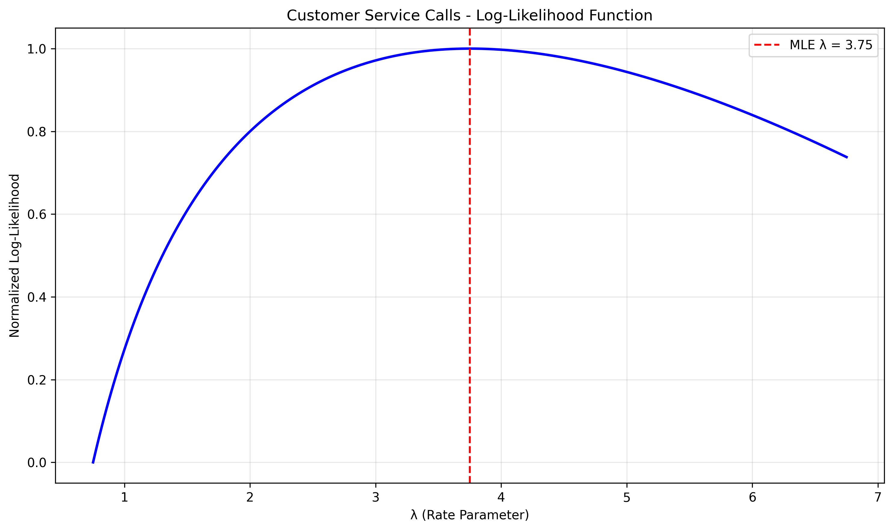

# Poisson Distribution MLE Examples

This document provides practical examples of Maximum Likelihood Estimation (MLE) for Poisson distributions, illustrating the concept of estimating rate parameters from count data and its significance in modeling events that occur randomly over time or space.

## Key Concepts and Formulas

The Poisson distribution is a discrete probability distribution that models the number of events occurring in a fixed interval of time or space, assuming these events occur independently at a constant average rate. MLE provides a method to estimate the rate parameter λ based on observed count data.

### The Poisson MLE Formula

The probability mass function for a Poisson distribution is:

$$P(X = k) = \frac{\lambda^k e^{-\lambda}}{k!}$$

The likelihood function for n independent observations is:

$$L(\lambda | \text{data}) = \prod_{i=1}^{n} \frac{\lambda^{x_i} e^{-\lambda}}{x_i!}$$

The maximum likelihood estimator for the rate parameter λ is:

$$\hat{\lambda}_{MLE} = \frac{1}{n}\sum_{i=1}^{n}x_i$$

Where:
- $\lambda$ = rate parameter we're trying to estimate
- $x_i$ = observed count data points
- $n$ = number of observations

## Count Data Examples

The following examples demonstrate MLE for count data (Poisson distribution):

- **Customer Service Calls**: Estimating call arrival rates

### Example 1: Customer Service Calls

#### Problem Statement
A data scientist is analyzing the number of customer service calls received per hour at a company's help desk. They collected data for 8 hours: 3, 5, 2, 4, 3, 6, 4, and 3 calls per hour. Assuming the call arrivals follow a Poisson distribution, MLE can help estimate the true rate parameter λ.

In this example:
- The data consists of 8 hourly call count measurements
- We assume the counts follow a Poisson distribution
- MLE estimates the rate parameter (λ)
- The analysis relies solely on the observed data without prior assumptions

#### Solution

##### Step 1: Gather the data
- Observed call counts: 3, 5, 2, 4, 3, 6, 4, and 3 calls per hour
- Number of observations (n) = 8

##### Step 2: Define the likelihood function
For Poisson distributed data, the likelihood function is:

$$
L(\lambda | \text{data}) = \prod_{i=1}^{n} \frac{\lambda^{x_i} e^{-\lambda}}{x_i!}
$$

Where:
- $\lambda$ is the rate parameter we're trying to estimate
- $x_i$ are the observed data points (counts)
- $x_i!$ is the factorial of $x_i$

##### Step 3: Calculate MLE
For a Poisson distribution, the MLE for the rate parameter is simply the sample mean:

$$
\hat{\lambda}_{MLE} = \frac{1}{n}\sum_{i=1}^{n}x_i = \frac{3 + 5 + 2 + 4 + 3 + 6 + 4 + 3}{8} = \frac{30}{8} = 3.75 \text{ calls per hour}
$$

##### Step 4: Interpret the results
Based on the MLE analysis, the estimated rate of customer service calls is 3.75 per hour. This represents the most likely value for the Poisson rate parameter given the observed data.



## Key Insights and Takeaways

### Theoretical Insights
- The MLE for a Poisson distribution is simply the sample mean of the count data
- This estimate represents the value of λ that makes the observed data most likely
- As sample size increases, the MLE approaches the true parameter value

### Practical Applications
- Call center staffing and resource allocation
- Modeling rare events such as accidents or equipment failures
- Analyzing website traffic patterns
- Quality control in manufacturing (defects per unit)

### Common Pitfalls
- Small sample sizes can lead to unreliable estimates
- The Poisson distribution assumes events occur independently
- The variance equals the mean in a Poisson distribution, which may not hold in real data (overdispersion)
- The assumption of constant rate may not be realistic for processes with time-varying rates

## Running the Examples

You can run the code that generates these examples and visualizations using:

```bash
python3 ML_Obsidian_Vault/Lectures/2/Code/poisson_mle_examples.py
```

## Related Topics

- [[L2_3_Likelihood_Examples|Likelihood Examples]]: General concepts of likelihood
- [[L2_4_MLE_Examples|MLE Examples]]: Other distributions' MLE calculations
