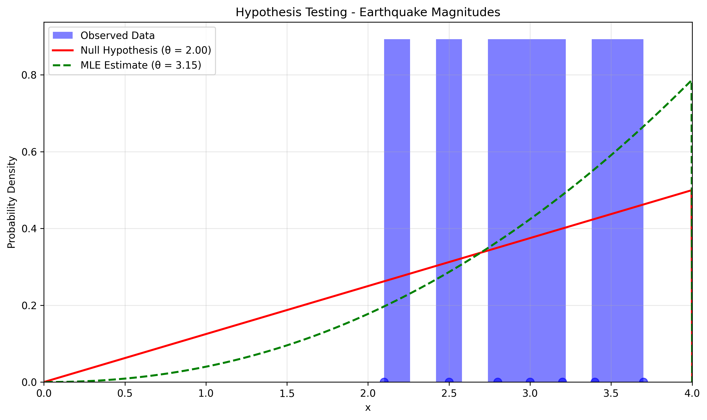

# Power Law Distribution MLE Examples

This document contains three different types of problems for Maximum Likelihood Estimation (MLE) with Power Law distributions.

## Type 1: Basic MLE Estimation - Social Media Followers

### Problem Statement
Suppose we have i.i.d. random variables $X_1, X_2, \ldots, X_n$ with the following probability density function:

$$f(x|\theta) = \begin{cases} 
\frac{\theta x^{\theta-1}}{1^{\theta}} & \text{for } 0 \leq x < 1 \\
0 & \text{otherwise}
\end{cases}$$

where $\theta$ is the shape parameter to be estimated. A data scientist is studying the distribution of social media influencer follower counts and wants to estimate the shape parameter using Maximum Likelihood Estimation (MLE).

In this example:
- We analyze follower counts (in millions) for 6 influencers in a specific category
- The distribution follows a power law with the PDF shown above
- Using only the observed data, we need to estimate the shape parameter $\theta$
- This is a direct application of Maximum Likelihood Estimation

### Observed Data
The data scientist has collected the following follower counts (in millions):
[0.3, 0.5, 0.8, 0.2, 0.6, 0.9]

### Detailed Calculation

**Step 1: Formulate the likelihood function**
For $n$ i.i.d. observations, the likelihood function is:

$$L(\theta | x_1, x_2, \ldots, x_n) = \prod_{i=1}^{n} f(x_i | \theta) = \prod_{i=1}^{n} \frac{\theta x_i^{\theta-1}}{1^{\theta}}$$

**Step 2: Take the logarithm to get the log-likelihood**
Taking the natural logarithm of the likelihood function:

$$\ln L(\theta | x_1, x_2, \ldots, x_n) = n\ln(\theta) + (\theta-1)\sum_{i=1}^{n}\ln(x_i)$$

**Step 3: Find the critical points by taking the derivative**
To find the maximum, we take the derivative with respect to $\theta$ and set it to zero:

$$\frac{d}{d\theta} [\ln L(\theta | x_1, x_2, \ldots, x_n)] = \frac{n}{\theta} + \sum_{i=1}^{n}\ln(x_i) = 0$$

**Step 4: Solve for the MLE estimate**
Rearranging the equation from step 3:

$$\hat{\theta} = \frac{n}{-\sum_{i=1}^{n}\ln(x_i)}$$

With our data:
- Number of observations ($n$) = 6
- Sum of $\ln(x_i)$ = -4.3459
- MLE theta ($\hat{\theta}$) = 6 / 4.3459 = 1.3806

**Step 5: Confidence Interval**
Using bootstrap resampling, we can calculate a 95% confidence interval for $\theta$:
[0.878, 3.032]

This interval gives us a measure of uncertainty around our point estimate.

### Simplified Method for Exams

There's a much simpler way to calculate the MLE for power law distributions that's perfect for exams and quick calculations!

**The Simple Formula:**
$$\hat{\theta}_{\text{MLE}} = \frac{1}{\text{mean}\left(\ln\left(\frac{\text{upper\_bound}}{x_i}\right)\right)}$$

For our social media followers example:
1. Calculate $\ln(1/x_i)$ for each observation
2. Take the mean of these values
3. Take the reciprocal to get $\hat{\theta}_{\text{MLE}}$

This gives exactly the same result as the detailed method but is much easier to calculate!

With our data:
- For each observation, calculate $\ln(1/x_i)$
- Take the mean: $\text{mean}(\ln(1/x_i)) = 0.7243$
- Take the reciprocal: $\hat{\theta} = 1/0.7243 = 1.3806$

This matches our detailed MLE calculation, demonstrating the efficiency of this simplified approach.

### Visualizations

The log-likelihood function for the Social Media Followers data:


The fitted power law distribution compared to the observed data:


### Interpretation
Based on the observed data alone, the most likely shape parameter $\theta$ is 1.3806. This power law distribution with $\theta = 1.3806$ best explains the observed follower counts. Since $\theta > 1$, the distribution is increasing, meaning that higher follower counts are more likely than lower ones within the range.

## Type 2: Hypothesis Testing - Earthquake Magnitudes

### Problem Statement
A seismologist is testing whether earthquake magnitudes follow a specific power law. The probability density function is:

$$f(x|\theta) = \begin{cases} 
\frac{\theta x^{\theta-1}}{4^{\theta}} & \text{for } 0 \leq x < 4 \\
0 & \text{otherwise}
\end{cases}$$

In this example:
- We analyze the magnitudes (on Richter scale) of 7 recent earthquakes
- The distribution follows a power law with the PDF shown above
- We need to test the null hypothesis $H_0: \theta = 2.0$ against the alternative $H_1: \theta \neq 2.0$
- This is a statistical hypothesis test using likelihood ratio

### Observed Data
The seismologist has collected the following earthquake magnitudes (on Richter scale):
[2.1, 3.4, 2.8, 3.0, 3.7, 2.5, 3.2]

### Hypothesis Testing Procedure

**Step 1: Calculate the MLE estimate**
First, we calculate the MLE for $\theta$ from the data:

$$\hat{\theta} = \frac{n}{-\sum_{i=1}^{n}\ln(x_i) + n\ln(4)}$$

For our earthquake data:
- Number of observations ($n$) = 7
- Observed values: [2.1, 3.4, 2.8, 3.0, 3.7, 2.5, 3.2]
- Sum of $\ln(x_i)$ = $\ln(2.1) + \ln(3.4) + \ln(2.8) + \ln(3.0) + \ln(3.7) + \ln(2.5) + \ln(3.2)$ = 8.6925
- $n\ln(4)$ = 7 × 1.3863 = 9.7041
- $-\sum_{i=1}^{n}\ln(x_i) + n\ln(4)$ = -8.6925 + 9.7041 = 1.0116
- MLE theta ($\hat{\theta}$) = 7 / 1.0116 = 3.1498

**Step 2: Calculate the log-likelihood under null hypothesis**
For the null hypothesis $H_0: \theta = 2.0$, the log-likelihood is:

$$L_0 = n\ln(\theta_0) + (\theta_0-1)\sum_{i=1}^{n}\ln(x_i) - n\theta_0\ln(4)$$

Where $\theta_0 = 2.0$:
- $n\ln(\theta_0)$ = 7 × $\ln(2)$ = 4.8520
- $(\theta_0-1)\sum_{i=1}^{n}\ln(x_i)$ = (2.0-1) × 8.6925 = 8.6925
- $n\theta_0\ln(4)$ = 7 × 2.0 × 1.3863 = 19.4082
- $L_0$ = 4.8520 + 8.6925 - 19.4082 = -7.0744

**Step 3: Calculate the log-likelihood under the alternative hypothesis**
For the alternative hypothesis with $\theta = \hat{\theta} = 3.1498$, the log-likelihood is:

$$L_1 = n\ln(\hat{\theta}) + (\hat{\theta}-1)\sum_{i=1}^{n}\ln(x_i) - n\hat{\theta}\ln(4)$$

Where $\hat{\theta} = 3.1498$:
- $n\ln(\hat{\theta})$ = 7 × $\ln(3.1498)$ = 8.0521
- $(\hat{\theta}-1)\sum_{i=1}^{n}\ln(x_i)$ = (3.1498-1) × 8.6925 = 18.6751
- $n\hat{\theta}\ln(4)$ = 7 × 3.1498 × 1.3863 = 30.5775
- $L_1$ = 8.0521 + 18.6751 - 30.5775 = -6.4503

**Step 4: Calculate the likelihood ratio test statistic**
$$\text{LR} = 2(L_1 - L_0) = 2(-6.4503 - (-7.0744)) = 2 × 0.6241 = 1.2482$$

**Step 5: Calculate p-value using chi-square distribution**
Under the null hypothesis, the LR statistic follows a chi-squared distribution with 1 degree of freedom.
From the chi-squared table or calculator with 1 df and LR = 1.2482:
$p\text{-value} = P(\chi^2_1 > 1.2482) = 0.2639$

**Step 6: Make a decision**
Using significance level $\alpha = 0.05$:
Since $p\text{-value} = 0.2639 > 0.05 = \alpha$, we fail to reject the null hypothesis.
There is not enough evidence against $\theta = 2.0$.

### Simplified Method for Hypothesis Testing

For hypothesis testing with power law distributions, here's a streamlined approach:

**Step 1: Quickly Calculate the MLE using the Simple Formula**
$$\hat{\theta}_{\text{MLE}} = \frac{1}{\text{mean}\left(\ln\left(\frac{\text{upper\_bound}}{x_i}\right)\right)}$$

For our earthquake magnitudes data:
1. Calculate $\ln(4/x_i)$ for each observation
2. Take the mean: $\text{mean}(\ln(4/x_i)) = 0.3175$
3. Take the reciprocal: $\hat{\theta} = 1/0.3175 = 3.1498$

**Steps 2-6: Follow the standard hypothesis testing procedure**
1. Calculate log-likelihoods under $H_0$ and $H_1$
2. Calculate the likelihood ratio statistic: $\text{LR} = 2(L_1 - L_0)$
3. Find the p-value from chi-squared distribution with 1 df
4. Compare p-value with significance level $\alpha$
5. Make your decision based on this comparison

The simplified MLE calculation makes the first step much faster, especially in exam conditions, while maintaining the same level of accuracy.

### Visualization

The comparison between the null hypothesis ($\theta = 2.0$) and the MLE estimate ($\theta = 3.1498$):



### Interpretation
Based on the hypothesis test, we do not have sufficient evidence to reject the null hypothesis that $\theta = 2.0$. This means that the power law with $\theta = 2.0$ is a plausible model for the earthquake magnitude data. While the MLE gives a higher estimate of $\theta = 3.1498$, the difference is not statistically significant at the 5% level.

## Type 3: Prediction Problem - Internet Traffic

### Problem Statement
A network engineer wants to predict the probability of extreme traffic volumes. The probability density function for the traffic data is:

$$f(x|\theta) = \begin{cases} 
\frac{\theta x^{\theta-1}}{2^{\theta}} & \text{for } 0 \leq x < 2 \\
0 & \text{otherwise}
\end{cases}$$

In this example:
- You have measured traffic volume (in GB) during 8 time intervals
- The distribution follows a power law with the PDF shown above
- First estimate the power law parameter $\theta$ using MLE
- Then calculate the probability that future traffic will exceed 1.5 GB
- This is a practical application of power laws for prediction

### Observed Data
The engineer has collected the following traffic volumes (in GB):
[0.5, 1.2, 1.8, 0.3, 0.7, 1.5, 0.9, 1.1]

### Prediction Analysis

**Step 1: Calculate the MLE estimate**
First, we estimate $\theta$ using MLE:

$$\hat{\theta} = \frac{n}{-\sum_{i=1}^{n}\ln(x_i) + n\ln(2)}$$

For our internet traffic data:
- Number of observations ($n$) = 8
- Observed values: [0.5, 1.2, 1.8, 0.3, 0.7, 1.5, 0.9, 1.1]
- Sum of $\ln(x_i)$ = $\ln(0.5) + \ln(1.2) + \ln(1.8) + \ln(0.3) + \ln(0.7) + \ln(1.5) + \ln(0.9) + \ln(1.1)$ = -1.1887
- $n\ln(2)$ = 8 × 0.6931 = 5.5448
- $-\sum_{i=1}^{n}\ln(x_i) + n\ln(2)$ = -(-1.1887) + 5.5448 = 6.7335
- MLE theta ($\hat{\theta}$) = 8 / 6.7335 = 1.2060

**Step 2: Calculate the probability of exceeding the threshold**
The cumulative distribution function (CDF) of our power law is:

$$F(x|\theta) = \left(\frac{x}{2}\right)^{\theta} \text{ for } 0 \leq x < 2$$

Therefore, the probability that traffic will exceed 1.5 GB is:

$$P(X > 1.5) = 1 - F(1.5|\theta) = 1 - \left(\frac{1.5}{2}\right)^{1.2060}$$

Let's calculate this step by step:
- $\left(\frac{1.5}{2}\right)^{1.2060}$ = $(0.75)^{1.2060}$ = 0.7068
- $P(X > 1.5)$ = 1 - 0.7068 = 0.2932 or approximately 29.32%

**Step 3: Additional predictions**
- Median value calculation:
  $$x_{\text{median}} = 2 \times (0.5)^{1/\theta} = 2 \times (0.5)^{1/1.2060} = 2 \times 0.5629 = 1.1257 \text{ GB}$$

- Mean value calculation (for $\theta > 1$):
  $$E[X] = \frac{\theta \times 2^{\theta}}{\theta + 1} = \frac{1.2060 \times 2^{1.2060}}{1.2060 + 1} = \frac{1.2060 \times 2.3060}{2.2060} = \frac{2.7810}{2.2060} = 1.2612 \text{ GB}$$

- Percentile calculation for 1.5 GB:
  $$F(1.5|\theta) = \left(\frac{1.5}{2}\right)^{1.2060} = 0.7068$$

  So the value 1.5 GB is at the 70.68th percentile of the distribution.

**Step 4: Simulate future observations**
Using the quantile function (inverse CDF) of the power law:

$$x = 2 \times (u)^{1/\theta}$$

where $u$ is a random number from Uniform(0,1). With random seed 42:
- $u_1 = 0.3745$, $x_1 = 2 \times (0.3745)^{1/1.2060} = 0.8859$ GB
- $u_2 = 0.9507$, $x_2 = 2 \times (0.9507)^{1/1.2060} = 1.9179$ GB
- $u_3 = 0.7319$, $x_3 = 2 \times (0.7319)^{1/1.2060} = 1.5441$ GB
- $u_4 = 0.5986$, $x_4 = 2 \times (0.5986)^{1/1.2060} = 1.3070$ GB
- $u_5 = 0.1560$, $x_5 = 2 \times (0.1560)^{1/1.2060} = 0.4286$ GB

### Simplified Method for Prediction Problems

For prediction problems involving power law distributions, here's a streamlined approach:

**Step 1: Quickly Calculate the MLE using the Simple Formula**
$$\hat{\theta}_{\text{MLE}} = \frac{1}{\text{mean}\left(\ln\left(\frac{\text{upper\_bound}}{x_i}\right)\right)}$$

For our internet traffic data:
1. Calculate $\ln(2/x_i)$ for each observation
2. Take the mean: $\text{mean}(\ln(2/x_i)) = 0.8292$
3. Take the reciprocal: $\hat{\theta} = 1/0.8292 = 1.2060$

**Step 2: Use Simple Formulas for Predictions**
Once you have $\theta$, you can quickly calculate key predictions:

1. Probability of exceeding a threshold:
   $$P(X > \text{threshold}) = 1 - \left(\frac{\text{threshold}}{\text{upper\_bound}}\right)^{\theta}$$
   
   For our example: $P(X > 1.5) = 1 - (1.5/2)^{1.2060} = 0.2932$

2. Median:
   $$x_{\text{median}} = \text{upper\_bound} \times (0.5)^{1/\theta}$$
   
   For our example: $x_{\text{median}} = 2 \times (0.5)^{(1/1.2060)} = 1.1257$

3. Mean (if $\theta > 1$):
   $$E[X] = \frac{\theta \times \text{upper\_bound}^{\theta}}{\theta + 1}$$
   
   For our example: $E[X] = \frac{1.2060 \times 2^{1.2060}}{1.2060 + 1} = 1.2612$

These simplified formulas provide a quick and accurate way to make predictions based on power law models, ideal for exam settings or rapid analysis.

### Visualization

The fitted power law distribution with the area representing $P(X > 1.5)$ highlighted:


### Interpretation
Based on our power law model with $\theta = 1.2060$, we predict that there's approximately a 29.32% chance that future traffic will exceed 1.5 GB. The median traffic volume is expected to be around 1.1257 GB, and the mean is about 1.2612 GB. These predictions can help the network engineer plan capacity and set appropriate thresholds for network monitoring.

## Running the Examples

You can run the examples using the Python files:

```bash
python3 ML_Obsidian_Vault/Lectures/2/Codes/power_law_mle_examples.py
python3 ML_Obsidian_Vault/Lectures/2/Codes/power_law_mle_simplified.py
```

## Related Topics

- [[L2_4_Maximum_Likelihood|Maximum_Likelihood]]: General principles of maximum likelihood estimation
- [[Advanced_Distributions]]: Overview of complex probability distributions
- [[L2_3_Parameter_Estimation|Parameter_Estimation]]: Overview of different estimation approaches