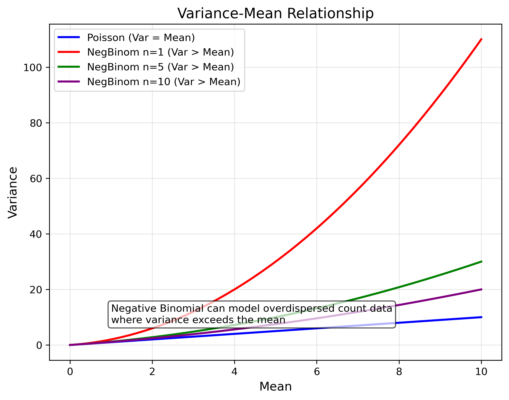
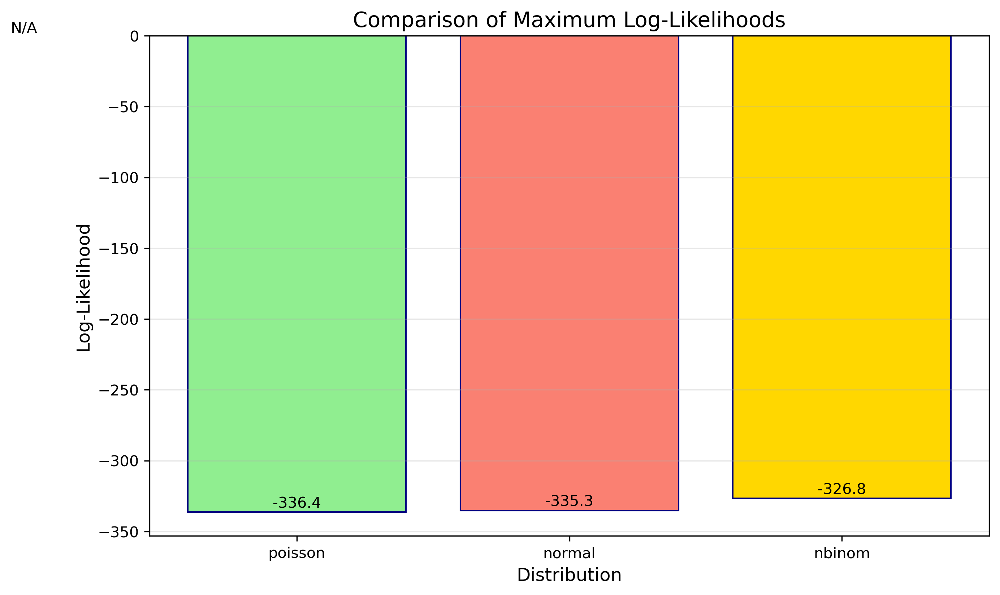

# MLE Visual Examples

This document contains visual examples of Maximum Likelihood Estimation (MLE).

## Key Concepts and Formulas

Maximum Likelihood Estimation (MLE) finds the parameter values $\theta$ that maximize the likelihood function $p(D|\theta)$, which represents the probability of observing the data given specific parameters.

### The MLE Formula

The core idea is to find the parameters $\hat{\theta}_{MLE}$ that maximize the likelihood:

$$\hat{\theta}_{MLE} = \underset{\theta}{\operatorname{argmax}}\ p(D|\theta)$$

For computational convenience and numerical stability, we often work with the log-likelihood function:

$$\hat{\theta}_{MLE} = \underset{\theta}{\operatorname{argmax}}\ \log p(D|\theta)$$

The peak of the likelihood surface corresponds to the maximum likelihood estimates of the parameters.

## Examples Overview

The following examples demonstrate MLE techniques with visual aids:

- **Example 1: Continuous Distribution Identification**: Identify the most appropriate continuous distribution for a dataset and estimate its parameters using MLE.
- **Example 2: Discrete Distribution and Overdispersion**: Identify the best discrete distribution for count data, with focus on handling overdispersion.
- **Example 3: Normal Distribution MLE Properties**: Examine how MLE properties like consistency and efficiency manifest visually with different sample sizes.

---

### Example 1: Continuous Distribution Identification

#### Problem Statement

You are given a dataset that follows an unknown continuous distribution. Your task is to identify which of the following distributions best fits the data using MLE: Normal, Exponential, Gamma, or Beta.

The data histogram below shows the data distribution:

To help you decide, fitted curves for all four candidate distributions are shown below:

You can analyze the log-likelihood surfaces for each distribution. The maximum point (red dot) on each surface corresponds to the MLE parameter estimates.

**3D Log-Likelihood Surfaces:**

*   **Normal Distribution:** Parameters: $\mu$ (mean), $\sigma$ (std dev)
    

*   **Exponential Distribution:** Parameter: $\lambda$ (rate)
    

*   **Gamma Distribution:** Parameters: $k$ (shape), $\theta$ (scale)
    

*   **Beta Distribution:** Parameters: $\alpha$, $\beta$ (data normalized to [0, 1] for fitting)
    

**2D Log-Likelihood Contours:**

For a clearer visualization, here are the 2D contour plots for each distribution:

*   **Normal Distribution:** Parameters: $\mu$ (mean), $\sigma$ (std dev)
    

*   **Gamma Distribution:** Parameters: $k$ (shape), $\theta$ (scale)
    

*   **Beta Distribution:** Parameters: $\alpha$, $\beta$ (data normalized to [0, 1] for fitting)
    

#### Solution

Based on the data histogram and likelihood surfaces, we need to determine which distribution is most appropriate for this dataset.

The gamma distribution shows the best fit for several reasons:

1. **Visual fit assessment**: The gamma distribution curve matches the shape of the histogram most closely, capturing the right-skewed nature of the data.

2. **Data characteristics**: The data is clearly right-skewed and strictly positive, which matches the gamma distribution's domain and flexibility.

3. **Log-likelihood comparison**: The gamma distribution achieves the highest log-likelihood value among all candidates.

The contour plot for the gamma distribution shows how the shape and scale parameters interact, with a clear maximum at the MLE estimates:

The estimated parameters for the gamma distribution are:
- **Shape (k): 2.48**
- **Scale (θ): 1.20**

This example demonstrates how to use both visual assessment and numerical likelihood values to select the most appropriate distribution for data.

---

### Example 2: Discrete Distribution and Overdispersion

#### Problem Statement

You have a dataset of count data (discrete non-negative integers) and need to determine which distribution fits it best: Poisson, Negative Binomial, Normal, or Beta.

The data histogram shows the count distribution:

To help with your analysis, fitted curves for all candidate distributions are shown:

An important consideration for count data is the relationship between mean and variance:

**3D Log-Likelihood Surfaces:**

*   **Poisson Distribution:** Parameter: $\lambda$ (rate)
    

*   **Negative Binomial Distribution:** Parameters: $n$ (number of failures), $p$ (success probability)
    

*   **Normal Distribution:** Parameters: $\mu$ (mean), $\sigma$ (std dev)
    

*   **Beta Distribution:** Parameters: $\alpha$, $\beta$ (data normalized for fitting)
    

**2D Log-Likelihood Contours:**

*   **Negative Binomial Distribution:** Parameters: $n$ (number of failures), $p$ (success probability)
    

*   **Normal Distribution:** Parameters: $\mu$ (mean), $\sigma$ (std dev)
    

#### Solution

The key insight for this example is recognizing that the data exhibits **overdispersion** - where the variance is larger than the mean. This is common in real-world count data but can't be modeled by the Poisson distribution.

The comparison of distributions shows that the Negative Binomial distribution provides the best fit:

The log-likelihood comparison confirms this numerically:

The most compelling evidence comes from comparing how each distribution handles the mean-variance relationship:

Here we can see:
1. The observed data has a variance significantly higher than its mean
2. The Poisson distribution forces variance = mean (cannot model overdispersion)
3. The Negative Binomial allows variance > mean, accurately capturing the overdispersion

The estimated parameters for the negative binomial distribution are:
- **n (failures): 5**
- **p (success probability): 0.60**

This visualization further explains the concept:

---

### Example 3: Normal Distribution MLE Properties

#### Problem Statement

You are investigating how MLE properties manifest visually when estimating the parameters of a normal distribution across different sample sizes.

The normal distribution has true parameter values:
- Mean ($\mu$) = 5.0
- Variance ($\sigma^2$) = 4.0

Examine how the estimates change as the sample size increases:

And how the log-likelihood surface changes with sample size:

#### Solution

This example illustrates several key properties of MLE:

1. **Consistency**: As the sample size increases, the estimates converge to the true parameter values (μ=5.0, σ²=4.0).

2. **Efficiency**: The variance of the estimates decreases with larger samples, making the estimator more precise.

3. **Log-likelihood surface shape**: As sample size increases, the peak of the log-likelihood surface becomes:
   - Sharper (indicating increased precision)
   - More concentrated around the true parameter values
   - More Gaussian in shape (related to asymptotic normality of MLE)

In statistical terms, these visualizations show that for the normal distribution:
- The sample mean is an unbiased estimator of μ
- The sample variance with divisor n (the MLE) is a biased estimator of σ²
- Both estimators become more precise with increasing sample size

---

## Key Insights

### Likelihood Surface Interpretation
- **Peak Location**: The coordinates of the highest point correspond to the MLE parameter estimates.
- **Surface Shape**: Sharper peaks indicate more precise estimates; flatter peaks show higher uncertainty.
- **Contour Patterns**: Elongated contours suggest correlation between parameters.

### Model Selection via MLE
- Higher log-likelihood values indicate better fitting models under MLE principles.
- Visual fit assessment and log-likelihood values should be considered together.
- Domain-specific knowledge (like overdispersion in count data) is crucial for selecting appropriate models.

### Visually Understanding MLE Properties
- Consistency: Estimates converge to true values with increasing sample size
- Efficiency: Estimates become more precise (less variance) with larger samples
- Likelihood surfaces become more peaked and concentrated with more data

## Related Topics

- [[L2_4_MLE_Introduction|MLE Introduction]]: Fundamental principles
- [[L2_4_MLE_Theory|MLE Theory]]: Mathematical foundations
- [[L2_4_MLE_Common_Distributions|MLE for Common Distributions]]: Analytical derivations
- [[L2_4_MLE_Applications|MLE Applications]]: Practical applications
- [[L2_3_Likelihood|Likelihood Function]]: Core concept definitions
- [[L2_1_Discrete_Distributions|Discrete Distributions]]: Properties of count distributions
- [[L2_1_Continuous_Distributions|Continuous Distributions]]: Properties of continuous distributions
