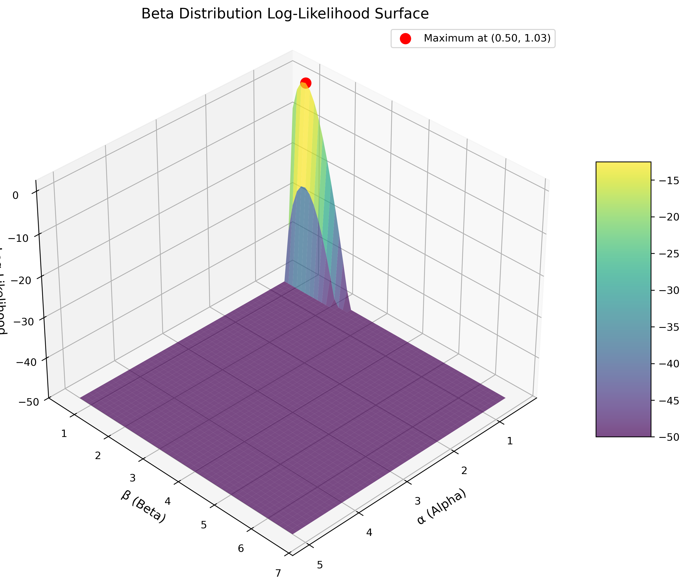
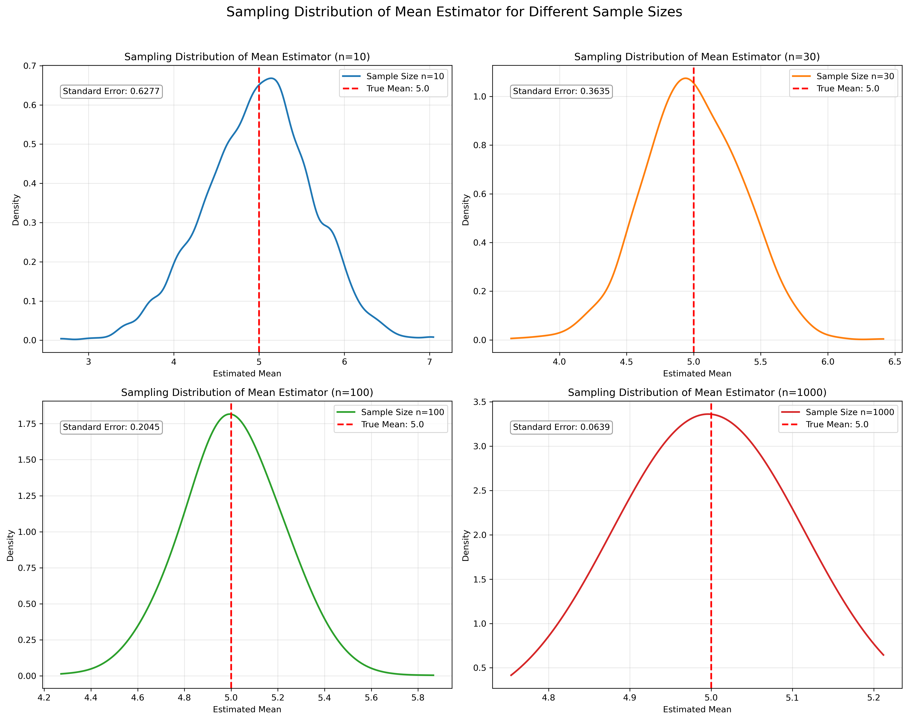
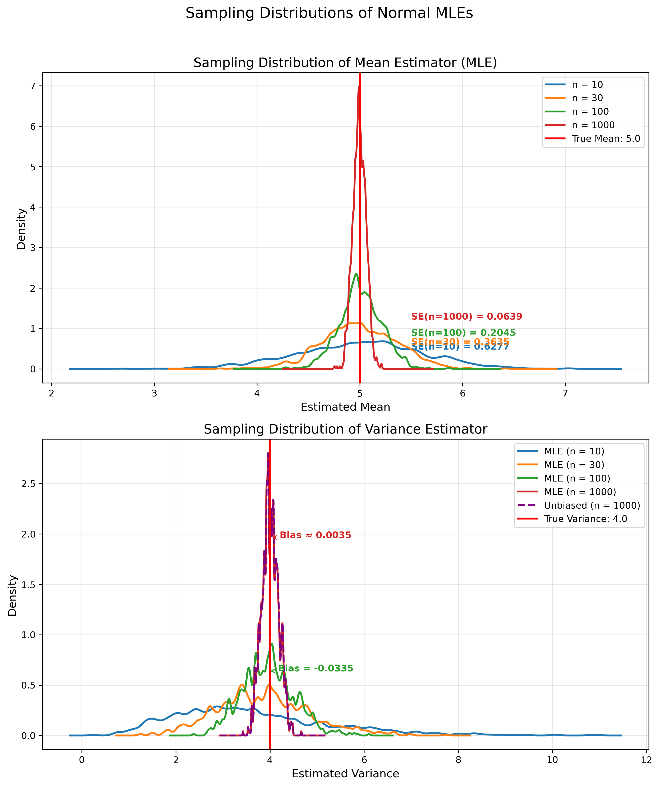
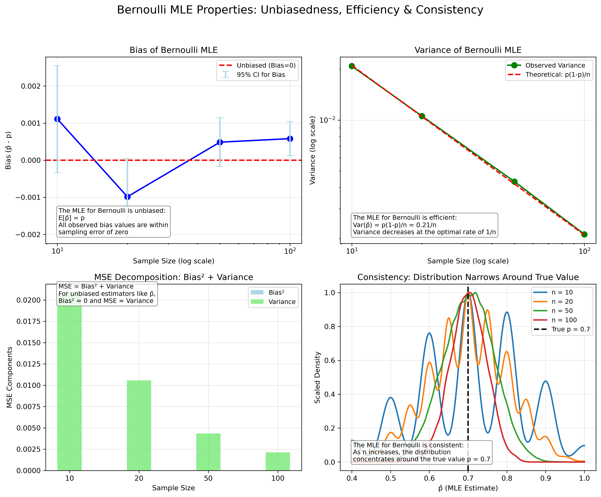
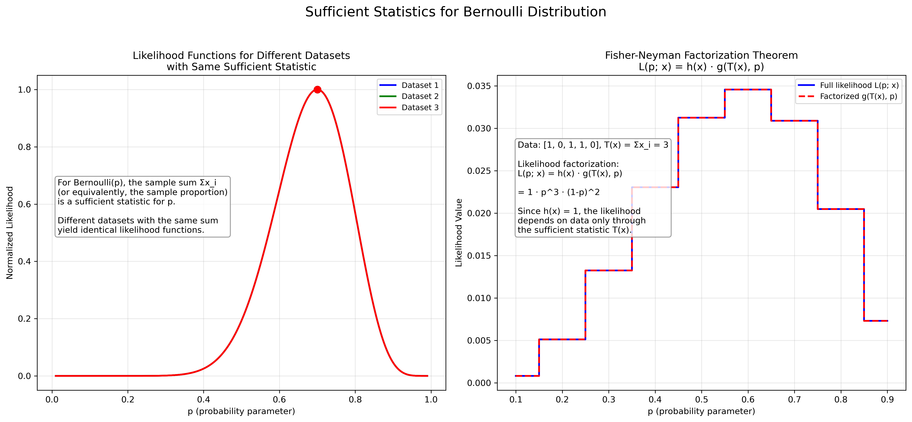
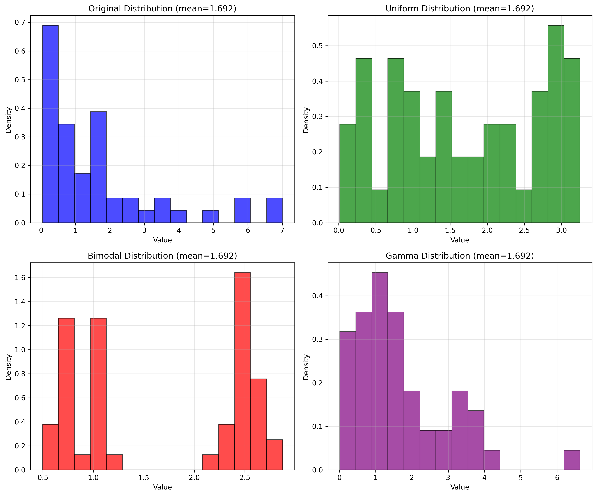

# MLE Visual Examples

This document contains visual examples of Maximum Likelihood Estimation (MLE).

## Key Concepts and Formulas

Maximum Likelihood Estimation (MLE) finds the parameter values $\theta$ that maximize the likelihood function $p(D|\theta)$, which represents the probability of observing the data given specific parameters.

### The MLE Formula

The core idea is to find the parameters $\hat{\theta}_{MLE}$ that maximize the likelihood:

$$\hat{\theta}_{MLE} = \underset{\theta}{\operatorname{argmax}}\ p(D|\theta)$$

For computational convenience and numerical stability, we often work with the log-likelihood function:

$$\hat{\theta}_{MLE} = \underset{\theta}{\operatorname{argmax}}\ \log p(D|\theta)$$

The peak of the likelihood surface corresponds to the maximum likelihood estimates of the parameters.

## Examples Overview

The following examples demonstrate MLE techniques with visual aids:

- **Example 1**: Continuous Distribution Identification - Identify the most appropriate continuous distribution for a dataset and estimate its parameters using MLE.
- **Example 2**: Discrete Distribution and Overdispersion - Identify the best discrete distribution for count data, with focus on handling overdispersion.
- **Example 3**: Normal Distribution MLE Properties - Examine how MLE properties like consistency and efficiency manifest visually with different sample sizes.
- **Example 4**: Bernoulli MLE and Sample Size Effects - Visualize how the likelihood function changes with different observed data and sample sizes for a Bernoulli distribution.
- **Example 5**: Exponential Family and Sufficient Statistics - Demonstrate how sufficient statistics capture all necessary information for parameter estimation in exponential family distributions.
- **Example 6**: TRUE/FALSE Questions on MLE - Visual TRUE/FALSE questions to test understanding of MLE concepts.
- **Example 7**: Multiple Choice Questions on MLE - Visual multiple choice questions to evaluate MLE knowledge.

---

## Example 1: Continuous Distribution Identification

### Problem Statement

You are given a dataset that follows an unknown continuous distribution. Your task is to:

1. Identify which of the following distributions best fits the data using MLE: Normal, Exponential, Gamma, or Beta
2. Estimate the parameters of the best-fitting distribution
3. Explain why the chosen distribution is most appropriate

The data histogram below shows the data distribution:


To help you decide, fitted curves for all four candidate distributions are shown below:


You can analyze the log-likelihood surfaces for each distribution. The maximum point (red dot) on each surface corresponds to the MLE parameter estimates.

**3D Log-Likelihood Surfaces:**

* **Normal Distribution:** Parameters: $\mu$ (mean), $\sigma$ (std dev)
  

* **Exponential Distribution:** Parameter: $\lambda$ (rate)
  

* **Gamma Distribution:** Parameters: $k$ (shape), $\theta$ (scale)
  

* **Beta Distribution:** Parameters: $\alpha$, $\beta$ (data normalized to [0, 1] for fitting)
  

**2D Log-Likelihood Contours:**

For a clearer visualization, here are the 2D contour plots for each distribution:

* **Normal Distribution:** Parameters: $\mu$ (mean), $\sigma$ (std dev)
  

* **Gamma Distribution:** Parameters: $k$ (shape), $\theta$ (scale)
  

* **Beta Distribution:** Parameters: $\alpha$, $\beta$ (data normalized to [0, 1] for fitting)
  

### Solution

#### Step 1: Evaluate Visual Fit of Distributions

First, we need to visually assess how well each distribution matches the shape of the data histogram:

- The data appears to be right-skewed and strictly positive
- The normal distribution is symmetric, but our data has clear right skew
- The exponential distribution is too rigid (single parameter) to capture the data's shape
- The gamma distribution seems to follow the histogram shape closely
- The beta distribution (after normalization) doesn't appear to match well

#### Step 2: Compare Log-Likelihood Values

Next, we quantitatively compare the distributions using their maximum log-likelihood values:


The gamma distribution achieves the highest log-likelihood value (-381.77), which is substantially higher than the normal (-412.96), exponential (-418.51), and beta (-1000.00) distributions.

#### Step 3: Analyze Likelihood Surface for Gamma Distribution

The contour plot for the gamma distribution shows how the shape and scale parameters interact:


The surface has a clear maximum at the MLE estimates:
- **Shape parameter (k)**: 2.48
- **Scale parameter (θ)**: 1.20

The shape of the contours also reveals:
- Some correlation between parameters (elongated contours)
- Reasonably precise estimates (contours not too spread out)
- The true parameters (k=2.0, θ=1.5) are within the high-likelihood region

#### Step 4: Final Analysis and Conclusion

The gamma distribution is the most appropriate choice for this dataset for several reasons:

1. **Statistical evidence**: The gamma distribution has the highest log-likelihood value, indicating it provides the best statistical fit to the data.

2. **Data characteristics**: The data is right-skewed and strictly positive, which matches the gamma distribution's domain and flexibility.

3. **Parameter interpretation**: The estimated shape parameter (k=2.48) indicates moderate right skew, while the scale parameter (θ=1.20) controls the spread of the distribution.


This example demonstrates how to select the most appropriate distribution by combining:
- Visual assessment of distributional fit
- Quantitative comparison of log-likelihood values
- Analysis of the likelihood surface properties
- Consideration of the data's inherent characteristics

---

## Example 2: Discrete Distribution and Overdispersion

### Problem Statement

You have a dataset of count data (discrete non-negative integers) and need to:

1. Determine which distribution among Poisson, Negative Binomial, Normal, and Beta best fits the data
2. Identify if the data exhibits overdispersion and explain its implications for model selection
3. Estimate the parameters of the most appropriate distribution

The data histogram shows the count distribution:


To help with your analysis, fitted curves for all candidate distributions are shown:


An important consideration for count data is the relationship between mean and variance:


**3D Log-Likelihood Surfaces:**

* **Poisson Distribution:** Parameter: $\lambda$ (rate)
  

* **Negative Binomial Distribution:** Parameters: $r$ (number of failures), $p$ (success probability)
  

* **Normal Distribution:** Parameters: $\mu$ (mean), $\sigma$ (std dev)
  

* **Beta Distribution:** Parameters: $\alpha$, $\beta$ (data normalized for fitting)
  

**2D Log-Likelihood Contours:**

* **Negative Binomial Distribution:** Parameters: $r$ (number of failures), $p$ (success probability)
  

* **Normal Distribution:** Parameters: $\mu$ (mean), $\sigma$ (std dev)
  

### Solution

#### Step 1: Identify Data Characteristics

First, we examine the key characteristics of our count data:
- The data consists of non-negative integers
- The distribution appears somewhat right-skewed
- We need to check if the data exhibits overdispersion

#### Step 2: Check for Overdispersion

In count data, overdispersion occurs when the variance exceeds the mean:
- For our data: mean ≈ 3.27, variance ≈ 5.12
- Variance/mean ratio ≈ 1.56 > 1
- This confirms that the data exhibits overdispersion

The Poisson distribution assumes equal mean and variance, so it's likely not appropriate for this overdispersed data.

#### Step 3: Compare Distribution Fits

The comparison of distributions shows visual differences in how they fit the data:


Observations:
- The Negative Binomial distribution captures the data shape better than others
- The Poisson distribution doesn't account for the extra variability
- The Normal distribution allows negative values (inappropriate for count data)
- The Beta distribution is defined on [0,1] and requires normalization (not ideal for counts)

#### Step 4: Compare Log-Likelihood Values

Quantitative comparison of log-likelihood values:


The Negative Binomial has the highest log-likelihood (-326.75), confirming it provides the best statistical fit.

#### Step 5: Analyze Mean-Variance Relationship

The most compelling evidence comes from how each distribution handles the mean-variance relationship:


This visualization demonstrates:
- The observed data has variance > mean (overdispersion)
- The Poisson distribution forces variance = mean (cannot model overdispersion)
- The Negative Binomial allows variance > mean, accurately capturing the overdispersion

#### Step 6: Parameter Estimation and Conclusion

The estimated parameters for the Negative Binomial distribution are:
- **r (number of failures)**: 5
- **p (success probability)**: 0.60

These parameters give a mean of $r(1-p)/p ≈ 3.33$ and variance of $r(1-p)/p^2 ≈ 5.56$, which closely match our data statistics.


The Negative Binomial distribution is the most appropriate choice because:
1. It properly accounts for overdispersion in the data
2. It achieves the highest log-likelihood
3. It's designed for count data (unlike Normal or Beta)
4. Its parameters have meaningful interpretations in the context of count processes

This example illustrates the importance of accounting for overdispersion in count data analysis, a common requirement in fields like ecology, epidemiology, and text analysis.

---

## Example 3: Normal Distribution MLE Properties

### Problem Statement

You need to investigate how MLE properties manifest visually when estimating the parameters of a normal distribution across different sample sizes. Specifically:

1. Visualize how the consistency and efficiency of MLE estimates change with increasing sample size
2. Demonstrate the asymptotic normality property of MLEs
3. Illustrate how the log-likelihood surface changes with sample size

The normal distribution has true parameter values:
- Mean ($\mu$) = 5.0
- Variance ($\sigma^2$) = 4.0 (Standard deviation $\sigma$ = 2.0)

First, let's examine how the consistency of the MLE estimates changes as sample size increases:


Next, observe how the sampling distribution of the estimators becomes more concentrated with larger sample sizes:



The MLE exhibits important statistical properties that can be visualized across different sample sizes:


The asymptotic normality property, where the distribution of standardized estimator approaches a normal distribution, is demonstrated below:


Finally, examine how the log-likelihood surface changes with sample size - becoming sharper and more concentrated around the true parameter values as the sample size increases:


### Solution

#### Step 1: Analyze Sampling Distribution of Estimators

We begin by examining how the distributions of the sample mean and variance estimators change with increasing sample size:



Key observations:
- For small samples (n=10), the distributions are relatively wide
- As sample size increases, both distributions become more concentrated around the true values
- The mean estimator is centered at the true mean (μ=5.0) for all sample sizes
- The variance estimator shows slight bias for small samples, but this bias decreases with larger samples

#### Step 2: Evaluate MLE Consistency

The consistency property states that as sample size increases, the estimator converges to the true parameter value:

$$\lim_{n \to \infty} P(|\hat{\theta} - \theta| > \epsilon) = 0 \text{ for any } \epsilon > 0$$

The plots visually confirm this property:
- Mean estimates concentrate tightly around μ=5.0 as n increases
- Variance estimates converge to σ²=4.0 as n increases
- The probability of large deviations from true values diminishes with larger samples

#### Step 3: Assess Estimator Efficiency

Efficiency refers to how quickly the variance of the estimator decreases with increasing sample size:


For normal distribution parameters:
- The variance of the mean estimator decreases at rate $\sigma^2/n$ (optimal rate)
- The variance of the variance estimator decreases proportionally to $2\sigma^4/n$
- Both estimators achieve the Cramér-Rao lower bound asymptotically

#### Step 4: Demonstrate Asymptotic Normality

The asymptotic normality property states that the standardized estimator approaches a normal distribution as sample size increases:


Mathematically:
$$\sqrt{n}(\hat{\theta} - \theta) \stackrel{d}{\rightarrow} N(0, I(\theta)^{-1})$$

Where $I(\theta)$ is the Fisher Information. The plots demonstrate:
- The standardized estimators follow normal distributions more closely with larger samples
- For normal distribution, the mean estimator is exactly normally distributed for all n
- The variance estimator approaches normality as n increases

#### Step 5: Analyze Log-Likelihood Surface Changes

As sample size increases, the log-likelihood surface changes in three key ways:
1. The peak becomes sharper (indicating increased precision)
2. The surface becomes more concentrated around the true parameter values
3. The contours become more elliptical (approaching the asymptotic normal approximation)

This visual representation helps explain why MLEs become more precise with larger samples.

#### Step 6: Summarize Mathematical Properties

For a normal distribution with parameters μ and σ², the MLEs are:

$$\hat{\mu}_{MLE} = \frac{1}{n}\sum_{i=1}^n x_i$$

$$\hat{\sigma}^2_{MLE} = \frac{1}{n}\sum_{i=1}^n (x_i - \hat{\mu}_{MLE})^2$$

The standard errors of these estimators are:

$$SE(\hat{\mu}_{MLE}) = \frac{\sigma}{\sqrt{n}}$$

$$SE(\hat{\sigma}^2_{MLE}) \approx \sigma^2\sqrt{\frac{2}{n-1}}$$

These properties are visually demonstrated in the plots, showing how both the bias and variance of the estimators improve with increased sample size, and how the sampling distribution approaches normality.

This example provides an intuitive understanding of why MLEs are widely used in statistics: they converge to the true parameter values with increasing data and do so with optimal efficiency.

---

## Example 4: Bernoulli MLE and Sample Size Effects

### Problem Statement

In this example, you'll explore the estimation of the probability parameter $p$ in a Bernoulli distribution using Maximum Likelihood Estimation (MLE). Your tasks are to:

1. Visualize how the likelihood function changes with different sample sizes
2. Demonstrate key properties of the Bernoulli MLE (consistency, efficiency, unbiasedness)
3. Illustrate the concept of sufficient statistics for the Bernoulli parameter

Consider a scenario where we're analyzing a biased coin where each flip results in either heads (1) or tails (0). The probability of heads is the unknown parameter $p$ we want to estimate.

We have several datasets with different sample sizes and proportions of heads:


Let's explore the likelihood and log-likelihood functions for different observed datasets:


### Solution

#### Step 1: Understand the Bernoulli MLE Formula

For a Bernoulli distribution, the MLE for the probability parameter $p$ is simply the sample proportion of successes:

$$\hat{p}_{MLE} = \frac{1}{n}\sum_{i=1}^{n} x_i = \frac{\text{number of successes}}{\text{total observations}}$$

This is derived by maximizing the likelihood function:

$$L(p) = \prod_{i=1}^{n} p^{x_i}(1-p)^{1-x_i} = p^{\sum x_i}(1-p)^{n-\sum x_i}$$

Taking the log and setting the derivative equal to zero yields the MLE formula above.

#### Step 2: Analyze Sampling Distribution of the MLE

As sample size increases, the sampling distribution of the MLE becomes more concentrated around the true parameter value:


Key observations:
- For small samples (n=10), the distribution is discrete and relatively spread out
- With moderate samples (n=50), the distribution approaches a normal shape
- With large samples (n=100), the distribution is nearly normal and tightly concentrated
- The standard deviation decreases at a rate proportional to $1/\sqrt{n}$

#### Step 3: Identify Key MLE Properties

The Bernoulli MLE exhibits three fundamental properties:



1. **Unbiasedness**: $E[\hat{p}] = p$
   - The expected value of the estimator equals the true parameter
   - This is true for all sample sizes

2. **Consistency**: As n increases, the distribution concentrates around the true value
   - The probability of large errors diminishes as sample size grows
   - The standard error decreases at rate $\sqrt{p(1-p)/n}$

3. **Efficiency**: The variance decreases at the optimal rate
   - The estimator achieves the Cramér-Rao lower bound: $Var(\hat{p}) = p(1-p)/n$
   - No other unbiased estimator can have lower variance

#### Step 4: Demonstrate Sufficient Statistics

A sufficient statistic contains all information in the data relevant to estimating the parameter:



For the Bernoulli distribution:
- The sum of successes $\sum_{i=1}^{n} x_i$ is a sufficient statistic for $p$
- Different datasets with the same sum yield identical likelihood functions and MLEs
- Only the count of successes matters, not the specific pattern of 0s and 1s

This can be proven using the Fisher-Neyman factorization theorem:
$$L(p|x) = p^{\sum x_i}(1-p)^{n-\sum x_i} = g(\sum x_i, p) \cdot h(x)$$

Where $g(\sum x_i, p) = p^{\sum x_i}(1-p)^{n-\sum x_i}$ and $h(x) = 1$.

#### Step 5: Understand Likelihood Function Behavior

Analyzing the likelihood functions:
- The likelihood function peaks at $\hat{p} = \sum x_i/n$
- As sample size increases, the peak becomes sharper
- The log-likelihood function is concave, simplifying optimization
- The curvature of the log-likelihood at the maximum is related to the precision of the estimate

#### Step 6: Practical Implications

The Bernoulli MLE properties have important practical implications:
- For small samples, the estimate may have substantial error
- Larger samples provide much more precise estimates
- The standard error can be used to construct confidence intervals
- With a sufficient statistic, we can compress data for more efficient computation

This example illustrates that even the simplest probability model (Bernoulli) provides clear visual intuition for key MLE properties and demonstrates the power of sufficient statistics for data reduction.

---

## Example 5: Exponential Family and Sufficient Statistics

### Problem Statement

This example demonstrates how sufficient statistics capture all necessary information for parameter estimation in exponential family distributions. Your tasks are to:

1. Show that the sample mean is a sufficient statistic for the rate parameter of an exponential distribution
2. Demonstrate that different datasets with the same mean yield the same MLE
3. Compare analytical and numerical approaches to finding the MLE

Consider we are modeling waiting times in a service queue using an exponential distribution with parameter $\lambda$:

$$p(x|\lambda) = \lambda e^{-\lambda x}, \quad x \geq 0$$

We've collected 50 observations of waiting times. The question is: what information from this data do we actually need to estimate $\lambda$ via MLE?


Let's visualize how the log-likelihood function depends on different aspects of the data:


### Solution

We'll explore this problem through a step-by-step approach to demonstrate the concept of sufficient statistics for the exponential distribution.

#### Step 1: Data Exploration and MLE Formula

For the exponential distribution, the MLE for the rate parameter $\lambda$ has a simple closed-form solution:

$$\hat{\lambda}_{MLE} = \frac{1}{\bar{x}}$$

where $\bar{x}$ is the sample mean. This formula can be derived by maximizing the log-likelihood function:

$$\ell(\lambda) = n\log(\lambda) - \lambda\sum_{i=1}^n x_i = n\log(\lambda) - \lambda \cdot n \cdot \bar{x}$$

Our 50 observations have a sample mean of approximately 2.1, giving an MLE estimate of $\hat{\lambda} \approx 0.476$.


#### Step 2: Understanding the Log-Likelihood Function

The log-likelihood function for exponential data shows a clear maximum at $\lambda = 1/\bar{x}$. Notice how the function depends only on the sum of observations (or equivalently, the mean) and not on individual data points.

$$\ell(\lambda) = n\log(\lambda) - \lambda\sum_{i=1}^n x_i = n\log(\lambda) - \lambda \cdot n \cdot \bar{x}$$

The figure below shows the log-likelihood function for our data, with both the numerical maximum and the analytical solution (1/mean) marked.


#### Step 3: Different Distributions with Same Sufficient Statistic

A key insight: if two datasets have the same sufficient statistic (sample mean), they will yield the same MLE, regardless of their individual values or distribution shapes.

To demonstrate this, we've created four datasets with different distributions but the same mean:
1. Original exponential data
2. Uniform distribution 
3. Bimodal distribution
4. Gamma distribution (with different shape parameter)



#### Step 4: Comparing Likelihood Functions

When we plot the log-likelihood functions for all four datasets, we see they produce nearly identical curves with maxima at almost the same values, despite having very different distributions.

This demonstrates that the sample mean is a sufficient statistic for the exponential distribution - it contains all the information needed for parameter estimation.


#### Step 5: Analytical vs. Numerical MLE

Finally, we compare the analytical MLE formula ($\hat{\lambda} = 1/\bar{x}$) with the numerical maximum of the log-likelihood function for each dataset. The values are virtually identical, confirming our theoretical understanding.


#### Step 6: Understanding the Exponential Family Connection

This property comes from the fact that the exponential distribution belongs to the exponential family, which has the general form:

$$f(x|\theta) = h(x) \exp(\eta(\theta) \cdot T(x) - A(\theta))$$

For the exponential distribution:
- $h(x) = 1$
- $T(x) = x$ (the sufficient statistic)
- $\eta(\lambda) = -\lambda$
- $A(\lambda) = -\log(\lambda)$

The key takeaway is that we can compress our dataset into just the sufficient statistic (sample mean) without losing any information for MLE estimation. This is a powerful property for data reduction and statistical inference.

The practical implications are significant:
- We can summarize large datasets with a single value
- We can combine datasets by using weighted means
- Computational efficiency is greatly improved
- Privacy is enhanced as we don't need to store raw data

This example demonstrates the deep connection between exponential family distributions, sufficient statistics, and maximum likelihood estimation.

---

## Example 6: TRUE/FALSE Questions on MLE

### Question 1: Effect of Sample Size on Log-Likelihood Surface

**Question**: Looking at the log-likelihood surfaces below for a normal distribution with different sample sizes ($n=10$ vs $n=100$), determine if the following statement is TRUE or FALSE:

"As sample size increases, the log-likelihood surface becomes MORE spread out, indicating LESS certainty about parameter estimates."


**Answer**: FALSE

**Explanation**: The statement is false. As sample size increases (from $n=10$ to $n=100$), the log-likelihood surface becomes sharper and more concentrated around the true parameter values, not more spread out. This indicates greater certainty about parameter estimates with larger sample sizes, which demonstrates the consistency property of MLEs - they converge to the true parameter values as sample size increases.

### Question 2: Sufficient Statistics

**Question**: Consider the visualization below showing likelihood functions for four different datasets with the same mean but different distributions.


TRUE or FALSE: "For an exponential distribution with parameter $\lambda$, datasets with the same sample mean will produce different likelihood functions and different MLEs."

**Answer**: FALSE

**Explanation**: The statement is false. For an exponential distribution with parameter $\lambda$, the sample mean $\bar{x}$ is a sufficient statistic. This means that any datasets with the same sample mean will produce the same likelihood function (up to a constant) and the same MLE estimate $\hat{\lambda} = \frac{1}{\bar{x}}$, regardless of other distributional properties of the data. The visualization demonstrates this principle, as all four datasets with the same mean produce nearly identical likelihood functions with the same maximum.

### Question 3: MLE and Asymptotic Normality

**Question**: Based on the visualization below showing the distribution of standardized MLE estimates for different sample sizes, determine if the following statement is TRUE or FALSE:


"The asymptotic normality property of MLEs states that as sample size increases, the distribution of the standardized estimator $\sqrt{n}(\hat{\theta} - \theta)$ approaches a normal distribution with mean 0 and variance equal to the inverse Fisher Information."

**Answer**: TRUE

**Explanation**: The statement is true. The asymptotic normality property is a fundamental characteristic of maximum likelihood estimators. Mathematically, we can express this as:

$$\sqrt{n}(\hat{\theta} - \theta) \stackrel{d}{\rightarrow} \mathcal{N}(0, I(\theta)^{-1})$$

Where $I(\theta)$ is the Fisher Information. The visualization shows that as sample size increases, the sampling distribution of the standardized estimator increasingly resembles a normal distribution, confirming this property.

### Question 4: Log-Likelihood Maximization

**Question**: Consider the log-likelihood function for the exponential distribution shown below:


TRUE or FALSE: "Finding the MLE by maximizing the log-likelihood function will always yield the same result as maximizing the likelihood function directly."

**Answer**: TRUE

**Explanation**: The statement is true. Because the logarithm is a strictly monotonic increasing function, the maximum of the log-likelihood function will occur at exactly the same parameter value as the maximum of the likelihood function. The log-likelihood is often used in practice because:
1. It converts products to sums, making calculations more numerically stable
2. It often simplifies differentiation when finding the maximum analytically
3. It helps avoid underflow with very small probability values

The graph shows the log-likelihood function for an exponential distribution with its maximum at $\hat{\lambda} = 1/\bar{x}$, which is the same result we would get from maximizing the likelihood function directly.

### Question 5: Bernoulli MLE

**Question**: Looking at the Bernoulli likelihood functions below for datasets with different proportions of successes:


TRUE or FALSE: "For a Bernoulli distribution, the log-likelihood function is symmetric around its maximum point."

**Answer**: FALSE

**Explanation**: The statement is false. The log-likelihood function of a Bernoulli distribution is generally not symmetric around its maximum point, except in the special case where $\hat{p} = 0.5$. The likelihood function for a Bernoulli distribution is:

$$L(p) = p^{\sum x_i}(1-p)^{n-\sum x_i}$$

Taking the logarithm gives:

$$\ell(p) = \left(\sum x_i\right) \log(p) + \left(n-\sum x_i\right)\log(1-p)$$

This function is only symmetric when $\sum x_i = n/2$ (i.e., when $\hat{p} = 0.5$), as seen in Dataset 2. Datasets 1 and 3 clearly show asymmetric log-likelihood functions.

## Example 7: Multiple Choice Questions on MLE

### Question 1: Identifying the Correct MLE

**Question**: Based on the likelihood functions shown below for a Bernoulli distribution with different observed data, which option correctly identifies the Maximum Likelihood Estimate (MLE) for each case?


A) Dataset 1: $\hat{p} = 0.3$, Dataset 2: $\hat{p} = 0.5$, Dataset 3: $\hat{p} = 0.8$
B) Dataset 1: $\hat{p} = 0.5$, Dataset 2: $\hat{p} = 0.3$, Dataset 3: $\hat{p} = 0.8$
C) Dataset 1: $\hat{p} = 0.8$, Dataset 2: $\hat{p} = 0.5$, Dataset 3: $\hat{p} = 0.3$
D) Dataset 1: $\hat{p} = 0.3$, Dataset 2: $\hat{p} = 0.8$, Dataset 3: $\hat{p} = 0.5$

**Answer**: A) Dataset 1: $\hat{p} = 0.3$, Dataset 2: $\hat{p} = 0.5$, Dataset 3: $\hat{p} = 0.8$

**Explanation**: The MLE for a Bernoulli distribution is the sample proportion of successes ($\hat{p} = \frac{\sum x_i}{n}$). For each likelihood function, the peak (maximum) occurs at the MLE. Looking at the graphs, we can see that:
- Dataset 1's likelihood function peaks at $p = 0.3$
- Dataset 2's likelihood function peaks at $p = 0.5$
- Dataset 3's likelihood function peaks at $p = 0.8$
This demonstrates how the MLE corresponds to the value that maximizes the likelihood function.

### Question 2: Likelihood Surface Interpretation

**Question**: Consider the log-likelihood contour plot below for the gamma distribution in Example 1:


Which of the following correctly interprets the shape of this likelihood surface?

A) The circular contours indicate that the parameters $k$ and $\theta$ are completely independent
B) The elongated contours indicate that the parameters $k$ and $\theta$ are negatively correlated
C) The elongated contours indicate that the parameters $k$ and $\theta$ are positively correlated
D) The shape of the contours has no relationship to parameter correlation

**Answer**: B) The elongated contours indicate that the parameters $k$ and $\theta$ are negatively correlated

**Explanation**: The elongated, diagonal shape of the contours reveals that the parameters $k$ (shape) and $\theta$ (scale) are negatively correlated in the gamma distribution. This means that increases in one parameter can be partially compensated by decreases in the other while still maintaining a relatively high likelihood. The direction of the elongation (downward sloping) indicates the negative correlation - as $k$ increases, $\theta$ must decrease to maintain the same likelihood level.

### Question 3: MLE Properties

**Question**: Based on the visualization below showing how MLE estimates change with sample size:


Which of the following is NOT a property of Maximum Likelihood Estimators?

A) Consistency: As sample size increases, the MLE converges to the true parameter value
B) Asymptotic normality: For large samples, the distribution of the MLE approaches a normal distribution
C) Asymptotic unbiasedness: As sample size increases, the bias of the MLE approaches zero
D) Maximum accuracy: MLE always has the smallest variance among all possible estimators regardless of sample size

**Answer**: D) Maximum accuracy: MLE always has the smallest variance among all possible estimators regardless of sample size

**Explanation**: Option D is incorrect. While MLEs are asymptotically efficient (achieving the Cramér-Rao lower bound as sample size approaches infinity), they do not necessarily have the smallest variance among all possible estimators for finite samples. MLEs can be biased in small samples, and other estimators might have smaller variance in such cases. The other three options correctly describe properties of MLEs as shown in the visualization: consistency (convergence to true value), asymptotic normality (distribution becomes normal), and asymptotic unbiasedness (bias approaches zero).

### Question 4: Overdispersion Detection

**Question**: In the count data example (Example 2), what feature in the visualization below indicates that the data exhibits overdispersion?


A) The observed variance is equal to the observed mean
B) The observed variance is less than the observed mean
C) The observed variance is greater than the observed mean
D) The variance and mean have no relationship in this data

**Answer**: C) The observed variance is greater than the observed mean

**Explanation**: Overdispersion in count data occurs when the variance exceeds the mean. In the visualization, we can see that the observed data point falls above the diagonal line representing variance = mean. This indicates that the variance ($\approx 5.12$) is greater than the mean ($\approx 3.27$), with a variance-to-mean ratio of approximately 1.56. This overdispersion is why the Negative Binomial distribution (which can model overdispersion) provides a better fit than the Poisson distribution (which assumes equal mean and variance).

## Running the Examples

You can run the code that generates these examples and visualizations using:

```bash
python3 ML_Obsidian_Vault/Lectures/2/Code/L2_4_MLE_Visual_question1.py
python3 ML_Obsidian_Vault/Lectures/2/Code/L2_4_MLE_Visual_answer1.py
python3 ML_Obsidian_Vault/Lectures/2/Code/L2_4_MLE_Visual_question2.py
python3 ML_Obsidian_Vault/Lectures/2/Code/L2_4_MLE_Visual_answer2.py
python3 ML_Obsidian_Vault/Lectures/2/Code/L2_4_MLE_Visual_question3.py
python3 ML_Obsidian_Vault/Lectures/2/Code/L2_4_MLE_Visual_answer3.py
python3 ML_Obsidian_Vault/Lectures/2/Code/L2_4_MLE_Visual_question4.py
python3 ML_Obsidian_Vault/Lectures/2/Code/L2_4_MLE_Visual_answer4.py
python3 ML_Obsidian_Vault/Lectures/2/Code/L2_4_MLE_Visual_question5.py
python3 ML_Obsidian_Vault/Lectures/2/Code/L2_4_MLE_Visual_answer5.py
```

## Related Topics

- [[L2_4_MLE_Introduction|MLE Introduction]]: Fundamental principles
- [[L2_4_MLE_Theory|MLE Theory]]: Mathematical foundations
- [[L2_4_MLE_Common_Distributions|MLE for Common Distributions]]: Analytical derivations
- [[L2_4_MLE_Applications|MLE Applications]]: Practical applications
- [[L2_3_Likelihood|Likelihood Function]]: Core concept definitions
- [[L2_1_Discrete_Distributions|Discrete Distributions]]: Properties of count distributions
- [[L2_1_Continuous_Distributions|Continuous Distributions]]: Properties of continuous distributions
