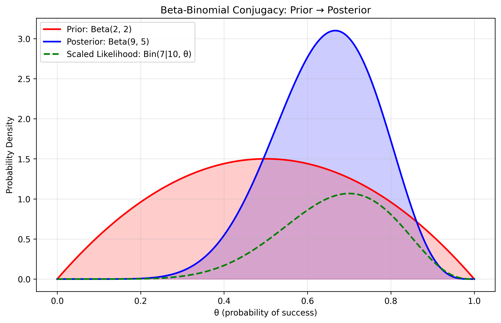
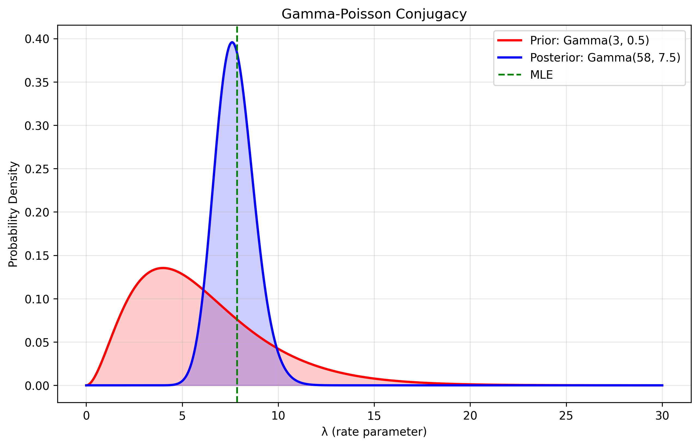
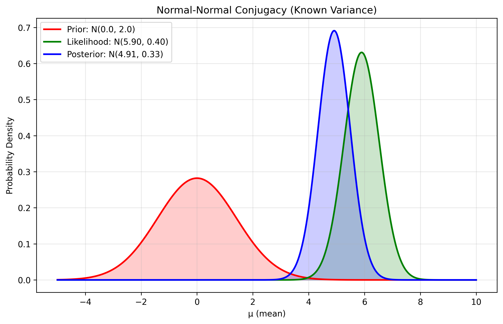
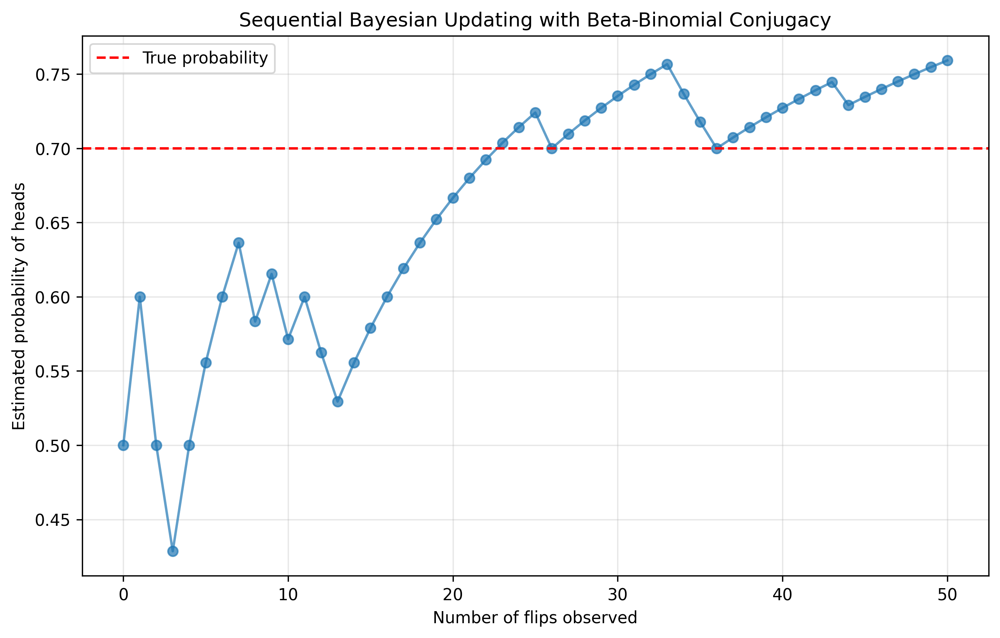
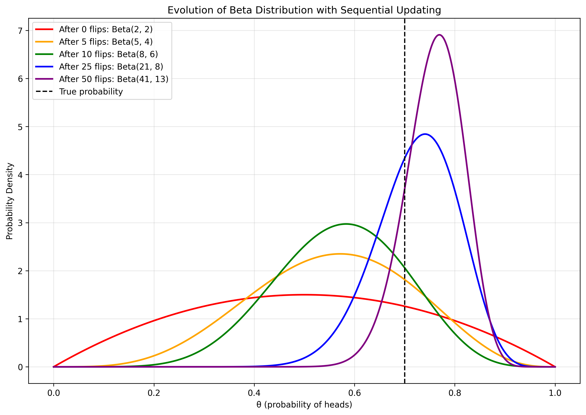

# Conjugate Priors: Examples

This document provides practical examples of conjugate priors in Bayesian inference, including code implementations and visualizations.

## Example 1: Beta-Binomial Conjugacy

The Beta distribution is conjugate to the Binomial likelihood. This is useful for modeling binary events such as coin flips or yes/no responses.

### Mathematical Formulation

- **Likelihood**: Binomial(n, θ) for data with k successes out of n trials
- **Prior**: Beta(α, β) where α, β are prior pseudo-counts
- **Posterior**: Beta(α + k, β + n - k)

### Visualization



*The image shows how the Beta prior (red) updates to the posterior (blue) after observing data. The likelihood is shown in green.*

The key calculations are:
- Prior: Beta(2, 2)
- Data: 7 successes out of 10 trials
- Posterior: Beta(2+7, 2+3) = Beta(9, 5)
- MAP estimate: $\frac{9-1}{9+5-2} = 0.6667$
- Posterior mean: $\frac{9}{9+5} = 0.6429$

## Example 2: Gamma-Poisson Conjugacy

The Gamma distribution is conjugate to the Poisson likelihood. This is useful for modeling count data such as website visits or arrival times.

### Mathematical Formulation

- **Likelihood**: Poisson(λ) for count data with sum(x) total counts in n observations
- **Prior**: Gamma(α, β) where α, β control the shape and rate
- **Posterior**: Gamma(α + sum(x), β + n)

### Visualization



*The graph shows the Gamma prior (red) and the posterior (blue) after observing count data. The MLE estimate is shown as a green vertical line.*

The key calculations are:
- Prior: Gamma(3, 0.5)
- Data: Counts [5, 8, 10, 4, 7, 12, 9]
- Posterior: Gamma(3+55, 0.5+7) = Gamma(58, 7.5)
- MAP estimate: $\frac{58-1}{7.5} = 7.6$
- Posterior mean: $\frac{58}{7.5} = 7.7333$
- MLE estimate: $\frac{55}{7} = 7.8571$

## Example 3: Normal-Normal Conjugacy with Known Variance

When the variance is known, the Normal distribution is conjugate to itself.

### Mathematical Formulation

For a normal likelihood with known variance σ² and unknown mean μ:

- **Likelihood**: Normal(μ, σ²) for data x₁, x₂, ..., xₙ
- **Prior**: Normal(μ₀, σ₀²)
- **Posterior**: Normal(μ', σ'²) where:

$$\mu' = \frac{\sigma^2\mu_0 + \sigma_0^2\sum x_i}{\sigma^2 + n\sigma_0^2}$$

$$\sigma'^2 = \frac{\sigma^2\sigma_0^2}{\sigma^2 + n\sigma_0^2}$$

### Visualization



*The plot shows the Normal prior (red), likelihood (green), and posterior (blue). The posterior balances information from both the prior and the data.*

The key calculations are:
- Prior: Normal(0, 2)
- Data: Generated with true mean of 5.0 and variance of 4.0
- Observed sample mean: 5.8961
- Posterior mean: 4.9134
- The posterior mean balances the prior mean with the observed data mean, weighted by their precisions

## Computational Benefits of Conjugate Priors

### Sequential Updating Example

One major advantage of conjugate priors is that they allow for sequential updating of beliefs as new data arrives.

### Visualization



*This plot shows how our estimate of a coin's bias evolves as we observe more flips. The red dashed line indicates the true probability (0.7).*



*This visualization shows how the Beta distribution evolves after 0, 5, 10, 25, and 50 coin flips. Notice how the distribution becomes more concentrated around the true value as more data is observed.*

This example shows:
- How to update Beta parameters after each new binary observation
- The evolution of our belief about a parameter as data accumulates
- The convergence of the posterior toward the true value with increasing data
- After 50 observations, our final estimate is 0.7593 (true value: 0.7000)

## Key Points to Remember

1. **Efficiency**: Conjugate priors provide computational efficiency by enabling closed-form posterior computations
2. **Interpretability**: Hyperparameters have intuitive interpretations as "pseudo observations"  
3. **Regularization**: The prior acts as a regularizer, preventing overfitting on small datasets
4. **Sequential Learning**: Posterior updates can be performed incrementally as new data arrives

The choice of conjugate prior should be guided by both mathematical convenience and how well it represents your prior beliefs about the parameter.

## Quiz Example

### Problem Statement
You are monitoring the defect rate in a manufacturing process. Based on historical data, you believe the defect rate is about 3%, and you model this using a Beta(6, 194) prior. Today's production run had 2 defects in a sample of 50 items.

1. What is the conjugate prior for a binomial (defect/no defect) model?
2. Calculate the posterior distribution parameters.
3. What is the posterior mean defect rate?
4. How does this compare to the maximum likelihood estimate from just today's data?

### Solution

**Step 1: Identify the conjugate prior**
For a binomial likelihood (defect/no defect data), the conjugate prior is a Beta distribution.

**Step 2: Define the prior**
- Prior distribution: Beta(α=6, β=194)
- Prior mean = $\frac{\alpha}{\alpha+\beta} = \frac{6}{200} = 0.03$ (3%)

**Step 3: Gather the data**
- Number of defects: x = 2
- Sample size: n = 50
- Sample proportion = $\frac{2}{50} = 0.04$ (4%)

**Step 4: Calculate the posterior distribution**
For a Beta-Binomial model, the posterior is Beta(α', β') where:

$$\alpha' = \alpha + x = 6 + 2 = 8$$

$$\beta' = \beta + (n - x) = 194 + (50 - 2) = 194 + 48 = 242$$

**Step 5: Calculate the posterior mean**
Posterior mean = $\frac{\alpha'}{\alpha'+\beta'} = \frac{8}{250} = 0.032$

**Step 6: Compare with MLE**
The maximum likelihood estimate (MLE) based only on today's data is:

$$\text{MLE} = \frac{x}{n} = \frac{2}{50} = 0.04$$

The posterior mean (3.2%) falls between the prior mean (3%) and the MLE (4%), but is closer to the prior because we had a strong prior belief (equivalent to 200 previous observations) compared to the new data (only 50 observations).

This example demonstrates how conjugate priors allow us to easily update our beliefs as new data arrives, balancing prior knowledge with new evidence in a mathematically elegant way.

## Running the Examples

You can run the examples individually using the Python files:

```bash
python3 ML_Obsidian_Vault/Lectures/2/Codes/beta_binomial_conjugacy.py
python3 ML_Obsidian_Vault/Lectures/2/Codes/gamma_poisson_conjugacy.py
python3 ML_Obsidian_Vault/Lectures/2/Codes/normal_normal_conjugacy.py
python3 ML_Obsidian_Vault/Lectures/2/Codes/sequential_updating.py
```

Or run all examples together using the combined file:

```bash
python3 ML_Obsidian_Vault/Lectures/2/Codes/conjugate_priors_examples.py
``` 