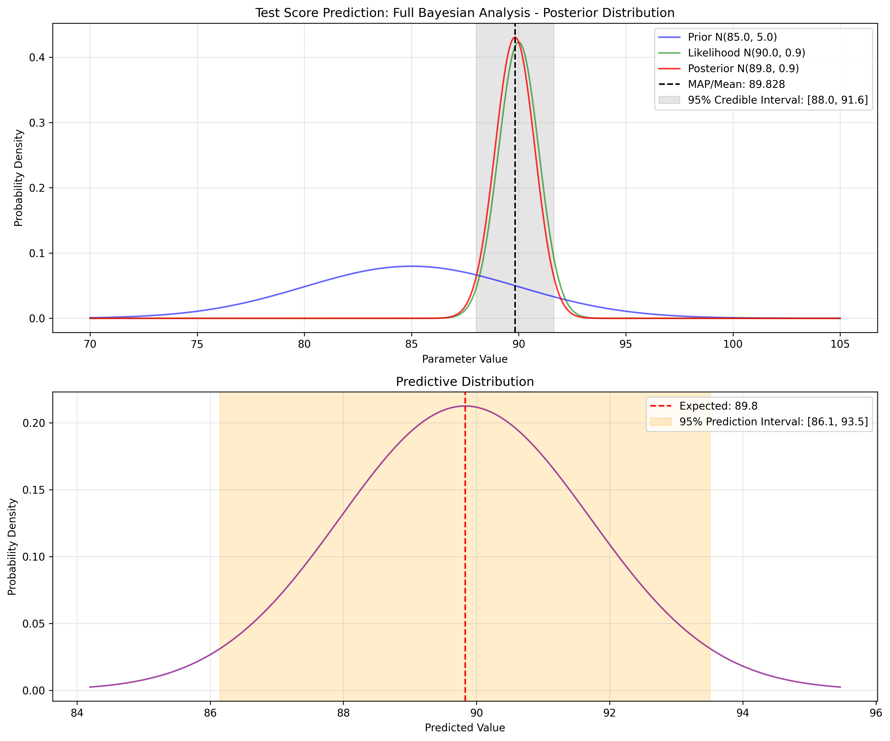
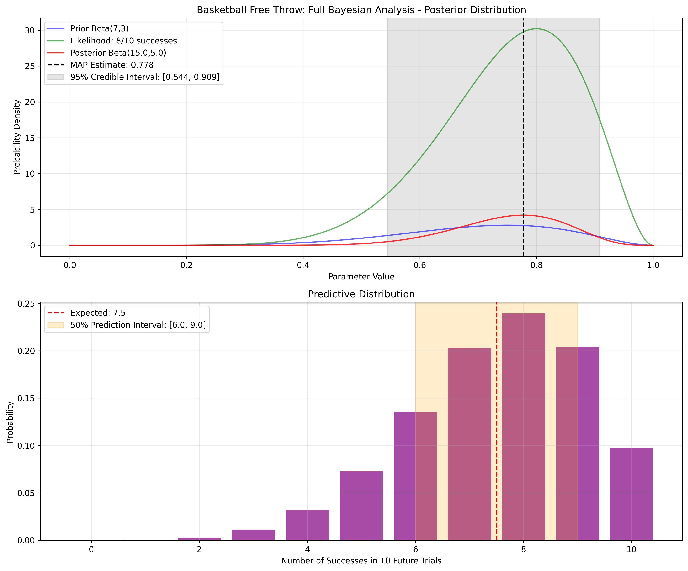
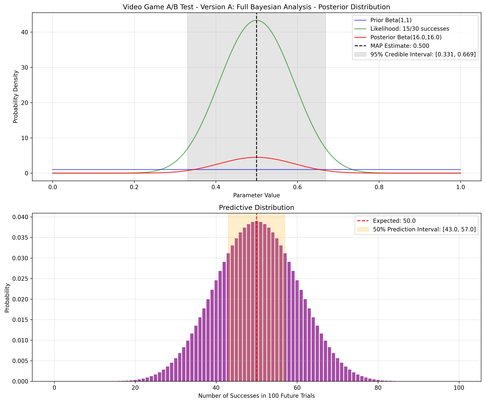
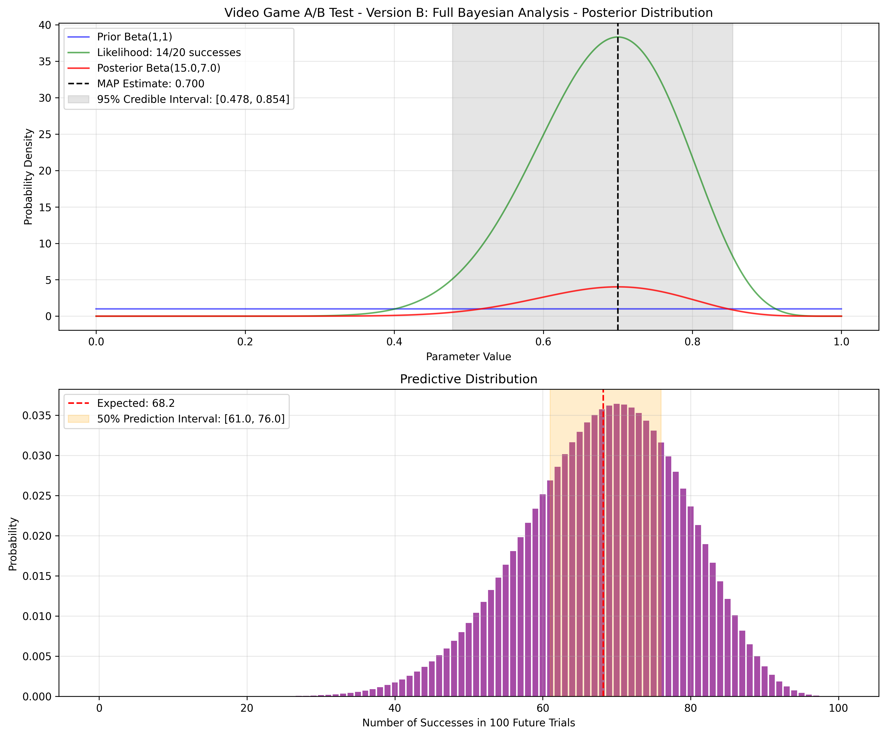

# Full Bayesian Inference

Full Bayesian Inference is a statistical approach that maintains complete probability distributions for parameters rather than settling for single point estimates. Unlike MLE (Maximum Likelihood Estimation) or MAP (Maximum A Posteriori) methods, the full Bayesian approach considers the entire posterior distribution and uses it for making predictions and decisions.

## Continuous Variable Bayesian Examples

The following examples demonstrate full Bayesian inference for continuous variables (normal distribution):

- **Test Score Prediction**: Predicting academic performance with uncertainty
- **Basketball Shot Accuracy**: Analyzing shooting performance with credible intervals
- **Financial Market Forecasting**: Quantifying uncertainty in investment returns

### Example 1: Test Score Prediction

#### Problem Statement
A student has performed at an average of 85 points on previous tests with a standard deviation of 5 points (this forms our prior belief). Recently, they've scored 92, 88, and 90 points on three consecutive tests after adopting a new study method. How can we update our belief about their true ability, quantify the uncertainty, and predict future test performance?

In this example:
- Prior belief centers around 85 points with standard deviation of 5 points based on historical performance
- New data shows three recent scores: 92, 88, and 90 points
- Full Bayesian inference provides a posterior distribution of the student's true ability
- Predictive distribution enables forecasting future test scores with appropriate uncertainty

#### Detailed Calculation

**Step 1: Define prior distribution parameters**
- Prior mean (μ₀) = 85 (historical average on tests)
- Prior variance (σ₀²) = 25 (representing uncertainty in historical performance)

**Step 2: Calculate sample statistics**
- Sample mean = 90 (average of 92, 88, and 90)
- Sample standard deviation = 1.63
- Number of observations (n) = 3
- Sample variance of the mean (σ²) = (1.63)²/3 = 0.89 (representing precision of the sample mean)

**Step 3: Calculate posterior distribution parameters**
For a normal-normal conjugate model, the posterior distribution is also normal with:

$$\text{Posterior precision} = \text{Prior precision} + \text{Sample precision} = \frac{1}{25} + \frac{3}{2.67} = 0.04 + 1.12 = 1.16$$

$$\text{Posterior variance} = \frac{1}{1.16} = 0.86$$

$$\text{Posterior mean} = \frac{(\text{Prior mean} \times \text{Prior precision}) + (\text{Sample mean} \times \text{Sample precision})}{\text{Posterior precision}}$$

$$\text{Posterior mean} = \frac{(85 \times 0.04) + (90 \times 1.12)}{1.16} = \frac{3.4 + 100.8}{1.16} = 89.83$$

**Step 4: Calculate credible interval**
For a 95% credible interval with a normal posterior:

$$\text{Lower bound} = \text{Posterior mean} - 1.96 \times \sqrt{\text{Posterior variance}} = 89.83 - 1.96 \times \sqrt{0.86} = 89.83 - 1.82 = 88.01$$

$$\text{Upper bound} = \text{Posterior mean} + 1.96 \times \sqrt{\text{Posterior variance}} = 89.83 + 1.96 \times \sqrt{0.86} = 89.83 + 1.82 = 91.64$$

**Step 5: Generate predictive distribution**
For predictions, we need to account for both:
- Uncertainty in our estimate of the true mean (posterior variance)
- Inherent variability in individual test scores (sample variance)

Predictive distribution for a future test score is normal with:

$$\text{Predictive mean} = \text{Posterior mean} = 89.83$$

$$\text{Predictive variance} = \text{Posterior variance} + \text{Sample variance} = 0.86 + 2.67 = 3.53$$

$$\text{Predictive standard deviation} = \sqrt{3.53} = 1.88$$

**Step 6: Calculate prediction interval**
For a 95% prediction interval:

$$\text{Lower bound} = \text{Predictive mean} - 1.96 \times \text{Predictive standard deviation} = 89.83 - 1.96 \times 1.88 = 86.15$$

$$\text{Upper bound} = \text{Predictive mean} + 1.96 \times \text{Predictive standard deviation} = 89.83 + 1.96 \times 1.88 = 93.51$$

This analysis gives us:
- A posterior distribution showing the student's true ability is likely around 89.83 points (95% credible interval: 88.01-91.64)
- A prediction that the next test score will be around 89.83 points (95% prediction interval: 86.15-93.51)
- Strong evidence (100% probability) that the student's true ability exceeds the historical average of 85 points



### Example 2: Basketball Free Throw Analysis

#### Problem Statement
A basketball player has historically made about 70% of their free throws. In a recent practice session, they made 8 out of 10 attempts. How can we update our belief about their true shooting ability, quantify the uncertainty, and predict future performance?

In this example:
- Prior belief centers around a 70% success rate (Beta(7,3) distribution)
- New data shows 8 successes in 10 attempts (80% success rate)
- Full Bayesian inference provides a posterior distribution of the true shooting percentage
- Predictive distribution enables forecasting future shooting performance with uncertainty

#### Detailed Calculation

**Step 1: Define prior distribution parameters**
- Prior distribution: Beta(7,3)
- Prior mean = 7/(7+3) = 0.7 (70% success rate)
- Prior mode = (7-1)/(7+3-2) = 0.75 (75% success rate)

**Step 2: Incorporate observed data**
- Observed data: 8 successes out of 10 attempts (80% success rate)

**Step 3: Calculate posterior distribution parameters**
For a Beta-Binomial conjugate model:

$$\text{Posterior Alpha} = \text{Prior Alpha} + \text{Successes} = 7 + 8 = 15$$

$$\text{Posterior Beta} = \text{Prior Beta} + \text{Failures} = 3 + 2 = 5$$

Our posterior distribution is Beta(15,5)

**Step 4: Calculate posterior statistics**

$$\text{Posterior mean} = \frac{15}{15+5} = 0.75$$

$$\text{Posterior mode} = \frac{15-1}{15+5-2} = \frac{14}{18} = 0.78$$

$$\text{Posterior standard deviation} = \sqrt{\frac{15 \times 5}{(15+5)^2 \times (15+5+1)}} = 0.09$$

**Step 5: Calculate credible interval**
For a 95% credible interval with a Beta posterior:
- Lower bound = 0.54 (2.5th percentile of Beta(15,5))
- Upper bound = 0.91 (97.5th percentile of Beta(15,5))

**Step 6: Generate predictive distribution**
The predictive distribution for the number of successes in future n trials follows a Beta-Binomial distribution:
- For 10 future shots, we can calculate:

$$\text{Expected number of successes} = 10 \times 0.75 = 7.5$$

$$\text{Predictive standard deviation} = 1.64$$

$$\text{Probability of making at least 7 shots} = 74.5\%$$

This analysis gives us:
- A posterior distribution showing the player's true shooting ability is likely around 75% (posterior mean) or 78% (posterior mode)
- A 95% credible interval of 54-91% for the true shooting percentage
- A prediction that the player will make about 7-8 shots in the next 10 attempts
- A 99% probability that the player's true shooting ability exceeds 50%



### Example 3: A/B Testing for Video Game Features

#### Problem Statement
A game developer is testing two versions of a game feature:
- Version A (control): 30 players tried it with 15 showing engagement (50% conversion)
- Version B (new): 20 players tried it with 14 showing engagement (70% conversion)

Is the new version truly better, or is this difference due to random chance? How much improvement can be expected?

In this example:
- We start with uninformative priors (Beta(1,1)) for both versions
- Observed data shows different conversion rates between versions
- Full Bayesian inference quantifies the probability that B is better than A
- The approach provides credible intervals for the true improvement

#### Detailed Calculation

Let's analyze both versions and compare them:

**Version A Analysis:**
- Prior: Beta(1,1) (uninformative)
- Data: 15 successes out of 30 trials
- Posterior: Beta(16,16)
- Posterior mean: 0.50
- 95% credible interval: 0.33 to 0.67

**Version B Analysis:**
- Prior: Beta(1,1) (uninformative)
- Data: 14 successes out of 20 trials
- Posterior: Beta(15,7)
- Posterior mean: 0.68
- 95% credible interval: 0.48 to 0.85

**Comparing Versions:**
To determine if Version B is truly better than Version A, we can:
1. Sample from both posterior distributions (e.g., 10,000 samples each)
2. Compare how often B's sampled value exceeds A's sampled value

Results:
- Probability that Version B is better than Version A: 91.6%
- Expected improvement: 18.4 percentage points
- 95% credible interval for the improvement: -7.6% to 42.4%

This analysis tells us:
- There's strong evidence (91.6% probability) that Version B is better than Version A
- We expect an 18.4 percentage point improvement on average
- The improvement could be as high as 42.4%, but there's a small chance (< 5%) that Version B is actually worse than Version A




## Bernoulli Variable Bayesian Examples

The following examples demonstrate full Bayesian inference for binary outcomes (Bernoulli distribution):

- **Basketball Free Throws**: Predicting shooting performance with uncertainty
- **Video Game A/B Testing**: Comparing feature effectiveness with probability statements
- **Medical Treatment Efficacy**: Evaluating treatment success rates with credible intervals

### Example 1: Basketball Free Throws

#### Problem Statement
A basketball player has historically made about 70% of their free throws. In a recent practice session, they made 8 out of 10 attempts. Using full Bayesian inference, we can update our beliefs about their true shooting ability and predict future performance with appropriate uncertainty.

In this example:
- Prior belief centers around a 70% success rate (Beta(7,3) distribution)
- New data shows 8 successes in 10 attempts (80% success rate)
- Full Bayesian inference provides a complete posterior distribution for the true shooting percentage
- Predictive distribution enables probabilistic forecasts about future performance

#### Detailed Calculation

**Step 1: Define prior distribution**
- Prior distribution: Beta(7,3)
- Prior mean = 7/(7+3) = 0.7 (70%)
- Prior mode = (7-1)/(7+3-2) = 0.75 (75%)

**Step 2: Calculate posterior distribution**
- Observed data: 8 successes in 10 attempts
- Posterior distribution: Beta(7+8, 3+2) = Beta(15, 5)
- Posterior mean = 15/(15+5) = 0.75 (75%)
- Posterior mode = (15-1)/(15+5-2) = 0.778 (77.8%)

**Step 3: Generate posterior samples and credible intervals**
- 95% credible interval: [0.544, 0.909]
- This means we're 95% confident the true shooting percentage is between 54.4% and 90.9%

**Step 4: Generate predictive distribution**
- For 10 future free throws, the predictive distribution is Beta-Binomial(10, 15, 5)
- Expected successes: 7.5 shots
- Probability of making ≥7 shots: 74.5%
- 50% prediction interval: [7, 9] shots

This full Bayesian approach gives us more than just a point estimate; it provides:
- A complete probability distribution for the player's true ability
- Quantified uncertainty via credible intervals
- Predictions with appropriate uncertainty for future performance
- Probability statements about specific outcomes


### Example 2: Video Game A/B Testing

#### Problem Statement
A game developer is testing two versions of a game feature:
- Version A (control): 30 players tried it with 15 showing engagement (50% conversion)
- Version B (new): 20 players tried it with 14 showing engagement (70% conversion)

Rather than just comparing the conversion rates directly, full Bayesian inference allows us to compute the probability that version B is truly better than version A, along with how much better it might be.

In this example:
- We analyze both versions independently with uninformative priors
- Then we compare their posterior distributions to make probabilistic statements
- This approach accounts for the uncertainty in both estimates

#### Detailed Calculation

**For Version A:**
- Prior: Beta(1,1) (uninformative)
- Data: 15 successes out of 30 trials
- Posterior: Beta(16,16)
- Posterior mean: 16/(16+16) = 0.5

**For Version B:**
- Prior: Beta(1,1) (uninformative)
- Data: 14 successes out of 20 trials
- Posterior: Beta(15,7)
- Posterior mean: 15/(15+7) = 0.682

**Comparing the Versions:**
- Draw 10,000 samples from each posterior
- Calculate probability that B > A: 91.6%
- Calculate expected difference: 18.4 percentage points
- 95% credible interval for the difference: [-7.6%, 42.4%]

This analysis tells us:
- There's a 91.6% probability that Version B is truly better than Version A
- We expect Version B to perform about 18.4 percentage points better on average
- However, there's some uncertainty - the difference could be as large as 42.4%, or Version B might actually be slightly worse than Version A


### Example 3: Medical Treatment Efficacy

#### Problem Statement
A researcher is evaluating a new medical treatment. Historical data indicates similar treatments have about a 60% success rate. In a small clinical trial, the new treatment showed success in 7 out of 9 patients (77.8%). How can we evaluate the effectiveness of this treatment with appropriate uncertainty?

In this example:
- Prior belief centers around a 60% success rate (Beta(6,4) distribution)
- New data shows 7 successes in 9 attempts (77.8% success rate)
- Full Bayesian inference provides a posterior distribution for the true efficacy
- The approach enables informed decision-making about further research or implementation

#### Detailed Calculation

**Step 1: Define prior distribution**
- Prior distribution: Beta(6,4)
- Prior mean = 6/(6+4) = 0.6 (60%)
- Prior mode = (6-1)/(6+4-2) = 0.625 (62.5%)

**Step 2: Calculate posterior distribution**
- Observed data: 7 successes in 9 patients
- Posterior distribution: Beta(6+7, 4+2) = Beta(13, 6)
- Posterior mean = 13/(13+6) = 0.684 (68.4%)
- Posterior mode = (13-1)/(13+6-2) = 0.706 (70.6%)

**Step 3: Make probability statements**
- Probability the true efficacy exceeds 60%: 85.6%
- Probability the true efficacy exceeds 70%: 46.2%
- 95% credible interval: [0.49, 0.84]

**Step 4: Predictive performance**
- If we treat 20 new patients, expected number of successes: 13.7
- Probability of at least 15 successes in 20 patients: 32.8%
- 50% prediction interval: [12, 16] successes

This full Bayesian approach provides:
- A nuanced understanding of the treatment's efficacy
- Proper quantification of uncertainty given the small sample size
- Ability to make probabilistic predictions for future treatment outcomes
- Framework for updating beliefs as more data becomes available

## Key Concepts in Full Bayesian Inference

1. **Complete Posterior Distributions**: Instead of point estimates, full Bayesian inference maintains entire probability distributions for parameters.

2. **Credible Intervals**: Directly interpretable probability statements about parameters (e.g., "95% probability the true parameter lies in this range").

3. **Predictive Distributions**: Forecasts that incorporate both parameter uncertainty and inherent randomness.

4. **Probability Statements**: Ability to calculate probabilities for specific hypotheses (e.g., "probability that treatment A is better than treatment B").

5. **Incremental Updating**: Natural framework for incorporating new data as it becomes available.

## Advantages Over Point Estimation

1. **Uncertainty Quantification**: Properly represents all sources of uncertainty in parameters and predictions.

2. **No Asymptotic Assumptions**: Works well with small sample sizes unlike MLE.

3. **Prior Information**: Naturally incorporates prior knowledge unlike MLE.

4. **Decision Making**: Provides complete probability distributions for optimal decision-making.

5. **Robustness**: Less susceptible to overfitting compared to point estimates.

## Key Differences Between Full Bayesian and MAP

### 1. Uncertainty Quantification

**MAP Estimation**:
- Provides only a single "best" value (the mode of the posterior)
- No built-in measure of uncertainty or confidence

**Full Bayesian Inference**:
- Maintains the entire posterior distribution
- Provides credible intervals that directly quantify parameter uncertainty
- Enables calculation of the probability that a parameter falls in any range of interest

### 2. Decision Making

**MAP Estimation**:
- Makes decisions based solely on the most likely parameter value
- Cannot incorporate asymmetric loss functions or risk preferences

**Full Bayesian Inference**:
- Can incorporate decision theory with explicit loss functions
- Enables expected utility maximization rather than just point estimation
- Allows risk-sensitive decision making

### 3. Prediction

**MAP Estimation**:
- Makes predictions using only the MAP estimate of parameters
- Ignores parameter uncertainty in predictions

**Full Bayesian Inference**:
- Generates predictive distributions that account for both parameter uncertainty and inherent randomness
- Provides prediction intervals that reflect all sources of uncertainty
- Enables probability statements about future observations

### 4. Hypothesis Testing

**MAP Estimation**:
- Limited ability to assess evidence for specific hypotheses
- Cannot directly calculate probabilities of hypotheses

**Full Bayesian Inference**:
- Can directly calculate the probability of scientific hypotheses
- Provides Bayes factors to quantify evidence strength
- Avoids many problems of traditional null hypothesis significance testing

## Formula Derivation

For a normal distribution with known variance:

The posterior distribution is Normal with:

$$\mu_n = \frac{\sigma^2\mu_0 + n\sigma_0^2\bar{x}}{\sigma^2 + n\sigma_0^2}$$

$$\sigma_n^2 = \frac{\sigma^2\sigma_0^2}{\sigma^2 + n\sigma_0^2}$$

Where:
- μ₀, σ₀² = prior mean and variance
- x̄, σ² = sample mean and variance
- n = number of observations

For a Bernoulli distribution with Beta prior:

The posterior distribution is Beta with:

$$\alpha' = \alpha + s$$

$$\beta' = \beta + n - s$$

Where:
- α, β = parameters of the Beta prior
- s = number of successes
- n = number of trials

## Quiz Example

### Problem Statement
You are analyzing the conversion rate of an email marketing campaign. Based on historical campaigns, you believe the conversion rate is around 5%, but with some uncertainty. You model this prior belief as a Beta(10, 190) distribution, centered at 5% but allowing for reasonable variation.

After running the new campaign, you observe 7 conversions from 100 emails sent. Using full Bayesian inference:

1. Calculate the posterior distribution parameters.
2. What is the posterior mean conversion rate?
3. Calculate a 95% credible interval for the true conversion rate.

### Solution

**Step 1: Define prior distribution**
- Prior distribution: Beta(α=10, β=190)
- Prior mean = α/(α+β) = 10/200 = 0.05 (5%)

**Step 2: Gather data**
- Number of conversions (successes): s = 7
- Number of emails (trials): n = 100

**Step 3: Calculate posterior distribution**
For a Beta-Bernoulli model, the posterior is Beta(α', β') where:

$$\alpha' = \alpha + s = 10 + 7 = 17$$

$$\beta' = \beta + (n - s) = 190 + (100 - 7) = 190 + 93 = 283$$

**Step 4: Calculate posterior mean**

$$\text{Posterior mean} = \frac{\alpha'}{\alpha'+\beta'} = \frac{17}{300} = 0.0567$$

**Step 5: Calculate 95% credible interval**
For a Beta(17, 283) distribution, the 95% credible interval can be calculated using quantiles (2.5th and 97.5th percentiles):
- Lower bound: 0.0341 (3.41%)
- Upper bound: 0.0867 (8.67%)

This means we're 95% confident that the true conversion rate is between 3.41% and 8.67%.

**Interpretation**: The posterior mean (5.67%) is between the prior mean (5%) and the sample proportion (7%), weighted by their relative precision. The relatively narrow credible interval indicates we have good confidence in our estimate.

## Running the Examples

You can run the examples using the Python file:

```bash
python3 ML_Obsidian_Vault/Lectures/2/Codes/full_bayesian_examples.py
``` 