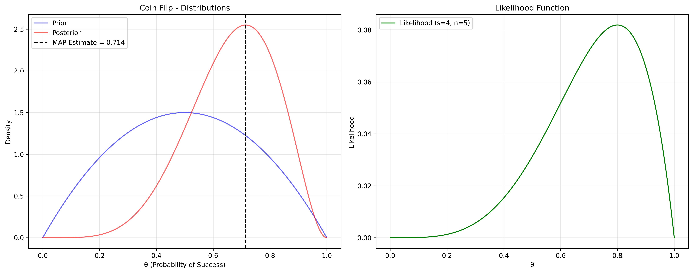
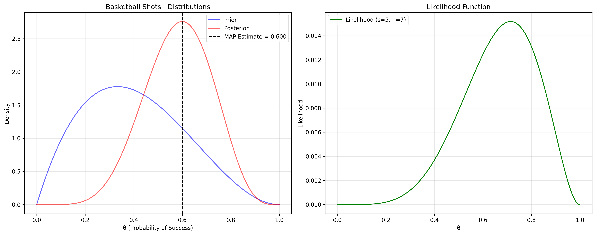
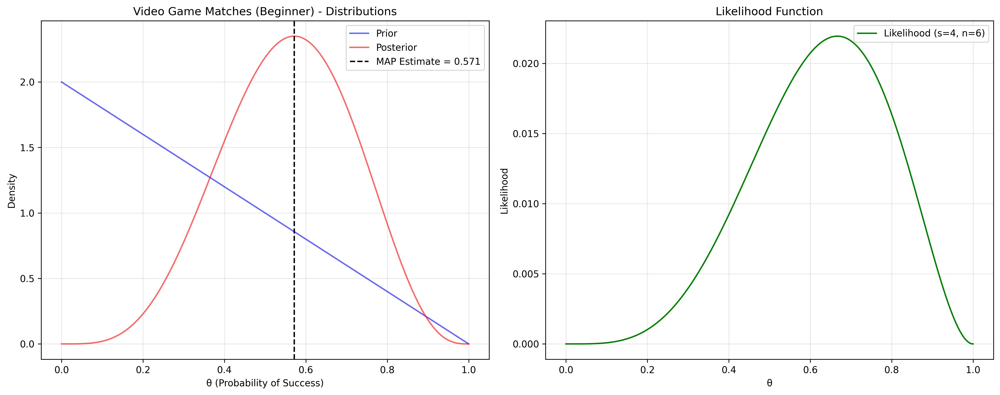
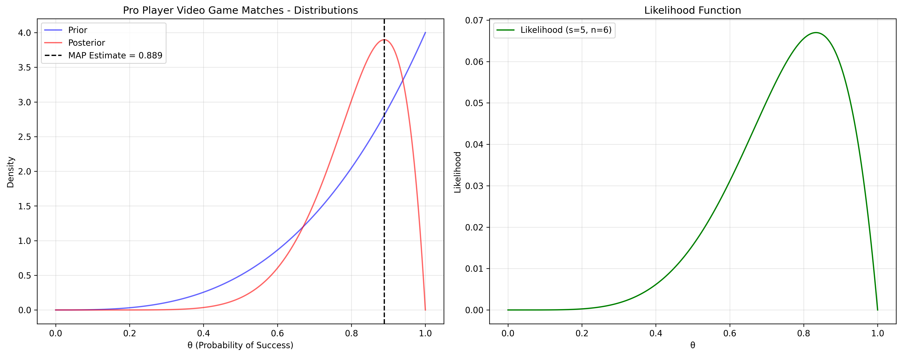

# Bernoulli Distribution MAP Examples

This document provides practical examples of Maximum A Posteriori (MAP) estimation for Bernoulli distributions, illustrating the concept of finding the most likely value of a binary outcome parameter given observed data and prior beliefs.

## Key Concepts and Formulas

For a Bernoulli distribution with a Beta prior, the MAP formula is:

$$\hat{\theta}_{\text{MAP}} = \frac{\alpha + s - 1}{\alpha + \beta + n - 2}$$

Where:
- $\hat{\theta}_{\text{MAP}}$ = MAP estimate
- $\alpha, \beta$ = Parameters of the Beta prior distribution
- $s$ = Number of successes
- $n$ = Number of trials

## Bernoulli MAP Examples

The following examples demonstrate MAP estimation for binary outcomes (Bernoulli distribution):

- **Coin Flips**: Testing if a coin is fair
- **Basketball Free Throws**: Estimating free throw success rate
- **Video Game Wins (Beginner)**: Tracking win rates for beginners
- **Pro Player Video Game Wins**: Tracking win rates for experienced players

### Example 1: Coin Flips

#### Problem Statement
You've found an old coin and want to determine if it's fair (50% chance of heads) or biased. You flip the coin 5 times and get 4 heads (80% heads). However, with such a small sample size, it's difficult to know if this is due to chance or if the coin is actually biased.

In this example:
- Prior belief assumes the coin is likely fair (Beta(2,2))
- New data shows 4 heads in 5 flips (80% heads)
- The MAP estimate calculates the most likely probability of getting heads
- This analysis helps determine if the coin might be biased based on limited data

#### Solution

We'll use the MAP formula for a Bernoulli distribution with Beta prior to calculate the most likely probability of heads.

##### Step 1: Define Beta prior parameters
- α (prior successes parameter) = 2
- β (prior failures parameter) = 2
- This Beta(2,2) prior represents our belief that the coin is likely fair, with the mode at 0.5

##### Step 2: Calculate sample statistics
- Number of successes (s) = 4 heads
- Number of trials (n) = 5 flips
- Sample proportion = 4/5 = 0.8 or 80% heads

##### Step 3: Calculate posterior parameters
- Posterior α = Prior α + successes = 2 + 4 = 6
- Posterior β = Prior β + failures = 2 + (5-4) = 3
- Our posterior distribution is Beta(6,3)

##### Step 4: Apply the MAP formula for Beta-Bernoulli
For a Bernoulli distribution with Beta prior, the MAP estimate is:

$$\hat{\theta}_{\text{MAP}} = \frac{\alpha + s - 1}{\alpha + \beta + n - 2}$$

For our posterior Beta(6,3):

$$\hat{\theta}_{\text{MAP}} = \frac{6 - 1}{6 + 3 - 2} = \frac{5}{7} = 0.714$$ or 71.4%

##### Step 5: Interpret the results
This MAP estimate of 71.4% suggests that based on our prior belief and the observed data, the most likely probability of the coin landing heads is about 71.4%, indicating the coin might be slightly biased toward heads, but not as extreme as the 80% observed in our small sample.



### Example 2: Basketball Free Throws

#### Problem Statement
You're a teenager practicing basketball free throws and want to estimate your true success rate. Based on general statistics, the average success rate for teenagers is around 40%. You take 7 shots and make 5 of them (71.4% success rate). Is this performance representative of your true ability, or just a lucky streak?

#### Solution

##### Step 1: Define Beta prior parameters
- α (prior successes parameter) = 2
- β (prior failures parameter) = 3
- This Beta(2,3) prior represents our belief that teens typically have a 40% success rate

##### Step 2: Calculate sample statistics
- Number of successes (s) = 5
- Number of trials (n) = 7
- Sample proportion = 5/7 = 0.714 or 71.4%

##### Step 3: Calculate posterior parameters
- Posterior α = Prior α + successes = 2 + 5 = 7
- Posterior β = Prior β + failures = 3 + (7-5) = 5
- Our posterior distribution is Beta(7,5)

##### Step 4: Apply the MAP formula for Beta-Bernoulli
Using the formula:

$$\hat{\theta}_{\text{MAP}} = \frac{\alpha + s - 1}{\alpha + \beta + n - 2} = \frac{7 - 1}{7 + 5 - 2} = \frac{6}{10} = 0.6$$ or 60%

##### Step 5: Interpret the results
The MAP estimate of 60% suggests that your true ability is better than the average teen (40%), but not quite as high as your recent performance (71.4%). This balances your prior knowledge with the observed data.



### Example 3: Video Game Wins (Beginner)

#### Problem Statement
You're a beginner at a video game and want to track your win rate. Since you're new to the game, you expect a relatively low win rate initially. You play 6 matches and win 4 of them (66.7% win rate). This seems high for a beginner, so you want to estimate your true skill level using MAP estimation.

#### Solution

##### Step 1: Define Beta prior parameters
- α (prior successes parameter) = 1
- β (prior failures parameter) = 2
- This Beta(1,2) prior represents our belief that beginners typically have a low win rate

##### Step 2: Calculate sample statistics
- Number of successes (s) = 4
- Number of trials (n) = 6
- Sample proportion = 4/6 = 0.667 or 66.7%

##### Step 3: Calculate posterior parameters
- Posterior α = Prior α + successes = 1 + 4 = 5
- Posterior β = Prior β + failures = 2 + (6-4) = 4
- Our posterior distribution is Beta(5,4)

##### Step 4: Apply the MAP formula for Beta-Bernoulli
Using the formula:

$$\hat{\theta}_{\text{MAP}} = \frac{\alpha + s - 1}{\alpha + \beta + n - 2} = \frac{5 - 1}{5 + 4 - 2} = \frac{4}{7} = 0.571$$ or 57.1%

##### Step 5: Interpret the results
The MAP estimate of 57.1% suggests that your true skill level is higher than what would be expected for a beginner (33%), but not as high as your recent performance (66.7%). This balanced estimate accounts for both your prior expectation as a beginner and your surprising success rate.



### Example 4: Pro Player Video Game Wins

#### Problem Statement
You're analyzing a professional player's performance in the same video game. Given their expertise, you expect them to have a high win rate (around 80%). They play 6 matches and win 5 of them (83.3% win rate). You want to estimate their true win probability using MAP estimation.

#### Solution

##### Step 1: Define Beta prior parameters
- α (prior successes parameter) = 4
- β (prior failures parameter) = 1
- This Beta(4,1) prior represents our belief that professional players typically have a high win rate

##### Step 2: Calculate sample statistics
- Number of successes (s) = 5
- Number of trials (n) = 6
- Sample proportion = 5/6 = 0.833 or 83.3%

##### Step 3: Calculate posterior parameters
- Posterior α = Prior α + successes = 4 + 5 = 9
- Posterior β = Prior β + failures = 1 + (6-5) = 2
- Our posterior distribution is Beta(9,2)

##### Step 4: Apply the MAP formula for Beta-Bernoulli
Using the formula:

$$\hat{\theta}_{\text{MAP}} = \frac{\alpha + s - 1}{\alpha + \beta + n - 2} = \frac{9 - 1}{9 + 2 - 2} = \frac{8}{9} = 0.889$$ or 88.9%

##### Step 5: Interpret the results
The MAP estimate of 88.9% suggests that the professional player's true win rate is even higher than expected (80%) and their recent performance (83.3%). This is because both the prior and the observed data point to a high win rate, and the MAP estimate reflects this combined information.



## Example 5: Email Marketing Click-Through Rate

#### Problem Statement
An email marketer is trying to determine the true click-through rate (CTR) for a new campaign. Based on previous similar campaigns, they expect around a 5% CTR. After sending 100 emails in a test batch, they observe 8 clicks (8% CTR). They want to estimate the true CTR for this new campaign.

#### Solution

##### Step 1: Define Beta prior parameters
- α (prior successes parameter) = 5
- β (prior failures parameter) = 95
- This Beta(5,95) prior represents our belief that the CTR is around 5%

##### Step 2: Calculate sample statistics
- Number of successes (s) = 8 clicks
- Number of trials (n) = 100 emails
- Sample proportion = 8/100 = 0.08 or 8% CTR

##### Step 3: Calculate posterior parameters
- Posterior α = Prior α + successes = 5 + 8 = 13
- Posterior β = Prior β + failures = 95 + (100-8) = 187
- Our posterior distribution is Beta(13,187)

##### Step 4: Apply the MAP formula for Beta-Bernoulli
Using the formula:

$$\hat{\theta}_{\text{MAP}} = \frac{\alpha + s - 1}{\alpha + \beta + n - 2} = \frac{13 - 1}{13 + 187 - 2} = \frac{12}{198} = 0.0606$$ or 6.06%

##### Step 5: Interpret the results
The MAP estimate of 6.06% suggests that the true CTR for this new campaign is likely higher than the previous campaigns (5%), but not as high as the observed test batch (8%). The estimate is closer to the prior because we have strong prior beliefs based on many previous campaigns, but the new data has pulled the estimate upward.

## Key Insights

### Theoretical Insights
- MAP estimation with Beta-Bernoulli provides a principled way to incorporate prior beliefs about binomial probabilities
- The posterior Beta distribution parameters are simply α + successes, β + failures
- The influence of the prior depends on its "strength" (α + β) relative to the sample size
- The Beta prior is the conjugate prior for Bernoulli likelihood, leading to a Beta posterior

### Practical Applications
- Medical diagnosis with limited test data
- A/B testing in marketing with small sample sizes
- Sports analytics with small numbers of games/events
- Quality control in manufacturing with limited inspection samples

### Common Pitfalls
- Using an uninformative prior when you actually have prior beliefs
- Using too strong a prior that overwhelms relevant new data
- Forgetting that the MAP estimate is a point estimate, not the full posterior distribution
- Applying the wrong formula (using MLE when sample size is very small)

## Running the Examples

You can run the code that generates these examples and visualizations using:

```bash
python3 ML_Obsidian_Vault/Lectures/2/Codes/bernoulli_map_examples.py
```

## Related Topics

- [[L2_7_MAP_Examples|MAP Examples]]: Overview of MAP estimation across different distributions
- [[L2_4_MLE_Bernoulli|Bernoulli Distribution MLE]]: Comparison with MLE for Bernoulli distributions
- [[L2_5_Bayesian_Inference|Bayesian Inference]]: Foundational framework for MAP estimation
- [[L2_1_Beta_Distribution|Beta Distribution]]: Conjugate prior for Bernoulli likelihood 