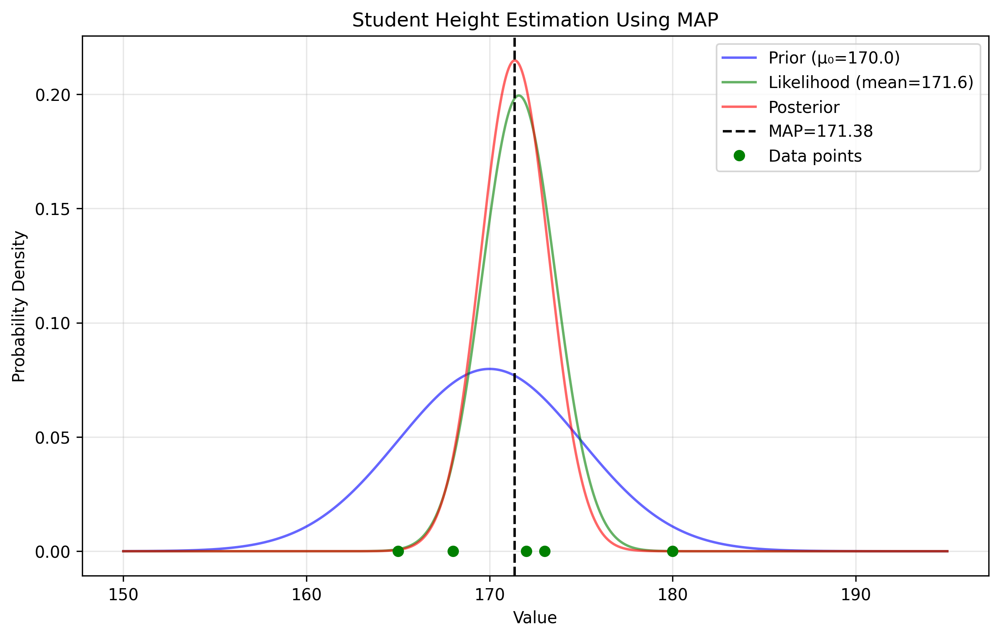
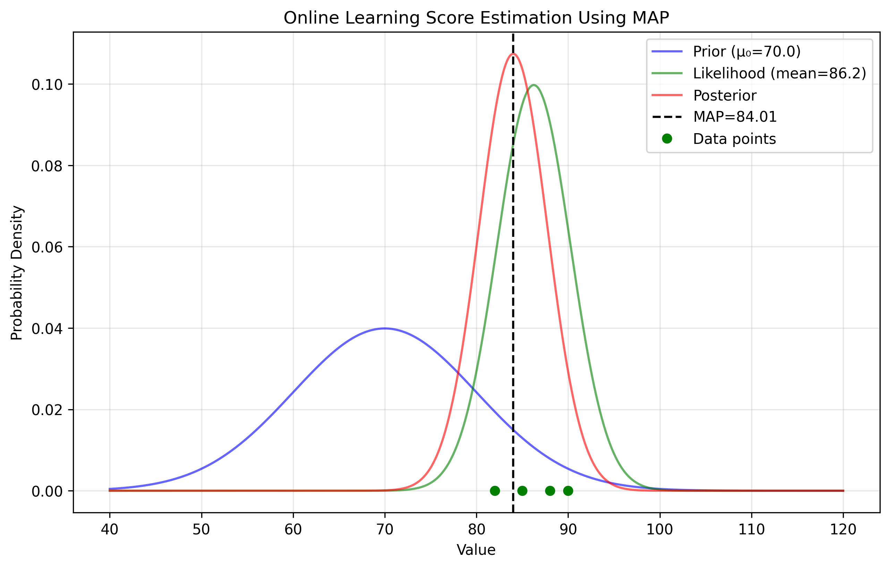
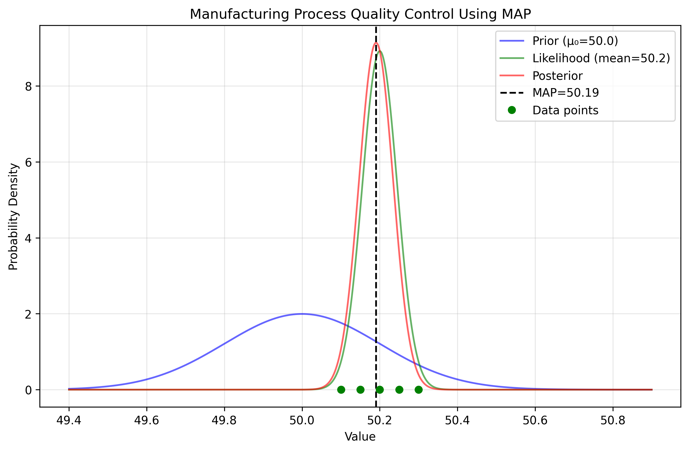
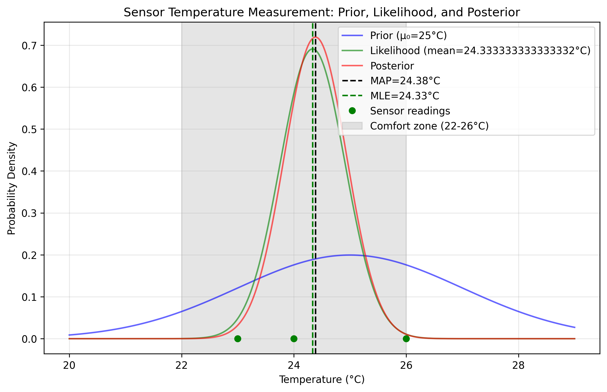

# MAP Formula Examples

This document provides practical examples of Maximum A Posteriori (MAP) estimation for various real-world applications, demonstrating the mathematical formulas and calculations involved in finding MAP estimates.

## Key Concepts and Formulas

For estimating the mean of a normal distribution with known variance, the MAP formula is:

$$
\hat{\mu}_{MAP} = \frac{\mu_0 + \frac{\sigma_0^2}{\sigma^2}\sum_{i=1}^N x^{(i)}}{1 + \frac{\sigma_0^2}{\sigma^2}N}
$$

This can be simplified by defining the variance ratio $r = \frac{\sigma_0^2}{\sigma^2}$:

$$
\hat{\mu}_{MAP} = \frac{\mu_0 + r \sum_{i=1}^N x^{(i)}}{1 + r \times N}
$$

Where:
- $\hat{\mu}_{MAP}$ = MAP estimate
- $\mu_0$ = Prior mean
- $\sigma_0^2$ = Prior variance 
- $\sigma^2$ = Data variance
- $\sum_{i=1}^N x^{(i)}$ = Sum of observations
- $N$ = Number of observations
- $r$ = Variance ratio

## Real-World Application Examples

The following examples demonstrate MAP estimation for different real-world applications:

- **Student Height**: Estimating average height of students in a class
- **Online Learning Scores**: Estimating a student's true skill level 
- **Manufacturing Process**: Quality control in component production
- **Sensor Measurement**: Estimating true temperature with error-prone sensors

### Example 1: Student Height

#### Problem Statement
We want to estimate the average height of students in a class based on prior knowledge and a small sample of measured heights.

In this example:
- We have prior knowledge about average student height
- We assume heights follow a normal distribution
- We're trying to estimate the true mean height
- We have a small sample of measured heights

#### Solution

We'll apply the MAP formula to combine our prior belief with the observed heights.

##### Step 1: Define the prior and data parameters
- Prior mean: $\mu_0 = 170$ cm
- Prior variance: $\sigma_0^2 = 25$ cm²
- Observed heights: [165, 173, 168, 180, 172] cm
- Number of observations: $N = 5$
- Data variance: $\sigma^2 = 20$ cm²

$$r = \frac{\sigma_0^2}{\sigma^2} = \frac{25}{20} = 1.25$$

##### Step 2: Calculate the MAP estimate
$$\hat{\mu}_{MAP} = \frac{\mu_0 + r \sum x^{(i)}}{1 + r \times N} = \frac{170 + 1.25 \times 858}{1 + 1.25 \times 5} = \frac{1242.5}{7.25} = 171.38 \text{ cm}$$

Therefore, our best estimate of the true average height is 171.38 cm, which lies between our prior belief (170 cm) and the sample mean (171.6 cm), slightly closer to the sample mean because we trust the data slightly more than our prior.



### Example 2: Online Learning Scores

#### Problem Statement
We want to estimate a student's true skill level in an online learning platform based on prior knowledge of average scores and recent quiz results.

#### Solution

##### Step 1: Define the prior and data parameters
- Prior mean (average score): $\mu_0 = 70$ (out of 100)
- Prior variance: $\sigma_0^2 = 100$
- Observed scores: [85, 82, 90, 88]
- Number of observations: $N = 4$
- Data variance: $\sigma^2 = 64$

$$r = \frac{\sigma_0^2}{\sigma^2} = \frac{100}{64} = 1.5625$$

##### Step 2: Calculate the MAP estimate
$$\hat{\mu}_{MAP} = \frac{\mu_0 + r \sum x^{(i)}}{1 + r \times N} = \frac{70 + 1.5625 \times 345}{1 + 1.5625 \times 4} = \frac{609.06}{7.25} = 84.01$$

The MAP estimate of 84.01 suggests the student's true skill level is well above the average (70), but slightly below their recent performance average (86.25).



### Example 3: Manufacturing Process Quality Control

#### Problem Statement
We want to estimate the true dimension of components in a manufacturing process using design specifications and actual measurements.

#### Solution

##### Step 1: Define the prior and data parameters
- Prior mean (design specification): $\mu_0 = 50$ mm
- Prior variance: $\sigma_0^2 = 0.04$ mm²
- Observed measurements: [50.2, 50.3, 50.1, 50.25, 50.15] mm
- Number of observations: $N = 5$
- Data variance: $\sigma^2 = 0.01$ mm²

$$r = \frac{\sigma_0^2}{\sigma^2} = \frac{0.04}{0.01} = 4$$

##### Step 2: Calculate the MAP estimate
$$\hat{\mu}_{MAP} = \frac{\mu_0 + r \sum x^{(i)}}{1 + r \times N} = \frac{50 + 4 \times 251}{1 + 4 \times 5} = \frac{1054}{21} = 50.19 \text{ mm}$$

The MAP estimate of 50.19 mm indicates that the true component dimension is slightly larger than the design specification (50.0 mm), but within acceptable tolerance.



### Example 4: Sensor Measurement

#### Problem Statement
We want to estimate the true temperature in a room using a sensor with known error characteristics, combining expected temperature with actual readings.

#### Solution

##### Step 1: Define the prior and data parameters
- Prior mean (expected temperature): $\mu_0 = 25$ °C
- Prior variance: $\sigma_0^2 = 4$ °C²
- Observed readings: [23, 24, 26] °C
- Number of observations: $N = 3$
- Sample mean: $(23 + 24 + 26)/3 = 24.33$ °C
- Data variance: $\sigma^2 = 1$ °C²

$$r = \frac{\sigma_0^2}{\sigma^2} = \frac{4}{1} = 4$$

##### Step 2: Calculate the MAP estimate
$$\hat{\mu}_{MAP} = \frac{\mu_0 + r \sum x^{(i)}}{1 + r \times N} = \frac{25 + 4 \times 73}{1 + 4 \times 3} = \frac{317}{13} = 24.38 \text{ °C}$$

The MAP estimate of 24.38 °C is between our prior belief (25 °C) and the sample mean (24.33 °C), but much closer to the sample mean. This indicates that our observations have significantly influenced our estimate despite having a strong prior belief.

##### Step 3: Analysis and Interpretation
In this case, the variance ratio (r = 4) indicates we trust our sensor readings more than our prior expectation. The MAP estimate (24.38 °C) is closer to our sample mean (24.33 °C) than to our prior (25 °C), showing that the data has more influence on our final estimate.

For temperature control applications, knowing that the true temperature is likely around 24.38 °C (which falls within typical comfort zones of 22-26 °C) means no adjustment to heating or cooling systems is needed.



The above visualization shows the prior distribution (blue), likelihood from observed data (green), and posterior distribution (red). The vertical lines indicate the MAP estimate (black dashed) and MLE estimate (green dashed). The gray shaded region represents the comfort zone (22-26 °C).

## Example 5: True/False Questions on MAP Estimation

**Question 1**: As the number of observations increases to infinity, the MAP estimate will always converge to the Maximum Likelihood Estimate regardless of the prior distribution.

**Answer**: TRUE

**Explanation**: As N approaches infinity, the influence of the prior diminishes, and the data dominates the estimation. This can be seen from the MAP formula where the term with the observations grows proportionally with N, eventually overwhelming the prior term.

**Question 2**: The regularization effect of MAP estimation comes from the prior distribution.

**Answer**: TRUE

**Explanation**: In MAP estimation, the prior distribution acts as a regularizer that penalizes certain parameter values. This is why MAP estimation with a Gaussian prior on parameters corresponds to L2 regularization in machine learning models.

**Question 3**: In the context of normal distributions with known variance, if the prior variance equals the data variance, the MAP estimate will always be the average of the prior mean and the sample mean.

**Answer**: FALSE

**Explanation**: When prior variance equals data variance, the MAP estimate becomes a weighted average where the prior mean has weight 1 and each observation has weight 1. The result depends on the number of observations and is not simply the average of prior mean and sample mean.

**Question 4**: MAP estimation is considered a "compromise" between MLE and pure Bayesian inference.

**Answer**: TRUE

**Explanation**: While MLE only uses data and full Bayesian inference considers the entire posterior distribution, MAP combines prior information with data but still produces a point estimate, making it a middle ground between the two approaches.

**Question 5**: A higher variance ratio (r = σ₀²/σ²) in MAP estimation means we trust our prior more than the data.

**Answer**: FALSE

**Explanation**: A higher variance ratio means we trust the data more than the prior. The formula gives more weight to the data term when the prior variance is large relative to the data variance.

**Question 6**: The MAP estimate will always lie between the prior mean and the sample mean.

**Answer**: TRUE

**Explanation**: For normal distributions with known variance, the MAP estimate is a weighted average of the prior mean and sample mean, so it must lie between these two values.

## Example 6: MAP Numerical Problems

**Problem 1**: An online learning platform is estimating a student's true skill level. Based on historical data, new students have an average skill rating of 65 (out of 100) with a variance of 36. A particular student takes 3 quizzes and scores [75, 78, 72]. The quiz scores have a known variance of 9. Calculate the MAP estimate of the student's true skill level.

**Solution**:

Using the MAP formula with:
- Prior mean: μ₀ = 65 (historical average)
- Prior variance: σ₀² = 36
- Observed scores: [75, 78, 72]
- Sample mean: (75 + 78 + 72)/3 = 75
- Data variance: σ² = 9
- Number of observations: N = 3

Step 1: Calculate the variance ratio
r = σ₀²/σ² = 36/9 = 4

Step 2: Calculate the MAP estimate
MAP = (μ₀ + r × sum(data))/(1 + r × N)
    = (65 + 4 × 225)/(1 + 4 × 3)
    = (65 + 900)/(1 + 12)
    = 965/13
    = 74.23

The MAP estimate of the student's true skill level is 74.23, which is closer to the observed quiz average (75) than the prior mean (65), indicating that the observation data has strongly influenced our estimate.

**Problem 2**: A weather forecasting system is estimating the true temperature in a location. Based on historical patterns, the expected temperature for today is 22°C with a variance of 1.44°C². Current sensor readings from three stations show temperatures of [20.5°C, 19.8°C, 20.2°C]. The sensor measurement variance is known to be 0.36°C². Calculate the MAP estimate of the true temperature.

**Solution**:

Using the MAP formula with:
- Prior mean: μ₀ = 22°C (historical expectation)
- Prior variance: σ₀² = 1.44°C²
- Observed temperatures: [20.5°C, 19.8°C, 20.2°C]
- Sample mean: (20.5 + 19.8 + 20.2)/3 = 20.17°C
- Data variance: σ² = 0.36°C²
- Number of observations: N = 3

Step 1: Calculate the variance ratio
r = σ₀²/σ² = 1.44/0.36 = 4

Step 2: Calculate the MAP estimate
MAP = (μ₀ + r × sum(data))/(1 + r × N)
    = (22 + 4 × 60.5)/(1 + 4 × 3)
    = (22 + 242)/(1 + 12)
    = 264/13
    = 20.31°C

The MAP estimate of 20.31°C is much closer to the observed average (20.17°C) than to the prior expectation (22°C), suggesting that the sensor readings have provided strong evidence that today's temperature is lower than historically expected.

**Problem 3**: A quality control engineer is monitoring the diameter of manufactured bearings. Based on the machine specifications, bearings should have a diameter of 10.0 mm with a process variance of 0.04 mm². The engineer measures 5 randomly selected bearings and gets: [10.2, 10.15, 10.25, 10.1, 10.3] mm. The measurement device has a known variance of 0.01 mm². Calculate the MAP estimate of the true process mean.

**Solution**:

Using the MAP formula with:
- Prior mean: μ₀ = 10.0 mm
- Prior variance: σ₀² = 0.04 mm²
- Data: [10.2, 10.15, 10.25, 10.1, 10.3] mm
- Sample mean: (10.2 + 10.15 + 10.25 + 10.1 + 10.3)/5 = 10.2 mm
- Data variance: σ² = 0.01 mm²
- Number of observations: N = 5

Step 1: Calculate the variance ratio
r = σ₀²/σ² = 0.04/0.01 = 4

Step 2: Calculate the MAP estimate
MAP = (μ₀ + r × sum(data))/(1 + r × N)
    = (10.0 + 4 × 51.0)/(1 + 4 × 5)
    = (10.0 + 204.0)/(1 + 20)
    = 214.0/21
    = 10.19 mm

The MAP estimate indicates that the true process mean is likely 10.19 mm, which suggests the machine might need recalibration as it's producing bearings larger than the specification of 10.0 mm.

**Problem 4**: You are calibrating a new thermometer. Based on the manufacturer's specifications, you believe the thermometer has a bias of around +1.5°C with a variance of 0.64 (σ₀² = 0.64). You test the thermometer against a reference thermometer and get the following differences: +1.2°C, +1.8°C, +1.3°C, and +1.7°C. Assuming measurement noise with variance 0.25 (σ² = 0.25), calculate the MAP estimate of the true bias.

**Solution**:

Using the MAP formula with:
- Prior mean: μ₀ = 1.5°C (manufacturer's specification)
- Prior variance: σ₀² = 0.64°C²
- Observed differences: [1.2, 1.8, 1.3, 1.7]°C
- Number of observations: N = 4
- Sample mean: (1.2 + 1.8 + 1.3 + 1.7)/4 = 1.5°C
- Data variance: σ² = 0.25°C²

Step 1: Calculate the variance ratio
r = σ₀²/σ² = 0.64/0.25 = 2.56

Step 2: Calculate the MAP estimate
MAP = (μ₀ + r × N × sample_mean)/(1 + r × N)
    = (1.5 + 2.56 × 4 × 1.5)/(1 + 2.56 × 4)
    = (1.5 + 15.36)/(1 + 10.24)
    = 16.86/11.24
    = 1.5°C

The MAP estimate of 1.5°C exactly matches both the prior mean and the sample mean. This coincidence occurred because the sample mean exactly matched the prior mean, confirming our prior belief. If the sample mean had been different from the prior, the MAP estimate would have fallen between them, weighted according to our confidence in each.

## Key Insights

### Theoretical Insights
- MAP estimation provides a principled way to combine prior knowledge with observed data
- The influence of prior vs. data depends on their relative variances
- MAP estimation can be seen as a regularized version of MLE, where the prior serves as a regularizer

### Practical Applications
- MAP is useful when we have limited data but reliable prior knowledge
- It provides more robust estimates than MLE, especially with small sample sizes
- The variance ratio ($\frac{\sigma_0^2}{\sigma^2}$) determines how much we trust our prior vs. the data

### Common Pitfalls
- Using an inappropriate prior can bias the estimates
- Assuming normal distributions when data may not be normally distributed
- Forgetting to account for the variance of both the prior and the data

## Running the Examples

You can run all the examples using:

```bash
python3 ML_Obsidian_Vault/Lectures/2/Codes/map_formula_examples.py
```

## Related Topics

- [[L2_7_MAP_Examples|MAP Examples]]: Overview of MAP estimation across different distributions
- [[L2_4_Maximum_Likelihood|Maximum Likelihood]]: Comparison with MLE approach
- [[L2_5_Bayesian_Inference|Bayesian Inference]]: Theoretical foundation of MAP estimation
- [[L2_7_MAP_Normal|Normal Distribution MAP]]: Specialized examples for normal distributions 