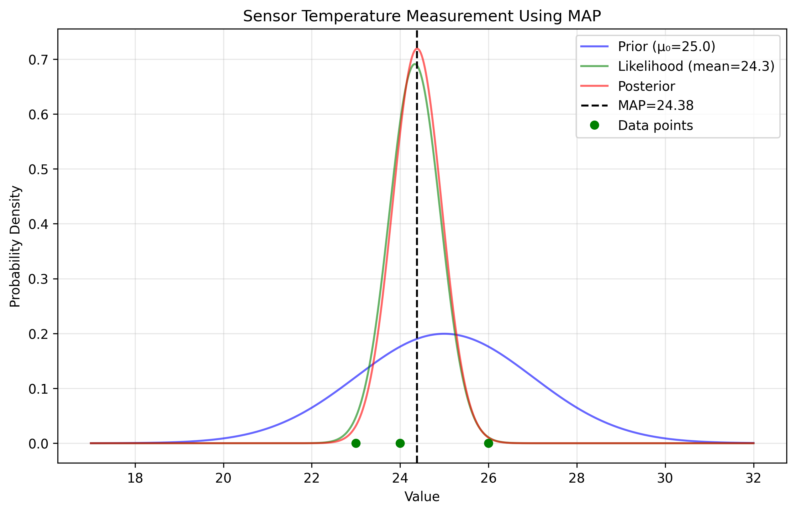

# MAP Formula Examples

This document provides practical examples of Maximum A Posteriori (MAP) estimation for various real-world applications, demonstrating the mathematical formulas and calculations involved in finding MAP estimates.

## Key Concepts and Formulas

For estimating the mean of a normal distribution with known variance, the MAP formula is:

$$
\hat{\mu}_{MAP} = \frac{\mu_0 + \frac{\sigma_0^2}{\sigma^2}\sum_{i=1}^N x^{(i)}}{1 + \frac{\sigma_0^2}{\sigma^2}N}
$$

This can be simplified by defining the variance ratio $r = \frac{\sigma_0^2}{\sigma^2}$:

$$
\hat{\mu}_{MAP} = \frac{\mu_0 + r \sum_{i=1}^N x^{(i)}}{1 + r \times N}
$$

Where:
- $\hat{\mu}_{MAP}$ = MAP estimate
- $\mu_0$ = Prior mean
- $\sigma_0^2$ = Prior variance 
- $\sigma^2$ = Data variance
- $\sum_{i=1}^N x^{(i)}$ = Sum of observations
- $N$ = Number of observations
- $r$ = Variance ratio

## Real-World Application Examples

The following examples demonstrate MAP estimation for different real-world applications:

- **Student Height**: Estimating average height of students in a class
- **Online Learning Scores**: Estimating a student's true skill level 
- **Manufacturing Process**: Quality control in component production
- **Sensor Measurement**: Estimating true temperature with error-prone sensors

### Example 1: Student Height

#### Problem Statement
We want to estimate the average height of students in a class based on prior knowledge and a small sample of measured heights.

In this example:
- We have prior knowledge about average student height
- We assume heights follow a normal distribution
- We're trying to estimate the true mean height
- We have a small sample of measured heights

#### Solution

We'll apply the MAP formula to combine our prior belief with the observed heights.

##### Step 1: Define the prior and data parameters
- Prior mean: $\mu_0 = 170$ cm
- Prior variance: $\sigma_0^2 = 25$ cm²
- Observed heights: [165, 173, 168, 180, 172] cm
- Number of observations: $N = 5$
- Data variance: $\sigma^2 = 20$ cm²

$$r = \frac{\sigma_0^2}{\sigma^2} = \frac{25}{20} = 1.25$$

##### Step 2: Calculate the MAP estimate
$$\hat{\mu}_{MAP} = \frac{\mu_0 + r \sum x^{(i)}}{1 + r \times N} = \frac{170 + 1.25 \times 858}{1 + 1.25 \times 5} = \frac{1242.5}{7.25} = 171.38 \text{ cm}$$

Therefore, our best estimate of the true average height is 171.38 cm, which lies between our prior belief (170 cm) and the sample mean (171.6 cm), slightly closer to the sample mean because we trust the data slightly more than our prior.


### Example 2: Online Learning Scores

#### Problem Statement
We want to estimate a student's true skill level in an online learning platform based on prior knowledge of average scores and recent quiz results.

#### Solution

##### Step 1: Define the prior and data parameters
- Prior mean (average score): $\mu_0 = 70$ (out of 100)
- Prior variance: $\sigma_0^2 = 100$
- Observed scores: [85, 82, 90, 88]
- Number of observations: $N = 4$
- Data variance: $\sigma^2 = 64$

$$r = \frac{\sigma_0^2}{\sigma^2} = \frac{100}{64} = 1.5625$$

##### Step 2: Calculate the MAP estimate
$$\hat{\mu}_{MAP} = \frac{\mu_0 + r \sum x^{(i)}}{1 + r \times N} = \frac{70 + 1.5625 \times 345}{1 + 1.5625 \times 4} = \frac{609.06}{7.25} = 84.01$$

The MAP estimate of 84.01 suggests the student's true skill level is well above the average (70), but slightly below their recent performance average (86.25).


### Example 3: Manufacturing Process Quality Control

#### Problem Statement
We want to estimate the true dimension of components in a manufacturing process using design specifications and actual measurements.

#### Solution

##### Step 1: Define the prior and data parameters
- Prior mean (design specification): $\mu_0 = 50$ mm
- Prior variance: $\sigma_0^2 = 0.04$ mm²
- Observed measurements: [50.2, 50.3, 50.1, 50.25, 50.15] mm
- Number of observations: $N = 5$
- Data variance: $\sigma^2 = 0.01$ mm²

$$r = \frac{\sigma_0^2}{\sigma^2} = \frac{0.04}{0.01} = 4$$

##### Step 2: Calculate the MAP estimate
$$\hat{\mu}_{MAP} = \frac{\mu_0 + r \sum x^{(i)}}{1 + r \times N} = \frac{50 + 4 \times 251}{1 + 4 \times 5} = \frac{1054}{21} = 50.19 \text{ mm}$$

The MAP estimate of 50.19 mm indicates that the true component dimension is slightly larger than the design specification (50.0 mm), but within acceptable tolerance.


### Example 4: Sensor Measurement

#### Problem Statement
We want to estimate the true temperature in a room using a sensor with known error characteristics, combining expected temperature with actual readings.

#### Solution

##### Step 1: Define the prior and data parameters
- Prior mean (expected temperature): $\mu_0 = 25$ °C
- Prior variance: $\sigma_0^2 = 4$ °C²
- Observed readings: [23, 24, 26] °C
- Number of observations: $N = 3$
- Data variance: $\sigma^2 = 1$ °C²

$$r = \frac{\sigma_0^2}{\sigma^2} = \frac{4}{1} = 4$$

##### Step 2: Calculate the MAP estimate
$$\hat{\mu}_{MAP} = \frac{\mu_0 + r \sum x^{(i)}}{1 + r \times N} = \frac{25 + 4 \times 73}{1 + 4 \times 3} = \frac{317}{13} = 24.38 \text{ °C}$$

The MAP estimate of 24.38 °C is between our prior belief (25 °C) and the sample mean (24.33 °C), reflecting a balanced view of the true temperature based on both prior knowledge and sensor readings.



## Special Cases of MAP Estimation

MAP estimation has interesting special cases that provide theoretical insights:

### 1. No Prior Knowledge
When we have no prior knowledge ($\sigma_0^2 \to \infty$), the MAP estimate reduces to the Maximum Likelihood Estimate (MLE):

$$\hat{\mu}_{MAP} \to \frac{1}{N}\sum_{i=1}^N x^{(i)} = \hat{\mu}_{MLE}$$

### 2. Perfect Prior Knowledge
When we have perfect prior knowledge ($\sigma_0^2 \to 0$), the MAP estimate ignores the data and equals the prior mean:

$$\hat{\mu}_{MAP} \to \mu_0$$

### 3. Equal Confidence
When we have equal confidence in our prior and the data ($\frac{\sigma_0^2}{\sigma^2} = 1$), the MAP estimate is a simple average of the prior mean and the data mean:

$$\hat{\mu}_{MAP} = \frac{\mu_0 + \sum_{i=1}^N x^{(i)}}{1 + N}$$

## MAP Estimation Quiz

### Quiz Example 1: Thermometer Calibration

#### Problem Statement
You are calibrating a new thermometer. Based on the manufacturer's specifications, you believe the thermometer has a bias of around +1.5°C with a variance of 0.64 (σ₀² = 0.64). You test the thermometer against a reference thermometer and get the following differences: +1.2°C, +1.8°C, +1.3°C, and +1.7°C. Assuming measurement noise with variance 0.25 (σ² = 0.25), calculate the MAP estimate of the true bias.

#### Solution

##### Step 1: Define the prior and data parameters
- Prior mean: $\mu_0 = 1.5$ °C (manufacturer's specification)
- Prior variance: $\sigma_0^2 = 0.64$ °C²
- Observed differences: [1.2, 1.8, 1.3, 1.7] °C
- Number of observations: $N = 4$
- Sample mean: $(1.2 + 1.8 + 1.3 + 1.7)/4 = 6.0/4 = 1.5$ °C
- Data variance: $\sigma^2 = 0.25$ °C²

$$r = \frac{\sigma_0^2}{\sigma^2} = \frac{0.64}{0.25} = 2.56$$

##### Step 2: Calculate the MAP estimate
$$\hat{\mu}_{MAP} = \frac{\mu_0 + r \times N \times \bar{x}}{1 + r \times N} = \frac{1.5 + 2.56 \times 4 \times 1.5}{1 + 2.56 \times 4} = \frac{16.86}{11.24} = 1.5 \text{ °C}$$

The MAP estimate of 1.5°C exactly matches both the prior mean and the sample mean. This coincidence occurred because the sample mean exactly matched the prior mean, confirming our prior belief.

### TRUE/FALSE Questions

**Question 1**: As the number of observations increases to infinity, the MAP estimate will always converge to the Maximum Likelihood Estimate (MLE) regardless of the prior distribution.

**Answer**: TRUE

**Explanation**: As N approaches infinity, the influence of the prior diminishes, and the data dominates the estimation. This can be seen directly from the MAP formula where the term with the sum of observations grows proportionally with N, eventually overwhelming the prior term.

**Question 2**: The MAP estimate is always between the prior mean and the sample mean.

**Answer**: FALSE

**Explanation**: While the MAP estimate is often between the prior mean and sample mean, it can actually be outside this range in certain cases, especially when using non-conjugate or asymmetric priors.

**Question 3**: MAP estimation is equivalent to adding a regularization term to Maximum Likelihood Estimation.

**Answer**: TRUE

**Explanation**: The negative log of the prior probability can be viewed as a regularization term added to the negative log-likelihood. For example, a Gaussian prior on parameters corresponds to L2 regularization.

**Question 4**: In MAP estimation, a higher prior variance always results in an estimate closer to the MLE.

**Answer**: TRUE

**Explanation**: As the prior variance increases, we express less confidence in our prior knowledge, giving more weight to the observed data. In the limit as prior variance approaches infinity, MAP becomes identical to MLE.

### Multiple Choice Questions

**Question 1**: When the variance ratio r = σ₀²/σ² is very small (approaching zero), what happens to the MAP estimate?

A) It approaches the sample mean (MLE)  
B) It approaches the prior mean  
C) It becomes the arithmetic average of the prior mean and sample mean  
D) It approaches zero

**Answer**: B) It approaches the prior mean

**Explanation**: When r = σ₀²/σ² approaches zero, it means we have very high confidence in our prior (very small prior variance) compared to the data variance. In this case, the MAP formula simplifies to approximately μ₀, showing that we trust our prior belief more than the observed data.

**Question 2**: What is the relationship between MAP estimation and Bayesian inference?

A) They are completely different approaches with no relationship  
B) MAP is a special case of Bayesian inference that returns only a point estimate  
C) Bayesian inference is a special case of MAP estimation  
D) MAP always produces the mean of the posterior distribution

**Answer**: B) MAP is a special case of Bayesian inference that returns only a point estimate

**Explanation**: While full Bayesian inference considers the entire posterior distribution, MAP estimation finds only the mode (peak) of the posterior distribution, resulting in a single point estimate rather than capturing the full uncertainty.

**Question 3**: Which of the following is NOT a characteristic of MAP estimation?

A) It combines prior knowledge with observed data  
B) It always produces the mean of the posterior distribution  
C) It can be viewed as regularized MLE  
D) It converges to MLE as the number of observations grows large

**Answer**: B) It always produces the mean of the posterior distribution

**Explanation**: MAP produces the mode (maximum) of the posterior distribution, not necessarily the mean. For symmetric distributions like the normal, the mode equals the mean, but for skewed distributions, they differ.

**Question 4**: If our prior mean is 10 with variance 4, our data variance is 1, and we observe the values [12, 14, 13] (with a sample mean of 13), the MAP estimate is approximately:

A) 10 (equal to the prior mean)  
B) 13 (equal to the sample mean)  
C) 11.5 (halfway between prior and sample means)  
D) 12.5 (weighted average favoring the sample mean)

**Answer**: D) 12.5 (weighted average favoring the sample mean)

**Explanation**: Using the MAP formula with μ₀ = 10, σ₀² = 4, σ² = 1, N = 3, and sample mean = 13, we get:
r = 4/1 = 4
MAP = (10 + 4×3×13)/(1 + 4×3) = (10 + 156)/(1 + 12) = 166/13 ≈ 12.5
The estimate is closer to the sample mean because the variance ratio favors the observed data.

## Key Insights

### Theoretical Insights
- MAP estimation provides a principled way to combine prior knowledge with observed data
- The influence of prior vs. data depends on their relative variances
- MAP estimation can be seen as a regularized version of MLE, where the prior serves as a regularizer

### Practical Applications
- MAP is useful when we have limited data but reliable prior knowledge
- It provides more robust estimates than MLE, especially with small sample sizes
- The variance ratio ($\frac{\sigma_0^2}{\sigma^2}$) determines how much we trust our prior vs. the data

### Common Pitfalls
- Using an inappropriate prior can bias the estimates
- Assuming normal distributions when data may not be normally distributed
- Forgetting to account for the variance of both the prior and the data

## Running the Examples

You can run all the examples using:

```bash
python3 ML_Obsidian_Vault/Lectures/2/Codes/map_formula_examples.py
```

## Related Topics

- [[L2_7_MAP_Examples|MAP Examples]]: Overview of MAP estimation across different distributions
- [[L2_4_Maximum_Likelihood|Maximum Likelihood]]: Comparison with MLE approach
- [[L2_5_Bayesian_Inference|Bayesian Inference]]: Theoretical foundation of MAP estimation
- [[L2_7_MAP_Normal|Normal Distribution MAP]]: Specialized examples for normal distributions 