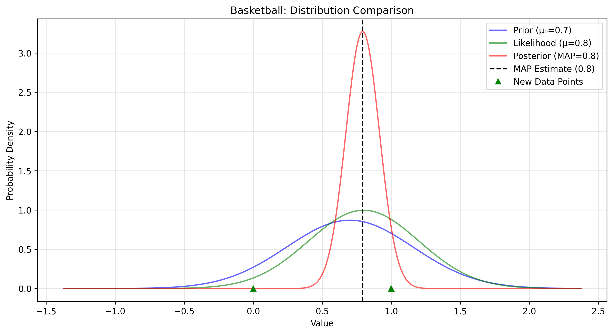
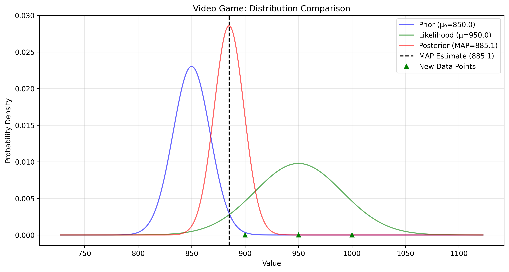
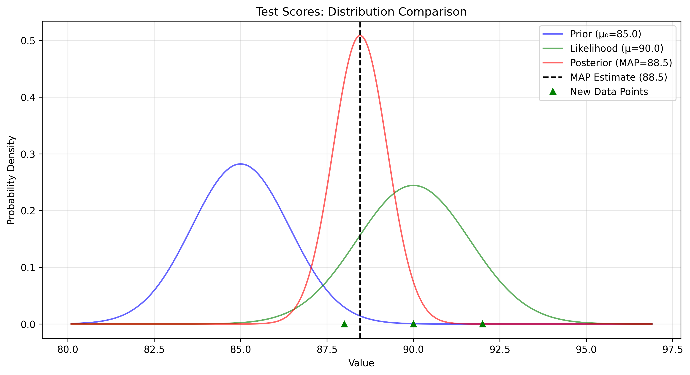
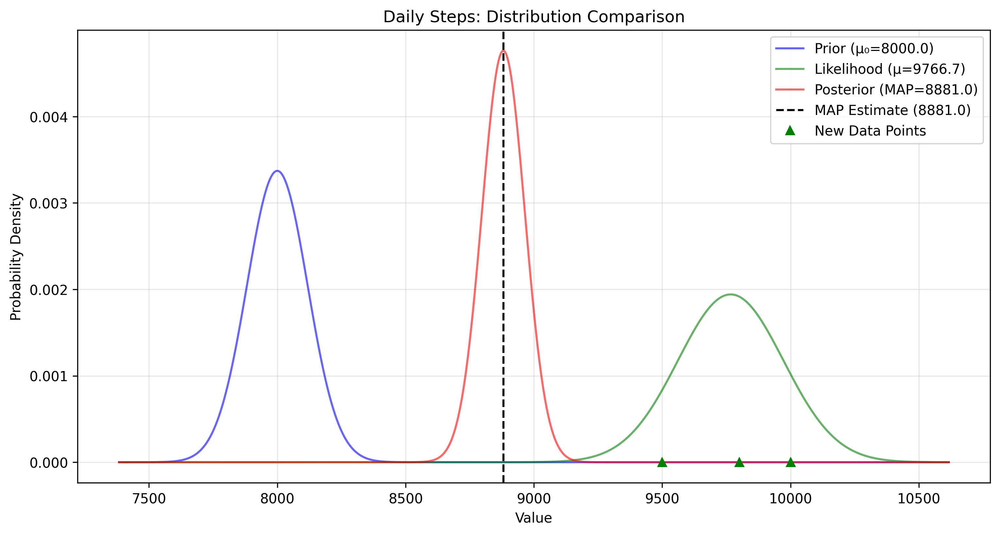

# Normal Distribution MAP Examples

This document provides practical examples of Maximum A Posteriori (MAP) estimation for normal distributions, illustrating the concept of finding the most likely value of a parameter given observed data and prior beliefs.

## Key Concepts and Formulas

For a normal distribution with known variance, the MAP formula is:

$$\hat{\theta}_{\text{MAP}} = \frac{\frac{\mu_0}{\sigma_0^2} + \frac{\sum_{i=1}^n x_i}{\sigma^2}}{\frac{1}{\sigma_0^2} + \frac{n}{\sigma^2}}$$

Where:
- $\hat{\theta}_{\text{MAP}}$ = MAP estimate
- $\mu_0$ = Prior mean
- $\sigma_0^2$ = Prior variance
- $\sigma^2$ = Data variance
- $n$ = Number of observations
- $x_i$ = Observed data points

This can be rewritten as:

$$\hat{\theta}_{\text{MAP}} = \frac{\mu_0 + r\sum_{i=1}^n x_i}{1 + rn}$$

Where $r = \frac{\sigma_0^2}{\sigma^2}$ is the variance ratio.

## Normal Distribution MAP Examples

The following examples demonstrate MAP estimation for continuous variables (normal distribution):

- **Basketball Shot Accuracy**: Analyzing shooting performance with recent improvement
- **Video Game Score**: Tracking improvement in gaming performance
- **Test Scores**: Evaluating academic performance after new study method
- **Daily Steps**: Monitoring physical activity levels after joining sports team

### Example 1: Basketball Shot Accuracy

#### Problem Statement
You want to analyze a basketball player's shooting accuracy. The player historically made 70% of their shots (21 successes out of 30 attempts over the past month). Today, they made 8 out of 10 shots (80% success rate). Is this improvement significant, or just random variation?

In this example:
- Historical data shows 70% shooting accuracy (30 shots over past month)
- New data shows 8 successful shots out of 10 attempts (80% success rate)
- The MAP estimate balances prior knowledge with recent performance
- This analysis helps determine if the recent improvement is statistically significant

#### Solution

We'll use the MAP formula for a normal distribution with known variance to calculate the player's true shooting percentage.

##### Step 1: Define prior distribution parameters
- Prior mean (μ₀) = 0.7 (70% shooting accuracy from 30 historical shots)
- Prior variance (σ₀²) = 0.21 (representing spread in historical performance)

##### Step 2: Calculate sample statistics
- Sample mean = 0.8 (8 successful shots out of 10)
- Number of observations (n) = 10 attempts
- New data variance (σ²) = 0.16 (representing consistency in recent performance)

##### Step 3: Calculate variance ratio
- Variance Ratio (σ₀²/σ²) = 0.21 / 0.16 = 1.3125
- Since this ratio is > 1, we trust the new data more than the historical data

##### Step 4: Apply the MAP formula
For a normal distribution with known variance, the MAP estimate is:

$$\hat{\theta}_{\text{MAP}} = \frac{\frac{\mu_0}{\sigma_0^2} + \frac{\sum_{i=1}^n x_i}{\sigma^2}}{\frac{1}{\sigma_0^2} + \frac{n}{\sigma^2}}$$

Substituting our values:
- Numerator = $\frac{0.7}{0.21} + \frac{8}{0.16} = 3.33 + 50 = 53.33$
- Denominator = $\frac{1}{0.21} + \frac{10}{0.16} = 4.76 + 62.5 = 67.26$
- MAP = $\frac{53.33}{67.26} = 0.79$ or 79%

##### Step 5: Interpret the results
The MAP estimate of 79% indicates that the player's true shooting accuracy is likely higher than their historical average of 70%, but slightly lower than the recent 80% performance. The estimate is closer to the new data because the variance ratio indicates we should trust the new data more.



### Example 2: Video Game Score

#### Problem Statement
A player wants to analyze their improvement in a video game. Their historical scores consistently clustered around 850 points (based on 10 previous games). Recently, they've achieved significantly higher scores: 950, 900, and 1000 points. The question is whether this improvement indicates a real increase in skill or just lucky games.

#### Solution

##### Step 1: Define prior distribution parameters
- Prior mean (μ₀) = 850 (historical average score)
- Prior variance (σ₀²) = 625 (representing historical consistency)

##### Step 2: Calculate sample statistics
- Sample mean = (950 + 900 + 1000)/3 = 950
- Number of observations (n) = 3
- Sample variance (σ²) = 2500 (representing new data consistency)

##### Step 3: Calculate variance ratio
- Variance Ratio (σ₀²/σ²) = 625 / 2500 = 0.25
- Since this ratio is < 1, we trust the historical data more than the new data

##### Step 4: Apply the MAP formula
Substituting our values:
- Numerator = $\frac{850}{625} + \frac{2850}{2500} = 1.36 + 1.14 = 2.5$
- Denominator = $\frac{1}{625} + \frac{3}{2500} = 0.0016 + 0.0012 = 0.0028$
- MAP = $\frac{2.5}{0.0028} = 892.86$ points

##### Step 5: Interpret the results
The MAP estimate of approximately 893 points suggests that the player's true skill level has likely improved from the historical average of 850 points, but not as dramatically as the recent average of 950 points might suggest. Since we trust the historical data more (variance ratio < 1), the MAP estimate is closer to the historical average.



### Example 3: Test Score Analysis

#### Problem Statement
A student has implemented a new study method and wants to determine if it's effective. Based on 10 previous tests, they achieved an average score of 85%. After adopting the new method, they scored 92%, 88%, and 90% on their three most recent tests. Is this improvement due to the new study method, or just random variation?

#### Solution

##### Step 1: Define prior distribution parameters
- Prior mean (μ₀) = 85% (historical average)
- Prior variance (σ₀²) = 9 (representing historical consistency)

##### Step 2: Calculate sample statistics
- Sample mean = (92% + 88% + 90%)/3 = 90%
- Number of observations (n) = 3
- Sample variance (σ²) = 4 (representing new data consistency)

##### Step 3: Calculate variance ratio
- Variance Ratio (σ₀²/σ²) = 9 / 4 = 2.25
- Since this ratio is > 1, we trust the new data more than the historical data

##### Step 4: Apply the MAP formula
Substituting our values in the simplified form:
- MAP = $\frac{85 + 2.25 \times 3 \times 90}{1 + 2.25 \times 3} = \frac{85 + 607.5}{1 + 6.75} = \frac{692.5}{7.75} = 89.35\%$

##### Step 5: Interpret the results
The MAP estimate of 89.35% suggests that the student's true ability is likely higher after adopting the new study method, but not quite as high as the recent average of 90%. The new study method appears to have a positive effect on performance.



### Example 4: Daily Steps

#### Problem Statement
You're tracking your daily step count to monitor physical activity. Your historical data shows an average of about 8,000 steps per day (based on 10 previous days). After joining a sports team, your step counts for three recent days were 10,000, 9,500, and 9,800 steps. You want to determine if this increase represents a sustainable change in activity level.

#### Solution

##### Step 1: Define prior distribution parameters
- Prior mean (μ₀) = 8,000 steps (historical average)
- Prior variance (σ₀²) = 250,000 (representing historical day-to-day variation)

##### Step 2: Calculate sample statistics
- Sample mean = (10,000 + 9,500 + 9,800)/3 = 9,767 steps
- Number of observations (n) = 3
- Sample variance (σ²) = 100,000 (representing new data consistency)

##### Step 3: Calculate variance ratio
- Variance Ratio (σ₀²/σ²) = 250,000 / 100,000 = 2.5
- Since this ratio is > 1, we trust the new data more than the historical data

##### Step 4: Apply the MAP formula
Substituting our values in the simplified form:
- MAP = $\frac{8,000 + 2.5 \times 3 \times 9,767}{1 + 2.5 \times 3} = \frac{8,000 + 73,252.5}{1 + 7.5} = \frac{81,252.5}{8.5} = 9,559$ steps

##### Step 5: Interpret the results
The MAP estimate of 9,559 steps suggests that your true daily activity level has significantly increased after joining the sports team. While not as high as the recent average of 9,767 steps, it represents a substantial increase from your historical average of 8,000 steps, indicating that the change is likely sustainable.



## Quiz Example: Student Performance After Tutoring

### Problem Statement
A teacher wants to analyze a student's true mathematical ability. Based on previous performance in 10 math tests, the student has averaged 75% (μ₀ = 75, with σ₀² = 16). In the most recent 3 tests after getting a tutor, the student scored 85%, 82%, and 88% (sample mean = 85%, with variance σ² = 9).

Calculate the MAP estimate of the student's true mathematical ability, considering both their previous performance and recent improvement after tutoring.

### Solution

##### Step 1: Define the prior distribution parameters
- Prior mean (μ₀) = 75 (average of 10 previous tests)
- Prior variance (σ₀²) = 16
- Prior represents the student's historical performance before tutoring

##### Step 2: Define the sample statistics
- Sample mean (x̄) = (85 + 82 + 88)/3 = 85
- Number of observations (n) = 3
- Sample variance (σ²) = 9
- These represent the student's performance after getting a tutor

##### Step 3: Calculate the variance ratio
The variance ratio determines how much we trust the new data compared to the prior:

$$\frac{\sigma_0^2}{\sigma^2} = \frac{16}{9} = 1.778$$

Since this ratio is greater than 1, we trust the new data more than the historical data.

##### Step 4: Apply the MAP formula
For a normal distribution with known variance, the MAP estimate is:

$$\hat{\theta}_{\text{MAP}} = \frac{\frac{\mu_0}{\sigma_0^2} + \frac{\sum_{i=1}^n x_i}{\sigma^2}}{\frac{1}{\sigma_0^2} + \frac{n}{\sigma^2}}$$

Substituting our values:
- Numerator = $\frac{75}{16} + \frac{255}{9} = 4.69 + 28.33 = 33.02$
- Denominator = $\frac{1}{16} + \frac{3}{9} = 0.0625 + 0.333 = 0.3955$
- MAP = $\frac{33.02}{0.3955} = 83.42\%$

##### Step 5: Interpret the results
The MAP estimate of 83.42% is between the historical average (75%) and recent performance (85%), but closer to the recent scores due to the favorable variance ratio. This suggests that the tutoring has likely improved the student's performance, and the improvement is supported by the consistent recent scores.

## Key Insights

### Theoretical Insights
- MAP estimation for normal distributions balances prior beliefs with observed data
- The influence of prior vs. data depends on their relative variances
- When prior variance is large compared to data variance, MAP approaches MLE

### Practical Applications
- Updating performance metrics with limited new data
- Filtering noisy measurements using prior knowledge
- Evaluating the significance of apparent improvements in performance

### Common Pitfalls
- Incorrectly specifying the prior variance can bias the results
- Assuming data follows a normal distribution when it doesn't
- Misinterpreting the variance ratio and its implications

## Running the Examples

You can run the code that generates these examples and visualizations using:

```bash
python3 ML_Obsidian_Vault/Lectures/2/Codes/normal_map_examples.py
```

## Related Topics

- [[L2_7_MAP_Examples|MAP Examples]]: Overview of MAP estimation across different distributions
- [[L2_4_MLE_Normal|Normal Distribution MLE]]: Comparison with MLE for normal distributions
- [[L2_5_Bayesian_Inference|Bayesian Inference]]: Foundational framework for MAP estimation
- [[L2_1_Normal_Distribution|Normal Distribution]]: Conjugate prior for normal likelihood with known variance 