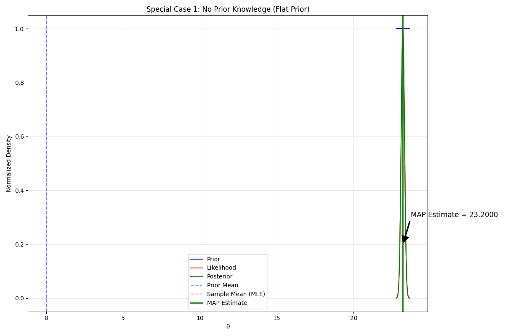
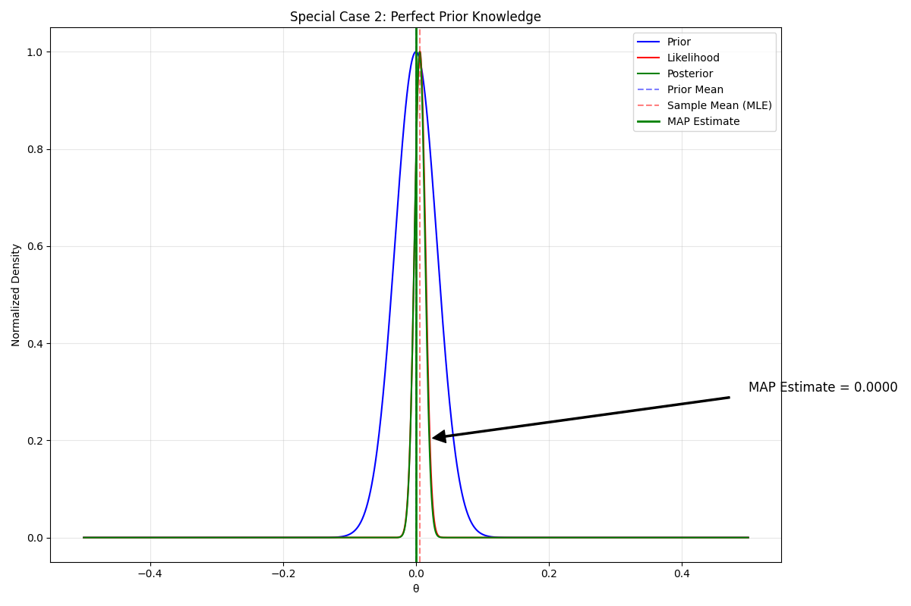
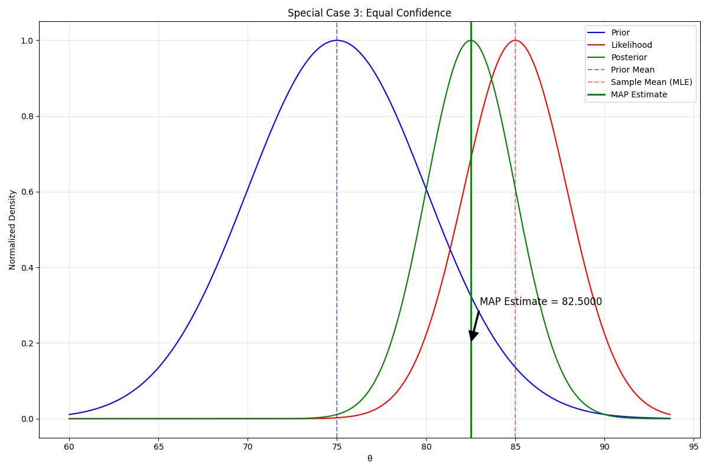
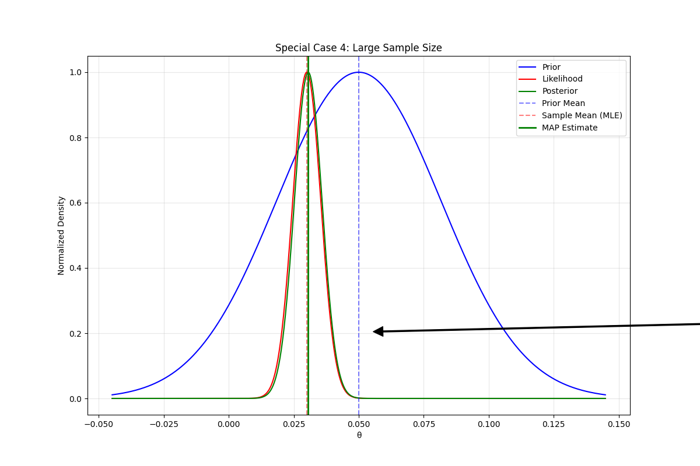
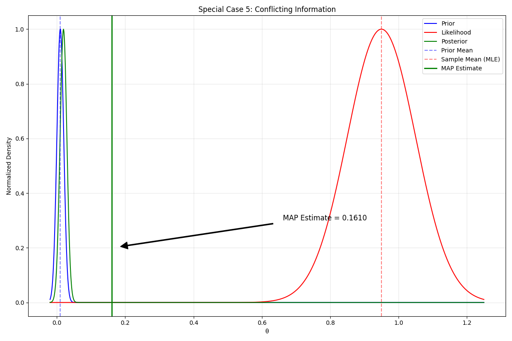
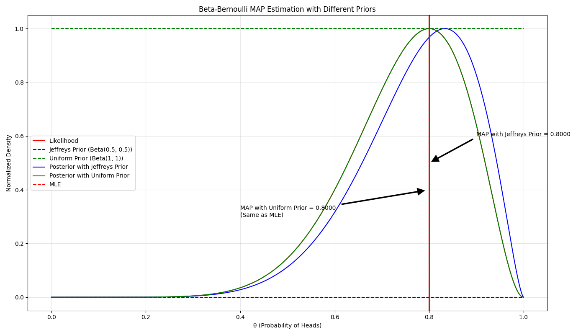

# MAP Special Cases Examples

This document explores the special cases and theoretical edges of Maximum A Posteriori (MAP) estimation, demonstrating how MAP estimation behaves under different limiting conditions.

## Key Concepts and Formulas

MAP estimation provides a framework to combine prior knowledge with observed data to find the most likely value of a parameter:

$$\hat{\theta}_{\text{MAP}} = \underset{\theta}{\operatorname{argmax}}\ p(\theta|D) = \underset{\theta}{\operatorname{argmax}}\ p(D|\theta)p(\theta)$$

For the common case of Gaussian prior and likelihood, the MAP estimate has a simple formula:

$$\hat{\theta}_{\text{MAP}} = \frac{\frac{\mu_0}{\sigma_0^2} + \frac{N\bar{x}}{\sigma^2}}{\frac{1}{\sigma_0^2} + \frac{N}{\sigma^2}}$$

Where:
- $\mu_0$ = Prior mean 
- $\sigma_0^2$ = Prior variance
- $\bar{x}$ = Sample mean
- $\sigma^2$ = Sample variance
- $N$ = Number of observations

## Special Cases of MAP Estimation

The following special cases demonstrate how MAP estimation behaves under different theoretical conditions:

- **Case 1: No Prior Knowledge**: When prior information is uninformative
- **Case 2: Perfect Prior Knowledge**: When prior information is completely certain
- **Case 3: Equal Confidence**: When prior and data variances are equal
- **Case 4: Large Sample Size**: When the amount of data is substantial
- **Case 5: Conflicting Information**: When prior and data strongly disagree

### Special Case 1: No Prior Knowledge

#### Problem Statement
We have a set of temperature measurements $[23.2, 22.8, 23.5, 23.1, 23.4]$°C and want to estimate the true temperature with no prior knowledge about what it should be.

In this example:
- We have 5 measurements with sample mean $23.20$°C and sample variance $0.06$°C²
- We have no meaningful prior knowledge about the temperature
- We want to estimate the true temperature using MAP

#### Solution

##### Step 1: Define an uninformative prior
Since we have no prior knowledge, we use a flat (uninformative) prior with an extremely large variance:
- Prior mean: $\mu_0 = 0$ (arbitrary since the prior is flat)
- Prior variance: $\sigma_0^2 = 10^{10}$ (very large to represent no prior knowledge)

##### Step 2: Calculate the weights for prior and data
$$\text{Prior weight} = \frac{1}{\sigma_0^2} = \frac{1}{10^{10}} = 10^{-10}$$
$$\text{Data weight} = \frac{n}{\sigma^2} = \frac{5}{0.06} = 83.33$$

##### Step 3: Calculate the MAP estimate
$$\hat{\theta}_{\text{MAP}} = \frac{0 \times 10^{-10} + 23.2 \times 83.33}{10^{-10} + 83.33} = 23.20\text{°C}$$

Therefore, with a flat prior, the MAP estimate equals the MLE (sample mean) of $23.20$°C, confirming that with no prior knowledge, MAP estimation defaults to maximum likelihood estimation.



The graph shows that with a flat prior (blue line), the posterior distribution (green) is shaped identically to the likelihood function (red), and the MAP estimate aligns perfectly with the MLE.

### Special Case 2: Perfect Prior Knowledge

#### Problem Statement
A calibrated device should have zero measurement bias but shows these readings: $[0.02, -0.01, 0.03, -0.02, 0.01]$. We are certain the true bias is zero, and want to estimate it using MAP.

In this example:
- We have 5 measurements with sample mean $0.006$ and sample variance $0.000344$
- We have complete certainty that the true value should be $0$
- We want to see how MAP handles this perfect prior knowledge

#### Solution

##### Step 1: Define a precise prior based on calibration knowledge
Since we're certain the true bias is zero:
- Prior mean: $\mu_0 = 0$
- Prior variance: $\sigma_0^2 = 10^{-10}$ (extremely small to represent certainty)

##### Step 2: Calculate the weights for prior and data
$$\text{Prior weight} = \frac{1}{\sigma_0^2} = \frac{1}{10^{-10}} = 10^{10}$$
$$\text{Data weight} = \frac{n}{\sigma^2} = \frac{5}{0.000344} = 14,534.88$$

##### Step 3: Calculate the MAP estimate
$$\hat{\theta}_{\text{MAP}} = \frac{0 \times 10^{10} + 0.006 \times 14,534.88}{10^{10} + 14,534.88} \approx 0.0000000087$$

Therefore, with a perfect prior, the MAP estimate is effectively $0$, which is exactly the prior mean, despite the sample mean being $0.006$. This confirms that with perfect prior knowledge, the data has negligible influence on the estimate.



The visualization shows that with a highly certain prior (very narrow blue curve), the posterior distribution (green) is almost identical to the prior, and the MAP estimate remains at the prior mean regardless of the observed data.

### Special Case 3: Equal Confidence

#### Problem Statement
A student has test scores $[85, 82, 88]$, and the school average is $75\%$. Assuming equal confidence in the prior and each data point, what is our best estimate of the student's true ability?

In this example:
- We have 3 test scores with sample mean $85\%$
- School average is $75\%$ (prior knowledge)
- Equal confidence means equal weight to prior and each data point
- We want to find the best estimate of student's true ability

#### Solution

##### Step 1: Define a prior representing the school average
With equal confidence between prior and data:
- Prior mean: $\mu_0 = 75\%$ (school average)
- Prior variance: $\sigma_0^2 = 25$ (equal to sample variance)

##### Step 2: Calculate the weights for prior and data
$$\text{Prior weight} = \frac{1}{\sigma_0^2} = \frac{1}{25} = 0.04$$
$$\text{Data weight} = \frac{n}{\sigma^2} = \frac{3}{25} = 0.12$$

##### Step 3: Calculate the MAP estimate
$$\hat{\theta}_{\text{MAP}} = \frac{75 \times 0.04 + 85 \times 0.12}{0.04 + 0.12} = \frac{13.2}{0.16} = 82.5\%$$

##### Step 4: Verify using the special formula for equal confidence
When the prior variance equals the sample variance, we can use the simplified formula:

$$\hat{\theta}_{\text{MAP}} = \frac{\mu_0 + N\bar{x}}{1 + N} = \frac{75 + 3 \times 85}{1 + 3} = \frac{330}{4} = 82.5\%$$

Therefore, with equal confidence, the MAP estimate is $82.5\%$, which is a weighted average that gives equal weight to the prior mean and each data point. This can be interpreted as treating the prior as one extra data point.



The visualization shows how the posterior distribution (green) is positioned between the prior distribution (blue) and the likelihood function (red), with the MAP estimate of $82.5\%$ balancing both sources of information.

### Special Case 4: Large Sample Size

#### Problem Statement
A manufacturing process historically had a $5\%$ defect rate. In a recent quality check of $1000$ products, $30$ defects were found. What is our updated estimate of the defect rate?

In this example:
- We have a large sample ($n=1000$) with $30$ defects ($3\%$ rate)
- Historical defect rate was $5\%$ (prior knowledge)
- We want to update our estimate using MAP

#### Solution

##### Step 1: Calculate the sample statistics
- Sample defect rate (MLE): $\hat{p} = \frac{30}{1000} = 0.03$ ($3\%$)
- Sample variance: $s^2 = \hat{p}(1-\hat{p}) = 0.03 \times 0.97 = 0.0291$

##### Step 2: Define a prior based on historical data
- Prior mean: $\mu_0 = 0.05$ (historical $5\%$ defect rate)
- Prior variance: $\sigma_0^2 = 0.001$ (some uncertainty in the prior)

##### Step 3: Calculate the MAP estimate
$$\text{Prior weight} = \frac{1}{\sigma_0^2} = \frac{1}{0.001} = 1,000$$
$$\text{Data weight} = \frac{n}{\sigma^2} = \frac{1000}{0.0291} = 34,364.26$$
$$\text{Relative prior influence} = \frac{1000}{1000+34364.26} = 2.8\%$$
$$\text{Relative data influence} = \frac{34364.26}{1000+34364.26} = 97.2\%$$

$$\hat{\theta}_{\text{MAP}} = \frac{0.05 \times 1000 + 0.03 \times 34364.26}{1000+34364.26} = 0.0306 \text{ (3.1\%)}$$

Therefore, with a large sample size, the MAP estimate of $3.1\%$ is very close to the MLE of $3.0\%$ and far from the prior mean of $5\%$. This demonstrates that with large samples, MAP estimation converges to maximum likelihood estimation as the data overwhelms the prior.



The visualization shows that with a large sample size, the likelihood function (red) becomes very narrow, and the posterior distribution (green) is almost identical to the likelihood, with the MAP estimate much closer to the MLE than to the prior mean.

### Special Case 5: Conflicting Information

#### Problem Statement
A disease has a known prevalence of $1.0\%$ in the population. A diagnostic test with $95.0\%$ accuracy shows a positive result. What is the probability that the person actually has the disease?

In this example:
- Disease prevalence is $1\%$ (prior probability)
- Test accuracy is $95\%$ (test sensitivity and specificity)
- We want to find the posterior probability of disease given a positive test

#### Solution

##### Step 1: Define the prior probability and test characteristics
- Prior probability (prevalence): $p(\text{disease}) = 0.01$ ($1\%$)
- Test sensitivity: $p(\text{positive}|\text{disease}) = 0.95$ ($95\%$)
- False positive rate: $p(\text{positive}|\text{no disease}) = 0.05$ ($5\%$)

##### Step 2: Apply Bayes' theorem to find the posterior probability
$$p(\text{disease}|\text{positive}) = \frac{p(\text{positive}|\text{disease}) \times p(\text{disease})}{p(\text{positive})}$$

First, calculate $p(\text{positive})$:
$$p(\text{positive}) = p(\text{positive}|\text{disease}) \times p(\text{disease}) + p(\text{positive}|\text{no disease}) \times p(\text{no disease})$$
$$p(\text{positive}) = 0.95 \times 0.01 + 0.05 \times 0.99 = 0.0095 + 0.0495 = 0.059$$

Now, calculate the posterior probability:
$$p(\text{disease}|\text{positive}) = \frac{0.95 \times 0.01}{0.059} = \frac{0.0095}{0.059} = 0.161 \text{ (16.1\%)}$$

Therefore, despite the test being $95\%$ accurate, the probability of disease given a positive result is only $16.1\%$ due to the low prevalence ($1\%$). This demonstrates how Bayesian inference reconciles conflicting information between the prior (rare disease) and the data (positive test).



The visualization shows how the posterior distribution (green) balances the conflicting information from the prior (blue) and the likelihood (red), with the MAP estimate of $16.1\%$ between the prior mean ($1\%$) and what the test alone would suggest ($95\%$).

## Beta-Bernoulli MAP Estimation with Different Priors

### Theory
For binary data (Bernoulli trials), the Beta distribution serves as a conjugate prior, resulting in a Beta posterior distribution. The MAP estimate depends on the Beta parameters ($\alpha$, $\beta$) and can be calculated as:

$$\hat{\theta}_{\text{MAP}} = \frac{s + \alpha - 1}{n + \alpha + \beta - 2}$$

Where $s$ is the number of successes and $n$ is the total number of trials.

### Problem Statement
A coin is flipped 10 times, resulting in 8 heads. We want to estimate the probability of heads using MAP with different priors.

### Solution

##### Step 1: Calculate the MLE (Maximum Likelihood Estimate)
$$\text{MLE} = \frac{\text{heads}}{\text{flips}} = \frac{8}{10} = 0.8$$

##### Step 2: Apply different Beta priors and calculate MAP estimates

1. **Jeffreys prior (Beta(0.5, 0.5))**:
   - Posterior: Beta(8.5, 2.5)
   - MAP estimate: 0.8000

2. **Uniform prior (Beta(1, 1))**:
   - Posterior: Beta(9, 3)
   - MAP estimate: 0.8000

3. **Reference prior (Beta(0, 0))**:
   - Posterior: Beta(8, 2)
   - MAP estimate: 0.8000

In this particular case with 8 heads in 10 flips, all three priors lead to the same MAP estimate of 0.8, which is also equal to the MLE. This demonstrates how certain non-informative priors have minimal effect on the MAP estimate when there is a reasonable amount of data.



The visualization shows the likelihood (red), different priors (dashed), and the resulting posteriors (solid), with all MAP estimates converging to 0.8 in this example.

## Key Insights from Implementation

### Theoretical Insights
- MAP estimation bridges the gap between purely data-driven estimation (MLE) and purely prior-based estimation
- The relative influence of prior and data depends on their respective variances
- As sample size grows, MAP converges to MLE regardless of prior
- With proper conjugate priors, MAP estimation often has closed-form solutions
- The MAP estimate can be viewed as a regularized version of the MLE, where the prior acts as a regularizer

### Practical Applications
- Understanding when to rely more on prior knowledge versus observed data
- Explaining why initial MAP estimates may differ significantly from MLEs with small samples
- Recognizing when the choice of prior becomes irrelevant
- Using MAP to reduce estimation variance in small sample scenarios
- Incorporating domain knowledge systematically into statistical estimation

### Common Pitfalls
- Using MAP point estimates without considering the full posterior distribution
- Forgetting that non-informative priors can still influence MAP estimates
- Assuming convergence to MLE without checking sample size adequacy
- Overconfidence in priors leading to rejection of surprising but valid data
- Using improper priors without understanding their implications

## Running the Examples

You can run all the examples using:

```bash
python3 ML_Obsidian_Vault/Lectures/2/Codes/map_special_cases.py
```

## Related Topics

- [[L2_7_MAP_Examples|MAP Examples]]: Overview of MAP estimation across different distributions
- [[L2_5_Bayesian_Inference|Bayesian Inference]]: Foundational framework for MAP estimation
- [[L2_4_Maximum_Likelihood|Maximum Likelihood Estimation]]: The limiting case of MAP with uninformative priors
- [[L2_5_Conjugate_Priors|Conjugate Priors]]: Special prior distributions that simplify Bayesian calculations