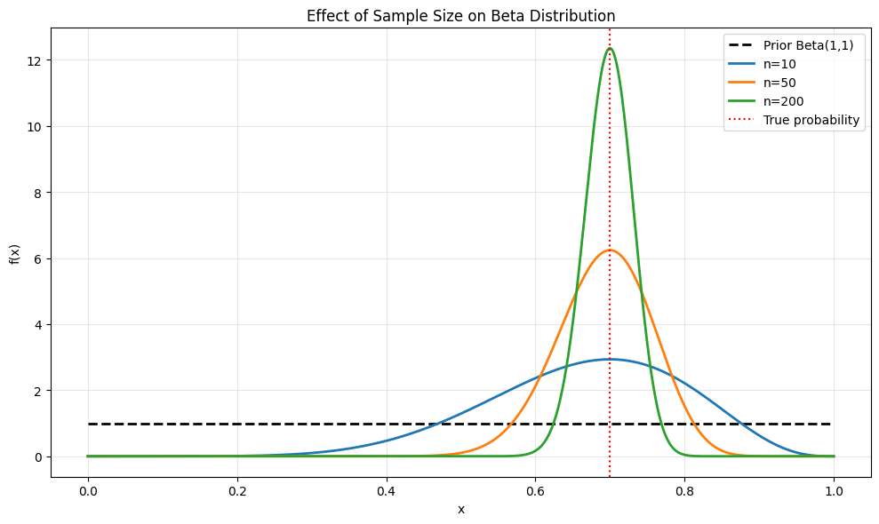

# Beta Distribution

The Beta distribution is a family of continuous probability distributions defined on the interval [0, 1]. It's commonly used in Bayesian statistics as a prior for probability parameters.

## Definition

The probability density function (PDF) of the Beta distribution is:

$$f(x; \alpha, \beta) = \frac{x^{\alpha-1}(1-x)^{\beta-1}}{B(\alpha, \beta)}$$

Where:
- $x \in [0,1]$
- $\alpha > 0$ and $\beta > 0$ are shape parameters
- $B(\alpha, \beta)$ is the Beta function

## Properties

- **Mean**: $\frac{\alpha}{\alpha + \beta}$
- **Mode**: $\frac{\alpha - 1}{\alpha + \beta - 2}$ (when $\alpha, \beta > 1$)
- **Variance**: $\frac{\alpha\beta}{(\alpha+\beta)^2(\alpha+\beta+1)}$

## Usage in Machine Learning

The Beta distribution is fundamental in machine learning because:
- It's the conjugate prior for Bernoulli and Binomial distributions
- It's useful for modeling probabilities and proportions
- It's flexible in shape and can represent various prior beliefs
- It's commonly used in Bayesian inference and A/B testing

## Visualizations

The following visualizations demonstrate key properties of the beta distribution:

1. **Basic Properties**:
   
   - Shows the probability density function (PDF) and cumulative distribution function (CDF)
   - Demonstrates the characteristic shape of the Beta distribution
   - Illustrates how the CDF smoothly increases from 0 to 1

2. **Different Parameter Combinations**:
   
   - Shows various Beta distributions with different parameter values
   - Demonstrates how parameters affect the shape and location
   - Includes special cases like uniform and Jeffrey's prior

3. **Parameter Interpretation**:
   - $\alpha$: Number of prior successes + 1
   - $\beta$: Number of prior failures + 1

4. **Common Special Cases**:
   - **Beta(1,1)**: Uniform distribution (no prior knowledge)
   - **Beta(0.5,0.5)**: Jeffrey's prior (invariant to reparameterization)
   - **Beta(2,2)**: Centered at 0.5 with moderate certainty
   - **Beta(>2,>2)**: Stronger beliefs about the centered value

5. **Effect of Sample Size**:
   
   - Shows how the beta distribution evolves with increasing sample size
   - Demonstrates Bayesian updating in action
   - Illustrates how the distribution becomes more concentrated around the true probability
   - Useful for understanding how prior beliefs are updated with data

6. **Common Distribution Shapes**:
   
   - Shows various commonly used beta distributions
   - Includes special cases like Jeffrey's Prior and Uniform distributions
   - Demonstrates different types of skewness (left and right)
   - Helps in choosing appropriate parameters for different scenarios

7. **Parameter Space Visualization**:
   
   - Shows a comprehensive grid of beta distributions
   - Demonstrates how changing both α and β affects the shape
   - Helps in understanding the relationship between parameters and distribution characteristics
   - Useful for selecting appropriate parameters for specific applications

## Running the Examples

You can run the code that generates the probability examples and visualizations using:

```bash
python3 ML_Obsidian_Vault/Lectures/2/Codes/1_beta_distribution.py
```

## Related Topics

- [[L2_1_Beta_Distribution_Advanced|Advanced Topics]]: Bayesian applications and advanced properties
- [[L2_5_Bayesian_Inference|Bayesian Inference]]: Using Beta distribution in Bayesian analysis
- [[L2_3_Parameter_Estimation|Parameter Estimation]]: Estimating parameters of Beta distribution
- [[L2_7_MAP_Estimation|MAP Estimation]]: Maximum a posteriori estimation with Beta distributions
- [[L2_5_Conjugate_Priors|Conjugate Priors]]: Beta-Bernoulli conjugacy in Bayesian analysis 