# Advanced Topics in Beta Distribution

This note covers advanced applications and properties of the Beta distribution in machine learning and statistics.

## Bayesian Applications

### Usage in Bayesian Inference

The Beta distribution is particularly powerful in Bayesian analysis as:

- A **prior distribution** for probability parameters
- A **posterior distribution** (when combined with Bernoulli/Binomial likelihood)
- A **predictive distribution** for future binary outcomes

### Effect of Parameters in Bayesian Analysis

The parameters α and β play crucial roles in Bayesian analysis:

- In the prior: Controls the strength of our prior beliefs
  - Larger α + β indicates stronger prior beliefs
  - Smaller α + β indicates weaker prior beliefs
- In the posterior: Represents accumulated evidence
  - α increases with observed successes
  - β increases with observed failures

## Advanced Visualizations

### 1. Bayesian Updating Process
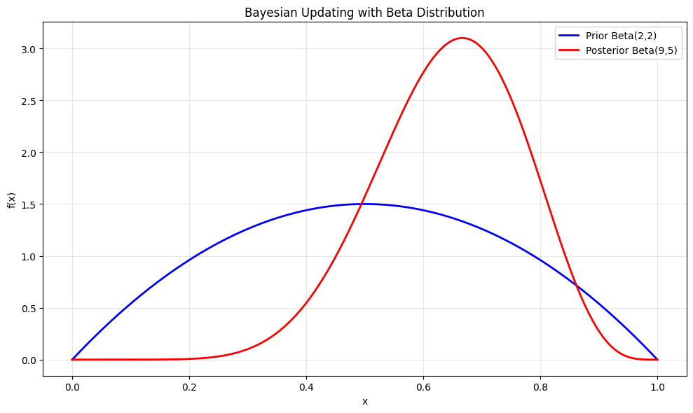
- Shows how prior knowledge (blue) combines with new data to form the posterior (red)
- Demonstrates the conjugate property of Beta distributions
- Illustrates how the posterior incorporates both prior and data

### 2. Effect of Sample Size
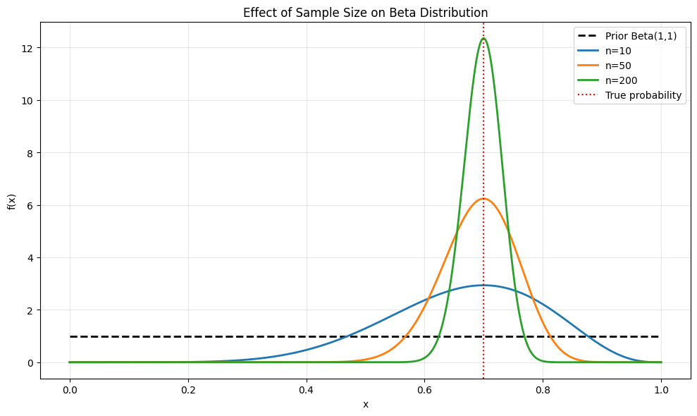
- Shows how increasing sample size affects the posterior distribution
- Demonstrates the convergence of Bayesian estimates
- Illustrates the relationship between sample size and posterior precision

### 3. Credible Intervals
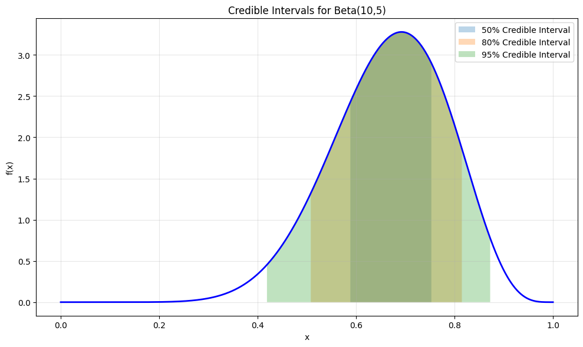
- Shows different credible intervals (50%, 80%, 95%)
- Demonstrates how to quantify uncertainty in Bayesian estimates
- Illustrates the relationship between interval width and confidence level

### 4. MAP vs MLE Estimation
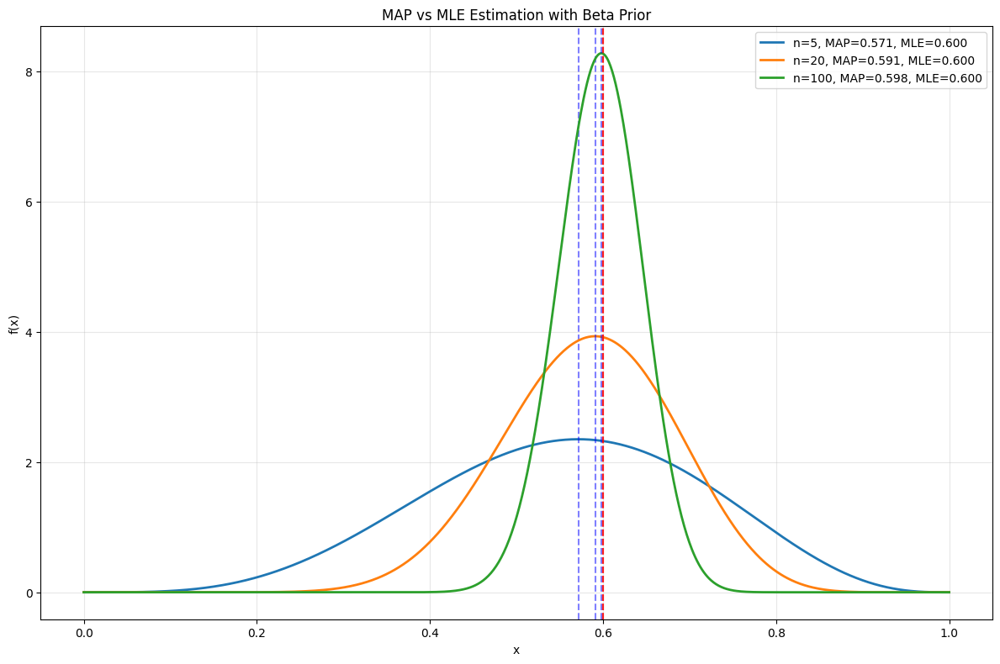
- Compares Maximum A Posteriori (MAP) and Maximum Likelihood (MLE) estimates
- Shows how prior information affects parameter estimation
- Demonstrates the trade-off between prior beliefs and data

### 5. Predictive Distribution
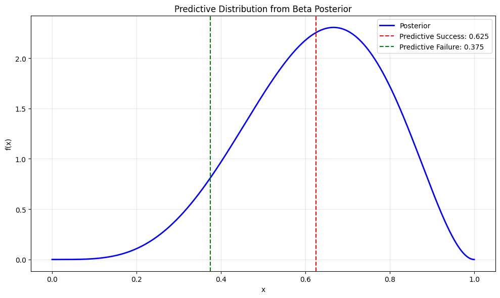
- Shows how to make predictions using the posterior distribution
- Demonstrates the predictive probability for future observations
- Illustrates the relationship between posterior and predictive probabilities

### 6. Effect of Prior Strength
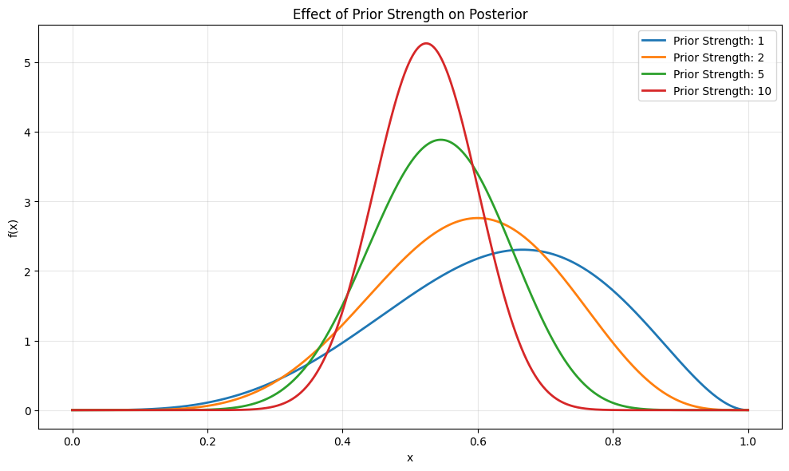
- Shows how different prior strengths affect the posterior distribution
- Demonstrates the impact of prior sample size on inference
- Illustrates the balance between prior information and data

### 7. Sequential Bayesian Updating
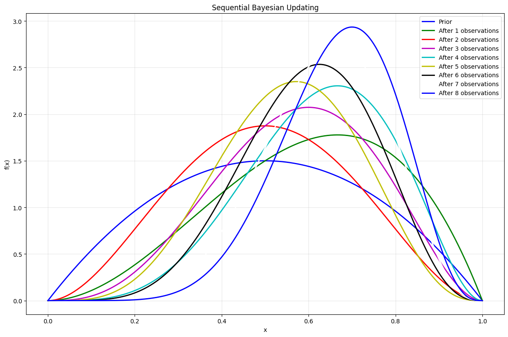
- Shows how the posterior evolves with sequential data
- Demonstrates the step-by-step Bayesian updating process
- Illustrates how each new observation affects our beliefs

### 8. Effect of Prior Parameters
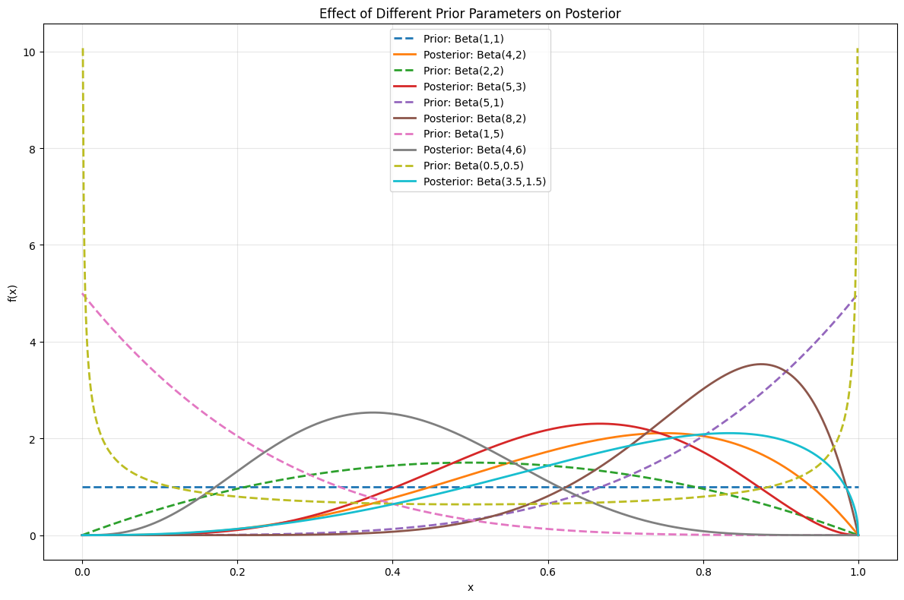
- Compares different prior parameter combinations and their resulting posteriors
- Shows how prior choice affects Bayesian inference
- Demonstrates the impact of symmetric vs. asymmetric priors

### 9. Shape Analysis
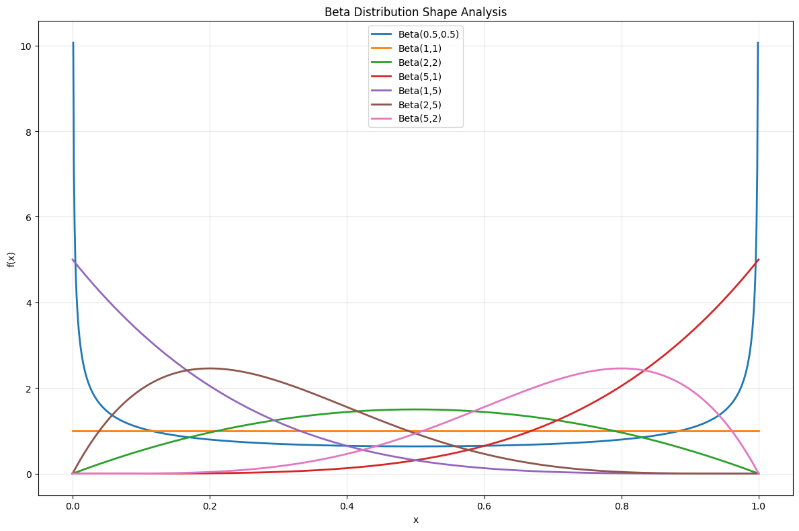
- Visualizes how different parameter combinations affect distribution shape
- Includes U-shaped, uniform, symmetric, and skewed distributions
- Demonstrates the flexibility of the Beta distribution

### 10. Distribution Moments
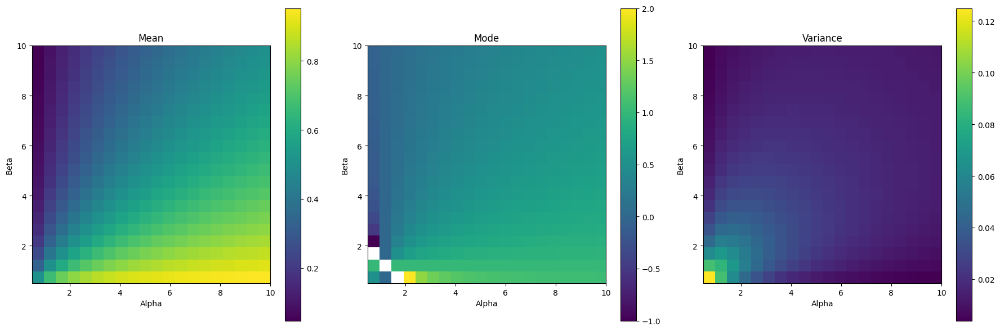
- Shows heatmaps of mean, mode, and variance across parameter values
- Illustrates how moments change with different alpha and beta values
- Provides comprehensive view of Beta distribution properties

### 11. Binomial Likelihood
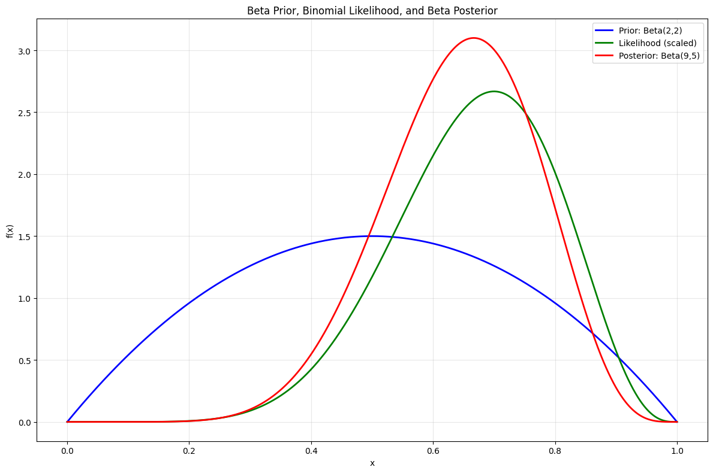
- Demonstrates relationship between Beta prior, binomial likelihood, and posterior
- Shows conjugate prior property in practice
- Illustrates Bayesian updating process with binomial data

## Mathematical Details

### Conjugate Prior Properties

For a Bernoulli/Binomial likelihood:
- Prior: Beta(α₀, β₀)
- Data: n trials, k successes
- Posterior: Beta(α₀ + k, β₀ + n - k)

Where:
- α₀, β₀ are prior parameters
- k is the number of successes
- n is the total number of trials

### MAP Estimation Formula

The MAP estimate for a Beta-Bernoulli model is:

$$\theta_{MAP} = \frac{\alpha - 1}{\alpha + \beta - 2}$$

This is:
- The mode of the Beta distribution
- A weighted combination of prior information and observed data
- Only valid when α, β > 1

## Running the Advanced Examples

You can generate these advanced visualizations using:

```bash
python3 ML_Obsidian_Vault/Lectures/2/Codes/1_beta_distribution_advanced.py
```

## Related Topics

- [[L2_2_Beta_Distribution|Basic Topics]]: Fundamental concepts and properties
- [[L2_5_Bayesian_Inference|Bayesian Inference]]: General Bayesian analysis methods
- [[L2_3_Parameter_Estimation|Parameter Estimation]]: Methods for parameter estimation
- [[L2_7_MAP_Estimation|MAP Estimation]]: Maximum a posteriori estimation
- [[L2_5_Conjugate_Priors|Conjugate Priors]]: Properties of conjugate distributions 