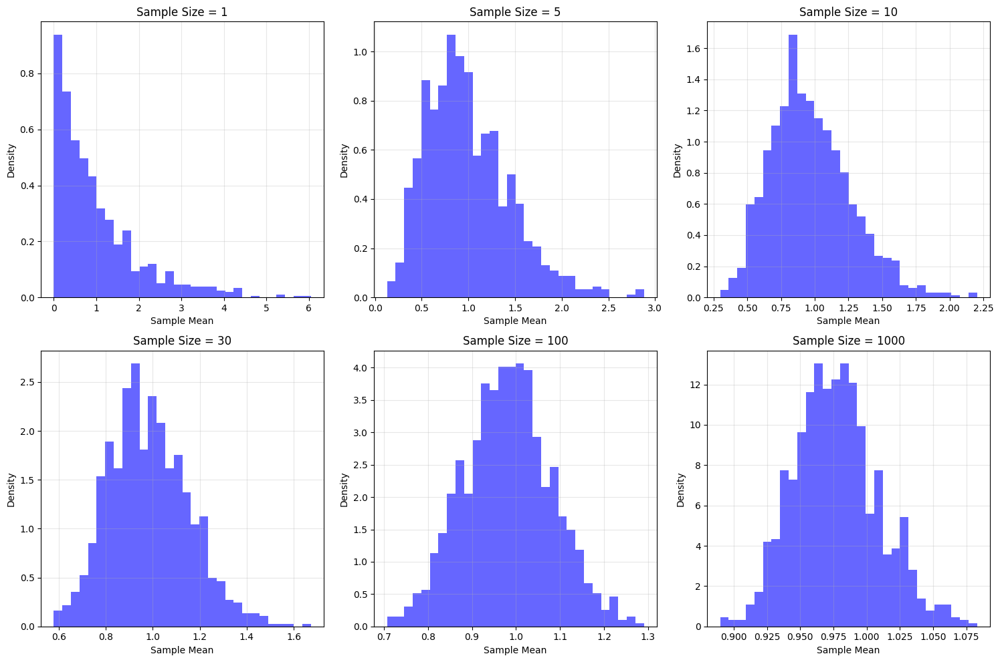
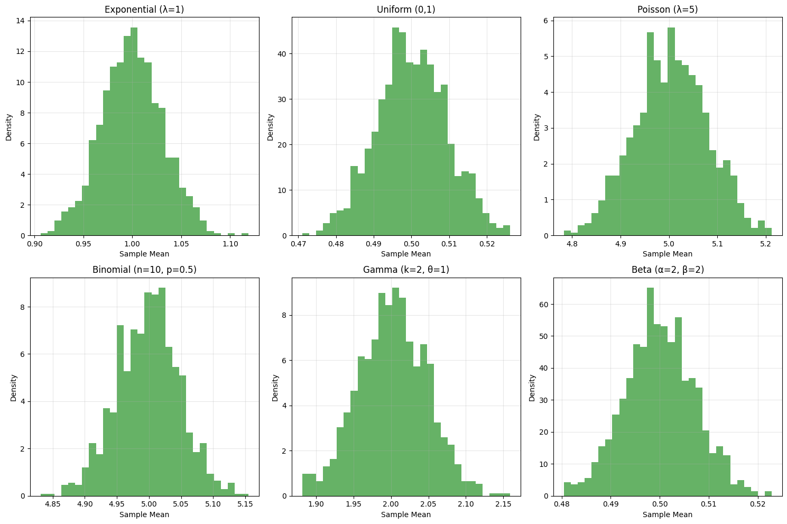
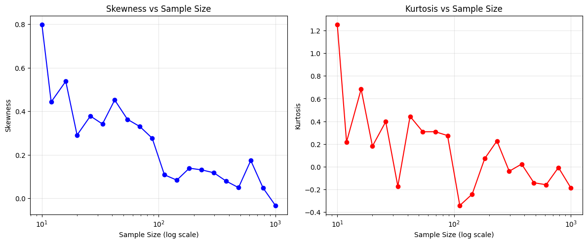
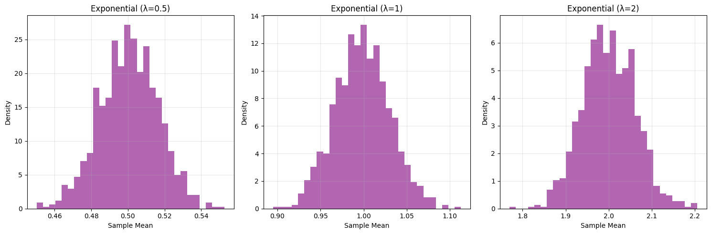

# Central Limit Theorem (CLT)

The Central Limit Theorem is one of the most fundamental and important theorems in statistics and probability theory. It explains why the normal distribution appears so frequently in nature and why it's so useful in statistical inference.

## Definition

The Central Limit Theorem states that:

> Given a sufficiently large sample size from a population with a finite level of variance, the mean of all samples from the same population will be approximately equal to the mean of the population, and the distribution of sample means will be approximately normal, regardless of the shape of the population distribution.

## Mathematical Formulation

For a population with mean μ and standard deviation σ, if we take samples of size n, then:

1. The mean of the sampling distribution of the mean (μₓ̄) equals the population mean:
   $$μₓ̄ = μ$$

2. The standard deviation of the sampling distribution (standard error) is:
   $$σₓ̄ = \frac{σ}{\sqrt{n}}$$

3. As n increases, the sampling distribution approaches a normal distribution:
   $$\bar{X} \sim N(μ, \frac{σ²}{n})$$

## Key Properties

1. **Sample Size Effect**:
   - The larger the sample size, the closer the sampling distribution is to normal
   - For most practical purposes, n ≥ 30 is considered sufficient
   - The rate of convergence depends on the shape of the original distribution

2. **Population Distribution Independence**:
   - CLT works regardless of the shape of the original population distribution
   - The original distribution can be skewed, uniform, exponential, etc.
   - The theorem still holds as long as the population has finite variance

3. **Standard Error**:
   - The standard deviation of the sampling distribution decreases as √n
   - This explains why larger samples give more precise estimates
   - The relationship is inversely proportional to the square root of n

## Visual Demonstrations

1. **Sample Size Effect**:
   
   - Shows convergence to normality with increasing sample sizes (1 to 1000)
   - Demonstrates how the distribution becomes more normal as n increases
   - Illustrates the reduction in variance with larger samples

2. **Different Distributions**:
   
   - Shows CLT in action with various population distributions
   - Includes exponential, uniform, Poisson, binomial, gamma, and beta distributions
   - Demonstrates universality across different distribution types

3. **Convergence Rate**:
   
   - Shows how skewness and kurtosis change with sample size
   - Demonstrates the rate of convergence to normality
   - Illustrates the relationship between sample size and distribution shape

4. **Population Parameters**:
   
   - Shows how different population parameters affect the sampling distribution
   - Demonstrates CLT with different exponential distribution parameters
   - Illustrates the effect of population characteristics on convergence

## Practical Applications

1. **Statistical Inference**:
   - Forms the basis for confidence intervals
   - Enables hypothesis testing
   - Justifies the use of normal distribution in many statistical methods

2. **Quality Control**:
   - Used in process control charts
   - Helps in monitoring manufacturing processes
   - Enables detection of process variations

3. **Machine Learning**:
   - Justifies assumptions in many algorithms
   - Used in feature normalization
   - Forms basis for many statistical learning methods

## Limitations and Considerations

1. **Sample Size Requirements**:
   - n ≥ 30 is a general rule of thumb
   - Required sample size depends on population distribution
   - More skewed distributions need larger samples

2. **Population Characteristics**:
   - Population must have finite variance
   - Independence of observations is crucial
   - Identically distributed samples are required

3. **Practical Considerations**:
   - Real-world data may violate assumptions
   - Outliers can affect convergence
   - Dependence between observations can invalidate CLT

## Running the Examples

You can run the code that generates the CLT visualizations using:

```bash
python3 ML_Obsidian_Vault/Lectures/2/Codes/1_central_limit_theorem.py
```

The script generates four different visualizations that demonstrate various aspects of the Central Limit Theorem:
1. Effect of sample size on convergence to normality
2. CLT with different types of distributions
3. Rate of convergence using skewness and kurtosis
4. Effect of population parameters on the sampling distribution

## Related Topics

- [[L2_1_Normal_Distribution|Normal Distribution]]: The distribution that sample means converge to
- [[L2_3_Parameter_Estimation|Parameter Estimation]]: Using CLT for estimating population parameters
- [[L2_4_Confidence_Intervals|Confidence Intervals]]: Applications of CLT in interval estimation
- [[L2_5_Bayesian_Inference|Bayesian Inference]]: Relationship between CLT and Bayesian methods
- [[L2_7_MAP_Estimation|MAP Estimation]]: Using CLT in maximum a posteriori estimation 