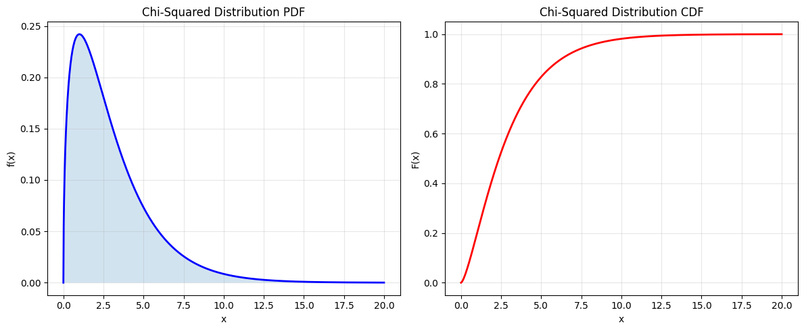
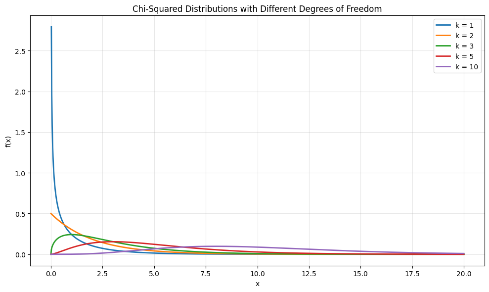
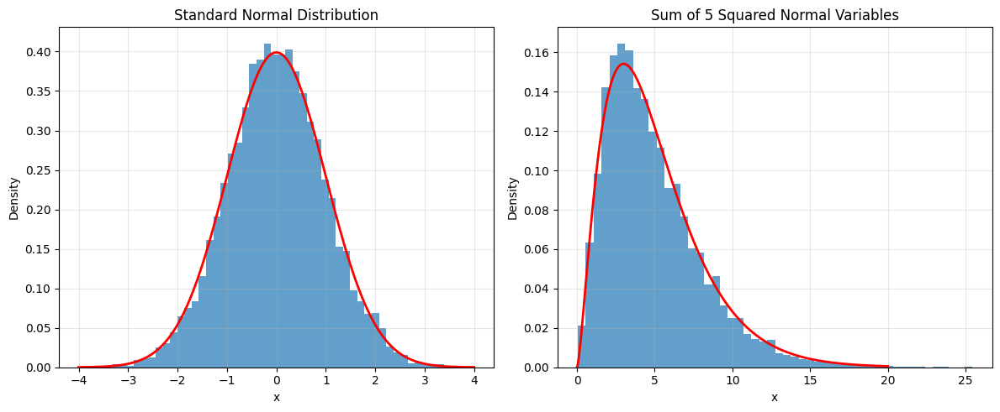
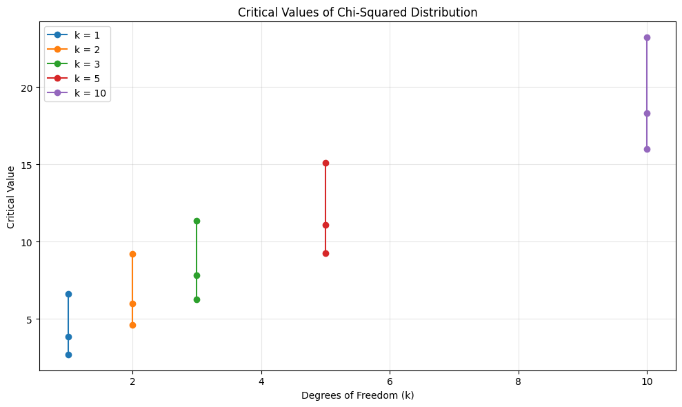

# Chi-Squared Distribution

The Chi-Squared distribution is a special case of the Gamma distribution that is widely used in statistical hypothesis testing, particularly in tests of goodness of fit and tests of independence.

## Definition

The probability density function (PDF) of the Chi-Squared distribution is:

$$f(x; k) = \begin{cases}
\frac{x^{k/2-1} e^{-x/2}}{2^{k/2} \Gamma(k/2)} & \text{for } x > 0 \\
0 & \text{for } x \leq 0
\end{cases}$$

Where:
- $k$ is the degrees of freedom ($k > 0$)
- $\Gamma(k/2)$ is the gamma function

## Properties

- **Mean**: $\mu = k$
- **Variance**: $\sigma^2 = 2k$
- **Moment Generating Function**: $M_X(t) = (1 - 2t)^{-k/2}$ for $t < 1/2$
- **Cumulative Distribution Function**: $F(x) = \frac{\gamma(k/2, x/2)}{\Gamma(k/2)}$ where $\gamma$ is the lower incomplete gamma function
- **Special Cases**:
  - When $k = 1$: Square of standard normal distribution
  - When $k = 2$: Exponential distribution with $\lambda = 1/2$
- **Additive Property**: Sum of independent chi-squared random variables is chi-squared distributed

## Relationship to Other Distributions

1. **Gamma Distribution**:
   - Chi-squared is a special case of Gamma with $\alpha = k/2$ and $\lambda = 1/2$
   - $X \sim \chi^2(k) \Rightarrow X \sim \text{Gamma}(k/2, 1/2)$

2. **Normal Distribution**:
   - Sum of squares of $k$ independent standard normal variables is chi-squared with $k$ degrees of freedom
   - If $Z_i \sim N(0,1)$, then $\sum_{i=1}^k Z_i^2 \sim \chi^2(k)$

3. **Exponential Distribution**:
   - Chi-squared with 2 degrees of freedom is exponential with $\lambda = 1/2$

## Usage in Machine Learning

The Chi-Squared distribution is important in machine learning because:
- It's used in feature selection (chi-squared test)
- It's fundamental in goodness-of-fit tests
- It's used in independence tests for categorical variables
- It's important in analysis of variance (ANOVA)
- It's used in confidence interval estimation for variance

## Visualizations

The following visualizations demonstrate key properties of the chi-squared distribution:

1. **Basic Properties**:
   
   - Shows the probability density function (PDF)
   - Demonstrates the cumulative distribution function (CDF)
   - Illustrates the effect of degrees of freedom

2. **Different Degrees of Freedom**:
   
   - Compares chi-squared distributions with different degrees of freedom
   - Shows how the shape changes with increasing degrees of freedom
   - Demonstrates the convergence to normal distribution

3. **Relationship to Normal Distribution**:
   
   - Shows how chi-squared distribution relates to normal distribution
   - Demonstrates the sum of squared normal variables
   - Illustrates the central limit theorem

4. **Critical Values**:
   
   - Shows important percentiles of the chi-squared distribution
   - Demonstrates how to find critical values for hypothesis testing
   - Illustrates the relationship between degrees of freedom and critical values

## Running the Examples

You can run the code that generates the probability examples and visualizations using:

```bash
python3 ML_Obsidian_Vault/Lectures/2/Codes/1_chi_squared_distribution.py
```

## Related Topics

- [[L2_1_Gamma_Distribution|Gamma Distribution]]: General distribution that includes chi-squared
- [[L2_1_Normal_Distribution|Normal Distribution]]: Related through sum of squares
- [[L2_1_Exponential_Distribution|Exponential Distribution]]: Special case when k=2
- [[L2_1_Hypothesis_Testing|Hypothesis Testing]]: Applications in statistical tests
- [[L2_1_Goodness_of_Fit|Goodness of Fit]]: Using chi-squared for model evaluation 