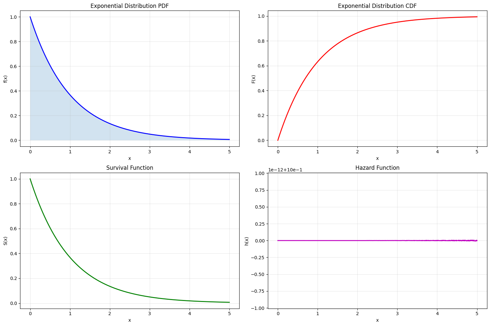
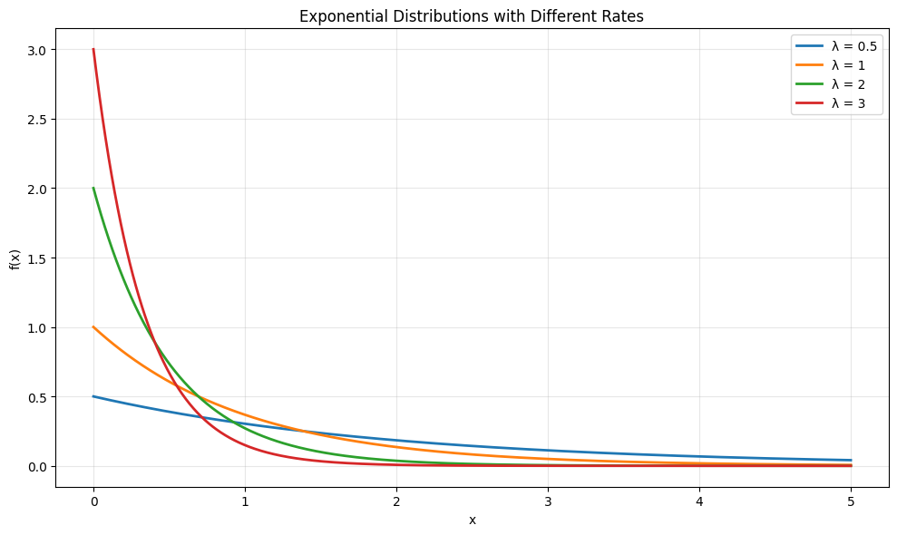
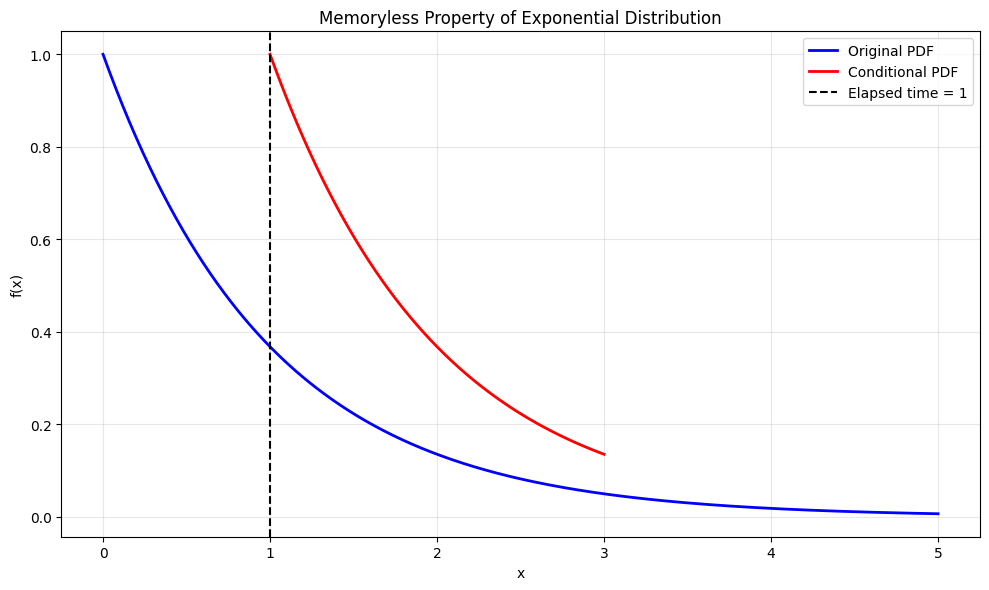
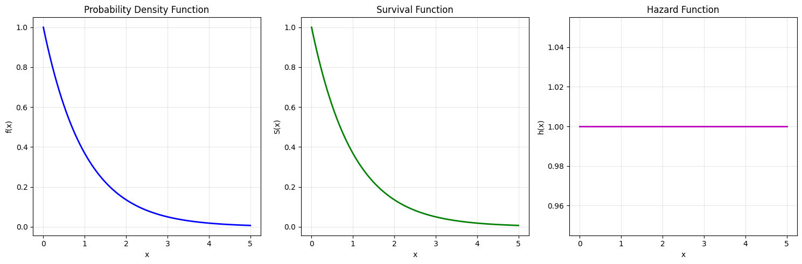

# Exponential Distribution

The Exponential distribution is a continuous probability distribution that models the time between events in a Poisson process. It's characterized by its memoryless property and constant hazard rate.

## Definition

The probability density function (PDF) of the Exponential distribution is:

$$f(x; \lambda) = \begin{cases}
\lambda e^{-\lambda x} & \text{for } x \geq 0 \\
0 & \text{for } x < 0
\end{cases}$$

Where:
- $\lambda$ is the rate parameter (events per unit time)
- $\lambda > 0$

## Properties

- **Mean**: $\mu = \frac{1}{\lambda}$
- **Variance**: $\sigma^2 = \frac{1}{\lambda^2}$
- **Moment Generating Function**: $M_X(t) = \frac{\lambda}{\lambda - t}$ for $t < \lambda$
- **Cumulative Distribution Function**: $F(x) = 1 - e^{-\lambda x}$ for $x \geq 0$
- **Memoryless Property**: $P(X > s + t | X > s) = P(X > t)$
- **Hazard Rate**: Constant hazard rate $\lambda$

## Usage in Machine Learning

The Exponential distribution is important in machine learning because:
- It's used in survival analysis and reliability engineering
- It models waiting times between events
- It's the continuous analog of the geometric distribution
- It's used in queuing theory and stochastic processes
- It's a special case of the gamma distribution

## Visualizations

The following visualizations demonstrate key properties of the exponential distribution:

1. **Basic Properties**:
   
   - Shows the probability density function (PDF)
   - Demonstrates the cumulative distribution function (CDF)
   - Illustrates the exponential decay pattern

2. **Different Rate Parameters**:
   
   - Compares Exponential(1) with Exponential(2)
   - Shows how changing the rate parameter affects the distribution
   - Demonstrates the relationship between rate and mean

3. **Memoryless Property**:
   
   - Visualizes the memoryless property
   - Shows how the remaining lifetime is independent of elapsed time
   - Demonstrates the constant hazard rate

4. **Survival Analysis**:
   
   - Shows survival function and hazard function
   - Demonstrates the relationship between PDF, CDF, and survival function
   - Illustrates the constant hazard rate property

## Running the Examples

You can run the code that generates the probability examples and visualizations using:

```bash
python3 ML_Obsidian_Vault/Lectures/2/Codes/1_exponential_distribution.py
```

## Related Topics

- [[L2_1_Continuous_Distributions|Continuous Distributions]]: Overview of continuous probability distributions
- [[L2_1_Gamma_Distribution|Gamma Distribution]]: Generalization of exponential distribution
- [[L2_1_Poisson_Distribution|Poisson Distribution]]: Related discrete distribution
- [[L2_1_Survival_Analysis|Survival Analysis]]: Applications in time-to-event analysis
- [[L2_9_Stochastic_Processes|Stochastic Processes]]: Modeling continuous-time processes 