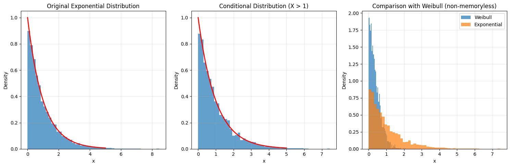
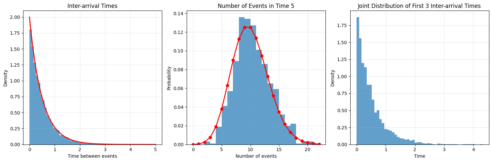
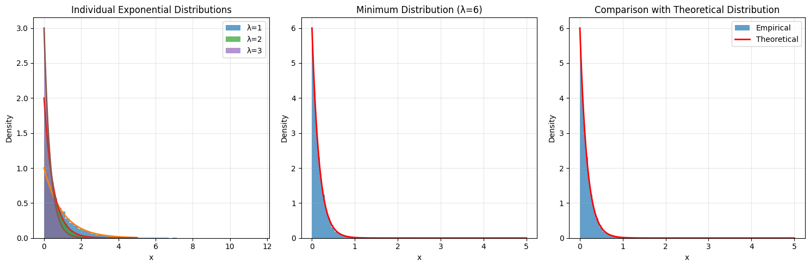
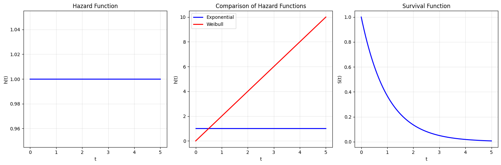
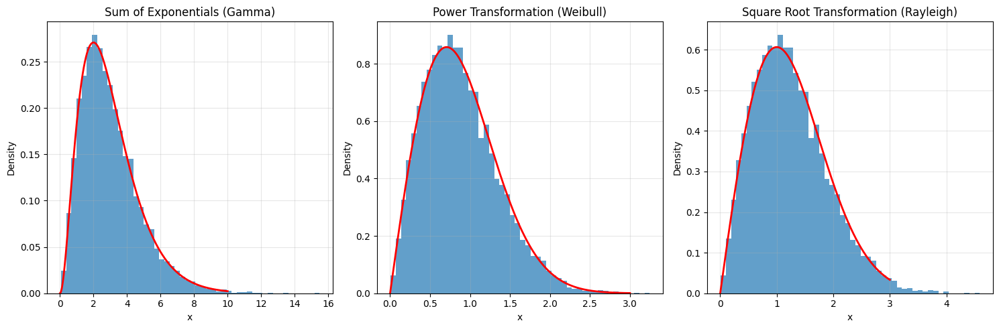

# Advanced Topics in Exponential Distribution

This note covers advanced applications and properties of the Exponential distribution in machine learning and statistics.

## Special Cases and Properties

### 1. Memoryless Property
- **Definition**: The Exponential distribution is the only continuous distribution with the memoryless property
- **Mathematical Form**:
  $$P(X > s + t | X > s) = P(X > t)$$
- **Applications**:
  - Modeling waiting times
  - Queueing theory
  - Reliability analysis
  - Survival analysis

### 2. Relationship with Poisson Process
- **Definition**: The Exponential distribution describes the inter-arrival times in a Poisson process
- **Properties**:
  - If events occur at rate λ, the time between events follows Exp(λ)
  - The number of events in a fixed time follows Poisson(λt)
- **Applications**:
  - Modeling arrival times
  - Queueing systems
  - Network traffic analysis

### 3. Minimum of Independent Exponentials
- **Definition**: The minimum of independent exponential random variables is also exponential
- **Mathematical Form**:
  If X₁ ~ Exp(λ₁), ..., Xₙ ~ Exp(λₙ) are independent, then
  $$\min(X₁, ..., Xₙ) \sim \text{Exp}(\sum_{i=1}^n \lambda_i)$$
- **Applications**:
  - Parallel systems reliability
  - First failure time analysis
  - Competing risks

## Advanced Visualizations

### 1. Memoryless Property Demonstration

- Shows how the conditional distribution remains exponential
- Demonstrates the memoryless property through simulation
- Compares with other distributions that don't have this property

### 2. Poisson Process Relationship

- Shows the connection between exponential inter-arrival times and Poisson counts
- Demonstrates how rate parameter affects both distributions
- Illustrates the relationship through simulation

### 3. Minimum of Exponentials

- Shows how the minimum of independent exponentials follows an exponential distribution
- Demonstrates the rate parameter addition property
- Compares theoretical and empirical distributions

### 4. Hazard Function Analysis

- Shows the constant hazard rate property
- Compares with other distributions' hazard functions
- Demonstrates the relationship between hazard rate and survival function

### 5. Transformations and Relationships

- Shows relationships with other distributions:
  - Gamma distribution (sum of exponentials)
  - Weibull distribution (power transformation)
  - Rayleigh distribution (square root transformation)
- Demonstrates how transformations affect the distribution

## Mathematical Details

### Memoryless Property Proof

For X ~ Exp(λ):
$$P(X > s + t | X > s) = \frac{P(X > s + t)}{P(X > s)} = \frac{e^{-\lambda(s+t)}}{e^{-\lambda s}} = e^{-\lambda t} = P(X > t)$$

### Poisson Process Relationship

For a Poisson process with rate λ:
- Inter-arrival times: Xᵢ ~ Exp(λ)
- Number of events in time t: N(t) ~ Poisson(λt)
- Joint distribution:
  $$P(N(t) = n, X₁ = x₁, ..., Xₙ = xₙ) = \lambda^n e^{-\lambda t}$$

### Minimum of Exponentials

For independent Xᵢ ~ Exp(λᵢ):
- CDF of minimum:
  $$P(\min(X₁, ..., Xₙ) > t) = \prod_{i=1}^n P(X_i > t) = e^{-t\sum_{i=1}^n \lambda_i}$$
- PDF:
  $$f_{\min}(t) = (\sum_{i=1}^n \lambda_i)e^{-t\sum_{i=1}^n \lambda_i}$$

### Hazard Function

For X ~ Exp(λ):
- Hazard function: h(t) = λ (constant)
- Survival function: S(t) = e^{-λt}
- Relationship: h(t) = f(t)/S(t)

## Running the Advanced Examples

You can generate these advanced visualizations using:

```bash
python3 ML_Obsidian_Vault/Lectures/2/Codes/1_exponential_distribution_advanced.py
```

## Related Topics

- [[L2_1_Exponential_Distribution|Basic Topics]]: Fundamental concepts and properties
- [[L2_1_Poisson_Process|Poisson Process]]: Relationship with exponential distribution
- [[L2_1_Survival_Analysis|Survival Analysis]]: Applications in time-to-event analysis
- [[L2_1_Queueing_Theory|Queueing Theory]]: Applications in service systems
- [[L2_1_Reliability_Analysis|Reliability Analysis]]: Applications in system reliability 