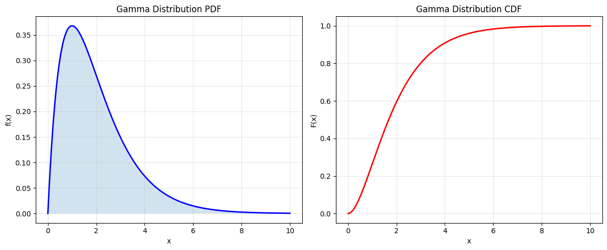
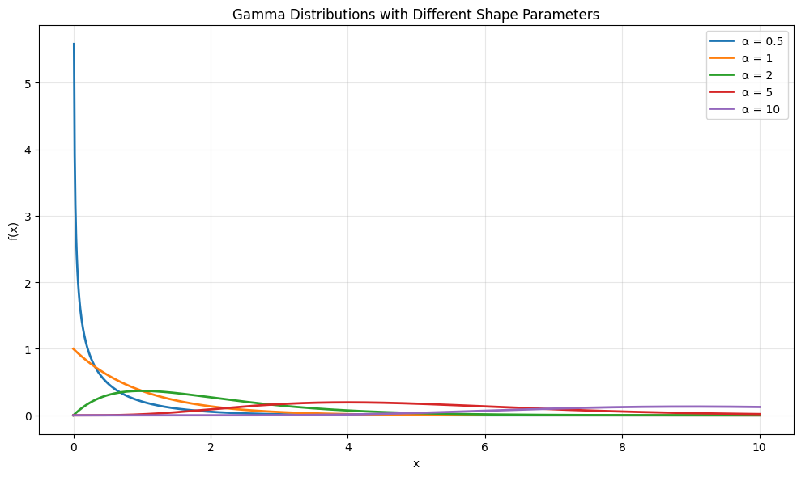
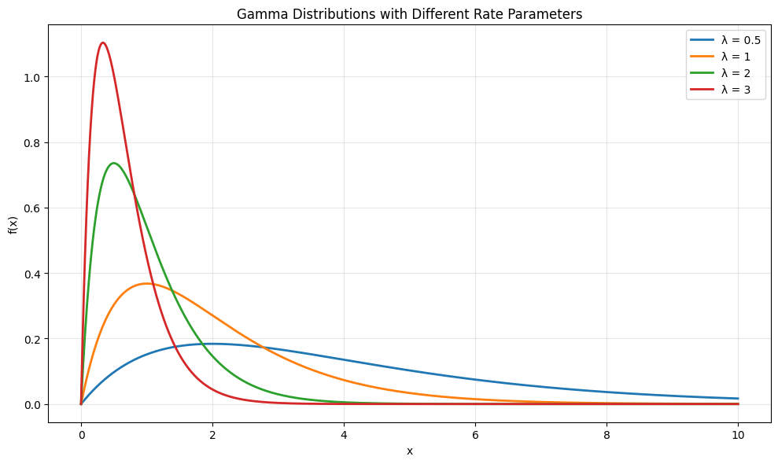
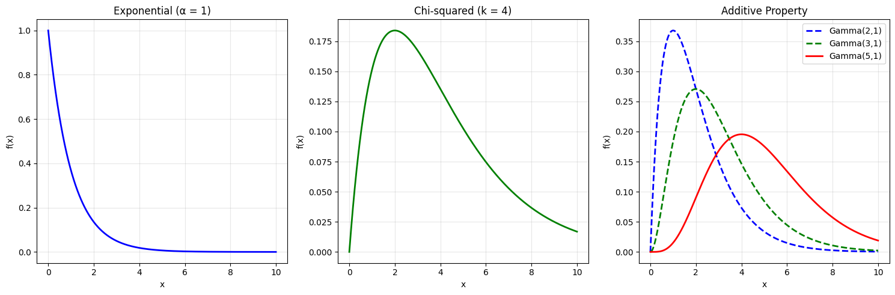

# Gamma Distribution

The Gamma distribution is a continuous probability distribution that generalizes the exponential distribution. It's commonly used to model waiting times, reliability, and Bayesian statistics.

## Definition

The probability density function (PDF) of the Gamma distribution is:

$$f(x; \alpha, \lambda) = \begin{cases}
\frac{\lambda^\alpha x^{\alpha-1} e^{-\lambda x}}{\Gamma(\alpha)} & \text{for } x > 0 \\
0 & \text{for } x \leq 0
\end{cases}$$

Where:
- $\alpha$ is the shape parameter ($\alpha > 0$)
- $\lambda$ is the rate parameter ($\lambda > 0$)
- $\Gamma(\alpha)$ is the gamma function

## Properties

- **Mean**: $\mu = \frac{\alpha}{\lambda}$
- **Variance**: $\sigma^2 = \frac{\alpha}{\lambda^2}$
- **Moment Generating Function**: $M_X(t) = \left(\frac{\lambda}{\lambda - t}\right)^\alpha$ for $t < \lambda$
- **Cumulative Distribution Function**: $F(x) = \frac{\gamma(\alpha, \lambda x)}{\Gamma(\alpha)}$ where $\gamma$ is the lower incomplete gamma function
- **Special Cases**:
  - When $\alpha = 1$: Exponential distribution
  - When $\alpha = n/2$ and $\lambda = 1/2$: Chi-squared distribution with $n$ degrees of freedom
- **Additive Property**: Sum of independent gamma random variables with same rate parameter is gamma distributed

## Usage in Machine Learning

The Gamma distribution is important in machine learning because:
- It's used in Bayesian statistics as a conjugate prior
- It models waiting times and reliability
- It's used in survival analysis
- It's a flexible distribution for positive-valued data
- It's used in hierarchical models and latent variable models

## Visualizations

The following visualizations demonstrate key properties of the gamma distribution:

1. **Basic Properties**:
   
   - Shows the probability density function (PDF)
   - Demonstrates the cumulative distribution function (CDF)
   - Illustrates the effect of shape parameter

2. **Shape Parameter Effect**:
   
   - Compares different shape parameters with fixed rate
   - Shows how the shape parameter affects the distribution's form
   - Demonstrates the transition from exponential to normal-like shapes

3. **Rate Parameter Effect**:
   
   - Compares different rate parameters with fixed shape
   - Shows how the rate parameter affects the scale
   - Demonstrates the relationship between rate and mean

4. **Special Cases**:
   
   - Shows the relationship to exponential distribution
   - Demonstrates the connection to chi-squared distribution
   - Illustrates the additive property

## Running the Examples

You can run the code that generates the probability examples and visualizations using:

```bash
python3 ML_Obsidian_Vault/Lectures/2/Codes/1_gamma_distribution.py
```

## Related Topics

- [[L2_1_Gamma_Distribution_Advanced|Advanced Topics]]: Bayesian applications, conjugacy, and MAP estimation
- [[L2_1_Continuous_Distributions|Continuous Distributions]]: Overview of continuous probability distributions
- [[L2_1_Exponential_Distribution|Exponential Distribution]]: Special case of gamma distribution
- [[L2_1_Chi_Squared_Distribution|Chi-Squared Distribution]]: Special case of gamma distribution
- [[L2_5_Bayesian_Inference|Bayesian Inference]]: Using gamma distribution as prior
- [[L2_5_Conjugate_Priors|Conjugate Priors]]: Gamma distribution in conjugate families
