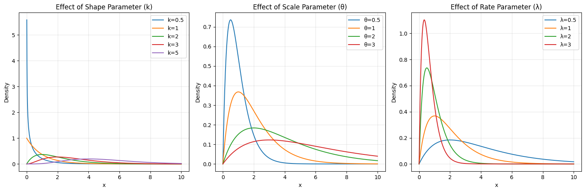
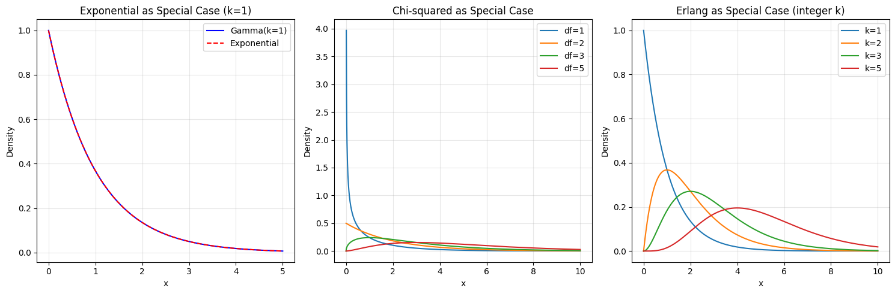
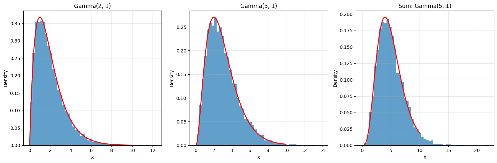
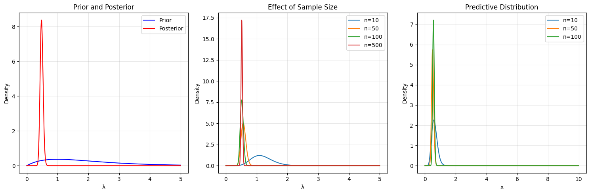
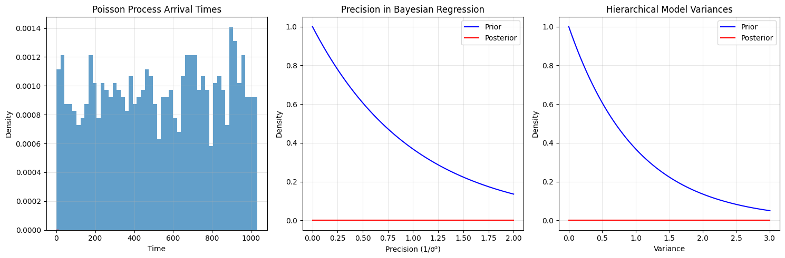
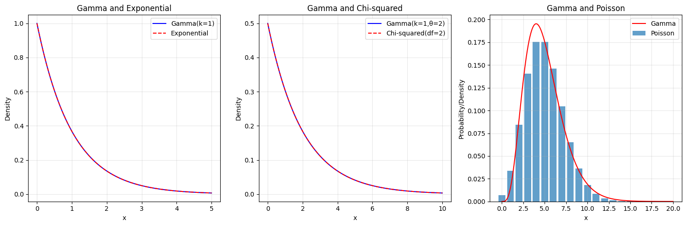

# Advanced Topics in Gamma Distribution

This note covers advanced applications and properties of the Gamma distribution in machine learning and statistics.

## Bayesian Applications

### Usage in Bayesian Inference

The Gamma distribution is particularly powerful in Bayesian analysis as:

- A **prior distribution** for precision parameters
- A **posterior distribution** (when combined with exponential/Poisson likelihood)
- A **predictive distribution** for future observations

### Effect of Parameters in Bayesian Analysis

The parameters $k$ and $\theta$ play crucial roles in Bayesian analysis:

- In the prior: Controls the strength of our prior beliefs
  - Larger $k$ indicates stronger prior beliefs
  - Smaller $k$ indicates weaker prior beliefs
- In the posterior: Represents accumulated evidence
  - $k$ increases with observed data
  - $\theta$ adjusts based on data precision

## Advanced Visualizations

### 1. Parameter Effects

- Shows how shape and scale parameters affect distribution shape
- Demonstrates the relationship between different parameterizations
- Illustrates the flexibility of the Gamma distribution

### 2. Special Cases

- Shows the relationship with Exponential, Chi-squared, and Erlang distributions
- Demonstrates how Gamma generalizes other distributions
- Illustrates the mathematical connections between distributions

### 3. Additive Property

- Shows how independent Gamma variables sum to another Gamma
- Demonstrates the mathematical properties of the distribution
- Illustrates applications in aggregation and hierarchical models

### 4. Bayesian Updating

- Shows how prior knowledge combines with new data
- Demonstrates the conjugate prior property
- Illustrates the effect of sample size on posterior

### 5. Machine Learning Applications

- Shows applications in Poisson processes
- Demonstrates use in Bayesian regression
- Illustrates hierarchical modeling applications

### 6. Distribution Relationships

- Shows connections with other distributions
- Demonstrates special cases and generalizations
- Illustrates mathematical relationships

## Mathematical Details

### Conjugate Prior Properties

For an exponential likelihood:
- Prior: $\text{Gamma}(k_0, \theta_0)$
- Data: $n$ observations, $\sum x_i$
- Posterior: $\text{Gamma}(k_0 + n, \frac{\theta_0}{1 + \theta_0\sum x_i})$

For a Poisson likelihood:
- Prior: $\text{Gamma}(k_0, \theta_0)$
- Data: $n$ observations, $\sum x_i$
- Posterior: $\text{Gamma}(k_0 + \sum x_i, \frac{\theta_0}{1 + n\theta_0})$

### MAP Estimation Formula

The MAP estimate for a Gamma-Exponential model is:

$$\lambda_{MAP} = \frac{k_0 + n - 1}{\theta_0 + \sum x_i}$$

This is:
- The mode of the posterior Gamma distribution
- A weighted combination of prior information and observed data
- Only valid when $k_0 + n > 1$

## Running the Advanced Examples

You can generate these advanced visualizations using:

```bash
python3 ML_Obsidian_Vault/Lectures/2/Codes/1_gamma_distribution_advanced.py
```

## Related Topics

- [[L2_1_Gamma_Distribution|Basic Topics]]: Fundamental concepts and properties
- [[L2_5_Bayesian_Inference|Bayesian Inference]]: General Bayesian analysis methods
- [[L2_3_Parameter_Estimation|Parameter Estimation]]: Methods for parameter estimation
- [[L2_1_Poisson_Process|Poisson Process]]: Applications in event modeling
- [[L2_5_Hierarchical_Models|Hierarchical Models]]: Multi-level statistical modeling 