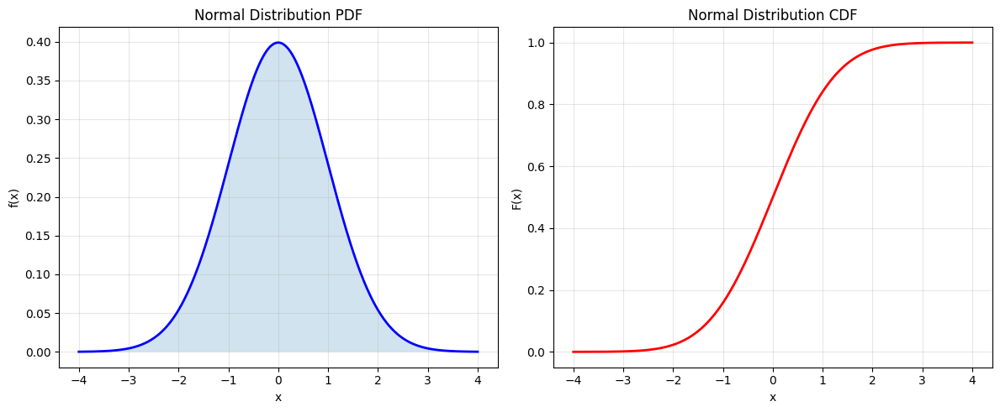
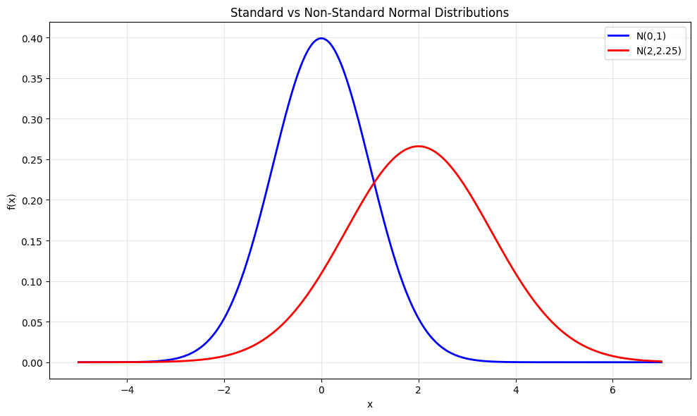
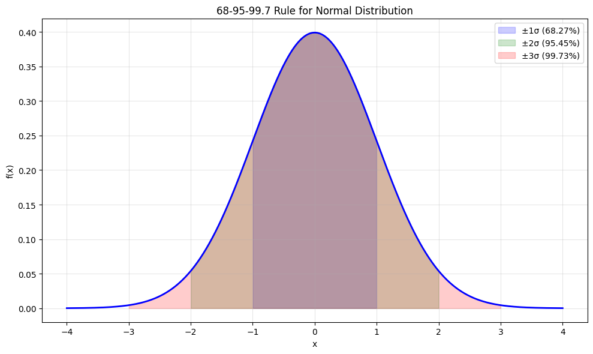
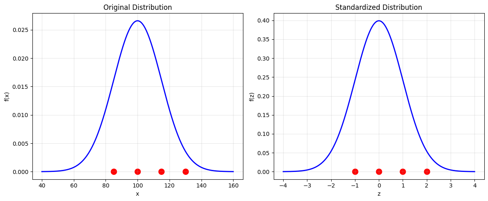
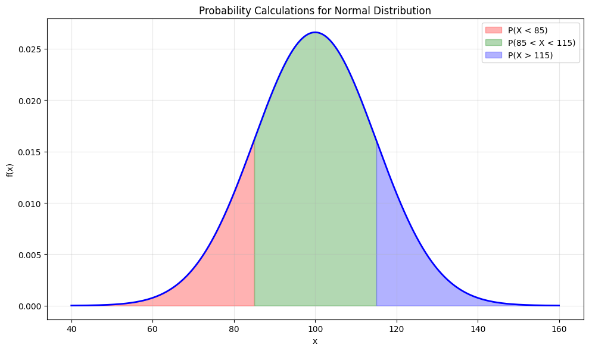
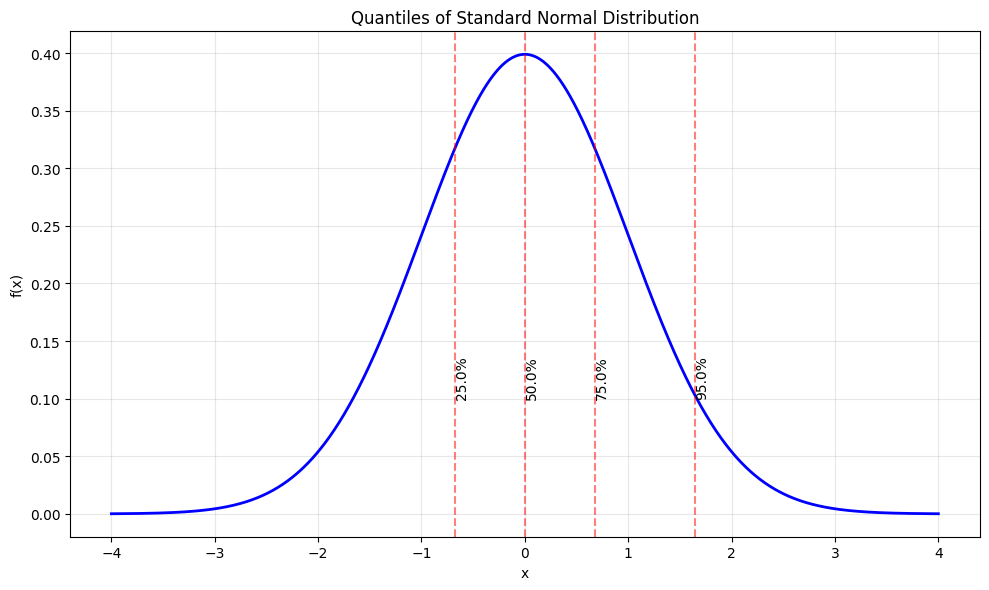
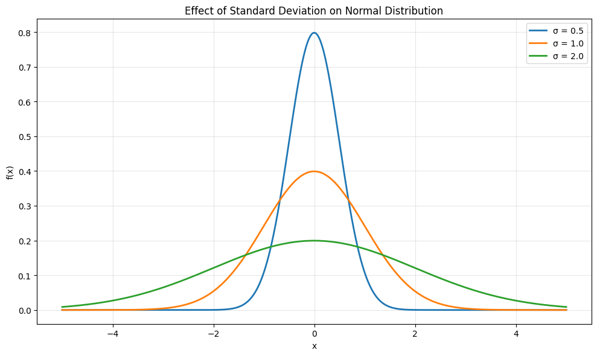
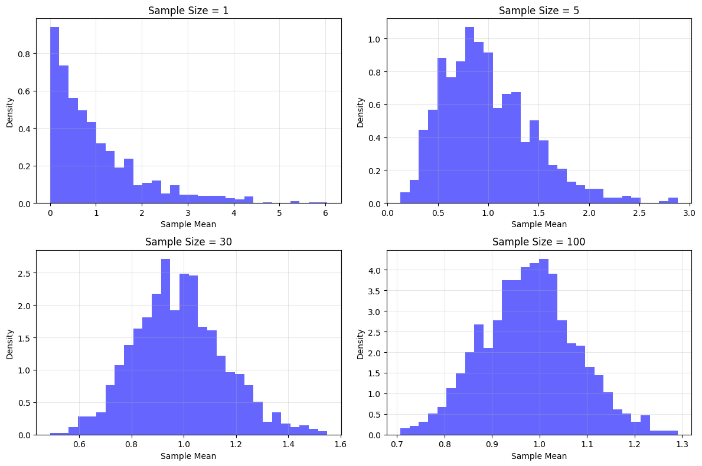
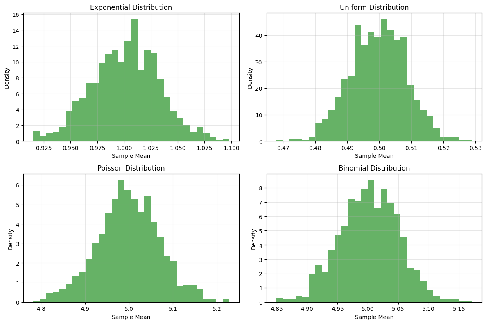

# Normal Distribution

The Normal (or Gaussian) distribution is one of the most important probability distributions in statistics and machine learning. It's a continuous distribution characterized by its bell-shaped curve.

## Definition

The probability density function (PDF) of the Normal distribution is:

$$f(x; \mu, \sigma^2) = \frac{1}{\sigma\sqrt{2\pi}} e^{-\frac{1}{2}\left(\frac{x-\mu}{\sigma}\right)^2}$$

Where:
- $\mu$ is the mean (location parameter)
- $\sigma^2$ is the variance (scale parameter)
- $\sigma$ is the standard deviation

## Properties

- **Mean, Median, Mode**: All equal to $\mu$
- **Variance**: $\sigma^2$
- **Symmetry**: Symmetric about the mean
- **Central Limit Theorem**: The sum of many independent random variables tends toward a normal distribution
  - This is one of the most important theorems in statistics
  - It explains why normal distributions are so common in nature
  - The theorem holds regardless of the original distribution of the variables
  - The approximation improves as the sample size increases
  - It's the foundation for many statistical methods and confidence intervals
- **Standard Deviation Effect**: The standard deviation (σ) controls the spread of the distribution:
  - Smaller σ results in a taller, narrower curve
  - Larger σ results in a shorter, wider curve
  - The area under the curve always equals 1

## Usage in Machine Learning

The Normal distribution is fundamental in machine learning because:
- Many natural phenomena follow normal distributions
- It's mathematically tractable and has nice properties
- It's the basis for many statistical tests and methods
- It's commonly used for modeling errors and noise in data

## Visualizations

The following visualizations demonstrate key properties of the normal distribution:

1. **Basic Properties**:
   
   - Shows the probability density function (PDF) and cumulative distribution function (CDF)
   - Demonstrates the characteristic bell-shaped curve of the PDF
   - Illustrates how the CDF smoothly increases from 0 to 1

2. **Standard vs Non-Standard Normal**:
   
   - Compares N(0,1) (standard normal) with N(2,2.25)
   - Shows how changing the mean shifts the distribution
   - Demonstrates the effect of different variances on the spread

3. **68-95-99.7 Rule**:
   
   - Visualizes the empirical rule for normal distributions
   - Shows the probability mass within 1, 2, and 3 standard deviations
   - Demonstrates that ~68% of data falls within ±1σ, ~95% within ±2σ, and ~99.7% within ±3σ

4. **Z-scores and Standardization**:
   
   - Shows how raw scores are transformed to z-scores
   - Demonstrates the standardization process
   - Illustrates how different distributions can be compared on the same scale

5. **Probability Calculations**:
   
   - Shows how to calculate probabilities for different ranges
   - Demonstrates the symmetry of normal distribution
   - Illustrates how to find probabilities for specific intervals

6. **Quantiles and Percentiles**:
   
   - Shows important percentiles of the standard normal distribution
   - Includes 25th, 50th (median), 75th, and 95th percentiles
   - Demonstrates how to find critical values for different probability levels

7. **Effect of Standard Deviation**:
   
   - Shows how different σ values affect the distribution's shape
   - Demonstrates that smaller σ results in a taller, narrower curve
   - Shows that larger σ results in a shorter, wider curve

8. **Central Limit Theorem - Sample Means**:
   
   - Shows how sample means converge to normal distribution
   - Demonstrates the effect of increasing sample size
   - Illustrates the convergence of sample means to normality

9. **Central Limit Theorem - Different Distributions**:
   
   - Shows how means from different distributions converge to normal
   - Demonstrates CLT with exponential, uniform, Poisson, and binomial distributions
   - Illustrates the universality of the Central Limit Theorem

## Running the Examples

You can run the code that generates the probability examples and visualizations using:

```bash
python3 ML_Obsidian_Vault/Lectures/2/Codes/1_normal_distribution.py
```

## Related Topics

- [[L2_1_Normal_Distribution_Advanced|Advanced Topics]]: Bayesian applications, conjugacy, and MAP estimation
- [[L2_5_Bayesian_Inference|Bayesian Inference]]: Using Normal distribution as prior/likelihood
- [[L2_3_Parameter_Estimation|Parameter Estimation]]: Estimating parameters of Normal distribution
- [[L2_7_MAP_Estimation|MAP Estimation]]: Maximum a posteriori estimation with Normal distributions
- [[L2_5_Conjugate_Priors|Conjugate Priors]]: Normal-Normal conjugacy in Bayesian analysis
- [[L2_1_Central_Limit_Theorem|Central Limit Theorem]]: Detailed explanation of why Normal distribution appears so frequently in nature
